# NATIONAL SUBSTANCE USE AND MENTAL HEALTH SERVICES SURVEY (N-SUMHSS), 2022:

## CODEBOOK

Center for Behavioral Health Statistics and Quality  
Substance Abuse and Mental Health Services Administration

# National Substance Use and Mental Health Services Survey (N-SUMHSS), 2022: Codebook

## Acknowledgements

This data file codebook was prepared for the Substance Abuse and Mental Health Services Administration (SAMHSA), under Contract No. 75S20320C00001 with SAMHSA, U.S. Department of Health and Human Services (HHS). Heydy Juarez served as the contracting officer representative.

## Terms of Use

These data are distributed under the following terms of use; by continuing past this page, you signify agreement to comply with the requirements below:

## Privacy of Study Respondents
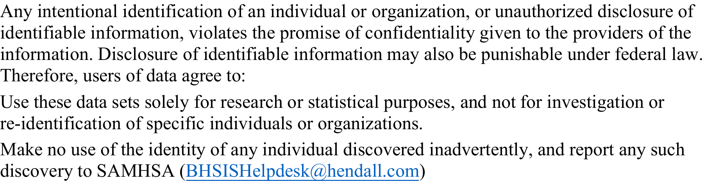

## Public Domain Notice

All material appearing in this document is in the public domain and may be reproduced or copied without permission from SAMHSA. Citation of the source is appreciated. However, this publication may not be reproduced or distributed for a fee without specific, written authorization of the Office of Communications, SAMHSA, HHS.

## Recommended Citation
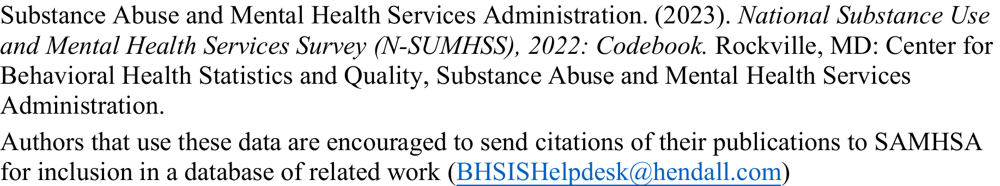

## Disclaimers

Data users acknowledge that SAMHSA bears no responsibility for use of the data or for interpretations or inferences based upon such uses.

The Substance Abuse and Mental Health Services Administration (SAMHSA) complies with applicable Federal civil rights laws and does not discriminate on the basis of race, color, national origin, age, disability, religion, or sex (including pregnancy, sexual orientation, and gender identity). SAMHSA does not exclude people or treat them

### Violations

If SAMHSA determines these terms of use agreements have been violated, possible sanctions include:
- report of the violation to the Research Integrity Officer, Institutional Review Board, or Human Subjects Review Committee of the user’s institution;
- report of the violation to the Federal Office for Human Research Protections, if the confidentiality of human subjects has been violated;
- report of the violation of federal law to the United States Attorney General for possible prosecution;
- court-awarded payments of damages to any individual(s) or organization(s) harmed by the breach of confidential data.

# Description of the National Substance Use and Mental Health Services Survey (N-SUMHSS)

For more than two decades, the Substance Abuse and Mental Health Services Administration (SAMHSA) has been collecting data on the substance use and mental health services offered by treatment facilities across the United States. In previous years, facilities reported their service offerings using two surveys—the National Survey of Substance Abuse Treatment Services (N-SSATS) and the National Mental Health Services Survey (N-MHSS). In 2021, the N-SSATS and the N-MHSS were combined into one survey—the National Substance Use and Mental Health Services Survey (N-SUMHSS). The goal of combining N-SSATS and N-MHSS was to reduce the burden on the facilities offering both substance use and mental health services, reduce the use of government resources to collect data, and increase the rate at which data can be produced by implementing one streamlined survey effort.

The 2022 N-SUMHSS was conducted from March 2022 through December 2022. The N-SUMHSS collects information from all known facilities in the United States, both public and private, that provide substance use and/or mental health treatment services.$^1$

The Center for Behavioral Health Statistics and Quality (CBHSQ) of the Substance Abuse and Mental Health Services Administration (SAMHSA), U.S. Department of Health and Human Services, plans and directs the N-SUMHSS.

The N-SUMHSS provides a mechanism for quantifying the diverse characteristics and composition of the U.S. substance use and mental health treatment delivery systems. The N-SUMHSS is designed to collect data on the location, characteristics, and utilization of organized substance use and mental health treatment services for facilities within the scope of the survey across the United States, its territories, and the District of Columbia.$^2$

The N-SUMHSS collects multipurpose data that can be used to:

- Assist SAMHSA and state and local governments in assessing the nature and extent of services provided in state-supported, state-operated, and private non-profit and for-profit substance use and mental health treatment facilities, and in forecasting substance use and mental health treatment resource requirements;

- Update SAMHSA’s Inventory of Substance Use and Mental Health Treatment Facilities (I-TF), an inventory of all known substance use and mental health treatment facilities in the United States, its territories, and the District of Columbia, which can be used as a foundation for future surveys of these facilities;

- Describe the nature and scope of substance use and mental health treatment services and conduct comparative analyses about the nation, regions, and states;
    
---

$^1$ In the 2022 N-SUMHSS report, entities responding to the N-SUMHSS are referred to as “facilities.”

$^2$ In the 2022 N-SUMHSS, territories included American Samoa, Guam, the Federated States of Micronesia, the Commonwealth of the Northern Mariana Islands, Palau, Puerto Rico, and the U.S. Virgin Islands.

- Generate the National Directory of Drug and Alcohol Use Treatment Facilities, a compendium of facilities approved by state substance use agencies for the provision of substance use treatment;
- Generate the National Directory of Mental Health Treatment Facilities; and  
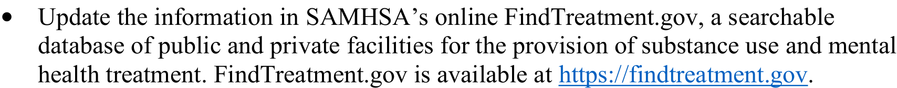  
formation in SAMHSA's online FindTreatment.gov, a searchable database of public and private facilities for the provision of substance use and mental health treatment. FindTreatment.gov is available at [https://findtreatment.gov](https://findtreatment.gov).  

# Data Collection Procedures for the 2022 N-SUMHSS

## Field period and reference date

The field period for the 2022 N-SUMHSS, which included mailing and data collection operations, ran from March 31, 2022, through December 4, 2022. The reference date was March 31, 2022.

## Survey Universe

The survey universe for the 2022 N-SUMHSS included 31,010 facilities across the United States, its territories, and the District of Columbia, of which 5,945 were found to be either closed or ineligible. Out of 25,065 facilities eligible for inclusion in the 2022 N-SUMHSS, 17,353 facilities provided substance use treatment services, 11,647 provided mental health treatment services, and 3,935 facilities provided both substance use and mental health treatment services.

Below are the major activities undertaken to make sure SAMHSA has the most complete and accurate universe of facilities possible:

- The survey database is updated to be composed of (1) those facilities that were included in the most recent survey and are in-scope, and (2) newly identified facilities that became known during the previous survey collection and are identified as eligible. Facilities that closed or were subsequently found to be out-of-scope are excluded.
- State mental health authorities (SMHAs) and state substance abuse agencies (SSAs) are contacted annually and asked to either (1) update and edit their state listing of known facilities, or (2) submit a new state listing of known facilities, using the I-TF online. The information collected through these state listings is processed and cross-checked with the database of facilities in the I-TF; newly identified facilities are screened for eligibility before being added to the survey database.
- Current facility listings are compiled annually from Data Axle (formerly the American Business Index [ABI]), and the American Hospital Association (AHA). These listings are cross-checked against the existing I-TF database. Any new facilities are screened through an augmentation telephone questionnaire to determine their eligibility for inclusion in the N-SUMHSS data collection process. The augmentation screener is also used to screen facilities that were newly identified through the previous survey and through the state listings.

When new, eligible facilities are identified between surveys, they are contacted by telephone to provide basic facility information for a "between survey update." Facilities that meet the requirements of being active, providing substance use and/or mental health treatment services as defined by SAMHSA, and responding to the annual N-SUMHSS survey are listed on

SAMHSA’s FindTreatment.gov, in the National Directory of Mental Health Treatment Facilities and in the National Directory of Drug and Alcohol Abuse Treatment Facilities.

**Survey coverage**

The following types of substance use and mental health treatment facilities were included in the 2022 N-SUMHSS:

- **Psychiatric hospitals** are facilities licensed and operated as either state/public psychiatric hospitals or as state-licensed private psychiatric hospitals that primarily provide 24-hour inpatient care to persons with mental illness. They may also provide 24-hour residential care and/or less-than-24-hour care (i.e., outpatient, partial hospitalization/day treatment), but these additional service settings are not requirements.
- **General hospitals with a separate inpatient substance use and/or psychiatric unit** are licensed general hospitals (public or private) that provide inpatient substance use and mental health services in separate units. These units must have specifically allocated staff and space for the treatment of persons with substance use problems and/or mental illness. The units may be located in the hospital itself or in a separate building that is owned by the hospital.
- **State hospitals** are hospitals funded and operated by the government of a state.
- **Veterans Affairs (VA) medical centers** are facilities operated by the U.S. Department of Veterans Affairs, including general hospitals with separate substance use and/or psychiatric inpatient units, residential treatment programs, and/or outpatient clinics.
- **Certified community behavioral health clinics** are responsible for directly providing (or contracting with partner organizations to provide) nine types of services, with an emphasis on the provision of 24-hour crisis care, utilization of evidence-based practices, care coordination, and integration with physical health care.
- **Partial hospitalization/day treatment facilities** provide only partial day substance use and mental health services to ambulatory clients, typically in sessions of three or more hours on a regular schedule.
- **Outpatient facilities** provide only outpatient substance use and/or mental health services to ambulatory clients, typically for less than three hours at a single visit. The services may include detoxification, methadone and/or buprenorphine treatment.
- **Residential treatment centers (RTCs) for children** are facilities not licensed as psychiatric hospitals that primarily provide individually planned programs of mental health treatment in a residential care setting for children under age 18 years. (Some RTCs for children may also treat young adults.) RTCs for children must have a clinical program that is directed by a psychiatrist, psychologist, social worker, or psychiatric nurse who has a master’s or doctoral degree.
- **Residential treatment centers (RTCs) for adults** are facilities not licensed as psychiatric hospitals that primarily provide individually planned programs of mental health treatment in a residential care setting for adults.

- **Multi-setting mental health facilities** provide mental health services in two or more service settings (non-hospital residential, plus either outpatient and/or partial hospitalization/day treatment), and are not classified as a psychiatric hospital, general hospital, medical center, or residential treatment center.

- **Community mental health centers (CMHCs)** provide either (1) outpatient services, including specialized outpatient services for children, the elderly, individuals who are chronically mentally ill, and residents of its mental health service area who have been discharged from inpatient treatment at a mental health facility; (2) 24-hour emergency care services; (3) day treatment or other partial hospitalization services, or psychosocial rehabilitation services; or (4) screening for patients being considered for admission to state mental health facilities to determine the appropriateness of the admission. To be classified as a CMHC, a facility must meet applicable licensing or certification requirements for CMHCs in the state in which it is located.

- **Other types of residential treatment facilities** refer to facilities not licensed as psychiatric hospitals. The primary purpose of other types of residential treatment facilities is to provide individually planned programs of mental health treatment services in a residential care setting; such facilities are not specifically for children or adults only.

- **Other** refers to another type of hospital or mental health facility not defined in the categories above.

### Exclusions

The survey universe for the 2022 N-SUMHSS excluded: (1) Department of Defense (DoD) military mental health treatment facilities; (2) individual private practitioners or small group practices not licensed as a substance use and/or mental health clinic or center; and (3) jails or prisons.

Mental health facilities are not eligible for inclusion in the survey universe if they do not fall under at least one of the categories specified under *Survey Coverage* and only provide one or more of the following services: crisis intervention services, psychosocial rehabilitation, cognitive rehabilitation, intake, referral, mental health evaluation, health promotion, psychoeducational services, transportation services, respite services, consumer-run/peer support services, housing services, or legal advocacy. Residential facilities whose primary function is not to provide specialty mental health treatment services are also not eligible for inclusion in the survey universe for the N-SUMHSS.

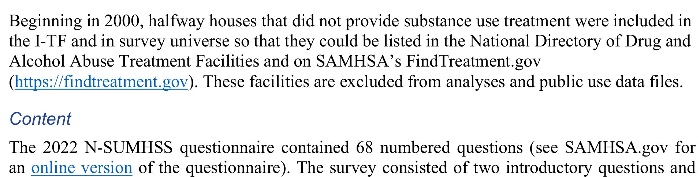

Beginning in 2000, halfway houses that did not provide substance use treatment were included in the I-TF and survey universe so that they could be listed in the National Directory of Drug and Alcohol Abuse Treatment Facilities and on SAMHSA’s FindTreatment.gov (https://findtreatment.gov). These facilities are excluded from analyses and public use data files.

### Content

The 2022 N-SUMHSS questionnaire contained 68 numbered questions (see SAMHSA.gov for [an online version of the questionnaire](https://findtreatment.gov)). The survey consisted of two introductory questions and four separate modules. The introductory questions requested information on the primary

treatment focus of the facility and whether the facility was a jail. These two questions indicated which sections of the survey each facility would be asked to complete. Facilities providing both substance use and mental health treatment services were asked to complete all four modules, while those providing only substance use were asked to complete Modules A, C, and a portion of Module D. Mental health treatment facilities that did not also offer substance use treatment services were asked to complete Modules B, C, and a portion of D. In addition, facilities operated by the Department of Veteran’s Affairs (VA) were asked to complete additional questions regarding VA services offered. These addenda included an additional seven questions for substance use facilities and twelve questions for mental health facilities.

Introductory topics included:

- primary treatment focus;
- jail, prison, or detention center status.

Topics included in the substance use portion of the survey (Module A) included:

- substance use treatment services available;
- detoxification from alcohol, benzodiazepines, opioids, cocaine methamphetamines, or other drugs and routine use of medication during detoxification;
- type of care provided, i.e.,:
  - outpatient treatment services (regular outpatient treatment, intensive outpatient treatment, day treatment or partial hospitalization, detoxification, methadone/buprenorphine maintenance or naltrexone treatment),
  - residential (non-hospital) treatment services (long-term—more than 30 days, short-term—30 days or fewer, detoxification), and
  - hospital inpatient treatment services (inpatient treatment, inpatient detoxification);
- treatment services offered (assessment and pre-treatment services, medical services, recovery support services, education and counseling services, pharmacotherapies, testing, transitional services, ancillary services, and other services);
- treatment available for opioid use disorder;
- treatment available for alcohol use disorder;
- clinical therapeutic approaches;
- provision of treatment services in sign language and/or in languages other than English;
- special programs or groups provided for specific client types;
- licensure, certification, or accreditation agencies or organizations;
- payment type or insurance accepted;

Topics in the mental health portion of the survey (Module B) included:

- services offered;
- type of care provided, i.e.;

- 24-hour hospital inpatient,
- 24-hour residential,
- partial hospitalization/day treatment, and
- outpatient treatment services;

- type of mental health facility (e.g., psychiatric hospital, separate inpatient unit of a general hospital, state hospital, residential treatment center for children, etc.);
- treatment modalities for mental health treatment;
- use of antipsychotics and type of medications used;
- services offered (intensive case management, court-ordered treatment, integrated primary care services, education services, suicide prevention services, etc.);
- age groups accepted for treatment;
- special programs or groups provided for specific client types;
- availability of emergency psychiatric services;
- provision of treatment services in sign language and/or in languages other than English;
- quality improvement practices;
- use of seclusion or restraint;
- payment types or insurance accepted;
- licensure, certification, or accreditation agencies or organizations;

Topics in the treatment facility information portion of the survey (Module C) included:
- Federally Qualified Health Center (FQHC) status;
- facility operating entity;
- religious or faith-based organization affiliation;
- facility smoking and vaping policies;
- payment and fee information;
- listing preferences for SAMHSA’s online FindTreatment.gov and Directory;
- parent organization information, if applicable;

Topics in the client counts portion of the survey (Module D) included:
- number of facilities included in the counts;
- number of clients receiving inpatient, residential, and outpatient substance use disorder treatment services on March 31, 2022;
- number of inpatient and residential beds designated for substance use disorder treatment on March 31, 2022;
- number of clients in treatment for use of 1) both alcohol and substances other than alcohol; 2) only alcohol; 3) only substances other than alcohol;

- percentage of substance use clients with diagnosed co-occurring mental disorder and substance use disorder;
- number of substance use disorder treatment admissions for the most recent 12-month period;
- number of clients receiving inpatient, residential, and outpatient mental health treatment on March 31, 2022;
- number of inpatient and residential beds designated for mental disorder treatment on March 31, 2022;
- number of mental disorder treatment admissions, readmissions, and incoming transfers between April 1, 2021, and March 31, 2022;
- percentage of total admissions that were military veterans.

### Data collection

There were three data collection modes employed: a secure web-based questionnaire, a paper questionnaire sent by mail, and a computer-assisted telephone interview (CATI). Approximately three weeks before the survey launch date (March 31, 2022), SAMHSA mailed letters to the attention of the facility directors of all eligible facilities to alert them to expect the survey and to request their participation in the N-SUMHSS. The letter also served to update records with new address information received from the U.S. Postal Service. A data collection packet (including a SAMHSA cover letter, a state-specific letter of support, information on completing the survey on the web, and a fact sheet of frequently asked questions) was mailed to each facility on March 31, 2022. The web-based survey also became available at the same time. At this point, each facility had the option of completing the questionnaire via the secure survey website or asking for a paper questionnaire to complete and return via postal mail. In August 2022, another similar packet was sent to non-responding facilities, this time including a copy of the questionnaire, a definitions packet, and a postage-paid return envelope.

During the data collection phase, contract personnel were available by telephone to answer facilities’ questions concerning the survey. Facilities completing the questionnaire on the Internet had access to hyperlinks to an information site containing definitions of the survey elements. Multiple reminder letters were sent to non-responders over the course of the data collection period via mail and e-mail. To increase the survey response rate, state substance use and mental health agency representatives were contacted during the data collection period to inform them of their state’s progress and to request additional help in encouraging responses. CATI follow-up (assisted telephone interviews) of non-respondents began in July 2022 and ended in November 2022.

### Eligibility and unit response rate

Table 1.1 presents a summary of eligibility and response rate information. Of the 15,624 mental health treatment facilities in the survey, 25.5 percent were found to be ineligible for the survey because they did not provide mental health treatment services; had a primary treatment focus of substance use services or general health care; provided treatment for incarcerated persons only (i.e., in jails or prisons); were an individual or small group mental health practice not licensed or certified as a mental health center or clinic; or were closed. Of the 20,898 substance use treatment facilities in the survey, 17.0 percent were found to be ineligible for the survey because they had closed or did not provide substance use treatment or detoxification.

# Table 1.1. N-SUMHSS treatment facilities by status, mode of response, and type of facility: 2022

## 10_0.png
|                           | Substance Use Facilities |             | Mental Health Facilities |             | Combined Substance Use and Mental Health Facilities¹ |             |
|---------------------------|--------------------------|-------------|-------------------------|-------------|-----------------------------------------------------|-------------|
|                           | N                        | %           | N                       | %           | N                                                   | %           |
| Total facilities in survey| 20,898                   | 100.0       | 15,624                  | 100.0       | 5,512                                               | 100.0       |
| Closed or ineligible      | 3,545                    | 17.0        | 3,977                   | 25.5        | 1,577                                               | 28.6        |
| Eligible                  | 17,353                   | 83.0        | 11,647                  | 74.5        | 3,935                                               | 71.4        |
| Total eligible            | 17,353                   | 100.0       | 11,647                  | 100.0       | 3,935                                               | 100.0       |
| Non-respondents           | 2,283                    | 13.2        | 1,995                   | 17.1        | 621                                                 | 15.8        |
| Respondents               | 15,070                   | 86.8        | 9,652                   | 82.9        | 3,314                                               | 84.2        |

## 10_1.png
|                           | Substance Use Facilities |            | Mental Health Facilities |            | Combined Substance Use and Mental Health Facilities¹ |            |
|---------------------------|--------------------------|------------|-------------------------|------------|-----------------------------------------------------|------------|
|                           | N                        | %          | N                       | %          | N                                                   | %          |
| Total facilities in survey|                          |            |                         |            |                                                     |            |
| Closed or ineligible      | 44                       | 0.3        | --                      | --         | 7                                                   | 0.2        |
| Roll-ups²                 | 172                      | 1.0        | 66                      | 0.6        | 27                                                  | 0.7        |
| Eligible for report       | 14,854                   | 85.6       | 9,586                   | 82.3       | 3,280                                               | 83.4       |

## Mode of response
|                           | N                        | %          | N                       | %          | N                                                   | %          |
|---------------------------|--------------------------|------------|-------------------------|------------|-----------------------------------------------------|------------|
|                           | 14,854                   | 100.0      | 9,586                   | 100.0      | 3,280                                               | 100.0      |
| Mail                      | 14,590                   | 98.2       | 9,459                   | 98.7       | 3,246                                               | 99.0       |
| Mail                      | 146                      | 1.0        | 77                      | 0.8        | 25                                                  | 0.8        |
| Telephone                 | 118                      | 0.8        | 50                      | 0.5        | 9                                                   | 0.3        |

## 10_2.png
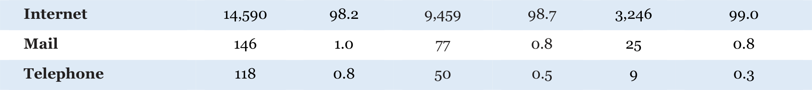

---

¹ Facility counts and percentages are not mutually exclusive because facilities offering both substance use and mental health treatment services are included in substance use and mental health facility counts. Therefore, caution should be exercised while adding, comparing, or interpreting counts and percentages across facility types.  
² Facilities excluded from the substance use counts included 22 non-treatment halfway houses, 4 solo practices not approved by the state agency for inclusion.  
³ Facilities whose client counts were included in or “rolled into” other facilities’ counts and whose facility characteristics were not reported separately.  
SOURCE: Center for Behavioral Health Statistics and Quality, Substance Abuse and Mental Health Services Administration, National Substance Use and Mental Health Services Survey (N-SUMHSS) 2022.  
National Substance Use and Mental Health Services Survey (N-SUMHSS): 2022 | 11

## Facility Reporting and Selection for the 2022 N-SUMHSS Report

Of the 11,647 mental health facilities eligible for the survey, 9,652 (82.9 percent) completed the survey, including 66 facilities whose client counts were included in or “rolled into” other facilities’ counts and whose facility characteristics were not reported separately [Table 1.1]. (These 66 facilities were excluded from the report). After excluding the roll-up of 66 mental health facilities, 9,586 eligible respondent mental health facilities were included in the 2022 N-SUMHSS report. Of the respondents that were eligible for the report, 98.7 percent completed the survey on the web, 0.8 percent through the mail, and 0.5 percent on the telephone.

Of the 17,353 substance use facilities eligible for the survey, 15,070 (86.8 percent) completed the survey, including 22 facilities that were halfway houses that did not provide substance use treatment, 4 facilities that were solo practitioners, and 18 facilities that provided administrative services only. These 44 facilities were excluded from the report but have been included in SAMHSA’s online FindTreatment.gov. In addition to the facilities that were excluded from the report, there were 172 substance use facilities whose client counts were included in or “rolled into” other facilities’ counts and whose facility characteristics were not reported separately [Table 1.1]. After excluding the 44 out-of-scope substance use facilities and the roll-up of 172 substance use facilities, 14,854 eligible respondent substance use facilities were included in the 2022 N-SUMHSS report. Of the respondents that were eligible for the report, 98.2 percent completed the survey on the web, 1.0 percent through the mail, and 0.8 percent on the telephone.

Of the mental health and substance use facilities eligible for the survey, 3,935 provided both mental health and substance use services. 3,314 (84.2 percent) of these completed the survey, including 7 whose mental health or substance use responses were excluded from the report and 27 whose client counts were included or “rolled into” other facilities’ counts and whose facility characteristics were not reported separately. After the exclusion of these facilities, 3,280 eligible respondent facilities providing both mental health and substance use services were included in the 2022 N-SUMHSS report. Of these, 99.0 percent completed the survey on the web, 0.8 percent through the mail, and 0.3 percent on the telephone.

## Quality Assurance

All completed mail questionnaires underwent a manual review for consistency and missing data. Calls to facilities clarified questionable responses and obtained missing data. After data entry, automated quality assurance reviews were conducted on all survey response data. The reviews incorporated the rules used in manual editing in addition to consistency checks not readily identified by manual review.

## Response Rates

The final unit response rate among facilities eligible for the survey was 88.0 percent.

## Data Considerations and Limitations

As with any data collection effort, certain procedural considerations and data limitations must be considered when interpreting data from the 2022 N-SUMHSS. Some general issues are listed below. Considerations and limitations of specific data items are discussed where the data are presented.

- The N-SUMHSS is a voluntary survey, and while every effort is made to obtain responses from all known substance use and mental health treatment facilities within the scope of the survey, some facilities did not respond. There was no adjustment for the 12 percent facility non-response.

- The N-SUMHSS is a point-prevalence survey. It provides information on the substance use and mental health treatment system and its clients as of a pre-selected reference date (March 31, 2022). Client counts reported here do not represent annual totals. Rather, the N-SUMHSS provides a snapshot of substance use and mental health treatment facilities and clients on an average day or month.
- Multiple responses were allowed for certain questionnaire items (e.g., services provided in non-English languages and type of payment or insurance accepted for treatment services). Tabulations of data for these items include the total number of facilities reporting each response category.
- Reported client count totals that fell within a variance of +/- 10 and client percentages that fell within a variance of +/- 5 were not adjusted. Therefore, the public use file includes percentage values of greater than 100.
- The N-SUMHSS is an integration of the legacy N-SSATS and N-MHSS surveys. The creation of a single survey instrument introduced a data validation issue with the way facilities responded to Questions 1, 1a, A1, A1a, and B1 where respondents were asked about the type of services offered. Some facilities would only accept patients for either mental health or substance use treatment services. However, if that patient had a co-occurring substance use or mental health need outside of their intake diagnostic requirement, they would be offered treatment at that facility as well. For these facilities that will only accept either substance use or mental health clients, but will offer co-occurring treatment, a data change was made to accurately reflect their primary mode of treatment.
- The integration of the N-SSATS and the N-MHSS surveys also introduced the possibility of duplicate records for facilities that had previously completed each survey and beginning in 2021 were now only asked to complete the N-SUMHSS once. Facility information was carefully reviewed to ensure unduplicated information, but it is possible that duplicate facilities with updated contact information were not identified.

## FREQUENCIES

Note: The number in parentheses that follows each variable’s headline description, e.g. “(Q.7),” denotes the corresponding question and response in the survey instrument from which the variable is drawn

National Substance Use and Mental Health Services Survey (N-SUMHSS): 2022

**MPRID: Master ID**

Generated case (record) identifier. A frequency distribution of this variable is not shown; each case has a unique value generated for identification purposes.

Variable Type: character

---
**National Substance Use and Mental Health Services Survey (N-SUMHSS): 2022**

### included in the substance use I-TF

| Value | Label       | Frequency | %     |
|-------|-------------|-----------|-------|
| 1     | Yes         | 20,898    | 67.4% |
| M     | Missing Data| 10,112    | 32.6% |
|       | **Total**   | **31,010**| **100%** |

Variable Type: numeric.

National Substance Use and Mental Health Services Survey (N-SUMHSS): 2022 | 16

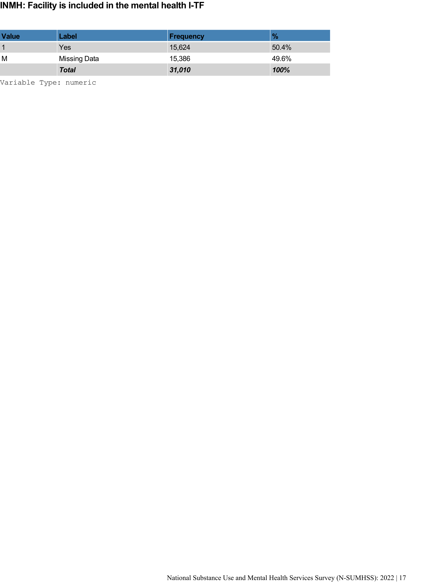

# TE: Facility state

| Value | Label | Frequency | % |
|-------|-------|-----------|---|
| AK    | Alaska        | 184  | 0.6% |
| AL    | Alabama       | 351  | 1.1% |
| AR    | Arkansas      | 382  | 1.2% |
| AZ    | Arizona       | 894  | 2.9% |
| CA    | California    | 3,201| 10.3% |
| CO    | Colorado      | 559  | 1.8% |
| CT    | Connecticut   | 408  | 1.3% |
| DC    | District of Columbia | 83   | 0.3% |
| DE    | Delaware      | 101  | 0.3% |
| FL    | Florida       | 1,389| 4.5% |
| GA    | Georgia       | 609  | 2.0% |
| HI    | Hawaii        | 199  | 0.6% |
| IA    | Iowa          | 328  | 1.1% |
| ID    | Idaho         | 292  | 0.9% |
| IL    | Illinois      | 1,217| 3.9% |
| IN    | Indiana       | 678  | 2.2% |
| KS    | Kansas        | 300  | 1.0% |
| KY    | Kentucky      | 777  | 2.5% |
| LA    | Louisiana     | 445  | 1.4% |
| MA    | Massachusetts | 860  | 2.8% |
| MD    | Maryland      | 849  | 2.7% |
| ME    | Maine         | 408  | 1.3% |
| MI    | Michigan      | 798  | 2.6% |
| MN    | Minnesota     | 827  | 2.7% |
| MO    | Missouri      | 534  | 1.7% |
| MS    | Mississippi   | 307  | 1.0% |
| MT    | Montana       | 246  | 0.8% |
| NC    | North Carolina| 1,060| 3.4% |
| ND    | North Dakota  | 125  | 0.4% |
| NE    | Nebraska      | 254  | 0.8% |
| NH    | New Hampshire | 204  | 0.7% |
| NJ    | New Jersey    | 822  | 2.7% |
| NM    | New Mexico    | 264  | 0.9% |
| NV    | Nevada        | 231  | 0.7% |
| NY    | New York      | 1,847| 6.0% |
| OH    | Ohio          | 1,374| 4.4% |
| OK    | Oklahoma      | 354  | 1.1% |
| OR    | Oregon        | 474  | 1.5% |
| PA    | Pennsylvania  | 1,278| 4.1% |
| PR    | Puerto Rico   | 167  | 0.5% |
| RI    | Rhode Island  | 125  | 0.4% |
| SC    | South Carolina| 253  | 0.8% |
| SD    | South Dakota  | 108  | 0.3% |
| TN    | Tennessee     | 590  | 1.9% |
| TX    | Texas         | 1,099| 3.5% |
| UT    | Utah          | 594  | 1.9% |
| VA    | Virginia      | 610  | 2.0% |
| VT    | Vermont       | 124  | 0.4% |

National Substance Use and Mental Health Services Survey (N-SUMHSS): 2022 | 18

## TE: Facility state

| Value | Label             | Frequency |   %  |
|-------|-------------------|-----------|-------|
| WA    | Washington        | 827       | 2.7% |
| WI    | Wisconsin         | 658       | 2.1% |
| WV    | West Virginia     | 236       | 0.8% |
| WY    | Wyoming           | 83        | 0.3% |
| ZZ    | Other Jurisdictions | 23      | 0.1% |
|**Total** |                | **31,010** | **100%** |

Variable Type: character

## Treatment Focus (Q.1)

| Value | Label                                                 | Frequency | %      |
|-------|-------------------------------------------------------|-----------|--------|
| 1     | Substance use treatment services                      | 6,995     | 22.6%  |
| 2     | Mental health services                                | 6,166     | 19.9%  |
| 3     | Mix mental health & substance use treatment services  | 9,134     | 29.5%  |
| 4     | No mental health or substance use treatment services  | 570       | 1.8%   |
| M     | Missing Data                                          | 8,145     | 26.3%  |

**Total**: 31,010 (100%)

Variable Type: numeric

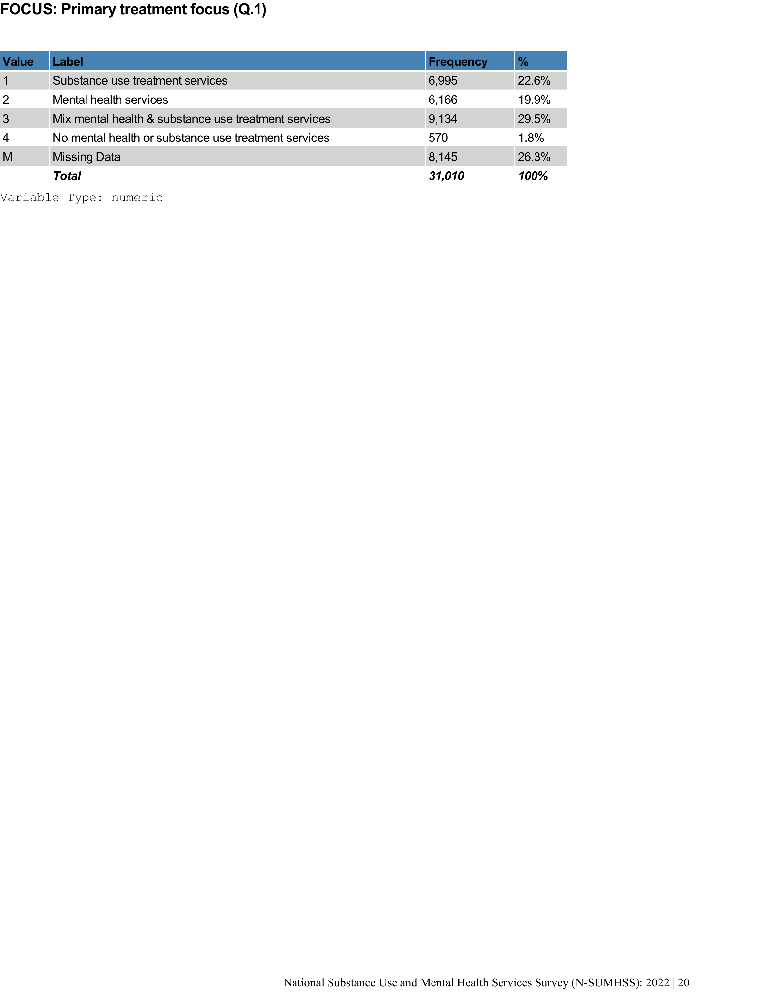

#### O: Offered substance use treatment also (Q.1a)

| Value | Label        | Frequency | %    |
|-------|--------------|-----------|------|
| 0     | No           | 5,206     | 16.8%|
| 1     | Yes          | 960       | 3.1% |
| L     | Logical Skip | 16,697    | 53.8%|
| M     | Missing Data | 8,147     | 26.3%|

**Total**: 31,010  **100%**

Variable Type: numeric

n, or other (Q.2)

| Value | Label         | Frequency | %      |
|-------|---------------|-----------|--------|
| 0     | No            | 22,274    | 71.8%  |
| L     | Logical Skip  | 570       | 1.8%   |
| M     | Missing Data  | 8,166     | 26.3%  |

**Total** | **31,010** | **100%**

Variable Type: numeric

---

National Substance Use and Mental Health Services Survey (N-SUMHSS): 2022 | 22

# Offered intake/assessment/referral (Q.A1)

| Value | Label         | Frequency | %      |
|-------|---------------|-----------|--------|
| 0     | No            | 575       | 1.9%   |
| 1     | Yes           | 16,491    | 53.2%  |
| L     | Logical Skip  | 5,786     | 18.7%  |
| M     | Missing Data  | 8,158     | 26.3%  |
|       | **Total**     | **31,010**| **100%**|

Variable Type: numeric

National Substance Use and Mental Health Services Survey (N-SUMHSS): 2022 | 23

# I detoxification (Q.A1)

| Value | Label         | Frequency |     %    |
|-------|---------------|-----------|----------|
| 0     | No            | 13,524    |  43.6%   |
| 1     | Yes           |  3,554    |  11.5%   |
| L     | Logical Skip  |  5,786    |  18.7%   |
| M     | Missing Data  |  8,146    |  26.3%   |
| **Total** |           | **31,010**| **100%** |

Variable Type: numeric

### Offered substance use treatment (Q.A1)

| Value | Label        | Frequency | %     |
|-------|--------------|-----------|-------|
| 0     | No           | 272       | 0.9%  |
| 1     | Yes          | 16,807    | 54.2% |
| L     | Logical Skip | 5,786     | 18.7% |
| M     | Missing Data | 8,145     | 26.3% |
| **Total** |              | **31,010**  | **100%** |

Variable Type: numeric

# U: Offered co-occurring serious mental illness (SMI)/serious emotional disturbance (SED) and substance use disorder (SUD) (Q.A1)

| Value | Label       | Frequency | %     |
|-------|-------------|-----------|-------|
| 0     | No          | 6,437     | 20.8% |
| 1     | Yes         | 10,634    | 34.3% |
| L     | Logical Skip| 5,786     | 18.7% |
| M     | Missing Data| 8,153     | 26.3% |
|       | **Total**   | 31,010    | **100%** |

Variable Type: numeric

National Substance Use and Mental Health Services Survey (N-SUMHSS): 2022 | 26

### Other substance use services offered (Q.A1)

| Value | Label         | Frequency | %      |
|-------|---------------|-----------|--------|
| 0     | No            | 6,515     | 21.0%  |
| 1     | Yes           | 10,549    | 34.0%  |
| L     | Logical Skip  | 5,786     | 18.7%  |
| M     | Missing Data  | 8,160     | 26.3%  |
|       | **Total**     | **31,010**| **100%**|

Variable Type: numeric

---

National Substance Use and Mental Health Services Survey (N-SUMHSS): 2022 | 27

s mental health treatment to substance use clients (Q.A1a)

| Value | Label        | Frequency | %     |
|-------|--------------|-----------|-------|
| 0     | No           | 2,021     | 6.5%  |
| 1     | Yes          | 14,868    | 47.9% |
| L     | Logical Skip | 5,786     | 18.7% |
| M     | Missing Data | 8,335     | 26.9% |
|       | **Total**    | **31,010**| **100%**|

Variable Type: numeric

National Substance Use and Mental Health Services Survey (N-SUMHSS): 2022 | 28

Offers mental health treatment to non-substance use clients (Q.A1a)

| Value | Label        | Frequency | %     |
|-------|--------------|-----------|-------|
| 0     | No           | 7,124     | 23.0% |
| 1     | Yes          | 9,737     | 31.4% |
| L     | Logical Skip | 5,786     | 18.7% |
| M     | Missing Data | 8,363     | 27.0% |
| **Total** |              | **31,010** | **100%** |

Variable Type: numeric

## s no mental health treatment (Q.A1a)

| Value | Label         | Frequency | %      |
|-------|---------------|-----------|--------|
| 0     | No            | 15,104    | 48.7%  |
| 1     | Yes           | 1,803     | 5.8%   |
| L     | Logical Skip  | 5,786     | 18.7%  |
| M     | Missing Data  | 8,317     | 26.8%  |
| **Total** | **31,010**    | **100%** |

Variable Type: numeric

## xify from alcohol (Q.A2)

| Value | Label        | Frequency | %     |
|-------|--------------|-----------|-------|
| 0     | No           | 926       | 3.0%  |
| 1     | Yes          | 2,651     | 8.5%  |
| L     | Logical Skip | 5,856     | 18.9% |
| M     | Missing Data | 21,577    | 69.6% |
| **Total** |          | **31,010**| **100%** |

Variable Type: numeric

National Substance Use and Mental Health Services Survey (N-SUMHSS): 2022 | 31

## xxify from benzodiazepines (Q.A2)

| Value | Label        | Frequency | %     |
|-------|--------------|-----------|-------|
| 0     | No           | 1,105     | 3.6%  |
| 1     | Yes          | 2,471     | 8.0%  |
| L     | Logical Skip | 5,856     | 18.9% |
| M     | Missing Data | 21,578    | 69.6% |
|       | **Total**    | **31,010**| **100%** |

Variable Type: numeric

### Detoxify from cocaine (Q.A2)

| Value | Label        | Frequency | %    |
|-------|--------------|-----------|------|
| 0     | No           | 1,409     | 4.5% |
| 1     | Yes          | 2,167     | 7.0% |
| L     | Logical Skip | 5,856     | 18.9%|
| M     | Missing Data | 21,578    | 69.6%|

|       | **Total**    | **31,010**| **100%**|

Variable Type: numeric

## xify from methamphetamines (Q.A2)

| Value | Label        | Frequency | %       |
|-------|--------------|-----------|---------|
| 0     | No           | 1,357     | 4.4%    |
| 1     | Yes          | 2,219     | 7.2%    |
| L     | Logical Skip | 5,856     | 18.9%   |
| M     | Missing Data | 21,578    | 69.6%   |
| **Total**     |              | **31,010**    | **100%**   |

Variable Type: numeric

### Identify from opioids (Q.A2)

| Value | Label         | Frequency | %     |
|-------|---------------|-----------|-------|
| 0     | No            | 194       | 0.6%  |
| 1     | Yes           | 3,382     | 10.9% |
| L     | Logical Skip  | 5,856     | 18.9% |
| M     | Missing Data  | 21,578    | 69.6% |
| **Total** |           | **31,010** | **100%** |

Variable Type: numeric

%2022%20%7C%2035)

### xxify from other substances (Q.A2)

| Value | Label         | Frequency | %    |
|-------|---------------|-----------|------|
| 0     | No            | 2,869     | 9.3% |
| 1     | Yes           | 681       | 2.2% |
| L     | Logical Skip  | 5,856     | 18.9%|
| M     | Missing Data  | 21,604    | 69.7%|
|       | **Total**     | **31,010**|**100%**|

Variable Type: numeric

National Substance Use and Mental Health Services Survey (N-SUMHSS): 2022 | 36

#### routinely uses detoxification with medications (Q.A2a)

| Value | Label        | Frequency | %     |
|-------|--------------|-----------|-------|
| 0     | No           | 461       | 1.5%  |
| 1     | Yes          | 3,252     | 10.5% |
| L     | Logical Skip | 5,856     | 18.9% |
| M     | Missing Data | 21,441    | 69.1% |
| **Total** |          | **31,010** | **100%** |

Variable Type: numeric

### o practice (Q.A3)

| Value | Label        | Frequency | %      |
|-------|--------------|-----------|--------|
| 0     | No           | 16,192    | 52.2%  |
| 1     | Yes          | 834       | 2.7%   |
| L     | Logical Skip | 5,786     | 18.7%  |
| M     | Missing Data | 8,198     | 26.4%  |
|       | Total        | 31,010    | 100%   |

Variable Type: numeric

---

National Substance Use and Mental Health Services Survey (N-SUMHSS): 2022 | 38

# Inpatient substance use care offered currently (Q.A4)

| Value | Label         | Frequency | %      |
|-------|---------------|-----------|--------|
| 0     | No            | 15,933    | 51.4%  |
| 1     | Yes           | 1,130     | 3.6%   |
| L     | Logical Skip  | 5,786     | 18.7%  |
| M     | Missing Data  | 8,161     | 26.3%  |
|       | **Total**     | **31,010**| **100%**|

Variable Type: numeric

## Hospital inpatient detoxification care offered (Q.A4a)

| Value | Label         | Frequency | %     |
|-------|---------------|-----------|-------|
| 0     | No            | 256       | 0.8%  |
| 1     | Yes           | 874       | 2.8%  |
| L     | Logical Skip  | 21,718    | 70.0% |
| M     | Missing Data  | 8,162     | 26.3% |
|       | **Total**     | **31,010**| **100%**|

Variable Type: numeric

## Hospital inpatient treatment care offered (Q.A4a)

| Value | Label        | Frequency | %     |
|-------|--------------|-----------|-------|
| 0     | No           | 161       | 0.5%  |
| 1     | Yes          | 967       | 3.1%  |
| L     | Logical Skip | 21,718    | 70.0% |
| M     | Missing Data | 8,164     | 26.3% |
|       | Total        | 31,010    | 100%  |

Variable Type: numeric

---

National Substance Use and Mental Health Services Survey (N-SUMHSS): 2022 | 41

## Hospital residential substance use care offered currently (Q.A5)
| Value | Label        | Frequency | %     |
|-------|--------------|-----------|-------|
| 0     | No           | 13,279    | 42.8% |
| 1     | Yes          | 3,785     | 12.2% |
| L     | Logical Skip | 5,786     | 18.7% |
| M     | Missing Data | 8,160     | 26.3% |
| **Total** | **31,010** | **100%**|

Variable Type: numeric

*National Substance Use and Mental Health Services Survey (N-SUMHSS): 2022 | 42*

n-hospital residential detoxification care offered (Q.A5a)

| Value | Label         | Frequency | %     |
|-------|---------------|-----------|-------|
| 0     | No            | 2,428     | 7.8%  |
| 1     | Yes           | 1,356     | 4.4%  |
| L     | Logical Skip  | 19,063    | 61.5% |
| M     | Missing Data  | 8,163     | 26.3% |
|       | **Total**     | **31,010**| **100%** |

Variable Type: numeric

National Substance Use and Mental Health Services Survey (N-SUMHSS): 2022 | 43

# n-hospital residential short-term treatment offered (Q.A5a)

| Value | Label         | Frequency | %      |
|-------|---------------|-----------|--------|
| 0     | No            | 1,327     | 4.3%   |
| 1     | Yes           | 2,456     | 7.9%   |
| L     | Logical Skip  | 19,063    | 61.5%  |
| M     | Missing Data  | 8,164     | 26.3%  |
| **Total** | **31,010**     | **100%** |

Variable Type: numeric

---

#### n-hospital residential long-term treatment offered (Q.A5a)

| Value | Label        | Frequency |  %    |
|-------|--------------|-----------|-------|
| 0     | No           | 912       | 2.9%  |
| 1     | Yes          | 2,871     | 9.3%  |
| L     | Logical Skip | 19,063    | 61.5% |
| M     | Missing Data | 8,164     | 26.3% |

|       | **Total**    | **31,010**|**100%**|

Variable Type: numeric

National Substance Use and Mental Health Services Survey (N-SUMHSS): 2022 

45

# utpatient substance use care offered currently (Q.A6)

| Value | Label        | Frequency | %      |
|-------|--------------|-----------|--------|
| 0     | No           | 2,966     | 9.6%   |
| 1     | Yes          | 14,102    | 45.5%  |
| L     | Logical Skip | 5,786     | 18.7%  |
| M     | Missing Data | 8,156     | 26.3%  |
|       | **Total**    | **31,010**| **100%**|

Variable Type: numeric

National Substance Use and Mental Health Services Survey (N-SUMHSS): 2022 | 46

## tient detoxification offered (Q.A6a)

| Value | Label         | Frequency |     %    |
|-------|---------------|-----------|----------|
| 0     | No            | 12,251    | 39.5%    |
| 1     | Yes           | 1,849     | 6.0%     |
| L     | Logical Skip  | 8,751     | 28.2%    |
| M     | Missing Data  | 8,159     | 26.3%    |
| **Total** |           | **31,010** | **100%** |

Variable Type: numeric

### Outpatient methadone maintenance offered (Q.A6a)

| Value | Label        | Frequency | %      |
|-------|--------------|-----------|--------|
| 0     | No           | 7,297     | 23.5%  |
| 1     | Yes          | 6,796     | 21.9%  |
| L     | Logical Skip | 8,751     | 28.2%  |
| M     | Missing Data | 8,166     | 26.3%  |
| **Total** |              | **31,010**   | **100%** |

Variable Type: numeric

## treatment/partial hospitalization offered (Q.A6a)

| Value | Label          | Frequency | %      |
|-------|----------------|-----------|--------|
| 0     | No             | 11,780    | 38.0%  |
| 1     | Yes            | 2,311     | 7.5%   |
| L     | Logical Skip   | 8,751     | 28.2%  |
| M     | Missing Data   | 8,168     | 26.3%  |
| **Total** |              | **31,010**   | **100%**  |

Variable Type: numeric.

## Intensive outpatient treatment offered (Q.A6a)

| Value | Label        | Frequency |    %   |
|-------|--------------|-----------|--------|
| 0     | No           | 7,095     |  22.9% |
| 1     | Yes          | 6,999     |  22.6% |
| L     | Logical Skip | 8,751     |  28.2% |
| M     | Missing Data | 8,165     |  26.3% |
| **Total** |          | **31,010** | **100%** |

Variable Type: numeric

---

*National Substance Use and Mental Health Services Survey (N-SUMHSS): 2022 | 50*

# ar outpatient treatment offered (Q.A6a)

| Value | Label         | Frequency | %     |
|-------|---------------|-----------|-------|
| 0     | No            | 949       | 3.1%  |
| 1     | Yes           | 13,150    | 42.4% |
| L     | Logical Skip  | 8,751     | 28.2% |
| M     | Missing Data  | 8,160     | 26.3% |
|       | **Total**     | **31,010**| **100%** |

Variable Type: numeric

## sment screening substance use (Q.A7)

| Value | Label        | Frequency | %      |
|-------|--------------|-----------|--------|
| 0     | No           | 385       | 1.2%   |
| 1     | Yes          | 16,475    | 53.1%  |
| L     | Logical Skip | 5,786     | 18.7%  |
| M     | Missing Data | 8,364     | 27.0%  |
| **Total** |    | **31,010**  | **100%** |

Variable Type: numeric

National Substance Use and Mental Health Services Survey (N-SUMHSS): 2022 | 52

## Assessment screening mental disorders (Q.A7)

| Value | Label          | Frequency | %      |
|-------|----------------|-----------|--------|
| 0     | No             | 2,633     | 8.5%   |
| 1     | Yes            | 14,200    | 45.8%  |
| L     | Logical Skip   | 5,786     | 18.7%  |
| M     | Missing Data   | 8,391     | 27.1%  |
|       | **Total**      | **31,010**| **100%**|

Variable Type: numeric

## Treatment comprehensive substance use (Q.A7)

| Value | Label        | Frequency | %      |
|-------|--------------|-----------|--------|
| 0     | No           | 957       | 3.1%   |
| 1     | Yes          | 15,894    | 51.3%  |
| L     | Logical Skip | 5,786     | 18.7%  |
| M     | Missing Data | 8,373     | 27.0%  |

**Total** | 31,010 | **100%**

Variable Type: numeric

# N-SSATS seeks treatment mental health (Q.A7)

| Value | Label         | Frequency |      % |
|-------|---------------|-----------|--------|
| 0     | No            | 5,957     | 19.2%  |
| 1     | Yes           | 10,868    | 35.0%  |
| L     | Logical Skip  | 5,786     | 18.7%  |
| M     | Missing Data  | 8,399     | 27.1%  |
| **Total** |           | **31,010** | **100%** |

Variable Type: numeric

# AM: Complete medical history and physical examination done (Q.A7)

| Value | Label        | Frequency | %     |
|-------|--------------|-----------|-------|
| 0     | No           | 9,965     | 32.1% |
| 1     | Yes          | 6,835     | 22.0% |
| L     | Logical Skip | 5,786     | 18.7% |
| M     | Missing Data | 8,424     | 27.2% |
|       | **Total**    | **31,010**| **100%** |

Variable Type: numeric

National Substance Use and Mental Health Services Survey (N-SUMHSS): 2022 | 56

## ssment screening tobacco use (Q.A7)

| Value | Label        | Frequency |    %    |
|-------|--------------|-----------|---------|
| 0     | No           | 3,164     | 10.2%   |
| 1     | Yes          | 13,658    | 44.0%   |
| L     | Logical Skip | 5,786     | 18.7%   |
| M     | Missing Data | 8,402     | 27.1%   |
|       | **Total**    | **31,010**| **100%**|

Variable Type: numeric

## Federal Office of Rural Health Policy-funded rural health care services outreach (Q.A7)

| Value | Label         | Frequency | %     |
|-------|---------------|-----------|-------|
| 0     | No            | 5,366     | 17.3% |
| 1     | Yes           | 11,439    | 36.9% |
| L     | Logical Skip  | 5,786     | 18.7% |
| M     | Missing Data  | 8,419     | 27.1% |
| **Total** |               | **31,010** | **100%**|

Variable Type: numeric

## Assessment interim services (Q.A7)

| Value | Label         | Frequency | %       |
|-------|---------------|-----------|---------|
| 0     | No            | 8,358     | 27.0%   |
| 1     | Yes           | 8,422     | 27.2%   |
| L     | Logical Skip  | 5,786     | 18.7%   |
| M     | Missing Data  | 8,444     | 27.2%   |

**Total**: 31,010 (100%)

*Variable Type: numeric*

# Assessment professional consultant (Q.A7)

| Value | Label        | Frequency | %       |
|-------|--------------|-----------|---------|
| 0     | No           | 11,840    | 38.2%   |
| 1     | Yes          | 4,941     | 15.9%   |
| L     | Logical Skip | 5,786     | 18.7%   |
| M     | Missing Data | 8,443     | 27.2%   |
| **Total** |           | **31,010**    | **100%** |

Variable Type: numeric

National Substance Use and Mental Health Services Survey (N-SUMHSS): 2022 | 60

> None of the above assessment or pretreatment services (Q.A7)

| Value | Label        | Frequency | %     |
|-------|--------------|-----------|-------|
| 0     | No           | 16,806    | 54.2% |
| 1     | Yes          | 65        | 0.2%  |
| L     | Logical Skip | 5,786     | 18.7% |
| M     | Missing Data | 8,353     | 26.9% |
| **Total** |              | **31,010**   | **100%** |

Variable Type: numeric

## Testing drug/alcohol oral fluid (Q.A7)

| Value | Label        | Frequency | %     |
|-------|--------------|-----------|-------|
| 0     | No           | 9,933     | 32.0% |
| 1     | Yes          | 6,469     | 20.9% |
| L     | Logical Skip | 5,786     | 18.7% |
| M     | Missing Data | 8,822     | 28.4% |

**Total**: 31,010 **100%**

Variable Type: numeric

---

National Substance Use and Mental Health Services Survey (N-SUMHSS): 2022 | 62

g blood/alcohol (Q.A7)

| Value | Label         | Frequency | %      |
|-------|---------------|-----------|--------|
| 0     | No            | 6,445     | 20.8%  |
| 1     | Yes           | 9,979     | 32.2%  |
| L     | Logical Skip  | 5,786     | 18.7%  |
| M     | Missing Data  | 8,800     | 28.4%  |
|       | **Total**     | **31,010**| **100%**|

Variable Type: numeric

g drug/alcohol urine screen (Q.A7)

| Value | Label         | Frequency | %      |
|-------|---------------|-----------|--------|
| 0     | No            | 1,918     | 6.2%   |
| 1     | Yes           | 14,548    | 46.9%  |
| L     | Logical Skip  | 5,786     | 18.7%  |
| M     | Missing Data  | 8,758     | 28.2%  |
|       | Total         | 31,010    | 100%   |

Variable Type: numeric

National Substance Use and Mental Health Services Survey (N-SUMHSS): 2022 | 64

# g Hepatitis B (HBV) (Q.A7)

| Value | Label        | Frequency | %     |
|-------|--------------|-----------|-------|
| 0     | No           | 11,389    | 36.7% |
| 1     | Yes          | 5,011     | 16.2% |
| L     | Logical Skip | 5,786     | 18.7% |
| M     | Missing Data | 8,824     | 28.5% |
|       | **Total**    | **31,010**| **100%**|

Variable Type: numeric

g Hepatitis C (HCV) (Q.A7)

| Value | Label        | Frequency | %     |
|-------|--------------|-----------|-------|
| 0     | No           | 10,768    | 34.7% |
| 1     | Yes          | 5,634     | 18.2% |
| L     | Logical Skip | 5,786     | 18.7% |
| M     | Missing Data | 8,822     | 28.4% |
|       | **Total**    | **31,010**| **100%** |

Variable Type: numeric

**g HIV (Q.A7)**

| Value | Label        | Frequency | %     |
|-------|--------------|-----------|-------|
| 0     | No           | 10,670    | 34.4% |
| 1     | Yes          | 5,732     | 18.5% |
| L     | Logical Skip | 5,786     | 18.7% |
| M     | Missing Data | 8,822     | 28.4% |
|       | **Total**    | **31,010**| **100%**|

Variable Type: numeric

---

National Substance Use and Mental Health Services Survey (N-SUMHSS): 2022 | 67

# g sexually transmitted disease (STD) (Q.A7)

| Value | Label        | Frequency | %     |
|-------|--------------|-----------|-------|
| 0     | No           | 11,524    | 37.2% |
| 1     | Yes          | 4,875     | 15.7% |
| L     | Logical Skip | 5,786     | 18.7% |
| M     | Missing Data | 8,825     | 28.5% |
|       | **Total**    | **31,010**| **100%** |

Variable Type: numeric

# g tuberculosis (TB) screen (Q.A7)

| Value | Label        | Frequency |    %    |
|-------|--------------|-----------|---------|
| 0     | No           | 8,937     | 28.8%   |
| 1     | Yes          | 7,471     | 24.1%   |
| L     | Logical Skip | 5,786     | 18.7%   |
| M     | Missing Data | 8,816     | 28.4%   |
| **Total** |              | **31,010** | **100%** |

Variable Type: numeric

## Long lasting metabolic syndrome (Q.A7)

| Value | Label        | Frequency | %      |
|-------|--------------|-----------|--------|
| 0     | No           | 12,268    | 39.6%  |
| 1     | Yes          | 4,132     | 13.3%  |
| L     | Logical Skip | 5,786     | 18.7%  |
| M     | Missing Data | 8,824     | 28.5%  |
| **Total** |              | **31,010**  | **100%** |

Variable Type: numeric

VC: None of the above testing services (Q.A7)

| Value | Label         | Frequency |     % |
|-------|---------------|-----------|-------|
| 0     | No            | 15,158    |  48.9%|
| 1     | Yes           | 1,330     |   4.3%|
| L     | Logical Skip  | 5,786     |  18.7%|
| M     | Missing Data  | 8,736     |  28.2%|
|       | **Total**     | **31,010**| **100%**|

Variable Type: numeric

National Substance Use and Mental Health Services Survey (N-SUMHSS): 2022 | 71

## Hepatitis A (Q.A7)

| Value | Label        | Frequency | %     |
|-------|--------------|-----------|-------|
| 0     | No           | 11,970    | 38.6% |
| 1     | Yes          | 2,164     | 7.0%  |
| L     | Logical Skip | 5,786     | 18.7% |
| M     | Missing Data | 11,090    | 35.8% |
| **Total** |              | **31,010**   | **100%** |

Variable Type: numeric

## ical Hepatitis B (Q.A7)

| Value | Label         | Frequency |     %     |
|-------|---------------|-----------|-----------|
| 0     | No            | 11,932    |  38.5%    |
| 1     | Yes           | 2,202     |   7.1%    |
| L     | Logical Skip  | 5,786     |  18.7%    |
| M     | Missing Data  | 11,090    |  35.8%    |
| Total |               | 31,010    | **100%**  |

Variable Type: numeric

National Substance Use and Mental Health Services Survey (N-SUMHSS): 2022 | 73

None of the above medical services (Q.A7)

| Value | Label        | Frequency | %     |
|-------|--------------|-----------|-------|
| 0     | No           | 2,280     | 7.4%  |
| 1     | Yes          | 11,941    | 38.5% |
| L     | Logical Skip | 5,786     | 18.7% |
| M     | Missing Data | 11,003    | 35.5% |
| **Total** |              | **31,010**  | **100%** |

Variable Type: numeric

### itional discharge plan (Q.A7)

| Value | Label        | Frequency | %     |
|-------|--------------|-----------|-------|
| 0     | No           | 981       | 3.2%  |
| 1     | Yes          | 15,872    | 51.2% |
| L     | Logical Skip | 5,786     | 18.7% |
| M     | Missing Data | 8,371     | 27.0% |

**Total**: 31,010, **100%**

Variable Type: numeric

---

National Substance Use and Mental Health Services Survey (N-SUMHSS): 2022

## tional aftercare (Q.A7)

| Value | Label        | Frequency | %      |
|-------|--------------|-----------|--------|
| 0     | No           | 2,417     | 7.8%   |
| 1     | Yes          | 14,425    | 46.5%  |
| L     | Logical Skip | 5,786     | 18.7%  |
| M     | Missing Data | 8,382     | 27.0%  |
|       | **Total**    | **31,010**| **100%**|

Variable Type: numeric

*National Substance Use and Mental Health Services Survey (N-SUMHSS): 2022* | 76

### ansitional naloxone and overdose education (Q.A7)

| Value | Label        | Frequency | %     |
|-------|--------------|-----------|-------|
| 0     | No           | 4,926     | 15.9% |
| 1     | Yes          | 11,897    | 38.4% |
| L     | Logical Skip | 5,786     | 18.7% |
| M     | Missing Data | 8,401     | 27.1% |

**Total**: **31,010** **100%**

Variable Type: numeric

# Transitional outcome follow-up after discharge (Q.A7)

| Value | Label        | Frequency | %      |
|-------|--------------|-----------|--------|
| 0     | No           | 4,934     | 15.9%  |
| 1     | Yes          | 11,871    | 38.3%  |
| L     | Logical Skip | 5,786     | 18.7%  |
| M     | Missing Data | 8,419     | 27.1%  |
| **Total** |              | **31,010**   | **100%**  |

Variable Type: numeric

## None of the above transitional services (Q.A7)

| Value | Label         | Frequency | %     |
|-------|---------------|-----------|-------|
| 0     | No            | 16,608    | 53.6% |
| 1     | Yes           | 271       | 0.9%  |
| L     | Logical Skip  | 5,786     | 18.7% |
| M     | Missing Data  | 8,345     | 26.9% |

**Total** | 31,010 | **100%**

Variable Type: numeric

#### ery mentoring/peer support (Q.A7)

| Value | Label        | Frequency | %     |
|-------|--------------|-----------|-------|
| 0     | No           | 5,370     | 17.3% |
| 1     | Yes          | 11,070    | 35.7% |
| L     | Logical Skip | 5,786     | 18.7% |
| M     | Missing Data | 8,784     | 28.3% |
|       | **Total**    | **31,010**| **100%** |

Variable Type: numeric

## Recovery self-help groups (Q.A7)

| Value | Label       | Frequency | %      |
|-------|-------------|-----------|--------|
| 0     | No          | 8,832     | 28.5%  |
| 1     | Yes         | 7,601     | 24.5%  |
| L     | Logical Skip| 5,786     | 18.7%  |
| M     | Missing Data| 8,791     | 28.3%  |
| **Total**|             | **31,010** | **100%** |

Variable Type: numeric

Recovery housing assist (Q.A7)

| Value | Label        | Frequency | %     |
|-------|--------------|-----------|-------|
| 0     | No           | 5,065     | 16.3% |
| 1     | Yes          | 11,372    | 36.7% |
| L     | Logical Skip | 5,786     | 18.7% |
| M     | Missing Data | 8,787     | 28.3% |
| **Total** |              | **31,010**  | **100%** |

Variable Type: numeric

## ery employment (Q.A7)

| Value | Label         | Frequency | %      |
|-------|---------------|-----------|--------|
| 0     | No            | 8,684     | 28.0%  |
| 1     | Yes           | 7,736     | 24.9%  |
| L     | Logical Skip  | 5,786     | 18.7%  |
| M     | Missing Data  | 8,804     | 28.4%  |
| **Total** |           | **31,010** | **100%** |

Variable Type: numeric

### Q.A7: Delivery assistance social services (Q.A7)

| Value | Label         | Frequency | %     |
|-------|---------------|-----------|-------|
| 0     | No            | 4,119     | 13.3% |
| 1     | Yes           | 12,330    | 39.8% |
| L     | Logical Skip  | 5,786     | 18.7% |
| M     | Missing Data  | 8,775     | 28.3% |
|       | **Total**     | **31,010**| **100%**|

Variable Type: numeric

# Recovery coach (Q.A7)
| Value | Label        | Frequency | %     |
|-------|--------------|-----------|-------|
| 0     | No           | 10,795    | 34.8% |
| 1     | Yes          | 5,621     | 18.1% |
| L     | Logical Skip | 5,786     | 18.7% |
| M     | Missing Data | 8,808     | 28.4% |
| **Total** | **31,010** | **100%** |

Variable Type: numeric

---

*National Substance Use and Mental Health Services Survey (N-SUMHSS): 2022 | 85*

## qone of the above recovery support services (Q.A7)

| Value | Label        | Frequency | %     |
|-------|--------------|-----------|-------|
| 0     | No           | 15,077    | 48.6% |
| 1     | Yes          | 1,421     | 4.6%  |
| L     | Logical Skip | 5,786     | 18.7% |
| M     | Missing Data | 8,726     | 28.1% |
|       | **Total**    | **31,010**| **100%** |

Variable Type: numeric

## and counseling HIV/AIDS education (Q.A7)

| Value | Label        | Frequency | %      |
|-------|--------------|-----------|--------|
| 0     | No           | 6,730     | 21.7%  |
| 1     | Yes          | 10,077    | 32.5%  |
| L     | Logical Skip | 5,786     | 18.7%  |
| M     | Missing Data | 8,417     | 27.1%  |
|       | **Total**    | **31,010**| **100%**|

Variable Type: numeric

National Substance Use and Mental Health Services Survey (N-SUMHSS): 2022 | 87

### Education and counseling Hepatitis education (Q.A7)

| Value | Label        | Frequency | %     |
|-------|--------------|-----------|-------|
| 0     | No           | 7,502     | 24.2% |
| 1     | Yes          | 9,299     | 30.0% |
| L     | Logical Skip | 5,786     | 18.7% |
| M     | Missing Data | 8,423     | 27.2% |
|       | **Total**    | **31,010**| **100%** |

Variable Type: numeric

### tition and counseling health education (Q.A7)

| Value | Label        | Frequency | %      |
|-------|--------------|-----------|--------|
| 0     | No           | 6,726     | 21.7%  |
| 1     | Yes          | 10,083    | 32.5%  |
| L     | Logical Skip | 5,786     | 18.7%  |
| M     | Missing Data | 8,415     | 27.1%  |
| **Total** | **31,010**   | **100%** |

Variable Type: numeric

---

_National Substance Use and Mental Health Services Survey (N-SUMHSS): 2022 | 89_

### Education and counseling substance use education (Q.A7)

| Value | Label         | Frequency |     %    |
|-------|---------------|-----------|----------|
| 0     | No            | 571       | 1.8%     |
| 1     | Yes           | 16,300    | 52.6%    |
| L     | Logical Skip  | 5,786     | 18.7%    |
| M     | Missing Data  | 8,353     | 26.9%    |
|       | **Total**     | **31,010**| **100%** |

Variable Type: numeric

---

*National Substance Use and Mental Health Services Survey (N-SUMHSS): 2022 | 90*

### Medication and counseling smoking/tobacco cessation (Q.A7)

| Value | Label        | Frequency | %      |
|-------|--------------|-----------|--------|
| 0     | No           | 5,304     | 17.1%  |
| 1     | Yes          | 11,519    | 37.1%  |
| L     | Logical Skip | 5,786     | 18.7%  |
| M     | Missing Data | 8,401     | 27.1%  |
| **Total** | **31,010**    | **100%** |

Variable Type: numeric

---
National Substance Use and Mental Health Services Survey (N-SUMHSS): 2022 | 91

## ion and counseling individual (Q.A7)

| Value | Label        | Frequency | %      |
|-------|--------------|-----------|--------|
| 0     | No           | 667       | 2.2%   |
| 1     | Yes          | 16,203    | 52.3%  |
| L     | Logical Skip | 5,786     | 18.7%  |
| M     | Missing Data | 8,354     | 26.9%  |
| **Total** |           | **31,010**    | **100%** |

Variable Type: numeric

National Substance Use and Mental Health Services Survey (N-SUMHSS): 2022 | 92

### ion and counseling group (Q.A7)

| Value | Label        | Frequency |      %  |
|-------|--------------|-----------|---------|
| 0     | No           | 1,512     |  4.9%   |
| 1     | Yes          | 15,345    | 49.5%   |
| L     | Logical Skip | 5,786     | 18.7%   |
| M     | Missing Data | 8,367     | 27.0%   |
| **Total** |              | **31,010**   | **100%** |

Variable Type: numeric

## ion and counseling family (Q.A7)

| Value | Label        | Frequency | %     |
|-------|--------------|-----------|-------|
| 0     | No           | 4,186     | 13.5% |
| 1     | Yes          | 12,644    | 40.8% |
| L     | Logical Skip | 5,786     | 18.7% |
| M     | Missing Data | 8,394     | 27.1% |
|       | **Total**    | **31,010**| **100%** |

Variable Type: numeric

## Education and counseling marital/couples (Q.A7)

| Value | Label        | Frequency | %      |
|-------|--------------|-----------|--------|
| 0     | No           | 8,202     | 26.4%  |
| 1     | Yes          | 8,610     | 27.8%  |
| L     | Logical Skip | 5,786     | 18.7%  |
| M     | Missing Data | 8,412     | 27.1%  |
|       | **Total**    | 31,010    | **100%** |

Variable Type: numeric

National Substance Use and Mental Health Services Survey (N-SUMHSS): 2022 | 95

### Education and counseling vocational (Q.A7)

| Value | Label             | Frequency | %      |
|-------|-------------------|-----------|--------|
| 0     | No                | 12,901    | 41.6%  |
| 1     | Yes               | 3,888     | 12.5%  |
| L     | Logical Skip      | 5,786     | 18.7%  |
| M     | Missing Data      | 8,435     | 27.2%  |
| **Total** |               | **31,010** | **100%** |

Variable Type: numeric

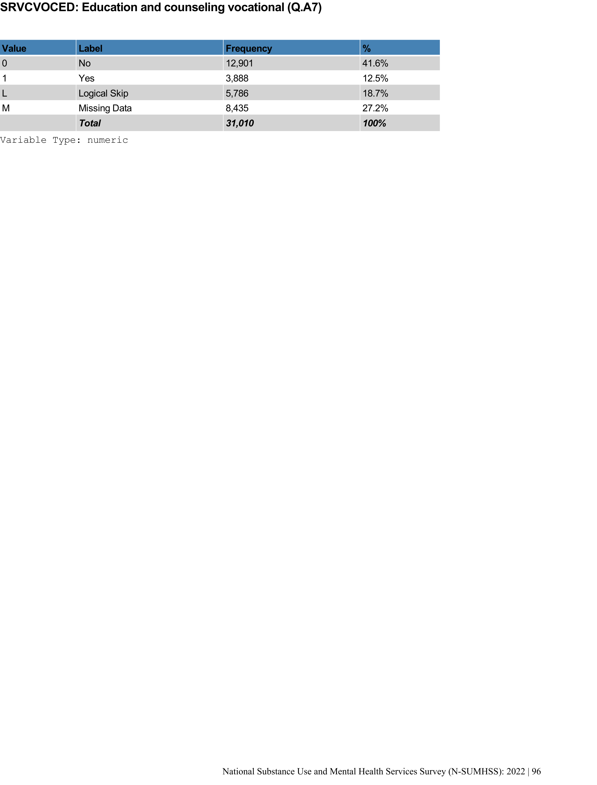

National Substance Use and Mental Health Services Survey (N-SUMHSS): 2022 | 96

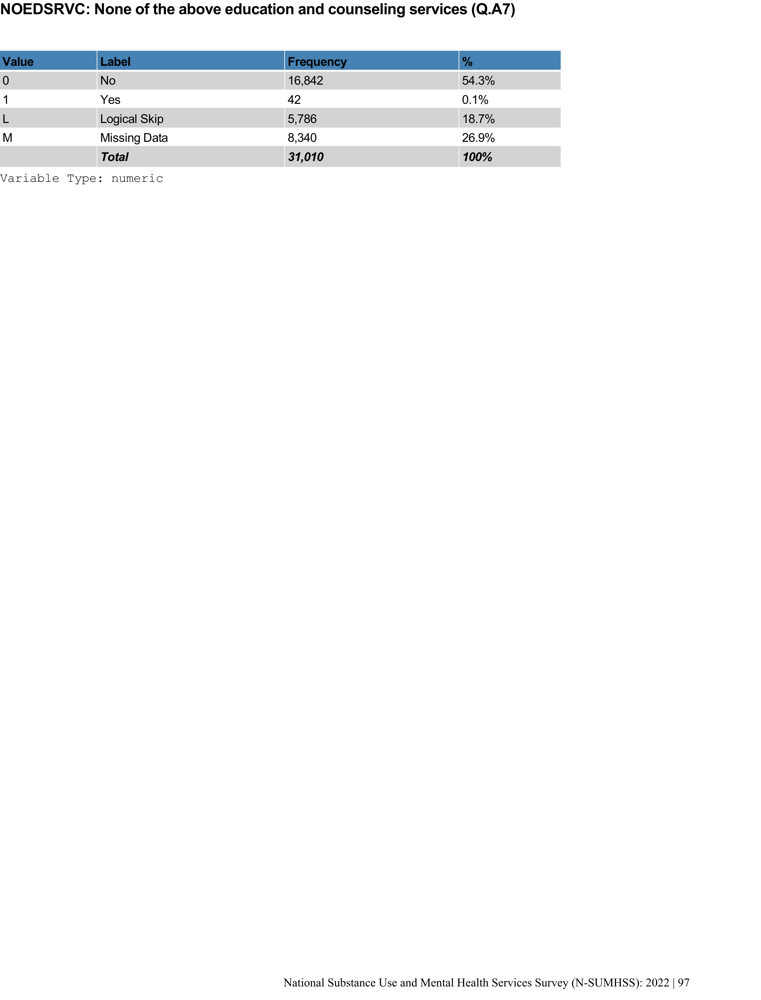

Variable Type: numeric

National Substance Use and Mental Health Services Survey (N-SUMHSS): 2022

### ary services case management (Q.A7)

| Value | Label        | Frequency | %      |
|-------|--------------|-----------|--------|
| 0     | No           | 2,775     | 8.9%   |
| 1     | Yes          | 13,979    | 45.1%  |
| L     | Logical Skip | 5,786     | 18.7%  |
| M     | Missing Data | 8,470     | 27.3%  |
|       | **Total**    | **31,010**| **100%**|

Variable Type: numeric

### E: Ancillary services integrated primary care (Q.A7)

| Value | Label        | Frequency | %       |
|-------|--------------|-----------|---------|
| 0     | No           | 11,829    | 38.1%   |
| 1     | Yes          | 4,880     | 15.7%   |
| L     | Logical Skip | 5,786     | 18.7%   |
| M     | Missing Data | 8,515     | 27.5%   |
| **Total**   |              | **31,010**  | **100%**  |

Variable Type: numeric

### ary social skills (Q.A7)

| Value | Label         | Frequency | %     |
|-------|---------------|-----------|-------|
| 0     | No            | 4,597     | 14.8% |
| 1     | Yes           | 12,131    | 39.1% |
| L     | Logical Skip  | 5,786     | 18.7% |
| M     | Missing Data  | 8,496     | 27.4% |
|       | **Total**     | **31,010**| **100%**|

Variable Type: numeric

---

National Substance Use and Mental Health Services Survey (N-SUMHSS): 2022 | 100

## Primary child care (Q.A7)

| Value | Label         | Frequency | %      |
|-------|---------------|-----------|--------|
| 0     | No            | 15,934    | 51.4%  |
| 1     | Yes           | 752       | 2.4%   |
| L     | Logical Skip  | 5,786     | 18.7%  |
| M     | Missing Data  | 8,538     | 27.5%  |
|       | **Total**     | **31,010**|**100%**|

Variable Type: numeric

National Substance Use and Mental Health Services Survey (N-SUMHSS): 2022 | 101

### Primary domestic violence (Q.A7)

| Value | Label        | Frequency | %     |
|-------|--------------|-----------|-------|
| 0     | No           | 11,003    | 35.5% |
| 1     | Yes          | 5,706     | 18.4% |
| L     | Logical Skip | 5,786     | 18.7% |
| M     | Missing Data | 8,515     | 27.5% |
| **Total** |              | **31,010**  | **100%** |

Variable Type: numeric

## HIV (Q.A7)

| Value | Label         | Frequency | %      |
|-------|---------------|-----------|--------|
| 0     | No            | 13,131    | 42.3%  |
| 1     | Yes           | 3,561     | 11.5%  |
| L     | Logical Skip  | 5,786     | 18.7%  |
| M     | Missing Data  | 8,532     | 27.5%  |
| **Total** |           | **31,010** | **100%** |

Variable Type: numeric

| Value | Label        | Frequency | %      |
|-------|--------------|-----------|--------|
| 0     | No           | 8,534     | 27.5%  |
| 1     | Yes          | 8,186     | 26.4%  |
| L     | Logical Skip | 5,786     | 18.7%  |
| M     | Missing Data | 8,504     | 27.4%  |
| **Total** |              | **31,010**  | **100%** |

Variable Type: numeric

### Ilary mental health services (Q.A7)

| Value | Label        | Frequency | %     |
|-------|--------------|-----------|-------|
| 0     | No           | 4,191     | 13.5% |
| 1     | Yes          | 12,576    | 40.6% |
| L     | Logical Skip | 5,786     | 18.7% |
| M     | Missing Data | 8,457     | 27.3% |
|       | **Total**    | **31,010**| **100%**|

Variable Type: numeric

---

National Substance Use and Mental Health Services Survey (N-SUMHSS): 2022 | 105

### REV: Ancillary suicide prevention services (Q.A7)

| Value | Label        | Frequency | %     |
|-------|--------------|-----------|-------|
| 0     | No           | 7,266     | 23.4% |
| 1     | Yes          | 9,464     | 30.5% |
| L     | Logical Skip | 5,786     | 18.7% |
| M     | Missing Data | 8,494     | 27.4% |
|       | **Total**    | **31,010**| **100%** |

Variable Type: numeric

---

National Substance Use and Mental Health Services Survey (N-SUMHSS): 2022 | 106

### ary acupuncture (Q.A7)

| Value | Label        | Frequency | %     |
|-------|--------------|-----------|-------|
| 0     | No           | 15,840    | 51.1% |
| 1     | Yes          | 849       | 2.7%  |
| L     | Logical Skip | 5,786     | 18.7% |
| M     | Missing Data | 8,535     | 27.5% |

|       | **Total**    | 31,010    | **100%** |

Variable Type: numeric

## ary residential beds for children (Q.A7)

| Value | Label        | Frequency | %      |
|-------|--------------|-----------|--------|
| 0     | No           | 16,259    | 52.4%  |
| 1     | Yes          | 429       | 1.4%   |
| L     | Logical Skip | 5,786     | 18.7%  |
| M     | Missing Data | 8,536     | 27.5%  |

**Total** | 31,010 | **100%**

Variable Type: numeric

National Substance Use and Mental Health Services Survey (N-SUMHSS): 2022 | 108

### None of the above ancillary services (Q.A7)

| Value | Label       | Frequency | %     |
|-------|-------------|-----------|-------|
| 0     | No          | 16,445    | 53.0% |
| 1     | Yes         | 353       | 1.1%  |
| L     | Logical Skip| 5,786     | 18.7% |
| M     | Missing Data| 8,426     | 27.2% |
| **Total** |       | **31,010** | **100%** |

Variable Type: numeric

## gambling disorder (Q.A7)

| Value | Label         | Frequency | %     |
|-------|---------------|-----------|-------|
| 0     | No            | 9,979     | 32.2% |
| 1     | Yes           | 4,645     | 15.0% |
| L     | Logical Skip  | 5,786     | 18.7% |
| M     | Missing Data  | 10,600    | 34.2% |

**Total** | **31,010** | **100%**

Variable Type: numeric

---

National Substance Use and Mental Health Services Survey (N-SUMHSS): 2022 | 110

## Non-substance use addiction disorder (Q.A7)

| Value | Label         | Frequency | %     |
|-------|---------------|-----------|-------|
| 0     | No            | 8,016     | 25.8% |
| 1     | Yes           | 6,618     | 21.3% |
| L     | Logical Skip  | 5,786     | 18.7% |
| M     | Missing Data  | 10,590    | 34.2% |
| **Total** |           | **31,010** | **100%** |

Variable Type: numeric

---

National Substance Use and Mental Health Services Survey (N-SUMHSS): 2022 | 111

# None of the above other (Q.A7)

| Value | Label        | Frequency | %    |
|-------|--------------|-----------|------|
| 0     | No           | 7,471     | 24.1% |
| 1     | Yes          | 7,225     | 23.3% |
| L     | Logical Skip | 5,786     | 18.7% |
| M     | Missing Data | 10,528    | 34.0% |
| **Total** |          | **31,010** | **100%** |

Variable Type: numeric

National Substance Use and Mental Health Services Survey (N-SUMHSS): 2022 | 112

## Pharmacotherapies disulfiram (Q.A7)

| Value | Label        | Frequency | %     |
|-------|--------------|-----------|-------|
| 0     | No           | 12,678    | 40.9% |
| 1     | Yes          | 4,224     | 13.6% |
| L     | Logical Skip | 5,786     | 18.7% |
| M     | Missing Data | 8,322     | 26.8% |

**Total**: **31,010** **100%**

Variable Type: numeric

National Substance Use and Mental Health Services Survey (N-SUMHSS): 2022 | 113

## Pharmacotherapies naltrexone (oral) (Q.A7)

| Value | Label        | Frequency | %     |
|-------|--------------|-----------|-------|
| 0     | No           | 9,523     | 30.7% |
| 1     | Yes          | 7,405     | 23.9% |
| L     | Logical Skip | 5,786     | 18.7% |
| M     | Missing Data | 8,296     | 26.8% |
|       | **Total**    | **31,010**| **100%** |

Variable Type: numeric

*National Substance Use and Mental Health Services Survey (N-SUMHSS): 2022 | 114*

#### macotherapies naltrexone (extended-release, injectable) (Q.A7)

| Value | Label         | Frequency | %     |
|-------|---------------|-----------|-------|
| 0     | No            | 10,376    | 33.5% |
| 1     | Yes           | 6,540     | 21.1% |
| L     | Logical Skip  | 5,786     | 18.7% |
| M     | Missing Data  | 8,308     | 26.8% |
|       | **Total**     | **31,010**| **100%** |

Variable Type: numeric

National Substance Use and Mental Health Services Survey (N-SUMHSS): 2022 | 115

## Pharmacotherapies acamprosate (campral) (Q.A7)

| Value | Label         | Frequency | %      |
|-------|---------------|-----------|--------|
| 0     | No            | 12,200    | 39.3%  |
| 1     | Yes           | 4,705     | 15.2%  |
| L     | Logical Skip  | 5,786     | 18.7%  |
| M     | Missing Data  | 8,319     | 26.8%  |
|       | **Total**     | **31,010**| **100%**|

Variable Type: numeric

## Pharmacotherapies nicotine replacement (Q.A7)

| Value | Label        | Frequency | %      |
|-------|--------------|-----------|--------|
| 0     | No           | 10,321    | 33.3%  |
| 1     | Yes          | 6,602     | 21.3%  |
| L     | Logical Skip | 5,786     | 18.7%  |
| M     | Missing Data | 8,301     | 26.8%  |
| **Total** |              | 31,010    | **100%** |

Variable Type: numeric

National Substance Use and Mental Health Services Survey (N-SUMHSS): 2022 | 117

### macotherapies non-nicotine cessation (Q.A7)
| Value | Label        | Frequency | %     |
|-------|--------------|-----------|-------|
| 0     | No           | 11,085    | 35.7% |
| 1     | Yes          | 5,823     | 18.8% |
| L     | Logical Skip | 5,786     | 18.7% |
| M     | Missing Data | 8,316     | 26.8% |
| **Total** |              | **31,010** | **100%** |

Variable Type: numeric

National Substance Use and Mental Health Services Survey (N-SUMHSS): 2022 | 118

### Use of pharmacotherapies psychiatric disorders (Q.A7)

| Value | Label        | Frequency | %     |
|-------|--------------|-----------|-------|
| 0     | No           | 7,424     | 23.9% |
| 1     | Yes          | 9,513     | 30.7% |
| L     | Logical Skip | 5,786     | 18.7% |
| M     | Missing Data | 8,287     | 26.7% |
|       | Total        | 31,010    | 100%  |

Variable Type: numeric

## Pharmacotherapies methadone (Q.A7)

| Value | Label         | Frequency | %      |
|-------|---------------|-----------|--------|
| 0     | No            | 14,545    | 46.9%  |
| 1     | Yes           | 2,347     | 7.6%   |
| L     | Logical Skip  | 5,786     | 18.7%  |
| M     | Missing Data  | 8,332     | 26.9%  |
| **Total** |               | **31,010**  | **100%** |

Variable Type: numeric

## buprenorphine with naloxone (suboxone, bunavail, zubsolv, cassipa) (Q.A7)

| Value | Label        | Frequency | %    |
|-------|--------------|-----------|------|
| 0     | No           | 8,733     | 28.2%|
| 1     | Yes          | 8,199     | 26.4%|
| L     | Logical Skip | 5,786     | 18.7%|
| M     | Missing Data | 8,292     | 26.7%|

|       | Total        | 31,010    | 100% |

Variable Type: numeric

## Pharmacotherapies buprenorphine without naloxone (Q.A7)

| Value | Label        | Frequency | %     |
|-------|--------------|-----------|-------|
| 0     | No           | 10,860    | 35.0% |
| 1     | Yes          | 6,053     | 19.5% |
| L     | Logical Skip | 5,786     | 18.7% |
| M     | Missing Data | 8,311     | 26.8% |
| **Total** |              | **31,010**  | **100%** |

Variable Type: numeric

### macotherapies buprenorphine sub-dermal implant (probuphine) (Q.A7)

| Value | Label         | Frequency |    %   |
|-------|---------------|-----------|--------|
| 0     | No            | 15,945    | 51.4%  |
| 1     | Yes           | 940       | 3.0%   |
| L     | Logical Skip  | 5,786     | 18.7%  |
| M     | Missing Data  | 8,339     | 26.9%  |
|       | **Total**     | **31,010**| **100%**|

Variable Type: numeric

## macotherapies buprenorphine (extended-release, injectable, for example, sublocade) (Q.A7)

| Value | Label        | Frequency | %     |
|-------|--------------|-----------|-------|
| 0     | No           | 13,437    | 43.3% |
| 1     | Yes          | 3,460     | 11.2% |
| L     | Logical Skip | 5,786     | 18.7% |
| M     | Missing Data | 8,327     | 26.9% |
|       | **Total**    | **31,010**| **100%**|

Variable Type: numeric

# Pharmacotherapies for HIV treatment (Q.A7)

| Value | Label         | Frequency | %     |
|-------|---------------|-----------|-------|
| 0     | No            | 14,864    | 47.9% |
| 1     | Yes           | 2,031     | 6.5%  |
| L     | Logical Skip  | 5,786     | 18.7% |
| M     | Missing Data  | 8,329     | 26.9% |
| **Total** |           | **31,010** | **100%** |

Variable Type: numeric

# EXP: Pharmacotherapies for pre-exposure prophylaxis (Q.A7)

| Value | Label         | Frequency |    %  |
|-------|---------------|-----------|-------|
| 0     | No            | 15,663    | 50.5% |
| 1     | Yes           | 1,231     | 4.0%  |
| L     | Logical Skip  | 5,786     | 18.7% |
| M     | Missing Data  | 8,330     | 26.9% |
|       | **Total**     | **31,010**| **100%**|

Variable Type: numeric

National Substance Use and Mental Health Services Survey (N-SUMHSS): 2022 | 126

: Pharmacotherapies for Hepatitis C (HCV) treatment (Q.A7)

| Value | Label         | Frequency |     %  |
|-------|---------------|-----------|--------|
| 0     | No            | 14,564    |  47.0% |
| 1     | Yes           |  2,331    |   7.5% |
| L     | Logical Skip  |  5,786    |  18.7% |
| M     | Missing Data  |  8,329    |  26.9% |

**Total** | 31,010 | **100%**

Variable Type: numeric

## Pharmacotherapies lofexidine (Q.A7)

| Value | Label        | Frequency | %     |
|-------|--------------|-----------|-------|
| 0     | No           | 15,614    | 50.4% |
| 1     | Yes          | 1,272     | 4.1%  |
| L     | Logical Skip | 5,786     | 18.7% |
| M     | Missing Data | 8,338     | 26.9% |
| **Total** | **31,010**     | **100%**  |

Variable Type: numeric

National Substance Use and Mental Health Services Survey (N-SUMHSS): 2022 | 128

#### Pharmacotherapies clonidine (Q.A7)

| Value | Label        | Frequency | %      |
|-------|--------------|-----------|--------|
| 0     | No           | 11,052    | 35.6%  |
| 1     | Yes          | 5,735     | 18.5%  |
| L     | Logical Skip | 5,786     | 18.7%  |
| M     | Missing Data | 8,437     | 27.2%  |

| **Total** |              | **31,010**  | **100%**  |

Variable Type: numeric

---

*National Substance Use and Mental Health Services Survey (N-SUMHSS): 2022 | 129*

## COND: Pharmacotherapies for other medical conditions (Q.A7)

| Value | Label        | Frequency | %     |
|-------|--------------|-----------|-------|
| 0     | No           | 14,390    | 46.4% |
| 1     | Yes          | 2,504     | 8.1%  |
| L     | Logical Skip | 5,786     | 18.7% |
| M     | Missing Data | 8,330     | 26.9% |

**Total** | **31,010** | **100%**

Variable Type: numeric

# C: None of the above pharmacotherapies (Q.A7)

| Value | Label         | Frequency | %     |
|-------|---------------|-----------|-------|
| 0     | No            | 12,420    | 40.1% |
| 1     | Yes           | 4,577     | 14.8% |
| L     | Logical Skip  | 5,786     | 18.7% |
| M     | Missing Data  | 8,227     | 26.5% |
| **Total** |               | **31,010**   | **100%** |

Variable Type: numeric

### Drugs may originate at another site (Q.A8)

| Value | Label        | Frequency | %     |
|-------|--------------|-----------|-------|
| 0     | No           | 7,523     | 24.3% |
| 1     | Yes          | 9,453     | 30.5% |
| L     | Logical Skip | 5,786     | 18.7% |
| M     | Missing Data | 8,248     | 26.6% |
| **Total** |              | **31,010**    | **100%** |

Variable Type: numeric

---
National Substance Use and Mental Health Services Survey (N-SUMHSS): 2022 | 132

naltrexone to treat opioid use disorder (Q.A8)

| Value | Label        | Frequency | %     |
|-------|--------------|-----------|-------|
| 0     | No           | 9,814     | 31.6% |
| 1     | Yes          | 7,141     | 23.0% |
| L     | Logical Skip | 5,786     | 18.7% |
| M     | Missing Data | 8,269     | 26.7% |
| **Total** |              | **31,010**   | **100%** |

Variable Type: numeric

### buprenorphine to treat opioid use disorder (Q.A8)

| Value | Label        | Frequency |    %   |
|-------|--------------|-----------|--------|
| 0     | No           |     9,220 |  29.7% |
| 1     | Yes          |     7,735 |  24.9% |
| L     | Logical Skip |     5,786 |  18.7% |
| M     | Missing Data |     8,269 |  26.7% |
| **Total** |           | **31,010** | **100%** |

Variable Type: numeric

-----
National Substance Use and Mental Health Services Survey (N-SUMHSS): 2022 | 134

## Federally-certified Opioid Treatment Program (OTP) (Q.A8)

| Value | Label        | Frequency | %     |
|-------|--------------|-----------|-------|
| 0     | No           | 14,775    | 47.6% |
| 1     | Yes          | 2,152     | 6.9%  |
| L     | Logical Skip | 5,786     | 18.7% |
| M     | Missing Data | 8,297     | 26.8% |
|       | **Total**    | **31,010** | **100%** |

Variable Type: numeric

#### It's opioid addiction, but without methadone, buprenorphine, and/or naltrexone (Q.A8)

| Value | Label        | Frequency | %     |
|-------|--------------|-----------|-------|
| 0     | No           | 16,020    | 51.7% |
| 1     | Yes          | 909       | 2.9%  |
| L     | Logical Skip | 5,786     | 18.7% |
| M     | Missing Data | 8,295     | 26.7% |
| **Total** | **31,010**    | **100%**  |

Variable Type: numeric

; methadone or buprenorphine for other purposes (Q.A8)

| Value | Label        | Frequency |    %    |
|-------|--------------|-----------|---------|
| 0     | No           | 15,876    | 51.2%   |
| 1     | Yes          | 1,045     | 3.4%    |
| L     | Logical Skip | 5,786     | 18.7%   |
| M     | Missing Data | 8,303     | 26.8%   |
|       | **Total**    | **31,010**| **100%**|

Variable Type: numeric

| Value | Label        | Frequency | %     |
|-------|--------------|-----------|-------|
| 0     | No           | 15,300    | 49.3% |
| 1     | Yes          | 1,731     | 5.6%  |
| L     | Logical Skip | 5,786     | 18.7% |
| M     | Missing Data | 8,193     | 26.4% |

**Total**   |   **31,010**   |   **100%**

Variable Type: numeric

## Opioid use disorder medication source, prescribing entity in network (Q.A8a)

| Value | Label         | Frequency | %     |
|-------|---------------|-----------|-------|
| 0     | No            | 5,912     | 19.1% |
| 1     | Yes           | 3,503     | 11.3% |
| L     | Logical Skip  | 13,412    | 43.3% |
| M     | Missing Data  | 8,183     | 26.4% |
| **Total** |           | **31,010** | **100%** |

Variable Type: numeric

# Opioid use disorder medication source, referral relationship with prescribing entity (Q.A8a)

| Value | Label        | Frequency | %       |
|-------|--------------|-----------|---------|
| 0     | No           | 5,297     | 17.1%   |
| 1     | Yes          | 4,118     | 13.3%   |
| L     | Logical Skip | 13,412    | 43.3%   |
| M     | Missing Data | 8,183     | 26.4%   |
| **Total** |              | **31,010**   | **100%**   |

**Variable Type:** numeric

**National Substance Use and Mental Health Services Survey (N-SUMHSS): 2022 | 140**

### IV: Opioid use disorder medication source, personal physician/health care provider (Q.A8a)

| Value | Label        | Frequency | %     |
|-------|--------------|-----------|-------|
| 0     | No           | 2,923     | 9.4%  |
| 1     | Yes          | 6,492     | 20.9% |
| L     | Logical Skip | 13,412    | 43.3% |
| M     | Missing Data | 8,183     | 26.4% |

**Total**: 31,010 (100%)

Variable Type: numeric

### ve only opioid use disorder clients (Q.A8b)

| Value | Label          | Frequency | %       |
|-------|----------------|-----------|---------|
| 0     | No             | 13,016    | 42.0%   |
| 1     | Yes            | 1,389     | 4.5%    |
| L     | Logical Skip   | 8,444     | 27.2%   |
| M     | Missing Data   | 8,161     | 26.3%   |
|       | **Total**      | **31,010**| **100%**|

Variable Type: numeric

# Maintenance services with methadone or buprenorphine (Q.A8c)
  
| Value | Label       | Frequency | %     |
|-------|-------------|-----------|-------|
| 0     | No          | 2,616     | 8.4%  |
| 1     | Yes         | 6,711     | 21.6% |
| L     | Logical Skip| 13,386    | 43.2% |
| M     | Missing Data| 8,297     | 26.8% |
|       | **Total**   | **31,010**| **100%** |

Variable Type: numeric

## I: Maintenance services with medical supervised withdrawal after period of stabilization (Q.A8c)

| Value | Label         | Frequency | %      |
|-------|---------------|-----------|--------|
| 0     | No            | 4,965     | 16.0%  |
| 1     | Yes           | 4,355     | 14.0%  |
| L     | Logical Skip  | 13,386    | 43.2%  |
| M     | Missing Data  | 8,304     | 26.8%  |
|       | **Total**     | **31,010**| **100%**|

Variable Type: numeric

National Substance Use and Mental Health Services Survey (N-SUMHSS): 2022 | 144

# Detoxification from opioids of use with methadone or buprenorphine (Q.A8c)

| Value | Label        | Frequency |    %    |
|-------|--------------|-----------|---------|
| 0     | No           | 6,924     | 22.3%   |
| 1     | Yes          | 2,387     | 7.7%    |
| L     | Logical Skip | 13,386    | 43.2%   |
| M     | Missing Data | 8,313     | 26.8%   |
|       | **Total**    | **31,010**| **100%**|

Variable Type: numeric

National Substance Use and Mental Health Services Survey (N-SUMHSS): 2022 | 145

# Detoxification from opioids of use with lofexidine or clonidine (Q.A8c)

| Value | Label        | Frequency | %      |
|-------|--------------|-----------|--------|
| 0     | No           | 7,866     | 25.4%  |
| 1     | Yes          | 1,441     | 4.6%   |
| L     | Logical Skip | 13,386    | 43.2%  |
| M     | Missing Data | 8,317     | 26.8%  |
|       | **Total**    | **31,010**| **100%**|

Variable Type: numeric

National Substance Use and Mental Health Services Survey (N-SUMHSS): 2022 | 146

## Relapse prevention with naltrexone (Q.A8c)

| Value | Label         | Frequency | %     |
|-------|---------------|-----------|-------|
| 0     | No            | 3,764     | 12.1% |
| 1     | Yes           | 5,559     | 17.9% |
| L     | Logical Skip  | 13,386    | 43.2% |
| M     | Missing Data  | 8,301     | 26.8% |
| **Total** |           | **31,010** | **100%** |

Variable Type: numeric

National Substance Use and Mental Health Services Survey (N-SUMHSS): 2022 | 147

### Medication services other (Q.A8c)

| Value | Label          | Frequency | %      |
|-------|----------------|-----------|--------|
| 0     | No             | 7,082     | 22.8%  |
| 1     | Yes            | 1,426     | 4.6%   |
| L     | Logical Skip   | 13,386    | 43.2%  |
| M     | Missing Data   | 9,116     | 29.4%  |
|       | **Total**      | **31,010** | **100%** |

Variable Type: numeric

National Substance Use and Mental Health Services Survey (N-SUMHSS): 2022 | 148

# SRVC: None of the above medication services (Q.A8c)

| Value | Label         | Frequency | %       |
|-------|---------------|-----------|---------|
| 0     | No            | 8,399     | 27.1%   |
| 1     | Yes           | 936       | 3.0%    |
| L     | Logical Skip  | 13,386    | 43.2%   |
| M     | Missing Data  | 8,289     | 26.7%   |
| **Total** |           | **31,010** | **100%** |

Variable Type: numeric

## 3E: Alcohol use disorder treatment but drugs may originate at another site (Q.A9)

| Value | Label         | Frequency | %      |
|-------|---------------|-----------|--------|
| 0     | No            | 7,966     | 25.7%  |
| 1     | Yes           | 9,007     | 29.0%  |
| L     | Logical Skip  | 5,786     | 18.7%  |
| M     | Missing Data  | 8,251     | 26.6%  |
|       | **Total**     | **31,010** | **100%** |

Variable Type: numeric

## ohol use disorder treatment with disulfiram (Q.A9)

| Value | Label        | Frequency | %      |
|-------|--------------|-----------|--------|
| 0     | No           | 12,853    | 41.4%  |
| 1     | Yes          | 4,093     | 13.2%  |
| L     | Logical Skip | 5,786     | 18.7%  |
| M     | Missing Data | 8,278     | 26.7%  |
| **Total** | | **31,010** | **100%** |

Variable Type: numeric

## Alcohol use disorder treatment with naltrexone (Q.A9)

| Value | Label        | Frequency | %    |
|-------|--------------|-----------|------|
| 0     | No           | 10,131    | 32.7%|
| 1     | Yes          | 6,831     | 22.0%|
| L     | Logical Skip | 5,786     | 18.7%|
| M     | Missing Data | 8,262     | 26.6%|
|       | Total        | 31,010    | 100% |

Variable Type: numeric

# Alcohol use disorder treatment with acamprosate (Q.A9)

| Value | Label        | Frequency |     %     |
|-------|--------------|-----------|-----------|
| 0     | No           | 12,566    | 40.5%     |
| 1     | Yes          | 4,381     | 14.1%     |
| L     | Logical Skip | 5,786     | 18.7%     |
| M     | Missing Data | 8,277     | 26.7%     |
|       | **Total**    | **31,010**| **100%**  |

Variable Type: numeric

## Alcohol use disorder treatment without medication-assisted treatment (Q.A9)

| Value | Label        | Frequency | %      |
|-------|--------------|-----------|--------|
| 0     | No           | 15,003    | 48.4%  |
| 1     | Yes          | 1,938     | 6.2%   |
| L     | Logical Skip | 5,786     | 18.7%  |
| M     | Missing Data | 8,283     | 26.7%  |
| **Total** |              | **31,010**  | **100%** |

Variable Type: numeric

# Does not treat alcohol use disorder (Q.A9)

| Value | Label        | Frequency | %     |
|-------|--------------|-----------|-------|
| 0     | No           | 14,831    | 47.8% |
| 1     | Yes          | 2,199     | 7.1%  |
| L     | Logical Skip | 5,786     | 18.7% |
| M     | Missing Data | 8,194     | 26.4% |
| **Total** |          | **31,010** | **100%** |

Variable Type: numeric

*National Substance Use and Mental Health Services Survey (N-SUMHSS): 2022 | 155*

ohol use disorder medication source, prescribing entity in network (Q.A9a)

| Value | Label       | Frequency | %     |
|-------|-------------|-----------|-------|
| 0     | No          | 7,128     | 23.0% |
| 1     | Yes         | 5,759     | 18.6% |
| L     | Logical Skip| 9,956     | 32.1% |
| M     | Missing Data| 8,167     | 26.3% |
|       | **Total**   | **31,010**|**100%**|

Variable Type: numeric

National Substance Use and Mental Health Services Survey (N-SUMHSS): 2022 | 156

### Alcohol use disorder medication source, referral relationship with prescribing entity (Q.A9a)

| Value  | Label        | Frequency | %      |
|--------|--------------|-----------|--------|
| 0      | No           | 7,959     | 25.7%  |
| 1      | Yes          | 4,928     | 15.9%  |
| L      | Logical Skip | 9,956     | 32.1%  |
| M      | Missing Data | 8,167     | 26.3%  |
| **Total**  |              | **31,010**    | **100%**  |

Variable Type: numeric

---

National Substance Use and Mental Health Services Survey (N-SUMHSS): 2022 | 157

## IV: Alcohol use disorder medication source, personal physician/health care provider (Q.A9a)

| Value | Label        | Frequency | %     |
|-------|--------------|-----------|-------|
| 0     | No           | 4,932     | 15.9% |
| 1     | Yes          | 7,955     | 25.7% |
| L     | Logical Skip | 9,956     | 32.1% |
| M     | Missing Data | 8,167     | 26.3% |
|       | **Total**    | **31,010**|**100%**|

Variable Type: numeric

National Substance Use and Mental Health Services Survey (N-SUMHSS): 2022 | 158

## Have only alcohol use disorder clients (Q.A9b)

| Value | Label         | Frequency | %     |
|-------|---------------|-----------|-------|
| 0     | No            | 14,717    | 47.5% |
| 1     | Yes           | 109       | 0.4%  |
| L     | Logical Skip  | 8,034     | 25.9% |
| M     | Missing Data  | 8,150     | 26.3% |
|       | **Total**     | **31,010**| **100%**|

Variable Type: numeric

### D: Frequently uses substance use counseling for opioid use (Q.A10)

| Value | Label        | Frequency | %      |
|-------|--------------|-----------|--------|
| 0     | No           | 1,156     | 3.7%   |
| 1     | Yes          | 14,869    | 47.9%  |
| L     | Logical Skip | 5,786     | 18.7%  |
| M     | Missing Data | 9,199     | 29.7%  |
|       | **Total**    | **31,010**| **100%**|

Variable Type: numeric

National Substance Use and Mental Health Services Survey (N-SUMHSS): 2022 | 160

# UB: Frequently uses substance use counseling for other substances (Q.A10)

| Value | Label        | Frequency | %      |
|-------|--------------|-----------|--------|
| 0     | No           | 1,226     | 4.0%   |
| 1     | Yes          | 14,800    | 47.7%  |
| L     | Logical Skip | 5,786     | 18.7%  |
| M     | Missing Data | 9,198     | 29.7%  |
|       | **Total**    | **31,010**| **100%**|

Variable Type: numeric

National Substance Use and Mental Health Services Survey (N-SUMHSS): 2022 | 161

): Frequently uses 12-step facilitation for opioid use (Q.A10)

| Value | Label        | Frequency | %      |
|-------|--------------|-----------|--------|
| 0     | No           | 638       | 2.1%   |
| 1     | Yes          | 7,290     | 23.5%  |
| L     | Logical Skip | 5,786     | 18.7%  |
| M     | Missing Data | 17,296    | 55.8%  |
|       | **Total**    | **31,010**| **100%**|

Variable Type: numeric

#### JB: Frequently uses 12-step facilitation for other substances (Q.A10)

| Value | Label        | Frequency | %      |
|-------|--------------|-----------|--------|
| 0     | No           | 428       | 1.4%   |
| 1     | Yes          | 7,505     | 24.2%  |
| L     | Logical Skip | 5,786     | 18.7%  |
| M     | Missing Data | 17,291    | 55.8%  |
| **Total** |              | **31,010**  | **100%** |

Variable Type: numeric

### \(A10\) Frequently uses brief intervention for opioid use (Q.A10)

| Value | Label        | Frequency | %      |
|-------|--------------|-----------|--------|
| 0     | No           | 1,037     | 3.3%   |
| 1     | Yes          | 10,366    | 33.4%  |
| L     | Logical Skip | 5,786     | 18.7%  |
| M     | Missing Data | 13,821    | 44.6%  |
| **Total** |              | **31,010**  | **100%**  |

Variable Type: numeric

#### Frequently uses brief intervention for other substances (Q.A10)

| Value | Label         | Frequency |    %    |
|-------|---------------|-----------|---------|
| 0     | No            | 730       | 2.4%    |
| 1     | Yes           | 10,675    | 34.4%   |
| L     | Logical Skip  | 5,786     | 18.7%   |
| M     | Missing Data  | 13,819    | 44.6%   |
| **Total** |               | **31,010**  | **100%**  |

Variable Type: numeric

# Frequently uses cognitive behavior therapy for opioid use (Q.A10)

| Value | Label        | Frequency | %      |
|-------|--------------|-----------|--------|
| 0     | No           | 1,197     | 3.9%   |
| 1     | Yes          | 13,606    | 43.9%  |
| L     | Logical Skip | 5,786     | 18.7%  |
| M     | Missing Data | 10,421    | 33.6%  |
| **Total** |              | **31,010** | **100%** |  

Variable Type: numeric

### B: Frequently uses cognitive behavior therapy for other substances (Q.A10)

| Value | Label       | Frequency | %     |
|-------|-------------|-----------|-------|
| 0     | No          | 908       | 2.9%  |
| 1     | Yes         | 13,897    | 44.8% |
| L     | Logical Skip| 5,786     | 18.7% |
| M     | Missing Data| 10,419    | 33.6% |

|       | **Total**   | **31,010**| **100%** |

Variable Type: numeric

National Substance Use and Mental Health Services Survey (N-SUMHSS): 2022 | 167

#### JID: Frequently uses contingency management/motivational incentives for opioid use (Q.A10)

| Value | Label         | Frequency | %      |
|-------|---------------|-----------|--------|
| 0     | No            | 643       | 2.1%   |
| 1     | Yes           | 6,765     | 21.8%  |
| L     | Logical Skip  | 5,786     | 18.7%  |
| M     | Missing Data  | 17,816    | 57.5%  |
|       | **Total**     | **31,010**| **100%**|

Variable Type: numeric

### SUB: Frequently uses contingency management/motivational incentives for other substances (Q.A10)

| Value | Label        | Frequency | %      |
|-------|--------------|-----------|--------|
| 0     | No           | 638       | 2.1%   |
| 1     | Yes          | 6,762     | 21.8%  |
| L     | Logical Skip | 5,786     | 18.7%  |
| M     | Missing Data | 17,824    | 57.5%  |
|       | **Total**    | **31,010**| **100%**|

Variable Type: numeric

---

National Substance Use and Mental Health Services Survey (N-SUMHSS): 2022 | 169

## ID: Frequently uses motivational interviewing for opioid use (Q.A10)

| Value | Label       | Frequency | %    |
|-------|-------------|-----------|------|
| 0     | No          | 1,061     | 3.4% |
| 1     | Yes         | 13,864    | 44.7%|
| L     | Logical Skip| 5,786     | 18.7%|
| M     | Missing Data| 10,299    | 33.2%|

**Total**            | **31,010** | **100%**

Variable Type: numeric

## SUB: Frequently uses motivational interviewing for other substances (Q.A10)

| Value | Label         | Frequency |    %    |
|-------|---------------|-----------|---------|
| 0     | No            | 1,011     |  3.3%   |
| 1     | Yes           | 13,909    | 44.9%   |
| L     | Logical Skip  | 5,786     | 18.7%   |
| M     | Missing Data  | 10,304    | 33.2%   |
|       | **Total**     | **31,010**| **100%**|

Variable Type: numeric

### QID: Frequently uses trauma-related counseling for opioid use (Q.A10)

| Value | Label         | Frequency | %      |
|-------|---------------|-----------|--------|
| 0     | No            | 1,026     | 3.3%   |
| 1     | Yes           | 12,160    | 39.2%  |
| L     | Logical Skip  | 5,786     | 18.7%  |
| M     | Missing Data  | 12,038    | 38.8%  |
|       | **Total**     | **31,010**| **100%**|

Variable Type: numeric

## SUB: Frequently uses trauma-related counseling for other substances (Q.A10)

| Value | Label        | Frequency | %     |
|-------|--------------|-----------|-------|
| 0     | No           | 764       | 2.5%  |
| 1     | Yes          | 12,418    | 40.0% |
| L     | Logical Skip | 5,786     | 18.7% |
| M     | Missing Data | 12,042    | 38.8% |

**Total** | **31,010** | **100%**

Variable Type: numeric

# D: Frequently uses anger management for opioid use (Q.A10)

| Value | Label        | Frequency | %     |
|-------|--------------|-----------|-------|
| 0     | No           | 1,010     | 3.3%  |
| 1     | Yes          | 10,184    | 32.8% |
| L     | Logical Skip | 5,786     | 18.7% |
| M     | Missing Data | 14,030    | 45.2% |
|       | **Total**    | **31,010**| **100%**|

Variable Type: numeric

National Substance Use and Mental Health Services Survey (N-SUMHSS): 2022 | 174

# UB: Frequently uses anger management for other substances (Q.A10)

| Value | Label        | Frequency | %     |
|-------|--------------|-----------|-------|
| 0     | No           | 621       | 2.0%  |
| 1     | Yes          | 10,575    | 34.1% |
| L     | Logical Skip | 5,786     | 18.7% |
| M     | Missing Data | 14,028    | 45.2% |

**Total** | **31,010** | **100%**

Variable Type: numeric

National Substance Use and Mental Health Services Survey (N-SUMHSS): 2022 | 175

# ID: Frequently uses matrix model for opioid use (Q.A10)

| Value | Label        | Frequency | %      |
|-------|--------------|-----------|--------|
| 0     | No           | 541       | 1.7%   |
| 1     | Yes          | 5,991     | 19.3%  |
| L     | Logical Skip | 5,786     | 18.7%  |
| M     | Missing Data | 18,692    | 60.3%  |
|       | **Total**    | **31,010**| **100%**|

Variable Type: numeric

%UB: Frequently uses matrix model for other substances (Q.A10)

| Value | Label        | Frequency | %      |
|-------|--------------|-----------|--------|
| 0     | No           | 466       | 1.5%   |
| 1     | Yes          | 6,067     | 19.6%  |
| L     | Logical Skip | 5,786     | 18.7%  |
| M     | Missing Data | 18,691    | 60.3%  |
| Total |              | 31,010    | 100%   |

Variable Type: numeric

# POID: Frequently uses community reinforcement plus vouchers for opioid use (Q.A10)

| Value | Label         | Frequency | %     |
|-------|---------------|-----------|-------|
| 0     | No            | 271       | 0.9%  |
| 1     | Yes           | 1,406     | 4.5%  |
| L     | Logical Skip  | 5,786     | 18.7% |
| M     | Missing Data  | 23,547    | 75.9% |
| **Total** |           | **31,010** | **100%**|

Variable Type: numeric

### THSUB: Frequently uses community reinforcement plus vouchers for other substances (Q.A10)

| Value | Label         | Frequency | %     |
|-------|---------------|-----------|-------|
| 0     | No            | 216       | 0.7%  |
| 1     | Yes           | 1,461     | 4.7%  |
| L     | Logical Skip  | 5,786     | 18.7% |
| M     | Missing Data  | 23,547    | 75.9% |
| **Total** |               | **31,010**  | **100%** |

Variable Type: numeric

# ID: Frequently uses relapse prevention for opioid use (Q.A10)

| Value | Label        | Frequency | %      |
|-------|--------------|-----------|--------|
| 0     | No           | 988       | 3.2%   |
| 1     | Yes          | 14,078    | 45.4%  |
| L     | Logical Skip | 5,786     | 18.7%  |
| M     | Missing Data | 10,158    | 32.8%  |
|       | **Total**    | **31,010**| **100%**|

Variable Type: numeric

National Substance Use and Mental Health Services Survey (N-SUMHSS): 2022 | 180

### SUB: Frequently uses relapse prevention for other substances (Q.A10)

| Value | Label        | Frequency | %     |
|-------|--------------|-----------|-------|
| 0     | No           | 1,229     | 4.0%  |
| 1     | Yes          | 13,835    | 44.6% |
| L     | Logical Skip | 5,786     | 18.7% |
| M     | Missing Data | 10,160    | 32.8% |
|       | **Total**    | **31,010** | **100%** |

Variable Type: numeric

ID: Frequently uses telemedicine/telehealth therapy for opioid use (Q.A10)

| Value | Label        | Frequency |     %  |
|-------|--------------|-----------|--------|
| 0     | No           | 1,033     |   3.3% |
| 1     | Yes          | 11,958    |  38.6% |
| L     | Logical Skip | 5,786     |  18.7% |
| M     | Missing Data | 12,233    |  39.4% |
|       | Total        | 31,010    | 100%   |

Variable Type: numeric

National Substance Use and Mental Health Services Survey (N-SUMHSS): 2022 | 182

### SUB: Frequently uses telemedicine/telehealth therapy for other substances (Q.A10)

| Value | Label          | Frequency | %     |
|-------|----------------|-----------|-------|
| 0     | No             | 1,103     | 3.6%  |
| 1     | Yes            | 11,884    | 38.3% |
| L     | Logical Skip   | 5,786     | 18.7% |
| M     | Missing Data   | 12,237    | 39.5% |
| **Total** |            | **31,010** | **100%** |

Variable Type: numeric

# POIOD: Frequently uses other treatment approach for opioid use (Q.A10)

| Value | Label        | Frequency | %     |
|-------|--------------|-----------|-------|
| 0     | No           | 300       | 1.0%  |
| 1     | Yes          | 2,255     | 7.3%  |
| L     | Logical Skip | 5,786     | 18.7% |
| M     | Missing Data | 22,669    | 73.1% |

**Total** | **31,010** | **100%**

Variable Type: numeric

---

National Substance Use and Mental Health Services Survey (N-SUMHSS): 2022 | 184

# THSUB: Frequently uses other treatment approach for other substances (Q.A10)

| Value | Label       | Frequency | %     |
|-------|-------------|-----------|-------|
| 0     | No          | 207       | 0.7%  |
| 1     | Yes         | 2,349     | 7.6%  |
| L     | Logical Skip| 5,786     | 18.7% |
| M     | Missing Data| 22,668    | 73.1% |
|       | **Total**   | **31,010**| **100%** |

Variable Type: numeric

*National Substance Use and Mental Health Services Survey (N-SUMHSS): 2022 | 185*

## IOID: No clinical/therapeutic approaches for opioid use (Q.A10)

| Value | Label        | Frequency | %     |
|-------|--------------|-----------|-------|
| 0     | No           | 15,636    | 50.4% |
| 1     | Yes          | 18        | 0.1%  |
| L     | Logical Skip | 5,786     | 18.7% |
| M     | Missing Data | 9,570     | 30.9% |
| **Total** | | **31,010** | **100%** |

Variable Type: numeric

---

National Substance Use and Mental Health Services Survey (N-SUMHSS): 2022 | 186

# HSUB: No clinical/therapeutic approaches for other substances (Q.A10)

| Value | Label        | Frequency | %     |
|-------|--------------|-----------|-------|
| 0     | No           | 15,459    | 49.9% |
| 1     | Yes          | 161       | 0.5%  |
| L     | Logical Skip | 5,786     | 18.7% |
| M     | Missing Data | 9,604     | 31.0% |
|       | **Total**    | **31,010**| **100%**|

Variable Type: numeric

## Program for clients driving under the influence/driving while intoxicated (DUI/DWI)/other offenders (Q.A11)

| Value | Label        | Frequency | %     |
|-------|--------------|-----------|-------|
| 0     | No           | 13,883    | 44.8% |
| 1     | Yes          | 3,148     | 10.2% |
| L     | Logical Skip | 5,786     | 18.7% |
| M     | Missing Data | 8,193     | 26.4% |
| Total |              | 31,010    | 100%  |

Variable Type: numeric

---

National Substance Use and Mental Health Services Survey (N-SUMHSS): 2022 | 188

## Substance use treatment for clients driving under the influence/driving while intoxicated (DUl/DWI) (Q.A11a)

| Value | Label        | Frequency | %     |
|-------|--------------|-----------|-------|
| 0     | No           | 3,058     | 9.9%  |
| 1     | Yes          | 83        | 0.3%  |
| L     | Logical Skip | 19,716    | 63.6% |
| M     | Missing Data | 8,153     | 26.3% |
|       | Total        | 31,010    | 100%  |

Variable Type: numeric

## II substance use treatment services for marijuana (Q.A12)

| Value | Label        | Frequency |    %   |
|-------|--------------|-----------|--------|
| 0     | No           | 831       | 2.7%   |
| 1     | Yes          | 12,479    | 40.2%  |
| L     | Logical Skip | 5,786     | 18.7%  |
| M     | Missing Data | 11,914    | 38.4%  |
| **Total** |              | **31,010**   | **100%**  |

Variable Type: numeric

## All substance use treatment services for stimulants (Q.A12)

| Value | Label        | Frequency | %     |
|-------|--------------|-----------|-------|
| 0     | No           | 818       | 2.6%  |
| 1     | Yes          | 12,491    | 40.3% |
| L     | Logical Skip | 5,786     | 18.7% |
| M     | Missing Data | 11,915    | 38.4% |

|       | **Total**    | **31,010**| **100%** |

Variable Type: numeric

National Substance Use and Mental Health Services Survey (N-SUMHSS): 2022 | 191

## Substance use treatment services for other substances (Q.A12)

| Value | Label        | Frequency | %      |
|-------|--------------|-----------|--------|
| 0     | No           | 8,297     | 26.8%  |
| 1     | Yes          | 5,010     | 16.2%  |
| L     | Logical Skip | 5,786     | 18.7%  |
| M     | Missing Data | 11,917    | 38.4%  |
|       | **Total**    | **31,010**| **100%**|

Variable Type: numeric

#### Substance use treatment in sign language (Q.A13)

| Value | Label       | Frequency | %     |
|-------|-------------|-----------|-------|
| 0     | No          | 10,145    | 32.7% |
| 1     | Yes         | 6,880     | 22.2% |
| L     | Logical Skip| 5,786     | 18.7% |
| M     | Missing Data| 8,199     | 26.4% |
| **Total** |         | **31,010** | **100%** |

Variable Type: numeric

National Substance Use and Mental Health Services Survey (N-SUMHSS): 2022 | 193

### Substance use treatment in language other than English (Q.A14)

| Value | Label        | Frequency | %     |
|-------|--------------|-----------|-------|
| 0     | No           | 7,676     | 24.8% |
| 1     | Yes          | 9,337     | 30.1% |
| L     | Logical Skip | 5,786     | 18.7% |
| M     | Missing Data | 8,211     | 26.5% |
| **Total** |              | **31,010**   | **100%** |

Variable Type: numeric

### J: Substance use treatment language provided by staff counselor/interpreter/both (Q.A14a)

| Value | Label                                             | Frequency | %     |
|-------|---------------------------------------------------|-----------|-------|
| 1     | Staff counselor who speaks a language other than English | 1,526     | 4.9%  |
| 2     | On-call interpreter brought in when needed        | 5,063     | 16.3% |
| 3     | Both staff counselor and on-call interpreter      | 2,731     | 8.8%  |
| L     | Logical Skip                                      | 13,528    | 43.6% |
| M     | Missing Data                                      | 8,162     | 26.3% |
|       | **Total**                                         | **31,010**|**100%**|

Variable Type: numeric

#### Staff counselors provide substance use treatment in Spanish (Q.A14a1)

| Value | Label        | Frequency | %      |
|-------|--------------|-----------|--------|
| 0     | No           | 540       | 1.7%   |
| 1     | Yes          | 3,701     | 11.9%  |
| L     | Logical Skip | 18,607    | 60.0%  |
| M     | Missing Data | 8,162     | 26.3%  |
|       | **Total**    | **31,010**| **100%**|

Variable Type: numeric

National Substance Use and Mental Health Services Survey (N-SUMHSS): 2022 | 196

taff counselors provide substance use treatment in any other language (Q.A14a2)

| Value | Label        | Frequency | %      |
|-------|--------------|-----------|--------|
| 0     | No           | 2,688     | 8.7%   |
| 1     | Yes          | 997       | 3.2%   |
| L     | Logical Skip | 19,147    | 61.7%  |
| M     | Missing Data | 8,178     | 26.4%  |
|       | **Total**    | **31,010**| **100%**|

Variable Type: numeric

### Substance use treatment in Hopi (Q.A14b)

| Value | Label        | Frequency | %     |
|-------|--------------|-----------|-------|
| 0     | No           | 1,107     | 3.6%  |
| 1     | Yes          | 18        | 0.1%  |
| L     | Logical Skip | 21,326    | 68.8% |
| M     | Missing Data | 8,559     | 27.6% |
| **Total** |              | **31,010**    | **100%**  |

Variable Type: numeric

#### Substance use treatment in Lakota (Q.A14b)

| Value | Label        | Frequency | %      |
|-------|--------------|-----------|--------|
| 0     | No           | 1,109     | 3.6%   |
| 1     | Yes          | 16        | 0.1%   |
| L     | Logical Skip | 21,326    | 68.8%  |
| M     | Missing Data | 8,559     | 27.6%  |
| **Total** | **31,010**   | **100%** |

Variable Type: numeric

# Substance use treatment in Navajo (Q.A14b)

| Value | Label        | Frequency | %     |
|-------|--------------|-----------|-------|
| 0     | No           | 1,071     | 3.5%  |
| 1     | Yes          | 54        | 0.2%  |
| L     | Logical Skip | 21,326    | 68.8% |
| M     | Missing Data | 8,559     | 27.6% |
|       | **Total**    | **31,010**| **100%**|

Variable Type: numeric

#### Substance use treatment in Ojibwa (Q.A14b)

| Value | Label        | Frequency | %     |
|-------|--------------|-----------|-------|
| 0     | No           | 1,112     | 3.6%  |
| 1     | Yes          | 13        | 0.0%  |
| L     | Logical Skip | 21,326    | 68.8% |
| M     | Missing Data | 8,559     | 27.6% |
|       | Total        | 31,010    | 100%  |

Variable Type: numeric

National Substance Use and Mental Health Services Survey (N-SUMHSS): 2022 | 201

## Substance use treatment in Yupik (Q.A14b)

| Value | Label       | Frequency |   %   |
|-------|-------------|-----------|-------|
| 0     | No          | 1,111     |  3.6% |
| 1     | Yes         | 14        |  0.0% |
| L     | Logical Skip| 21,326    | 68.8% |
| M     | Missing Data| 8,559     | 27.6% |
|       | **Total**   | **31,010**| **100%** |

Variable Type: numeric

#### bstance use treatment in other American Indian/Alaska Native (Q.A14b)

| Value | Label       | Frequency |    %   |
|-------|-------------|-----------|--------|
| 0     | No          | 1,092     |  3.5%  |
| 1     | Yes         | 30        |  0.1%  |
| L     | Logical Skip| 21,326    | 68.8%  |
| M     | Missing Data| 8,562     | 27.6%  |
|       | **Total**   | **31,010**| **100%**|

Variable Type: numeric

*National Substance Use and Mental Health Services Survey (N-SUMHSS): 2022 | 203*

# Substance use treatment in Arabic (Q.A14b)

| Value | Label        | Frequency | %    |
|-------|--------------|-----------|------|
| 0     | No           | 1,023     | 3.3% |
| 1     | Yes          | 102       | 0.3% |
| L     | Logical Skip | 21,326    | 68.8%|
| M     | Missing Data | 8,559     | 27.6%|

**Total** | **31,010** | **100%**

Variable Type: numeric

## Substance use treatment in Chinese (Q.A14b)

| Value | Label         | Frequency | %     |
|-------|---------------|-----------|-------|
| 0     | No            | 1,013     | 3.3%  |
| 1     | Yes           | 112       | 0.4%  |
| L     | Logical Skip  | 21,326    | 68.8% |
| M     | Missing Data  | 8,559     | 27.6% |

**Total**  | 31,010     | **100%** |

Variable Type: numeric

### Substance use treatment in Creole (Q.A14b)

| Value | Label        | Frequency | %     |
|-------|--------------|-----------|-------|
| 0     | No           | 966       | 3.1%  |
| 1     | Yes          | 159       | 0.5%  |
| L     | Logical Skip | 21,326    | 68.8% |
| M     | Missing Data | 8,559     | 27.6% |

**Total**: **31,010** **100%**

Variable Type: numeric

National Substance Use and Mental Health Services Survey (N-SUMHSS): 2022 | 206

## Substance use treatment in Farsi (Q.A14b)

| Value | Label         | Frequency | %     |
|-------|---------------|-----------|-------|
| 0     | No            | 1,049     | 3.4%  |
| 1     | Yes           | 76        | 0.2%  |
| L     | Logical Skip  | 21,326    | 68.8% |
| M     | Missing Data  | 8,559     | 27.6% |
|       | **Total**     | **31,010**| **100%**|

Variable Type: numeric

National Substance Use and Mental Health Services Survey (N-SUMHSS): 2022 | 207

### Substance use treatment in French (Q.A14b)

| Value | Label         | Frequency | %     |
|-------|---------------|-----------|-------|
| 0     | No            | 977       | 3.2%  |
| 1     | Yes           | 148       | 0.5%  |
| L     | Logical Skip  | 21,326    | 68.8% |
| M     | Missing Data  | 8,559     | 27.6% |

|       | **Total**     | **31,010**| **100%** |

Variable Type: numeric

### Substance use treatment in German (Q.A14b)

| Value | Label          | Frequency | %     |
|-------|----------------|-----------|-------|
| 0     | No             | 1,064     | 3.4%  |
| 1     | Yes            | 61        | 0.2%  |
| L     | Logical Skip   | 21,326    | 68.8% |
| M     | Missing Data   | 8,559     | 27.6% |
|       | **Total**      | **31,010**|**100%**|

Variable Type: numeric

---

National Substance Use and Mental Health Services Survey (N-SUMHSS): 2022 | 209

### Substance use treatment in Greek (Q.A14b)

| Value  | Label        | Frequency | %     |
|--------|--------------|-----------|-------|
| 0      | No           | 1,086     | 3.5%  |
| 1      | Yes          | 39        | 0.1%  |
| L      | Logical Skip | 21,326    | 68.8% |
| M      | Missing Data | 8,559     | 27.6% |
|        | **Total**    | **31,010** | **100%** |

Variable Type: numeric

---

National Substance Use and Mental Health Services Survey (N-SUMHSS): 2022 | 210

## Substance use treatment in Hebrew (Q.A14b)

| Value | Label         | Frequency | %     |
|-------|---------------|-----------|-------|
| 0     | No            | 1,062     | 3.4%  |
| 1     | Yes           | 63        | 0.2%  |
| L     | Logical Skip  | 21,326    | 68.8% |
| M     | Missing Data  | 8,559     | 27.6% |
|       | **Total**     | **31,010**| **100%**|

Variable Type: numeric

---
National Substance Use and Mental Health Services Survey (N-SUMHSS): 2022 | 211

## Substance use treatment in Hindi (Q.A14b)

| Value | Label         | Frequency | %     |
|-------|---------------|-----------|-------|
| 0     | No            | 1,009     | 3.3%  |
| 1     | Yes           | 116       | 0.4%  |
| L     | Logical Skip  | 21,326    | 68.8% |
| M     | Missing Data  | 8,559     | 27.6% |
|       | **Total**     | **31,010**| **100%** |

Variable Type: numeric

---

*National Substance Use and Mental Health Services Survey (N-SUMHSS): 2022 | 212*

## Substance use treatment in Hmong (Q.A14b)

| Value | Label        | Frequency | %     |
|-------|--------------|-----------|-------|
| 0     | No           | 1,071     | 3.5%  |
| 1     | Yes          | 54        | 0.2%  |
| L     | Logical Skip | 21,326    | 68.8% |
| M     | Missing Data | 8,559     | 27.6% |
| **Total** | **31,010**    | **100%** |

Variable Type: numeric

National Substance Use and Mental Health Services Survey (N-SUMHSS): 2022

# Substance use treatment in Italian (Q.A14b)

| Value | Label         | Frequency | %       |
|-------|---------------|-----------|---------|
| 0     | No            | 1,059     | 3.4%    |
| 1     | Yes           | 66        | 0.2%    |
| L     | Logical Skip  | 21,326    | 68.8%   |
| M     | Missing Data  | 8,559     | 27.6%   |
| **Total** |          | **31,010** | **100%**|

Variable Type: numeric

### Substance use treatment in Japanese (Q.A14b)

| Value | Label        | Frequency | %     |
|-------|--------------|-----------|-------|
| 0     | No           | 1,079     | 3.5%  |
| 1     | Yes          | 46        | 0.1%  |
| L     | Logical Skip | 21,326    | 68.8% |
| M     | Missing Data | 8,559     | 27.6% |
|       | **Total**    | **31,010**|**100%**|

Variable Type: numeric

---

National Substance Use and Mental Health Services Survey (N-SUMHSS): 2022 | 215

## Substance use treatment in Korean (Q.A14b)

| Value | Label        | Frequency | %     |
|-------|--------------|-----------|-------|
| 0     | No           | 1,055     | 3.4%  |
| 1     | Yes          | 70        | 0.2%  |
| L     | Logical Skip | 21,326    | 68.8% |
| M     | Missing Data | 8,559     | 27.6% |

**Total** | **31,010** | **100%**

Variable Type: numeric

## Substance use treatment in Polish (Q.A14b)

| Value | Label        | Frequency | %    |
|-------|--------------|-----------|------|
| 0     | No           | 1,034     | 3.3% |
| 1     | Yes          | 91        | 0.3% |
| L     | Logical Skip | 21,326    | 68.8%|
| M     | Missing Data | 8,559     | 27.6%|

**Total**: 31,010 **100%**

Variable Type: numeric

National Substance Use and Mental Health Services Survey (N-SUMHSS): 2022 | 217

## Substance use treatment in Portuguese (Q.A14b)

| Value | Label       | Frequency | %    |
|-------|-------------|-----------|------|
| 0     | No          | 975       | 3.1% |
| 1     | Yes         | 150       | 0.5% |
| L     | Logical Skip| 21,326    | 68.8%|
| M     | Missing Data| 8,559     | 27.6%|

**Total** | **31,010** | **100%**

Variable Type: numeric

---

National Substance Use and Mental Health Services Survey (N-SUMHSS): 2022 | 218

## Substance use treatment in Russian (Q.A14b)

| Value | Label         | Frequency | %     |
|-------|---------------|-----------|-------|
| 0     | No            | 959       | 3.1%  |
| 1     | Yes           | 166       | 0.5%  |
| L     | Logical Skip  | 21,326    | 68.8% |
| M     | Missing Data  | 8,559     | 27.6% |

| **Total** | **31,010** | **100%** |

Variable Type: numeric

National Substance Use and Mental Health Services Survey (N-SUMHSS): 2022

219

## Substance use treatment in Tagalog (Q.A14b)

| Value | Label        | Frequency | %    |
|-------|--------------|-----------|------|
| 0     | No           | 1,038     | 3.3% |
| 1     | Yes          | 87        | 0.3% |
| L     | Logical Skip | 21,326    | 68.8%|
| M     | Missing Data | 8,559     | 27.6%|

|       | **Total**    | **31,010**|**100%**|

Variable Type: numeric

National Substance Use and Mental Health Services Survey (N-SUMHSS): 2022 | 220

## Substance use treatment in Vietnamese (Q.A14b)

| Value | Label        | Frequency | %     |
|-------|--------------|-----------|-------|
| 0     | No           | 1,048     | 3.4%  |
| 1     | Yes          | 77        | 0.2%  |
| L     | Logical Skip | 21,326    | 68.8% |
| M     | Missing Data | 8,559     | 27.6% |

**Total** | **31,010** | **100%**

Variable Type: numeric

| Value | Label       | Frequency | %    |
|-------|-------------|-----------|------|
| 0     | No          | 623       | 2.0% |
| 1     | Yes         | 501       | 1.6% |
| L     | Logical Skip| 21,326    | 68.8%|
| M     | Missing Data| 8,580     | 27.6%|
| **Total** |             | **31,010**    | **100%**|

Variable Type: numeric

# Females served by this facility (Q.A15)

| Value | Label        | Frequency | %     |
|-------|--------------|-----------|-------|
| 0     | No           | 928       | 3.0%  |
| 1     | Yes          | 16,108    | 51.9% |
| L     | Logical Skip | 5,786     | 18.7% |
| M     | Missing Data | 8,188     | 26.4% |
| **Total** | **31,010**    | **100%**|

**Variable Type:** numeric

*National Substance Use and Mental Health Services Survey (N-SUMHSS): 2022 | 223*

## s served by this facility (Q.A15)

| Value | Label        | Frequency | %     |
|-------|--------------|-----------|-------|
| 0     | No           | 838       | 2.7%  |
| 1     | Yes          | 16,218    | 52.3% |
| L     | Logical Skip | 5,786     | 18.7% |
| M     | Missing Data | 8,168     | 26.3% |
| **Total** |       | **31,010**  | **100%** |

#### Variable Type: numeric

**National Substance Use and Mental Health Services Survey (N-SUMHSS): 2022 | 224**

# S: Females lowest age served (Q.A15)

| Value | Label        | Frequency | %     |
|-------|--------------|-----------|-------|
| 0-12  | 0-12         | 2,240     | 7.2%  |
| 13-17 | 13-17        | 1,598     | 5.2%  |
| 18-25 | 18-25        | 8,809     | 28.4% |
| 26-64 | 26-64        | 31        | 0.1%  |
| L     | Logical Skip | 10,029    | 32.3% |
| M     | Missing Data | 8,303     | 26.8% |
|       | **Total**    | **31,010**| **100%**  |

Variable Type: numeric

National Substance Use and Mental Health Services Survey (N-SUMHSS): 2022 | 225

# I: Females no minimum age served (Q.A15)

| Value | Label            | Frequency | %       |
|-------|------------------|-----------|---------|
| 0     | Minimum Age      | 12,677    | 40.9%   |
| 1     | No Minimum Age   | 3,272     | 10.6%   |
| L     | Logical Skip     | 6,757     | 21.8%   |
| M     | Missing Data     | 8,304     | 26.8%   |
|       | **Total**        | **31,010**| **100%**|

Variable Type: numeric

**RS: Females highest age served (Q.A15)**

| Value | Label    | Frequency | %      |
|-------|----------|-----------|--------|
| 0-12  | 0-12     | 10        | 0.0%   |
| 13-17 | 13-17    | 194       | 0.6%   |
| 18-25 | 18-25    | 542       | 1.7%   |
| 26-64 | 26-64    | 148       | 0.5%   |
| 65 +  | 65 +     | 409       | 1.3%   |
| L     | Logical Skip | 21,249    | 68.5%  |
| M     | Missing Data  | 8,458     | 27.3%  |

**Total**: 31,010    100%

*Variable Type: numeric*

*National Substance Use and Mental Health Services Survey (N-SUMHSS): 2022*

# X: Females no maximum age served (Q.A15)

| Value | Label            | Frequency | %      |
|-------|------------------|-----------|--------|
| 0     | Maximum Age      | 1,303     | 4.2%   |
| 1     | No Maximum Age   | 14,494    | 46.7%  |
| L     | Logical Skip     | 6,757     | 21.8%  |
| M     | Missing Data     | 8,456     | 27.3%  |
| **Total** |              | **31,010** | **100%** |

Variable Type: numeric

National Substance Use and Mental Health Services Survey (N-SUMHSS): 2022 | 228

# Males lowest age served (Q.A15)

| Value | Label        | Frequency | %     |
|-------|--------------|-----------|-------|
| 0-12  | 0-12         | 2,263     | 7.3%  |
| 13-17 | 13-17        | 1,616     | 5.2%  |
| 18-25 | 18-25        | 8,885     | 28.7% |
| 26-64 | 26-64        | 32        | 0.1%  |
| L     | Logical Skip | 9,904     | 31.9% |
| M     | Missing Data | 8,310     | 26.8% |
| **Total** |              | **31,010** | **100%** |
        
Variable Type: numeric

National Substance Use and Mental Health Services Survey (N-SUMHSS): 2022 | 229

# tales no minimum age served (Q.A15)

| Value | Label             | Frequency | %     |
|-------|-------------------|-----------|-------|
| 0     | Minimum Age       | 12,794    | 41.3% |
| 1     | No Minimum Age    | 3,257     | 10.5% |
| L     | Logical Skip      | 6,647     | 21.4% |
| M     | Missing Data      | 8,312     | 26.8% |

|       | **Total**         | **31,010**| **100%** |

**Variable Type:** numeric

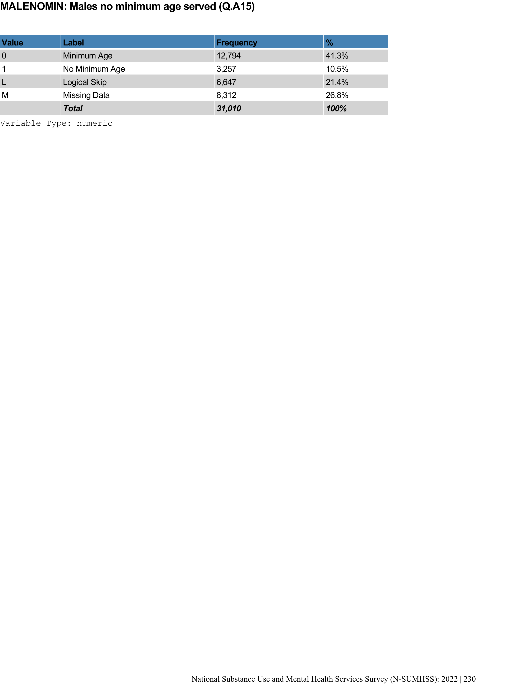

#### Males highest age served (Q.A15)

| Value | Label      | Frequency | %      |
|-------|------------|-----------|--------|
| 0-12  | 0-12       | 8         | 0.0%   |
| 13-17 | 13-17      | 210       | 0.7%   |
| 18-25 | 18-25      | 540       | 1.7%   |
| 26-64 | 26-64      | 145       | 0.5%   |
| 65 +  | 65 +       | 477       | 1.5%   |
| L     | Logical Skip | 21,200    | 68.4%  |
| M     | Missing Data | 8,430     | 27.2%  |
|       | Total      | 31,010    | 100%   |

*Variable Type: numeric*

*National Substance Use and Mental Health Services Survey (N-SUMHSS): 2022 | 231*

# Males no maximum age served (Q.A15)

| Value | Label              | Frequency | %     |
|-------|--------------------|-----------|-------|
| 0     | Maximum Age        | 1,380     | 4.5%  |
| 1     | No Maximum Age     | 14,555    | 46.9% |
| L     | Logical Skip       | 6,647     | 21.4% |
| M     | Missing Data       | 8,428     | 27.2% |
|       | **Total**          | **31,010**| **100%**|

Variable Type: numeric

National Substance Use and Mental Health Services Survey (N-SUMHSS): 2022 | 232

### Specific program/group for adolescents (Q.A15a)

| Value | Label         | Frequency | %      |
|-------|---------------|-----------|--------|
| 0     | No            | 12,616    | 40.7%  |
| 1     | Yes           | 4,127     | 13.3%  |
| L     | Logical Skip  | 5,786     | 18.7%  |
| M     | Missing Data  | 8,481     | 27.3%  |

**Total:** 31,010 **100%**

Variable Type: numeric

### Specific program/group for young adults (Q.A15a)

| Value | Label        | Frequency | %     |
|-------|--------------|-----------|-------|
| 0     | No           | 10,547    | 34.0% |
| 1     | Yes          | 6,209     | 20.0% |
| L     | Logical Skip | 5,786     | 18.7% |
| M     | Missing Data | 8,468     | 27.3% |

|       | **Total**    | **31,010**| **100%**|

Variable Type: numeric

*National Substance Use and Mental Health Services Survey (N-SUMHSS): 2022 | 234*

### Specific program/group for adult women (Q.A15a)

| Value | Label        | Frequency | %     |
|-------|--------------|-----------|-------|
| 0     | No           | 7,858     | 25.3% |
| 1     | Yes          | 8,920     | 28.8% |
| L     | Logical Skip | 5,786     | 18.7% |
| M     | Missing Data | 8,446     | 27.2% |
|       | **Total**    | **31,010**| **100%**|

Variable Type: numeric

National Substance Use and Mental Health Services Survey (N-SUMHSS): 2022 | 235

### Specific program/group for pregnant/postpartum women (Q.A15a)

| Value | Label           | Frequency | %     |
|-------|-----------------|-----------|-------|
| 0     | No              | 11,448    | 36.9% |
| 1     | Yes             | 5,305     | 17.1% |
| L     | Logical Skip    | 5,786     | 18.7% |
| M     | Missing Data    | 8,471     | 27.3% |
|       | **Total**       | **31,010**| **100%**|

Variable Type: numeric

## Specific program/group for adult men (Q.A15a)

| Value | Label         | Frequency | %     |
|-------|---------------|-----------|-------|
| 0     | No            | 7,975     | 25.7% |
| 1     | Yes           | 8,802     | 28.4% |
| L     | Logical Skip  | 5,786     | 18.7% |
| M     | Missing Data  | 8,447     | 27.2% |
|       | **Total**     | **31,010**| **100%**|

Variable Type: numeric

National Substance Use and Mental Health Services Survey (N-SUMHSS): 2022 | 237

# Specific program/group for seniors or older adults (Q.A15a)

| Value | Label        | Frequency | %      |
|-------|--------------|-----------|--------|
| 0     | No           | 11,308    | 36.5%  |
| 1     | Yes          | 5,454     | 17.6%  |
| L     | Logical Skip | 5,786     | 18.7%  |
| M     | Missing Data | 8,462     | 27.3%  |
|       | **Total**    | **31,010**| **100%**|

Variable Type: numeric

## Specific program/group for lesbian, gay, bisexual, transgender, queer/questioning (LGBTQ) (Q.A15a)

| Value | Label        | Frequency | %     |
|-------|--------------|-----------|-------|
| 0     | No           | 11,021    | 35.5% |
| 1     | Yes          | 5,737     | 18.5% |
| L     | Logical Skip | 5,786     | 18.7% |
| M     | Missing Data | 8,466     | 27.3% |
| Total |              | 31,010    | 100%  |

Variable Type: numeric

---

National Substance Use and Mental Health Services Survey (N-SUMHSS): 2022 | 239

### Specific program/group for Veterans (Q.A15a)

| Value | Label        | Frequency | %     |
|-------|--------------|-----------|-------|
| 0     | No           | 11,439    | 36.9% |
| 1     | Yes          | 5,318     | 17.1% |
| L     | Logical Skip | 5,786     | 18.7% |
| M     | Missing Data | 8,467     | 27.3% |
| **Total** |                | **31,010**  | **100%** |

Variable Type: numeric

_National Substance Use and Mental Health Services Survey (N-SUMHSS): 2022 | 240_

#### Specific program/group for active duty military (Q.A15a)

| Value | Label         | Frequency | %      |
|-------|---------------|-----------|--------|
| 0     | No            | 13,375    | 43.1%  |
| 1     | Yes           | 3,367     | 10.9%  |
| L     | Logical Skip  | 5,786     | 18.7%  |
| M     | Missing Data  | 8,482     | 27.4%  |
|       | Total         | 31,010    | 100%   |

Variable Type: numeric

National Substance Use and Mental Health Services Survey (N-SUMHSS): 2022 | 241

### Specific program/group for members of military families (Q.A15a)

| Value | Label        | Frequency | %     |
|-------|--------------|-----------|-------|
| 0     | No           | 12,922    | 41.7% |
| 1     | Yes          | 3,823     | 12.3% |
| L     | Logical Skip | 5,786     | 18.7% |
| M     | Missing Data | 8,479     | 27.3% |
| **Total** |            | **31,010** | **100%** |

Variable Type: numeric

---

National Substance Use and Mental Health Services Survey (N-SUMHSS): 2022 | 242

# Specific program/group for criminal justice clients (Q.A15a)

| Value | Label        | Frequency | %       |
|-------|--------------|-----------|---------|
| 0     | No           | 9,621     | 31.0%   |
| 1     | Yes          | 7,139     | 23.0%   |
| L     | Logical Skip | 5,786     | 18.7%   |
| M     | Missing Data | 8,464     | 27.3%   |
|       | **Total**    | **31,010**| **100%**|

Variable Type: numeric

### Specific program/group for clients with co-occurring disorders (Q.A15a)

| Value | Label        | Frequency | %      |
|-------|--------------|-----------|--------|
| 0     | No           | 6,509     | 21.0%  |
| 1     | Yes          | 10,267    | 33.1%  |
| L     | Logical Skip | 5,786     | 18.7%  |
| M     | Missing Data | 8,448     | 27.2%  |
| **Total** |              | **31,010** | **100%** |

Variable Type: numeric

---

National Substance Use and Mental Health Services Survey (N-SUMHSS): 2022 | 244

# Specific program/group for clients with co-occurring pain and substance use (Q.A15a)

| Value | Label        | Frequency | %      |
|-------|--------------|-----------|--------|
| 0     | No           | 11,637    | 37.5%  |
| 1     | Yes          | 5,115     | 16.5%  |
| L     | Logical Skip | 5,786     | 18.7%  |
| M     | Missing Data | 8,472     | 27.3%  |
|       | **Total**    | **31,010**| **100%**|

Variable Type: numeric

### Specific program/group for clients with HIV or AIDS (Q.A15a)

| Value | Label         | Frequency |    %    |
|-------|---------------|-----------|---------|
| 0     | No            | 12,095    | 39.0%   |
| 1     | Yes           | 4,653     | 15.0%   |
| L     | Logical Skip  | 5,786     | 18.7%   |
| M     | Missing Data  | 8,476     | 27.3%   |
|       | **Total**     | **31,010**| **100%**|

Variable Type: numeric

#### Specific program/group for clients who have experienced sexual abuse (Q.A15a)

| Value | Label      | Frequency | %        |
|-------|------------|-----------|----------|
| 0     | No         | 10,542    | 34.0%    |
| 1     | Yes        | 6,218     | 20.1%    |
| L     | Logical Skip | 5,786     | 18.7%    |
| M     | Missing Data | 8,464     | 27.3%    |
| **Total** |             | **31,010**   | **100%**   |

Variable Type: numeric

National Substance Use and Mental Health Services Survey (N-SUMHSS): 2022 | 247

### Specific program/group for clients who have experienced domestic violence (Q.A15a)
| Value | Label        | Frequency | %     |
|-------|--------------|-----------|-------|
| 0     | No           | 10,591    | 34.2% |
| 1     | Yes          | 6,170     | 19.9% |
| L     | Logical Skip | 5,786     | 18.7% |
| M     | Missing Data | 8,463     | 27.3% |
|       | **Total**    | **31,010**| **100%**|

Variable Type: numeric

National Substance Use and Mental Health Services Survey (N-SUMHSS): 2022 | 248

### Specific program/group for clients who have experienced trauma (Q.A15a)

| Value | Label        | Frequency | %      |
|-------|--------------|-----------|--------|
| 0     | No           | 8,048     | 26.0%  |
| 1     | Yes          | 8,719     | 28.1%  |
| L     | Logical Skip | 5,786     | 18.7%  |
| M     | Missing Data | 8,457     | 27.3%  |
|       | **Total**    | **31,010** | **100%** |

Variable Type: numeric

#### specific program/group for other groups (Q.A15a)
| Value | Label        | Frequency | %      |
|-------|--------------|-----------|--------|
| 0     | No           | 15,085    | 48.6%  |
| 1     | Yes          | 1,642     | 5.3%   |
| L     | Logical Skip | 5,786     | 18.7%  |
| M     | Missing Data | 8,497     | 27.4%  |
|       | **Total**    | **31,010**| **100%**|

Variable Type: numeric

---

National Substance Use and Mental Health Services Survey (N-SUMHSS): 2022 | 250

**_3U: None of the above are offered specifically tailored programs (Q.A15a)**

| Value | Label        | Frequency | %     |
|-------|--------------|-----------|-------|
| 0     | No           | 13,771    | 44.4% |
| 1     | Yes          | 3,061     | 9.9%  |
| L     | Logical Skip | 5,786     | 18.7% |
| M     | Missing Data | 8,392     | 27.1% |
|       | **Total**    | **31,010** | **100%**  |

Variable Type: numeric

### Does your facility receive any federal, state, county, or local funds (Q.A16)

| Value | Label        | Frequency | %    |
|-------|--------------|-----------|------|
| 1     | Yes          | 8,214     | 26.5%|
| 2     | No           | 7,540     | 24.3%|
| 3     | Don't Know   | 1,178     | 3.8% |
| L     | Logical Skip | 5,786     | 18.7%|
| M     | Missing Data | 8,292     | 26.7%|

**Total**: 31,010 **100%**

*Variable Type: numeric*

*National Substance Use and Mental Health Services Survey (N-SUMHSS): 2022 | 252*

#### treatment to all clients (Q.A17)

| Value | Label          | Frequency | %      |
|-------|----------------|-----------|--------|
| 0     | No             | 16,582    | 53.5%  |
| 1     | Yes            | 324       | 1.0%   |
| L     | Logical Skip   | 5,786     | 18.7%  |
| M     | Missing Data   | 8,318     | 26.8%  |
|       | **Total**      | **31,010**| **100%**|

Variable Type: numeric

*National Substance Use and Mental Health Services Survey (N-SUMHSS): 2022 | 253*

# Substance use-accepts cash or self-payment (Q.A17)

| Value | Label        | Frequency | %     |
|-------|--------------|-----------|-------|
| 0     | No           | 1,881     | 6.1%  |
| 1     | Yes          | 15,022    | 48.4% |
| L     | Logical Skip | 5,786     | 18.7% |
| M     | Missing Data | 8,321     | 26.8% |
|       | **Total**    | **31,010**| **100%** |

Variable Type: numeric

# Accepts Medicare payments (Q.A17)

| Value | Label         | Frequency | %    |
|-------|---------------|-----------|------|
| 0     | No            | 8,663     | 27.9%|
| 1     | Yes           | 8,240     | 26.6%|
| L     | Logical Skip  | 5,786     | 18.7%|
| M     | Missing Data  | 8,321     | 26.8%|
|       | **Total**     | **31,010**|**100%**|

Variable Type: numeric

National Substance Use and Mental Health Services Survey (N-SUMHSS): 2022 | 255

# Accepts Medicaid payments (Q.A17)

| Value | Label | Frequency | % |
|-------|-------|-----------|----|
| 0     | No    | 4,100     | 13.2% |
| 1     | Yes   | 12,803    | 41.3% |
| L     | Logical Skip | 5,786 | 18.7% |
| M     | Missing Data | 8,321 | 26.8% |
| **Total** |       | **31,010** | **100%** |

Variable Type: numeric

#### Accepts state financed health insurance (Q.A17)

| Value | Label        | Frequency | %     |
|-------|--------------|-----------|-------|
| 0     | No           | 8,470     | 27.3% |
| 1     | Yes          | 8,433     | 27.2% |
| L     | Logical Skip | 5,786     | 18.7% |
| M     | Missing Data | 8,321     | 26.8% |
|       | **Total**    | **31,010**| **100%**|

Variable Type: numeric

National Substance Use and Mental Health Services Survey (N-SUMHSS): 2022 | 257

## Accepts federal military insurance such as uniformed services health care program (TRICARE) (Q.A17)

| Value | Label        | Frequency | %      |
|-------|--------------|-----------|--------|
| 0     | No           | 9,816     | 31.7%  |
| 1     | Yes          | 7,087     | 22.9%  |
| L     | Logical Skip | 5,786     | 18.7%  |
| M     | Missing Data | 8,321     | 26.8%  |
|       | **Total**    | **31,010**| **100%**|

Variable Type: numeric

### Accepts private health insurance (Q.A17)

| Value | Label         | Frequency | %      |
|-------|---------------|-----------|--------|
| 0     | No            | 4,146     | 13.4%  |
| 1     | Yes           | 12,757    | 41.1%  |
| L     | Logical Skip  | 5,786     | 18.7%  |
| M     | Missing Data  | 8,321     | 26.8%  |
|       | **Total**     | **31,010**| **100%**|

Variable Type: numeric

## Accepts SAMHSA funding/block grant (Q.A17)

| Value | Label         | Frequency | %     |
|-------|---------------|-----------|-------|
| 0     | No            | 12,884    | 41.5% |
| 1     | Yes           | 4,019     | 13.0% |
| L     | Logical Skip  | 5,786     | 18.7% |
| M     | Missing Data  | 8,321     | 26.8% |
| **Total** |           | **31,010** | **100%** |

*Variable Type: numeric*

## Accepts Indian Health Service (IHS)/Tribal/Urban (ITU) funds (Q.A17)

| Value | Label        | Frequency | %       |
|-------|--------------|-----------|---------|
| 0     | No           | 15,006    | 48.4%   |
| 1     | Yes          | 1,897     | 6.1%    |
| L     | Logical Skip | 5,786     | 18.7%   |
| M     | Missing Data | 8,321     | 26.8%   |
|**Total**|              | **31,010**| **100%**|

Variable Type: numeric

National Substance Use and Mental Health Services Survey (N-SUMHSS): 2022 | 261

# I: Accepts other payments (Q.A17)

| Value | Label         | Frequency | %      |
|-------|---------------|-----------|--------|
| 0     | No            | 15,601    | 50.3%  |
| 1     | Yes           | 1,160     | 3.7%   |
| L     | Logical Skip  | 5,786     | 18.7%  |
| M     | Missing Data  | 8,463     | 27.3%  |
| Total |               | 31,010    | 100%   |

Variable Type: numeric

## Facility is affiliated with or operated by hospital (Q.A18)

| Value | Label        | Frequency | %     |
|-------|--------------|-----------|-------|
| 0     | No           | 15,479    | 49.9% |
| 1     | Yes          | 1,564     | 5.0%  |
| L     | Logical Skip | 5,786     | 18.7% |
| M     | Missing Data | 8,181     | 26.4% |
|       | **Total**    | **31,010** | **100%** |

Variable Type: numeric

#### type (Q.A18a)

| Value | Label            | Frequency | %       |
|-------|------------------|-----------|---------|
| 1     | General          | 1,092     | 3.5%    |
| 2     | Psychiatric      | 394       | 1.3%    |
| 3     | Other specialty  | 66        | 0.2%    |
| L     | Logical Skip     | 21,300    | 68.7%   |
| M     | Missing Data     | 8,158     | 26.3%   |
|       | **Total**        | **31,010**| **100%**|

Variable Type: numeric

### Skilled nursing facility (Q.A19)

| Value | Label        | Frequency | %    |
|-------|--------------|-----------|------|
| 0     | No           | 16,611    | 53.6%
| 1     | Yes          | 256       | 0.8% |
| L     | Logical Skip | 5,786     | 18.7%|
| M     | Missing Data | 8,357     | 26.9%|
|       | **Total**    | **31,010**| **100%**|

Variable Type: numeric

National Substance Use and Mental Health Services Survey (N-SUMHSS): 2022 | 265

| Value | Label        | Frequency |     %  |
|-------|--------------|-----------|--------|
| 0     | No           | 15,605    | 50.3%  |
| 1     | Yes          | 1,451     | 4.7%   |
| L     | Logical Skip | 5,786     | 18.7%  |
| M     | Missing Data | 8,168     | 26.3%  |
|       | **Total**    | **31,010**| **100%**| 

Variable Type: numeric

#### Licensed/certified by state substance use agency (Q.A21)

| Value | Label        | Frequency |    %   |
|-------|--------------|------------|--------|
| 0     | No           | 5,000      | 16.1%  |
| 1     | Yes          | 11,583     | 37.4%  |
| L     | Logical Skip | 5,786      | 18.7%  |
| M     | Missing Data | 8,641      | 27.9%  |
|       | **Total**    | **31,010** | **100%**|

Variable Type: numeric

National Substance Use and Mental Health Services Survey (N-SUMHSS): 2022 | 267

Licensed/certified by mental health department (Q.A21)

| Value | Label        | Frequency | %     |
|-------|--------------|-----------|-------|
| 0     | No           | 10,067    | 32.5% |
| 1     | Yes          | 6,492     | 20.9% |
| L     | Logical Skip | 5,786     | 18.7% |
| M     | Missing Data | 8,665     | 27.9% |
|       | **Total**    | **31,010**| **100%** |

Variable Type: numeric

National Substance Use and Mental Health Services Survey (N-SUMHSS): 2022 | 268

.licensed/certified by state health department (Q.A21)

| Value | Label        | Frequency |    %    |
|-------|--------------|-----------|---------|
| 0     | No           | 8,914     | 28.7%   |
| 1     | Yes          | 7,655     | 24.7%   |
| L     | Logical Skip | 5,786     | 18.7%   |
| M     | Missing Data | 8,655     | 27.9%   |
| **Total** |              | **31,010**  | **100%**  |

Variable Type: numeric

National Substance Use and Mental Health Services Survey (N-SUMHSS): 2022 | 269

#### Licensed/certified by hospital authority (Q.A21)

| Value | Label         | Frequency | %     |
|-------|---------------|-----------|-------|
| 0     | No            | 15,818    | 51.0% |
| 1     | Yes           | 713       | 2.3%  |
| L     | Logical Skip  | 5,786     | 18.7% |
| M     | Missing Data  | 8,693     | 28.0% |
|       | **Total**     | **31,010**| **100%**|

Variable Type: numeric

---

*National Substance Use and Mental Health Services Survey (N-SUMHSS): 2022*

##### credited by the Joint Commission (JC) (Q.A21)

| Value | Label          | Frequency |    %   |
|-------|----------------|-----------|--------|
| 0     | No             | 12,281    | 39.6%  |
| 1     | Yes            | 4,264     | 13.8%  |
| L     | Logical Skip   | 5,786     | 18.7%  |
| M     | Missing Data   | 8,679     | 28.0%  |
|       | **Total**      | **31,010**| **100%**|

Variable Type: numeric

| Value | Label         | Frequency | %     |
|-------|---------------|-----------|-------|
| 0     | No            | 11,186    | 36.1% |
| 1     | Yes           | 5,372     | 17.3% |
| L     | Logical Skip  | 5,786     | 18.7% |
| M     | Missing Data  | 8,666     | 27.9% |
|       | **Total**     | **31,010**| **100%** |

Variable Type: numeric

---

National Substance Use and Mental Health Services Survey (N-SUMHSS): 2022 | 272

| Value | Label        | Frequency | %      |
|-------|--------------|-----------|--------|
| 0     | No           | 16,184    | 52.2%  |
| 1     | Yes          | 348       | 1.1%   |
| L     | Logical Skip | 5,786     | 18.7%  |
| M     | Missing Data | 8,692     | 28.0%  |
|       | Total        | 31,010    | 100%   |

Variable Type: numeric

### Accredited by Council on Accreditation (COA) (Q.A21)

| Value | Label        | Frequency | %     |
|-------|--------------|-----------|-------|
| 0     | No           | 15,802    | 51.0% |
| 1     | Yes          | 728       | 2.3%  |
| L     | Logical Skip | 5,786     | 18.7% |
| M     | Missing Data | 8,694     | 28.0% |
| **Total** |         | **31,010**   | **100%** |

Variable Type: numeric

National Substance Use and Mental Health Services Survey (N-SUMHSS): 2022 | 274

| Value | Label        | Frequency | %      |
|-------|--------------|-----------|--------|
| 0     | No           | 16,398    | 52.9%  |
| 1     | Yes          | 132       | 0.4%   |
| L     | Logical Skip | 5,786     | 18.7%  |
| M     | Missing Data | 8,694     | 28.0%  |
|       | Total        | 31,010    | 100%   |

Variable Type: numeric

#### SAMHSA certification for opioid treatment program (OTP) (Q.A21)

| Value | Label        | Frequency | %     |
|-------|--------------|----------:|------:|
| 0     | No           |     14,478 |  46.7% |
| 1     | Yes          |      2,066 |   6.7% |
| L     | Logical Skip |      5,786 |  18.7% |
| M     | Missing Data |      8,680 |  28.0% |
|       | Total        |     31,010 | 100%  |

Variable Type: numeric

### d by Drug Enforcement Agency (DEA) (Q.A21)

| Value | Label         | Frequency | %      |
|-------|---------------|-----------|--------|
| 0     | No            | 14,344    | 46.3%  |
| 1     | Yes           | 2,195     | 7.1%   |
| L     | Logical Skip  | 5,786     | 18.7%  |
| M     | Missing Data  | 8,685     | 28.0%  |
|       | **Total**     | **31,010**| **100%**|

Variable Type: numeric

### Accredited by other federal/state/local agency (Q.A21)

| Value | Label        | Frequency | %     |
|-------|--------------|-----------|-------|
| 0     | No           | 15,083    | 48.6% |
| 1     | Yes          | 1,462     | 4.7%  |
| L     | Logical Skip | 5,786     | 18.7% |
| M     | Missing Data | 8,679     | 28.0% |
| **Total** |              | **31,010**  | **100%** |

Variable Type: numeric

*National Substance Use and Mental Health Services Survey (N-SUMHSS): 2022 | 278*

# Not licensed, certified or accredited for substance use services (Q.A21)

| Value | Label        | Frequency | %     |
|-------|--------------|-----------|-------|
| 0     | No           | 15,927    | 51.4% |
| 1     | Yes          | 726       | 2.3%  |
| L     | Logical Skip | 5,786     | 18.7% |
| M     | Missing Data | 8,571     | 27.6% |
|       | **Total**    | **31,010**| **100%** |

Variable Type: numeric

National Substance Use and Mental Health Services Survey (N-SUMHSS): 2022 | 279

### Considered mental health intake (Q.B1)

| Value | Label        | Frequency |     %      |
|-------|--------------|-----------|------------|
| 0     | No           | 802       | 2.6%      |
| 1     | Yes          | 9,805     | 31.6%     |
| L     | Logical Skip | 12,258    | 39.5%     |
| M     | Missing Data | 8,145     | 26.3%     |
|       | **Total**    | **31,010**| **100%**   |

Variable Type: numeric

---

*National Substance Use and Mental Health Services Survey (N-SUMHSS): 2022 | 280*

### Offered mental health diagnostic evaluation (Q.B1)

| Value | Label         | Frequency | %      |
|-------|---------------|-----------|--------|
| 0     | No            | 810       | 2.6%   |
| 1     | Yes           | 9,797     | 31.6%  |
| L     | Logical Skip  | 12,258    | 39.5%  |
| M     | Missing Data  | 8,145     | 26.3%  |
|       | Total         | 31,010    | 100%   |

Variable Type: numeric

### Offered mental health information and/or referral (Q.B1)

| Value | Label         | Frequency | %      |
|-------|---------------|-----------|--------|
| 0     | No            | 1,397     | 4.5%   |
| 1     | Yes           | 9,210     | 29.7%  |
| L     | Logical Skip  | 12,258    | 39.5%  |
| M     | Missing Data  | 8,145     | 26.3%  |
|       | **Total**     | **31,010**| **100%**|

Variable Type: numeric

### RV: Offered mental health treatment (Q.B1)

| Value | Label        | Frequency | %    |
|-------|--------------|-----------|------|
| 0     | No           | 7         | 0.0% |
| 1     | Yes          | 10,586    | 34.1%|
| L     | Logical Skip | 12,258    | 39.5%|
| M     | Missing Data | 8,159     | 26.3%|

**Total** | **31,010** | **100%**

Variable Type: numeric

---

National Substance Use and Mental Health Services Survey (N-SUMHSS): 2022 | 283

### H: Offered co-occurring serious mental illness (SMI)/serious emotional disturbance (SED) and substance use disorder (SUD) (Q.B1)

| Value | Label         | Frequency | %     |
|-------|---------------|-----------|-------|
| 0     | No            | 2,186     | 7.0%  |
| 1     | Yes           | 8,401     | 27.1% |
| L     | Logical Skip  | 12,258    | 39.5% |
| M     | Missing Data  | 8,165     | 26.3% |
| **Total** |           | **31,010** | **100%** |

Variable Type: numeric

# Offered substance use treatment (Q.B1)

| Value | Label        | Frequency | %     |
|-------|--------------|-----------|-------|
| 0     | No           | 4,275     | 13.8% |
| 1     | Yes          | 6,332     | 20.4% |
| L     | Logical Skip | 12,258    | 39.5% |
| M     | Missing Data | 8,145     | 26.3% |
|       | **Total**    | **31,010**| **100%** |

Variable Type: numeric

National Substance Use and Mental Health Services Survey (N-SUMHSS): 2022 | 285

## Offered administrative or operational services for mental health treatment facilities (Q.B1)

| Value | Label        | Frequency | %     |
|-------|--------------|-----------|-------|
| 0     | No           | 5,346     | 17.2% |
| 1     | Yes          | 5,261     | 17.0% |
| L     | Logical Skip | 12,258    | 39.5% |
| M     | Missing Data | 8,145     | 26.3% |
|       | **Total**    | **31,010** | **100%** |

Variable Type: numeric

## hour hospital inpatient (Q.B2)

| Value | Label         | Frequency |     %     |
|-------|---------------|-----------|----------|
| 0     | No            | 9,274     | 29.9%    |
| 1     | Yes           | 1,318     | 4.3%     |
| L     | Logical Skip  | 12,258    | 39.5%    |
| M     | Missing Data  | 8,160     | 26.3%    |
|       | **Total**     | **31,010**| **100%** |

Variable Type: numeric

# 1-hour residential (Q.B2)

| Value | Label         | Frequency |     %     |
|-------|---------------|-----------|-----------|
| 0     | No            | 8,897     | 28.7%     |
| 1     | Yes           | 1,694     | 5.5%      |
| L     | Logical Skip  | 12,258    | 39.5%     |
| M     | Missing Data  | 8,161     | 26.3%     |
|       | **Total**     | **31,010**| **100%**  |

Variable Type: numeric

*National Substance Use and Mental Health Services Survey (N-SUMHSS): 2022 | 288*

## Partial hospitalization/day treatment (Q.B2)

| Value | Label         | Frequency | %     |
|-------|---------------|-----------|-------|
| 0     | No            | 9,098     | 29.3% |
| 1     | Yes           | 1,493     | 4.8%  |
| L     | Logical Skip  | 12,258    | 39.5% |
| M     | Missing Data  | 8,161     | 26.3% |
| **Total** |           | **31,010** | **100%** |

**Variable Type:** numeric

National Substance Use and Mental Health Services Survey (N-SUMHSS): 2022 | 289

## Outpatient (Q.B2)

| Value | Label         | Frequency | %     |
|-------|---------------|-----------|-------|
| 0     | No            | 2,151     | 6.9%  |
| 1     | Yes           | 8,441     | 27.2% |
| L     | Logical Skip  | 12,258    | 39.5% |
| M     | Missing Data  | 8,160     | 26.3% |

**Total** | 31,010 | **100%**

Variable Type: numeric

---

National Substance Use and Mental Health Services Survey (N-SUMHSS): 2022 | 290

## Facility type (Q.B3)

| Value | Label                                                       | Frequency | %     |
|-------|-------------------------------------------------------------|-----------|-------|
| 1     | Psychiatric hospital                                        | 454       | 1.5%  |
| 2     | Separate inpatient psychiatric unit of a general hospital   | 627       | 2.0%  |
| 3     | State hospital                                              | 35        | 0.1%  |
| 4     | Residential treatment center for children                   | 456       | 1.5%  |
| 5     | Residential treatment center for adults                     | 717       | 2.3%  |
| 6     | Other type of residential treatment facility                | 78        | 0.3%  |
| 7     | VAMC or other VA health care facility                       | 394       | 1.3%  |
| 8     | Community Mental Health Center (CMHC)                       | 1,979     | 6.4%  |
| 9     | Certified Community Behavioral Health Clinic (CCBHC)        | 523       | 1.7%  |
| 10    | Partial hospitalization/day treatment facility              | 370       | 1.2%  |
| 11    | Outpatient mental health facility                           | 4,158     | 13.4% |
| 12    | Multi-setting mental health facility                        | 317       | 1.0%  |
| 13    | Other                                                       | 479       | 1.5%  |
| L     | Logical Skip                                                | 12,258    | 39.5% |
| M     | Missing Data                                                | 8,165     | 26.3% |

**Total**                                                         
**31,010**                                                    
**100%**   

Variable Type: numeric

## her a solo or small group practice (Q.B4)

| Value | Label         | Frequency | %    |
|-------|---------------|-----------|------|
| 0     | No            | 6,951     | 22.4 |
| 1     | Yes           | 868       | 2.8  |
| L     | Logical Skip  | 15,018    | 48.4 |
| M     | Missing Data  | 8,173     | 26.4 |
|       | **Total**     | **31,010**|**100%**|

Variable Type: numeric

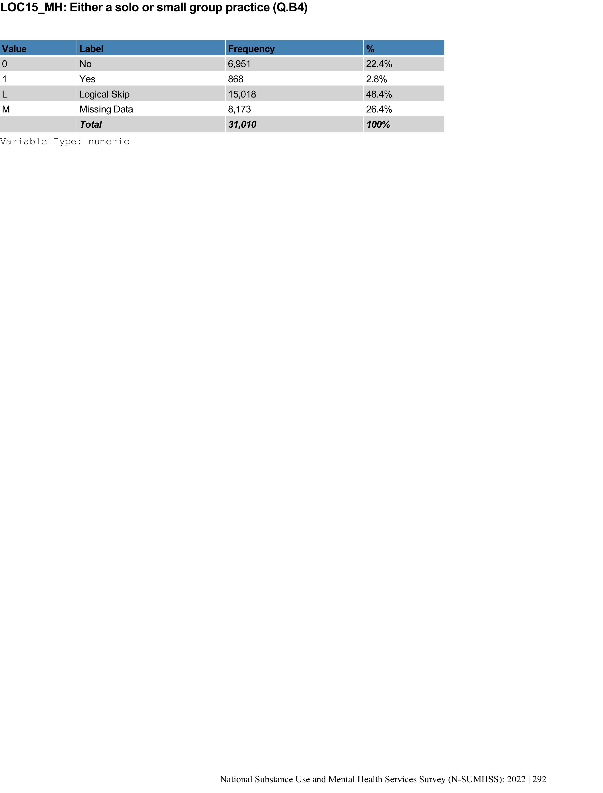

National Substance Use and Mental Health Services Survey (N-SUMHSS): 2022 | 292

## Licensed or accredited facility (Q.B4a)

| Value | Label         | Frequency | %      |
|-------|---------------|-----------|--------|
| 0     | No            | 106       | 0.3%   |
| 1     | Yes           | 764       | 2.5%   |
| L     | Logical Skip  | 21,966    | 70.8%  |
| M     | Missing Data  | 8,174     | 26.4%  |
| **Total** |               | **31,010**    | **100%** |

Variable Type: numeric

# HC: Assisted living or nursing home care (Q.B5)

| Value | Label        | Frequency | %    |
|-------|--------------|-----------|------|
| 0     | No           | 10,228    | 33.0%|
| 1     | Yes          | 96        | 0.3% |
| L     | Logical Skip | 12,258    | 39.5%|
| M     | Missing Data | 8,428     | 27.2%|
|       | **Total**    | **31,010**| **100%**|

Variable Type: numeric

National Substance Use and Mental Health Services Survey (N-SUMHSS): 2022 | 294

## Group homes (Q.B5)

| Value | Label        | Frequency | %     |
|-------|--------------|-----------|-------|
| 0     | No           | 9,814     | 31.6% |
| 1     | Yes          | 512       | 1.7%  |
| L     | Logical Skip | 12,258    | 39.5% |
| M     | Missing Data | 8,426     | 27.2% |

**Total** | 31,010 | **100%**

Variable Type: numeric

National Substance Use and Mental Health Services Survey (N-SUMHSS): 2022 | 295

## V: Clubhouse services (Q.B5)

| Value | Label        | Frequency | %      |
|-------|--------------|-----------|--------|
| 0     | No           | 10,115    | 32.6%  |
| 1     | Yes          | 210       | 0.7%   |
| L     | Logical Skip | 12,258    | 39.5%  |
| M     | Missing Data | 8,427     | 27.2%  |
| **Total** |              | **31,010**   | **100%**  |

Variable Type: numeric

---

National Substance Use and Mental Health Services Survey (N-SUMHSS): 2022 | 296

#### Emergency shelter (Q.B5)

| Value | Label        | Frequency | %      |
|-------|--------------|-----------|--------|
| 0     | No           | 10,214    | 32.9%  |
| 1     | Yes          | 109       | 0.4%   |
| L     | Logical Skip | 12,258    | 39.5%  |
| M     | Missing Data | 8,429     | 27.2%  |

|       | Total        | 31,010    | 100%   |

Variable Type: numeric

### For individuals with developmental disability (Q.B5)

| Value | Label        | Frequency | %     |
|-------|--------------|-----------|-------|
| 0     | No           | 9,659     | 31.1% |
| 1     | Yes          | 667       | 2.2%  |
| L     | Logical Skip | 12,258    | 39.5% |
| M     | Missing Data | 8,426     | 27.2% |
|       | **Total**    | **31,010**| **100%**|

Variable Type: numeric

National Substance Use and Mental Health Services Survey (N-SUMHSS): 2022 | 298

## Have you ever heard of these services (Q.B5)

| Value | Label         | Frequency | %      |
|-------|---------------|-----------|--------|
| 0     | No            | 1,403     | 4.5%   |
| 1     | Yes           | 8,984     | 29.0%  |
| L     | Logical Skip  | 12,258    | 39.5%  |
| M     | Missing Data  | 8,365     | 27.0%  |
|       | **Total**     | **31,010**| **100%**|

Variable Type: numeric

## ∅THRPY: Facility provides individual psychotherapy (Q.B6)

| Value | Label         | Frequency | %     |
|-------|---------------|-----------|-------|
| 0     | No            | 804       | 2.6%  |
| 1     | Yes           | 9,742     | 31.4% |
| L     | Logical Skip  | 12,258    | 39.5% |
| M     | Missing Data  | 8,206     | 26.5% |

|       | Total         | 31,010    | 100%  |

Variable Type: numeric

*National Substance Use and Mental Health Services Survey (N-SUMHSS): 2022 | 300*

## PY: Facility provides couples/family therapy (Q.B6)

| Value | Label         | Frequency | %     |
|-------|---------------|-----------|-------|
| 0     | No            | 2,807     | 9.1%  |
| 1     | Yes           | 7,717     | 24.9% |
| L     | Logical Skip  | 12,258    | 39.5% |
| M     | Missing Data  | 8,228     | 26.5% |

**Total**: 31,010 **100%**

Variable Type: numeric

---

National Substance Use and Mental Health Services Survey (N-SUMHSS): 2022 | 301

## PY: Facility provides group therapy (Q.B6)

| Value | Label        | Frequency | %     |
|-------|--------------|-----------|-------|
| 0     | No           | 1,645     | 5.3%  |
| 1     | Yes          | 8,885     | 28.7% |
| L     | Logical Skip | 12,258    | 39.5% |
| M     | Missing Data | 8,222     | 26.5% |

**Total** | 31,010 | **100%**

Variable Type: numeric

---

National Substance Use and Mental Health Services Survey (N-SUMHSS): 2022 | 302

**PY: Facility provides cognitive behavioral therapy (Q.B6)**

| Value | Label         | Frequency | %      |
|-------|---------------|-----------|--------|
| 0     | No            | 1,021     | 3.3%   |
| 1     | Yes           | 9,525     | 30.7%  |
| L     | Logical Skip  | 12,258    | 39.5%  |
| M     | Missing Data  | 8,206     | 26.5%  |
|       | **Total**     | **31,010**| **100%**|

Variable Type: numeric

## PY: Facility provides dialectical behavior therapy (Q.B6)

| Value | Label        | Frequency | %     |
|-------|--------------|-----------|-------|
| 0     | No           | 4,163     | 13.4% |
| 1     | Yes          | 6,359     | 20.5% |
| L     | Logical Skip | 12,258    | 39.5% |
| M     | Missing Data | 8,230     | 26.5% |
|       | **Total**    | **31,010**| **100%**|

Variable Type: numeric

National Substance Use and Mental Health Services Survey (N-SUMHSS): 2022 | 304

**I7: Facility provides cognitive remediation therapy (Q.B6)**

| Value | Label         | Frequency |     %    |
|-------|---------------|-----------|----------|
| 0     | No            | 9,997     |  32.2%   |
| 1     | Yes           | 496       |  1.6%    |
| L     | Logical Skip  | 12,258    |  39.5%   |
| M     | Missing Data  | 8,259     |  26.6%   |
|       | **Total**     | **31,010**| **100%** |

Variable Type: numeric

**4SA: Facility provides integrated mental health and substance use treatment (Q.B6)**

| Value | Label        | Frequency | %      |
|-------|--------------|-----------|--------|
| 0     | No           | 4,101     | 13.2%  |
| 1     | Yes          | 6,424     | 20.7%  |
| L     | Logical Skip | 12,258    | 39.5%  |
| M     | Missing Data | 8,227     | 26.5%  |
|       | **Total**    | **31,010**| **100%**|

Variable Type: numeric

---

National Substance Use and Mental Health Services Survey (N-SUMHSS): 2022 | 306

##### THRPY: Facility provides activity therapy (Q.B6)

| Value | Label         | Frequency | %      |
|-------|---------------|-----------|--------|
| 0     | No            | 5,591     | 18.0%  |
| 1     | Yes           | 4,921     | 15.9%  |
| L     | Logical Skip  | 12,258    | 39.5%  |
| M     | Missing Data  | 8,240     | 26.6%  |
| **Total** |               | **31,010**   | **100%** |

Variable Type: numeric

### O: Facility provides electroconvulsive therapy (Q.B6)

| Value | Label        | Frequency | %     |
|-------|--------------|-----------|-------|
| 0     | No           | 10,178    | 32.8% |
| 1     | Yes          | 313       | 1.0%  |
| L     | Logical Skip | 12,258    | 39.5% |
| M     | Missing Data | 8,261     | 26.6% |

**Total** | **31,010** | **100%**

Variable Type: numeric

---

National Substance Use and Mental Health Services Survey (N-SUMHSS): 2022 | 308

cilily provides Transcranial Magnetic Stimulation (TMS) (Q.B6)

| Value | Label        | Frequency | %      |
|-------|--------------|-----------|--------|
| 0     | No           | 10,306    | 33.2%  |
| 1     | Yes          | 185       | 0.6%   |
| L     | Logical Skip | 12,258    | 39.5%  |
| M     | Missing Data | 8,261     | 26.6%  |
|       | Total        | 31,010    | 100%   |

Variable Type: numeric

National Substance Use and Mental Health Services Survey (N-SUMHSS): 2022 | 309

ility provides Ketamine Infusion Therapy (KIT) (Q.B6)

| Value | Label        | Frequency | %     |
|-------|--------------|-----------|-------|
| 0     | No           | 10,391    | 33.5% |
| 1     | Yes          | 97        | 0.3%  |
| L     | Logical Skip | 12,258    | 39.5% |
| M     | Missing Data | 8,264     | 26.6% |
|       | **Total**    | **31,010**| **100%**|

Variable Type: numeric

:acility provides Eye Movement Desensitization and Reprocessing (EDMR) therapy (Q.B6)

| Value | Label        | Frequency | %     |
|-------|--------------|-----------|-------|
| 0     | No           | 8,583     | 27.7% |
| 1     | Yes          | 1,920     | 6.2%  |
| L     | Logical Skip | 12,258    | 39.5% |
| M     | Missing Data | 8,249     | 26.6% |

|       | Total        | 31,010    | 100%  |

Variable Type: numeric

### DINCE: Facility provides telemedicine/telehealth therapy (Q.B6)

| Value | Label         | Frequency | %     |
|-------|---------------|-----------|-------|
| 0     | No            | 2,268     | 7.3%  |
| 1     | Yes           | 8,263     | 26.6% |
| L     | Logical Skip  | 12,258    | 39.5% |
| M     | Missing Data  | 8,221     | 26.5% |
| **Total** | **31,010**    | **100%** |

Variable Type: numeric

---

National Substance Use and Mental Health Services Survey (N-SUMHSS): 2022 | 312

## Facility provides Abnormal Involuntary Movement Scale (AIMS) Test (Q.B6)

| Value | Label        | Frequency |      %       |
|-------|--------------|-----------|--------------|
| 0     | No           | 7,635     |   24.6%      |
| 1     | Yes          | 2,867     |    9.2%      |
| L     | Logical Skip | 12,258    |   39.5%      |
| M     | Missing Data | 8,250     |   26.6%      |
|       | **Total**    | **31,010**| **100%**     |

Variable Type: numeric

National Substance Use and Mental Health Services Survey (N-SUMHSS): 2022 | 313

#### cility provides other mental health treatment approach (Q.B6)  

| Value | Label        | Frequency | %     |
|-------|--------------|-----------|-------|
| 0     | No           | 9,357     | 30.2% |
| 1     | Yes          | 1,135     | 3.7%  |
| L     | Logical Skip | 12,258    | 39.5% |
| M     | Missing Data | 8,260     | 26.6% |
|       | **Total**    | **31,010**| **100%**|

Variable Type: numeric

### e of these mental health treatment modalities are offered (Q.B6)

| Value | Label        | Frequency | %      |
|-------|--------------|-----------|--------|
| 0     | No           | 10,434    | 33.6%  |
| 1     | Yes          | 123       | 0.4%   |
| L     | Logical Skip | 12,258    | 39.5%  |
| M     | Missing Data | 8,195     | 26.4%  |
|       | **Total**    | **31,010**| **100%**|

Variable Type: numeric

## Antipsychotics for the treatment of serious mental illness (SMI) (Q.B7)

| Value | Label        | Frequency | %       |
|-------|--------------|-----------|---------|
| 0     | No           | 3,498     | 11.3%   |
| 1     | Yes          | 6,886     | 22.2%   |
| L     | Logical Skip | 12,258    | 39.5%   |
| M     | Missing Data | 8,368     | 27.0%   |
|       | **Total**    | **31,010**| **100%**|

Variable Type: numeric

---

National Substance Use and Mental Health Services Survey (N-SUMHSS): 2022 | 316

### Iorpromazine, not used at this facility (Q.B7a)

| Value | Label        | Frequency | %      |
|-------|--------------|-----------|--------|
| 0     | No           | 5,417     | 17.5%  |
| 1     | Yes          | 1,312     | 4.2%   |
| L     | Logical Skip | 15,979    | 51.5%  |
| M     | Missing Data | 8,302     | 26.8%  |
|       | **Total**    | **31,010**| **100%**| 

Variable Type: numeric

---

National Substance Use and Mental Health Services Survey (N-SUMHSS): 2022 | 317

# Chlorpromazine, oral (Q.B7a)

| Value | Label         | Frequency | %     |
|-------|---------------|-----------|-------|
| 0     | No            | 3,697     | 11.9% |
| 1     | Yes           | 3,031     | 9.8%  |
| L     | Logical Skip  | 15,979    | 51.5% |
| M     | Missing Data  | 8,303     | 26.8% |
| **Total** |               | **31,010**    | **100%** |

Variable Type: numeric

## Chlorpromazine, injectable (Q.B7a)

| Value | Label         | Frequency | %      |
|-------|---------------|-----------|--------|
| 0     | No            | 5,849     | 18.9%  |
| 1     | Yes           | 866       | 2.8%   |
| L     | Logical Skip  | 15,979    | 51.5%  |
| M     | Missing Data  | 8,316     | 26.8%  |

**Total**  |  **31,010**  | **100%**

Variable Type: numeric

## Chlorpromazine, rectal (Q.B7a)

| Value | Label         | Frequency | %      |
|-------|---------------|-----------|--------|
| 0     | No            | 6,702     | 21.6%  |
| 1     | Yes           | 10        | 0.0%   |
| L     | Logical Skip  | 15,979    | 51.5%  |
| M     | Missing Data  | 8,319     | 26.8%  |
|       | **Total**     | **31,010**| **100%**|

Variable Type: numeric

---

*National Substance Use and Mental Health Services Survey (N-SUMHSS): 2022 | 320*

#### Ilorpromazine, do not know the mode of administration (Q.B7a)

| Value | Label         | Frequency | %       |
|-------|---------------|-----------|---------|
| 0     | No            | 4,456     | 14.4%   |
| 1     | Yes           | 2,273     | 7.3%    |
| L     | Logical Skip  | 15,979    | 51.5%   |
| M     | Missing Data  | 8,302     | 26.8%   |
|       | **Total**     | **31,010**| **100%**|

Variable Type: numeric

National Substance Use and Mental Health Services Survey (N-SUMHSS): 2022 | 321

# operidol, not used at this facility (Q.B7a)

| Value | Label        | Frequency | %     |
|-------|--------------|-----------|-------|
| 0     | No           | 3,180     | 10.3% |
| 1     | Yes          | 3,408     | 11.0% |
| L     | Logical Skip | 15,979    | 51.5% |
| M     | Missing Data | 8,443     | 27.2% |
|       | Total        | 31,010    | 100%  |

Variable Type: numeric

*National Substance Use and Mental Health Services Survey (N-SUMHSS): 2022 | 322*

## operidol, injectable (Q.B7a)

| Value | Label        | Frequency | %      |
|-------|--------------|-----------|--------|
| 0     | No           | 6,376     | 20.6%  |
| 1     | Yes          | 210       | 0.7%   |
| L     | Logical Skip | 15,979    | 51.5%  |
| M     | Missing Data | 8,445     | 27.2%  |
|       | **Total**    | 31,010    | **100%**|

Variable Type: numeric

National Substance Use and Mental Health Services Survey (N-SUMHSS): 2022 | 323

### operidol, do not know the mode of administration (Q.B7a)

| Value | Label         | Frequency |   %   |
|-------|---------------|-----------|-------|
| 0     | No            | 3,939     | 12.7% |
| 1     | Yes           | 2,646     |  8.5% |
| L     | Logical Skip  | 15,979    | 51.5% |
| M     | Missing Data  | 8,446     | 27.2% |
|       | **Total**     | **31,010**|**100%**|

Variable Type: numeric

## Phenazine, not used at this facility (Q.B7a)

| Value | Label        | Frequency | %       |
|-------|--------------|-----------|---------|
| 0     | No           | 5,514     | 17.8%   |
| 1     | Yes          | 1,175     | 3.8%    |
| L     | Logical Skip | 15,979    | 51.5%   |
| M     | Missing Data | 8,342     | 26.9%   |
|       | **Total**    | **31,010**| **100%**|

Variable Type: numeric

National Substance Use and Mental Health Services Survey (N-SUMHSS): 2022 | 325

# Fluphenazine, oral (Q.B7a)

| Value | Label        | Frequency | %       |
|-------|--------------|-----------|---------|
| 0     | No           | 3,680     | 11.9%   |
| 1     | Yes          | 3,007     | 9.7%    |
| L     | Logical Skip | 15,979    | 51.5%   |
| M     | Missing Data | 8,344     | 26.9%   |
|       | **Total**    | **31,010** | **100%** |

Variable Type: numeric

---

National Substance Use and Mental Health Services Survey (N-SUMHSS): 2022 | 326

## Iphénazine, injectable (Q.B7a)

| Value | Label         | Frequency | %     |
|-------|---------------|-----------|-------|
| 0     | No            | 5,435     | 17.5% |
| 1     | Yes           | 1,246     | 4.0%  |
| L     | Logical Skip  | 15,979    | 51.5% |
| M     | Missing Data  | 8,350     | 26.9% |

|       | Total         | 31,010    | 100%  |

Variable Type: numeric

National Substance Use and Mental Health Services Survey (N-SUMHSS): 2022 | 327

#### iphenazine, do not know the mode of administration (Q.B7a)

| Value | Label        | Frequency | %      |
|-------|--------------|-----------|--------|
| 0     | No           | 4,395     | 14.2%  |
| 1     | Yes          | 2,294     | 7.4%   |
| L     | Logical Skip | 15,979    | 51.5%  |
| M     | Missing Data | 8,342     | 26.9%  |
|       | **Total**    | **31,010**| **100%**|

Variable Type: numeric

## Iloperidol, not used at this facility (Q.B7a)

| Value | Label        | Frequency | %       |
|-------|--------------|-----------|---------|
| 0     | No           | 6,178     | 19.9%   |
| 1     | Yes          | 570       | 1.8%    |
| L     | Logical Skip | 15,979    | 51.5%   |
| M     | Missing Data | 8,283     | 26.7%   |
| **Total** |              | **31,010**  | **100%**  |

Variable Type: numeric

National Substance Use and Mental Health Services Survey (N-SUMHSS): 2022 | 329

## Haloperidol, oral (Q.B7a)

| Value | Label        | Frequency | %       |
|-------|--------------|-----------|---------|
| 0     | No           | 2,684     | 8.7%    |
| 1     | Yes          | 4,063     | 13.1%   |
| L     | Logical Skip | 15,979    | 51.5%   |
| M     | Missing Data | 8,284     | 26.7%   |
| **Total** |              | **31,010**   | **100%** |

**Variable Type:** numeric

*National Substance Use and Mental Health Services Survey (N-SUMHSS): 2022 | 330*

# Iloperidol, injectable (Q.B7a)

| Value | Label         | Frequency | %      |
|-------|---------------|-----------|--------|
| 0     | No            | 4,219     | 13.6%  |
| 1     | Yes           | 2,521     | 8.1%   |
| L     | Logical Skip  | 15,979    | 51.5%  |
| M     | Missing Data  | 8,291     | 26.7%  |
|       | **Total**     | **31,010**| **100%**|

Variable Type: numeric

National Substance Use and Mental Health Services Survey (N-SUMHSS): 2022 | 331

### Iloperidol, do not know the mode of administration (Q.B7a)

| Value | Label        | Frequency | %     |
|-------|--------------|-----------|-------|
| 0     | No           | 4,904     | 15.8% |
| 1     | Yes          | 1,844     | 5.9%  |
| L     | Logical Skip | 15,979    | 51.5% |
| M     | Missing Data | 8,283     | 26.7% |
|       | **Total**    | **31,010**| **100%** |

Variable Type: numeric

National Substance Use and Mental Health Services Survey (N-SUMHSS): 2022 | 332

# xapine, not used at this facility (Q.B7a)

| Value | Label         | Frequency | %     |
|-------|---------------|-----------|-------|
| 0     | No            | 4,724     | 15.2% |
| 1     | Yes           | 1,974     | 6.4%  |
| L     | Logical Skip  | 15,979    | 51.5% |
| M     | Missing Data  | 8,333     | 26.9% |

|       | **Total**     | **31,010**| **100%** |

Variable Type: numeric

National Substance Use and Mental Health Services Survey (N-SUMHSS): 2022 | 333

### Loxapine, oral (Q.B7a)

| Value | Label        | Frequency | %      |
|-------|--------------|-----------|--------|
| 0     | No           | 4,607     | 14.9%  |
| 1     | Yes          | 2,089     | 6.7%   |
| L     | Logical Skip | 15,979    | 51.5%  |
| M     | Missing Data | 8,335     | 26.9%  |
|       | **Total**    | **31,010**| **100%**|

Variable Type: numeric

National Substance Use and Mental Health Services Survey (N-SUMHSS): 2022 | 334

### xapine, injectable (Q.B7a)

| Value | Label         | Frequency | %     |
|-------|---------------|-----------|-------|
| 0     | No            | 6,523     | 21.0% |
| 1     | Yes           | 168       | 0.5%  |
| L     | Logical Skip  | 15,979    | 51.5% |
| M     | Missing Data  | 8,340     | 26.9% |
|       | Total         | 31,010    | 100%  |

Variable Type: numeric

National Substance Use and Mental Health Services Survey (N-SUMHSS): 2022 | 335

## Xapine, inhalation (Q.B7a)

| Value | Label         | Frequency | %      |
|-------|---------------|-----------|--------|
| 0     | No            | 6,675     | 21.5%  |
| 1     | Yes           | 16        | 0.1%   |
| L     | Logical Skip  | 15,979    | 51.5%  |
| M     | Missing Data  | 8,340     | 26.9%  |
|       | **Total**     | **31,010**| **100%**|

Variable Type: numeric

National Substance Use and Mental Health Services Survey (N-SUMHSS): 2022 | 336

#### xapine, do not know the mode of administration (Q.B7a)

| Value | Label        | Frequency | %      |
|-------|--------------|-----------|--------|
| 0     | No           | 4,153     | 13.4%  |
| 1     | Yes          | 2,546     | 8.2%   |
| L     | Logical Skip | 15,979    | 51.5%  |
| M     | Missing Data | 8,332     | 26.9%  |
|       | **Total**    | **31,010**| **100%**|

Variable Type: numeric

National Substance Use and Mental Health Services Survey (N-SUMHSS): 2022 | 337

rphenazine, not used at this facility (Q.B7a)

| Value | Label         | Frequency | %     |
|-------|---------------|-----------|-------|
| 0     | No            | 5,143     | 16.6% |
| 1     | Yes           | 1,572     | 5.1%  |
| L     | Logical Skip  | 15,979    | 51.5% |
| M     | Missing Data  | 8,316     | 26.8% |
| **Total** |           | **31,010**  | **100%** |

Variable Type: numeric

National Substance Use and Mental Health Services Survey (N-SUMHSS): 2022 | 338

## Perphenazine, oral (Q.B7a)

| Value | Label         | Frequency |    %    |
|-------|---------------|-----------|---------|
| 0     | No            | 4,176     | 13.5%   |
| 1     | Yes           | 2,538     | 8.2%    |
| L     | Logical Skip  | 15,979    | 51.5%   |
| M     | Missing Data  | 8,317     | 26.8%   |
|       | **Total**     | **31,010**| **100%**|

Variable Type: numeric

---

*National Substance Use and Mental Health Services Survey (N-SUMHSS): 2022 | 339*

## Perphenazine, injectable (Q.B7a)

| Value | Label        | Frequency | %     |
|-------|--------------|-----------|-------|
| 0     | No           | 6,457     | 20.8% |
| 1     | Yes          | 244       | 0.8%  |
| L     | Logical Skip | 15,979    | 51.5% |
| M     | Missing Data | 8,330     | 26.9% |

**Total**: 31,010 (100%)

Variable Type: numeric

*National Substance Use and Mental Health Services Survey (N-SUMHSS): 2022 | 340*

rphenazine, do not know the mode of administration (Q.B7a)

| Value | Label        | Frequency | %     |
|-------|--------------|-----------|-------|
| 0     | No           | 4,209     | 13.6% |
| 1     | Yes          | 2,506     | 8.1%  |
| L     | Logical Skip | 15,979    | 51.5% |
| M     | Missing Data | 8,316     | 26.8% |

**Total** | **31,010** | **100%**

Variable Type: numeric

National Substance Use and Mental Health Services Survey (N-SUMHSS): 2022 | 341

## Value
| Value | Label         | Frequency | %       |
|-------|---------------|-----------|---------|
| 0     | No            | 3,844     | 12.4%   |
| 1     | Yes           | 2,823     | 9.1%    |
| L     | Logical Skip  | 15,979    | 51.5%   |
| M     | Missing Data  | 8,364     | 27.0%   |

**Total** | **31,010** | **100%**

Variable Type: numeric

### Pimozide, oral (Q.B7a)

| Value | Label        | Frequency | %     |
|-------|--------------|-----------|-------|
| 0     | No           | 5,676     | 18.3% |
| 1     | Yes          | 990       | 3.2%  |
| L     | Logical Skip | 15,979    | 51.5% |
| M     | Missing Data | 8,365     | 27.0% |

**Total: 31,010 100%**

Variable Type: numeric

# mozide, topical (Q.B7a)

| Value | Label         | Frequency | %      |
|-------|---------------|-----------|--------|
| 0     | No            | 6,654     | 21.5%  |
| 1     | Yes           | 8         | 0.0%   |
| L     | Logical Skip  | 15,979    | 51.5%  |
| M     | Missing Data  | 8,369     | 27.0%  |
| **Total** |           | **31,010** | **100%** |

Variable Type: numeric

### iodize, do not know the mode of administration (Q.B7a)

| Value | Label        | Frequency | %      |
|-------|--------------|-----------|--------|
| 0     | No           | 3,923     | 12.7%  |
| 1     | Yes          | 2,743     | 8.8%   |
| L     | Logical Skip | 15,979    | 51.5%  |
| M     | Missing Data | 8,365     | 27.0%  |

|       | **Total**    | **31,010**| **100%** |

Variable Type: numeric

National Substance Use and Mental Health Services Survey (N-SUMHSS): 2022 | 345

## ochlorperazine, not used at this facility (Q.B7a)

| Value | Label        | Frequency |     %     |
|-------|--------------|-----------|-----------|
| 0     | No           | 4,009     |  12.9%    |
| 1     | Yes          | 2,669     |   8.6%    |
| L     | Logical Skip | 15,979    |  51.5%    |
| M     | Missing Data | 8,353     |  26.9%    |
| **Total** |              | **31,010**    | **100%**     |

Variable Type: numeric

Prochlorperazine, oral (Q.B7a)

| Value | Label        | Frequency | %      |
|-------|--------------|-----------|--------|
| 0     | No           | 5,453     | 17.6%  |
| 1     | Yes          | 1,224     | 3.9%   |
| L     | Logical Skip | 15,979    | 51.5%  |
| M     | Missing Data | 8,354     | 26.9%  |
|       | **Total**        | **31,010**    | **100%** |

Variable Type: numeric

National Substance Use and Mental Health Services Survey (N-SUMHSS): 2022 | 347

## 0chlorperazine, injectable (Q.B7a)

| Value | Label         | Frequency | %      |
|-------|---------------|-----------|--------|
| 0     | No            | 6,457     | 20.8%  |
| 1     | Yes           | 217       | 0.7%   |
| L     | Logical Skip  | 15,979    | 51.5%  |
| M     | Missing Data  | 8,357     | 26.9%  |
| **Total** | **31,010** | **100%**  |

Variable Type: numeric

## Prochlorperazine, rectal (Q.B7a)

| Value | Label         | Frequency | %      |
|-------|---------------|-----------|--------|
| 0     | No            | 6,587     | 21.2%  |
| 1     | Yes           | 86        | 0.3%   |
| L     | Logical Skip  | 15,979    | 51.5%  |
| M     | Missing Data  | 8,358     | 27.0%  |
| **Total** | **31,010** | **100%** |

Variable Type: numeric

---

National Substance Use and Mental Health Services Survey (N-SUMHSS): 2022 | 349

## ochlorperazine, do not know the mode of administration (Q.B7a)

| Value | Label         | Frequency | %     |
|-------|---------------|-----------|-------|
| 0     | No            | 3,994     | 12.9% |
| 1     | Yes           | 2,685     | 8.7%  |
| L     | Logical Skip  | 15,979    | 51.5% |
| M     | Missing Data  | 8,352     | 26.9% |
| **Total** |               | **31,010**  | **100%**|

Variable Type: numeric

### Thioxthixene, not used at this facility (Q.B7a)

| Value | Label        | Frequency |   %   |
|-------|--------------|-----------|-------|
| 0     | No           | 4,364     | 14.1% |
| 1     | Yes          | 2,306     |  7.4% |
| L     | Logical Skip | 15,979    | 51.5% |
| M     | Missing Data | 8,361     | 27.0% |

| **Total** |           | 31,010    | 100%  |

Variable Type: numeric

National Substance Use and Mental Health Services Survey (N-SUMHSS): 2022 | 351

## Thiothixene, oral (Q.B7a)

| Value | Label        | Frequency | %     |
|-------|--------------|-----------|-------|
| 0     | No           | 5,093     | 16.4% |
| 1     | Yes          | 1,576     | 5.1%  |
| L     | Logical Skip | 15,979    | 51.5% |
| M     | Missing Data | 8,362     | 27.0% |
| **Total**  |              | **31,010**    | **100%** |

Variable Type: numeric

## Fluphenazine and flupenthixene, injectable (Q.B7a)

| Value | Label       | Frequency | %    |
|-------|-------------|-----------|------|
| 0     | No          | 6,563     | 21.2%|
| 1     | Yes         | 102       | 0.3% |
| L     | Logical Skip| 15,979    | 51.5%|
| M     | Missing Data| 8,366     | 27.0%|

| Total | 31,010 | 100% |

Variable Type: numeric

National Substance Use and Mental Health Services Survey (N-SUMHSS): 2022 | 353

## Thiothixene, do not know the mode of administration (Q.B7a)

| Value | Label        | Frequency | %     |
|-------|--------------|-----------|-------|
| 0     | No           | 3,999     | 12.9% |
| 1     | Yes          | 2,678     | 8.6%  |
| L     | Logical Skip | 15,979    | 51.5% |
| M     | Missing Data | 8,354     | 26.9% |

**Total**  |  **31,010**  |  **100%**  

Variable Type: numeric

National Substance Use and Mental Health Services Survey (N-SUMHSS): 2022 | 354

## oridazine, not used at this facility (Q.B7a)

| Value | Label        | Frequency | %      |
|-------|--------------|-----------|--------|
| 0     | No           | 4,187     | 13.5%  |
| 1     | Yes          | 2,511     | 8.1%   |
| L     | Logical Skip | 15,979    | 51.5%  |
| M     | Missing Data | 8,333     | 26.9%  |
|       | **Total**    | **31,010**| **100%**|

Variable Type: numeric

National Substance Use and Mental Health Services Survey (N-SUMHSS): 2022 | 355

### Thioridazine, oral (Q.B7a)

| Value | Label         | Frequency | %     |
|-------|---------------|-----------|-------|
| 0     | No            | 5,183     | 16.7% |
| 1     | Yes           | 1,513     | 4.9%  |
| L     | Logical Skip  | 15,979    | 51.5% |
| M     | Missing Data  | 8,335     | 26.9% |

**Total** | **31,010** | **100%**

Variable Type: numeric

### oridazine, do not know the mode of administration (Q.B7a)

| Value | Label        | Frequency | %      |
|-------|--------------|-----------|--------|
| 0     | No           | 4,114     | 13.3%  |
| 1     | Yes          | 2,586     | 8.3%   |
| L     | Logical Skip | 15,979    | 51.5%  |
| M     | Missing Data | 8,331     | 26.9%  |
|       | **Total**    | **31,010**| **100%**|

Variable Type: numeric

## Tuoperazine, not used at this facility (Q.B7a)

| Value | Label            | Frequency | %       |
|-------|------------------|-----------|---------|
| 0     | No               | 4,248     | 13.7%   |
| 1     | Yes              | 2,459     | 7.9%    |
| L     | Logical Skip     | 15,979    | 51.5%   |
| M     | Missing Data     | 8,324     | 26.8%   |
| **Total** |              | **31,010**| **100%**|

Variable Type: numeric

## trifluoperazine, oral (Q.B7a)

| Value | Label         | Frequency | %      |
|-------|---------------|-----------|--------|
| 0     | No            | 5,278     | 17.0%  |
| 1     | Yes           | 1,428     | 4.6%   |
| L     | Logical Skip  | 15,979    | 51.5%  |
| M     | Missing Data  | 8,325     | 26.8%  |
| **Total** |               | **31,010**   | **100%** |

Variable Type: numeric

National Substance Use and Mental Health Services Survey (N-SUMHSS): 2022 | 359

### Ioperazine, injectable (Q.B7a)

| Value | Label         | Frequency | %      |
|-------|---------------|-----------|--------|
| 0     | No            | 6,570     | 21.2%  |
| 1     | Yes           | 133       | 0.4%   |
| L     | Logical Skip  | 15,979    | 51.5%  |
| M     | Missing Data  | 8,328     | 26.9%  |
| **Total** |               | **31,010**  | **100%** |

Variable Type: numeric

*National Substance Use and Mental Health Services Survey (N-SUMHSS): 2022 | 360*

## uoperazine, do not know the mode of administration (Q.B7a)

| Value | Label         | Frequency | %      |
|-------|---------------|-----------|--------|
| 0     | No            | 3,974     | 12.8%  |
| 1     | Yes           | 2,736     | 8.8%   |
| L     | Logical Skip  | 15,979    | 51.5%  |
| M     | Missing Data  | 8,321     | 26.8%  |
|       | **Total**     | **31,010**| **100%**|

Variable Type: numeric

---
National Substance Use and Mental Health Services Survey (N-SUMHSS): 2022 | 361

# IO: Other first-generation antipsychotics, not used at this facility (Q.B7a)

| Value | Label        | Frequency | %     |
|-------|--------------|-----------|-------|
| 0     | No           | 104       | 0.3%  |
| 1     | Yes          | 6,782     | 21.9% |
| L     | Logical Skip | 15,979    | 51.5% |
| M     | Missing Data | 8,145     | 26.3% |

**Total**: 31,010 **100%**

Variable Type: numeric

---

National Substance Use and Mental Health Services Survey (N-SUMHSS): 2022 | 362

**ORAL: Other first-generation antipsychotics, oral (Q.B7a)**

| Value | Label | Frequency | %      |
|-------|-------|-----------|--------|
| 0     | No    | 6,792     | 21.9%  |
| 1     | Yes   | 93        | 0.3%   |
| L     | Logical Skip  | 15,979    | 51.5%  |
| M     | Missing Data  | 8,146     | 26.3%  |
| **Total** |       | **31,010**     | **100%** |

Variable Type: numeric

---

National Substance Use and Mental Health Services Survey (N-SUMHSS): 2022 | 363

# J: Other first-generation antipsychotics, injectable (Q.B7a)

| Value | Label         | Frequency | %    |
|-------|---------------|-----------|------|
| 0     | No            | 6,851     | 22.1 |
| 1     | Yes           | 34        | 0.1  |
| L     | Logical Skip  | 15,979    | 51.5 |
| M     | Missing Data  | 8,146     | 26.3 |

**Total** | **31,010** | **100%**

Variable Type: numeric

National Substance Use and Mental Health Services Survey (N-SUMHSS): 2022

## AI: Other first-generation antipsychotics, long-acting injectable (Q.B7a)

| Value | Label        | Frequency | %     |
|-------|--------------|-----------|-------|
| 0     | No           | 6,864     | 22.1% |
| 1     | Yes          | 21        | 0.1%  |
| L     | Logical Skip | 15,979    | 51.5% |
| M     | Missing Data | 8,146     | 26.3% |
|       | **Total**    | **31,010**| **100%** |

Variable Type: numeric

National Substance Use and Mental Health Services Survey (N-SUMHSS): 2022 | 365

### EC: Other first-generation antipsychotics, rectal (Q.B7a)

| Value | Label        | Frequency | %      |
|-------|--------------|-----------|--------|
| 0     | No           | 6,884     | 22.2%  |
| 1     | Yes          | 1         | 0.0%   |
| L     | Logical Skip | 15,979    | 51.5%  |
| M     | Missing Data | 8,146     | 26.3%  |
|       | Total        | 31,010    | 100%   |

Variable Type: numeric

---

National Substance Use and Mental Health Services Survey (N-SUMHSS): 2022 | 366

# OP: Other first-generation antipsychotics, topical (Q.B7a)

| Value | Label         | Frequency | %     |
|-------|---------------|-----------|-------|
| 0     | No            | 6,884     | 22.2% |
| 1     | Yes           | 1         | 0.0%  |
| L     | Logical Skip  | 15,979    | 51.5% |
| M     | Missing Data  | 8,146     | 26.3% |
| **Total** |  | **31,010**  | **100%** |

Variable Type: numeric

National Substance Use and Mental Health Services Survey (N-SUMHSS): 2022 | 367

## H: Other first-generation antipsychotics, inhalation (Q.B7a)

| Value | Label         | Frequency | %     |
|-------|---------------|-----------|-------|
| 0     | No            | 6,883     | 22.2% |
| 1     | Yes           | 1         | 0.0%  |
| L     | Logical Skip  | 15,979    | 51.5% |
| M     | Missing Data  | 8,147     | 26.3% |
|       | **Total**     | **31,010**| **100%** |

Variable Type: numeric

*National Substance Use and Mental Health Services Survey (N-SUMHSS): 2022 | 368*

**K: Other first-generation antipsychotics, do not know the mode of administration (Q.B7a)**

| Value | Label         | Frequency | %     |
|-------|---------------|-----------|-------|
| 0     | No            | 6,886     | 22.2% |
| L     | Logical Skip  | 15,979    | 51.5% |
| M     | Missing Data  | 8,145     | 26.3% |

**Total 31,010  100%**

Variable Type: numeric

---
National Substance Use and Mental Health Services Survey (N-SUMHSS): 2022 | 369

### Ipramazole, not used at this facility (Q.B7a)

| Value | Label        | Frequency | %     |
|-------|--------------|-----------|-------|
| 0     | No           | 6,420     | 20.7% |
| 1     | Yes          | 334       | 1.1%  |
| L     | Logical Skip | 15,979    | 51.5% |
| M     | Missing Data | 8,277     | 26.7% |
|       | **Total**    | **31,010**| **100%**|

Variable Type: numeric

National Substance Use and Mental Health Services Survey (N-SUMHSS): 2022 | 370

## Aripiprazole, oral (Q.B7a)

| Value | Label         | Frequency | %      |
|-------|---------------|-----------|--------|
| 0     | No            | 2,642     | 8.5%   |
| 1     | Yes           | 4,112     | 13.3%  |
| L     | Logical Skip  | 15,979    | 51.5%  |
| M     | Missing Data  | 8,277     | 26.7%  |
|       | **Total**     | **31,010**| **100%**|

Variable Type: numeric

*National Substance Use and Mental Health Services Survey (N-SUMHSS): 2022 | 371*

## iprazole, injectable (Q.B7a)

| Value | Label         | Frequency | %      |
|-------|---------------|-----------|--------|
| 0     | No            | 5,525     | 17.8%  |
| 1     | Yes           | 1,215     | 3.9%   |
| L     | Logical Skip  | 15,979    | 51.5%  |
| M     | Missing Data  | 8,291     | 26.7%  |
|       | **Total**     | **31,010**| **100%**|

Variable Type: numeric

National Substance Use and Mental Health Services Survey (N-SUMHSS): 2022 | 372

## Ziprasidone, long-acting injectable (Q.B7a)

| Value | Label         | Frequency | %     |
|-------|---------------|-----------|-------|
| 0     | No            | 4,901     | 15.8% |
| 1     | Yes           | 1,839     | 5.9%  |
| L     | Logical Skip  | 15,979    | 51.5% |
| M     | Missing Data  | 8,291     | 26.7% |

**Total** | **31,010** | **100%**

Variable Type: numeric

National Substance Use and Mental Health Services Survey (N-SUMHSS): 2022 | 373

## iprazole, do not know the mode of administration (Q.B7a)

| Value | Label        | Frequency | %       |
|-------|--------------|-----------|---------|
| 0     | No           | 4,606     | 14.9%   |
| 1     | Yes          | 2,149     | 6.9%    |
| L     | Logical Skip | 15,979    | 51.5%   |
| M     | Missing Data | 8,276     | 26.7%   |

|       | **Total**    | **31,010**| **100%**|

Variable Type: numeric

National Substance Use and Mental Health Services Survey (N-SUMHSS): 2022 | 374

## Asenapine, not used at this facility (Q.B7a)

| Value | Label        | Frequency | %      |
|-------|--------------|-----------|--------|
| 0     | No           | 4,965     | 16.0%  |
| 1     | Yes          | 1,711     | 5.5%   |
| L     | Logical Skip | 15,979    | 51.5%  |
| M     | Missing Data | 8,355     | 26.9%  |
|       | **Total**    | **31,010**| **100%**|

Variable Type: numeric

---

National Substance Use and Mental Health Services Survey (N-SUMHSS): 2022 | 375

# Asenapine, oral (Q.B7a)

| Value | Label        | Frequency  | %     |
|-------|--------------|------------|-------|
| 0     | No           | 4,612      | 14.9% |
| 1     | Yes          | 2,064      | 6.7%  |
| L     | Logical Skip | 15,979     | 51.5% |
| M     | Missing Data | 8,355      | 26.9% |
|       | Total        | 31,010     | 100%  |

Variable Type: numeric

---

National Substance Use and Mental Health Services Survey (N-SUMHSS): 2022 | 376

## Senapine, topical (Q.B7a)

| Value | Label         | Frequency | %     |
|-------|---------------|-----------|-------|
| 0     | No            | 6,515     | 21.0% |
| 1     | Yes           | 51        | 0.2%  |
| L     | Logical Skip  | 15,979    | 51.5% |
| M     | Missing Data  | 8,465     | 27.3% |
| **Total** |           | **31,010** | **100%** |

Variable Type: numeric

National Substance Use and Mental Health Services Survey (N-SUMHSS): 2022

### Iloperidone, loxapine, lumateperone, or asenapine, do not know the mode of administration (Q.B7a)

| Value | Label        | Frequency | %     |
|-------|--------------|-----------|-------|
| 0     | No           | 3,847     | 12.4% |
| 1     | Yes          | 2,832     | 9.1%  |
| L     | Logical Skip | 15,979    | 51.5% |
| M     | Missing Data | 8,352     | 26.9% |

|       | **Total**    | **31,010** | **100%** |

Variable Type: numeric

---

National Substance Use and Mental Health Services Survey (N-SUMHSS): 2022 | 378

### expiprazole, not used at this facility (Q.B7a)

| Value | Label       | Frequency | %       |
|-------|-------------|-----------|---------|
| 0     | No          | 5,084     | 16.4%   |
| 1     | Yes         | 1,577     | 5.1%    |
| L     | Logical Skip| 15,979    | 51.5%   |
| M     | Missing Data| 8,370     | 27.0%   |
| **Total** |             | **31,010** | **100%** |

Variable Type: numeric

### Brexpiprazole, oral (Q.B7a)

| Value | Label         | Frequency | %     |
|-------|---------------|-----------|-------|
| 0     | No            | 4,431     | 14.3% |
| 1     | Yes           | 2,230     | 7.2%  |
| L     | Logical Skip  | 15,979    | 51.5% |
| M     | Missing Data  | 8,370     | 27.0% |
|       | **Total**     | **31,010**| **100%** |

Variable Type: numeric

### expiprazole, do not know the mode of administration (Q.B7a)

| Value | Label         | Frequency | %     |
|-------|---------------|-----------|-------|
| 0     | No            | 3,892     | 12.6% |
| 1     | Yes           | 2,773     | 8.9%  |
| L     | Logical Skip  | 15,979    | 51.5% |
| M     | Missing Data  | 8,366     | 27.0% |
| **Total** |           | **31,010** | **100%** |

Variable Type: numeric

National Substance Use and Mental Health Services Survey (N-SUMHSS): 2022 | 381

### Ciprazine, not used at this facility (Q.B7a)

| Value | Label        | Frequency | %       |
|-------|--------------|-----------|---------|
| 0     | No           | 5,125     | 16.5%   |
| 1     | Yes          | 1,541     | 5.0%    |
| L     | Logical Skip | 15,979    | 51.5%   |
| M     | Missing Data | 8,365     | 27.0%   |
|       | **Total**    | **31,010**| **100%**|

Variable Type: numeric

National Substance Use and Mental Health Services Survey (N-SUMHSS): 2022 | 382

## Cariprazine, oral (Q.B7a)

| Value | Label        | Frequency | %       |
|-------|--------------|-----------|---------|
| 0     | No           | 4,385     | 14.1%   |
| 1     | Yes          | 2,281     | 7.4%    |
| L     | Logical Skip | 15,979    | 51.5%   |
| M     | Missing Data | 8,365     | 27.0%   |
|       | **Total**    | **31,010** | **100%** |

Variable Type: numeric

National Substance Use and Mental Health Services Survey (N-SUMHSS): 2022 | 383

### ziprazine, do not know the mode of administration (Q.B7a)

| Value | Label        | Frequency | %      |
|-------|--------------|-----------|--------|
| 0     | No           | 3,923     | 12.7%  |
| 1     | Yes          | 2,744     | 8.8%   |
| L     | Logical Skip | 15,979    | 51.5%  |
| M     | Missing Data | 8,364     | 27.0%  |
|       | **Total**    | **31,010**| **100%**|

Variable Type: numeric

------

National Substance Use and Mental Health Services Survey (N-SUMHSS): 2022 | 384

## ۞zapine, not used at this facility (Q.B7a)

| Value | Label         | Frequency | %     |
|-------|---------------|-----------|-------|
| 0     | No            | 6,009     | 19.4% |
| 1     | Yes           | 697       | 2.2%  |
| L     | Logical Skip  | 15,979    | 51.5% |
| M     | Missing Data  | 8,325     | 26.8% |
| **Total** |           | **31,010** | **100%** |

Variable Type: numeric

National Substance Use and Mental Health Services Survey (N-SUMHSS): 2022 | 385

# Clozapine, oral (Q.B7a)

| Value | Label        | Frequency | %     |
|-------|--------------|-----------|-------|
| 0     | No           | 2,768     | 8.9%  |
| 1     | Yes          | 3,938     | 12.7% |
| L     | Logical Skip | 15,979    | 51.5% |
| M     | Missing Data | 8,325     | 26.8% |

|       | **Total**    | **31,010**| **100%**|

Variable Type: numeric

Ͼzapine, do not know the mode of administration (Q.B7a)

| Value | Label        | Frequency | %       |
|-------|--------------|-----------|---------|
| 0     | No           | 4,710     | 15.2%   |
| 1     | Yes          | 1,996     | 6.4%    |
| L     | Logical Skip | 15,979    | 51.5%   |
| M     | Missing Data | 8,325     | 26.8%   |
|       | **Total**    | **31,010** | **100%** |

Variable Type: numeric

# eridone, not used at this facility (Q.B7a)

| Value | Label        | Frequency | %    |
|-------|--------------|-----------|------|
| 0     | No           | 4,711     | 15.2%|
| 1     | Yes          | 1,951     | 6.3% |
| L     | Logical Skip | 15,979    | 51.5%|
| M     | Missing Data | 8,369     | 27.0%|
|       | **Total**    | **31,010**|**100%**|

Variable Type: numeric

---

National Substance Use and Mental Health Services Survey (N-SUMHSS): 2022 | 388

## Ioperidone, oral (Q.B7a)

| Value | Label        | Frequency | %      |
|-------|--------------|-----------|--------|
| 0     | No           | 4,953     | 16.0%  |
| 1     | Yes          | 1,709     | 5.5%   |
| L     | Logical Skip | 15,979    | 51.5%  |
| M     | Missing Data | 8,369     | 27.0%  |
|       | **Total**    | **31,010**| **100%**|

Variable Type: numeric

---

National Substance Use and Mental Health Services Survey (N-SUMHSS): 2022 | 389

#### eridone, do not know the mode of administration (Q.B7a)

| Value | Label        | Frequency | %     |
|-------|--------------|-----------|-------|
| 0     | No           | 3,755     | 12.1% |
| 1     | Yes          | 2,911     | 9.4%  |
| L     | Logical Skip | 15,979    | 51.5% |
| M     | Missing Data | 8,365     | 27.0% |

|       | **Total**    | **31,010**|**100%**|

Variable Type: numeric

### risadione, not used at this facility (Q.B7a)

| Value | Label         | Frequency | %      |
|-------|---------------|-----------|--------|
| 0     | No            | 5,792     | 18.7%  |
| 1     | Yes           | 882       | 2.8%   |
| L     | Logical Skip  | 15,979    | 51.5%  |
| M     | Missing Data  | 8,357     | 26.9%  |
|       | **Total**     | **31,010**|**100%**|

Variable Type: numeric

# Lurasidone, oral (Q.B7a)

| Value | Label        | Frequency | %     |
|-------|--------------|-----------|-------|
| 0     | No           | 3,583     | 11.6% |
| 1     | Yes          | 3,090     | 10.0% |
| L     | Logical Skip | 15,979    | 51.5% |
| M     | Missing Data | 8,358     | 27.0% |

|       | **Total**    | **31,010**   | **100%** |

Variable Type: numeric 

National Substance Use and Mental Health Services Survey (N-SUMHSS): 2022 | 392

### rasidone, do not know the mode of administration (Q.B7a)

| Value | Label         | Frequency | %      |
|-------|---------------|-----------|--------|
| 0     | No            | 4,056     | 13.1%  |
| 1     | Yes           | 2,618     | 8.4%   |
| L     | Logical Skip  | 15,979    | 51.5%  |
| M     | Missing Data  | 8,357     | 26.9%  |
|       | **Total**     | **31,010**|**100%**|

Variable Type: numeric

---

National Substance Use and Mental Health Services Survey (N-SUMHSS): 2022 | 393

## Clozapine, not used at this facility (Q.B7a)

| Value | Label        | Frequency | %     |
|-------|--------------|-----------|-------|
| 0     | No           | 6,430     | 20.7% |
| 1     | Yes          | 312       | 1.0%  |
| L     | Logical Skip | 15,979    | 51.5% |
| M     | Missing Data | 8,289     | 26.7% |

**Total**: 31,010  100%

Variable Type: numeric

National Substance Use and Mental Health Services Survey (N-SUMHSS): 2022 | 394

## Olanzapine, oral (Q.B7a)

| Value | Label        | Frequency | %     |
|-------|--------------|-----------|-------|
| 0     | No           | 2,414     | 7.8%  |
| 1     | Yes          | 4,327     | 14.0% |
| L     | Logical Skip | 15,979    | 51.5% |
| M     | Missing Data | 8,290     | 26.7% |
| **Total** |              | **31,010** | **100%** |

Variable Type: numeric

anzapine, injectable (Q.B7a)

| Value | Label        | Frequency | %     |
|-------|--------------|-----------|-------|
| 0     | No           | 5,675     | 18.3% |
| 1     | Yes          | 1,053     | 3.4%  |
| L     | Logical Skip | 15,979    | 51.5% |
| M     | Missing Data | 8,303     | 26.8% |

|       | Total        | 31,010    | 100%  |

Variable Type: numeric

# anzapine, long-acting injectable (Q.B7a)

| Value | Label         | Frequency | %    |
|-------|---------------|-----------|------|
| 0     | No            | 6,233     | 20.1 |
| 1     | Yes           | 490       | 1.6  |
| L     | Logical Skip  | 15,979    | 51.5 |
| M     | Missing Data  | 8,308     | 26.8 |
| **Total** |           | **31,010** | **100%** |

Variable Type: numeric

---

National Substance Use and Mental Health Services Survey (N-SUMHSS): 2022 | 397

## Amantadine, do not know the mode of administration (Q.B7a)

|Value| Label         | Frequency | %      |
|-----|---------------|-----------|--------|
| 0   | No            | 4,724     | 15.2%  |
| 1   | Yes           | 2,020     | 6.5%   |
| L   | Logical Skip  | 15,979    | 51.5%  |
| M   | Missing Data  | 8,287     | 26.7%  |

**Total** | **31,010** | **100%**

Variable Type: numeric

## Olanzapine/Fluoxetine combination, not used at this facility (Q.B7a)

| Value | Label         | Frequency | %      |
|-------|---------------|-----------|-------|
| 0     | No            | 4,846     | 15.6% |
| 1     | Yes           | 1,840     | 5.9%  |
| L     | Logical Skip  | 15,979    | 51.5% |
| M     | Missing Data  | 8,345     | 26.9% |

**Total**: **31,010** **100%**

Variable Type: numeric

National Substance Use and Mental Health Services Survey (N-SUMHSS): 2022 | 399

### AL: Olanzapine/Fluoxetine combination, oral (Q.B7a)

| Value | Label        | Frequency | %       |
|-------|--------------|-----------|---------|
| 0     | No           | 4,565     | 14.7%   |
| 1     | Yes          | 2,121     | 6.8%    |
| L     | Logical Skip | 15,979    | 51.5%   |
| M     | Missing Data | 8,345     | 26.9%   |
| **Total** |        | **31,010** | **100%** |

Variable Type: numeric

 **Olanzapine/Fluoxetine combination, do not know the mode of administration (Q.B7a)**

| Value | Label         | Frequency | %      |
|-------|---------------|-----------|--------|
| 0     | No            | 4,044     | 13.0%  |
| 1     | Yes           | 2,645     | 8.5%   |
| L     | Logical Skip  | 15,979    | 51.5%  |
| M     | Missing Data  | 8,342     | 26.9%  |
|       | **Total**     | **31,010**| **100%**|

Variable Type: numeric

National Substance Use and Mental Health Services Survey (N-SUMHSS): 2022 | 401

### perdione, not used at this facility (Q.B7a)

| Value | Label         | Frequency | %      |
|-------|---------------|-----------|--------|
| 0     | No            | 6,059     | 19.5%  |
| 1     | Yes           | 663       | 2.1%   |
| L     | Logical Skip  | 15,979    | 51.5%  |
| M     | Missing Data  | 8,309     | 26.8%  |
| **Total** |           | **31,010** | **100%** |

Variable Type: numeric

*National Substance Use and Mental Health Services Survey (N-SUMHSS): 2022 | 402*

## Paliperidone, oral (Q.B7a)
| Value | Label | Frequency | % |
|-------|-------|-----------|---|
| 0     | No    | 3,586     | 11.6% |
| 1     | Yes   | 3,130     | 10.1% |
| L     | Logical Skip | 15,979 | 51.5% |
| M     | Missing Data | 8,315 | 26.8% |

**Total** | **31,010** | **100%**

Variable Type: numeric

National Substance Use and Mental Health Services Survey (N-SUMHSS): 2022 | 403

## peridone, injectable (Q.B7a)

| Value | Label        | Frequency | %     |
|-------|--------------|-----------|-------|
| 0     | No           | 5,719     | 18.4% |
| 1     | Yes          | 984       | 3.2%  |
| L     | Logical Skip | 15,979    | 51.5% |
| M     | Missing Data | 8,328     | 26.9% |
| **Total** |          | **31,010**| **100%** |

Variable Type: numeric

*National Substance Use and Mental Health Services Survey (N-SUMHSS): 2022 | 404*

#### iperidone, long-acting injectable (Q.B7a)

| Value | Label        | Frequency |      %      |
|-------|--------------|-----------|-------------|
| 0     | No           | 4,938     | 15.9%       |
| 1     | Yes          | 1,773     | 5.7%        |
| L     | Logical Skip | 15,979    | 51.5%       |
| M     | Missing Data | 8,320     | 26.8%       |
|       | **Total**    | **31,010**| **100%**    |

Variable Type: numeric

---

National Substance Use and Mental Health Services Survey (N-SUMHSS): 2022

# peridone, do not know the mode of administration (Q.B7a)

| Value | Label        | Frequency | %     |
|-------|--------------|-----------|-------|
| 0     | No           | 4,236     | 13.7% |
| 1     | Yes          | 2,485     | 8.0%  |
| L     | Logical Skip | 15,979    | 51.5% |
| M     | Missing Data | 8,310     | 26.8% |
|       | **Total**    | **31,010**| **100%** |

Variable Type: numeric

National Substance Use and Mental Health Services Survey (N-SUMHSS): 2022 | 406

## Quetiapine, not used at this facility (Q.B7a)

| Value | Label        | Frequency | %     |
|-------|--------------|-----------|-------|
| 0     | No           | 6,357     | 20.5% |
| 1     | Yes          | 360       | 1.2%  |
| L     | Logical Skip | 15,979    | 51.5% |
| M     | Missing Data | 8,314     | 26.8% |

**Total: 31,010    100%**

Variable Type: numeric

*National Substance Use and Mental Health Services Survey (N-SUMHSS): 2022 | 407*

## Quetiapine, oral (Q.B7a)

| Value | Label        | Frequency | %      |
|-------|--------------|-----------|--------|
| 0     | No           | 2,536     | 8.2%   |
| 1     | Yes          | 4,180     | 13.5%  |
| L     | Logical Skip | 15,979    | 51.5%  |
| M     | Missing Data | 8,315     | 26.8%  |
|       | **Total**    | **31,010**|**100%**|

Variable Type: numeric

# Quetiapine, do not know the mode of administration (Q.B7a)

| Value | Label       | Frequency |     %     |
|-------|-------------|-----------|-----------|
| 0     | No          | 4,630     | 14.9%     |
| 1     | Yes         | 2,087     | 6.7%      |
| L     | Logical Skip| 15,979    | 51.5%     |
| M     | Missing Data| 8,314     | 26.8%     |
| **Total** |        | **31,010** | **100%**  |

Variable Type: numeric

National Substance Use and Mental Health Services Survey (N-SUMHSS): 2022

### peridone, not used at this facility (Q.B7a)

| Value | Label         | Frequency | %      |
|-------|---------------|-----------|--------|
| 0     | No            | 6,556     | 21.1%  |
| 1     | Yes           | 199       | 0.6%   |
| L     | Logical Skip  | 15,979    | 51.5%  |
| M     | Missing Data  | 8,276     | 26.7%  |
| **Total** |           | **31,010** | **100%** |

Variable Type: numeric

*National Substance Use and Mental Health Services Survey (N-SUMHSS): 2022 | 410*

## Risperidone, oral (Q.B7a)

| Value | Label       | Frequency |   %   |
|-------|-------------|-----------|-------|
| 0     | No          | 2,021     |  6.5% |
| 1     | Yes         | 4,734     | 15.3% |
| L     | Logical Skip| 15,979    | 51.5% |
| M     | Missing Data| 8,276     | 26.7% |
| **Total** |           | **31,010**   | **100%** |

Variable Type: numeric

# peridone, injectable (Q.B7a)

| Value | Label          | Frequency | %     |
|-------|----------------|-----------|-------|
| 0     | No             | 5,487     | 17.7% |
| 1     | Yes            | 1,252     | 4.0%  |
| L     | Logical Skip   | 15,979    | 51.5% |
| M     | Missing Data   | 8,292     | 26.7% |

|       | Total          | 31,010    | 100%  |

Variable Type: numeric

---

National Substance Use and Mental Health Services Survey (N-SUMHSS): 2022

peridone, long-acting injectable (Q.B7a)

| Value | Label        | Frequency | %      |
|-------|--------------|-----------|--------|
| 0     | No           | 5,079     | 16.4%  |
| 1     | Yes          | 1,663     | 5.4%   |
| L     | Logical Skip | 15,979    | 51.5%  |
| M     | Missing Data | 8,289     | 26.7%  |

**Total** | **31,010** | **100%**

Variable Type: numeric

National Substance Use and Mental Health Services Survey (N-SUMHSS): 2022

### peridone, do not know the mode of administration (Q.B7a)

| Value | Label        | Frequency | %      |
|-------|--------------|-----------|--------|
| 0     | No           | 5,029     | 16.2%  |
| 1     | Yes          | 1,727     | 5.6%   |
| L     | Logical Skip | 15,979    | 51.5%  |
| M     | Missing Data | 8,275     | 26.7%  |

**Total** | **31,010** | **100%**

Variable Type: numeric

---

National Substance Use and Mental Health Services Survey (N-SUMHSS): 2022 | 414

### Methadone, not used at this facility (Q.B7a)

| Value | Label        | Frequency | %     |
|-------|--------------|-----------|-------|
| 0     | No           | 6,062     | 19.5% |
| 1     | Yes          | 629       | 2.0%  |
| L     | Logical Skip | 15,979    | 51.5% |
| M     | Missing Data | 8,340     | 26.9% |
|       | **Total**    | **31,010**| **100%**|

Variable Type: numeric

*National Substance Use and Mental Health Services Survey (N-SUMHSS): 2022* ⟶ *415*

## Ziprasidone, oral (Q.B7a)

| Value | Label          | Frequency | %     |
|-------|----------------|-----------|-------|
| 0     | No             | 3,210     | 10.4% |
| 1     | Yes            | 3,481     | 11.2% |
| L     | Logical Skip   | 15,979    | 51.5% |
| M     | Missing Data   | 8,340     | 26.9% |
|       | **Total**      | **31,010**| **100%** |

Variable Type: numeric

National Substance Use and Mental Health Services Survey (N-SUMHSS): 2022

## Lorazepam, injectable (Q.B7a)

| Value | Label         | Frequency | %      |
|-------|---------------|-----------|--------|
| 0     | No            | 5,904     | 19.0%  |
| 1     | Yes           | 769       | 2.5%   |
| L     | Logical Skip  | 15,979    | 51.5%  |
| M     | Missing Data  | 8,358     | 27.0%  |
|       | **Total**     | **31,010**| **100%**|

Variable Type: numeric

## Value labels for methadone, do not know the mode of administration (Q.B7a)

| Value | Label        | Frequency | %       |
|-------|--------------|-----------|---------|
| 0     | No           | 4,261     | 13.7%   |
| 1     | Yes          | 2,431     | 7.8%    |
| L     | Logical Skip | 15,979    | 51.5%   |
| M     | Missing Data | 8,339     | 26.9%   |
|       | **Total**    | **31,010**| **100%**|

Variable Type: numeric

_NO: Other second-generation antipsychotics (A), not used at this facility (Q.B7a)

| Value | Label       | Frequency | %     |
|-------|-------------|-----------|-------|
| 0     | No          | 223       | 0.7%  |
| 1     | Yes         | 6,663     | 21.5% |
| L     | Logical Skip| 15,979    | 51.5% |
| M     | Missing Data| 8,145     | 26.3% |

**Total**: **31,010** **100%**

Variable Type: numeric

National Substance Use and Mental Health Services Survey (N-SUMHSS): 2022 | 419

### ORAL: Other second-generation antipsychotics (A), oral (Q.B7a)

| Value | Label        | Frequency | %      |
|-------|--------------|-----------|--------|
| 0     | No           | 6,696     | 21.6%  |
| 1     | Yes          | 190       | 0.6%   |
| L     | Logical Skip | 15,979    | 51.5%  |
| M     | Missing Data | 8,145     | 26.3%  |
| **Total** |              | **31,010**  | **100%**  |

Variable Type: numeric

National Substance Use and Mental Health Services Survey (N-SUMHSS): 2022 | 420

## _INJ: Other second-generation antipsychotics (A), injectable (Q.B7a)

| Value | Label        | Frequency | %     |
|-------|--------------|-----------|-------|
| 0     | No           | 6,865     | 22.1% |
| 1     | Yes          | 20        | 0.1%  |
| L     | Logical Skip | 15,979    | 51.5% |
| M     | Missing Data | 8,146     | 26.3% |
|       | **Total**    | **31,010**| **100%**|

Variable Type: numeric

---

National Substance Use and Mental Health Services Survey (N-SUMHSS): 2022

_LAI: Other second-generation antipsychotics (A), long-acting injectable (Q.B7a)

| Value | Label        | Frequency | %      |
|-------|--------------|-----------|--------|
| 0     | No           | 6,851     | 22.1%  |
| 1     | Yes          | 34        | 0.1%   |
| L     | Logical Skip | 15,979    | 51.5%  |
| M     | Missing Data | 8,146     | 26.3%  |
|       | **Total**    | **31,010** | **100%** |

Variable Type: numeric

National Substance Use and Mental Health Services Survey (N-SUMHSS): 2022 | 422

_REC: Other second-generation antipsychotics (A), rectal (Q.B7a)

| Value | Label          | Frequency | %     |
|-------|----------------|-----------|-------|
| 0     | No             | 6,884     | 22.2% |
| 1     | Yes            | 1         | 0.0%  |
| L     | Logical Skip   | 15,979    | 51.5% |
| M     | Missing Data   | 8,146     | 26.3% |
|       | **Total**      | **31,010**| **100%**|

Variable Type: numeric

National Substance Use and Mental Health Services Survey (N-SUMHSS): 2022 | 423

_TOP: Other second-generation antipsychotics (A), topical (Q.B7a)

| Value | Label        | Frequency |    %   |
|-------|--------------|-----------|--------|
| 0     | No           | 6,884     | 22.2%  |
| 1     | Yes          | 1         | 0.0%   |
| L     | Logical Skip | 15,979    | 51.5%  |
| M     | Missing Data | 8,146     | 26.3%  |
| **Total** |              | **31,010**  | **100%** |

Variable Type: numeric

# DK: Other second-generation antipsychotics (A), do not know the mode of administration (Q.B7a)

| Value | Label        | Frequency | %      |
|-------|--------------|-----------|--------|
| 0     | No           | 6,884     | 22.2%  |
| 1     | Yes          | 1         | 0.0%   |
| L     | Logical Skip | 15,979    | 51.5%  |
| M     | Missing Data | 8,146     | 26.3%  |

**Total**: 31,010 **100%**

**Variable Type**: numeric

### NO: Other second-generation antipsychotics (B), not used at this facility (Q.B7a)

| Value | Label         | Frequency | %     |
|-------|---------------|-----------|-------|
| 0     | No            | 41        | 0.1%  |
| 1     | Yes           | 6,845     | 22.1% |
| L     | Logical Skip  | 15,979    | 51.5% |
| M     | Missing Data  | 8,145     | 26.3% |

**Total**: **31,010** **100%**

Variable Type: numeric

# ORAL: Other second-generation antipsychotics (B), oral (Q.B7a)

| Value | Label        | Frequency | %      |
|-------|--------------|-----------|--------|
| 0     | No           | 6,855     | 22.1%  |
| 1     | Yes          | 30        | 0.1%   |
| L     | Logical Skip | 15,979    | 51.5%  |
| M     | Missing Data | 8,146     | 26.3%  |
|       | **Total**    | **31,010**| **100%**|

Variable Type: numeric

National Substance Use and Mental Health Services Survey (N-SUMHSS): 2022 | 427

_INJ: Other second-generation antipsychotics (B), injectable (Q.B7a)

| Value | Label        | Frequency | %     |
|-------|--------------|-----------|-------|
| 0     | No           | 6,882     | 22.2% |
| 1     | Yes          | 3         | 0.0%  |
| L     | Logical Skip | 15,979    | 51.5% |
| M     | Missing Data | 8,146     | 26.3% |

**Total** | **31,010** | **100%**

Variable Type: numeric

National Substance Use and Mental Health Services Survey (N-SUMHSS): 2022 | 428

## _LAI: Other second-generation antipsychotics (B), long-acting injectable (Q.B7a)

| Value | Label         | Frequency | %      |
|-------|---------------|-----------|--------|
| 0     | No            | 6,879     | 22.2%  |
| 1     | Yes           | 6         | 0.0%   |
| L     | Logical Skip  | 15,979    | 51.5%  |
| M     | Missing Data  | 8,146     | 26.3%  |
|       | **Total**     | **31,010**| **100%**|

Variable Type: numeric

National Substance Use and Mental Health Services Survey (N-SUMHSS): 2022 | 429

# _REC: Other second-generation antipsychotics (B), rectal (Q.B7a)

| Value | Label        | Frequency | %     |
|-------|--------------|-----------|-------|
| 0     | No           | 6,885     | 22.2% |
| L     | Logical Skip | 15,979    | 51.5% |
| M     | Missing Data | 8,146     | 26.3% |
|       | **Total**    | **31,010**| **100%** |

Variable Type: numeric

National Substance Use and Mental Health Services Survey (N-SUMHSS): 2022 | 430

_TOP: Other second-generation antipsychotics (B), topical (Q.B7a)

| Value | Label         | Frequency | %      |
|-------|---------------|-----------|--------|
| 0     | No            | 6,884     | 22.2%  |
| 1     | Yes           | 1         | 0.0%   |
| L     | Logical Skip  | 15,979    | 51.5%  |
| M     | Missing Data  | 8,146     | 26.3%  |
|       | **Total**     | **31,010**| **100%**|

Variable Type: numeric

National Substance Use and Mental Health Services Survey (N-SUMHSS): 2022 | 431

DK: Other second-generation antipsychotics (B), do not know the mode of administration (Q.B7a)

| Value | Label          | Frequency | %      |
|-------|----------------|-----------|--------|
| 0     | No             | 6,884     | 22.2%  |
| 1     | Yes            | 1         | 0.0%   |
| L     | Logical Skip   | 15,979    | 51.5%  |
| M     | Missing Data   | 8,146     | 26.3%  |
|       | **Total**      | **31,010**| **100%**|

Variable Type: numeric

# _NO: Other second-generation antipsychotics (C), not used at this facility (Q.B7a)

| Value | Label        | Frequency | %      |
|-------|--------------|-----------|--------|
| 0     | No           | 29        | 0.1%   |
| 1     | Yes          | 6,857     | 22.1%  |
| L     | Logical Skip | 15,979    | 51.5%  |
| M     | Missing Data | 8,145     | 26.3%  |
|       | **Total**    | **31,010**| **100%**|

Variable Type: numeric

National Substance Use and Mental Health Services Survey (N-SUMHSS): 2022 | 433

_ORAL: Other second-generation antipsychotics (C), oral (Q.B7a)

| Value | Label        | Frequency | %     |
|-------|--------------|-----------|-------|
| 0     | No           | 6,865     | 22.1% |
| 1     | Yes          | 20        | 0.1%  |
| L     | Logical Skip | 15,979    | 51.5% |
| M     | Missing Data | 8,146     | 26.3% |

|       | **Total**    | **31,010**| **100%**|

Variable Type: numeric

_INJ: Other second-generation antipsychotics (C), injectable (Q.B7a)

| Value | Label        | Frequency | %     |
|-------|--------------|-----------|-------|
| 0     | No           | 6,880     | 22.2% |
| 1     | Yes          | 5         | 0.0%  |
| L     | Logical Skip | 15,979    | 51.5% |
| M     | Missing Data | 8,146     | 26.3% |
|       | **Total**    | **31,010**| **100%**|

Variable Type: numeric

_LAI: Other second-generation antipsychotics (C), long-acting injectable (Q.B7a)

| Value | Label        | Frequency | %    |
|-------|--------------|-----------|------|
| 0     | No           | 6,877     | 22.2%|
| 1     | Yes          | 8         | 0.0% |
| L     | Logical Skip | 15,979    | 51.5%|
| M     | Missing Data | 8,146     | 26.3%|

**Total** | **31,010** | **100%**

Variable Type: numeric

National Substance Use and Mental Health Services Survey (N-SUMHSS): 2022

_REC: Other second-generation antipsychotics (C), rectal (Q.B7a)

| Value | Label       | Frequency | %       |
|-------|-------------|-----------|---------|
| 0     | No          | 6,885     | 22.2%   |
| L     | Logical Skip| 15,979    | 51.5%   |
| M     | Missing Data| 8,146     | 26.3%   |
|       | Total       | 31,010    | 100%    |

Variable Type: numeric

National Substance Use and Mental Health Services Survey (N-SUMHSS): 2022 | 437

_TOP: Other second-generation antipsychotics (C), topical (Q.B7a)

| Value | Label        | Frequency | %     |
|-------|--------------|-----------|-------|
| 0     | No           | 6,885     | 22.2% |
| L     | Logical Skip | 15,979    | 51.5% |
| M     | Missing Data | 8,146     | 26.3% |
| **Total** |              | **31,010**  | **100%** |

Variable Type: numeric

National Substance Use and Mental Health Services Survey (N-SUMHSS): 2022 | 438

### DK: Other second-generation antipsychotics (C), do not know the mode of administration (Q.B7a)

| Value | Label         | Frequency | %     |
|-------|---------------|-----------|-------|
| 0     | No            | 6,884     | 22.2% |
| 1     | Yes           | 1         | 0.0%  |
| L     | Logical Skip  | 15,979    | 51.5% |
| M     | Missing Data  | 8,146     | 26.3% |

**Total**: 31,010  **100%**

Variable Type: numeric

: Facility provides Assertive Community Treatment (ACT) (Q.B8)

| Value | Label          | Frequency | %     |
|-------|----------------|-----------|-------|
| 0     | No             | 8,888     | 28.7% |
| 1     | Yes            | 1,623     | 5.2%  |
| L     | Logical Skip   | 12,258    | 39.5% |
| M     | Missing Data   | 8,241     | 26.6% |
|       | **Total**      | **31,010**| **100%**|

Variable Type: numeric

National Substance Use and Mental Health Services Survey (N-SUMHSS): 2022 | 440

#### Q.B8_MT: Facility provides Intensive Case Management (ICM) (Q.B8)

| Value | Label         | Frequency | %     |
|-------|---------------|-----------|-------|
| 0     | No            | 8,112     | 26.2% |
| 1     | Yes           | 2,401     | 7.7%  |
| L     | Logical Skip  | 12,258    | 39.5% |
| M     | Missing Data  | 8,239     | 26.6% |

|       | **Total**     | **31,010** | **100%** |

Variable Type: numeric

National Substance Use and Mental Health Services Survey (N-SUMHSS): 2022 | 441

`: Facility provides Case Management (CM) (Q.B8)

| Value | Label         | Frequency | %      |
|-------|---------------|-----------|--------|
| 0     | No            | 3,025     | 9.8%   |
| 1     | Yes           | 7,520     | 24.3%  |
| L     | Logical Skip  | 12,258    | 39.5%  |
| M     | Missing Data  | 8,207     | 26.5%  |
| **Total** |           | **31,010** | **100%** |

Variable Type: numeric

National Substance Use and Mental Health Services Survey (N-SUMHSS): 2022 | 442

## ERED: Facility provides court-ordered treatment (Q.B8)

| Value | Label        | Frequency | %      |
|-------|--------------|-----------|--------|
| 0     | No           | 4,933     | 15.9%  |
| 1     | Yes          | 5,592     | 18.0%  |
| L     | Logical Skip | 12,258    | 39.5%  |
| M     | Missing Data | 8,227     | 26.5%  |
|       | **Total**    | **31,010**| **100%**|

Variable Type: numeric

## provides Assisted Outpatient Treatment (AOT) (Q.B8)

| Value | Label        | Frequency | %      |
|-------|--------------|-----------|--------|
| 0     | No           | 9,964     | 32.1%  |
| 1     | Yes          | 545       | 1.8%   |
| L     | Logical Skip | 12,258    | 39.5%  |
| M     | Missing Data | 8,243     | 26.6%  |
|       | **Total**    | **31,010** | **100%** |

Variable Type: numeric

---

National Substance Use and Mental Health Services Survey (N-SUMHSS): 2022 | 444

#### Facility provides Chronic Disease/illness Management (CDM) (Q.B8)

| Value | Label        | Frequency | %     |
|-------|--------------|-----------|-------|
| 0     | No           | 8,669     | 28.0% |
| 1     | Yes          | 1,846     | 6.0%  |
| L     | Logical Skip | 12,258    | 39.5% |
| M     | Missing Data | 8,237     | 26.6% |
|       | **Total**    | **31,010**| **100%** |

Variable Type: numeric

National Substance Use and Mental Health Services Survey (N-SUMHSS): 2022 | 445

#### Facility provides Illness Management and Recovery (IMR) (Q.B8)

| Value | Label        | Frequency | %     |
|-------|--------------|-----------|-------|
| 0     | No           | 8,108     | 26.1% |
| 1     | Yes          | 2,407     | 7.8%  |
| L     | Logical Skip | 12,258    | 39.5% |
| M     | Missing Data | 8,237     | 26.6% |

|       | **Total**    | **31,010** | **100%** |

Variable Type: numeric

:: Facility provides integrated primary care services (Q.B8)

| Value | Label         | Frequency | %    |
|-------|---------------|-----------|------|
| 0     | No            | 7,770     | 25.1 |
| 1     | Yes           | 2,746     | 8.9  |
| L     | Logical Skip  | 12,258    | 39.5 |
| M     | Missing Data  | 8,236     | 26.6 |
|       | **Total**     | **31,010**| **100%** |

Variable Type: numeric

## NSEL: Facility provides diet and exercise counseling (Q.B8)

| Value | Label        | Frequency | %     |
|-------|--------------|-----------|-------|
| 0     | No           | 7,091     | 22.9% |
| 1     | Yes          | 3,424     | 11.0% |
| L     | Logical Skip | 12,258    | 39.5% |
| M     | Missing Data | 8,237     | 26.6% |
|       | **Total**    | **31,010**| **100%** |

Variable Type: numeric

*National Substance Use and Mental Health Services Survey (N-SUMHSS): 2022 | 448*

### Facility provides family psychoeducation (Q.B8)

| Value | Label         | Frequency | %      |
|-------|---------------|-----------|--------|
| 0     | No            | 3,349     | 10.8%  |
| 1     | Yes           | 7,182     | 23.2%  |
| L     | Logical Skip  | 12,258    | 39.5%  |
| M     | Missing Data  | 8,221     | 26.5%  |
|       | **Total**     | **31,010**| **100%**|

Variable Type: numeric

# I: Facility provides education services (Q.B8)

| Value | Label        | Frequency | %       |
|-------|--------------|-----------|---------|
| 0     | No           | 7,297     | 23.5%   |
| 1     | Yes          | 3,222     | 10.4%   |
| L     | Logical Skip | 12,258    | 39.5%   |
| M     | Missing Data | 8,233     | 26.5%   |
|       | **Total**    | **31,010**| **100%**|

Variable Type: numeric

National Substance Use and Mental Health Services Survey (N-SUMHSS): 2022 | 450

### Facility provides housing services (Q.B8)

| Value | Label         | Frequency | %     |
|-------|---------------|-----------|-------|
| 0     | No            | 8,006     | 25.8% |
| 1     | Yes           | 2,504     | 8.1%  |
| L     | Logical Skip  | 12,258    | 39.5% |
| M     | Missing Data  | 8,242     | 26.6% |
|       | **Total**     | **31,010**| **100%** |

Variable Type: numeric

## Facility provides supported housing (Q.B8)

| Value | Label        | Frequency | %     |
|-------|--------------|-----------|-------|
| 0     | No           | 8,720     | 28.1% |
| 1     | Yes          | 1,787     | 5.8%  |
| L     | Logical Skip | 12,258    | 39.5% |
| M     | Missing Data | 8,245     | 26.6% |

**Total:** 31,010 **100%**

Variable Type: numeric.
 
National Substance Use and Mental Health Services Survey (N-SUMHSS): 2022 | 452

### AB: Facility provides psychosocial rehabilitation services (Q.B8)

| Value | Label        | Frequency | %      |
|-------|--------------|-----------|--------|
| 0     | No           | 6,333     | 20.4%  |
| 1     | Yes          | 4,183     | 13.5%  |
| L     | Logical Skip | 12,258    | 39.5%  |
| M     | Missing Data | 8,236     | 26.6%  |
|       | **Total**    | **31,010**| **100%**|

Variable Type: numeric

#### Facility provides vocational rehabilitation services (Q.B8)

| Value | Label         | Frequency | %     |
|-------|---------------|-----------|-------|
| 0     | No            | 8,713     | 28.1% |
| 1     | Yes           | 1,797     | 5.8%  |
| L     | Logical Skip  | 12,258    | 39.5% |
| M     | Missing Data  | 8,242     | 26.6% |

|       | **Total**     | **31,010** | **100%** |

Variable Type: numeric

National Substance Use and Mental Health Services Survey (N-SUMHSS): 2022 | 454

## Facility provides supported employment (Q.B8)

| Value | Label        | Frequency | %     |
|-------|--------------|-----------|-------|
| 0     | No           | 8,467     | 27.3% |
| 1     | Yes          | 2,044     | 6.6%  |
| L     | Logical Skip | 12,258    | 39.5% |
| M     | Missing Data | 8,241     | 26.6% |
| **Total** |     | **31,010**   | **100%** |

Variable Type: numeric

# Facility provides therapeutic foster care (Q.B8)

| Value | Label        | Frequency | %     |
|-------|--------------|-----------|-------|
| 0     | No           | 10,025    | 32.3% |
| 1     | Yes          | 478       | 1.5%  |
| L     | Logical Skip | 12,258    | 39.5% |
| M     | Missing Data | 8,249     | 26.6% |
|       | **Total**    | **31,010**| **100%**|

Variable Type: numeric

---
National Substance Use and Mental Health Services Survey (N-SUMHSS): 2022 | 456

ility provides legal advocacy (Q.B8)

| Value | Label          | Frequency | %     |
|-------|----------------|-----------|-------|
| 0     | No             | 9,876     | 31.8% |
| 1     | Yes            | 628       | 2.0%  |
| L     | Logical Skip   | 12,258    | 39.5% |
| M     | Missing Data   | 8,248     | 26.6% |
|       | **Total**      | **31,010**|**100%**|

Variable Type: numeric

#### Facility provides psychiatric emergency walk-in services (Q.B8)

| Value | Label        | Frequency | %     |
|-------|--------------|-----------|-------|
| 0     | No           | 7,644     | 24.7% |
| 1     | Yes          | 2,869     | 9.3%  |
| L     | Logical Skip | 12,258    | 39.5% |
| M     | Missing Data | 8,239     | 26.6% |
|       | **Total**    | **31,010**| **100%**|

Variable Type: numeric

National Substance Use and Mental Health Services Survey (N-SUMHSS): 2022 | 458

## cility provides suicide prevention services (Q.B8)

| Value | Label         | Frequency | %      |
|-------|---------------|-----------|--------|
| 0     | No            | 3,407     | 11.0%  |
| 1     | Yes           | 7,118     | 23.0%  |
| L     | Logical Skip  | 12,258    | 39.5%  |
| M     | Missing Data  | 8,227     | 26.5%  |
|       | **Total**     | **31,010**| **100%**|

Variable Type: numeric

National Substance Use and Mental Health Services Survey (N-SUMHSS): 2022 | 459

## Facility provides peer support services (Q.B8)

| Value | Label        | Frequency |     %    |
|-------|--------------|-----------|----------|
| 0     | No           | 6,066     | 19.6%    |
| 1     | Yes          | 4,452     | 14.4%    |
| L     | Logical Skip | 12,258    | 39.5%    |
| M     | Missing Data | 8,234     | 26.6%    |
| **Total** |              | **31,010**    | **100%**    |

Variable Type: numeric

*National Substance Use and Mental Health Services Survey (N-SUMHSS): 2022 | 460*

% provides testing for Hepatitis B (HBV) (Q.B8)

| Value | Label         | Frequency |   %   |
|-------|---------------|-----------|-------|
| 0     | No            | 9,506     | 30.7% |
| 1     | Yes           | 1,010     |  3.3% |
| L     | Logical Skip  | 12,258    | 39.5% |
| M     | Missing Data  | 8,236     | 26.6% |
|       | **Total**     | **31,010**|**100%**|

Variable Type: numeric

National Substance Use and Mental Health Services Survey (N-SUMHSS): 2022 | 461

## provides testing for Hepatitis C (HCV) (Q.B8)

| Value | Label        | Frequency | %      |
|-------|--------------|-----------|--------|
| 0     | No           | 9,469     | 30.5%  |
| 1     | Yes          | 1,048     | 3.4%   |
| L     | Logical Skip | 12,258    | 39.5%  |
| M     | Missing Data | 8,235     | 26.6%  |
| **Total** |              | **31,010**    | **100%**  |

Variable Type: numeric

National Substance Use and Mental Health Services Survey (N-SUMHSS): 2022 | 462

## provides laboratory testing (Q.B8)

| Value | Label        | Frequency |     %     |
|-------|--------------|-----------|-----------|
| 0     | No           |     7,487 |  24.1%    |
| 1     | Yes          |     3,036 |   9.8%    |
| L     | Logical Skip |    12,258 |  39.5%    |
| M     | Missing Data |     8,229 |  26.5%    |
| **Total** |              | **31,010**  | **100%**   |

Variable Type: numeric

National Substance Use and Mental Health Services Survey (N-SUMHSS): 2022 | 463

# N: Facility provides metabolic syndrome monitoring (Q.B8)

| Value | Label        | Frequency | %     |
|-------|--------------|-----------|-------|
| 0     | No           | 7,452     | 24.0% |
| 1     | Yes          | 3,066     | 9.9%  |
| L     | Logical Skip | 12,258    | 39.5% |
| M     | Missing Data | 8,234     | 26.6% |

|       | **Total**    | **31,010**| **100%**|

Variable Type: numeric 

National Substance Use and Mental Health Services Survey (N-SUMHSS): 2022 | 464

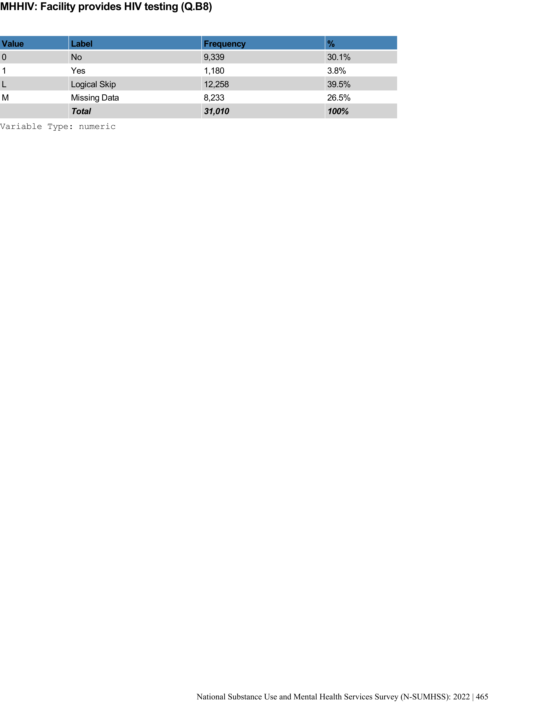

National Substance Use and Mental Health Services Survey (N-SUMHSS): 2022 | 465

provides sexually transmitted disease (STD) testing (Q.B8)

| Value | Label        | Frequency | %     |
|-------|--------------|-----------|-------|
| 0     | No           | 9,429     | 30.4% |
| 1     | Yes          | 1,084     | 3.5%  |
| L     | Logical Skip | 12,258    | 39.5% |
| M     | Missing Data | 8,239     | 26.6% |
|       | **Total**    | **31,010**| **100%**|

Variable Type: numeric

National Substance Use and Mental Health Services Survey (N-SUMHSS): 2022 | 466

## Provides tuberculosis (TB) screening (Q.B8)

| Value | Label         | Frequency | %      |
|-------|---------------|-----------|--------|
| 0     | No            | 9,040     | 29.2%  |
| 1     | Yes           | 1,475     | 4.8%   |
| L     | Logical Skip  | 12,258    | 39.5%  |
| M     | Missing Data  | 8,237     | 26.6%  |
|       | **Total**     | **31,010**| **100%**|

Variable Type: numeric
    
National Substance Use and Mental Health Services Survey (N-SUMHSS): 2022 | 467

## SE: Facility provides screening for tobacco use (Q.B8)

| Value | Label        | Frequency | %     |
|-------|--------------|-----------|-------|
| 0     | No           | 3,558     | 11.5% |
| 1     | Yes          | 6,969     | 22.5% |
| L     | Logical Skip | 12,258    | 39.5% |
| M     | Missing Data | 8,225     | 26.5% |
|**Total**|**31,010** |**100%**|

Variable Type: numeric

National Substance Use and Mental Health Services Survey (N-SUMHSS): 2022 | 468

ESS: Facility provides smoking/vaping/tobacco cessation counseling (Q.B8)

| Value | Label         | Frequency |     %     |
|-------|---------------|-----------|-----------|
| 0     | No            | 5,253     | 16.9%     |
| 1     | Yes           | 5,266     | 17.0%     |
| L     | Logical Skip  | 12,258    | 39.5%     |
| M     | Missing Data  | 8,233     | 26.5%     |
| Total |               | 31,010    | **100%**  |

Variable Type: numeric

National Substance Use and Mental Health Services Survey (N-SUMHSS): 2022 | 469

### P: Facility provides nicotine replacement therapy (Q.B8)

| Value | Label        | Frequency | %      |
|-------|--------------|-----------|--------|
| 0     | No           | 6,978     | 22.5%  |
| 1     | Yes          | 3,541     | 11.4%  |
| L     | Logical Skip | 12,258    | 39.5%  |
| M     | Missing Data | 8,233     | 26.5%  |
|       | **Total**    | **31,010**|**100%**|

Variable Type: numeric

National Substance Use and Mental Health Services Survey (N-SUMHSS): 2022 | 470

## Q.B8: Facility provides non-nicotine smoking/tobacco cessation medications

| Value | Label        | Frequency | %    |
|-------|--------------|-----------|------|
| 0     | No           | 7,182     | 23.2 |
| 1     | Yes          | 3,334     | 10.8 |
| L     | Logical Skip | 12,258    | 39.5 |
| M     | Missing Data | 8,236     | 26.6 |
|       | **Total**    | **31,010** | **100%** |

Variable Type: numeric

National Substance Use and Mental Health Services Survey (N-SUMHSS): 2022 | 471

## provides other services (Q.B8)

| Value | Label         | Frequency | %     |
|-------|---------------|-----------|-------|
| 0     | No            | 10,084    | 32.5% |
| 1     | Yes           | 419       | 1.4%  |
| L     | Logical Skip  | 12,258    | 39.5% |
| M     | Missing Data  | 8,249     | 26.6% |
|       | **Total**     | **31,010**| **100%** |

Variable Type: numeric

National Substance Use and Mental Health Services Survey (N-SUMHSS): 2022 | 472

| Value | Label        | Frequency | %       |
|-------|--------------|-----------|---------|
| 0     | No           | 10,295    | 33.2%   |
| 1     | Yes          | 210       | 0.7%    |
| L     | Logical Skip | 12,258    | 39.5%   |
| M     | Missing Data | 8,247     | 26.6%   |
| **Total** |              | **31,010**  | **100%** |

Variable Type: numeric

### Service provided detoxification (medical withdrawal) for co-occurring clients (Q.B9)

| Value | Label         | Frequency | %       |
|-------|---------------|-----------|---------|
| 0     | No            | 8,836     | 28.5%   |
| 1     | Yes           | 860       | 2.8%    |
| L     | Logical Skip  | 12,258    | 39.5%   |
| M     | Missing Data  | 9,056     | 29.2%   |
|       | **Total**     | **31,010**| **100%**|

Variable Type: numeric

---

National Substance Use and Mental Health Services Survey (N-SUMHSS): 2022 | 474

### Service provided medication-assisted treatment (MAT) for Alcohol Use Disorder (AUD) for co-occurring clients (Q.B9)

| Value | Label        | Frequency | %     |
|-------|--------------|-----------|-------|
| 0     | No           | 7,056     | 22.8% |
| 1     | Yes          | 2,649     | 8.5%  |
| L     | Logical Skip | 12,258    | 39.5% |
| M     | Missing Data | 9,047     | 29.2% |
|       | Total        | 31,010    | 100%  |

Variable Type: numeric

---
National Substance Use and Mental Health Services Survey (N-SUMHSS): 2022 | 475

### Service provided medication-assisted treatment (MAT) for Opioid Use Disorder (OUD) for co-occurring clients (Q.B9)

| Value | Label       | Frequency | %     |
|-------|-------------|-----------|-------|
| 0     | No          | 6,726     | 21.7% |
| 1     | Yes         | 2,979     | 9.6%  |
| L     | Logical Skip| 12,258    | 39.5% |
| M     | Missing Data| 9,047     | 29.2% |
|       | **Total**   | **31,010**| **100%** |

Variable Type: numeric

National Substance Use and Mental Health Services Survey (N-SUMHSS): 2022 | 476

.: Service provided individual counseling for co-occurring clients (Q.B9)

| Value | Label         | Frequency | %     |
|-------|---------------|-----------|-------|
| 0     | No            | 2,227     | 7.2%  |
| 1     | Yes           | 7,510     | 24.2% |
| L     | Logical Skip  | 12,258    | 39.5% |
| M     | Missing Data  | 9,015     | 29.1% |
|       | **Total**     | **31,010**| **100%**|

Variable Type: numeric

*National Substance Use and Mental Health Services Survey (N-SUMHSS): 2022* | 477

L: Service provided group counseling for co-occurring clients (Q.B9)

| Value | Label        | Frequency | %     |
|-------|--------------|-----------|-------|
| 0     | No           | 3,740     | 12.1% |
| 1     | Yes          | 5,981     | 19.3% |
| L     | Logical Skip | 12,258    | 39.5% |
| M     | Missing Data | 9,031     | 29.1% |
| **Total** | **31,010** | **100%** |
Variable Type: numeric

National Substance Use and Mental Health Services Survey (N-SUMHSS): 2022 | 478

## Service provided 12-step groups for co-occurring clients (Q.B9)

| Value | Label        | Frequency |    %   |
|-------|--------------|-----------|--------|
| 0     | No           | 8,650     | 27.9%  |
| 1     | Yes          | 1,044     | 3.4%   |
| L     | Logical Skip | 12,258    | 39.5%  |
| M     | Missing Data | 9,058     | 29.2%  |
|       | **Total**    | **31,010**| **100%**|

Variable Type: numeric

National Substance Use and Mental Health Services Survey (N-SUMHSS): 2022 | 479

### iMT: Service provided co-occurring case management (Q.B9)
| Value | Label        | Frequency | %      |
|-------|--------------|-----------|--------|
| 0     | No           | 4,307     | 13.9%  |
| 1     | Yes          | 5,413     | 17.5%  |
| L     | Logical Skip | 12,258    | 39.5%  |
| M     | Missing Data | 9,032     | 29.1%  |
|       | **Total**          | **31,010**    | **100%**  |

Variable Type: numeric

### vice provided, other for co-occurring clients (Q.B9)

| Value | Label         | Frequency | %     |
|-------|---------------|-----------|-------|
| 0     | No            | 9,310     | 30.0% |
| 1     | Yes           | 379       | 1.2%  |
| L     | Logical Skip  | 12,258    | 39.5% |
| M     | Missing Data  | 9,063     | 29.2% |

**Total**: 31,010 (100%)

Variable Type: numeric

*National Substance Use and Mental Health Services Survey (N-SUMHSS): 2022 | 481*

# S: Facility provides none of these co-occurring services (Q.B9)

| Value | Label        | Frequency | %     |
|-------|--------------|-----------|-------|
| 0     | No           | 8,310     | 26.8% |
| 1     | Yes          | 1,376     | 4.4%  |
| L     | Logical Skip | 12,258    | 39.5% |
| M     | Missing Data | 9,066     | 29.2% |

**Total** | **31,010** | **100%**

Variable Type: numeric

---

National Substance Use and Mental Health Services Survey (N-SUMHSS): 2022 | 482

## Dept for treatment of young children (0-5) (Q.B10)

| Value | Label        | Frequency | %    |
|-------|--------------|-----------|------|
| 0     | No           | 6,669     | 21.5%|
| 1     | Yes          | 3,773     | 12.2%|
| L     | Logical Skip | 12,258    | 39.5%|
| M     | Missing Data | 8,310     | 26.8%|

**Total**: 31,010  **100%**

**Variable Type:** numeric

---

National Substance Use and Mental Health Services Survey (N-SUMHSS): 2022 | 483

## Except for treatment of children (6-12) (Q.B10)

| Value | Label         | Frequency | %     |
|-------|---------------|-----------|-------|
| 0     | No            | 4,575     | 14.8% |
| 1     | Yes           | 5,867     | 18.9% |
| L     | Logical Skip  | 12,258    | 39.5% |
| M     | Missing Data  | 8,310     | 26.8% |
|       | **Total**     | **31,010**| **100%**|

Variable Type: numeric

## pt for treatment of adolescents (13-17) (Q.B10)

| Value | Label         | Frequency | %      |
|-------|---------------|-----------|--------|
| 0     | No            | 3,636     | 11.7%  |
| 1     | Yes           | 6,953     | 22.4%  |
| L     | Logical Skip  | 12,258    | 39.5%  |
| M     | Missing Data  | 8,163     | 26.3%  |
|       | **Total**     | **31,010**| **100%**|

Variable Type: numeric

National Substance Use and Mental Health Services Survey (N-SUMHSS): 2022 | 485

# Accept for treatment of young adults (18-25) (Q.B10)

| Value | Label        | Frequency | %     |
|-------|--------------|-----------|-------|
| 0     | No           | 1,093     | 3.5%  |
| 1     | Yes          | 9,496     | 30.6% |
| L     | Logical Skip | 12,258    | 39.5% |
| M     | Missing Data | 8,163     | 26.3% |
|       | **Total**    | **31,010**| **100%** |

Variable Type: numeric

National Substance Use and Mental Health Services Survey (N-SUMHSS): 2022 | 486

for treatment of adults (26-64) (Q.B10)

| Value | Label        | Frequency |   %   |
|-------|--------------|-----------|-------|
| 0     | No           | 1,618     |  5.2% |
| 1     | Yes          | 8,971     | 28.9% |
| L     | Logical Skip | 12,258    | 39.5% |
| M     | Missing Data | 8,163     | 26.3% |
|       | **Total**    | **31,010** | **100%** |

Variable Type: numeric

National Substance Use and Mental Health Services Survey (N-SUMHSS): 2022 | 487

### Q.B10: Accept for treatment of older adults (65 or older)

| Value | Label        | Frequency |     %    |
|-------|--------------|-----------|----------|
| 0     | No           |   2,027   |   6.5%   |
| 1     | Yes          |   8,562   |  27.6%   |
| L     | Logical Skip |  12,258   |  39.5%   |
| M     | Missing Data |   8,163   |  26.3%   |
|       | **Total**    | **31,010**| **100%** |

Variable Type: numeric

National Substance Use and Mental Health Services Survey (N-SUMHSS): 2022 | 488

## designed program/group for children with Serious Emotional Disturbance (SED) (Q.B11)

| Value | Label        | Frequency | %     |
|-------|--------------|-----------|-------|
| 0     | No           | 6,540     | 21.1% |
| 1     | Yes          | 3,935     | 12.7% |
| L     | Logical Skip | 12,258    | 39.5% |
| M     | Missing Data | 8,277     | 26.7% |
|       | **Total**    | **31,010**| **100%**|

Variable Type: numeric

National Substance Use and Mental Health Services Survey (N-SUMHSS): 2022 | 489

# LTS: Specially designed program/group for young adults (Q.B11)

| Value | Label        | Frequency | %     |
|-------|--------------|-----------|-------|
| 0     | No           | 6,983     | 22.5% |
| 1     | Yes          | 3,494     | 11.3% |
| L     | Logical Skip | 12,258    | 39.5% |
| M     | Missing Data | 8,275     | 26.7% |
|       | **Total**    | **31,010**| **100%** |

Variable Type: numeric

---
National Substance Use and Mental Health Services Survey (N-SUMHSS): 2022

###### designed program/group for serious mental illness (SMI) (Q.B11)

| Value | Label       | Frequency | %      |
|-------|-------------|-----------|--------|
| 0     | No          | 5,179     | 16.7%  |
| 1     | Yes         | 5,305     | 17.1%  |
| L     | Logical Skip| 12,258    | 39.5%  |
| M     | Missing Data| 8,268     | 26.7%  |
| **Total** |             | **31,010**  | **100%** |

Variable Type: numeric

pecially designed program/group for older adults (Q.B11)

| Value | Label        | Frequency | %     |
|-------|--------------|-----------|-------|
| 0     | No           | 7,102     | 22.9% |
| 1     | Yes          | 3,374     | 10.9% |
| L     | Logical Skip | 12,258    | 39.5% |
| M     | Missing Data | 8,276     | 26.7% |
|       | **Total**    | **31,010**|**100%**|

Variable Type: numeric

National Substance Use and Mental Health Services Survey (N-SUMHSS): 2022 | 492

# A: Specially designed program/group for Alzheimer or dementia (Q.B11)

| Value | Label       | Frequency | %    |
|-------|-------------|-----------|------|
| 0     | No          | 9,672     | 31.2 |
| 1     | Yes         | 794       | 2.6  |
| L     | Logical Skip| 12,258    | 39.5 |
| M     | Missing Data| 8,286     | 26.7 |

|       | **Total**   | **31,010**| **100%** |

Variable Type: numeric

National Substance Use and Mental Health Services Survey (N-SUMHSS): 2022 | 493

## pecially designed program/group for co-occurring clients (Q.B11)

| Value | Label         | Frequency | %     |
|-------|---------------|-----------|-------|
| 0     | No            | 4,833     | 15.6% |
| 1     | Yes           | 5,652     | 18.2% |
| L     | Logical Skip  | 12,258    | 39.5% |
| M     | Missing Data  | 8,267     | 26.7% |
|       | **Total**     | **31,010**| **100%**|

Variable Type: numeric

National Substance Use and Mental Health Services Survey (N-SUMHSS): 2022 | 494

# NG: Specially designed program/group for eating disorders (Q.B11)

| Value | Label        | Frequency | %     |
|-------|--------------|-----------|-------|
| 0     | No           | 8,969     | 28.9% |
| 1     | Yes          | 1,499     | 4.8%  |
| L     | Logical Skip | 12,258    | 39.5% |
| M     | Missing Data | 8,284     | 26.7% |
| **Total** |              | **31,010** | **100%** |

Variable Type: numeric

National Substance Use and Mental Health Services Survey (N-SUMHSS): 2022 | 495

# Specially designed program/group for first-episode psychosis (Q.B11)

| Value | Label        | Frequency | %     |
|-------|--------------|-----------|-------|
| 0     | No           | 9,128     | 29.4% |
| 1     | Yes          | 1,347     | 4.3%  |
| L     | Logical Skip | 12,258    | 39.5% |
| M     | Missing Data | 8,277     | 26.7% |

|       | Total        | 31,010    | 100%  |

Variable Type: numeric

*National Substance Use and Mental Health Services Survey (N-SUMHSS): 2022 | 496*

### Specially designed program/group for domestic violence (Q.B11)

| Value | Label         | Frequency | %     |
|-------|---------------|-----------|-------|
| 0     | No            | 9,115     | 29.4% |
| 1     | Yes           | 1,356     | 4.4%  |
| L     | Logical Skip  | 12,258    | 39.5% |
| M     | Missing Data  | 8,281     | 26.7% |
|       | **Total**     | **31,010**| **100%**|

Variable Type: numeric

National Substance Use and Mental Health Services Survey (N-SUMHSS): 2022 | 497

### Specially designed program/group for post-traumatic stress disorder (PTSD) (Q.B11)

| Value | Label        | Frequency | %     |
|-------|--------------|-----------|-------|
| 0     | No           | 5,534     | 17.8% |
| 1     | Yes          | 4,954     | 16.0% |
| L     | Logical Skip | 12,258    | 39.5% |
| M     | Missing Data | 8,264     | 26.6% |
|       | **Total**    | **31,010** | **100%** |

Variable Type: numeric

### Specially designed program/group for who has experienced trauma (Q.B11)

| Value | Label        | Frequency | %      |
|-------|--------------|-----------|--------|
| 0     | No           | 5,252     | 16.9%  |
| 1     | Yes          | 5,237     | 16.9%  |
| L     | Logical Skip | 12,258    | 39.5%  |
| M     | Missing Data | 8,263     | 26.6%  |
| **Total**  |              | **31,010**    | **100%**  |

Variable Type: numeric

National Substance Use and Mental Health Services Survey (N-SUMHSS): 2022 | 499

# AIN: Specially designed program/group for traumatic brain injury (Q.B11)

| Value | Label         | Frequency | %      |
|-------|---------------|-----------|--------|
| 0     | No            | 9,326     | 30.1%  |
| 1     | Yes           | 1,139     | 3.7%   |
| L     | Logical Skip  | 12,258    | 39.5%  |
| M     | Missing Data  | 8,287     | 26.7%  |
|       | **Total**     | **31,010**| **100%**|

Variable Type: numeric

National Substance Use and Mental Health Services Survey (N-SUMHSS): 2022 | 500

# Specially designed program/group for Veterans (Q.B11)

| Value | Label        | Frequency | %      |
|-------|--------------|-----------|--------|
| 0     | No           | 8,103     | 26.1%  |
| 1     | Yes          | 2,366     | 7.6%   |
| L     | Logical Skip | 12,258    | 39.5%  |
| M     | Missing Data | 8,283     | 26.7%  |
|       | **Total**    | **31,010**| **100%**|

Variable Type: numeric

National Substance Use and Mental Health Services Survey (N-SUMHSS): 2022 | 501

## Specially designed program/group for active duty military (Q.B11)

| Value | Label       | Frequency | %      |
|-------|-------------|-----------|--------|
| 0     | No          | 9,207     | 29.7%  |
| 1     | Yes         | 1,257     | 4.1%   |
| L     | Logical Skip| 12,258    | 39.5%  |
| M     | Missing Data| 8,288     | 26.7%  |
|       | **Total**   | **31,010**| **100%** |

Variable Type: numeric

National Substance Use and Mental Health Services Survey (N-SUMHSS): 2022 | 502

## Specially designed program/group for members of military families (Q.B11)

| Value | Label        | Frequency | %      |
|-------|--------------|-----------|--------|
| 0     | No           | 8,753     | 28.2%  |
| 1     | Yes          | 1,711     | 5.5%   |
| L     | Logical Skip | 12,258    | 39.5%  |
| M     | Missing Data | 8,288     | 26.7%  |
|       | **Total**    | **31,010**| **100%**|

**Variable Type:** numeric

---

National Substance Use and Mental Health Services Survey (N-SUMHSS): 2022 | 503

### pecially designed program/group for lesbian, gay, bisexual, transgender, or queer/questioning (LGBTQ) clients (Q.B11)

| Value | Label         | Frequency | %      |
|-------|---------------|-----------|--------|
| 0     | No            | 6,998     | 22.6%  |
| 1     | Yes           | 3,485     | 11.2%  |
| L     | Logical Skip  | 12,258    | 39.5%  |
| M     | Missing Data  | 8,269     | 26.7%  |
|       | **Total**     | **31,010** | **100%** |

Variable Type: numeric

National Substance Use and Mental Health Services Survey (N-SUMHSS): 2022 | 504

# pecially designed program/group for forensic clients (Q.B11)

| Value | Label        | Frequency | %     |
|-------|--------------|-----------|-------|
| 0     | No           | 7,941     | 25.6% |
| 1     | Yes          | 2,528     | 8.2%  |
| L     | Logical Skip | 12,258    | 39.5% |
| M     | Missing Data | 8,283     | 26.7% |
| **Total** |              | **31,010**   | **100%** |

Variable Type: numeric

---

National Substance Use and Mental Health Services Survey (N-SUMHSS): 2022 | 505

pecially designed program/group for HIV/AIDS (Q.B11)

| Value | Label         | Frequency | %     |
|-------|---------------|-----------|-------|
| 0     | No            | 8,899     | 28.7% |
| 1     | Yes           | 1,570     | 5.1%  |
| L     | Logical Skip  | 12,258    | 39.5% |
| M     | Missing Data  | 8,283     | 26.7% |
| **Total** |           | **31,010** | **100%** |

Variable Type: numeric

peciallly designed program/group for other groups (Q.B11)

| Value | Label        | Frequency | %     |
|-------|--------------|-----------|-------|
| 0     | No           | 9,532     | 30.7% |
| 1     | Yes          | 930       | 3.0%  |
| L     | Logical Skip | 12,258    | 39.5% |
| M     | Missing Data | 8,290     | 26.7% |
| **Total** | **31,010** | **100%** |

Variable Type: numeric

*National Substance Use and Mental Health Services Survey (N-SUMHSS): 2022 | 507*

_H: No dedicated, exclusively designed programs or groups are offered (Q.B11)

| Value | Label        | Frequency |    %   |
|-------|--------------|-----------|--------|
| 0     | No           | 8,970     | 28.9%  |
| 1     | Yes          | 1,560     | 5.0%   |
| L     | Logical Skip | 12,258    | 39.5%  |
| M     | Missing Data | 8,222     | 26.5%  |
| **Total** |              | **31,010**   | **100%** |

Variable Type: numeric

# Crisis intervention treatment team offered by facility (Q.B12)

| Value | Label       | Frequency |     %   |
|-------|-------------|-----------|---------|
| 0     | No          |    5,865  |  18.9%  |
| 1     | Yes         |    4,702  |  15.2%  |
| L     | Logical Skip|   12,258  |  39.5%  |
| M     | Missing Data|    8,185  |  26.4%  |
|       | Total       |  **31,010** | **100%** |

Variable Type: numeric

National Substance Use and Mental Health Services Survey (N-SUMHSS): 2022 | 509

vices for psychiatric emergencies onsite (Q.B13)

| Value | Label        | Frequency | %      |
|-------|--------------|-----------|--------|
| 0     | No           | 6,671     | 21.5%  |
| 1     | Yes          | 3,308     | 10.7%  |
| L     | Logical Skip | 12,258    | 39.5%  |
| M     | Missing Data | 8,773     | 28.3%  |
| **Total**|            | **31,010**| **100%**|

Variable Type: numeric

National Substance Use and Mental Health Services Survey (N-SUMHSS): 2022 | 510

#### Mobile/off-site psychiatric crisis services (Q.B14)

| Value | Label       | Frequency | %      |
|-------|-------------|-----------|--------|
| 0     | No          | 7,953     | 25.6%  |
| 1     | Yes         | 2,185     | 7.0%   |
| L     | Logical Skip| 12,258    | 39.5%  |
| M     | Missing Data| 8,614     | 27.8%  |

|       | **Total**   | **31,010**| **100%** |

Variable Type: numeric

---

National Substance Use and Mental Health Services Survey (N-SUMHSS): 2022 | 511

# Mental health treatment in sign language (Q.B15)

| Value | Label         | Frequency | %      |
|-------|---------------|-----------|--------|
| 0     | No            | 4,334     | 14.0%  |
| 1     | Yes           | 6,242     | 20.1%  |
| L     | Logical Skip  | 12,258    | 39.5%  |
| M     | Missing Data  | 8,176     | 26.4%  |
|       | **Total**     | **31,010**| **100%**|

Variable Type: numeric

National Substance Use and Mental Health Services Survey (N-SUMHSS): 2022 | 512

## Mental health treatment in language other than English (Q.B16)

| Value | Label        | Frequency | %    |
|-------|--------------|-----------|------|
| 0     | No           | 3,074     | 9.9% |
| 1     | Yes          | 7,503     | 24.2%|
| L     | Logical Skip | 12,258    | 39.5%|
| M     | Missing Data | 8,175     | 26.4%|
|       | **Total**    | **31,010**|**100%**|

Variable Type: numeric

*National Substance Use and Mental Health Services Survey (N-SUMHSS): 2022 | 513*

# Mental health treatment language provided by staff/interpreter/both (Q.B16a)

| Value | Label                                                    | Frequency | %       |
|-------|----------------------------------------------------------|-----------|---------|
| 1     | Staff counselor who speaks a language other than English | 648       | 2.1%    |
| 2     | On-call interpreter brought in when needed               | 4,239     | 13.7%   |
| 3     | Both staff counselor and on-call interpreter             | 2,602     | 8.4%    |
| L     | Logical Skip                                             | 15,362    | 49.5%   |
| M     | Missing Data                                             | 8,159     | 26.3%   |
|       | Total                                                    | 31,010    | 100%    |

Variable Type: numeric

---

National Substance Use and Mental Health Services Survey (N-SUMHSS): 2022 | 514

# o staff provide mental health treatment in Spanish (Q.B16a1)

| Value  | Label         | Frequency | %      |
|--------|---------------|-----------|--------|
| 0      | No            | 297       | 1.0%   |
| 1      | Yes           | 2,945     | 9.5%   |
| L      | Logical Skip  | 19,614    | 63.3%  |
| M      | Missing Data  | 8,154     | 26.3%  |
|        | Total         | 31,010    | 100%   |

Variable Type: numeric

National Substance Use and Mental Health Services Survey (N-SUMHSS): 2022 | 515

### Do staff provide mental health treatment in any other language (Q.B16a2)

| Value | Label        | Frequency | %      |
|-------|--------------|-----------|--------|
| 0     | No           | 1,871     | 6.0%   |
| 1     | Yes          | 1,054     | 3.4%   |
| L     | Logical Skip | 19,614    | 63.3%  |
| M     | Missing Data | 8,471     | 27.3%  |
| **Total** | **31,010** | **100%** |        |

Variable Type: numeric

## Mental health treatment in Hopi (Q.B16b)

| Value | Label         | Frequency | %     |
|-------|---------------|-----------|-------|
| 0     | No            | 894       | 2.9%  |
| 1     | Yes           | 18        | 0.1%  |
| L     | Logical Skip  | 21,810    | 70.3% |
| M     | Missing Data  | 8,288     | 26.7% |
|       | **Total**     | **31,010**| **100%**|

Variable Type: numeric

National Substance Use and Mental Health Services Survey (N-SUMHSS): 2022 | 517

## Mental health treatment in Lakota (Q.B16b)

| Value | Label         | Frequency | %     |
|-------|---------------|-----------|-------|
| 0     | No            | 896       | 2.9%  |
| 1     | Yes           | 16        | 0.1%  |
| L     | Logical Skip  | 21,810    | 70.3% |
| M     | Missing Data  | 8,288     | 26.7% |
|       | **Total**     | **31,010**| **100%** |

Variable Type: numeric

National Substance Use and Mental Health Services Survey (N-SUMHSS): 2022 | 518

## Mental health treatment in Navajo (Q.B16b)

| Value | Label        | Frequency | %     |
|-------|--------------|-----------|-------|
| 0     | No           | 887       | 2.9%  |
| 1     | Yes          | 25        | 0.1%  |
| L     | Logical Skip | 21,810    | 70.3% |
| M     | Missing Data | 8,288     | 26.7% |
|       | **Total**    | **31,010**| **100%** |

Variable Type: numeric

National Substance Use and Mental Health Services Survey (N-SUMHSS): 2022 | 519

## Iental health treatment in Ojibwa (Q.B16b)

| Value | Label        | Frequency | %      |
|-------|--------------|-----------|--------|
| 0     | No           | 897       | 2.9%   |
| 1     | Yes          | 15        | 0.0%   |
| L     | Logical Skip | 21,810    | 70.3%  |
| M     | Missing Data | 8,288     | 26.7%  |
| **Total** | | **31,010**   | **100%** |

Variable Type: numeric

---

National Substance Use and Mental Health Services Survey (N-SUMHSS): 2022 | 520

## Mental health treatment in Yupik (Q.B16b)

| Value | Label        | Frequency | %      |
|-------|--------------|-----------|--------|
| 0     | No           | 899       | 2.9%   |
| 1     | Yes          | 13        | 0.0%   |
| L     | Logical Skip | 21,810    | 70.3%  |
| M     | Missing Data | 8,288     | 26.7%  |
|       | Total        | 31,010    | 100%   |

Variable Type: numeric

National Substance Use and Mental Health Services Survey (N-SUMHSS): 2022 | 521

## Mental health treatment in other American Indian/Alaska Native (Q.B16b)

| Value | Label        | Frequency | %     |
|-------|--------------|-----------|-------|
| 0     | No           | 892       | 2.9%  |
| 1     | Yes          | 16        | 0.1%  |
| L     | Logical Skip | 21,810    | 70.3% |
| M     | Missing Data | 8,292     | 26.7% |

|       | Total        | 31,010    | 100%  |

Variable Type: numeric

National Substance Use and Mental Health Services Survey (N-SUMHSS): 2022

页 522

## Mental health treatment in Arabic (Q.B16b)

| Value | Label        | Frequency | %      |
|-------|--------------|-----------|--------|
| 0     | No           | 788       | 2.5%   |
| 1     | Yes          | 124       | 0.4%   |
| L     | Logical Skip | 21,810    | 70.3%  |
| M     | Missing Data | 8,288     | 26.7%  |
|       | **Total**    | **31,010**| **100%**|

Variable Type: numeric

## 任何中文语言的精神健康治疗 (Q.B16b)

| Value | Label        | Frequency | %     |
|-------|--------------|-----------|-------|
| 0     | No           | 722       | 2.3%  |
| 1     | Yes          | 190       | 0.6%  |
| L     | Logical Skip | 21,810    | 70.3% |
| M     | Missing Data | 8,288     | 26.7% |

**Total: 31,010 100%**

Variable Type: numeric

National Substance Use and Mental Health Services Survey (N-SUMHSS): 2022 | 524

## Mental health treatment in Creole (Q.B16b)

| Value | Label        | Frequency | %     |
|-------|--------------|-----------|-------|
| 0     | No           | 737       | 2.4%  |
| 1     | Yes          | 175       | 0.6%  |
| L     | Logical Skip | 21,810    | 70.3% |
| M     | Missing Data | 8,288     | 26.7% |
|       | **Total**    | **31,010**| **100%**|

Variable Type: numeric

*National Substance Use and Mental Health Services Survey (N-SUMHSS): 2022 | 525*

### Mental health treatment in Farsi (Q.B16b)

| Value | Label         | Frequency | %       |
|-------|---------------|-----------|---------|
| 0     | No            | 777       | 2.5%    |
| 1     | Yes           | 135       | 0.4%    |
| L     | Logical Skip  | 21,810    | 70.3%   |
| M     | Missing Data  | 8,288     | 26.7%   |
| **Total** |           | **31,010** | **100%** |

Variable Type: numeric

*National Substance Use and Mental Health Services Survey (N-SUMHSS): 2022 | 526*

## Mental health treatment in French (Q.B16b)

| Value | Label        | Frequency | %       |
|-------|--------------|-----------|---------|
| 0     | No           | 739       | 2.4%    |
| 1     | Yes          | 173       | 0.6%    |
| L     | Logical Skip | 21,810    | 70.3%   |
| M     | Missing Data | 8,288     | 26.7%   |
| **Total** | **31,010** | **100%** |

Variable Type: numeric

National Substance Use and Mental Health Services Survey (N-SUMHSS): 2022

# Mental health treatment in German (Q.B16b)

| Value | Label        | Frequency | %     |
|-------|--------------|-----------|-------|
| 0     | No           | 845       | 2.7%  |
| 1     | Yes          | 67        | 0.2%  |
| L     | Logical Skip | 21,810    | 70.3% |
| M     | Missing Data | 8,288     | 26.7% |

| **Total** | **31,010** | **100%** |

Variable Type: numeric

National Substance Use and Mental Health Services Survey (N-SUMHSS): 2022 | 528

## Mental health treatment in Greek (Q.B16b)

\[
\begin{array}{|c|c|c|c|}
\hline
\text{Value} & \text{Label} & \text{Frequency} & \% \\
\hline
0 & \text{No} & 861 & 2.8\% \\
\hline
1 & \text{Yes} & 51 & 0.2\% \\
\hline
L & \text{Logical Skip} & 21,810 & 70.3\% \\
\hline
M & \text{Missing Data} & 8,288 & 26.7\% \\
\hline
\text{Total} &  & 31,010 & 100\% \\
\hline
\end{array}
\]

Variable Type: numeric

National Substance Use and Mental Health Services Survey (N-SUMHSS): 2022 | 529

lental health treatment in Hebrew (Q.B16b)

| Value | Label        | Frequency | %     |
|-------|--------------|-----------|-------|
| 0     | No           | 832       | 2.7%  |
| 1     | Yes          | 80        | 0.3%  |
| L     | Logical Skip | 21,810    | 70.3% |
| M     | Missing Data | 8,288     | 26.7% |
|       | **Total**    | **31,010**|**100%**|

Variable Type: numeric

National Substance Use and Mental Health Services Survey (N-SUMHSS): 2022 | 530

## Mental health treatment in Hindi (Q.B16b)

| Value | Label        | Frequency | %      |
|-------|--------------|-----------|--------|
| 0     | No           | 749       | 2.4%   |
| 1     | Yes          | 163       | 0.5%   |
| L     | Logical Skip | 21,810    | 70.3%  |
| M     | Missing Data | 8,288     | 26.7%  |
|       | **Total**    | **31,010**| **100%**|

Variable Type: numeric

---

National Substance Use and Mental Health Services Survey (N-SUMHSS): 2022 | 531

## Mental health treatment in Hmong (Q.B16b)

| Value | Label        | Frequency | %     |
|-------|--------------|-----------|-------|
| 0     | No           | 834       | 2.7%  |
| 1     | Yes          | 78        | 0.3%  |
| L     | Logical Skip | 21,810    | 70.3% |
| M     | Missing Data | 8,288     | 26.7% |

|       | **Total**    | **31,010**| **100%**|

Variable Type: numeric

---

National Substance Use and Mental Health Services Survey (N-SUMHSS): 2022 | 532

# Mental health treatment in Italian (Q.B16b)

| Value | Label        | Frequency | %     |
| ----- | ------------ | --------- | ----- |
| 0     | No           | 837       | 2.7%  |
| 1     | Yes          | 75        | 0.2%  |
| L     | Logical Skip | 21,810    | 70.3% |
| M     | Missing Data | 8,288     | 26.7% |

**Total** | **31,010** | **100%**

Variable Type: numeric

National Substance Use and Mental Health Services Survey (N-SUMHSS): 2022 | 533

## Mental health treatment in Japanese (Q.B16b)

| Value | Label        | Frequency | %     |
|-------|--------------|-----------|-------|
| 0     | No           | 848       |  2.7% |
| 1     | Yes          | 64        |  0.2% |
| L     | Logical Skip | 21,810    | 70.3% |
| M     | Missing Data | 8,288     | 26.7% |
| **Total** | **31,010** | **100%** |

Variable Type: numeric

National Substance Use and Mental Health Services Survey (N-SUMHSS): 2022 | 534

## Iental health treatment in Korean (Q.B16b)

| Value | Label        | Frequency | %     |
|-------|--------------|-----------|-------|
| 0     | No           | 814       | 2.6%  |
| 1     | Yes          | 98        | 0.3%  |
| L     | Logical Skip | 21,810    | 70.3% |
| M     | Missing Data | 8,288     | 26.7% |
| **Total** |           | **31,010** | **100%** |

Variable Type: numeric

National Substance Use and Mental Health Services Survey (N-SUMHSS): 2022 | 535

## Mental health treatment in Polish (Q.B16b)

| Value | Label        | Frequency | %      |
|-------|--------------|-----------|--------|
| 0     | No           | 844       | 2.7%   |
| 1     | Yes          | 68        | 0.2%   |
| L     | Logical Skip | 21,810    | 70.3%  |
| M     | Missing Data | 8,288     | 26.7%  |
| **Total** |              | **31,010**   | **100%** |

Variable Type: numeric

National Substance Use and Mental Health Services Survey (N-SUMHSS): 2022 | 536

## Mental health treatment in Portuguese (Q.B16b)

| Value | Label        | Frequency | %     |
|-------|--------------|-----------|-------|
| 0     | No           | 755       | 2.4%  |
| 1     | Yes          | 157       | 0.5%  |
| L     | Logical Skip | 21,810    | 70.3% |
| M     | Missing Data | 8,288     | 26.7% |

|       | Total        | 31,010    | 100%  |

Variable Type: numeric

---

National Substance Use and Mental Health Services Survey (N-SUMHSS): 2022 | 157

# lental health treatment in Russian (Q.B16b)

| Value | Label        | Frequency |  %    |
|-------|--------------|-----------|-------|
| 0     | No           | 756       | 2.4%  |
| 1     | Yes          | 156       | 0.5%  |
| L     | Logical Skip | 21,810    | 70.3% |
| M     | Missing Data | 8,288     | 26.7% |

|       | **Total**    | **31,010**| **100%**|

Variable Type: numeric

## lental health treatment in Tagalog (Q.B16b)

| Value | Label        | Frequency | %     |
|-------|--------------|-----------|-------|
| 0     | No           | 767       | 2.5%  |
| 1     | Yes          | 145       | 0.5%  |
| L     | Logical Skip | 21,810    | 70.3% |
| M     | Missing Data | 8,288     | 26.7% |
| **Total** |              | **31,010**  | **100%** |

Variable Type: numeric

---

National Substance Use and Mental Health Services Survey (N-SUMHSS): 2022 | 539

# lental health treatment in Vietnamese (Q.B16b)

| Value | Label        | Frequency | %       |
|-------|--------------|-----------|---------|
| 0     | No           | 794       | 2.6%    |
| 1     | Yes          | 118       | 0.4%    |
| L     | Logical Skip | 21,810    | 70.3%   |
| M     | Missing Data | 8,288     | 26.7%   |
|       | **Total**    | **31,010**| **100%**|

Variable Type: numeric

---

National Substance Use and Mental Health Services Survey (N-SUMHSS): 2022 | 540

## lental health treatment in other language (Q.B16b)

| Value | Label         | Frequency | %      |
|-------|---------------|-----------|--------|
| 0     | No            | 590       | 1.9%   |
| 1     | Yes           | 316       | 1.0%   |
| L     | Logical Skip  | 21,810    | 70.3%  |
| M     | Missing Data  | 8,294     | 26.7%  |
|       | **Total**     | **31,010**| **100%**|

Variable Type: numeric

National Substance Use and Mental Health Services Survey (N-SUMHSS): 2022 | 541

### Continuing education requirements for staff (Q.B17)

| Value | Label        | Frequency | %    |
|-------|--------------|-----------|------|
| 0     | No           | 226       | 0.7% |
| 1     | Yes          | 10,341    | 33.3%|
| L     | Logical Skip | 12,258    | 39.5%|
| M     | Missing Data | 8,185     | 26.4%|

**Total**: 31,010 **100%**

Variable Type: numeric

## e review with supervisor (Q.B17)

| Value | Label         | Frequency | %     |
|-------|---------------|-----------|-------|
| 0     | No            | 619       | 2.0%  |
| 1     | Yes           | 9,940     | 32.1% |
| L     | Logical Skip  | 12,258    | 39.5% |
| M     | Missing Data  | 8,193     | 26.4% |
| **Total** |           | **31,010** | **100%** |

Variable Type: numeric

## e review by a quality review committee (Q.B17)

|  Value  |     Label     | Frequency |   %   |
|:-------:|:-------------:|:---------:|:-----:|
|    0    |       No      |   2,857   |  9.2% |
|    1    |      Yes      |   7,698   | 24.8% |
|    L    | Logical Skip  |  12,258   | 39.5% |
|    M    | Missing Data  |   8,197   | 26.4% |
| **Total** |       -      | **31,010** | **100%** |

Variable Type: numeric

National Substance Use and Mental Health Services Survey (N-SUMHSS): 2022 | 544

### Outcome Follow-up After Discharge (Q.B17)

| Value | Label         | Frequency | %      |
|-------|---------------|-----------|--------|
| 0     | No            | 4,355     | 14.0%  |
| 1     | Yes           | 6,193     | 20.0%  |
| L     | Logical Skip  | 12,258    | 39.5%  |
| M     | Missing Data  | 8,204     | 26.5%  |
| **Total** |  **31,010**    | **100%**  |

Variable Type: numeric

## us quality improvement processes (Q.B17)

| Value | Label        | Frequency | %    |
|-------|--------------|-----------|------|
| 0     | No           | 957       | 3.1% |
| 1     | Yes          | 7,227     | 23.3%|
| L     | Logical Skip | 12,258    | 39.5%|
| M     | Missing Data | 10,568    | 34.1%|

|       | **Total**    | **31,010**| **100%** |

Variable Type: numeric

### dic client satisfaction survey (Q.B17)

| Value | Label         | Frequency | %     |
|-------|---------------|-----------|-------|
| 0     | No            | 509       | 1.6%  |
| 1     | Yes           | 10,044    | 32.4% |
| L     | Logical Skip  | 12,258    | 39.5% |
| M     | Missing Data  | 8,199     | 26.4% |
|       | **Total**     | **31,010**| **100%**|

Variable Type: numeric

---

National Substance Use and Mental Health Services Survey (N-SUMHSS): 2022 | 547

## Provider Peer Review (CPPR) (Q.B17)

| Value | Label         | Frequency | %     |
|-------|---------------|-----------|-------|
| 0     | No            | 4,157     | 13.4% |
| 1     | Yes           | 6,162     | 19.9% |
| L     | Logical Skip  | 12,258    | 39.5% |
| M     | Missing Data  | 8,433     | 27.2% |
|       | **Total**     | **31,010**| **100%**|

Variable Type: numeric

---

National Substance Use and Mental Health Services Survey (N-SUMHSS): 2022 | 548

### se Analysis (RCA) (Q.B17)

| Value | Label        | Frequency | %     |
|-------|--------------|-----------|-------|
| 0     | No           | 5,106     | 16.5% |
| 1     | Yes          | 5,226     | 16.9% |
| L     | Logical Skip | 12,258    | 39.5% |
| M     | Missing Data | 8,420     | 27.2% |
| **Total** | **31,010** | **100%** |

Variable Type: numeric

*National Substance Use and Mental Health Services Survey (N-SUMHSS): 2022*

### Staff have not used seclusion practices (Q.B18)

| Value | Label         | Frequency | %     |
|-------|---------------|-----------|-------|
| 0     | No            | 1,117     | 3.6%  |
| 1     | Yes           | 8,936     | 28.8% |
| L     | Logical Skip  | 12,258    | 39.5% |
| M     | Missing Data  | 8,699     | 28.1% |

**Total**: 31,010 **100%**

Variable Type: numeric

## ff have used chemical seclusion practices (Q.B18)

| Value | Label         | Frequency | %     |
|-------|---------------|-----------|-------|
| 0     | No            | 9,798     | 31.6% |
| 1     | Yes           | 187       | 0.6%  |
| L     | Logical Skip  | 12,258    | 39.5% |
| M     | Missing Data  | 8,767     | 28.3% |
|       | **Total**     | **31,010**|**100%**|

Variable Type: numeric

National Substance Use and Mental Health Services Survey (N-SUMHSS): 2022 | 551

# f have used physical seclusion practices (Q.B18)

| Value | Label        | Frequency | %     |
|-------|--------------|-----------|-------|
| 0     | No           | 8,971     | 28.9% |
| 1     | Yes          | 1,013     | 3.3%  |
| L     | Logical Skip | 12,258    | 39.5% |
| M     | Missing Data | 8,768     | 28.3% |
|       | **Total**    | **31,010**| **100%**|

Variable Type: numeric

---

National Substance Use and Mental Health Services Survey (N-SUMHSS): 2022 | 552

# JSED: Staff have not used restraint practices (Q.B18)

| Value | Label        | Frequency | %     |
|-------|--------------|-----------|-------|
| 0     | No           | 1,685     | 5.4%  |
| 1     | Yes          | 8,276     | 26.7% |
| L     | Logical Skip | 12,258    | 39.5% |
| M     | Missing Data | 8,791     | 28.3% |
|       | __Total__    | __31,010__ | __100%__ |

Variable Type: numeric

# ℓ: Staff have used chemical restraint practices (Q.B18)

| Value | Label        | Frequency | %    |
|-------|--------------|-----------|------|
| 0     | No           | 9,380     | 30.2%|
| 1     | Yes          | 512       | 1.7% |
| L     | Logical Skip | 12,258    | 39.5%|
| M     | Missing Data | 8,860     | 28.6%|
|       | **Total**    | **31,010**| **100%**|

Variable Type: numeric

National Substance Use and Mental Health Services Survey (N-SUMHSS): 2022 | 554

## Staff have used physical restraint practices (Q.B18)

| Value | Label        | Frequency |    %    |
|-------|--------------|-----------|---------|
| 0     | No           | 8,319     |  26.8%  |
| 1     | Yes          | 1,578     |   5.1%  |
| L     | Logical Skip | 12,258    |  39.5%  |
| M     | Missing Data | 8,855     |  28.6%  |
| **Total** |              | **31,010** | **100%** |

Variable Type: numeric

---

National Substance Use and Mental Health Services Survey (N-SUMHSS): 2022 | 555

#### QUESTION: Facility has policies to minimize seclusion/restraint (Q.B18a)

| Value | Label        | Frequency | %      |
|-------|--------------|-----------|--------|
| 0     | No           | 2,292     | 7.4%   |
| 1     | Yes          | 8,215     | 26.5%  |
| L     | Logical Skip | 12,258    | 39.5%  |
| M     | Missing Data | 8,245     | 26.6%  |
|       | **Total**    | **31,010**| **100%**|

Variable Type: numeric

National Substance Use and Mental Health Services Survey (N-SUMHSS): 2022 | 556

## Accepts cash or self-payment (Q.B19)

| Value | Label        | Frequency | %     |
|-------|--------------|-----------|-------|
| 0     | No           | 1,809     | 5.8%  |
| 1     | Yes          | 8,798     | 28.4% |
| L     | Logical Skip | 12,258    | 39.5% |
| M     | Missing Data | 8,145     | 26.3% |

|       | Total        | 31,010    | 100%  |

Variable Type: numeric

National Substance Use and Mental Health Services Survey (N-SUMHSS): 2022 | 557

### Accepts private health insurance (Q.B19)

| Value | Label        | Frequency | %     |
|-------|--------------|-----------|-------|
| 0     | No           | 2,072     | 6.7%  |
| 1     | Yes          | 8,535     | 27.5% |
| L     | Logical Skip | 12,258    | 39.5% |
| M     | Missing Data | 8,145     | 26.3% |
|       | **Total**    | **31,010**| **100%**|

Variable Type: numeric

National Substance Use and Mental Health Services Survey (N-SUMHSS): 2022 | 558

# Accepts Medicare (Q.B19)

| Value | Label        | Frequency | %     |
|-------|--------------|-----------|-------|
| 0     | No           | 3,559     | 11.5% |
| 1     | Yes          | 7,047     | 22.7% |
| L     | Logical Skip | 12,258    | 39.5% |
| M     | Missing Data | 8,146     | 26.3% |
| **Total** |              | **31,010**   | **100%** |

Variable Type: numeric

National Substance Use and Mental Health Services Survey (N-SUMHSS): 2022 | 559

### Accepts Medicaid (Q.B19)

| Value | Label        | Frequency | %     |
|-------|--------------|-----------|-------|
| 0     | No           | 1,334     | 4.3%  |
| 1     | Yes          | 9,273     | 29.9% |
| L     | Logical Skip | 12,258    | 39.5% |
| M     | Missing Data | 8,145     | 26.3% |
|       | **Total**    | **31,010** | **100%** |

Variable Type: numeric

*National Substance Use and Mental Health Services Survey (N-SUMHSS): 2022 | 560*

# I: Accepts state-financed health insurance (Q.B19)

| Value | Label        | Frequency | %      |
|-------|--------------|-----------|--------|
| 0     | No           | 4,795     | 15.5%  |
| 1     | Yes          | 5,811     | 18.7%  |
| L     | Logical Skip | 12,258    | 39.5%  |
| M     | Missing Data | 8,146     | 26.3%  |
|       | **Total**    | **31,010**| **100%**|

Variable Type: numeric

National Substance Use and Mental Health Services Survey (N-SUMHSS): 2022 | 561

### Accepts state mental health agency funds (Q.B19)

| Value | Label         | Frequency | %     |
|-------|---------------|-----------|-------|
| 0     | No            | 5,563     | 17.9% |
| 1     | Yes           | 5,043     | 16.3% |
| L     | Logical Skip  | 12,258    | 39.5% |
| M     | Missing Data  | 8,146     | 26.3% |
|       | **Total**     | **31,010**| **100%**|

Variable Type: numeric

National Substance Use and Mental Health Services Survey (N-SUMHSS): 2022 | 562

### WELFARE: Accepts state welfare or child/family services agency funds (Q.B19)

| Value | Label        | Frequency | %    |
|-------|--------------|-----------|------|
| 0     | No           | 6,908     | 22.3%|
| 1     | Yes          | 3,698     | 11.9%|
| L     | Logical Skip | 12,258    | 39.5%|
| M     | Missing Data | 8,146     | 26.3%|

**Total** | **31,010** | **100%**

Variable Type: numeric

## V: Accepts state corrections/juvenile justice agency funds (Q.B19)

| Value | Label         | Frequency | %     |
|-------|---------------|-----------|-------|
| 0     | No            | 8,042     | 25.9% |
| 1     | Yes           | 2,564     | 8.3%  |
| L     | Logical Skip  | 12,258    | 39.5% |
| M     | Missing Data  | 8,146     | 26.3% |

**Total** |     | 31,010     | **100%**

Variable Type: numeric

---

*National Substance Use and Mental Health Services Survey (N-SUMHSS): 2022*

## JUC: Accepts state education agency funds (Q.B19)

| Value | Label        | Frequency | %     |
|-------|--------------|-----------|-------|
| 0     | No           | 9,168     | 29.6% |
| 1     | Yes          | 1,438     | 4.6%  |
| L     | Logical Skip | 12,258    | 39.5% |
| M     | Missing Data | 8,146     | 26.3% |
| **Total** |              | **31,010**  | **100%** |

Variable Type: numeric

National Substance Use and Mental Health Services Survey (N-SUMHSS): 2022 | 565

# E: Accepts other state government funds (Q.B19)

| Value | Label        | Frequency |  %    |
|-------|--------------|-----------|-------|
| 0     | No           | 7,251     | 23.4% |
| 1     | Yes          | 3,355     | 10.8% |
| L     | Logical Skip | 12,258    | 39.5% |
| M     | Missing Data | 8,146     | 26.3% |
|       | **Total**    | **31,010**| **100%** |

Variable Type: numeric

---

National Substance Use and Mental Health Services Survey (N-SUMHSS): 2022 | 566

### JV: Accepts county or local government funds (Q.B19)

| Value | Label         | Frequency |      % |
|-------|---------------|-----------|--------|
| 0     | No            | 6,333     | 20.4%  |
| 1     | Yes           | 4,273     | 13.8%  |
| L     | Logical Skip  | 12,258    | 39.5%  |
| M     | Missing Data  | 8,146     | 26.3%  |
|       | **Total**     | **31,010**| **100%** |

Variable Type: numeric

#### cepts community service block grants (Q.B19)

| Value | Label        | Frequency | %     |
|-------|--------------|-----------|-------|
| 0     | No           | 8,575     | 27.7% |
| 1     | Yes          | 2,031     | 6.5%  |
| L     | Logical Skip | 12,258    | 39.5% |
| M     | Missing Data | 8,146     | 26.3% |
| **Total** |              | **31,010**  | **100%** |

Variable Type: numeric

National Substance Use and Mental Health Services Survey (N-SUMHSS): 2022 | 568

## ccepts community mental health block grants (Q.B19)

| Value | Label         | Frequency |    %   |
|:-----:|---------------|:---------:|:------:|
| 0     | No            | 7,419     | 23.9%  |
| 1     | Yes           | 3,187     | 10.3%  |
| L     | Logical Skip  | 12,258    | 39.5%  |
| M     | Missing Data  | 8,146     | 26.3%  |
|       | **Total**     | **31,010**|**100%**|

Variable Type: numeric

National Substance Use and Mental Health Services Survey (N-SUMHSS): 2022 | 569

### VT: Accepts federal grants (Q.B19)

| Value | Label        | Frequency | %      |
|-------|--------------|-----------|--------|
| 0     | No           | 10,066    | 32.5%  |
| 1     | Yes          | 540       | 1.7%   |
| L     | Logical Skip | 12,258    | 39.5%  |
| M     | Missing Data | 8,146     | 26.3%  |
| **Total** |              | **31,010**  | **100%** |

Variable Type: numeric

# I: Accepts federal military insurance (Q.B19)

| Value | Label         | Frequency | %     |
|-------|---------------|-----------|-------|
| 0     | No            | 5,814     | 18.7% |
| 1     | Yes           | 4,792     | 15.5% |
| L     | Logical Skip  | 12,258    | 39.5% |
| M     | Missing Data  | 8,146     | 26.3% |
|       | **Total**     | **31,010**| **100%** |

Variable Type: numeric

# pts Veterans Affairs (VA) funds (Q.B19)

| Value | Label         | Frequency | %     |
|-------|---------------|-----------|-------|
| 0     | No            | 8,438     | 27.2% |
| 1     | Yes           | 2,168     | 7.0%  |
| L     | Logical Skip  | 12,258    | 39.5% |
| M     | Missing Data  | 8,146     | 26.3% |
|       | **Total**     | **31,010**| **100%**|

Variable Type: numeric

# I: Accepts Indian Health Service (IHS)/Tribal/Urban (ITU) funds (Q.B19)

| Value | Label       | Frequency | %     |
|-------|-------------|-----------|-------|
| 0     | No          | 9,734     | 31.4% |
| 1     | Yes         | 872       | 2.8%  |
| L     | Logical Skip| 12,258    | 39.5% |
| M     | Missing Data| 8,146     | 26.3% |
| **Total** |             | **31,010** | **100%** |

Variable Type: numeric

## IM: Accepts private or community foundation funds (Q.B19)

| Value | Label        | Frequency | %     |
|-------|--------------|-----------|-------|
| 0     | No           | 9,888     | 31.9% |
| 1     | Yes          | 718       | 2.3%  |
| L     | Logical Skip | 12,258    | 39.5% |
| M     | Missing Data | 8,146     | 26.3% |

**Total** | **31,010** | **100%**

Variable Type: numeric

*National Substance Use and Mental Health Services Survey (N-SUMHSS): 2022 | 574*

# Accepts other payments (Q.B19)

| Value | Label         | Frequency | %     |
|-------|---------------|-----------|-------|
| 0     | No            | 10,202    | 32.9% |
| 1     | Yes           | 321       | 1.0%  |
| L     | Logical Skip  | 12,258    | 39.5% |
| M     | Missing Data  | 8,229     | 26.5% |
| **Total** |           | **31,010** | **100%** |

Variable Type: numeric

# Facility has licensing through state mental health authority (Q.B20)

| Value | Label         | Frequency | %     |
|-------|---------------|-----------|-------|
| 0     | No            | 3,591     | 11.6% |
| 1     | Yes           | 6,890     | 22.2% |
| L     | Logical Skip  | 12,258    | 39.5% |
| M     | Missing Data  | 8,271     | 26.7% |

**Total**: **31,010** **100%**

Variable Type: numeric

National Substance Use and Mental Health Services Survey (N-SUMHSS): 2022 | 576

#### Facility has licensing through state substance use agency (Q.B20)

| Value | Label        | Frequency | %     |
|-------|--------------|-----------|-------|
| 0     | No           | 7,135     | 23.0% |
| 1     | Yes          | 3,326     | 10.7% |
| L     | Logical Skip | 12,258    | 39.5% |
| M     | Missing Data | 8,291     | 26.7% |

**Total**: **31,010** **100%**

*Variable Type: numeric*

## Facility has licensing through state department of health (Q.B20)

| Value | Label          | Frequency | %      |
|-------|----------------|-----------|--------|
| 0     | No             | 5,475     | 17.7%  |
| 1     | Yes            | 4,995     | 16.1%  |
| L     | Logical Skip   | 12,258    | 39.5%  |
| M     | Missing Data   | 8,282     | 26.7%  |
|       | **Total**      | **31,010**| **100%**|

Variable Type: numeric

National Substance Use and Mental Health Services Survey (N-SUMHSS): 2022 | 578

: Facility has licensing through Department of Family and Children Services (DFCS) (Q.B20)

| Value | Label       | Frequency | %      |
|-------|-------------|-----------|--------|
| 0     | No          | 8,605     | 27.7%  |
| 1     | Yes         | 1,848     | 6.0%   |
| L     | Logical Skip| 12,258    | 39.5%  |
| M     | Missing Data| 8,299     | 26.8%  |
| **Total** |             | **31,010**   | **100%** |

Variable Type: numeric

National Substance Use and Mental Health Services Survey (N-SUMHSS): 2022 | 579

#### Facility has licensing through hospital licensing authority (Q.B20)

| Value | Label        | Frequency | %      |
|-------|--------------|-----------|--------|
| 0     | No           | 9,335     | 30.1%  |
| 1     | Yes          | 1,115     | 3.6%   |
| L     | Logical Skip | 12,258    | 39.5%  |
| M     | Missing Data | 8,302     | 26.8%  |
| **Total** |              | **31,010**   | **100%** |

Variable Type: numeric

---

National Substance Use and Mental Health Services Survey (N-SUMHSS): 2022 | 580

## cility has licensing through the Joint Commission (JC) (Q.B20)

| Value | Label        | Frequency | %     |
|-------|--------------|-----------|-------|
| 0     | No           | 6,879     | 22.2% |
| 1     | Yes          | 3,591     | 11.6% |
| L     | Logical Skip | 12,258    | 39.5% |
| M     | Missing Data | 8,282     | 26.7% |
|       | **Total**    | **31,010**| **100%**|

Variable Type: numeric

## Facility has licensing through Commission on Accreditation of Rehabilitation Facilities (CARF) (Q.B20)

| Value | Label        | Frequency | %     |
|-------|--------------|-----------|-------|
| 0     | No           | 7,836     | 25.3% |
| 1     | Yes          | 2,622     | 8.5%  |
| L     | Logical Skip | 12,258    | 39.5% |
| M     | Missing Data | 8,294     | 26.7% |
| **Total** |              | **31,010**    | **100%** |

Variable Type: numeric

---

National Substance Use and Mental Health Services Survey (N-SUMHSS): 2022 | 582

**[582_0.png]**

| Value | Label         | Frequency | %     |
|-------|---------------|-----------|-------|
| 0     | No            | 9,422     | 30.4% |
| 1     | Yes           | 1,031     | 3.3%  |
| L     | Logical Skip  | 12,258    | 39.5% |
| M     | Missing Data  | 8,299     | 26.8% |
|       | **Total**     | **31,010**| **100%** |

Variable Type: numeric

*National Substance Use and Mental Health Services Survey (N-SUMHSS): 2022*

### Is licensing through Centers for Medicare and Medicaid Services (CMS) (Q.B20)

| Value | Label        | Frequency | %      |
|-------|--------------|-----------|--------|
| 0     | No           | 5,692     | 18.4%  |
| 1     | Yes          | 4,770     | 15.4%  |
| L     | Logical Skip | 12,258    | 39.5%  |
| M     | Missing Data | 8,290     | 26.7%  |
| **Total** |              | **31,010**  | **100%** |

Variable Type: numeric

*National Substance Use and Mental Health Services Survey (N-SUMHSS): 2022 | 584*

### I: Facility has licensing through other national organization/federal/state/local agencies (Q.B20)

| Value | Label        | Frequency |      %      |
|-------|--------------|-----------|-------------|
| 0     | No           | 9,512     | 30.7%       |
| 1     | Yes          | 942       | 3.0%        |
| L     | Logical Skip | 12,258    | 39.5%       |
| M     | Missing Data | 8,298     | 26.8%       |
|       | **Total**    | **31,010**| **100%**    |

Variable Type: numeric

*National Substance Use and Mental Health Services Survey (N-SUMHSS): 2022 | 585*

Facility does not have licensing, certification, or accreditation from any of the listed organizations (Q.B20)

| Value | Label         | Frequency | %     |
|-------|---------------|-----------|-------|
| 0     | No            | 10,316    | 33.3% |
| 1     | Yes           | 197       | 0.6%  |
| L     | Logical Skip  | 12,258    | 39.5% |
| M     | Missing Data  | 8,239     | 26.6% |
|       | Total         | 31,010    | 100%  |

Variable Type: numeric

National Substance Use and Mental Health Services Survey (N-SUMHSS): 2022 | 586

## y Qualified Health Center (FQHC) (Q.C1)

| Value | Label        | Frequency | %    |
|-------|--------------|-----------|------|
| 0     | No           | 16,371    | 52.8%|
| 1     | Yes          | 1,907     | 6.1% |
| D     | Don't Know   | 3,925     | 12.7%|
| L     | Logical Skip | 570       | 1.8% |
| M     | Missing Data | 8,237     | 26.6%|

**Total**: 31,010  **100%**

Variable Type: character

---

National Substance Use and Mental Health Services Survey (N-SUMHSS): 2022 | 587

wnership (Q.C2)

| Value | Label                                  | Frequency | %      |
|-------|----------------------------------------|-----------|--------|
| 1     | A private for-profit organization      | 7,934     | 25.6%  |
| 2     | A private non-profit organization      | 11,661    | 37.6%  |
| 3     | State government                       | 801       | 2.6%   |
| 4     | Local, county, or community government | 1,100     | 3.5%   |
| 5     | Tribal government                      | 221       | 0.7%   |
| 6     | Federal government                     | 548       | 1.8%   |
| L     | Logical Skip                           | 570       | 1.8%   |
| M     | Missing Data                           | 8,175     | 26.4%  |
| Total |                                        | 31,010    | 100%   |

Variable Type: numeric

National Substance Use and Mental Health Services Survey (N-SUMHSS): 2022 | 588

### Federal government agency (Q.C2a)

| Value | Label                            | Frequency | %    |
|-------|----------------------------------|-----------|------|
| 1     | Department of Veterans Affairs   | 473       | 1.5% |
| 2     | Department of Defense            | 41        | 0.1% |
| 3     | Indian Health Service            | 20        | 0.1% |
| 4     | Other                            | 11        | 0.0% |
| L     | Logical Skip                     | 22,315    | 72.0%|
| M     | Missing Data                     | 8,150     | 26.3%|

| **Total** | **31,010** | **100%** |

Variable Type: numeric

---

National Substance Use and Mental Health Services Survey (N-SUMHSS): 2022 | 589

## ted with religious/faith-based organizations (Q.C3)

| Value | Label         | Frequency | %     |
|-------|---------------|-----------|-------|
| 0     | No            | 20,952    | 67.6% |
| 1     | Yes           | 1,241     | 4.0%  |
| L     | Logical Skip  | 570       | 1.8%  |
| M     | Missing Data  | 8,247     | 26.6% |

**Total** | **31,010** | **100%**

Variable Type: numeric

### Facility smoking policy for clients (Q.C4)

| Value | Label                                     | Frequency | %      |
|-------|-------------------------------------------|-----------|--------|
| 1     | Not permitted to smoke anywhere outside or within any building | 9,558     | 30.8%  |
| 2     | Permitted in designated outdoor area(s)   | 11,300    | 36.4%  |
| 3     | Permitted anywhere outside                | 1,338     | 4.3%   |
| 4     | Permitted in designated indoor area(s)    | 32        | 0.1%   |
| 5     | Permitted anywhere inside                 | 5         | 0.0%   |
| 6     | Permitted anywhere without restriction    | 5         | 0.0%   |
| L     | Logical Skip                              | 570       | 1.8%   |
| M     | Missing Data                              | 8,202     | 26.4%  |
|       | **Total**                                 | **31,010**| **100%**|

Variable Type: numeric

## Facility vaping policy for clients (Q.C5)

| Value | Label | Frequency | % |
|-------|-------|-----------|---|
| 1     | Not permitted to vape anywhere outside or within any building | 11,133    | 35.9% |
| 2     | Permitted in designated outdoor area(s) | 9,285      | 29.9% |
| 3     | Permitted anywhere outside | 1,621      | 5.2%  |
| 4     | Permitted in designated indoor area(s) | 38         | 0.1%  |
| 5     | Permitted anywhere inside | 16         | 0.1%  |
| 6     | Permitted anywhere without restriction | 49         | 0.2%  |
| L     | Logical Skip | 570       | 1.8%  |
| M     | Missing Data | 8,298      | 26.8% |

**Total** | **31,010** | **100%**

Variable Type: numeric

National Substance Use and Mental Health Services Survey (N-SUMHSS): 2022 | 592

### es sliding fee scale (Q.C6)

| Value | Label        | Frequency | %     |
|-------|--------------|-----------|-------|
| 0     | No           | 9,482     | 30.6% |
| 1     | Yes          | 12,742    | 41.1% |
| L     | Logical Skip | 570       | 1.8%  |
| M     | Missing Data | 8,216     | 26.5% |
|       | **Total**    | **31,010**| **100%**|

Variable Type: numeric

National Substance Use and Mental Health Services Survey (N-SUMHSS): 2022 | 593

## Fee scale included in online locator (Q.C6a)

| Value | Label        | Frequency | %     |
|-------|--------------|-----------|-------|
| 0     | No           | 5,227     | 16.9% |
| 1     | Yes          | 7,514     | 24.2% |
| L     | Logical Skip | 10,122    | 32.6% |
| M     | Missing Data | 8,147     | 26.3% |
|       | **Total**    | **31,010**| **100%**|

Variable Type: numeric

National Substance Use and Mental Health Services Survey (N-SUMHSS): 2022 | 594

rs treatment at no charge or minimal payment (Q.C7)

| Value | Label        | Frequency |     %    |
|-------|--------------|-----------|----------|
| 0     | No           | 11,631    | 37.5%    |
| 1     | Yes          | 10,561    | 34.1%    |
| L     | Logical Skip | 570       | 1.8%     |
| M     | Missing Data | 8,248     | 26.6%    |
| **Total** |              | **31,010**   | **100%**   |

Variable Type: numeric

---

National Substance Use and Mental Health Services Survey (N-SUMHSS): 2022 | 595

### Q.C7a

| Value | Label         | Frequency | %      |
|-------|---------------|-----------|--------|
| 0     | No            | 5,832     | 18.8%  |
| 1     | Yes           | 4,721     | 15.2%  |
| L     | Logical Skip  | 12,302    | 39.7%  |
| M     | Missing Data  | 8,155     | 26.3%  |
| **Total** |           | **31,010** | **100%** |

Variable Type: numeric

National Substance Use and Mental Health Services Survey (N-SUMHSS): 2022 | 596

### t facility in directory (Q.C8)

| Value | Label          | Frequency | %     |
|-------|----------------|-----------|-------|
| 0     | No             | 1,668     | 5.4%  |
| 1     | Yes            | 20,603    | 66.4% |
| L     | Logical Skip   | 570       | 1.8%  |
| M     | Missing Data   | 8,169     | 26.3% |
|       | **Total**      | **31,010**| **100%**|

Variable Type: numeric

National Substance Use and Mental Health Services Survey (N-SUMHSS): 2022 | 597

**ublish the street address in locator/directory (Q.C8a)**

| Value | Label         | Frequency | %      |
|-------|---------------|-----------|--------|
| 0     | No            | 3,364     | 10.8%  |
| 1     | Yes           | 17,216    | 55.5%  |
| L     | Logical Skip  | 2,262     | 7.3%   |
| M     | Missing Data  | 8,168     | 26.3%  |
|       | **Total**     | **31,010** | **100%** |

Variable Type: numeric

---

*National Substance Use and Mental Health Services Survey (N-SUMHSS): 2022 | 598*

### ish the mailing address in locator/directory (Q.C8a)

| Value | Label          | Frequency | %      |
|-------|----------------|-----------|--------|
| 0     | No             | 7,291     | 23.5%  |
| 1     | Yes            | 10,926    | 35.2%  |
| L     | Logical Skip   | 2,262     | 7.3%   |
| M     | Missing Data   | 10,531    | 34.0%  |
| **Total** | **31,010** | **100%**  |

Variable Type: numeric

---

National Substance Use and Mental Health Services Survey (N-SUMHSS): 2022 | 599

# Do not publish street/mailing address in locator/directory (Q.C8a)

| Value | Label        | Frequency | %      |
|-------|--------------|-----------|--------|
| 0     | No           | 19,210    | 61.9%  |
| 1     | Yes          | 972       | 3.1%   |
| L     | Logical Skip | 2,262     | 7.3%   |
| M     | Missing Data | 8,566     | 27.6%  |
|       | **Total**    | **31,010**| **100%**|

Variable Type: numeric

National Substance Use and Mental Health Services Survey (N-SUMHSS): 2022 | 600

## Facility in online services (Q.C8b)

| Value | Label         | Frequency | %      |
|-------|---------------|-----------|--------|
| 0     | No            | 1,201     | 3.9%   |
| 1     | Yes           | 19,395    | 62.5%  |
| L     | Logical Skip  | 2,262     | 7.3%   |
| M     | Missing Data  | 8,152     | 26.3%  |
| **Total** |           | **31,010** | **100%** |

Variable Type: numeric

# Part of an organization with multiple substance use or mental health sites (Q.C9)

| Value | Label       | Frequency | %     |
|-------|-------------|-----------|-------|
| 0     | No          | 5,782     | 18.6% |
| 1     | Yes         | 15,053    | 48.5% |
| L     | Logical Skip| 570       | 1.8%  |
| M     | Missing Data| 9,605     | 31.0% |
| **Total** | **31,010**    | **100%**|

Variable Type: numeric

### t counts for only this facility, this plus others, none (Q.D1)

| Value | Label                                                                | Frequency | %     |
|-------|----------------------------------------------------------------------|-----------|-------|
| 1     | Only this facility                                                   | 17,450    | 56.3% |
| 2     | This facility plus others                                            | 765       | 2.5%  |
| 3     | Another facility will report this facility’s client counts           | 4,307     | 13.9% |
| L     | Logical Skip                                                         | 570       | 1.8%  |
| M     | Missing Data                                                         | 7,918     | 25.5% |
|       | Total                                                                | 31,010    | 100%  |

Variable Type: numeric

---

National Substance Use and Mental Health Services Survey (N-SUMHSS): 2022 | 603

## ber of facilities in client count data (Q.D2)

| Value | Label      | Frequency | %     |
|-------|------------|-----------|-------|
| 1-10  | 1-10       | 732       | 2.4%  |
| 11-20 | 11-20      | 31        | 0.1%  |
| 31-40 | 31-40      | 1         | 0.0%  |
| L     | Logical Skip | 22,312  | 72.0% |
| M     | Missing Data | 7,934   | 25.6% |

**Total**: 31,010 **100%**

Variable Type: numeric

---

National Substance Use and Mental Health Services Survey (N-SUMHSS): 2022 | 604

### Number of Facilities Included in Counts

| Value | Label | Frequency | %    |
|-------|-------|-----------|------|
| 2     | 2     | 458       | 1.5% |
| 3     | 3     | 549       | 1.8% |
| 4     | 4     | 368       | 1.2% |
| 5     | 5     | 325       | 1.0% |
| 6     | 6     | 240       | 0.8% |
| 7     | 7     | 140       | 0.5% |
| 8     | 8     | 144       | 0.5% |
| 9     | 9     | 88        | 0.3% |
| 10    | 10    | 113       | 0.4% |
| 11    | 11    | 55        | 0.2% |
| 12    | 12    | 36        | 0.1% |
| 13    | 13    | 26        | 0.1% |
| 14    | 14    | 56        | 0.2% |
| 15    | 15    | 62        | 0.2% |
| 17    | 17    | 31        | 0.1% |
| 18    | 18    | 46        | 0.2% |
| 19    | 19    | 38        | 0.1% |
| 35    | 35    | 35        | 0.1% |
| M     | M     | 28,209    | 91.0% |

**Total** | 31,010 | 100%

Variable Type: numeric

National Substance Use and Mental Health Services Survey (N-SUMHSS): 2022 | 605

:D_UNABLE_SU: Unable to unroll SU client/bed counts

| Value | Label                 | Frequency | %     |
|-------|-----------------------|-----------|-------|
| 1     | Unable to be unrolled | 293       | 0.9%  |
| M     | Missing Data          | 30,717    | 99.1% |
|       | **Total**             | **31,010**| **100%** |

Variable Type: numeric

## Clients received hospital inpatient substance use services, 3/31/2022 (Q.D4)

| Value | Label        | Frequency |     %     |
|-------|--------------|-----------|-----------|
| 0     | No           | 13,312    | 42.9%     |
| 1     | Yes          | 990       | 3.2%      |
| L     | Logical Skip | 8,731     | 28.2%     |
| M     | Missing Data | 7,977     | 25.7%     |
| **Total** |              | **31,010**   | **100%** |

Variable Type: numeric

## Hospital inpatient clients, detoxification (Q.D4a)

| Value    | Label        | Frequency | %       |
|----------|--------------|-----------|---------|
| 0        | 0            | 623       | 2.0%    |
| 1-10     | 1-10         | 394       | 1.3%    |
| 11-20    | 11-20        | 123       | 0.4%    |
| 21-30    | 21-30        | 26        | 0.1%    |
| 31-40    | 31-40        | 13        | 0.0%    |
| 41-50    | 41-50        | 12        | 0.0%    |
| 51-75    | 51-75        | 6         | 0.0%    |
| 76-100   | 76-100       | 9         | 0.0%    |
| 101-250  | 101-250      | 6         | 0.0%    |
| 251-500  | 251-500      | 7         | 0.0%    |
| 501-1000 | 501-1000     | 5         | 0.0%    |
| L        | Logical Skip | 19,699    | 63.5%   |
| M        | Missing Data | 10,087    | 32.5%   |
|          | **Total**    | **31,010**| **100%**|

Variable Type: numeric

---
National Substance Use and Mental Health Services Survey (N-SUMHSS): 2022 | 608

## Il inpatient clients, detoxification, unrolled (Q.D4a)

| Value  | Label       | Frequency | %      |
|--------|-------------|-----------|--------|
| 0      | 0           | 622       | 2.0%   |
| 1-10   | 1-10        | 403       | 1.3%   |
| 11-20  | 11-20       | 119       | 0.4%   |
| 21-30  | 21-30       | 26        | 0.1%   |
| 31-40  | 31-40       | 13        | 0.0%   |
| 41-50  | 41-50       | 12        | 0.0%   |
| 51-75  | 51-75       | 6         | 0.0%   |
| 76-100 | 76-100      | 9         | 0.0%   |
| 101-250| 101-250     | 6         | 0.0%   |
| 251-500| 251-500     | 7         | 0.0%   |
| 501-1000| 501-1000   | 5         | 0.0%   |
| L      | Logical Skip| 16,258    | 52.4%  |
| M      | Missing Data| 13,524    | 43.6%  |

**Total**                31,010              100%

Variable Type: numeric

National Substance Use and Mental Health Services Survey (N-SUMHSS): 2022 | 609

### Hospital inpatient clients, treated (Q.D4a)

| Value | Label         | Frequency | %      |
|-------|---------------|-----------|--------|
| 0     | 0             | 491       | 1.6%   |
| 1-10  | 1-10          | 313       | 1.0%   |
| 11-20 | 11-20         | 166       | 0.5%   |
| 21-30 | 21-30         | 84        | 0.3%   |
| 31-40 | 31-40         | 42        | 0.1%   |
| 41-50 | 41-50         | 39        | 0.1%   |
| 51-75 | 51-75         | 38        | 0.1%   |
| 76-100| 76-100        | 21        | 0.1%   |
| 101-250 | 101-250     | 19        | 0.1%   |
| 251-500 | 251-500     | 7         | 0.0%   |
| 501-1000 | 501-1000   | 4         | 0.0%   |
| 1001-1500 | 1001-1500 | 1         | 0.0%   |
| L     | Logical Skip  | 19,699    | 63.5%  |
| M     | Missing Data  | 10,086    | 32.5%  |
| **Total** |           | **31,010**| **100%** |

Variable Type: numeric

---

National Substance Use and Mental Health Services Survey (N-SUMHSS): 2022 | 610

## Inpatient clients, treated, unrolled (Q.D4a)

| Value   | Label    | Frequency | %      |
|---------|----------|-----------|--------|
| 0       | 0        | 491       | 1.6%   |
| 1-10    | 1-10     | 316       | 1.0%   |
| 11-20   | 11-20    | 172       | 0.6%   |
| 21-30   | 21-30    | 83        | 0.3%   |
| 31-40   | 31-40    | 41        | 0.1%   |
| 41-50   | 41-50    | 37        | 0.1%   |
| 51-75   | 51-75    | 38        | 0.1%   |
| 76-100  | 76-100   | 21        | 0.1%   |
| 101-250 | 101-250  | 19        | 0.1%   |
| 251-500 | 251-500  | 7         | 0.0%   |
| 501-1000| 501-1000 | 4         | 0.0%   |
| 1001-1500| 1001-1500| 1         | 0.0%   |
| L       | Logical Skip | 16,258 | 52.4%  |
| M       | Missing Data| 13,522  | 43.6%  |

**Total**: 31,010  **100%**

**Variable Type**: numeric

National Substance Use and Mental Health Services Survey (N-SUMHSS): 2022 | 611

## al number of hospital inpatients (Q.D4a)

| Value      | Label       | Frequency | %      |
|------------|-------------|-----------|--------|
| 0          | 0           | 261       | 0.8%   |
| 1-10       | 1-10        | 381       | 1.2%   |
| 11-20      | 11-20       | 237       | 0.8%   |
| 21-30      | 21-30       | 112       | 0.4%   |
| 31-40      | 31-40       | 49        | 0.2%   |
| 41-50      | 41-50       | 41        | 0.1%   |
| 51-75      | 51-75       | 62        | 0.2%   |
| 76-100     | 76-100      | 30        | 0.1%   |
| 101-250    | 101-250     | 31        | 0.1%   |
| 251-500    | 251-500     | 10        | 0.0%   |
| 501-1000   | 501-1000    | 4         | 0.0%   |
| 1001-1500  | 1001-1500   | 6         | 0.0%   |
| L          | Logical Skip| 19,699    | 63.5%  |
| M          | Missing Data| 10,087    | 32.5%  |

**Total** 31,010 100%

Variable Type: numeric

**National Substance Use and Mental Health Services Survey (N-SUMHSS): 2022** | 612

## Number of hospital inpatients, unrolled (Q.D4a)

| Value     | Label        | Frequency | %     |
|-----------|--------------|-----------|-------|
| 0         | 0            | 266       | 0.9%  |
| 1-10      | 1-10         | 387       | 1.2%  |
| 11-20     | 11-20        | 243       | 0.8%  |
| 21-30     | 21-30        | 112       | 0.4%  |
| 31-40     | 31-40        | 48        | 0.2%  |
| 41-50     | 41-50        | 41        | 0.1%  |
| 51-75     | 51-75        | 59        | 0.2%  |
| 76-100    | 76-100       | 30        | 0.1%  |
| 101-250   | 101-250      | 31        | 0.1%  |
| 251-500   | 251-500      | 10        | 0.0%  |
| 501-1000  | 501-1000     | 4         | 0.0%  |
| 1001-1500 | 1001-1500    | 6         | 0.0%  |
| L         | Logical Skip | 16,258    | 52.4% |
| M         | Missing Data | 13,515    | 43.6% |

**Total**          31,010        100%

Variable Type: numeric.

*National Substance Use and Mental Health Services Survey (N-SUMHSS): 2022*

## Total inpatient clients under 18 years old (Q.D4b)

| Value | Label       | Frequency | %    |
|-------|-------------|-----------|------|
| 0     | 0           | 1,152     | 3.7% |
| 1-10  | 1-10        | 38        | 0.1% |
| 11-20 | 11-20       | 13        | 0.0% |
| 21-30 | 21-30       | 9         | 0.0% |
| 31-40 | 31-40       | 3         | 0.0% |
| 41-50 | 41-50       | 3         | 0.0% |
| 51-75 | 51-75       | 4         | 0.0% |
| L     | Logical Skip| 21,782    | 70.2%|
| M     | Missing Data| 8,006     | 25.8%|

**Total**: 31,010 **100%**

Variable Type: numeric

---

National Substance Use and Mental Health Services Survey (N-SUMHSS): 2022 | 614

# total methadone inpatients (Q.D4c)

| Value   | Label   | Frequency | %    |
|---------|---------|-----------|------|
| 0       | 0       | 1,093     | 3.5% |
| 1-10    | 1-10    | 118       | 0.4% |
| 11-20   | 11-20   | 13        | 0.0% |
| 21-30   | 21-30   | 7         | 0.0% |
| 31-40   | 31-40   | 1         | 0.0% |
| 41-50   | 41-50   | 4         | 0.0% |
| 51-75   | 51-75   | 2         | 0.0% |
| 76-100  | 76-100  | 2         | 0.0% |
| 101-250 | 101-250 | 1         | 0.0% |
| 501-1000| 501-1000| 1         | 0.0% |
| L       | Logical Skip      | 21,782 | 70.2% |
| M       | Missing Data      | 7,986  | 25.8% |
| **Total** |         | **31,010** | **100%** |

Variable Type: numeric

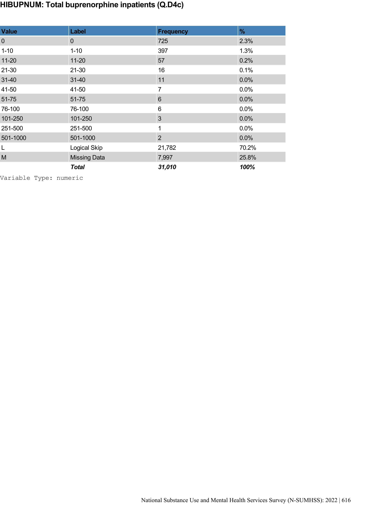

# tal buprenorphine inpatients (Q.D4c)

| Value  | Label        | Frequency | %      |
|--------|--------------|-----------|--------|
| 0      | 0            | 725       | 2.3%   |
| 1-10   | 1-10         | 397       | 1.3%   |
| 11-20  | 11-20        | 57        | 0.2%   |
| 21-30  | 21-30        | 16        | 0.1%   |
| 31-40  | 31-40        | 11        | 0.0%   |
| 41-50  | 41-50        | 7         | 0.0%   |
| 51-75  | 51-75        | 6         | 0.0%   |
| 76-100 | 76-100       | 6         | 0.0%   |
| 101-250| 101-250      | 3         | 0.0%   |
| 251-500| 251-500      | 1         | 0.0%   |
| 501-1000|501-1000     | 2         | 0.0%   |
| L      | Logical Skip | 21,782    | 70.2%  |
| M      | Missing Data | 7,997     | 25.8%  |
|        | **Total**    | **31,010**| **100%**|

Variable Type: numeric

National Substance Use and Mental Health Services Survey (N-SUMHSS): 2022

## naltrexone inpatients (Q.D4c)

| Value   | Label    | Frequency | %      |
|---------|----------|-----------|--------|
| 0       | 0        | 934       | 3.0%   |
| 1-10    | 1-10     | 256       | 0.8%   |
| 11-20   | 11-20    | 19        | 0.1%   |
| 21-30   | 21-30    | 7         | 0.0%   |
| 31-40   | 31-40    | 3         | 0.0%   |
| 41-50   | 41-50    | 3         | 0.0%   |
| 51-75   | 51-75    | 2         | 0.0%   |
| 76-100  | 76-100   | 1         | 0.0%   |
| 101-250 | 101-250  | 3         | 0.0%   |
| 251-500 | 251-500  | 1         | 0.0%   |
| L       | Logical Skip | 21,782 | 70.2%  |
| M       | Missing Data  | 7,999  | 25.8%  |
| **Total** |          | **31,010**   | **100%** |

Variable Type: numeric

## al alcohol disulfiram inpatients (Q.Dd4d)

| Value | Label | Frequency | % |
|-------|-------|-----------|---|
| 0     | 0     | 1,150     | 3.7% |
| 1-10  | 1-10  | 75        | 0.2% |
| 11-20 | 11-20 | 4         | 0.0% |
| 21-30 | 21-30 | 2         | 0.0% |
| 31-40 | 31-40 | 3         | 0.0% |
| 41-50 | 41-50 | 2         | 0.0% |
| 76-100| 76-100| 1         | 0.0% |
| 101-250|101-250|1         | 0.0% |
| L     | Logical Skip | 21,782 | 70.2% |
| M     | Missing Data | 7,990  | 25.8% |
|       | Total        | 31,010 | 100% |

Variable Type: numeric

National Substance Use and Mental Health Services Survey (N-SUMHSS): 2022 | 618

# Total alcohol naltrexone inpatients (Q.D4d)

| Value | Label    | Frequency | %      |
|-------|----------|-----------|--------|
| 0     | 0        | 907       | 2.9%   |
| 1-10  | 1-10     | 281       | 0.9%   |
| 11-20 | 11-20    | 23        | 0.1%   |
| 21-30 | 21-30    | 5         | 0.0%   |
| 31-40 | 31-40    | 2         | 0.0%   |
| 41-50 | 41-50    | 6         | 0.0%   |
| 51-75 | 51-75    | 1         | 0.0%   |
| 76-100| 76-100   | 2         | 0.0%   |
| 101-250| 101-250 | 1         | 0.0%   |
| 251-500| 251-500 | 2         | 0.0%   |
| L     | Logical Skip | 21,782 | 70.2%  |
| M     | Missing Data | 7,998  | 25.8%  |
|       | Total        | 31,010 | 100%   |

Variable Type: numeric

## Total alcohol acamprosate inpatients (Q.D4d)

| Value | Label       | Frequency | %      |
|-------|-------------|-----------|--------|
| 0     | 0           | 1,091     | 3.5%   |
| 1-10  | 1-10        | 131       | 0.4%   |
| 11-20 | 11-20       | 5         | 0.0%   |
| 21-30 | 21-30       | 1         | 0.0%   |
| 31-40 | 31-40       | 1         | 0.0%   |
| 41-50 | 41-50       | 4         | 0.0%   |
| 51-75 | 51-75       | 1         | 0.0%   |
| 101-250 | 101-250   | 1         | 0.0%   |
| 251-500 | 251-500   | 1         | 0.0%   |
| L     | Logical Skip | 21,782   | 70.2%  |
| M     | Missing Data | 7,992    | 25.8%  |

**Total** | 31,010 | 100%

Variable Type: numeric

---

National Substance Use and Mental Health Services Survey (N-SUMHSS): 2022 | 620

## Total beds designated-hospital inpatient

| Value  | Label     | Frequency | %     |
|--------|-----------|-----------|-------|
| 0      | 0         | 140       | 0.5%  |
| 1-10   | 1-10      | 186       | 0.6%  |
| 11-20  | 11-20     | 219       | 0.7%  |
| 21-30  | 21-30     | 155       | 0.5%  |
| 31-40  | 31-40     | 79        | 0.3%  |
| 41-50  | 41-50     | 56        | 0.2%  |
| 51-75  | 51-75     | 56        | 0.2%  |
| 76-100 | 76-100    | 31        | 0.1%  |
| 101-250| 101-250   | 35        | 0.1%  |
| 251-500| 251-500   | 1         | 0.0%  |
| L      | Logical Skip | 19,698  | 63.5% |
| M      | Missing Data | 10,354 | 33.4% |

**Total: 31,010 100%**

Variable Type: numeric

National Substance Use and Mental Health Services Survey (N-SUMHSS): 2022 | 621

## Number of hospital beds designated-hospital inpatient, unrolled (Q.D4e)

| Value  | Label      | Frequency | %     |
|--------|------------|-----------|-------|
| 0      | 0          | 140       | 0.5%  |
| 1-10   | 1-10       | 191       | 0.6%  |
| 11-20  | 11-20      | 218       | 0.7%  |
| 21-30  | 21-30      | 157       | 0.5%  |
| 31-40  | 31-40      | 82        | 0.3%  |
| 41-50  | 41-50      | 56        | 0.2%  |
| 51-75  | 51-75      | 55        | 0.2%  |
| 76-100 | 76-100     | 30        | 0.1%  |
| 101-250| 101-250    | 34        | 0.1%  |
| 251-500| 251-500    | 1         | 0.0%  |
| L      | Logical Skip| 16,257   | 52.4% |
| M      | Missing Data| 13,789   | 44.5% |

**Total**: 31,010 | 100%

**Variable Type**: numeric

_National Substance Use and Mental Health Services Survey (N-SUMHSS): 2022 | 622_

## Clients received residential non-hospital substance use services, 3/31/2022 (Q.D5)

| Value | Label       | Frequency | %     |
|-------|-------------|-----------|-------|
| 0     | No          | 11,394    | 36.7% |
| 1     | Yes         | 2,845     | 9.2%  |
| L     | Logical Skip| 8,734     | 28.2% |
| M     | Missing Data| 8,037     | 25.9% |
| **Total** | **31,010** | **100%**|

Variable Type: numeric

---

National Substance Use and Mental Health Services Survey (N-SUMHSS): 2022 | 623

dential clients, detoxification (Q.D5a)

| Value | Label      | Frequency | %      |
|-------|------------|-----------|--------|
| 0     | 0          | 2,490     | 8.0%   |
| 1-10  | 1-10       | 529       | 1.7%   |
| 11-20 | 11-20      | 127       | 0.4%   |
| 21-30 | 21-30      | 30        | 0.1%   |
| 31-40 | 31-40      | 15        | 0.0%   |
| 41-50 | 41-50      | 8         | 0.0%   |
| 51-75 | 51-75      | 5         | 0.0%   |
| 76-100| 76-100     | 5         | 0.0%   |
| 101-250| 101-250  | 6         | 0.0%   |
| L     | Logical Skip| 17,651   | 56.9%  |
| M     | Missing Data| 10,144   | 32.7%  |

Total: 31,010 | 100%

Variable Type: numeric

## ntial clients, detoxification, unrolled (Q.D5a)

| Value | Label        | Frequency | %       |
|-------|--------------|-----------|---------|
| 0     | 0            | 2,490     | 8.0%    |
| 1-10  | 1-10         | 568       | 1.8%    |
| 11-20 | 11-20        | 124       | 0.4%    |
| 21-30 | 21-30        | 34        | 0.1%    |
| 31-40 | 31-40        | 15        | 0.0%    |
| 41-50 | 41-50        | 7         | 0.0%    |
| 51-75 | 51-75        | 3         | 0.0%    |
| 76-100| 76-100       | 7         | 0.0%    |
| 101-250| 101-250     | 5         | 0.0%    |
| L     | Logical Skip | 14,314    | 46.2%   |
| M     | Missing Data | 13,443    | 43.4%   |
|       | **Total**    | **31,010**| **100%**|

Variable Type: numeric

# dentiel clients, short-term treatment (Q.D5a)

| Value  | Label   | Frequency | %     |
|--------|---------|-----------|-------|
| 0      | 0       | 1,803     | 5.8%  |
| 1-10   | 1-10    | 573       | 1.8%  |
| 11-20  | 11-20   | 388       | 1.3%  |
| 21-30  | 21-30   | 173       | 0.6%  |
| 31-40  | 31-40   | 85        | 0.3%  |
| 41-50  | 41-50   | 56        | 0.2%  |
| 51-75  | 51-75   | 59        | 0.2%  |
| 76-100 | 76-100  | 40        | 0.1%  |
| 101-250| 101-250 | 28        | 0.1%  |
| 251-500| 251-500 | 8         | 0.0%  |
| 501-1000| 501-1000 | 2      | 0.0%  |
| L      | Logical Skip | 17,651 | 56.9% |
| M      | Missing Data | 10,144 | 32.7% |

**Total:** 31,010 **100%**

Variable Type: numeric

---

National Substance Use and Mental Health Services Survey (N-SUMHSS): 2022 | 626

## ntial clients, short-term treatment, unrolled (Q.D5a)

| Value     | Label           | Frequency  |   %      |
|-----------|-----------------|------------|----------|
| 0         | 0               | 1,800      | 5.8%     |
| 1-10      | 1-10            | 652        | 2.1%     |
| 11-20     | 11-20           | 403        | 1.3%     |
| 21-30     | 21-30           | 171        | 0.6%     |
| 31-40     | 31-40           | 83         | 0.3%     |
| 41-50     | 41-50           | 49         | 0.2%     |
| 51-75     | 51-75           | 60         | 0.2%     |
| 76-100    | 76-100          | 39         | 0.1%     |
| 101-250   | 101-250         | 29         | 0.1%     |
| 251-500   | 251-500         | 11         | 0.0%     |
| L         | Logical Skip    | 14,314     | 46.2%    |
| M         | Missing Data    | 13,399     | 43.2%    |
|           | Total           | 31,010     | 100%     |

Variable Type: numeric

### Residential clients, long-term treatment (Q.D5a)

| Value  | Label       | Frequency | %      |
|--------|-------------|-----------|--------|
| 0      | 0           | 1,384     | 4.5%   |
| 1-10   | 1-10        | 675       | 2.2%   |
| 11-20  | 11-20       | 559       | 1.8%   |
| 21-30  | 21-30       | 227       | 0.7%   |
| 31-40  | 31-40       | 121       | 0.4%   |
| 41-50  | 41-50       | 73        | 0.2%   |
| 51-75  | 51-75       | 82        | 0.3%   |
| 76-100 | 76-100      | 43        | 0.1%   |
| 101-250| 101-250     | 46        | 0.1%   |
| 251-500| 251-500     | 5         | 0.0%   |
| L      | Logical Skip| 17,651    | 56.9%  |
| M      | Missing Data| 10,144    | 32.7%  |

**Total:** 31,010  **100%**

Variable Type: numeric

---

National Substance Use and Mental Health Services Survey (N-SUMHSS): 2022 | 628

## Potential clients, long-term treatment, unrolled (Q.D5a)

| Value   | Label         | Frequency | %      |
|---------|---------------|-----------|--------|
| 0       | 0             | 1,384     | 4.5%   |
| 1-10    | 1-10          | 745       | 2.4%   |
| 11-20   | 11-20         | 574       | 1.9%   |
| 21-30   | 21-30         | 242       | 0.8%   |
| 31-40   | 31-40         | 116       | 0.4%   |
| 41-50   | 41-50         | 79        | 0.3%   |
| 51-75   | 51-75         | 73        | 0.2%   |
| 76-100  | 76-100        | 38        | 0.1%   |
| 101-250 | 101-250       | 49        | 0.2%   |
| 251-500 | 251-500       | 4         | 0.0%   |
| L       | Logical Skip  | 14,314    | 46.2%  |
| M       | Missing Data  | 13,392    | 43.2%  |

**Total** |               | 31,010    | 100%   |

*Variable Type: numeric*

*National Substance Use and Mental Health Services Survey (N-SUMHSS): 2022 | 629*

## Total number of residential clients (Q.D5a)

| Value   | Label       | Frequency | %       |
|---------|-------------|-----------|---------|
| 0       | 0           | 394       | 1.3%    |
| 1-10    | 1-10        | 822       | 2.7%    |
| 11-20   | 11-20       | 827       | 2.7%    |
| 21-30   | 21-30       | 429       | 1.4%    |
| 31-40   | 31-40       | 202       | 0.7%    |
| 41-50   | 41-50       | 152       | 0.5%    |
| 51-75   | 51-75       | 170       | 0.5%    |
| 76-100  | 76-100      | 94        | 0.3%    |
| 101-250 | 101-250     | 105       | 0.3%    |
| 251-500 | 251-500     | 18        | 0.1%    |
| 501-1000| 501-1000    | 2         | 0.0%    |
| L       | Logical Skip| 17,651    | 56.9%   |
| M       | Missing Data| 10,144    | 32.7%   |
| *Total* |             | *31,010*  | *100%*  |

Variable Type: numeric

### number of residential clients, unrolled (Q.D5a)

| Value  | Label       | Frequency | %     |
|--------|-------------|-----------|-------|
| 0      | 0           | 422       | 1.4%  |
| 1-10   | 1-10        | 916       | 3.0%  |
| 11-20  | 11-20       | 881       | 2.8%  |
| 21-30  | 21-30       | 436       | 1.4%  |
| 31-40  | 31-40       | 205       | 0.7%  |
| 41-50  | 41-50       | 146       | 0.5%  |
| 51-75  | 51-75       | 162       | 0.5%  |
| 76-100 | 76-100      | 96        | 0.3%  |
| 101-250| 101-250     | 101       | 0.3%  |
| 251-500| 251-500     | 20        | 0.1%  |
| L      | Logical Skip| 14,314    | 46.2% |
| M      | Missing Data| 13,311    | 42.9% |

**Total**: 31,010 100%

Variable Type: numeric

---

National Substance Use and Mental Health Services Survey (N-SUMHSS): 2022 | 631

## ential clients under 18 years old (Q.D5b)

| Value   | Label         | Frequency | %     |
|---------|---------------|-----------|-------|
| 0       | 0             | 2,926     | 9.4%  |
| 1-10    | 1-10          | 149       | 0.5%  |
| 11-20   | 11-20         | 67        | 0.2%  |
| 21-30   | 21-30         | 26        | 0.1%  |
| 31-40   | 31-40         | 3         | 0.0%  |
| 41-50   | 41-50         | 4         | 0.0%  |
| 51-75   | 51-75         | 5         | 0.0%  |
| 76-100  | 76-100        | 2         | 0.0%  |
| 101-250 | 101-250       | 2         | 0.0%  |
| L       | Logical Skip  | 19,735    | 63.6% |
| M       | Missing Data  | 8,091     | 26.1% |
|         | **Total**     | **31,010**|**100%**|

Variable Type: numeric

## Total methadone residential clients (Q.D5c)

| Value  | Label      | Frequency | %      |
|--------|------------|-----------|--------|
| 0      | 0          | 2,938     | 9.5%   |
| 1-10   | 1-10       | 231       | 0.7%   |
| 11-20  | 11-20      | 23        | 0.1%   |
| 21-30  | 21-30      | 15        | 0.0%   |
| 31-40  | 31-40      | 6         | 0.0%   |
| 41-50  | 41-50      | 3         | 0.0%   |
| 51-75  | 51-75      | 4         | 0.0%   |
| 76-100 | 76-100     | 1         | 0.0%   |
| 101-250| 101-250    | 1         | 0.0%   |
| L      | Logical Skip | 19,736  | 63.6%  |
| M      | Missing Data | 8,052   | 26.0%  |

**Total** 31,010 100%

Variable Type: numeric

National Substance Use and Mental Health Services Survey (N-SUMHSS): 2022 | 633

## Total buprenorphine residential clients (Q.D5c)

| Value  | Label     | Frequency | %      |
|--------|-----------|-----------|--------|
| 0      | 0         | 2,051     | 6.6%   |
| 1-10   | 1-10      | 928       | 3.0%   |
| 11-20  | 11-20     | 134       | 0.4%   |
| 21-30  | 21-30     | 55        | 0.2%   |
| 31-40  | 31-40     | 18        | 0.1%   |
| 41-50  | 41-50     | 12        | 0.0%   |
| 51-75  | 51-75     | 8         | 0.0%   |
| 76-100 | 76-100    | 4         | 0.0%   |
| 101-250| 101-250   | 2         | 0.0%   |
| 251-500| 251-500   | 1         | 0.0%   |
| L      | Logical Skip | 19,736 | 63.6%  |
| M      | Missing Data | 8,061  | 26.0%  |

**Total**: 31,010  **100%**

**Variable Type**: numeric

*National Substance Use and Mental Health Services Survey (N-SUMHSS): 2022 | 634*

## tal naltrexone residential clients (Q.D5c)

| Value | Label       | Frequency | %      |
|-------|-------------|-----------|--------|
| 0     | 0           | 2,474     | 8.0%   |
| 1-10  | 1-10        | 659       | 2.1%   |
| 11-20 | 11-20       | 48        | 0.2%   |
| 21-30 | 21-30       | 12        | 0.0%   |
| 31-40 | 31-40       | 8         | 0.0%   |
| 41-50 | 41-50       | 4         | 0.0%   |
| 51-75 | 51-75       | 1         | 0.0%   |
| 76-100| 76-100      | 3         | 0.0%   |
| 101-250| 101-250    | 4         | 0.0%   |
| L     | Logical Skip| 19,736    | 63.6%  |
| M     | Missing Data| 8,061     | 26.0%  |

**Total** |   | **31,010**  | **100%** |

Variable Type: numeric

National Substance Use and Mental Health Services Survey (N-SUMHSS): 2022

## tal alcohol disulfiram residential clients (Q.D5d)

| Value | Label       | Frequency | %     |
|-------|-------------|-----------|-------|
| 0     | 0           | 3,082     | 9.9%  |
| 1-10  | 1-10        | 126       | 0.4%  |
| 11-20 | 11-20       | 7         | 0.0%  |
| 21-30 | 21-30       | 1         | 0.0%  |
| 51-75 | 51-75       | 1         | 0.0%  |
| L     | Logical Skip| 19,737    | 63.6% |
| M     | Missing Data| 8,056     | 26.0% |
|       | **Total**   | **31,010**| **100%**|

Variable Type: numeric

National Substance Use and Mental Health Services Survey (N-SUMHSS): 2022 | 636

## Total alcohol naltrexone residential clients (Q.D5d)

| Value | Label               | Frequency | %     |
|-------|---------------------|-----------|-------|
| 0     | 0                   | 2,565     | 8.3%  |
| 1-10  | 1-10                | 572       | 1.8%  |
| 11-20 | 11-20               | 50        | 0.2%  |
| 21-30 | 21-30               | 8         | 0.0%  |
| 31-40 | 31-40               | 4         | 0.0%  |
| 41-50 | 41-50               | 8         | 0.0%  |
| 51-75 | 51-75               | 2         | 0.0%  |
| 76-100| 76-100              | 1         | 0.0%  |
| 251-500| 251-500            | 1         | 0.0%  |
| L     | Logical Skip        | 19,736    | 63.6% |
| M     | Missing Data        | 8,063     | 26.0% |
|       | **Total**           | **31,010**| **100%** |

Variable Type: numeric

# Total alcohol acamprosate residential clients (Q.D5d)

| Value | Label  | Frequency | %   |
|-------|--------|-----------|-----|
| 0     | 0      | 2,979     | 9.6% |
| 1-10  | 1-10   | 223       | 0.7% |
| 11-20 | 11-20  | 6         | 0.0% |
| 21-30 | 21-30  | 4         | 0.0% |
| 31-40 | 31-40  | 2         | 0.0% |
| 41-50 | 41-50  | 1         | 0.0% |
| 101-250 | 101-250 | 1       | 0.0% |
| L     | Logical Skip | 19,736 | 63.6% |
| M     | Missing Data | 8,058  | 26.0% |

**Total:** 31,010  **100%**

Variable Type: numeric

National Substance Use and Mental Health Services Survey (N-SUMHSS): 2022

## tal beds designated-residential clients

| Value   | Label   | Frequency | %      |
|---------|---------|-----------|--------|
| 0       | 0       | 79        | 0.3%   |
| 1-10    | 1-10    | 507       | 1.6%   |
| 11-20   | 11-20   | 793       | 2.6%   |
| 21-30   | 21-30   | 447       | 1.4%   |
| 31-40   | 31-40   | 303       | 1.0%   |
| 41-50   | 41-50   | 191       | 0.6%   |
| 51-75   | 51-75   | 211       | 0.7%   |
| 76-100  | 76-100  | 136       | 0.4%   |
| 101-250 | 101-250 | 122       | 0.4%   |
| 251-500 | 251-500 | 7         | 0.0%   |
| 501-1000| 501-1000| 1         | 0.0%   |
| L       | Logical Skip| 17,652| 56.9%  |
| M       | Missing Data| 10,561| 34.1%  |

**Total**: 31,010 (100%)

Variable Type: numeric

# beds designated-residential clients, unrolled (Q.D5e)

| Value  | Label          | Frequency | %      |
|--------|----------------|-----------|--------|
| 0      | 0              | 79        | 0.3%   |
| 1-10   | 1-10           | 573       | 1.8%   |
| 11-20  | 11-20          | 857       | 2.8%   |
| 21-30  | 21-30          | 471       | 1.5%   |
| 31-40  | 31-40          | 317       | 1.0%   |
| 41-50  | 41-50          | 191       | 0.6%   |
| 51-75  | 51-75          | 201       | 0.6%   |
| 76-100 | 76-100         | 127       | 0.4%   |
| 101-250| 101-250        | 114       | 0.4%   |
| 251-500| 251-500        | 7         | 0.0%   |
| 501-1000| 501-1000      | 1         | 0.0%   |
| L      | Logical Skip   | 14,315    | 46.2%  |
| M      | Missing Data   | 13,757    | 44.4%  |

**Total**                  **31,010**   **100%**

Variable Type: numeric

---

National Substance Use and Mental Health Services Survey (N-SUMHSS): 2022 | 640

### Clients received outpatient substance use services, 3/31/2022 (Q.D6)

| Value | Label       | Frequency | %     |
|-------|-------------|-----------|-------|
| 0     | No          | 4,012     | 12.9% |
| 1     | Yes         | 10,116    | 32.6% |
| L     | Logical Skip| 8,735     | 28.2% |
| M     | Missing Data| 8,147     | 26.3% |
|       | **Total**   | **31,010**| **100%**|

Variable Type: numeric

National Substance Use and Mental Health Services Survey (N-SUMHSS): 2022 | 641

### Patient clients, detoxification (Q.D6a)

| Value | Label      | Frequency | %      |
|-------|------------|-----------|--------|
| 0     | 0          | 10,731    | 34.6%  |
| 1-10  | 1-10       | 338       | 1.1%   |
| 11-20 | 11-20      | 54        | 0.2%   |
| 21-30 | 21-30      | 28        | 0.1%   |
| 31-40 | 31-40      | 11        | 0.0%   |
| 41-50 | 41-50      | 13        | 0.0%   |
| 51-75 | 51-75      | 5         | 0.0%   |
| 76-100| 76-100     | 12        | 0.0%   |
| 101-250| 101-250   | 20        | 0.1%   |
| 251-500| 251-500   | 4         | 0.0%   |
| 501-1000| 501-1000 | 3         | 0.0%   |
| L     | Logical Skip| 9,669    | 31.2%  |
| M     | Missing Data| 10,122   | 32.6%  |

**Total**: 31,010 **100%**

Variable Type: numeric

*National Substance Use and Mental Health Services Survey (N-SUMHSS): 2022 | 642*

### Ent clients, detoxification, unrolled (Q.D6a)

| Value  | Label   | Frequency | %      |
|--------|---------|-----------|--------|
| 0      | 0       | 10,700    | 34.5%  |
| 1-10   | 1-10    | 370       | 1.2%   |
| 11-20  | 11-20   | 51        | 0.2%   |
| 21-30  | 21-30   | 36        | 0.1%   |
| 31-40  | 31-40   | 11        | 0.0%   |
| 41-50  | 41-50   | 13        | 0.0%   |
| 51-75  | 51-75   | 5         | 0.0%   |
| 76-100 | 76-100  | 14        | 0.0%   |
| 101-250| 101-250 | 18        | 0.1%   |
| 251-500| 251-500 | 4         | 0.0%   |
| 501-1000| 501-1000 | 3      | 0.0%   |
| L      | Logical Skip  | 6,735 | 21.7% |
| M      | Missing Data | 13,050 | 42.1% |
| Total  | Total   | 31,010    | 100%   |

Variable Type: numeric

---

National Substance Use and Mental Health Services Survey (N-SUMHSS): 2022 | 643

## rtpatient clients, methadone maintained (Q.D6a)

| Value     | Label      | Frequency | %      |
|-----------|------------|-----------|--------|
| 0         | 0          | 7,132     | 23.0%  |
| 1-10      | 1-10       | 1,014     | 3.3%   |
| 11-20     | 11-20      | 353       | 1.1%   |
| 21-30     | 21-30      | 262       | 0.8%   |
| 31-40     | 31-40      | 174       | 0.6%   |
| 41-50     | 41-50      | 135       | 0.4%   |
| 51-75     | 51-75      | 247       | 0.8%   |
| 76-100    | 76-100     | 232       | 0.7%   |
| 101-250   | 101-250    | 797       | 2.6%   |
| 251-500   | 251-500    | 539       | 1.7%   |
| 501-1000  | 501-1000   | 287       | 0.9%   |
| 1001-1500 | 1001-1500  | 35        | 0.1%   |
| 1501 +    | 1501 +     | 12        | 0.0%   |
| L         | Logical Skip| 9,667    | 31.2%  |
| M         | Missing Data| 10,124   | 32.6%  |

**Total**: 31,010 **100%**

**Variable Type**: numeric

---

National Substance Use and Mental Health Services Survey (N-SUMHSS): 2022 | 644

# . . .tient clients, methadone maintained, unrolled (Q.D6a)

| Value   | Label       | Frequency | %       |
|---------|-------------|-----------|---------|
| 0       | 0           | 7,106     | 22.9%   |
| 1-10    | 1-10        | 1,186     | 3.8%    |
| 11-20   | 11-20       | 475       | 1.5%    |
| 21-30   | 21-30       | 276       | 0.9%    |
| 31-40   | 31-40       | 181       | 0.6%    |
| 41-50   | 41-50       | 151       | 0.5%    |
| 51-75   | 51-75       | 265       | 0.9%    |
| 76-100  | 76-100      | 244       | 0.8%    |
| 101-250 | 101-250     | 867       | 2.8%    |
| 251-500 | 251-500     | 574       | 1.9%    |
| 501-1000| 501-1000    | 274       | 0.9%    |
| 1001-1500 | 1001-1500 | 29        | 0.1%    |
| 1501 +  | 1501 +      | 7         | 0.0%    |
| L       | Logical Skip| 6,733     | 21.7%   |
| M       | Missing Data| 12,642    | 40.8%   |
| **Total** |             | **31,010** | **100%** |

**Variable Type:** numeric

National Substance Use and Mental Health Services Survey (N-SUMHSS): 2022 | 645

## Outpatient clients, day treatment/partial hospitalization (Q.D6a)

| Value  | Label     | Frequency | %     |
|--------|-----------|-----------|-------|
| 0      | 0         | 10,054    | 32.4% |
| 1-10   | 1-10      | 591       | 1.9%  |
| 11-20  | 11-20     | 284       | 0.9%  |
| 21-30  | 21-30     | 108       | 0.3%  |
| 31-40  | 31-40     | 57        | 0.2%  |
| 41-50  | 41-50     | 43        | 0.1%  |
| 51-75  | 51-75     | 36        | 0.1%  |
| 76-100 | 76-100    | 14        | 0.0%  |
| 101-250| 101-250   | 23        | 0.1%  |
| 251-500| 251-500   | 7         | 0.0%  |
| 501-1000| 501-1000 | 1         | 0.0%  |
| 1501 + | 1501 +    | 1         | 0.0%  |
| L      | Logical Skip | 9,667  | 31.2% |
| M      | Missing Data | 10,124 | 32.6% |

**Total: 31,010 (100%)**

Variable Type: numeric

*National Substance Use and Mental Health Services Survey (N-SUMHSS): 2022 | 646*

ent clients, day treatment/partial hospitalization, unrolled (Q.D6a)

| Value  | Label    | Frequency | %      |
|--------|----------|-----------|--------|
| 0      | 0        | 10,019    | 32.3%  |
| 1-10   | 1-10     | 656       | 2.1%   |
| 11-20  | 11-20    | 295       | 1.0%   |
| 21-30  | 21-30    | 111       | 0.4%   |
| 31-40  | 31-40    | 54        | 0.2%   |
| 41-50  | 41-50    | 44        | 0.1%   |
| 51-75  | 51-75    | 36        | 0.1%   |
| 76-100 | 76-100   | 14        | 0.0%   |
| 101-250| 101-250  | 19        | 0.1%   |
| 251-500| 251-500  | 7         | 0.0%   |
| 501-1000| 501-1000| 1         | 0.0%   |
| 1501 + | 1501 +   | 1         | 0.0%   |
| L      | Logical Skip | 6,733 | 21.7%  |
| M      | Missing Data | 13,020| 42.0%  |

**Total:** 31,010 **100%**

Variable Type: numeric

National Substance Use and Mental Health Services Survey (N-SUMHSS): 2022 | 647

## .atient clients, intensive (Q.D6a)

| Value  | Label        | Frequency | %      |
|--------|--------------|-----------|--------|
| 0      | 0            | 7,213     | 23.3%  |
| 1-10   | 1-10         | 1,663     | 5.4%   |
| 11-20  | 11-20        | 957       | 3.1%   |
| 21-30  | 21-30        | 477       | 1.5%   |
| 31-40  | 31-40        | 245       | 0.8%   |
| 41-50  | 41-50        | 196       | 0.6%   |
| 51-75  | 51-75        | 205       | 0.7%   |
| 76-100 | 76-100       | 114       | 0.4%   |
| 101-250| 101-250      | 110       | 0.4%   |
| 251-500| 251-500      | 24        | 0.1%   |
| 501-1000| 501-1000    | 12        | 0.0%   |
| 1001-1500 | 1001-1500 | 2         | 0.0%   |
| 1501 +   | 1501 +     | 1         | 0.0%   |
| L        | Logical Skip| 9,667    | 31.2%  |
| M        | Missing Data| 10,124   | 32.6%  |

**Total**: 31,010  100%

Variable Type: numeric

---

National Substance Use and Mental Health Services Survey (N-SUMHSS): 2022 | 648

#### ent clients, intensive, unrolled (Q.D6a)

| Value    | Label         | Frequency | %     |
|----------|---------------|-----------|-------|
| 0        | 0             | 7,209     | 23.2% |
| 1-10     | 1-10          | 1,878     | 6.1%  |
| 11-20    | 11-20         | 1,088     | 3.5%  |
| 21-30    | 21-30         | 506       | 1.6%  |
| 31-40    | 31-40         | 247       | 0.8%  |
| 41-50    | 41-50         | 209       | 0.7%  |
| 51-75    | 51-75         | 210       | 0.7%  |
| 76-100   | 76-100        | 125       | 0.4%  |
| 101-250  | 101-250       | 108       | 0.3%  |
| 251-500  | 251-500       | 21        | 0.1%  |
| 501-1000 | 501-1000      | 10        | 0.0%  |
| 1001-1500| 1001-1500     | 1         | 0.0%  |
| L        | Logical Skip  | 6,733     | 21.7% |
| M        | Missing Data  | 12,665    | 40.8% |

Total

31,010

100%

Variable Type: numeric

---

National Substance Use and Mental Health Services Survey (N-SUMHSS): 2022 | 649

## .atient clients, regular outpatient care (Q.D6a)

| Value | Label        | Frequency | %     |
|-------|--------------|-----------|-------|
| 0     | 0            | 3,606     | 11.6% |
| 1-10  | 1-10         | 1,879     | 6.1%  |
| 11-20 | 11-20        | 1,042     | 3.4%  |
| 21-30 | 21-30        | 837       | 2.7%  |
| 31-40 | 31-40        | 512       | 1.7%  |
| 41-50 | 41-50        | 463       | 1.5%  |
| 51-75 | 51-75        | 648       | 2.1%  |
| 76-100| 76-100       | 495       | 1.6%  |
| 101-250| 101-250     | 1,028     | 3.3%  |
| 251-500| 251-500     | 387       | 1.2%  |
| 501-1000| 501-1000   | 203       | 0.7%  |
| 1001-1500 | 1001-1500| 53        | 0.2%  |
| 1501 + | 1501 +      | 66        | 0.2%  |
| L     | Logical Skip | 9,667     | 31.2% |
| M     | Missing Data | 10,124    | 32.6% |

**Total**: 31,010 (100%)

Variable Type: numeric

National Substance Use and Mental Health Services Survey (N-SUMHSS): 2022 | 650

## Clients, regular outpatient care, unrolled (Q.D6a)

| Value | Label        | Frequency | %     |
|-------|--------------|-----------|-------|
| 0     | 0            | 3,630     | 11.7% |
| 1-10  | 1-10         | 2,221     | 7.2%  |
| 11-20 | 11-20        | 1,274     | 4.1%  |
| 21-30 | 21-30        | 909       | 2.9%  |
| 31-40 | 31-40        | 631       | 2.0%  |
| 41-50 | 41-50        | 502       | 1.6%  |
| 51-75 | 51-75        | 738       | 2.4%  |
| 76-100| 76-100       | 547       | 1.8%  |
| 101-250| 101-250     | 1,132     | 3.7%  |
| 251-500| 251-500     | 415       | 1.3%  |
| 501-1000| 501-1000   | 228       | 0.7%  |
| 1001-1500| 1001-1500 | 42        | 0.1%  |
| 1501 + | 1501 +      | 52        | 0.2%  |
| L     | Logical Skip | 6,733     | 21.7% |
| M     | Missing Data | 11,956    | 38.6% |

**Total** | 31,010 | 100%

**Variable Type:** numeric

National Substance Use and Mental Health Services Survey (N-SUMHSS): 2022 | 651

# Total number of outpatient clients (Q.D6a)

| Value     | Label        | Frequency | %     |
|-----------|--------------|-----------|-------|
| 0         | 0            | 1,197     | 3.9%  |
| 1-10      | 1-10         | 1,489     | 4.8%  |
| 11-20     | 11-20        | 1,074     | 3.5%  |
| 21-30     | 21-30        | 899       | 2.9%  |
| 31-40     | 31-40        | 655       | 2.1%  |
| 41-50     | 41-50        | 546       | 1.8%  |
| 51-75     | 51-75        | 965       | 3.1%  |
| 76-100    | 76-100       | 662       | 2.1%  |
| 101-250   | 101-250      | 1,914     | 6.2%  |
| 251-500   | 251-500      | 1,065     | 3.4%  |
| 501-1000  | 501-1000     | 542       | 1.7%  |
| 1001-1500 | 1001-1500    | 109       | 0.4%  |
| 1501 +    | 1501 +       | 100       | 0.3%  |
| L         | Logical Skip | 9,667     | 31.2% |
| M         | Missing Data | 10,126    | 32.7% |

**Total:** 31,010 **100%**

Variable Type: numeric

---

National Substance Use and Mental Health Services Survey (N-SUMHSS): 2022

# number of outpatient clients, unrolled (Q.D6a)

| Value | Label        | Frequency | %     |
|-------|--------------|-----------|-------|
| 0     | 0            | 1,237     | 4.0%  |
| 1-10  | 1-10         | 1,730     | 5.6%  |
| 11-20 | 11-20        | 1,337     | 4.3%  |
| 21-30 | 21-30        | 1,015     | 3.3%  |
| 31-40 | 31-40        | 778       | 2.5%  |
| 41-50 | 41-50        | 610       | 2.0%  |
| 51-75 | 51-75        | 1,113     | 3.6%  |
| 76-100| 76-100       | 723       | 2.3%  |
| 101-250| 101-250     | 2,107     | 6.8%  |
| 251-500| 251-500     | 1,156     | 3.7%  |
| 501-1000| 501-1000   | 553       | 1.8%  |
| 1001-1500| 1001-1500 | 96        | 0.3%  |
| 1501 +| 1501 +       | 76        | 0.2%  |
| L     | Logical Skip | 6,733     | 21.7% |
| M     | Missing Data | 11,746    | 37.9% |

**Total**: 31,010 (100%)

**Variable Type**: numeric

---

National Substance Use and Mental Health Services Survey (N-SUMHSS): 2022 | 653

### Detoxification clients under 18 years old (Q.D6b)

| Value | Label   | Frequency | %      |
|-------|---------|-----------|--------|
| 0     | 0       | 8,436     | 27.2%  |
| 1-10  | 1-10    | 1,647     | 5.3%   |
| 11-20 | 11-20   | 380       | 1.2%   |
| 21-30 | 21-30   | 178       | 0.6%   |
| 31-40 | 31-40   | 79        | 0.3%   |
| 41-50 | 41-50   | 69        | 0.2%   |
| 51-75 | 51-75   | 74        | 0.2%   |
| 76-100| 76-100  | 64        | 0.2%   |
| 101-250| 101-250| 98        | 0.3%   |
| 251-500| 251-500| 52        | 0.2%   |
| 501-1000| 501-1000| 18      | 0.1%   |
| 1001-1500| 1001-1500| 12    | 0.0%   |
| 1501 + | 1501 + | 9         | 0.0%   |
| L     | Logical Skip | 11,755 | 37.9% |
| M     | Missing Data | 8,139 | 26.2%  |

**Total: 31,010 100%**

**Variable Type: numeric**

*National Substance Use and Mental Health Services Survey (N-SUMHSS): 2022 | 654*

## Total methadone outpatient (Q.D6c)

| Value   | Label       | Frequency | %     |
|---------|-------------|-----------|-------|
| 0       | 0           | 9,840     | 31.7% |
| 1-10    | 1-10        | 85        | 0.3%  |
| 11-20   | 11-20       | 18        | 0.1%  |
| 21-30   | 21-30       | 22        | 0.1%  |
| 31-40   | 31-40       | 27        | 0.1%  |
| 41-50   | 41-50       | 30        | 0.1%  |
| 51-75   | 51-75       | 62        | 0.2%  |
| 76-100  | 76-100      | 83        | 0.3%  |
| 101-250 | 101-250     | 441       | 1.4%  |
| 251-500 | 251-500     | 406       | 1.3%  |
| 501-1000| 501-1000    | 213       | 0.7%  |
| 1001-1500| 1001-1500  | 21        | 0.1%  |
| 1501 +  | 1501 +      | 6         | 0.0%  |
| L       | Logical Skip| 11,755    | 37.9% |
| M       | Missing Data| 8,001     | 25.8% |

**Total**  |           | **31,010** | **100%** |

Variable Type: numeric

---

National Substance Use and Mental Health Services Survey (N-SUMHSS): 2022 | 655

## Total buprenorphine outpatient (Q.D6c)

| Value      | Label         | Frequency | %     |
|------------|---------------|-----------|-------|
| 0          | 0             | 7,389     | 23.8% |
| 1-10       | 1-10          | 1,453     | 4.7%  |
| 11-20      | 11-20         | 501       | 1.6%  |
| 21-30      | 21-30         | 342       | 1.1%  |
| 31-40      | 31-40         | 213       | 0.7%  |
| 41-50      | 41-50         | 179       | 0.6%  |
| 51-75      | 51-75         | 241       | 0.8%  |
| 76-100     | 76-100        | 219       | 0.7%  |
| 101-250    | 101-250       | 451       | 1.5%  |
| 251-500    | 251-500       | 157       | 0.5%  |
| 501-1000   | 501-1000      | 56        | 0.2%  |
| 1001-1500  | 1001-1500     | 15        | 0.0%  |
| 1501 +     | 1501 +        | 4         | 0.0%  |
| L          | Logical Skip  | 11,755    | 37.9% |
| M          | Missing Data  | 8,035     | 25.9% |

**Total: 31,010 (100%)**

Variable Type: numeric

---

National Substance Use and Mental Health Services Survey (N-SUMHSS): 2022 | 656

## Total naltrexone outpatient (Q.D6c)

| Value   | Label         | Frequency | %      |
|---------|---------------|-----------|--------|
| 0       | 0             | 9,092     | 29.3%  |
| 1-10    | 1-10          | 1,494     | 4.8%   |
| 11-20   | 11-20         | 263       | 0.8%   |
| 21-30   | 21-30         | 133       | 0.4%   |
| 31-40   | 31-40         | 53        | 0.2%   |
| 41-50   | 41-50         | 51        | 0.2%   |
| 51-75   | 51-75         | 51        | 0.2%   |
| 76-100  | 76-100        | 25        | 0.1%   |
| 101-250 | 101-250       | 27        | 0.1%   |
| 251-500 | 251-500       | 7         | 0.0%   |
| 501-1000| 501-1000      | 1         | 0.0%   |
| 1001-1500| 1001-1500    | 4         | 0.0%   |
| L       | Logical Skip  | 11,755    | 37.9%  |
| M       | Missing Data  | 8,054     | 26.0%  |
|         | **Total**     | **31,010** | **100%**|

Variable Type: numeric

National Substance Use and Mental Health Services Survey (N-SUMHSS): 2022 | 657

### tal alcohol disulfiram outpatient clients (Q.D6d)

| Value | Label     | Frequency | %      |
|-------|-----------|-----------|--------|
| 0     | 0         | 10,612    | 34.2%  |
| 1-10  | 1-10      | 566       | 1.8%   |
| 11-20 | 11-20     | 40        | 0.1%   |
| 21-30 | 21-30     | 15        | 0.0%   |
| 31-40 | 31-40     | 2         | 0.0%   |
| 41-50 | 41-50     | 12        | 0.0%   |
| 51-75 | 51-75     | 2         | 0.0%   |
| 76-100| 76-100    | 2         | 0.0%   |
| 101-250| 101-250  | 2         | 0.0%   |
| L     | Logical Skip | 11,755 | 37.9%  |
| M     | Missing Data | 8,002  | 25.8%  |
|       | Total     | 31,010    | 100%   |

Variable Type: numeric

National Substance Use and Mental Health Services Survey (N-SUMHSS): 2022 | 658

## Total alcohol naltrexone outpatient clients (Q.D6d)

| Value  | Label        | Frequency | %     |
|--------|--------------|-----------|-------|
| 0      | 0            | 8,652     | 27.9% |
| 1-10   | 1-10         | 1,840     | 5.9%  |
| 11-20  | 11-20        | 305       | 1.0%  |
| 21-30  | 21-30        | 134       | 0.4%  |
| 31-40  | 31-40        | 52        | 0.2%  |
| 41-50  | 41-50        | 66        | 0.2%  |
| 51-75  | 51-75        | 44        | 0.1%  |
| 76-100 | 76-100       | 38        | 0.1%  |
| 101-250| 101-250      | 38        | 0.1%  |
| 251-500| 251-500      | 11        | 0.0%  |
| 1501 + | 1501 +       | 4         | 0.0%  |
| L      | Logical Skip | 11,755    | 37.9% |
| M      | Missing Data | 8,071     | 26.0% |

Total        31,010     100%

**Variable Type:** numeric

National Substance Use and Mental Health Services Survey (N-SUMHSS): 2022 | 659

## Total alcohol acamprosate outpatient clients (Q.D6d)

| Value  | Label        | Frequency | %      |
|--------|--------------|-----------|--------|
| 0      | 0            | 10,341    | 33.3%  |
| 1-10   | 1-10         | 749       | 2.4%   |
| 11-20  | 11-20        | 91        | 0.3%   |
| 21-30  | 21-30        | 23        | 0.1%   |
| 31-40  | 31-40        | 13        | 0.0%   |
| 41-50  | 41-50        | 12        | 0.0%   |
| 51-75  | 51-75        | 7         | 0.0%   |
| 76-100 | 76-100       | 5         | 0.0%   |
| 101-250| 101-250      | 4         | 0.0%   |
| L      | Logical Skip | 11,755    | 37.9%  |
| M      | Missing Data | 8,010     | 25.8%  |
|        | **Total**    | **31,010**| **100%**|

Variable Type: numeric

---

National Substance Use and Mental Health Services Survey (N-SUMHSS): 2022 | 660

### Number of clients treated for both alcohol/drug use (Q.D7)

| Value     | Label       | Frequency | %      |
|-----------|-------------|-----------|--------|
| 0         | 0           | 1,198     | 3.9%   |
| 1-10      | 1-10        | 1,943     | 6.3%   |
| 11-20     | 11-20       | 749       | 2.4%   |
| 21-30     | 21-30       | 383       | 1.2%   |
| 31-40     | 31-40       | 186       | 0.6%   |
| 41-50     | 41-50       | 165       | 0.5%   |
| 51-75     | 51-75       | 199       | 0.6%   |
| 76-100    | 76-100      | 143       | 0.5%   |
| 101-250   | 101-250     | 188       | 0.6%   |
| 251-500   | 251-500     | 80        | 0.3%   |
| 501-1000  | 501-1000    | 30        | 0.1%   |
| 1001-1500 | 1001-1500   | 14        | 0.0%   |
| 1501 +    | 1501 +      | 7         | 0.0%   |
| L         | Logical Skip| 8,878     | 28.6%  |
| M         | Missing Data| 15,096    | 48.7%  |
| N         | Not Applicable| 1,751  | 5.6%   |
| **Total** |             | **31,010**| **100%**|

Variable Type: numeric

National Substance Use and Mental Health Services Survey (N-SUMHSS): 2022 | 661

#### t of clients treated for both alcohol/drug use (Q.D7)

| Value | Label     | Frequency | %      |
|-------|-----------|-----------|--------|
| 0     | 0         | 757       | 2.4%   |
| 1-10  | 1-10      | 564       | 1.8%   |
| 11-20 | 11-20     | 802       | 2.6%   |
| 21-30 | 21-30     | 906       | 2.9%   |
| 31-40 | 31-40     | 638       | 2.1%   |
| 41-50 | 41-50     | 877       | 2.8%   |
| 51-60 | 51-60     | 479       | 1.5%   |
| 61-70 | 61-70     | 417       | 1.3%   |
| 71-80 | 71-80     | 489       | 1.6%   |
| 81-90 | 81-90     | 199       | 0.6%   |
| 91-99 | 91-99     | 91        | 0.3%   |
| 100   | 100       | 465       | 1.5%   |
| L     | Logical Skip | 8,881 | 28.6%  |
| M     | Missing Data | 13,694 | 44.2% |
| N     | Not Applicable | 1,751 | 5.6% |

|       | Total     | 31,010    | 100%   |

**Variable Type:** numeric

National Substance Use and Mental Health Services Survey (N-SUMHSS): 2022 | 662

### Number of clients treated for only alcohol use (Q.D7)

| Value      | Label        | Frequency  | %     |
|------------|--------------|------------|-------|
| 0          | 0            | 1,969      | 6.3%  |
| 1-10       | 1-10         | 2,203      | 7.1%  |
| 11-20      | 11-20        | 489        | 1.6%  |
| 21-30      | 21-30        | 227        | 0.7%  |
| 31-40      | 31-40        | 99         | 0.3%  |
| 41-50      | 41-50        | 85         | 0.3%  |
| 51-75      | 51-75        | 83         | 0.3%  |
| 76-100     | 76-100       | 47         | 0.2%  |
| 101-250    | 101-250      | 56         | 0.2%  |
| 251-500    | 251-500      | 15         | 0.0%  |
| 501-1000   | 501-1000     | 3          | 0.0%  |
| 1001-1500  | 1001-1500    | 2          | 0.0%  |
| 1501 +     | 1501 +       | 1          | 0.0%  |
| L          | Logical Skip | 8,878      | 28.6% |
| M          | Missing Data | 15,102     | 48.7% |
| N          | Not Applicable | 1,751   | 5.6%  |
| **Total**  |              | **31,010** | **100%** |

Variable Type: numeric

## t of clients treated for only alcohol use (Q.D7)

| Value | Label      | Frequency | %     |
|-------|------------|-----------|-------|
| 0     | 0          | 1,411     | 4.6%  |
| 1-10  | 1-10       | 1,439     | 4.6%  |
| 11-20 | 11-20      | 1,292     | 4.2%  |
| 21-30 | 21-30      | 1,200     | 3.9%  |
| 31-40 | 31-40      | 487       | 1.6%  |
| 41-50 | 41-50      | 361       | 1.2%  |
| 51-60 | 51-60      | 168       | 0.5%  |
| 61-70 | 61-70      | 135       | 0.4%  |
| 71-80 | 71-80      | 99        | 0.3%  |
| 81-90 | 81-90      | 41        | 0.1%  |
| 91-99 | 91-99      | 12        | 0.0%  |
| 100   | 100        | 38        | 0.1%  |
| L     | Logical Skip | 8,882  | 28.6% |
| M     | Missing Data | 13,694 | 44.2% |
| N     | Not Applicable | 1,751 | 5.6%  |
| Total |            | 31,010    | 100%  |

Variable Type: numeric

## Number of clients treated for only drug use (Q.D7)

| Value     | Label              | Frequency | %    |
|-----------|--------------------|-----------|------|
| 0         | 0                  | 1,242     | 4.0  |
| 1-10      | 1-10               | 1,672     | 5.4  |
| 11-20     | 11-20              | 536       | 1.7  |
| 21-30     | 21-30              | 298       | 1.0  |
| 31-40     | 31-40              | 169       | 0.5  |
| 41-50     | 41-50              | 123       | 0.4  |
| 51-75     | 51-75              | 179       | 0.6  |
| 76-100    | 76-100             | 141       | 0.5  |
| 101-250   | 101-250            | 439       | 1.4  |
| 251-500   | 251-500            | 306       | 1.0  |
| 501-1000  | 501-1000           | 145       | 0.5  |
| 1001-1500 | 1001-1500          | 27        | 0.1  |
| 1501 +    | 1501 +             | 3         | 0.0  |
| L         | Logical Skip       | 8,878     | 28.6 |
| M         | Missing Data       | 15,101    | 48.7 |
| N         | Not Applicable     | 1,751     | 5.6  |

**Total:** 31,010 (100%)

**Variable Type:** numeric

---
National Substance Use and Mental Health Services Survey (N-SUMHSS): 2022 | 665

# of clients treated for only drug use (Q.D7)

| Value  | Label       | Frequency | %    |
|--------|-------------|------------|------|
| 0      | 0           | 798        | 2.6% |
| 1-10   | 1-10        | 836        | 2.7% |
| 11-20  | 11-20       | 909        | 2.9% |
| 21-30  | 21-30       | 1,027      | 3.3% |
| 31-40  | 31-40       | 621        | 2.0% |
| 41-50  | 41-50       | 539        | 1.7% |
| 51-60  | 51-60       | 386        | 1.2% |
| 61-70  | 61-70       | 386        | 1.2% |
| 71-80  | 71-80       | 313        | 1.0% |
| 81-90  | 81-90       | 223        | 0.7% |
| 91-99  | 91-99       | 134        | 0.4% |
| 100    | 100         | 500        | 1.6% |
| 100 +  | 100 +       | 11         | 0.0% |
| L      | Logical Skip| 8,883      | 28.6%|
| M      | Missing Data| 13,693     | 44.2%|
| N      | Not Applicable  | 1,751  | 5.6% |

**Total** | 31,010 | 100%

Variable Type: numeric

---
National Substance Use and Mental Health Services Survey (N-SUMHSS): 2022 | 666

# R1: Percent of clients with mental health and substance use diagnosis (Q.D8)

| Value | Label  | Frequency | %    |
|-------|--------|-----------|------|
| 0     | 0      | 1,286     | 4.1% |
| 1-10  | 1-10   | 963       | 3.1% |
| 11-20 | 11-20  | 696       | 2.2% |
| 21-30 | 21-30  | 883       | 2.8% |
| 31-40 | 31-40  | 811       | 2.6% |
| 41-50 | 41-50  | 1,199     | 3.9% |
| 51-60 | 51-60  | 666       | 2.1% |
| 61-70 | 61-70  | 784       | 2.5% |
| 71-80 | 71-80  | 1,435     | 4.6% |
| 81-90 | 81-90  | 1,133     | 3.7% |
| 91-99 | 91-99  | 521       | 1.7% |
| 100   | 100    | 1,540     | 5.0% |
| L     | Logical Skip | 8,873     | 28.6% |
| M     | Missing Data | 8,469     | 27.3% |
| N     | Not Applicable | 1,751     | 5.6% |

**Total** | **31,010** | **100%**

Variable Type: numeric

---

National Substance Use and Mental Health Services Survey (N-SUMHSS): 2022 | 667

## Total number of admissions for substance use treatment (Q.D9)

| Value     | Label      | Frequency | %     |
|-----------|------------|-----------|-------|
| 0         | 0          | 1,251     | 4.0%  |
| 1-10      | 1-10       | 905       | 2.9%  |
| 11-20     | 11-20      | 726       | 2.3%  |
| 21-30     | 21-30      | 661       | 2.1%  |
| 31-40     | 31-40      | 566       | 1.8%  |
| 41-50     | 41-50      | 666       | 2.1%  |
| 51-75     | 51-75      | 1,164     | 3.8%  |
| 76-100    | 76-100     | 1,202     | 3.9%  |
| 101-250   | 101-250    | 2,923     | 9.4%  |
| 251-500   | 251-500    | 1,529     | 4.9%  |
| 501-1000  | 501-1000   | 847       | 2.7%  |
| 1001-1500 | 1001-1500  | 255       | 0.8%  |
| 1501 +    | 1501 +     | 254       | 0.8%  |
| L         | Logical Skip | 8,769   | 28.3% |
| M         | Missing Data | 9,292   | 30.0% |

**Total**: 31,010  100%

Variable Type: numeric

# al number of substance use clients

| Value    | Label      | Frequency | %      |
|----------|------------|-----------|--------|
| 0        | 0          | 1,160     | 3.7%   |
| 1-10     | 1-10       | 2,073     | 6.7%   |
| 11-20    | 11-20      | 1,663     | 5.4%   |
| 21-30    | 21-30      | 1,273     | 4.1%   |
| 31-40    | 31-40      | 810       | 2.6%   |
| 41-50    | 41-50      | 719       | 2.3%   |
| 51-75    | 51-75      | 1,154     | 3.7%   |
| 76-100   | 76-100     | 776       | 2.5%   |
| 101-250  | 101-250    | 2,088     | 6.7%   |
| 251-500  | 251-500    | 1,112     | 3.6%   |
| 501-1000 | 501-1000   | 550       | 1.8%   |
| 1001-1500| 1001-1500  | 114       | 0.4%   |
| 1501 +   | 1501 +     | 104       | 0.3%   |
| L        | Logical Skip | 253     | 0.8%   |
| M        | Missing Data | 17,161  | 55.3%  |

**Total** | | **31,010** | **100%**

Variable Type: numeric

# Number of substance use clients, unrolled

| Value   | Label        | Frequency | %    |
|---------|--------------|-----------|------|
| 0       | 0            | 1,187     | 3.8% |
| 1-10    | 1-10         | 2,396     | 7.7% |
| 11-20   | 11-20        | 1,969     | 6.3% |
| 21-30   | 21-30        | 1,406     | 4.5% |
| 31-40   | 31-40        | 947       | 3.1% |
| 41-50   | 41-50        | 786       | 2.5% |
| 51-75   | 51-75        | 1,310     | 4.2% |
| 76-100  | 76-100       | 836       | 2.7% |
| 101-250 | 101-250      | 2,276     | 7.3% |
| 251-500 | 251-500      | 1,205     | 3.9% |
| 501-1000| 501-1000     | 562       | 1.8% |
| 1001-1500| 1001-1500   | 100       | 0.3% |
| 1501 +  | 1501 +       | 79        | 0.3% |
| L       | Logical Skip | 253       | 0.8% |
| M       | Missing Data | 15,698    | 50.6% |

**Total**  | **31,010**   | **100%** |

Variable Type: numeric

# :D_UNABLE_MH: Unable to unroll MH client/bed counts

| Value | Label                  | Frequency | %      |
|-------|------------------------|-----------|--------|
| 1     | Unable to be unrolled  | 102       | 0.3%   |
| M     | Missing Data           | 30,908    | 99.7%  |
|       | **Total**              | **31,010**| **100%**|

Variable Type: numeric

National Substance Use and Mental Health Services Survey (N-SUMHSS): 2022 | 671

#### Patients received 24-hour hospital inpatient mental health services, 3/31/2022 (Q.D10)

| Value | Label         | Frequency | %      |
|-------|---------------|-----------|--------|
| 0     | No            | 6,941     | 22.4%  |
| 1     | Yes           | 1,099     | 3.5%   |
| L     | Logical Skip  | 13,597    | 43.8%  |
| M     | Missing Data  | 9,373     | 30.2%  |
|       | **Total**     | **31,010**   | **100%**   |

Variable Type: numeric

## Total number of 24-hour hospital inpatients (Q.D10a)

| Value     | Label   | Frequency | %    |
|-----------|---------|-----------|------|
| 0         | 0       | 109       | 0.4% |
| 1-10      | 1-10    | 217       | 0.7% |
| 11-20     | 11-20   | 276       | 0.9% |
| 21-30     | 21-30   | 131       | 0.4% |
| 31-40     | 31-40   | 78        | 0.3% |
| 41-50     | 41-50   | 68        | 0.2% |
| 51-75     | 51-75   | 103       | 0.3% |
| 76-100    | 76-100  | 63        | 0.2% |
| 101-250   | 101-250 | 88        | 0.3% |
| 251-500   | 251-500 | 29        | 0.1% |
| 501-1000  | 501-1000| 6         | 0.0% |
| 1001-1500 | 1001-1500| 5        | 0.0% |
| 1501 +    | 1501 +  | 9         | 0.0% |
| L         | Logical Skip | 20,478     | 66.0% |
| M         | Missing Data | 9,350      | 30.2% |

**Total** | 31,010 | 100%

Variable Type: numeric

### number of 24-hour hospital inpatients, unrolled (Q.D10a)

| Value   | Label       | Frequency | %     |
|---------|-------------|-----------|-------|
| 0       | 0           | 109       | 0.4%  |
| 1-10    | 1-10        | 220       | 0.7%  |
| 11-20   | 11-20       | 276       | 0.9%  |
| 21-30   | 21-30       | 132       | 0.4%  |
| 31-40   | 31-40       | 82        | 0.3%  |
| 41-50   | 41-50       | 68        | 0.2%  |
| 51-75   | 51-75       | 102       | 0.3%  |
| 76-100  | 76-100      | 62        | 0.2%  |
| 101-250 | 101-250     | 88        | 0.3%  |
| 251-500 | 251-500     | 29        | 0.1%  |
| 501-1000| 501-1000    | 6         | 0.0%  |
| 1001-1500| 1001-1500  | 5         | 0.0%  |
| 1501 +  | 1501 +      | 9         | 0.0%  |
| L       | Logical Skip| 18,152    | 58.5% |
| M       | Missing Data| 11,670    | 37.6% |
|         | **Total**   | **31,010**| **100%**|

Variable Type: numeric

### Number of hospital inpatient beds set up/staffed at facility (Q.D10b)

| Value  | Label    | Frequency | %     |
|--------|----------|-----------|-------|
| 0      | 0        | 33        | 0.1%  |
| 1-10   | 1-10     | 91        | 0.3%  |
| 11-20  | 11-20    | 270       | 0.9%  |
| 21-30  | 21-30    | 183       | 0.6%  |
| 31-40  | 31-40    | 90        | 0.3%  |
| 41-50  | 41-50    | 76        | 0.2%  |
| 51-75  | 51-75    | 128       | 0.4%  |
| 76-100 | 76-100   | 74        | 0.2%  |
| 101-250| 101-250  | 117       | 0.4%  |
| 251-500| 251-500  | 25        | 0.1%  |
| 501-1000| 501-1000| 5         | 0.0%  |
| 1001-1500| 1001-1500| 2       | 0.0%  |
| L      | Logical Skip | 20,478    | 66.0% |
| M      | Missing Data  | 9,438     | 30.4% |

**Total: 31,010 100%**

#### Variable Type: numeric

### Number of hospital inpatient beds set up/staffed at facility, unrolled (Q.D10b)

| Value     | Label     | Frequency | %      |
|-----------|-----------|-----------|--------|
| 0         | 0         | 32        | 0.1%   |
| 1-10      | 1-10      | 94        | 0.3%   |
| 11-20     | 11-20     | 270       | 0.9%   |
| 21-30     | 21-30     | 183       | 0.6%   |
| 31-40     | 31-40     | 89        | 0.3%   |
| 41-50     | 41-50     | 82        | 0.3%   |
| 51-75     | 51-75     | 128       | 0.4%   |
| 76-100    | 76-100    | 73        | 0.2%   |
| 101-250   | 101-250   | 117       | 0.4%   |
| 251-500   | 251-500   | 25        | 0.1%   |
| 501-1000  | 501-1000  | 5         | 0.0%   |
| 1001-1500 | 1001-1500 | 2         | 0.0%   |
| L         | Logical Skip | 18,152 | 58.5%  |
| M         | Missing Data | 11,758 | 37.9%  |

**Total** | _ | **31,010** | **100%**

Variable Type: numeric

*National Substance Use and Mental Health Services Survey (N-SUMHSS): 2022 | 676*

## Total male clients/patients at this 24-hour hospital inpatient facility (Q.D10c)

| Value   | Label      | Frequency | %      |
|---------|------------|-----------|--------|
| 0       | 0          | 106       | 0.3%   |
| 1-10    | 1-10       | 340       | 1.1%   |
| 11-20   | 11-20      | 136       | 0.4%   |
| 21-30   | 21-30      | 74        | 0.2%   |
| 31-40   | 31-40      | 45        | 0.1%   |
| 41-50   | 41-50      | 18        | 0.1%   |
| 51-75   | 51-75      | 27        | 0.1%   |
| 76-100  | 76-100     | 22        | 0.1%   |
| 101-250 | 101-250    | 32        | 0.1%   |
| 251-500 | 251-500    | 11        | 0.0%   |
| 501-1000| 501-1000   | 3         | 0.0%   |
| 1001-1500| 1001-1500 | 1         | 0.0%   |
| 1501 +  | 1501 +     | 2         | 0.0%   |
| L       | Logical Skip | 20,784  | 67.0%  |
| M       | Missing Data | 9,409   | 30.3%  |

**Total** |   | **31,010** | **100%** |

*Variable Type*: numeric

*National Substance Use and Mental Health Services Survey (N-SUMHSS): 2022 | 677*

**Total male clients/patients at this 24-hour hospital inpatient facility, unrolled (Q.D10c)**

| Value     | Label      | Frequency | %      |
|-----------|------------|-----------|--------|
| 0         | 0          | 106       | 0.3%   |
| 1-10      | 1-10       | 343       | 1.1%   |
| 11-20     | 11-20      | 138       | 0.4%   |
| 21-30     | 21-30      | 76        | 0.2%   |
| 31-40     | 31-40      | 45        | 0.1%   |
| 41-50     | 41-50      | 18        | 0.1%   |
| 51-75     | 51-75      | 29        | 0.1%   |
| 76-100    | 76-100     | 21        | 0.1%   |
| 101-250   | 101-250    | 31        | 0.1%   |
| 251-500   | 251-500    | 11        | 0.0%   |
| 501-1000  | 501-1000   | 3         | 0.0%   |
| 1001-1500 | 1001-1500  | 1         | 0.0%   |
| 1501 +    | 1501 +     | 2         | 0.0%   |
| L         | Logical Skip | 18,458    | 59.5%  |
| M         | Missing Data | 11,728    | 37.8%  |
| **Total** |            | **31,010** | **100%**|

**Variable Type: numeric**

## Percent male clients/patients at this 24-hour hospital inpatient facility (Q.D10c)

| Value | Label     | Frequency | %       |
|-------|-----------|-----------|---------|
| 0     | 0         | 97        | 0.3%    |
| 1-10  | 1-10      | 2         | 0.0%    |
| 21-30 | 21-30     | 8         | 0.0%    |
| 31-40 | 31-40     | 37        | 0.1%    |
| 41-50 | 41-50     | 114       | 0.4%    |
| 51-60 | 51-60     | 93        | 0.3%    |
| 61-70 | 61-70     | 24        | 0.1%    |
| 71-80 | 71-80     | 18        | 0.1%    |
| 81-90 | 81-90     | 9         | 0.0%    |
| 91-99 | 91-99     | 10        | 0.0%    |
| 100   | 100       | 4         | 0.0%    |
| L     | Logical Skip | 22,416  | 72.3%   |
| M     | Missing Data | 8,178   | 26.4%   |
| **Total** | -         | **31,010** | **100%**  |

Variable Type: numeric

## Total female clients/patients at this 24-hour hospital inpatient facility (Q.D10c)

| Value   | Label      | Frequency | %      |
|---------|------------|-----------|--------|
| 0       | 0          | 108       | 0.3%   |
| 1-10    | 1-10       | 355       | 1.1%   |
| 11-20   | 11-20      | 155       | 0.5%   |
| 21-30   | 21-30      | 74        | 0.2%   |
| 31-40   | 31-40      | 30        | 0.1%   |
| 41-50   | 41-50      | 28        | 0.1%   |
| 51-75   | 51-75      | 38        | 0.1%   |
| 76-100  | 76-100     | 12        | 0.0%   |
| 101-250 | 101-250    | 14        | 0.0%   |
| 1001-1500 | 1001-1500 | 2         | 0.0%   |
| 1501 +  | 1501 +     | 1         | 0.0%   |
| L       | Logical Skip | 20,784    | 67.0%  |
| M       | Missing Data | 9,409     | 30.3%  |

**Total**: 31,010 **100%**

Variable Type: numeric

### Total female clients/patients at this 24-hour hospital inpatient facility, unrolled (Q.D10c)

| Value  | Label     | Frequency | %      |
|--------|-----------|-----------|--------|
| 0      | 0         | 108       | 0.3%   |
| 1-10   | 1-10      | 357       | 1.2%   |
| 11-20  | 11-20     | 161       | 0.5%   |
| 21-30  | 21-30     | 74        | 0.2%   |
| 31-40  | 31-40     | 29        | 0.1%   |
| 41-50  | 41-50     | 30        | 0.1%   |
| 51-75  | 51-75     | 37        | 0.1%   |
| 76-100 | 76-100    | 11        | 0.0%   |
| 101-250| 101-250   | 14        | 0.0%   |
| 1001-1500| 1001-1500 | 2      | 0.0%   |
| 1501+  | 1501+     | 1         | 0.0%   |
| L      | Logical Skip | 18,458 | 59.5%  |
| M      | Missing Data | 11,728 | 37.8%  |

**Total**: 31,010 100%

Variable Type: numeric

## Percent female clients/patients at this 24-hour hospital inpatient facility (Q.D10c)

| Value  | Label   | Frequency | %      |
|--------|---------|-----------|--------|
| 0      | 0       | 99        | 0.3%   |
| 1-10   | 1-10    | 16        | 0.1%   |
| 11-20  | 11-20   | 12        | 0.0%   |
| 21-30  | 21-30   | 15        | 0.0%   |
| 31-40  | 31-40   | 77        | 0.2%   |
| 41-50  | 41-50   | 117       | 0.4%   |
| 51-60  | 51-60   | 60        | 0.2%   |
| 61-70  | 61-70   | 12        | 0.0%   |
| 71-80  | 71-80   | 4         | 0.0%   |
| 81-90  | 81-90   | 2         | 0.0%   |
| 100    | 100     | 2         | 0.0%   |
| L      | Logical Skip   | 22,416    | 72.3%   |
| M      | Missing Data  | 8,178      | 26.4%   |

**Total** 31,010 100%

**Variable Type:** numeric

# O: Total clients/patients 0-17 years at this 24-hour hospital inpatient facility (Q.D10c)

| Value | Label        | Frequency | %    |
|-------|--------------|-----------|------|
| 0     | 0            | 617       | 2.0% |
| 1-10  | 1-10         | 66        | 0.2% |
| 11-20 | 11-20        | 62        | 0.2% |
| 21-30 | 21-30        | 39        | 0.1% |
| 31-40 | 31-40        | 17        | 0.1% |
| 41-50 | 41-50        | 12        | 0.0% |
| 51-75 | 51-75        | 16        | 0.1% |
| 76-100| 76-100       | 3         | 0.0% |
| 101-250| 101-250     | 1         | 0.0% |
| L     | Logical Skip | 20,777    | 67.0%|
| M     | Missing Data | 9,400     | 30.3%|

**Total**: 31,010   100%

**Variable Type**: numeric

## Total clients/patients 0-17 years at this 24-hour hospital inpatient facility, unrolled (Q.D10c)

| Value  | Label       | Frequency | %     |
|--------|-------------|-----------|-------|
| 0      | 0           | 617       | 2.0%  |
| 1-10   | 1-10        | 70        | 0.2%  |
| 11-20  | 11-20       | 63        | 0.2%  |
| 21-30  | 21-30       | 41        | 0.1%  |
| 31-40  | 31-40       | 16        | 0.1%  |
| 41-50  | 41-50       | 12        | 0.0%  |
| 51-75  | 51-75       | 15        | 0.0%  |
| 76-100 | 76-100      | 3         | 0.0%  |
| 101-250| 101-250     | 1         | 0.0%  |
| L      | Logical Skip| 18,451    | 59.5% |
| M      | Missing Data| 11,721    | 37.8% |
| **Total** || **31,010** | **100%** |

Variable Type: numeric

National Substance Use and Mental Health Services Survey (N-SUMHSS): 2022 | 684

# Percent clients/patients 0-17 years at this 24-hour hospital inpatient facility (Q.D10c)

| Value | Label  | Frequency | %      |
|-------|--------|-----------|--------|
| 0     | 0      | 311       | 1.0%   |
| 1-10  | 1-10   | 9         | 0.0%   |
| 11-20 | 11-20  | 17        | 0.1%   |
| 21-30 | 21-30  | 21        | 0.1%   |
| 31-40 | 31-40  | 15        | 0.0%   |
| 41-50 | 41-50  | 5         | 0.0%   |
| 51-60 | 51-60  | 8         | 0.0%   |
| 61-70 | 61-70  | 1         | 0.0%   |
| 91-99 | 91-99  | 2         | 0.0%   |
| 100   | 100    | 15        | 0.0%   |
| L     | Logical Skip | 22,422    | 72.3%  |
| M     | Missing Data  | 8,184     | 26.4%  |

**Total** | 31,010 | 100%

*Variable Type: numeric*

---

*National Substance Use and Mental Health Services Survey (N-SUMHSS): 2022 | 685*

# O: Total clients/patients 18-64 years at this 24-hour hospital inpatient facility (Q.D10c)

| Value   | Label    | Frequency | %    |
|---------|----------|-----------|------|
| 0       | 0        | 182       | 0.6% |
| 1-10    | 1-10     | 188       | 0.6% |
| 11-20   | 11-20    | 174       | 0.6% |
| 21-30   | 21-30    | 77        | 0.2% |
| 31-40   | 31-40    | 50        | 0.2% |
| 41-50   | 41-50    | 35        | 0.1% |
| 51-75   | 51-75    | 48        | 0.2% |
| 76-100  | 76-100   | 17        | 0.1% |
| 101-250 | 101-250  | 41        | 0.1% |
| 251-500 | 251-500  | 15        | 0.0% |
| 501-1000| 501-1000 | 4         | 0.0% |
| 1501 +  | 1501 +   | 2         | 0.0% |

| L       | Logical Skip | 20,777   | 67.0%  |
|---------|--------------|----------|-------|
| M       | Missing Data | 9,400    | 30.3%  |
|         | Total        | 31,010   | 100%   |

*Variable Type: numeric*

#### Total clients/patients 18-64 years at this 24-hour hospital inpatient facility, unrolled (Q.D10c)

| Value   | Label  | Frequency | %     |
|---------|--------|-----------|-------|
| 0       | 0      | 182       | 0.6%  |
| 1-10    | 1-10   | 193       | 0.6%  |
| 11-20   | 11-20  | 176       | 0.6%  |
| 21-30   | 21-30  | 77        | 0.2%  |
| 31-40   | 31-40  | 50        | 0.2%  |
| 41-50   | 41-50  | 35        | 0.1%  |
| 51-75   | 51-75  | 47        | 0.2%  |
| 76-100  | 76-100 | 19        | 0.1%  |
| 101-250 | 101-250| 40        | 0.1%  |
| 251-500 | 251-500| 15        | 0.0%  |
| 501-1000| 501-1000| 4        | 0.0%  |
| 1501 +  | 1501 + | 2         | 0.0%  |
| L       | Logical Skip | 18,451 | 59.5% |
| M       | Missing Data | 11,719 | 37.8% |

**Total**  |   | **31,010** | **100%**

*Variable Type:* numeric

#### Percent clients/patients 18-64 years at this 24-hour hospital inpatient facility (Q.D10c)

| Value | Label    | Frequency | %     |
|-------|----------|-----------|-------|
| 0     | 0        | 119       | 0.4%  |
| 1-10  | 1-10     | 4         | 0.0%  |
| 11-20 | 11-20    | 6         | 0.0%  |
| 21-30 | 21-30    | 2         | 0.0%  |
| 31-40 | 31-40    | 12        | 0.0%  |
| 41-50 | 41-50    | 19        | 0.1%  |
| 51-60 | 51-60    | 19        | 0.1%  |
| 61-70 | 61-70    | 40        | 0.1%  |
| 71-80 | 71-80    | 55        | 0.2%  |
| 81-90 | 81-90    | 48        | 0.2%  |
| 91-99 | 91-99    | 37        | 0.1%  |
| 100   | 100      | 43        | 0.1%  |
| L     | Logical Skip | 22,422 | 72.3% |
| M     | Missing Data | 8,184  | 26.4% |

**Total**: 31,010 - 100%

Variable Type: numeric

**Total clients/patients 65 plus years at this 24-hour hospital inpatient facility (Q.D10c)**

| Value  | Label    | Frequency | %     |
|--------|----------|-----------|-------|
| 0      | 0        | 341       | 1.1%  |
| 1-10   | 1-10     | 370       | 1.2%  |
| 11-20  | 11-20    | 71        | 0.2%  |
| 21-30  | 21-30    | 18        | 0.1%  |
| 31-40  | 31-40    | 10        | 0.0%  |
| 41-50  | 41-50    | 7         | 0.0%  |
| 51-75  | 51-75    | 5         | 0.0%  |
| 76-100 | 76-100   | 5         | 0.0%  |
| 101-250| 101-250  | 2         | 0.0%  |
| 251-500| 251-500  | 2         | 0.0%  |
| 501-1000| 501-1000| 1         | 0.0%  |
| L      | Logical Skip | 20,777  | 67.0% |
| M      | Missing Data  | 9,401   | 30.3% |
|        | **Total**    | 31,010   | **100%**|

Variable Type: numeric

---

*National Substance Use and Mental Health Services Survey (N-SUMHSS): 2022 | 689*

## Total clients/patients 65 plus years at this 24-hour hospital inpatient facility, unrolled (Q.D10c)

| Value   | Label     | Frequency | %     |
|---------|-----------|-----------|-------|
| 0       | 0         | 341       | 1.1%  |
| 1-10    | 1-10      | 373       | 1.2%  |
| 11-20   | 11-20     | 74        | 0.2%  |
| 21-30   | 21-30     | 18        | 0.1%  |
| 31-40   | 31-40     | 10        | 0.0%  |
| 41-50   | 41-50     | 7         | 0.0%  |
| 51-75   | 51-75     | 4         | 0.0%  |
| 76-100  | 76-100    | 5         | 0.0%  |
| 101-250 | 101-250   | 2         | 0.0%  |
| 251-500 | 251-500   | 2         | 0.0%  |
| 501-1000| 501-1000  | 1         | 0.0%  |
| L       | Logical Skip | 18,451  | 59.5% |
| M       | Missing Data | 11,722  | 37.8% |

**Total** | | **31,010** | **100%** |

Variable Type: numeric

--- 

National Substance Use and Mental Health Services Survey (N-SUMHSS): 2022 | 690

#### Percent clients/patients 65 plus years at this 24-hour hospital inpatient facility (Q.D10c)

| Value | Label        | Frequency | %      |
|-------|--------------|-----------|--------|
| 0     | 0            | 168       | 0.5%   |
| 1-10  | 1-10         | 98        | 0.3%   |
| 11-20 | 11-20        | 63        | 0.2%   |
| 21-30 | 21-30        | 31        | 0.1%   |
| 31-40 | 31-40        | 13        | 0.0%   |
| 41-50 | 41-50        | 9         | 0.0%   |
| 51-60 | 51-60        | 4         | 0.0%   |
| 61-70 | 61-70        | 2         | 0.0%   |
| 71-80 | 71-80        | 3         | 0.0%   |
| 81-90 | 81-90        | 4         | 0.0%   |
| 100   | 100          | 9         | 0.0%   |
| L     | Logical Skip | 22,422    | 72.3%  |
| M     | Missing Data | 8,184     | 26.4%  |
|       | Total        | 31,010    | 100%   |

Variable Type: numeric

---

National Substance Use and Mental Health Services Survey (N-SUMHSS): 2022

# _O: Total Hispanic clients/patients at this 24-hour hospital inpatient facility (Q.D10c)

| Value  | Label     | Frequency | %      |
|--------|-----------|-----------|--------|
| 0      | 0         | 502       | 1.6%   |
| 1-10   | 1-10      | 209       | 0.7%   |
| 11-20  | 11-20     | 27        | 0.1%   |
| 21-30  | 21-30     | 17        | 0.1%   |
| 31-40  | 31-40     | 7         | 0.0%   |
| 41-50  | 41-50     | 3         | 0.0%   |
| 51-75  | 51-75     | 5         | 0.0%   |
| 76-100 | 76-100    | 1         | 0.0%   |
| 101-250| 101-250   | 5         | 0.0%   |
| 251-500| 251-500   | 1         | 0.0%   |
| 501-1000| 501-1000 | 1         | 0.0%   |
| 1501 + | 1501 +    | 1         | 0.0%   |
| L      | Logical Skip | 20,773     | 67.0%  |
| M      | Missing Data | 9,458      | 30.5%  |
|        | Total     | 31,010    | 100%   |

Variable Type: numeric

*National Substance Use and Mental Health Services Survey (N-SUMHSS): 2022 | 692*

#### Total Hispanic clients/patients at this 24-hour hospital inpatient facility, unrolled (Q.D10c)

| Value     | Label     | Frequency | %      |
|-----------|-----------|-----------|--------|
| 0         | 0         | 502       | 1.6%   |
| 1-10      | 1-10      | 209       | 0.7%   |
| 11-20     | 11-20     | 27        | 0.1%   |
| 21-30     | 21-30     | 19        | 0.1%   |
| 31-40     | 31-40     | 7         | 0.0%   |
| 41-50     | 41-50     | 2         | 0.0%   |
| 51-75     | 51-75     | 5         | 0.0%   |
| 76-100    | 76-100    | 1         | 0.0%   |
| 101-250   | 101-250   | 5         | 0.0%   |
| 251-500   | 251-500   | 1         | 0.0%   |
| 501-1000  | 501-1000  | 1         | 0.0%   |
| 1501 +    | 1501 +    | 1         | 0.0%   |
| L         | Logical Skip | 18,447  | 59.5%  |
| M         | Missing Data | 11,783  | 38.0%  |
| **Total** |           | **31,010** | **100%**|

Variable Type: numeric

: Percent Hispanic clients/patients at this 24-hour hospital inpatient facility (Q.D10c)

| Value | Label       | Frequency | %     |
|-------|-------------|-----------|-------|
| 0     | 0           | 257       | 0.8%  |
| 1-10  | 1-10        | 76        | 0.2%  |
| 11-20 | 11-20       | 32        | 0.1%  |
| 21-30 | 21-30       | 17        | 0.1%  |
| 31-40 | 31-40       | 10        | 0.0%  |
| 41-50 | 41-50       | 6         | 0.0%  |
| 51-60 | 51-60       | 3         | 0.0%  |
| 61-70 | 61-70       | 1         | 0.0%  |
| 91-99 | 91-99       | 1         | 0.0%  |
| L     | Logical Skip| 22,413    | 72.3% |
| M     | Missing Data| 8,194     | 26.4% |

Total    |    31,010    |    100% 

Variable Type: numeric

National Substance Use and Mental Health Services Survey (N-SUMHSS): 2022 | 694

**HISP_O: Total non-Hispanic clients/patients at this 24-hour hospital inpatient facility (Q.D10c)**

| Value  | Label     | Frequency | %     |
|--------|-----------|-----------|-------|
| 0      | 0         | 316       | 1.0%  |
| 1-10   | 1-10      | 138       | 0.4%  |
| 11-20  | 11-20     | 130       | 0.4%  |
| 21-30  | 21-30     | 46        | 0.1%  |
| 31-40  | 31-40     | 26        | 0.1%  |
| 41-50  | 41-50     | 23        | 0.1%  |
| 51-75  | 51-75     | 31        | 0.1%  |
| 76-100 | 76-100    | 19        | 0.1%  |
| 101-250| 101-250   | 35        | 0.1%  |
| 251-500| 251-500   | 12        | 0.0%  |
| 501-1000| 501-1000 | 2         | 0.0%  |
| L      | Logical Skip | 20,773 | 67.0% |
| M      | Missing Data | 9,459  | 30.5% |

**Total** | **31,010** | **100%**

Variable Type: numeric

*National Substance Use and Mental Health Services Survey (N-SUMHSS): 2022*

### HISP: Total non-Hispanic clients/patients at this 24-hour hospital inpatient facility, unrolled (Q.D10c)

| Value  | Label      | Frequency | %      |
|--------|------------|-----------|--------|
| 0      | 0          | 316       | 1.0%   |
| 1-10   | 1-10       | 138       | 0.4%   |
| 11-20  | 11-20      | 130       | 0.4%   |
| 21-30  | 21-30      | 46        | 0.1%   |
| 31-40  | 31-40      | 26        | 0.1%   |
| 41-50  | 41-50      | 23        | 0.1%   |
| 51-75  | 51-75      | 31        | 0.1%   |
| 76-100 | 76-100     | 21        | 0.1%   |
| 101-250| 101-250    | 34        | 0.1%   |
| 251-500| 251-500    | 12        | 0.0%   |
| 501-1000| 501-1000  | 2         | 0.0%   |
| L      | Logical Skip| 18,447   | 59.5%  |
| M      | Missing Data| 11,784   | 38.0%  |

**Total**: 31,010 (100%)

Variable Type: numeric

*National Substance Use and Mental Health Services Survey (N-SUMHSS): 2022*

*National Substance Use and Mental Health Services Survey (N-SUMHSS): 2022 | 696*

# HISP: Percent non-Hispanic clients/patients at this 24-hour hospital inpatient facility (Q.D10c)

| Value | Label    | Frequency | %      |
|-------|----------|-----------|--------|
| 0     | 0        | 226       | 0.7%   |
| 1-10  | 1-10     | 3         | 0.0%   |
| 11-20 | 11-20    | 1         | 0.0%   |
| 21-30 | 21-30    | 1         | 0.0%   |
| 31-40 | 31-40    | 7         | 0.0%   |
| 41-50 | 41-50    | 6         | 0.0%   |
| 51-60 | 51-60    | 13        | 0.0%   |
| 61-70 | 61-70    | 11        | 0.0%   |
| 71-80 | 71-80    | 25        | 0.1%   |
| 81-90 | 81-90    | 47        | 0.2%   |
| 91-99 | 91-99    | 38        | 0.1%   |
| 100   | 100      | 25        | 0.1%   |
| L     | Logical Skip | 22,413 | 72.3%  |
| M     | Missing Data | 8,194  | 26.4%  |
|       | Total    | 31,010    | 100%   |

*Variable Type: numeric*

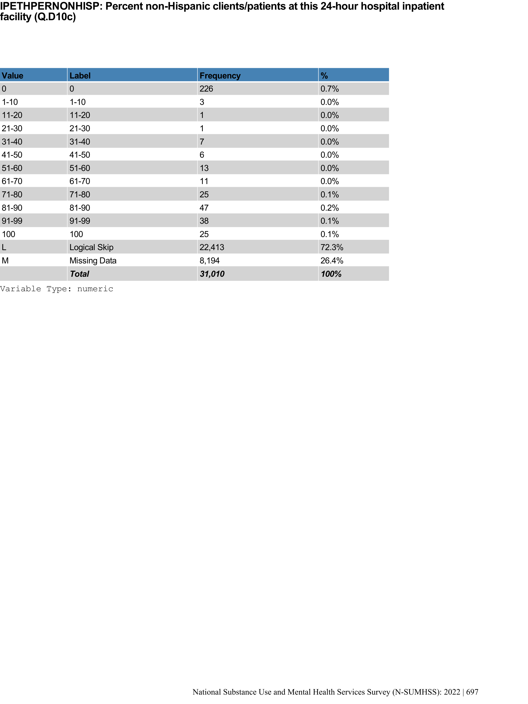

National Substance Use and Mental Health Services Survey (N-SUMHSS): 2022

# Total unknown ethnicity clients/patients at this 24-hour hospital inpatient facility (Q.D10c)

| Value   | Label     | Frequency | %     |
|---------|-----------|-----------|-------|
| 0       | 0         | 473       | 1.5%  |
| 1-10    | 1-10      | 114       | 0.4%  |
| 11-20   | 11-20     | 68        | 0.2%  |
| 21-30   | 21-30     | 37        | 0.1%  |
| 31-40   | 31-40     | 19        | 0.1%  |
| 41-50   | 41-50     | 15        | 0.0%  |
| 51-75   | 51-75     | 29        | 0.1%  |
| 76-100  | 76-100    | 12        | 0.0%  |
| 101-250 | 101-250   | 11        | 0.0%  |
| 251-500 | 251-500   | 2         | 0.0%  |
| 501-1000| 501-1000  | 1         | 0.0%  |
| 1001-1500| 1001-1500| 1         | 0.0%  |
| L       | Logical Skip | 20,773  | 67.0% |
| M       | Missing Data | 9,455   | 30.5% |
| **Total** |       | **31,010** | **100%**|

Variable Type: numeric

National Substance Use and Mental Health Services Survey (N-SUMHSS): 2022 | 698

### Total unknown ethnicity clients/patients at this 24-hour hospital inpatient facility, unrolled (Q.D10c)

| Value    | Label     | Frequency | %       |
|----------|-----------|-----------|---------|
| 0        | 0         | 473       | 1.5%    |
| 1-10     | 1-10      | 118       | 0.4%    |
| 11-20    | 11-20     | 69        | 0.2%    |
| 21-30    | 21-30     | 38        | 0.1%    |
| 31-40    | 31-40     | 23        | 0.1%    |
| 41-50    | 41-50     | 15        | 0.0%    |
| 51-75    | 51-75     | 28        | 0.1%    |
| 76-100   | 76-100    | 12        | 0.0%    |
| 101-250  | 101-250   | 10        | 0.0%    |
| 251-500  | 251-500   | 2         | 0.0%    |
| 501-1000 | 501-1000  | 1         | 0.0%    |
| 1001-1500| 1001-1500 | 1         | 0.0%    |
| L        | Logical Skip | 18,447 | 59.5%   |
| M        | Missing Data | 11,773 | 38.0%   |
| **Total**|            | **31,010**| **100%**|

Variable Type: numeric

: Percent unknown ethnicity clients/patients at this 24-hour hospital inpatient facility (Q.D10c)

| Value | Label       | Frequency | %      |
|-------|-------------|-----------|--------|
| 0     | 0           | 219       | 0.7%   |
| 1-10  | 1-10        | 35        | 0.1%   |
| 11-20 | 11-20       | 7         | 0.0%   |
| 21-30 | 21-30       | 5         | 0.0%   |
| 31-40 | 31-40       | 1         | 0.0%   |
| 51-60 | 51-60       | 2         | 0.0%   |
| 61-70 | 61-70       | 1         | 0.0%   |
| 71-80 | 71-80       | 2         | 0.0%   |
| 100   | 100         | 131       | 0.4%   |
| L     | Logical Skip| 22,413    | 72.3%  |
| M     | Missing Data| 8,194     | 26.4%  |
|       | **Total**   | **31,010**| **100%**|

Variable Type: numeric

National Substance Use and Mental Health Services Survey (N-SUMHSS): 2022 | 700

## IAN_O: Total American Indian/Alaska Native clients/patients at this 24-hour hospital inpatient facility (Q.D10c)

| Value | Label        | Frequency |   %  |
|-------|--------------|-----------|------|
| 0     | 0            | 712       | 2.3% |
| 1-10  | 1-10         | 77        | 0.2% |
| 11-20 | 11-20        | 4         | 0.0% |
| 21-30 | 21-30        | 2         | 0.0% |
| 41-50 | 41-50        | 1         | 0.0% |
| 1501+ | 1501+        | 1         | 0.0% |
| L     | Logical Skip | 20,768    | 67.0%|
| M     | Missing Data | 9,445     | 30.5%|

**Total**: 31,010 (100%)

Variable Type: numeric

---

*National Substance Use and Mental Health Services Survey (N-SUMHSS): 2022*

**IAN: Total American Indian/Alaska Native clients/patients at this 24-hour hospital inpatient facility, unrolled (Q.D10c)**

| Value | Label       | Frequency | %      |
|-------|-------------|-----------|--------|
| 0     | 0           | 713       | 2.3%   |
| 1-10  | 1-10        | 77        | 0.2%   |
| 11-20 | 11-20       | 4         | 0.0%   |
| 21-30 | 21-30       | 2         | 0.0%   |
| 41-50 | 41-50       | 1         | 0.0%   |
| 1501+ | 1501+       | 1         | 0.0%   |
| L     | Logical Skip| 18,442    | 59.5%  |
| M     | Missing Data| 11,770    | 38.0%  |

**Total**: 31,010 (100%)

Variable Type: numeric

*National Substance Use and Mental Health Services Survey (N-SUMHSS): 2022 | 702*

### JIAN: Percent American Indian/Alaska Native clients/patients at this 24-hour hospital inpatient facility (Q.D10c)

| Value | Label       | Frequency | %     |
|-------|-------------|-----------|-------|
| 0     | 0           | 347       | 1.1%  |
| 1-10  | 1-10        | 45        | 0.1%  |
| 11-20 | 11-20       | 3         | 0.0%  |
| 21-30 | 21-30       | 2         | 0.0%  |
| 31-40 | 31-40       | 1         | 0.0%  |
| L     | Logical Skip| 22,427    | 72.3% |
| M     | Missing Data| 8,185     | 26.4% |

**Total** | **31,010** | **100%**

Variable Type: numeric

National Substance Use and Mental Health Services Survey (N-SUMHSS): 2022 | 703

# IAN_O: Total Asian clients/patients at this 24-hour hospital inpatient facility (Q.D10c)

| Value | Label       | Frequency | %     |
|-------|-------------|-----------|-------|
| 0     | 0           | 630       | 2.0%  |
| 1-10  | 1-10        | 154       | 0.5%  |
| 11-20 | 11-20       | 7         | 0.0%  |
| 31-40 | 31-40       | 1         | 0.0%  |
| 41-50 | 41-50       | 1         | 0.0%  |
| 51-75 | 51-75       | 2         | 0.0%  |
| L     | Logical Skip| 20,768    | 67.0% |
| M     | Missing Data| 9,447     | 30.5% |
|       | Total       | 31,010    | 100%  |

Variable Type: numeric

National Substance Use and Mental Health Services Survey (N-SUMHSS): 2022

IAN: Total Asian clients/patients at this 24-hour hospital inpatient facility, unrolled (Q.D10c)

| Value | Label      | Frequency | %    |
|-------|------------|-----------|------|
| 0     | 0          | 630       | 2.0% |
| 1-10  | 1-10       | 155       | 0.5% |
| 11-20 | 11-20      | 7         | 0.0% |
| 31-40 | 31-40      | 1         | 0.0% |
| 41-50 | 41-50      | 1         | 0.0% |
| 51-75 | 51-75      | 2         | 0.0% |
| L     | Logical Skip | 18,442  | 59.5%|
| M     | Missing Data | 11,772  | 38.0% |
| **Total** |            | **31,010** | **100%** |

Variable Type: numeric

### IAN: Percent Asian clients/patients at this 24-hour hospital inpatient facility (Q.D10c)

| Value | Label       | Frequency | %      |
|-------|-------------|-----------|--------|
| 0     | 0           | 313       | 1.0%   |
| 1-10  | 1-10        | 77        | 0.2%   |
| 11-20 | 11-20       | 5         | 0.0%   |
| 21-30 | 21-30       | 3         | 0.0%   |
| L     | Logical Skip| 22,427    | 72.3%  |
| M     | Missing Data| 8,185     | 26.4%  |
|       | **Total**   | **31,010**| **100%**|

Variable Type: numeric

National Substance Use and Mental Health Services Survey (N-SUMHSS): 2022 | 706

# Total Black clients/patients at this 24-hour hospital inpatient facility (Q.D10c)

| Value    | Label    | Frequency | %     |
|----------|----------|-----------|-------|
| 0        | 0        | 435       | 1.4%  |
| 1-10     | 1-10     | 234       | 0.8%  |
| 11-20    | 11-20    | 50        | 0.2%  |
| 21-30    | 21-30    | 24        | 0.1%  |
| 31-40    | 31-40    | 13        | 0.0%  |
| 41-50    | 41-50    | 5         | 0.0%  |
| 51-75    | 51-75    | 13        | 0.0%  |
| 76-100   | 76-100   | 8         | 0.0%  |
| 101-250  | 101-250  | 14        | 0.0%  |
| 1001-1500| 1001-1500| 1         | 0.0%  |
| L        | Logical Skip | 20,768 | 67.0% |
| M        | Missing Data | 9,445  | 30.5% |
| Total    |          | 31,010    | 100%  |

Variable Type: numeric

### K: Total Black clients/patients at this 24-hour hospital inpatient facility, unrolled (Q.D10c)

| Value    | Label       | Frequency | %       |
|----------|-------------|-----------|---------|
| 0        | 0           | 435       | 1.4%    |
| 1-10     | 1-10        | 233       | 0.8%    |
| 11-20    | 11-20       | 50        | 0.2%    |
| 21-30    | 21-30       | 24        | 0.1%    |
| 31-40    | 31-40       | 13        | 0.0%    |
| 41-50    | 41-50       | 7         | 0.0%    |
| 51-75    | 51-75       | 13        | 0.0%    |
| 76-100   | 76-100      | 7         | 0.0%    |
| 101-250  | 101-250     | 14        | 0.0%    |
| 1001-1500| 1001-1500   | 1         | 0.0%    |
| L        | Logical Skip| 18,442    | 59.5%   |
| M        | Missing Data| 11,771    | 38.0%   |
| **Total**|             | **31,010**| **100%**|

Variable Type: numeric

---

National Substance Use and Mental Health Services Survey (N-SUMHSS): 2022 | 708

K: Percent Black clients/patients at this 24-hour hospital inpatient facility (Q.D10c)

| Value | Label  | Frequency | %      |
|-------|--------|-----------|--------|
| 0     | 0      | 257       | 0.8%   |
| 1-10  | 1-10   | 39        | 0.1%   |
| 11-20 | 11-20  | 31        | 0.1%   |
| 21-30 | 21-30  | 22        | 0.1%   |
| 31-40 | 31-40  | 16        | 0.1%   |
| 41-50 | 41-50  | 13        | 0.0%   |
| 51-60 | 51-60  | 7         | 0.0%   |
| 61-70 | 61-70  | 5         | 0.0%   |
| 71-80 | 71-80  | 6         | 0.0%   |
| 81-90 | 81-90  | 2         | 0.0%   |
| L     | Logical Skip | 22,427 | 72.3% |
| M     | Missing Data | 8,185  | 26.4% |
|       | **Total**    | **31,010** | **100%** |

Variable Type: numeric

National Substance Use and Mental Health Services Survey (N-SUMHSS): 2022

## WPAC_O: Total Native Hawaiian/Other Pacific Islander at this 24-hour hospital inpatient facility (Q.D10c)

| Value  | Label     | Frequency | %     |
|--------|-----------|-----------|-------|
| 0      | 0         | 752       | 2.4%  |
| 1-10   | 1-10      | 39        | 0.1%  |
| 11-20  | 11-20     | 1         | 0.0%  |
| 21-30  | 21-30     | 2         | 0.0%  |
| 76-100 | 76-100    | 1         | 0.0%  |
| L      | Logical Skip | 20,768 | 67.0% |
| M      | Missing Data | 9,447  | 30.5% |

**Total** | 31,010 | 100%

Variable Type: numeric

# WPAC: Total Native Hawaiian/Other Pacific Islander at this 24-hour hospital inpatient facility, unrolled (Q.D10c)

| Value | Label        | Frequency | %      |
|-------|--------------|-----------|--------|
| 0     | 0            | 752       | 2.4%   |
| 1-10  | 1-10         | 39        | 0.1%   |
| 11-20 | 11-20        | 1         | 0.0%   |
| 21-30 | 21-30        | 2         | 0.0%   |
| 76-100| 76-100       | 1         | 0.0%   |
| L     | Logical Skip | 18,442    | 59.5%  |
| M     | Missing Data | 11,773    | 38.0%  |
| **Total** |              | **31,010**  | **100%** |

Variable Type: numeric

# WPAC: Percent Native Hawaiian/Other Pacific Islander at this 24-hour hospital inpatient facility (Q.D10c)

| Value | Label | Frequency | %    |
|-------|-------|-----------|------|
| 0     | 0     | 367       | 1.2% |
| 1-10  | 1-10  | 26        | 0.1% |
| 11-20 | 11-20 | 3         | 0.0% |
| 21-30 | 21-30 | 1         | 0.0% |
| 100   | 100   | 1         | 0.0% |
| L     | Logical Skip   | 22,427    | 72.3% |
| M     | Missing Data   | 8,185     | 26.4% |

**Total** |   | 31,010     | 100% |

Variable Type: numeric

National Substance Use and Mental Health Services Survey (N-SUMHSS): 2022

IIT_O: Total White clients/patients at this 24-hour hospital inpatient facility (Q.D10c)

| Value     | Label      | Frequency | %    |
|-----------|------------|-----------|------|
| 0         | 0          | 324       | 1.0% |
| 1-10      | 1-10       | 191       | 0.6% |
| 11-20     | 11-20      | 121       | 0.4% |
| 21-30     | 21-30      | 44        | 0.1% |
| 31-40     | 31-40      | 25        | 0.1% |
| 41-50     | 41-50      | 17        | 0.1% |
| 51-75     | 51-75      | 27        | 0.1% |
| 76-100    | 76-100     | 15        | 0.0% |
| 101-250   | 101-250    | 27        | 0.1% |
| 251-500   | 251-500    | 5         | 0.0% |
| 1001-1500 | 1001-1500  | 1         | 0.0% |
| L         | Logical Skip | 20,768    | 67.0% |
| M         | Missing Data | 9,445    | 30.5% |
| **Total** |            | **31,010**|**100%**|

Variable Type: numeric

### IIT: Total White clients/patients at this 24-hour hospital inpatient facility, unrolled (Q.D10c)

| Value    | Label          | Frequency | %    |
|----------|----------------|-----------|------|
| 0        | 0              | 324       | 1.0% |
| 1-10     | 1-10           | 190       | 0.6% |
| 11-20    | 11-20          | 122       | 0.4% |
| 21-30    | 21-30          | 44        | 0.1% |
| 31-40    | 31-40          | 25        | 0.1% |
| 41-50    | 41-50          | 19        | 0.1% |
| 51-75    | 51-75          | 27        | 0.1% |
| 76-100   | 76-100         | 14        | 0.0% |
| 101-250  | 101-250        | 27        | 0.1% |
| 251-500  | 251-500        | 5         | 0.0% |
| 1001-1500| 1001-1500      | 1         | 0.0% |
| L        | Logical Skip   | 18,442    | 59.5%|
| M        | Missing Data   | 11,770    | 38.0%|

**Total**: **31,010** **100%**

Variable Type: numeric

## IIT: Percent White clients/patients at this 24-hour hospital inpatient facility (Q.D10c)

| Value  | Label       | Frequency | %     |
|--------|-------------|-----------|-------|
| 0      | 0           | 244       | 0.8%  |
| 1-10   | 1-10        | 5         | 0.0%  |
| 11-20  | 11-20       | 8         | 0.0%  |
| 21-30  | 21-30       | 11        | 0.0%  |
| 31-40  | 31-40       | 21        | 0.1%  |
| 41-50  | 41-50       | 20        | 0.1%  |
| 51-60  | 51-60       | 16        | 0.1%  |
| 61-70  | 61-70       | 18        | 0.1%  |
| 71-80  | 71-80       | 25        | 0.1%  |
| 81-90  | 81-90       | 15        | 0.0%  |
| 91-99  | 91-99       | 7         | 0.0%  |
| 100    | 100         | 8         | 0.0%  |
| L      | Logical Skip| 22,427    | 72.3% |
| M      | Missing Data| 8,185     | 26.4% |
| Total  |             | 31,010    | 100%  |

**Variable Type:** numeric

# 715_0.png

## O: Total mixed-race clients/patients at this 24-hour hospital inpatient facility (Q.D10c)

| Value | Label         | Frequency | %      |
|-------|---------------|-----------|--------|
| 0     | 0             | 665       | 2.1%   |
| 1-10  | 1-10          | 113       | 0.4%   |
| 11-20 | 11-20         | 10        | 0.0%   |
| 21-30 | 21-30         | 5         | 0.0%   |
| 31-40 | 31-40         | 1         | 0.0%   |
| 76-100| 76-100        | 1         | 0.0%   |
| L     | Logical Skip  | 20,768    | 67.0%  |
| M     | Missing Data  | 9,447     | 30.5%  |
|       | Total         | 31,010    | 100%   |

Variable Type: numeric

---

National Substance Use and Mental Health Services Survey (N-SUMHSS): 2022 | 716

: Total mixed-race clients/patients at this 24-hour hospital inpatient facility, unrolled (Q.D10c)

| Value | Label        | Frequency | %     |
|-------|--------------|-----------|-------|
| 0     | 0            | 665       | 2.1%  |
| 1-10  | 1-10         | 113       | 0.4%  |
| 11-20 | 11-20        | 10        | 0.0%  |
| 21-30 | 21-30        | 5         | 0.0%  |
| 31-40 | 31-40        | 1         | 0.0%  |
| 76-100| 76-100       | 1         | 0.0%  |
| L     | Logical Skip | 18,442    | 59.5% |
| M     | Missing Data | 11,773    | 38.0% |
|       | **Total**    | **31,010**| **100%**|

Variable Type: numeric

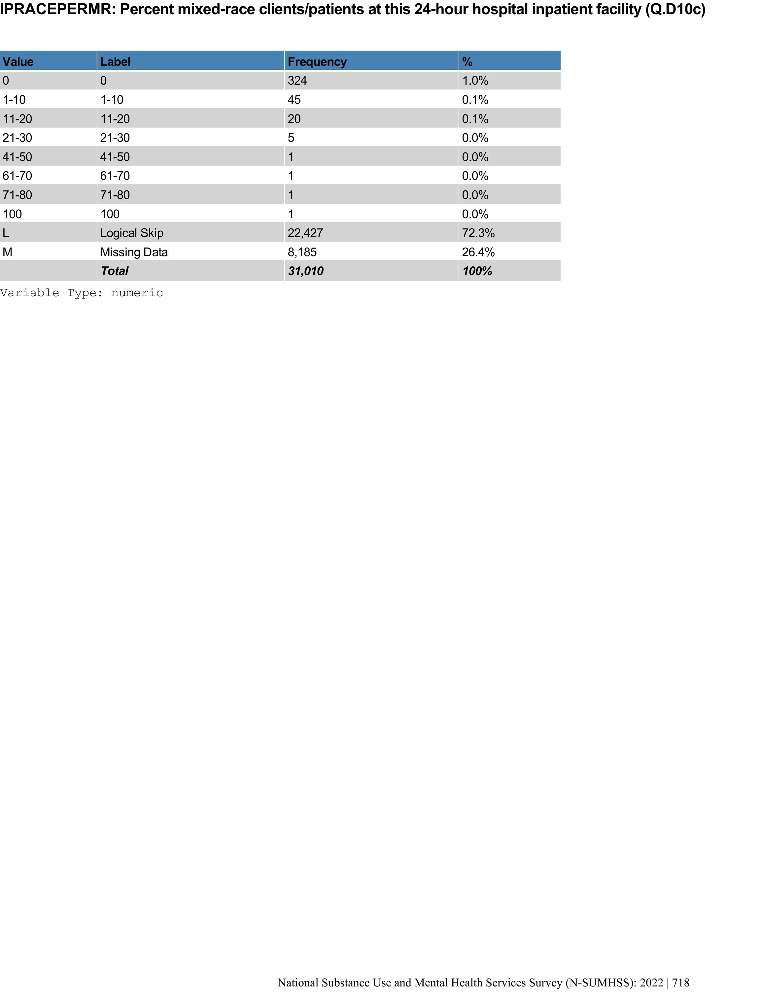

:: Percent mixed-race clients/patients at this 24-hour hospital inpatient facility (Q.D10c)

| Value | Label   | Frequency | %     |
|-------|---------|-----------|-------|
| 0     | 0       | 324       | 1.0%  |
| 1-10  | 1-10    | 45        | 0.1%  |
| 11-20 | 11-20   | 20        | 0.1%  |
| 21-30 | 21-30   | 5         | 0.0%  |
| 41-50 | 41-50   | 1         | 0.0%  |
| 61-70 | 61-70   | 1         | 0.0%  |
| 71-80 | 71-80   | 1         | 0.0%  |
| 100   | 100     | 1         | 0.0%  |
| L     | Logical Skip | 22,427 | 72.3% |
| M     | Missing Data | 8,185  | 26.4% |

**Total**: 31,010  **100%**

Variable Type: numeric

National Substance Use and Mental Health Services Survey (N-SUMHSS): 2022 | 718

**K_O: Total unknown race clients/patients at this 24-hour hospital inpatient facility (Q.D10c)**

| Value  | Label     | Frequency | %      |
|--------|-----------|-----------|--------|
| 0      | 0         | 409       | 1.3%   |
| 1-10   | 1-10      | 180       | 0.6%   |
| 11-20  | 11-20     | 74        | 0.2%   |
| 21-30  | 21-30     | 45        | 0.1%   |
| 31-40  | 31-40     | 21        | 0.1%   |
| 41-50  | 41-50     | 15        | 0.0%   |
| 51-75  | 51-75     | 29        | 0.1%   |
| 76-100 | 76-100    | 12        | 0.0%   |
| 101-250| 101-250   | 10        | 0.0%   |
| 251-500| 251-500   | 2         | 0.0%   |
| 501-1000| 501-1000 | 1         | 0.0%   |
| 1001-1500| 1001-1500| 1       | 0.0%   |
| L      | Logical Skip | 20,768  | 67.0%  |
| M      | Missing Data | 9,443   | 30.5%  |

**Total: 31,010 100%**

**Variable Type: numeric**

*National Substance Use and Mental Health Services Survey (N-SUMHSS): 2022 719*

**K: Total unknown race clients/patients at this 24-hour hospital inpatient facility, unrolled (Q.D10c)**

| Value     | Label        | Frequency | %      |
|-----------|--------------|-----------|--------|
| 0         | 0            | 409       | 1.3%   |
| 1-10      | 1-10         | 182       | 0.6%   |
| 11-20     | 11-20        | 77        | 0.2%   |
| 21-30     | 21-30        | 46        | 0.1%   |
| 31-40     | 31-40        | 24        | 0.1%   |
| 41-50     | 41-50        | 15        | 0.0%   |
| 51-75     | 51-75        | 28        | 0.1%   |
| 76-100    | 76-100       | 12        | 0.0%   |
| 101-250   | 101-250      | 9         | 0.0%   |
| 251-500   | 251-500      | 2         | 0.0%   |
| 501-1000  | 501-1000     | 1         | 0.0%   |
| 1001-1500 | 1001-1500    | 1         | 0.0%   |
| L         | Logical Skip | 18,442    | 59.5%  |
| M         | Missing Data | 11,762    | 37.9%  |
| **Total** |              | **31,010**|**100%**|

Variable Type: numeric

K: Percent unknown race clients/patients at this 24-hour hospital inpatient facility (Q.D10c)

| Value | Label   | Frequency | %      |
|-------|---------|-----------|--------|
| 0     | 0       | 194       | 0.6%   |
| 1-10  | 1-10    | 34        | 0.1%   |
| 11-20 | 11-20   | 16        | 0.1%   |
| 21-30 | 21-30   | 1         | 0.0%   |
| 31-40 | 31-40   | 2         | 0.0%   |
| 41-50 | 41-50   | 2         | 0.0%   |
| 51-60 | 51-60   | 2         | 0.0%   |
| 61-70 | 61-70   | 1         | 0.0%   |
| 81-90 | 81-90   | 1         | 0.0%   |
| 100   | 100     | 145       | 0.5%   |
| L     | Logical Skip | 22,427 | 72.3%  |
| M     | Missing Data  | 8,185  | 26.4%  |

**Total: 31,010 100%**

Variable Type: numeric

### OL_O: Total clients/patients with voluntary legal status at this 24-hour hospital inpatient facility (Q.D10c)

| Value  | Label     | Frequency | %       |
|--------|-----------|-----------|---------|
| 0      | 0         | 192       | 0.6%    |
| 1-10   | 1-10      | 288       | 0.9%    |
| 11-20  | 11-20     | 147       | 0.5%    |
| 21-30  | 21-30     | 48        | 0.2%    |
| 31-40  | 31-40     | 33        | 0.1%    |
| 41-50  | 41-50     | 23        | 0.1%    |
| 51-75  | 51-75     | 39        | 0.1%    |
| 76-100 | 76-100    | 18        | 0.1%    |
| 101-250| 101-250   | 13        | 0.0%    |
| 251-500| 251-500   | 2         | 0.0%    |
| 501-1000|501-1000  | 1         | 0.0%    |
| 1501 + | 1501 +    | 1         | 0.0%    |
| L      | Logical Skip | 20,777 | 67.0%   |
| M      | Missing Data | 9,428   | 30.4%   |
|        | **Total** | **31,010**| **100%**|

Variable Type: numeric

**JL: Total clients/patients with voluntary legal status at this 24-hour hospital inpatient facility, unrolled (Q.D10c)**

| Value | Label         | Frequency | %     |
|-------|---------------|-----------|-------|
| 0     | 0             | 192       | 0.6%  |
| 1-10  | 1-10          | 292       | 0.9%  |
| 11-20 | 11-20         | 146       | 0.5%  |
| 21-30 | 21-30         | 54        | 0.2%  |
| 31-40 | 31-40         | 33        | 0.1%  |
| 41-50 | 41-50         | 25        | 0.1%  |
| 51-75 | 51-75         | 38        | 0.1%  |
| 76-100| 76-100        | 16        | 0.1%  |
| 101-250| 101-250      | 13        | 0.0%  |
| 251-500| 251-500      | 2         | 0.0%  |
| 501-1000| 501-1000    | 1         | 0.0%  |
| 1501 +| 1501 +        | 1         | 0.0%  |
| L     | Logical Skip  | 18,451    | 59.5% |
| M     | Missing Data  | 11,746    | 37.9% |

**Total**: 31,010 **100%**

Variable Type: numeric

---

National Substance Use and Mental Health Services Survey (N-SUMHSS): 2022 | 723

## OL: Percent clients/patients with voluntary legal status at this 24-hour hospital inpatient facility (Q.D10c)

| Value | Label       | Frequency |  %   |
|-------|-------------|-----------|------|
| 0     | 0           | 117       | 0.4  |
| 1-10  | 1-10        | 34        | 0.1  |
| 11-20 | 11-20       | 17        | 0.1  |
| 21-30 | 21-30       | 21        | 0.1  |
| 31-40 | 31-40       | 12        | 0.0  |
| 41-50 | 41-50       | 21        | 0.1  |
| 51-60 | 51-60       | 19        | 0.1  |
| 61-70 | 61-70       | 35        | 0.1  |
| 71-80 | 71-80       | 29        | 0.1  |
| 81-90 | 81-90       | 33        | 0.1  |
| 91-99 | 91-99       | 23        | 0.1  |
| 100   | 100         | 48        | 0.2  |
| L     | Logical Skip| 22,411    | 72.3 |
| M     | Missing Data| 8,190     | 26.4 |

**Total** | 31,010 | **100%**

Variable Type: numeric

---

National Substance Use and Mental Health Services Survey (N-SUMHSS): 2022 | 724

## NFOREN_O: Total clients/patients, involuntary (non-forensic) status at this 24-hour hospital inpatient facility (Q.D10c)

| Value    | Label       | Frequency | %      |
|----------|-------------|-----------|--------|
| 0        | 0           | 303       | 1.0%   |
| 1-10     | 1-10        | 254       | 0.8%   |
| 11-20    | 11-20       | 102       | 0.3%   |
| 21-30    | 21-30       | 50        | 0.2%   |
| 31-40    | 31-40       | 22        | 0.1%   |
| 41-50    | 41-50       | 13        | 0.0%   |
| 51-75    | 51-75       | 23        | 0.1%   |
| 76-100   | 76-100      | 9         | 0.0%   |
| 101-250  | 101-250     | 20        | 0.1%   |
| 251-500  | 251-500     | 6         | 0.0%   |
| 501-1000 | 501-1000    | 2         | 0.0%   |
| 1001-1500| 1001-1500   | 1         | 0.0%   |
| L        | Logical Skip| 20,777    | 67.0%  |
| M        | Missing Data| 9,428     | 30.4%  |

**Total**: 31,010  100%

Variable Type: numeric

### JNFOREN: Total clients/patients, involuntary, unrolled (non-forensic) status at this 24-hour hospital inpatient facility, unrolled (Q.D10c)

| Value    | Label       | Frequency | %      |
|----------|-------------|-----------|--------|
| 0        | 0           | 303       | 1.0%   |
| 1-10     | 1-10        | 256       | 0.8%   |
| 11-20    | 11-20       | 104       | 0.3%   |
| 21-30    | 21-30       | 50        | 0.2%   |
| 31-40    | 31-40       | 22        | 0.1%   |
| 41-50    | 41-50       | 15        | 0.0%   |
| 51-75    | 51-75       | 22        | 0.1%   |
| 76-100   | 76-100      | 8         | 0.0%   |
| 101-250  | 101-250     | 20        | 0.1%   |
| 251-500  | 251-500     | 6         | 0.0%   |
| 501-1000 | 501-1000    | 2         | 0.0%   |
| 1001-1500| 1001-1500   | 1         | 0.0%   |
| L        | Logical Skip| 18,451    | 59.5%  |
| M        | Missing Data| 11,750    | 37.9%  |

**Total**: 31,010 **100%**

Variable Type: numeric

### ONFOREN: Percent clients/patients, involuntary (non-forensic) status at this 24-hour hospital inpatient facility (Q.D10c)

| Value | Label   | Frequency | %      |
|-------|---------|-----------|--------|
| 0     | 0       | 154       | 0.5%   |
| 1-10  | 1-10    | 47        | 0.2%   |
| 11-20 | 11-20   | 25        | 0.1%   |
| 21-30 | 21-30   | 38        | 0.1%   |
| 31-40 | 31-40   | 27        | 0.1%   |
| 41-50 | 41-50   | 24        | 0.1%   |
| 51-60 | 51-60   | 11        | 0.0%   |
| 61-70 | 61-70   | 15        | 0.0%   |
| 71-80 | 71-80   | 13        | 0.0%   |
| 81-90 | 81-90   | 23        | 0.1%   |
| 91-99 | 91-99   | 15        | 0.0%   |
| 100   | 100     | 17        | 0.1%   |
| L     | Logical Skip | 22,411 | 72.3%  |
| M     | Missing Data | 8,190  | 26.4%  |

**Total: 31,010 | 100%**

Variable Type: numeric

## REN_O: Total clients/patients, involuntary (forensic) status at this 24-hour hospital inpatient facility (Q.D10c)

| Value  | Label     | Frequency | %     |
|--------|-----------|-----------|-------|
| 0      | 0         | 705       | 2.3%  |
| 1-10   | 1-10      | 36        | 0.1%  |
| 11-20  | 11-20     | 8         | 0.0%  |
| 21-30  | 21-30     | 7         | 0.0%  |
| 31-40  | 31-40     | 7         | 0.0%  |
| 41-50  | 41-50     | 7         | 0.0%  |
| 51-75  | 51-75     | 7         | 0.0%  |
| 76-100 | 76-100    | 8         | 0.0%  |
| 101-250| 101-250   | 13        | 0.0%  |
| 251-500| 251-500   | 5         | 0.0%  |
| 501-1000| 501-1000 | 2         | 0.0%  |
| L      | Logical Skip | 20,777  | 67.0% |
| M      | Missing Data| 9,428   | 30.4% |

**Total: 31,010**  
**100%**

Variable Type: numeric

## JREN: Total clients/patients, involuntary, unrolled (forensic) status at this 24-hour hospital inpatient facility, unrolled (Q.D10c)

| Value   | Label      | Frequency | %      |
|---------|------------|-----------|--------|
| 0       | 0          | 705       | 2.3%   |
| 1-10    | 1-10       | 36        | 0.1%   |
| 11-20   | 11-20      | 10        | 0.0%   |
| 21-30   | 21-30      | 7         | 0.0%   |
| 31-40   | 31-40      | 6         | 0.0%   |
| 41-50   | 41-50      | 7         | 0.0%   |
| 51-75   | 51-75      | 7         | 0.0%   |
| 76-100  | 76-100     | 8         | 0.0%   |
| 101-250 | 101-250    | 13        | 0.0%   |
| 251-500 | 251-500    | 5         | 0.0%   |
| 501-1000| 501-1000   | 2         | 0.0%   |
| L       | Logical Skip | 18,451   | 59.5%  |
| M       | Missing Data | 11,753   | 37.9%  |
| **Total**|            | **31,010**|**100%**|

Variable Type: numeric

## JREN: Percent clients/patients, involuntary (forensic) status at this 24-hour hospital inpatient facility (Q.D10c)

| Value | Label | Frequency | %     |
|-------|-------|-----------|-------|
| 0     | 0     | 368       | 1.2%  |
| 1-10  | 1-10  | 22        | 0.1%  |
| 11-20 | 11-20 | 3         | 0.0%  |
| 31-40 | 31-40 | 3         | 0.0%  |
| 41-50 | 41-50 | 1         | 0.0%  |
| 51-60 | 51-60 | 4         | 0.0%  |
| 61-70 | 61-70 | 1         | 0.0%  |
| 71-80 | 71-80 | 2         | 0.0%  |
| 81-90 | 81-90 | 2         | 0.0%  |
| 91-99 | 91-99 | 2         | 0.0%  |
| 100   | 100   | 1         | 0.0%  |
| L     | Logical Skip | 22,411 | 72.3% |
| M     | Missing Data | 8,190  | 26.4% |

**Total**: 31,010  **100%**

Variable Type: numeric

## Clients received 24-hour residential mental health services, 3/31/2022 (Q.D11)

| Value | Label         | Frequency | %      |
|-------|---------------|-----------|--------|
| 0     | No            | 6,870     | 22.2%  |
| 1     | Yes           | 1,168     | 3.8%   |
| L     | Logical Skip  | 13,597    | 43.8%  |
| M     | Missing Data  | 9,375     | 30.2%  |
| **Total** | **31,010** | **100%**  |

Variable Type: numeric

## Total number of 24-hour residential clients (Q.D11a)

| Value   | Label        | Frequency | %      |
|---------|--------------|-----------|--------|
| 0       | 0            | 282       | 0.9%   |
| 1-10    | 1-10         | 515       | 1.7%   |
| 11-20   | 11-20        | 265       | 0.9%   |
| 21-30   | 21-30        | 109       | 0.4%   |
| 31-40   | 31-40        | 70        | 0.2%   |
| 41-50   | 41-50        | 58        | 0.2%   |
| 51-75   | 51-75        | 58        | 0.2%   |
| 76-100  | 76-100       | 41        | 0.1%   |
| 101-250 | 101-250      | 31        | 0.1%   |
| 251-500 | 251-500      | 8         | 0.0%   |
| 501-1000| 501-1000     | 1         | 0.0%   |
| L       | Logical Skip | 20,228    | 65.2%  |
| M       | Missing Data | 9,344     | 30.1%  |

**Total**: 31,010  **100%**

Variable Type: numeric

National Substance Use and Mental Health Services Survey (N-SUMHSS): 2022 | 732

## Total number of 24-hour residential clients, unrolled (Q.D11a)

| Value   | Label   | Frequency | %     |
|---------|---------|-----------|-------|
| 0       | 0       | 298       | 1.0%  |
| 1-10    | 1-10    | 548       | 1.8%  |
| 11-20   | 11-20   | 268       | 0.9%  |
| 21-30   | 21-30   | 117       | 0.4%  |
| 31-40   | 31-40   | 70        | 0.2%  |
| 41-50   | 41-50   | 61        | 0.2%  |
| 51-75   | 51-75   | 54        | 0.2%  |
| 76-100  | 76-100  | 37        | 0.1%  |
| 101-250 | 101-250 | 30        | 0.1%  |
| 251-500 | 251-500 | 8         | 0.0%  |
| 501-1000| 501-1000| 1         | 0.0%  |
| L       | Logical Skip | 17,941    | 57.9% |
| M       | Missing Data | 11,577    | 37.3% |

**Total 31,010 100%**

Variable Type: numeric

## Number of residential beds set up/staffed at facility (Q.D11b)

| Value       | Label     | Frequency | %        |
|-------------|-----------|-----------|----------|
| 0           | 0         | 52        | 0.2%     |
| 1-10        | 1-10      | 401       | 1.3%     |
| 11-20       | 11-20     | 300       | 1.0%     |
| 21-30       | 21-30     | 85        | 0.3%     |
| 31-40       | 31-40     | 88        | 0.3%     |
| 41-50       | 41-50     | 61        | 0.2%     |
| 51-75       | 51-75     | 96        | 0.3%     |
| 76-100      | 76-100    | 38        | 0.1%     |
| 101-250     | 101-250   | 37        | 0.1%     |
| 251-500     | 251-500   | 5         | 0.0%     |
| 501-1000    | 501-1000  | 2         | 0.0%     |
| 1001-1500   | 1001-1500 | 1         | 0.0%     |
| L           | Logical Skip | 20,228  | 65.2%    |
| M           | Missing Data | 9,616   | 31.0%    |
| **Total**   |           | **31,010** | **100%** |

Variable Type: numeric

National Substance Use and Mental Health Services Survey (N-SUMHSS): 2022

#### Number of residential beds set up/staffed at facility, unrolled (Q.D11b)

| Value    | Label       | Frequency | %      |
|----------|-------------|-----------|--------|
| 0        | 0           | 64        | 0.2%   |
| 1-10     | 1-10        | 441       | 1.4%   |
| 11-20    | 11-20       | 305       | 1.0%   |
| 21-30    | 21-30       | 88        | 0.3%   |
| 31-40    | 31-40       | 91        | 0.3%   |
| 41-50    | 41-50       | 60        | 0.2%   |
| 51-75    | 51-75       | 93        | 0.3%   |
| 76-100   | 76-100      | 36        | 0.1%   |
| 101-250  | 101-250     | 36        | 0.1%   |
| 251-500  | 251-500     | 5         | 0.0%   |
| 501-1000 | 501-1000    | 2         | 0.0%   |
| 1001-1500| 1001-1500   | 1         | 0.0%   |
| L        | Logical Skip| 17,941    | 57.9%  |
| M        | Missing Data| 11,847    | 38.2%  |

Total

31,010

100%

Variable Type: numeric

National Substance Use and Mental Health Services Survey (N-SUMHSS): 2022

# Total male clients/patients at this 24-hour residential facility (Q.D11c)

| Value | Label   | Frequency | %     |
|-------|---------|-----------|-------|
| 0     | 0       | 368       | 1.2%  |
| 1-10  | 1-10    | 417       | 1.3%  |
| 11-20 | 11-20   | 123       | 0.4%  |
| 21-30 | 21-30   | 63        | 0.2%  |
| 31-40 | 31-40   | 29        | 0.1%  |
| 41-50 | 41-50   | 22        | 0.1%  |
| 51-75 | 51-75   | 17        | 0.1%  |
| 76-100| 76-100  | 6         | 0.0%  |
| 101-250| 101-250| 10        | 0.0%  |
| 251-500| 251-500| 2         | 0.0%  |
| L     | Logical Skip     | 20,568    | 66.3% |
| M     | Missing Data     | 9,385     | 30.3% |

**Total** | | 31,010 | 100%

Variable Type: numeric

#### Total male clients/patients at this 24-hour residential facility, unrolled (Q.D11c)

| Value  | Label   | Frequency | %      |
|--------|---------|-----------|--------|
| 0      | 0       | 375       | 1.2%   |
| 1-10   | 1-10    | 444       | 1.4%   |
| 11-20  | 11-20   | 132       | 0.4%   |
| 21-30  | 21-30   | 61        | 0.2%   |
| 31-40  | 31-40   | 30        | 0.1%   |
| 41-50  | 41-50   | 19        | 0.1%   |
| 51-75  | 51-75   | 16        | 0.1%   |
| 76-100 | 76-100  | 6         | 0.0%   |
| 101-250| 101-250 | 10        | 0.0%   |
| 251-500| 251-500 | 2         | 0.0%   |
| L      | Logical Skip   | 18,277    | 58.9%  |
| M      | Missing Data   | 11,638    | 37.5%  |
| **Total** |           | **31,010**  | **100%** |

Variable Type: numeric

*National Substance Use and Mental Health Services Survey (N-SUMHSS): 2022 | 737*

## Percent male clients/patients at this 24-hour residential facility (Q.D11c)

| Value | Label  | Frequency | %     |
|-------|--------|-----------|-------|
| 0     | 0      | 313       | 1.0%  |
| 1-10  | 1-10   | 2         | 0.0%  |
| 11-20 | 11-20  | 21        | 0.1%  |
| 21-30 | 21-30  | 16        | 0.1%  |
| 31-40 | 31-40  | 22        | 0.1%  |
| 41-50 | 41-50  | 65        | 0.2%  |
| 51-60 | 51-60  | 47        | 0.2%  |
| 61-70 | 61-70  | 51        | 0.2%  |
| 71-80 | 71-80  | 24        | 0.1%  |
| 81-90 | 81-90  | 19        | 0.1%  |
| 91-99 | 91-99  | 6         | 0.0%  |
| 100   | 100    | 47        | 0.2%  |
| L     | Logical Skip | 22,212    | 71.6% |
| M     | Missing Data | 8,165     | 26.3% |
|       | **Total**    | **31,010**| **100%** |

Variable Type: numeric

---

National Substance Use and Mental Health Services Survey (N-SUMHSS): 2022 | 738

## Total female clients/patients at this 24-hour residential facility (Q.D11c)

| Value | Label         | Frequency | %      |
|-------|---------------|-----------|--------|
| 0     | 0             | 400       | 1.3%   |
| 1-10  | 1-10          | 456       | 1.5%   |
| 11-20 | 11-20         | 98        | 0.3%   |
| 21-30 | 21-30         | 50        | 0.2%   |
| 31-40 | 31-40         | 20        | 0.1%   |
| 41-50 | 41-50         | 16        | 0.1%   |
| 51-75 | 51-75         | 8         | 0.0%   |
| 76-100| 76-100        | 4         | 0.0%   |
| 101-250| 101-250      | 5         | 0.0%   |
| L     | Logical Skip  | 20,568    | 66.3%  |
| M     | Missing Data  | 9,385     | 30.3%  |
|       | Total         | 31,010    | 100%   |

Variable Type: numeric

**Total female clients/patients at this 24-hour residential facility, unrolled (Q.D11c)**

| Value   | Label       | Frequency | %    |
|---------|-------------|-----------|------|
| 0       | 0           | 407       | 1.3% |
| 1-10    | 1-10        | 486       | 1.6% |
| 11-20   | 11-20       | 107       | 0.3% |
| 21-30   | 21-30       | 46        | 0.1% |
| 31-40   | 31-40       | 18        | 0.1% |
| 41-50   | 41-50       | 18        | 0.1% |
| 51-75   | 51-75       | 7         | 0.0% |
| 76-100  | 76-100      | 3         | 0.0% |
| 101-250 | 101-250     | 5         | 0.0% |
| L       | Logical Skip | 18,277    | 58.9%|
| M       | Missing Data | 11,636    | 37.5%|

**Total**: 31,010 **100%**

Variable Type: numeric

## Percent female clients/patients at this 24-hour residential facility (Q.D11c)

| Value | Label  | Frequency | %       |
|-------|--------|-----------|---------|
| 0     | 0      | 323       | 1.0%    |
| 1-10  | 1-10   | 15        | 0.0%    |
| 11-20 | 11-20  | 21        | 0.1%    |
| 21-30 | 21-30  | 34        | 0.1%    |
| 31-40 | 31-40  | 55        | 0.2%    |
| 41-50 | 41-50  | 74        | 0.2%    |
| 51-60 | 51-60  | 27        | 0.1%    |
| 61-70 | 61-70  | 18        | 0.1%    |
| 71-80 | 71-80  | 26        | 0.1%    |
| 81-90 | 81-90  | 2         | 0.0%    |
| 91-99 | 91-99  | 1         | 0.0%    |
| 100   | 100    | 37        | 0.1%    |
| L     | Logical Skip | 22,212    | 71.6%    |
| M     | Missing Data | 8,165     | 26.3%    |
|       | Total         | 31,010    | 100%     |

Variable Type: numeric

_O: Total clients/patients 0-17 years at this 24-hour residential facility (Q.D11c)_

| Value  | Label   | Frequency | %      |
|--------|---------|-----------|--------|
| 0      | 0       | 731       | 2.4%   |
| 1-10   | 1-10    | 134       | 0.4%   |
| 11-20  | 11-20   | 61        | 0.2%   |
| 21-30  | 21-30   | 53        | 0.2%   |
| 31-40  | 31-40   | 30        | 0.1%   |
| 41-50  | 41-50   | 19        | 0.1%   |
| 51-75  | 51-75   | 26        | 0.1%   |
| 76-100 | 76-100  | 12        | 0.0%   |
| 101-250| 101-250 | 4         | 0.0%   |
| 251-500| 251-500 | 1         | 0.0%   |
| L      | Logical Skip | 20,566   | 66.3%  |
| M      | Missing Data  | 9,373   | 30.2%  |

_Total_ | 31,010 | 100%

Variable Type: numeric

---

National Substance Use and Mental Health Services Survey (N-SUMHSS): 2022 | 742

### Total clients/patients 0-17 years at this 24-hour residential facility, unrolled (Q.D11c)

| Value | Label     | Frequency | %      |
|-------|-----------|-----------|--------|
| 0     | 0         | 730       | 2.4%   |
| 1-10  | 1-10      | 135       | 0.4%   |
| 11-20 | 11-20     | 67        | 0.2%   |
| 21-30 | 21-30     | 50        | 0.2%   |
| 31-40 | 31-40     | 31        | 0.1%   |
| 41-50 | 41-50     | 21        | 0.1%   |
| 51-75 | 51-75     | 26        | 0.1%   |
| 76-100| 76-100    | 11        | 0.0%   |
| 101-250| 101-250 | 4         | 0.0%   |
| 251-500| 251-500 | 1         | 0.0%   |
| L     | Logical Skip | 18,275  | 58.9%  |
| M     | Missing Data | 11,659  | 37.6%  |

**Total** | | 31,010 | 100%

Variable Type: numeric

`: Percent clients/patients 0-17 years at this 24-hour residential facility (Q.D11c)`

| Value | Label   | Frequency | %      |
|-------|---------|-----------|--------|
| 0     | 0       | 492       | 1.6%   |
| 1-10  | 1-10    | 1         | 0.0%   |
| 11-20 | 11-20   | 4         | 0.0%   |
| 21-30 | 21-30   | 4         | 0.0%   |
| 31-40 | 31-40   | 3         | 0.0%   |
| 41-50 | 41-50   | 2         | 0.0%   |
| 51-60 | 51-60   | 2         | 0.0%   |
| 61-70 | 61-70   | 1         | 0.0%   |
| 71-80 | 71-80   | 3         | 0.0%   |
| 81-90 | 81-90   | 3         | 0.0%   |
| 91-99 | 91-99   | 13        | 0.0%   |
| 100   | 100     | 92        | 0.3%   |
| L     | Logical Skip | 22,221    | 71.7%  |
| M     | Missing Data  | 8,169     | 26.3%  |

**Total:** 31,010 | 100%

Variable Type: numeric

National Substance Use and Mental Health Services Survey (N-SUMHSS): 2022 | 744

#### 4_O: Total clients/patients 18-64 years at this 24-hour residential facility (Q.D11c)

| Value  | Label    | Frequency | %       |
|--------|----------|-----------|---------|
| 0      | 0        | 529       | 1.7%    |
| 1-10   | 1-10     | 317       | 1.0%    |
| 11-20  | 11-20    | 129       | 0.4%    |
| 21-30  | 21-30    | 25        | 0.1%    |
| 31-40  | 31-40    | 25        | 0.1%    |
| 41-50  | 41-50    | 15        | 0.0%    |
| 51-75  | 51-75    | 12        | 0.0%    |
| 76-100 | 76-100   | 6         | 0.0%    |
| 101-250| 101-250  | 8         | 0.0%    |
| 251-500| 251-500  | 5         | 0.0%    |
| L      | Logical Skip | 20,566 | 66.3%   |
| M      | Missing Data | 9,373  | 30.2%   |

**Total** | | 31,010 | **100%**

Variable Type: numeric

#### 4: Total clients/patients 18-64 years at this 24-hour residential facility, unrolled (Q.D11c)

| Value  | Label    | Frequency |      %      |
|--------|----------|-----------|-------------|
| 0      | 0        | 533       | 1.7%        |
| 1-10   | 1-10     | 349       | 1.1%        |
| 11-20  | 11-20    | 129       | 0.4%        |
| 21-30  | 21-30    | 31        | 0.1%        |
| 31-40  | 31-40    | 20        | 0.1%        |
| 41-50  | 41-50    | 16        | 0.1%        |
| 51-75  | 51-75    | 11        | 0.0%        |
| 76-100 | 76-100   | 4         | 0.0%        |
| 101-250| 101-250  | 8         | 0.0%        |
| 251-500| 251-500  | 5         | 0.0%        |
| L      | Logical Skip | 18,275  | 58.9%       |
| M      | Missing Data | 11,629  | 37.5%       |

| **Total** |         | **31,010** | **100%**     |

Variable Type: numeric

#### 4: Percent clients/patients 18-64 years at this 24-hour residential facility (Q.D11c)

| Value | Label    | Frequency |   %   |
|-------|----------|-----------|-------|
| 0     | 0        | 377       | 1.2%  |
| 1-10  | 1-10     | 6         | 0.0%  |
| 11-20 | 11-20    | 2         | 0.0%  |
| 21-30 | 21-30    | 4         | 0.0%  |
| 31-40 | 31-40    | 1         | 0.0%  |
| 41-50 | 41-50    | 5         | 0.0%  |
| 51-60 | 51-60    | 6         | 0.0%  |
| 61-70 | 61-70    | 14        | 0.0%  |
| 71-80 | 71-80    | 30        | 0.1%  |
| 81-90 | 81-90    | 44        | 0.1%  |
| 91-99 | 91-99    | 34        | 0.1%  |
| 100   | 100      | 98        | 0.3%  |
| L     | Logical Skip | 22,220 | 71.7% |
| M     | Missing Data | 8,169  | 26.3% |

**Total**             31,010      100%

Variable Type: numeric

_O: Total clients/patients 65 plus years at this 24-hour residential facility (Q.D11c)_

| Value | Label      | Frequency | %     |
|-------|------------|-----------|-------|
| 0     | 0          | 873       | 2.8%  |
| 1-10  | 1-10       | 173       | 0.6%  |
| 11-20 | 11-20      | 15        | 0.0%  |
| 21-30 | 21-30      | 2         | 0.0%  |
| 31-40 | 31-40      | 1         | 0.0%  |
| 41-50 | 41-50      | 4         | 0.0%  |
| 51-75 | 51-75      | 1         | 0.0%  |
| 76-100| 76-100     | 1         | 0.0%  |
| 251-500| 251-500   | 1         | 0.0%  |
| L     | Logical Skip| 20,566   | 66.3% |
| M     | Missing Data| 9,373    | 30.2% |

**Total** | | 31,010 | 100%

Variable Type: numeric

---

National Substance Use and Mental Health Services Survey (N-SUMHSS): 2022 | 748

# Total clients/patients 65 plus years at this 24-hour residential facility, unrolled (Q.D11c)
| Value   | Label       | Frequency | %        |
|---------|-------------|-----------|----------|
| 0       | 0           | 877       | 2.8%     |
| 1-10    | 1-10        | 190       | 0.6%     |
| 11-20   | 11-20       | 13        | 0.0%     |
| 21-30   | 21-30       | 2         | 0.0%     |
| 31-40   | 31-40       | 1         | 0.0%     |
| 41-50   | 41-50       | 4         | 0.0%     |
| 51-75   | 51-75       | 1         | 0.0%     |
| 76-100  | 76-100      | 1         | 0.0%     |
| 251-500 | 251-500     | 1         | 0.0%     |
| L       | Logical Skip| 18,275    | 58.9%    |
| M       | Missing Data| 11,645    | 37.6%    |
| Total   |             | 31,010    | 100%     |

Variable Type: numeric

National Substance Use and Mental Health Services Survey (N-SUMHSS): 2022

Percent clients/patients 65 plus years at this 24-hour residential facility (Q.D11c)

| Value | Label     | Frequency | %     |
|-------|-----------|-----------|-------|
| 0     | 0         | 496       | 1.6%  |
| 1-10  | 1-10      | 62        | 0.2%  |
| 11-20 | 11-20     | 36        | 0.1%  |
| 21-30 | 21-30     | 12        | 0.0%  |
| 31-40 | 31-40     | 10        | 0.0%  |
| 41-50 | 41-50     | 3         | 0.0%  |
| 61-70 | 61-70     | 1         | 0.0%  |
| 100   | 100       | 1         | 0.0%  |
| L     | Logical Skip | 22,220  | 71.7% |
| M     | Missing Data | 8,169   | 26.3% |
| Total |           | 31,010    | 100%  |

Variable Type: numeric

National Substance Use and Mental Health Services Survey (N-SUMHSS): 2022 | 750

P_O: Total Hispanic clients/patients at this 24-hour residential facility (Q.D11c)

| Value | Label       | Frequency | %     |
|-------|-------------|-----------|-------|
| 0     | 0           | 718       | 2.3%  |
| 1-10  | 1-10        | 282       | 0.9%  |
| 11-20 | 11-20       | 22        | 0.1%  |
| 21-30 | 21-30       | 9         | 0.0%  |
| 31-40 | 31-40       | 5         | 0.0%  |
| 41-50 | 41-50       | 1         | 0.0%  |
| 51-75 | 51-75       | 1         | 0.0%  |
| L     | Logical Skip| 20,555    | 66.3% |
| M     | Missing Data| 9,417     | 30.4% |

**Total** | **31,010** | **100%**

Variable Type: numeric

# P: Total Hispanic clients/patients at this 24-hour residential facility, unrolled (Q.D11c)

| Value | Label   | Frequency | %      |
|-------|---------|-----------|--------|
| 0     | 0       | 721       | 2.3%   |
| 1-10  | 1-10    | 303       | 1.0%   |
| 11-20 | 11-20   | 21        | 0.1%   |
| 21-30 | 21-30   | 8         | 0.0%   |
| 31-40 | 31-40   | 5         | 0.0%   |
| 41-50 | 41-50   | 1         | 0.0%   |
| 51-75 | 51-75   | 1         | 0.0%   |
| L     | Logical Skip | 18,264 | 58.9%  |
| M     | Missing Data | 11,686 | 37.7%  |

**Total** | **31,010** | **100%**

**Variable Type**: numeric

National Substance Use and Mental Health Services Survey (N-SUMHSS): 2022 | 752

# P: Percent Hispanic clients/patients at this 24-hour residential facility (Q.D11c)

| Value | Label      | Frequency | %       |
|-------|------------|-----------|---------|
| 0     | 0          | 469       | 1.5%    |
| 1-10  | 1-10       | 80        | 0.3%    |
| 11-20 | 11-20      | 27        | 0.1%    |
| 21-30 | 21-30      | 22        | 0.1%    |
| 31-40 | 31-40      | 5         | 0.0%    |
| 41-50 | 41-50      | 5         | 0.0%    |
| 51-60 | 51-60      | 7         | 0.0%    |
| 71-80 | 71-80      | 3         | 0.0%    |
| L     | Logical Skip | 22,224 | 71.7% |
| M     | Missing Data | 8,168  | 26.3%   |
|       | **Total**    | **31,010** | **100%**   |

*Variable Type: numeric*

*National Substance Use and Mental Health Services Survey (N-SUMHSS): 2022 | 753*

# \HISP_O: Total non-Hispanic clients/patients at this 24-hour residential facility (Q.D11c)

| Value | Label     | Frequency | %      |
|-------|-----------|-----------|--------|
| 0     | 0         | 457       | 1.5%   |
| 1-10  | 1-10      | 299       | 1.0%   |
| 11-20 | 11-20     | 135       | 0.4%   |
| 21-30 | 21-30     | 56        | 0.2%   |
| 31-40 | 31-40     | 27        | 0.1%   |
| 41-50 | 41-50     | 21        | 0.1%   |
| 51-75 | 51-75     | 24        | 0.1%   |
| 76-100| 76-100    | 8         | 0.0%   |
| 101-250| 101-250  | 6         | 0.0%   |
| 251-500| 251-500  | 4         | 0.0%   |
| L     | Logical Skip | 20,555 | 66.3%  |
| M     | Missing Data | 9,418  | 30.4%  |

**Total**: 31,010  100%

Variable Type: numeric

**HISP: Total non-Hispanic clients/patients at this 24-hour residential facility, unrolled (Q.D11c)**

| Value   | Label      | Frequency | %     |
|---------|------------|-----------|-------|
| 0       | 0          | 467       | 1.5%  |
| 1-10    | 1-10       | 315       | 1.0%  |
| 11-20   | 11-20      | 139       | 0.4%  |
| 21-30   | 21-30      | 62        | 0.2%  |
| 31-40   | 31-40      | 27        | 0.1%  |
| 41-50   | 41-50      | 20        | 0.1%  |
| 51-75   | 51-75      | 21        | 0.1%  |
| 76-100  | 76-100     | 7         | 0.0%  |
| 101-250 | 101-250    | 6         | 0.0%  |
| 251-500 | 251-500    | 4         | 0.0%  |
| L       | Logical Skip | 18,264   | 58.9% |
| M       | Missing Data | 11,678   | 37.7% |

**Total** | 31,010 | 100%

Variable Type: numeric

\HISP: Percent non-Hispanic clients/patients at this 24-hour residential facility (Q.D11c)

| Value | Label  | Frequency  | %    |
|-------|--------|------------|------|
| 0     | 0      | 414        | 1.3% |
| 1-10  | 1-10   | 1          | 0.0% |
| 11-20 | 11-20  | 3          | 0.0% |
| 21-30 | 21-30  | 7          | 0.0% |
| 31-40 | 31-40  | 8          | 0.0% |
| 41-50 | 41-50  | 7          | 0.0% |
| 51-60 | 51-60  | 6          | 0.0% |
| 61-70 | 61-70  | 16         | 0.1% |
| 71-80 | 71-80  | 30         | 0.1% |
| 81-90 | 81-90  | 32         | 0.1% |
| 91-99 | 91-99  | 46         | 0.1% |
| 100   | 100    | 48         | 0.2% |
| L     | Logical Skip | 22,244  | 71.7% |
| M     | Missing Data  | 8,168   | 26.3% |

**Total** | 31,010 | **100%**

Variable Type: numeric

National Substance Use and Mental Health Services Survey (N-SUMHSS): 2022 | 756

# O: Total unknown ethnicity clients/patients at this 24-hour residential facility (Q.D11c)

| Value | Label    | Frequency | %      |
|-------|----------|-----------|--------|
| 0     | 0        | 805       | 2.6%   |
| 1-10  | 1-10     | 124       | 0.4%   |
| 11-20 | 11-20    | 40        | 0.1%   |
| 21-30 | 21-30    | 20        | 0.1%   |
| 31-40 | 31-40    | 14        | 0.0%   |
| 41-50 | 41-50    | 6         | 0.0%   |
| 51-75 | 51-75    | 13        | 0.0%   |
| 76-100| 76-100   | 7         | 0.0%   |
| 101-250| 101-250 | 5         | 0.0%   |
| 251-500| 251-500 | 3         | 0.0%   |
| L     | Logical Skip | 20,555 | 66.3%  |
| M     | Missing Data | 9,418  | 30.4%  |
|       | Total    | 31,010    | 100%   |

Variable Type: numeric

## Total unknown ethnicity clients/patients at this 24-hour residential facility, unrolled (Q.D11c)

| Value  | Label   | Frequency | %     |
|--------|---------|-----------|-------|
| 0      | 0       | 803       | 2.6%  |
| 1-10   | 1-10    | 137       | 0.4%  |
| 11-20  | 11-20   | 39        | 0.1%  |
| 21-30  | 21-30   | 21        | 0.1%  |
| 31-40  | 31-40   | 14        | 0.0%  |
| 41-50  | 41-50   | 8         | 0.0%  |
| 51-75  | 51-75   | 12        | 0.0%  |
| 76-100 | 76-100  | 6         | 0.0%  |
| 101-250| 101-250 | 5         | 0.0%  |
| 251-500| 251-500 | 3         | 0.0%  |
| L      | Logical Skip | 18,264    | 58.9% |
| M      | Missing Data  | 11,698    | 37.7% |
| Total  | Total   | 31,010    | 100%  |

Variable Type: numeric

# <: Percent unknown ethnicity clients/patients at this 24-hour residential facility (Q.D11c)

| Value | Label  | Frequency | %      |
|-------|--------|-----------|--------|
| 0     | 0      | 427       | 1.4%   |
| 1-10  | 1-10   | 29        | 0.1%   |
| 11-20 | 11-20  | 8         | 0.0%   |
| 21-30 | 21-30  | 1         | 0.0%   |
| 31-40 | 31-40  | 2         | 0.0%   |
| 41-50 | 41-50  | 2         | 0.0%   |
| 51-60 | 51-60  | 3         | 0.0%   |
| 61-70 | 61-70  | 3         | 0.0%   |
| 71-80 | 71-80  | 5         | 0.0%   |
| 81-90 | 81-90  | 3         | 0.0%   |
| 100   | 100    | 135       | 0.4%   |
| L     | Logical Skip | 22,224 | 71.7%  |
| M     | Missing Data | 8,168  | 26.3%  |

**Total: 31,010  100%**

**Variable Type: numeric**

*National Substance Use and Mental Health Services Survey (N-SUMHSS): 2022 | 759*

### DIAN_O: Total American Indian/Alaska Native clients/patients at this 24-hour residential facility (Q.D11c)

| Value | Label      | Frequency | %     |
|-------|------------|-----------|-------|
| 0     | 0          | 938       | 3.0%  |
| 1-10  | 1-10       | 102       | 0.3%  |
| 11-20 | 11-20      | 5         | 0.0%  |
| 21-30 | 21-30      | 1         | 0.0%  |
| L     | Logical Skip | 20,556    | 66.3% |
| M     | Missing Data | 9,408      | 30.3% |

**Total** 31,010 100%

Variable Type: numeric

---

National Substance Use and Mental Health Services Survey (N-SUMHSS): 2022

DIAN: Total American Indian/Alaska Native clients/patients at this 24-hour residential facility, unrolled (Q.D11c)

| Value | Label        | Frequency | %      |
|-------|--------------|-----------|--------|
| 0     | 0            | 939       | 3.0%   |
| 1-10  | 1-10         | 104       | 0.3%   |
| 11-20 | 11-20        | 5         | 0.0%   |
| 21-30 | 21-30        | 1         | 0.0%   |
| L     | Logical Skip | 18,265    | 58.9%  |
| M     | Missing Data | 11,696    | 37.7%  |
| Total |              | 31,010    | 100%   |

Variable Type: numeric

National Substance Use and Mental Health Services Survey (N-SUMHSS): 2022 | 761

# DIAN: Percent American Indian/Alaska Native clients/patients at this 24-hour residential facility (Q.D11c)

| Value | Label   | Frequency | %     |
|-------|---------|-----------|-------|
| 0     | 0       | 543       | 1.8%  |
| 1-10  | 1-10    | 53        | 0.2%  |
| 11-20 | 11-20   | 8         | 0.0%  |
| 21-30 | 21-30   | 7         | 0.0%  |
| 31-40 | 31-40   | 3         | 0.0%  |
| 71-80 | 71-80   | 3         | 0.0%  |
| 100   | 100     | 1         | 0.0%  |
| L     | Logical Skip | 22,228 | 71.7% |
| M     | Missing Data | 8,164  | 26.3% |

**Total**: 31,010     **100%**

*Variable Type: numeric*

*National Substance Use and Mental Health Services Survey (N-SUMHSS): 2022*

### _SIAN_O: Total Asian clients/patients at this 24-hour residential facility (Q.D11c)

| Value | Label             | Frequency |      %      |
|-------|-------------------|-----------|-------------|
| 0     | 0                 | 934       | 3.0%        |
| 1-10  | 1-10              | 104       | 0.3%        |
| 11-20 | 11-20             | 7         | 0.0%        |
| L     | Logical Skip      | 20,556    | 66.3%       |
| M     | Missing Data      | 9,409     | 30.3%       |

**Total**      _31,010_       **100%**

*Variable Type: numeric*

## ASIAN: Total Asian clients/patients at this 24-hour residential facility, unrolled (Q.D11c)

| Value | Label        | Frequency | %     |
|-------|--------------|-----------|-------|
| 0     | 0            | 938       | 3.0%  |
| 1-10  | 1-10         | 106       | 0.3%  |
| 11-20 | 11-20        | 7         | 0.0%  |
| L     | Logical Skip | 18,265    | 58.9% |
| M     | Missing Data | 11,694    | 37.7% |

**Total** | | 31,010 | **100%**

Variable Type: numeric

### SIAN: Percent Asian clients/patients at this 24-hour residential facility (Q.D11c)

| Value | Label        | Frequency | %     |
|-------|--------------|-----------|-------|
| 0     | 0            | 544       | 1.8%  |
| 1-10  | 1-10         | 69        | 0.2%  |
| 11-20 | 11-20        | 4         | 0.0%  |
| 21-30 | 21-30        | 1         | 0.0%  |
| L     | Logical Skip | 22,228    | 71.7% |
| M     | Missing Data | 8,164     | 26.3% |
|       | **Total**    | **31,010**| **100%**|

Variable Type: numeric

---

National Substance Use and Mental Health Services Survey (N-SUMHSS): 2022

**K_O: Total Black clients/patients at this 24-hour residential facility (Q.D11c)**

| Value | Label       | Frequency | %     |
|-------|-------------|-----------|-------|
| 0     | 0           | 587       | 1.9%  |
| 1-10  | 1-10        | 395       | 1.3%  |
| 11-20 | 11-20       | 35        | 0.1%  |
| 21-30 | 21-30       | 12        | 0.0%  |
| 31-40 | 31-40       | 5         | 0.0%  |
| 41-50 | 41-50       | 2         | 0.0%  |
| 51-75 | 51-75       | 5         | 0.0%  |
| 76-100| 76-100      | 3         | 0.0%  |
| 101-250| 101-250    | 3         | 0.0%  |
| L     | Logical Skip| 20,556    | 66.3% |
| M     | Missing Data| 9,407     | 30.3% |

**Total** 31,010 100%

Variable Type: numeric

**_K: Total Black clients/patients at this 24-hour residential facility, unrolled (Q.D11c)_**

| Value  | Label        | Frequency | %    |
|--------|--------------|-----------|------|
| 0      | 0            | 593       | 1.9% |
| 1-10   | 1-10         | 404       | 1.3% |
| 11-20  | 11-20        | 38        | 0.1% |
| 21-30  | 21-30        | 11        | 0.0% |
| 31-40  | 31-40        | 5         | 0.0% |
| 41-50  | 41-50        | 2         | 0.0% |
| 51-75  | 51-75        | 5         | 0.0% |
| 76-100 | 76-100       | 3         | 0.0% |
| 101-250| 101-250      | 3         | 0.0% |
| L      | Logical Skip | 18,265    | 58.9%|
| M      | Missing Data | 11,681    | 37.7%|

**Total**: 31,010  **100%**

Variable Type: numeric

**LK: Percent Black clients/patients at this 24-hour residential facility (Q.D11c)**

| Value  | Label     | Frequency | %      |
|--------|-----------|-----------|--------|
| 0      | 0         | 451       | 1.5%   |
| 1-10   | 1-10      | 60        | 0.2%   |
| 11-20  | 11-20     | 39        | 0.1%   |
| 21-30  | 21-30     | 22        | 0.1%   |
| 31-40  | 31-40     | 20        | 0.1%   |
| 41-50  | 41-50     | 10        | 0.0%   |
| 51-60  | 51-60     | 5         | 0.0%   |
| 61-70  | 61-70     | 7         | 0.0%   |
| 71-80  | 71-80     | 3         | 0.0%   |
| 81-90  | 81-90     | 1         | 0.0%   |
| L      | Logical Skip | 22,228  | 71.7%  |
| M      | Missing Data | 8,164   | 26.3%  |
|        | **Total** | 31,010    | **100%**|

Variable Type: numeric

---

National Substance Use and Mental Health Services Survey (N-SUMHSS): 2022 | 768

## AWPAC_O: Total Native Hawaiian/Other Pacific Islander clients/patients at this 24-hour residential facility (Q.D11c)

| Value | Label        | Frequency | %      |
|-------|--------------|-----------|--------|
| 0     | 0            | 1,004     | 3.2%   |
| 1-10  | 1-10         | 38        | 0.1%   |
| 11-20 | 11-20        | 1         | 0.0%   |
| 21-30 | 21-30        | 1         | 0.0%   |
| 31-40 | 31-40        | 1         | 0.0%   |
| L     | Logical Skip | 20,556    | 66.3%  |
| M     | Missing Data | 9,409     | 30.3%  |

**Total** | **31,010** | **100%**

Variable Type: numeric

National Substance Use and Mental Health Services Survey (N-SUMHSS): 2022

### AWPAC: Total Native Hawaiian/Other Pacific Islander clients/patients at this 24-hour residential facility, unrolled (Q.D11c) 

| Value | Label       | Frequency | %      |
|-------|-------------|-----------|--------|
| 0     | 0           | 1,003     | 3.2%   |
| 1-10  | 1-10        | 41        | 0.1%   |
| 11-20 | 11-20       | 1         | 0.0%   |
| 21-30 | 21-30       | 1         | 0.0%   |
| 31-40 | 31-40       | 1         | 0.0%   |
| L     | Logical Skip| 18,265    | 58.9%  |
| M     | Missing Data| 11,698    | 37.7%  |
| **Total** |           | **31,010**| **100%**|

Variable Type: numeric

---

National Substance Use and Mental Health Services Survey (N-SUMHSS): 2022 | 770

### AWPAC: Percent Native Hawaiian/Other Pacific Islander clients/patients at this 24-hour residential facility (Q.D11c)

| Value | Label          | Frequency | %      |
|-------|----------------|-----------|--------|
| 0     | 0              | 590       | 1.9%   |
| 1-10  | 1-10           | 28        | 0.1%   |
| L     | Logical Skip   | 22,228    | 71.7%  |
| M     | Missing Data   | 8,164     | 26.3%  |

**Total:** 31,010 (100%)

Variable Type: numeric

### HIT_O: Total White clients/patients at this 24-hour residential facility (Q.D11c)

| Value  | Label       | Frequency | %       |
|--------|-------------|-----------|---------|
| 0      | 0           | 433       | 1.4%    |
| 1-10   | 1-10        | 404       | 1.3%    |
| 11-20  | 11-20       | 107       | 0.3%    |
| 21-30  | 21-30       | 47        | 0.2%    |
| 31-40  | 31-40       | 19        | 0.1%    |
| 41-50  | 41-50       | 14        | 0.0%    |
| 51-75  | 51-75       | 18        | 0.1%    |
| 101-250| 101-250     | 7         | 0.0%    |
| L      | Logical Skip| 20,556    | 66.3%   |
| M      | Missing Data| 9,405     | 30.3%   |
| Total  |             | 31,010    | 100%    |

Variable Type: numeric

---

National Substance Use and Mental Health Services Survey (N-SUMHSS): 2022 | 772

### HIT: Total White clients/patients at this 24-hour residential facility, unrolled (Q.D11c)

| Value  | Label        | Frequency | %     |
|--------|--------------|-----------|-------|
| 0      | 0            | 439       | 1.4%  |
| 1-10   | 1-10         | 423       | 1.4%  |
| 11-20  | 11-20        | 115       | 0.4%  |
| 21-30  | 21-30        | 42        | 0.1%  |
| 31-40  | 31-40        | 21        | 0.1%  |
| 41-50  | 41-50        | 14        | 0.0%  |
| 51-75  | 51-75        | 16        | 0.1%  |
| 101-250| 101-250      | 7         | 0.0%  |
| L      | Logical Skip | 18,265    | 58.9% |
| M      | Missing Data | 11,668    | 37.6% |
|        | **Total**    | **31,010**| **100%**|

Variable Type: numeric

National Substance Use and Mental Health Services Survey (N-SUMHSS): 2022 | 773

### HIT: Percent White clients/patients at this 24-hour residential facility (Q.D11c)

| Value | Label  | Frequency | %     |
|-------|--------|-----------|-------|
| 0     | 0      | 411       | 1.3%  |
| 1-10  | 1-10   | 3         | 0.0%  |
| 11-20 | 11-20  | 5         | 0.0%  |
| 21-30 | 21-30  | 9         | 0.0%  |
| 31-40 | 31-40  | 23        | 0.1%  |
| 41-50 | 41-50  | 31        | 0.1%  |
| 51-60 | 51-60  | 24        | 0.1%  |
| 61-70 | 61-70  | 25        | 0.1%  |
| 71-80 | 71-80  | 42        | 0.1%  |
| 81-90 | 81-90  | 16        | 0.1%  |
| 91-99 | 91-99  | 17        | 0.1%  |
| 100   | 100    | 13        | 0.0%  |
| L     | Logical Skip | 22,227   | 71.7% |
| M     | Missing Data | 8,164    | 26.3% |

**Total** | 31,010 | 100%
 
Variable Type: numeric

*National Substance Use and Mental Health Services Survey (N-SUMHSS): 2022 | 774*

### R_O: Total mixed-race clients/patients at this 24-hour residential facility (Q.D11c)

| Value | Label        | Frequency | %       |
|-------|--------------|-----------|---------|
| 0     | 0            | 826       | 2.7%    |
| 1-10  | 1-10         | 217       | 0.7%    |
| 11-20 | 11-20        | 3         | 0.0%    |
| 31-40 | 31-40        | 1         | 0.0%    |
| L     | Logical Skip | 20,556    | 66.3%   |
| M     | Missing Data | 9,407     | 30.3%   |
|       | Total        | **31,010** | **100%** |

Variable Type: numeric

## R: Total mixed-race clients/patients at this 24-hour residential facility, unrolled (Q.D11c)

| Value | Label         | Frequency | %      |
|-------|---------------|-----------|--------|
| 0     | 0             | 828       | 2.7%   |
| 1-10  | 1-10          | 222       | 0.7%   |
| 11-20 | 11-20         | 3         | 0.0%   |
| 31-40 | 31-40         | 1         | 0.0%   |
| L     | Logical Skip  | 18,265    | 58.9%  |
| M     | Missing Data  | 11,691    | 37.7%  |
|       | **Total**     | **31,010** | **100%** |

Variable Type: numeric

---

*National Substance Use and Mental Health Services Survey (N-SUMHSS): 2022 | 776*

# R: Percent mixed-race clients/patients at this 24-hour residential facility (Q.D11c)

| Value | Label         | Frequency | %      |
|-------|---------------|-----------|--------|
| 0     | 0             | 509       | 1.6%   |
| 1-10  | 1-10          | 76        | 0.2%   |
| 11-20 | 11-20         | 25        | 0.1%   |
| 21-30 | 21-30         | 4         | 0.0%   |
| 31-40 | 31-40         | 2         | 0.0%   |
| 41-50 | 41-50         | 2         | 0.0%   |
| L     | Logical Skip  | 22,228    | 71.7%  |
| M     | Missing Data  | 8,164     | 26.3%  |
|       | **Total**     | **31,010**| **100%**|

Variable Type: numeric

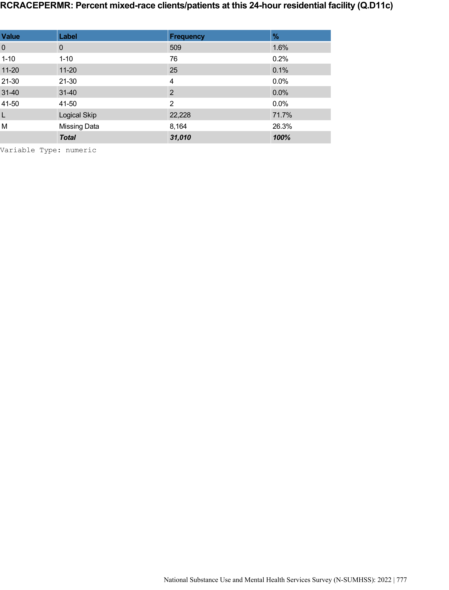

National Substance Use and Mental Health Services Survey (N-SUMHSS): 2022 | 777

\K_O: Total unknown race clients/patients at this 24-hour residential facility (Q.D11c)

| Value   | Label     | Frequency | %      |
|---------|-----------|-----------|--------|
| 0       | 0         | 805       | 2.6%   |
| 1-10    | 1-10      | 141       | 0.5%   |
| 11-20   | 11-20     | 43        | 0.1%   |
| 21-30   | 21-30     | 14        | 0.0%   |
| 31-40   | 31-40     | 17        | 0.1%   |
| 41-50   | 41-50     | 5         | 0.0%   |
| 51-75   | 51-75     | 12        | 0.0%   |
| 76-100  | 76-100    | 4         | 0.0%   |
| 101-250 | 101-250   | 5         | 0.0%   |
| 251-500 | 251-500   | 2         | 0.0%   |
| L       | Logical Skip | 20,556 | 66.3%  |
| M       | Missing Data | 9,406  | 30.3%  |
|         | Total     | 31,010    | 100%   |

Variable Type: numeric

\VK: Total unknown race clients/patients at this 24-hour residential facility, unrolled (Q.D11c)

| Value | Label       | Frequency |     %   |
|-------|-------------|-----------|---------|
| 0     | 0           | 805       | 2.6%    |
| 1-10  | 1-10        | 154       | 0.5%    |
| 11-20 | 11-20       | 45        | 0.1%    |
| 21-30 | 21-30       | 15        | 0.0%    |
| 31-40 | 31-40       | 16        | 0.1%    |
| 41-50 | 41-50       | 7         | 0.0%    |
| 51-75 | 51-75       | 11        | 0.0%    |
| 76-100| 76-100      | 3         | 0.0%    |
| 101-250| 101-250    | 5         | 0.0%    |
| 251-500| 251-500    | 2         | 0.0%    |
| L     | Logical Skip| 18,265    | 58.9%   |
| M     | Missing Data| 11,682    | 37.7%   |
| Total |             | 31,010    | 100%    |

Variable Type: numeric.

NK: Percent unknown race clients/patients at this 24-hour residential facility (Q.D11c)

| Value | Label       | Frequency | %       |
|-------|-------------|-----------|---------|
| 0     | 0           | 417       | 1.3%    |
| 1-10  | 1-10        | 41        | 0.1%    |
| 11-20 | 11-20       | 6         | 0.0%    |
| 21-30 | 21-30       | 7         | 0.0%    |
| 31-40 | 31-40       | 3         | 0.0%    |
| 41-50 | 41-50       | 4         | 0.0%    |
| 51-60 | 51-60       | 4         | 0.0%    |
| 61-70 | 61-70       | 1         | 0.0%    |
| 71-80 | 71-80       | 1         | 0.0%    |
| 100   | 100         | 134       | 0.4%    |
| L     | Logical Skip| 22,228    | 71.7%   |
| M     | Missing Data| 8,164     | 26.3%   |

**Total**: 31,010  **100%**

Variable Type: numeric

National Substance Use and Mental Health Services Survey (N-SUMHSS): 2022   |  780

## OL_O: Total clients/patients with voluntary legal status at this 24-hour residential facility (Q.D11c)

| Value  | Label   | Frequency | %      |
|--------|---------|-----------|--------|
| 0      | 0       | 376       | 1.2%   |
| 1-10   | 1-10    | 360       | 1.2%   |
| 11-20  | 11-20   | 138       | 0.4%   |
| 21-30  | 21-30   | 51        | 0.2%   |
| 31-40  | 31-40   | 38        | 0.1%   |
| 41-50  | 41-50   | 29        | 0.1%   |
| 51-75  | 51-75   | 32        | 0.1%   |
| 76-100 | 76-100  | 17        | 0.1%   |
| 101-250| 101-250 | 9         | 0.0%   |
| 251-500| 251-500 | 2         | 0.0%   |
| L      | Logical Skip | 20,551 | 66.3% |
| M      | Missing Data | 9,407  | 30.3% |

**Total**: 31,010 **100%**

Variable Type: numeric

**VOL: Total clients/patients with voluntary legal status at this 24-hour residential facility, unrolled (Q.D11c)**

| Value    | Label      | Frequency | %      |
|----------|------------|-----------|--------|
| 0        | 0          | 380       | 1.2%   |
| 1-10     | 1-10       | 382       | 1.2%   |
| 11-20    | 11-20      | 145       | 0.5%   |
| 21-30    | 21-30      | 60        | 0.2%   |
| 31-40    | 31-40      | 37        | 0.1%   |
| 41-50    | 41-50      | 31        | 0.1%   |
| 51-75    | 51-75      | 29        | 0.1%   |
| 76-100   | 76-100     | 14        | 0.0%   |
| 101-250  | 101-250    | 9         | 0.0%   |
| 251-500  | 251-500    | 2         | 0.0%   |
| L        | Logical Skip | 18,260 | 58.9%  |
| M        | Missing Data | 11,661  | 37.6%  |

**Total** | 31,010 | 100%

Variable Type: numeric

*National Substance Use and Mental Health Services Survey (N-SUMHSS): 2022*

**OL: Percent clients/patients with voluntary legal status at this 24-hour residential facility (Q.D11c)**

| Value | Label   | Frequency | %     |
|-------|---------|-----------|-------|
| 0     | 0       | 312       | 1.0%  |
| 1-10  | 1-10    | 7         | 0.0%  |
| 11-20 | 11-20   | 3         | 0.0%  |
| 21-30 | 21-30   | 4         | 0.0%  |
| 31-40 | 31-40   | 1         | 0.0%  |
| 41-50 | 41-50   | 6         | 0.0%  |
| 51-60 | 51-60   | 7         | 0.0%  |
| 61-70 | 61-70   | 4         | 0.0%  |
| 71-80 | 71-80   | 14        | 0.0%  |
| 81-90 | 81-90   | 7         | 0.0%  |
| 91-99 | 91-99   | 5         | 0.0%  |
| 100   | 100     | 245       | 0.8%  |
| L     | Logical Skip | 22,214 | 71.6% |
| M     | Missing Data  | 8,181  | 26.4% |

**Total: 31,010  100%**

Variable Type: numeric

## IONFOREN_O: Total clients/patients, involuntary (non-forensic) status at this 24-hour residential facility (Q.D11c)

| Value  | Label        | Frequency | %      |
|--------|--------------|-----------|--------|
| 0      | 0            | 867       | 2.8%   |
| 1-10   | 1-10         | 115       | 0.4%   |
| 11-20  | 11-20        | 30        | 0.1%   |
| 21-30  | 21-30        | 18        | 0.1%   |
| 31-40  | 31-40        | 7         | 0.0%   |
| 41-50  | 41-50        | 8         | 0.0%   |
| 51-75  | 51-75        | 5         | 0.0%   |
| 101-250| 101-250      | 3         | 0.0%   |
| L      | Logical Skip | 20,551    | 66.3%  |
| M      | Missing Data | 9,406     | 30.3%  |

**Total** | | 31,010     | 100%   |

Variable Type: numeric

### IONFOREN: Total clients/patients, involuntary, unrolled (non-forensic) status at this 24-hour residential facility, unrolled (Q.D11c)

| Value | Label        | Frequency | %     |
|-------|--------------|-----------|-------|
| 0     | 0            | 864       | 2.8%  |
| 1-10  | 1-10         | 118       | 0.4%  |
| 11-20 | 11-20        | 30        | 0.1%  |
| 21-30 | 21-30        | 18        | 0.1%  |
| 31-40 | 31-40        | 7         | 0.0%  |
| 41-50 | 41-50        | 8         | 0.0%  |
| 51-75 | 51-75        | 5         | 0.0%  |
| 101-250 | 101-250    | 3         | 0.0%  |
| L     | Logical Skip | 18,260    | 58.9% |
| M     | Missing Data | 11,697    | 37.7% |
|       | **Total**    | **31,010**| **100%** |

Variable Type: numeric

# NONFOREN: Percent clients/patients, involuntary (non-forensic) status at this 24-hour residential facility (Q.D11c)

| Value | Label    | Frequency | %     |
|-------|----------|-----------|-------|
| 0     | 0        | 546       | 1.8%  |
| 1-10  | 1-10     | 3         | 0.0%  |
| 11-20 | 11-20    | 6         | 0.0%  |
| 21-30 | 21-30    | 4         | 0.0%  |
| 31-40 | 31-40    | 7         | 0.0%  |
| 41-50 | 41-50    | 9         | 0.0%  |
| 61-70 | 61-70    | 4         | 0.0%  |
| 71-80 | 71-80    | 2         | 0.0%  |
| 81-90 | 81-90    | 8         | 0.0%  |
| 91-99 | 91-99    | 7         | 0.0%  |
| 100   | 100      | 18        | 0.1%  |
| L     | Logical Skip | 22,215 | 71.6% |
| M     | Missing Data | 8,181  | 26.4% |

**Total: 31,010 (100%)**

Variable Type: numeric

---

National Substance Use and Mental Health Services Survey (N-SUMHSS): 2022 | 786

#OREN_O: Total clients/patients, involuntary (forensic) status at this 24-hour residential facility (Q.D11c)

| Value | Label  | Frequency | %    |
|-------|--------|-----------|------|
| 0     | 0      | 947       | 3.1% |
| 1-10  | 1-10   | 66        | 0.2% |
| 11-20 | 11-20  | 20        | 0.1% |
| 21-30 | 21-30  | 6         | 0.0% |
| 31-40 | 31-40  | 4         | 0.0% |
| 41-50 | 41-50  | 2         | 0.0% |
| 76-100| 76-100 | 2         | 0.0% |
| 101-250| 101-250| 4        | 0.0% |
| 251-500| 251-500| 1        | 0.0% |
| L     | Logical Skip | 20,551 | 66.3% |
| M     | Missing Data | 9,407 | 30.3% |

**Total** | **31,010** | **100%**

Variable Type: numeric

National Substance Use and Mental Health Services Survey (N-SUMHSS): 2022 | 787

# OREN: Total clients/patients, involuntary, unrolled (forensic) status at this 24-hour residential facility, unrolled (Q.D11c)

| Value  | Label          | Frequency |    %    |
|--------|----------------|-----------|---------|
| 0      | 0              | 946       |  3.1%   |
| 1-10   | 1-10           | 73        |  0.2%   |
| 11-20  | 11-20          | 19        |  0.1%   |
| 21-30  | 21-30          | 5         |  0.0%   |
| 31-40  | 31-40          | 4         |  0.0%   |
| 41-50  | 41-50          | 2         |  0.0%   |
| 76-100 | 76-100         | 2         |  0.0%   |
| 101-250| 101-250        | 4         |  0.0%   |
| 251-500| 251-500        | 1         |  0.0%   |
| L      | Logical Skip   | 18,260    | 58.9%   |
| M      | Missing Data   | 11,694    | 37.7%   |
|        | **Total**      | **31,010** | **100%** |

Variable Type: numeric

# OREN: Percent clients/patients, involuntary (forensic) status at this 24-hour residential facility (Q.D11c)

| Value | Label            | Frequency | %      |
|-------|------------------|-----------|--------|
| 0     | 0                | 571       | 1.8%   |
| 1-10  | 1-10             | 20        | 0.1%   |
| 11-20 | 11-20            | 9         | 0.0%   |
| 31-40 | 31-40            | 2         | 0.0%   |
| 41-50 | 41-50            | 1         | 0.0%   |
| 51-60 | 51-60            | 1         | 0.0%   |
| 71-80 | 71-80            | 1         | 0.0%   |
| 100   | 100              | 9         | 0.0%   |
| L     | Logical Skip     | 22,215    | 71.6%  |
| M     | Missing Data     | 8,181     | 26.4%  |
|       | **Total**        | **31,010**| **100%**|

Variable Type: numeric

National Substance Use and Mental Health Services Survey (N-SUMHSS): 2022 | 789

## Clients received less than 24-hour mental health services, 3/31/2022 (Q.D12)

| Value | Label       | Frequency | %     |
|-------|-------------|-----------|-------|
| 0     | No          | 4,287     | 13.8% |
| 1     | Yes         | 3,627     | 11.7% |
| L     | Logical Skip| 13,597    | 43.8% |
| M     | Missing Data| 9,499     | 30.6% |
|       | **Total**   | **31,010**| **100%** |

Variable Type: numeric

# Total number of less than 24-hour clients (Q.D12a)

| Value    | Label          | Frequency |     %   |
|----------|----------------|-----------|---------|
| 0        | 0              | 2,631     | 8.5%    |
| 1-10     | 1-10           | 229       | 0.7%    |
| 11-20    | 11-20          | 191       | 0.6%    |
| 21-30    | 21-30          | 156       | 0.5%    |
| 31-40    | 31-40          | 120       | 0.4%    |
| 41-50    | 41-50          | 137       | 0.4%    |
| 51-75    | 51-75          | 249       | 0.8%    |
| 76-100   | 76-100         | 223       | 0.7%    |
| 101-250  | 101-250        | 712       | 2.3%    |
| 251-500  | 251-500        | 519       | 1.7%    |
| 501-1000 | 501-1000       | 484       | 1.6%    |
| 1001-1500| 1001-1500      | 196       | 0.6%    |
| 1501+    | 1501+          | 285       | 0.9%    |
| L        | Logical Skip   | 15,508    | 50.0%   |
| M        | Missing Data   | 9,370     | 30.2%   |

**Total**: 31,010 **100%**

Variable Type: numeric

## Total number of less than 24-hour clients, unrolled (Q.D12a)

| Value     | Label       | Frequency | %    |
|-----------|-------------|-----------|------|
| 0         | 0           | 2,615     | 8.4% |
| 1-10      | 1-10        | 274       | 0.9% |
| 11-20     | 11-20       | 225       | 0.7% |
| 21-30     | 21-30       | 197       | 0.6% |
| 31-40     | 31-40       | 133       | 0.4% |
| 41-50     | 41-50       | 163       | 0.5% |
| 51-75     | 51-75       | 302       | 1.0% |
| 76-100    | 76-100      | 263       | 0.8% |
| 101-250   | 101-250     | 837       | 2.7% |
| 251-500   | 251-500     | 661       | 2.1% |
| 501-1000  | 501-1000    | 607       | 2.0% |
| 1001-1500 | 1001-1500   | 212       | 0.7% |
| 1501 +    | 1501 +      | 244       | 0.8% |
| L         | Logical Skip| 13,537    | 43.7%|
| M         | Missing Data| 10,740    | 34.6%|

**Total** | | **31,010** | **100%**

*Variable Type: numeric*

*National Substance Use and Mental Health Services Survey (N-SUMHSS): 2022 | 792*

**Total male clients/patients at this less than 24-hour facility (Q.D12b)**

| Value      | Label      | Frequency | %     |
|------------|------------|-----------|-------|
| 0          | 0          | 2,554     | 8.2%  |
| 1-10       | 1-10       | 273       | 0.9%  |
| 11-20      | 11-20      | 145       | 0.5%  |
| 21-30      | 21-30      | 123       | 0.4%  |
| 31-40      | 31-40      | 118       | 0.4%  |
| 41-50      | 41-50      | 75        | 0.2%  |
| 51-75      | 51-75      | 168       | 0.5%  |
| 76-100     | 76-100     | 118       | 0.4%  |
| 101-250    | 101-250    | 367       | 1.2%  |
| 251-500    | 251-500    | 223       | 0.7%  |
| 501-1000   | 501-1000   | 137       | 0.4%  |
| 1001-1500  | 1001-1500  | 43        | 0.1%  |
| 1501 +     | 1501 +     | 55        | 0.2%  |
| L          | Logical Skip | 17,005 | 54.8% |
| M          | Missing Data | 9,606  | 31.0% |

**Total: 31,010    100%**

Variable Type: numeric

---

*National Substance Use and Mental Health Services Survey (N-SUMHSS): 2022 | 793*

## Total male clients/patients at this less than 24-hour facility, unrolled (Q.D12b)

| Value      | Label        | Frequency | %       |
|------------|--------------|-----------|---------|
| 0          | 0            | 2,541     | 8.2%    |
| 1-10       | 1-10         | 361       | 1.2%    |
| 11-20      | 11-20        | 199       | 0.6%    |
| 21-30      | 21-30        | 164       | 0.5%    |
| 31-40      | 31-40        | 149       | 0.5%    |
| 41-50      | 41-50        | 113       | 0.4%    |
| 51-75      | 51-75        | 253       | 0.8%    |
| 76-100     | 76-100       | 148       | 0.5%    |
| 101-250    | 101-250      | 491       | 1.6%    |
| 251-500    | 251-500      | 357       | 1.2%    |
| 501-1000   | 501-1000     | 153       | 0.5%    |
| 1001-1500  | 1001-1500    | 31        | 0.1%    |
| 1501 +     | 1501 +       | 27        | 0.1%    |
| L          | Logical Skip | 15,020    | 48.4%   |
| M          | Missing Data | 11,003    | 35.5%   |
| **Total**  |              | **31,010**| **100%** |

Variable Type: numeric

## Percent male clients/patients at this less than 24-hour facility (Q.D12b)

| Value | Label  | Frequency | %     |
|-------|--------|-----------|-------|
| 0     | 0      | 2,542     | 8.2%  |
| 1-10  | 1-10   | 13        | 0.0%  |
| 11-20 | 11-20  | 37        | 0.1%  |
| 21-30 | 21-30  | 127       | 0.4%  |
| 31-40 | 31-40  | 364       | 1.2%  |
| 41-50 | 41-50  | 580       | 1.9%  |
| 51-60 | 51-60  | 269       | 0.9%  |
| 61-70 | 61-70  | 104       | 0.3%  |
| 71-80 | 71-80  | 54        | 0.2%  |
| 81-90 | 81-90  | 31        | 0.1%  |
| 91-99 | 91-99  | 10        | 0.0%  |
| 100   | 100    | 5         | 0.0%  |
| L     | Logical Skip | 18,539 | 59.8% |
| M     | Missing Data  | 8,335  | 26.9% |

**Total** 31,010 100%

Variable Type: numeric

### Total female clients/patients at this less than 24-hour facility (Q.D12b)

| Value | Label    | Frequency | %    |
|-------|----------|-----------|------|
| 0     | 0        | 2,560     | 8.3% |
| 1-10  | 1-10     | 242       | 0.8% |
| 11-20 | 11-20    | 162       | 0.5% |
| 21-30 | 21-30    | 111       | 0.4% |
| 31-40 | 31-40    | 95        | 0.3% |
| 41-50 | 41-50    | 79        | 0.3% |
| 51-75 | 51-75    | 155       | 0.5% |
| 76-100| 76-100   | 111       | 0.4% |
| 101-250| 101-250 | 350       | 1.1% |
| 251-500| 251-500 | 237       | 0.8% |
| 501-1000| 501-1000 | 189     | 0.6% |
| 1001-1500| 1001-1500 | 49    | 0.2% |
| 1501 +| 1501 +    | 57        | 0.2% |
| L     | Logical Skip | 17,005 | 54.8%|
| M     | Missing Data | 9,608  | 31.0%|

**Total**: 31,010  **100%**

**Variable Type:** numeric

## Total female clients/patients at this less than 24-hour facility, unrolled (Q.D12b)

| Value      | Label    | Frequency | %      |
|------------|----------|-----------|--------|
| 0          | 0        | 2,542     | 8.2%   |
| 1-10       | 1-10     | 344       | 1.1%   |
| 11-20      | 11-20    | 197       | 0.6%   |
| 21-30      | 21-30    | 149       | 0.5%   |
| 31-40      | 31-40    | 127       | 0.4%   |
| 41-50      | 41-50    | 121       | 0.4%   |
| 51-75      | 51-75    | 212       | 0.7%   |
| 76-100     | 76-100   | 166       | 0.5%   |
| 101-250    | 101-250  | 519       | 1.7%   |
| 251-500    | 251-500  | 329       | 1.1%   |
| 501-1000   | 501-1000 | 197       | 0.6%   |
| 1001-1500  | 1001-1500| 48        | 0.2%   |
| 1501 +     | 1501 +   | 28        | 0.1%   |
| L          | Logical Skip | 15,020 | 48.4%  |
| M          | Missing Data | 11,011 | 35.5%  |

**Total**: 31,010  100%

**Variable Type**: numeric

### Percent female clients/patients at this less than 24-hour facility (Q.D12b)

| Value | Label | Frequency | %    |
|-------|-------|-----------|------|
| 0     | 0     | 2,543     | 8.2% |
| 1-10  | 1-10  | 22        | 0.1% |
| 11-20 | 11-20 | 38        | 0.1% |
| 21-30 | 21-30 | 71        | 0.2% |
| 31-40 | 31-40 | 163       | 0.5% |
| 41-50 | 41-50 | 404       | 1.3% |
| 51-60 | 51-60 | 562       | 1.8% |
| 61-70 | 61-70 | 228       | 0.7% |
| 71-80 | 71-80 | 86        | 0.3% |
| 81-90 | 81-90 | 6         | 0.0% |
| 91-99 | 91-99 | 9         | 0.0% |
| 100   | 100   | 4         | 0.0% |
| L     | Logical Skip | 18,539  | 59.8%|
| M     | Missing Data | 8,335   | 26.9%|

**Total**: 31,010 (100%)

Variable Type: numeric

_National Substance Use and Mental Health Services Survey (N-SUMHSS): 2022 | 798_

### O: Total clients/patients 0-17 years at this less than 24-hour facility (Q.D12b)

| Value   | Label      | Frequency | %      |
|---------|------------|-----------|--------|
| 0       | 0          | 3,022     | 9.7%   |
| 1-10    | 1-10       | 222       | 0.7%   |
| 11-20   | 11-20      | 126       | 0.4%   |
| 21-30   | 21-30      | 99        | 0.3%   |
| 31-40   | 31-40      | 82        | 0.3%   |
| 41-50   | 41-50      | 56        | 0.2%   |
| 51-75   | 51-75      | 113       | 0.4%   |
| 76-100  | 76-100     | 88        | 0.3%   |
| 101-250 | 101-250    | 282       | 0.9%   |
| 251-500 | 251-500    | 146       | 0.5%   |
| 501-1000| 501-1000   | 103       | 0.3%   |
| 1001-1500 | 1001-1500 | 21        | 0.1%   |
| 1501 +  | 1501 +     | 33        | 0.1%   |
| L       | Logical Skip | 17,013  | 54.9%  |
| M       | Missing Data | 9,604   | 31.0%  |
| **Total** |            | **31,010** | **100%** |

Variable Type: numeric

### Total clients/patients 0-17 years at this less than 24-hour facility, unrolled (Q.D12b)
| Value   | Label      | Frequency | %     |
|---------|------------|-----------|-------|
| 0       | 0          | 3,021     | 9.7%  |
| 1-10    | 1-10       | 298       | 1.0%  |
| 11-20   | 11-20      | 169       | 0.5%  |
| 21-30   | 21-30      | 158       | 0.5%  |
| 31-40   | 31-40      | 123       | 0.4%  |
| 41-50   | 41-50      | 89        | 0.3%  |
| 51-75   | 51-75      | 170       | 0.5%  |
| 76-100  | 76-100     | 112       | 0.4%  |
| 101-250 | 101-250    | 428       | 1.4%  |
| 251-500 | 251-500    | 205       | 0.7%  |
| 501-1000| 501-1000   | 80        | 0.3%  |
| 1001-1500| 1001-1500 | 10        | 0.0%  |
| 1501 +  | 1501 +     | 21        | 0.1%  |
| L       | Logical Skip | 15,028  | 48.5% |
| M       | Missing Data | 11,098  | 35.8% |
| Total   |            | 31,010    | 100%  |

Variable Type: numeric

## Percent clients/patients 0-17 years at this less than 24-hour facility (Q.D12b)

| Value | Label   | Frequency | %     |
|-------|---------|-----------|-------|
| 0     | 0       | 3,024     | 9.8%  |
| 1-10  | 1-10    | 180       | 0.6%  |
| 11-20 | 11-20   | 224       | 0.7%  |
| 21-30 | 21-30   | 169       | 0.5%  |
| 31-40 | 31-40   | 108       | 0.3%  |
| 41-50 | 41-50   | 85        | 0.3%  |
| 51-60 | 51-60   | 40        | 0.1%  |
| 61-70 | 61-70   | 49        | 0.2%  |
| 71-80 | 71-80   | 51        | 0.2%  |
| 81-90 | 81-90   | 67        | 0.2%  |
| 91-99 | 91-99   | 71        | 0.2%  |
| 100   | 100     | 74        | 0.2%  |
| L     | Logical Skip | 18,536 | 59.8% |
| M     | Missing Data | 8,332  | 26.9% |
|       | Total   | 31,010    | 100%  |

Variable Type: numeric

---

National Substance Use and Mental Health Services Survey (N-SUMHSS): 2022 | 801

#### 4_O: Total clients/patients 18-64 years at this less than 24-hour facility (Q.D12b)

| Value     | Label      | Frequency | %     |
|-----------|------------|-----------|-------|
| 0         | 0          | 2,673     | 8.6%  |
| 1-10      | 1-10       | 220       | 0.7%  |
| 11-20     | 11-20      | 123       | 0.4%  |
| 21-30     | 21-30      | 101       | 0.3%  |
| 31-40     | 31-40      | 88        | 0.3%  |
| 41-50     | 41-50      | 72        | 0.2%  |
| 51-75     | 51-75      | 138       | 0.4%  |
| 76-100    | 76-100     | 110       | 0.4%  |
| 101-250   | 101-250    | 324       | 1.0%  |
| 251-500   | 251-500    | 230       | 0.7%  |
| 501-1000  | 501-1000   | 157       | 0.5%  |
| 1001-1500 | 1001-1500  | 74        | 0.2%  |
| 1501 +    | 1501 +     | 83        | 0.3%  |
| L         | Logical Skip| 17,013   | 54.9% |
| M         | Missing Data | 9,604   | 31.0% |

**Total**: 31,010 **100%**

Variable Type: numeric

### 4: Total clients/patients 18-64 years at this less than 24-hour facility, unrolled (Q.D12b)

| Value  | Label     | Frequency | %     |
|--------|-----------|-----------|-------|
| 0      | 0         | 2,665     | 8.6%  |
| 1-10   | 1-10      | 296       | 1.0%  |
| 11-20  | 11-20     | 173       | 0.6%  |
| 21-30  | 21-30     | 146       | 0.5%  |
| 31-40  | 31-40     | 120       | 0.4%  |
| 41-50  | 41-50     | 109       | 0.4%  |
| 51-75  | 51-75     | 187       | 0.6%  |
| 76-100 | 76-100    | 139       | 0.4%  |
| 101-250| 101-250   | 464       | 1.5%  |
| 251-500| 251-500   | 335       | 1.1%  |
| 501-1000| 501-1000 | 198       | 0.6%  |
| 1001-1500| 1001-1500| 73       | 0.2%  |
| 1501 + | 1501 +    | 55        | 0.2%  |
| L      | Logical Skip | 15,028 | 48.5% |
| M      | Missing Data | 11,022 | 35.5% |

**Total**: 31,010  **100%**

Variable Type: numeric

#### 4: Percent clients/patients 18-64 years at this less than 24-hour facility (Q.D12b)

| Value | Label     | Frequency | %     |
|-------|-----------|-----------|-------|
| 0     | 0         | 2,614     | 8.4%  |
| 1-10  | 1-10      | 113       | 0.4%  |
| 11-20 | 11-20     | 57        | 0.2%  |
| 21-30 | 21-30     | 73        | 0.2%  |
| 31-40 | 31-40     | 73        | 0.2%  |
| 41-50 | 41-50     | 121       | 0.4%  |
| 51-60 | 51-60     | 152       | 0.5%  |
| 61-70 | 61-70     | 207       | 0.7%  |
| 71-80 | 71-80     | 281       | 0.9%  |
| 81-90 | 81-90     | 226       | 0.7%  |
| 91-99 | 91-99     | 151       | 0.5%  |
| 100   | 100       | 74        | 0.2%  |
| L     | Logical Skip  | 18,536    | 59.8% |
| M     | Missing Data  | 8,332     | 26.9% |
| Total | Total      | 31,010    | 100%  |

Variable Type: numeric

---

**National Substance Use and Mental Health Services Survey (N-SUMHSS): 2022 | 804**

_O: Total clients/patients 65 plus years at this less than 24-hour facility (Q.D12b)_

| Value     | Label        | Frequency | %      |
|-----------|--------------|-----------|--------|
| 0         | 0            | 3,156     | 10.2%  |
| 1-10      | 1-10         | 466       | 1.5%   |
| 11-20     | 11-20        | 194       | 0.6%   |
| 21-30     | 21-30        | 108       | 0.3%   |
| 31-40     | 31-40        | 70        | 0.2%   |
| 41-50     | 41-50        | 67        | 0.2%   |
| 51-75     | 51-75        | 90        | 0.3%   |
| 76-100    | 76-100       | 62        | 0.2%   |
| 101-250   | 101-250      | 125       | 0.4%   |
| 251-500   | 251-500      | 34        | 0.1%   |
| 501-1000  | 501-1000     | 12        | 0.0%   |
| 1001-1500 | 1001-1500    | 5         | 0.0%   |
| 1501 +    | 1501 +       | 3         | 0.0%   |
| L         | Logical Skip | 17,013    | 54.9%  |
| M         | Missing Data | 9,605     | 31.0%  |
| **Total** |              | **31,010** | **100%** |

Variable Type: numeric

National Substance Use and Mental Health Services Survey (N-SUMHSS): 2022 | 805

# Total clients/patients 65 plus years at this less than 24-hour facility, unrolled (Q.D12b)

| Value     | Label         | Frequency | %      |
|-----------|---------------|-----------|--------|
| 0         | 0             | 3,159     | 10.2%  |
| 1-10      | 1-10          | 682       | 2.2%   |
| 11-20     | 11-20         | 260       | 0.8%   |
| 21-30     | 21-30         | 192       | 0.6%   |
| 31-40     | 31-40         | 111       | 0.4%   |
| 41-50     | 41-50         | 87        | 0.3%   |
| 51-75     | 51-75         | 131       | 0.4%   |
| 76-100    | 76-100        | 70        | 0.2%   |
| 101-250   | 101-250       | 136       | 0.4%   |
| 251-500   | 251-500       | 22        | 0.1%   |
| 501-1000  | 501-1000      | 7         | 0.0%   |
| 1001-1500 | 1001-1500     | 3         | 0.0%   |
| 1501 +    | 1501 +        | 2         | 0.0%   |
| L         | Logical Skip  | 15,028    | 48.5%  |
| M         | Missing Data  | 11,120    | 35.9%  |

**Total**: 31,010

**Variable Type**: numeric

*National Substance Use and Mental Health Services Survey (N-SUMHSS): 2022 | 806*

## Percent clients/patients 65 plus years at this less than 24-hour facility (Q.D12b)

| Value | Label     | Frequency | %     |
|-------|-----------|-----------|-------|
| 0     | 0         | 2,978     | 9.6%  |
| 1-10  | 1-10      | 733       | 2.4%  |
| 11-20 | 11-20     | 252       | 0.8%  |
| 21-30 | 21-30     | 95        | 0.3%  |
| 31-40 | 31-40     | 35        | 0.1%  |
| 41-50 | 41-50     | 19        | 0.1%  |
| 51-60 | 51-60     | 9         | 0.0%  |
| 61-70 | 61-70     | 4         | 0.0%  |
| 71-80 | 71-80     | 5         | 0.0%  |
| 81-90 | 81-90     | 5         | 0.0%  |
| 91-99 | 91-99     | 6         | 0.0%  |
| 100   | 100       | 1         | 0.0%  |
| L     | Logical Skip | 18,536   | 59.8% |
| M     | Missing Data | 8,332    | 26.9% |

**Total** | | **31,010** | **100%** |

Variable Type: numeric

National Substance Use and Mental Health Services Survey (N-SUMHSS): 2022 | 807

### P_O: Total Hispanic clients/patients at this less than 24-hour facility (Q.D12b)

| Value      | Label     | Frequency | %     |
|------------|-----------|-----------|-------|
| 0          | 0         | 3,026     | 9.8%  |
| 1-10       | 1-10      | 545       | 1.8%  |
| 11-20      | 11-20     | 176       | 0.6%  |
| 21-30      | 21-30     | 105       | 0.3%  |
| 31-40      | 31-40     | 60        | 0.2%  |
| 41-50      | 41-50     | 54        | 0.2%  |
| 51-75      | 51-75     | 87        | 0.3%  |
| 76-100     | 76-100    | 68        | 0.2%  |
| 101-250    | 101-250   | 138       | 0.4%  |
| 251-500    | 251-500   | 53        | 0.2%  |
| 501-1000   | 501-1000  | 29        | 0.1%  |
| 1001-1500  | 1001-1500 | 5         | 0.0%  |
| 1501+      | 1501+     | 10        | 0.0%  |
| L          | Logical Skip | 16,975 | 54.7% |
| M          | Missing Data | 9,679  | 31.2% |

**Total**: 31,010  **100%**

Variable Type: numeric

National Substance Use and Mental Health Services Survey (N-SUMHSS): 2022 | 808

**P: Total Hispanic clients/patients at this less than 24-hour facility, unrolled (Q.D12b)**

| Value    | Label     | Frequency | %       |
|----------|-----------|-----------|---------|
| 0        | 0         | 3,026     | 9.8%    |
| 1-10     | 1-10      | 749       | 2.4%    |
| 11-20    | 11-20     | 245       | 0.8%    |
| 21-30    | 21-30     | 149       | 0.5%    |
| 31-40    | 31-40     | 99        | 0.3%    |
| 41-50    | 41-50     | 93        | 0.3%    |
| 51-75    | 51-75     | 99        | 0.3%    |
| 76-100   | 76-100    | 100       | 0.3%    |
| 101-250  | 101-250   | 146       | 0.5%    |
| 251-500  | 251-500   | 56        | 0.2%    |
| 501-1000 | 501-1000  | 21        | 0.1%    |
| 1001-1500| 1001-1500 | 4         | 0.0%    |
| 1501 +   | 1501 +    | 11        | 0.0%    |
| L        | Logical Skip | 14,990 | 48.3%   |
| M        | Missing Data | 11,222 | 36.2%   |

**Total**: 31,010  100%

Variable Type: numeric

# P: Percent Hispanic clients/patients at this less than 24-hour facility (Q.D12b)

| Value | Label   | Frequency |     %   |
|-------|---------|-----------|---------|
| 0     | 0       | 3,085     | 9.9%    |
| 1-10  | 1-10    | 510       | 1.6%    |
| 11-20 | 11-20   | 180       | 0.6%    |
| 21-30 | 21-30   | 119       | 0.4%    |
| 31-40 | 31-40   | 68        | 0.2%    |
| 41-50 | 41-50   | 38        | 0.1%    |
| 51-60 | 51-60   | 36        | 0.1%    |
| 61-70 | 61-70   | 17        | 0.1%    |
| 71-80 | 71-80   | 22        | 0.1%    |
| 81-90 | 81-90   | 14        | 0.0%    |
| 91-99 | 91-99   | 4         | 0.0%    |
| 100   | 100     | 8         | 0.0%    |
| L     | Logical Skip | 18,563 | 59.9%  |
| M     | Missing Data  | 8,346 | 26.9%  |

**Total:** 31,010  **100%**

Variable Type: numeric

National Substance Use and Mental Health Services Survey (N-SUMHSS): 2022 | 810

# \HISP_O: Total non-Hispanic clients/patients at this less than 24-hour facility (Q.D12b)

| Value     | Label      | Frequency | %     |
|-----------|------------|-----------|-------|
| 0         | 0          | 2,827     | 9.1%  |
| 1-10      | 1-10       | 146       | 0.5%  |
| 11-20     | 11-20      | 100       | 0.3%  |
| 21-30     | 21-30      | 81        | 0.3%  |
| 31-40     | 31-40      | 55        | 0.2%  |
| 41-50     | 41-50      | 62        | 0.2%  |
| 51-75     | 51-75      | 137       | 0.4%  |
| 76-100    | 76-100     | 84        | 0.3%  |
| 101-250   | 101-250    | 312       | 1.0%  |
| 251-500   | 251-500    | 221       | 0.7%  |
| 501-1000  | 501-1000   | 166       | 0.5%  |
| 1001-1500 | 1001-1500  | 70        | 0.2%  |
| 1501 +    | 1501 +     | 96        | 0.3%  |
| L         | Logical Skip | 16,975 | 54.7% |
| M         | Missing Data | 9,678  | 31.2% |
| **Total** |            | **31,010** | **100%** |

Variable Type: numeric.

National Substance Use and Mental Health Services Survey (N-SUMHSS): 2022 | 811.

### HISP: Total non-Hispanic clients/patients at this less than 24-hour facility, unrolled (Q.D12b) 

| Value     | Label       | Frequency |      %      |
|-----------|-------------|-----------|-------------|
| 0         | 0           | 2,809     | 9.1%         |
| 1-10      | 1-10        | 177       | 0.6%         |
| 11-20     | 11-20       | 146       | 0.5%         |
| 21-30     | 21-30       | 108       | 0.3%         |
| 31-40     | 31-40       | 79        | 0.3%         |
| 41-50     | 41-50       | 77        | 0.2%         |
| 51-75     | 51-75       | 175       | 0.6%         |
| 76-100    | 76-100      | 127       | 0.4%         |
| 101-250   | 101-250     | 424       | 1.4%         |
| 251-500   | 251-500     | 355       | 1.1%         |
| 501-1000  | 501-1000    | 206       | 0.7%         |
| 1001-1500 | 1001-1500   | 58        | 0.2%         |
| 1501 +    | 1501 +      | 74        | 0.2%         |
| L         | Logical Skip| 14,990    | 48.3%        |
| M         | Missing Data| 11,205    | 36.1%        |
| **Total** |             | **31,010**| **100%**     |

Variable Type: numeric

National Substance Use and Mental Health Services Survey (N-SUMHSS): 2022 | 812

**HISP: Percent non-Hispanic clients/patients at this less than 24-hour facility (Q.D12b)**

| Value | Label | Frequency | %    |
|-------|-------|-----------|------|
| 0     | 0     | 3,004     | 9.7% |
| 1-10  | 1-10  | 23        | 0.1% |
| 11-20 | 11-20 | 24        | 0.1% |
| 21-30 | 21-30 | 44        | 0.1% |
| 31-40 | 31-40 | 55        | 0.2% |
| 41-50 | 41-50 | 42        | 0.1% |
| 51-60 | 51-60 | 88        | 0.3% |
| 61-70 | 61-70 | 113       | 0.4% |
| 71-80 | 71-80 | 144       | 0.5% |
| 81-90 | 81-90 | 194       | 0.6% |
| 91-99 | 91-99 | 294       | 0.9% |
| 100   | 100   | 76        | 0.2% |
| L     | Logical Skip | 18,563 | 59.9% |
| M     | Missing Data | 8,346 | 26.9% |

**Total**: 31,010   **100%**

Variable Type: numeric

National Substance Use and Mental Health Services Survey (N-SUMHSS): 2022 | 813

## Q: Total unknown ethnicity clients/patients at this less than 24-hour facility (Q.D12b)

| Value      | Label      | Frequency | %      |
|------------|------------|-----------|--------|
| 0          | 0          | 3,234     | 10.4%  |
| 1-10       | 1-10       | 318       | 1.0%   |
| 11-20      | 11-20      | 131       | 0.4%   |
| 21-30      | 21-30      | 90        | 0.3%   |
| 31-40      | 31-40      | 77        | 0.2%   |
| 41-50      | 41-50      | 52        | 0.2%   |
| 51-75      | 51-75      | 85        | 0.3%   |
| 76-100     | 76-100     | 61        | 0.2%   |
| 101-250    | 101-250    | 129       | 0.4%   |
| 251-500    | 251-500    | 73        | 0.2%   |
| 501-1000   | 501-1000   | 64        | 0.2%   |
| 1001-1500  | 1001-1500  | 22        | 0.1%   |
| 1501 +     | 1501 +     | 22        | 0.1%   |
| L          | Logical Skip | 16,975 | 54.7%  |
| M          | Missing Data | 9,677  | 31.2%  |

**Total**: 31,010 (100%)

*Variable Type: numeric*

---

National Substance Use and Mental Health Services Survey (N-SUMHSS): 2022 | 814

# Total unknown ethnicity clients/patients at this less than 24-hour facility, unrolled (Q.D12b)

| Value      | Label          | Frequency | %      |
|------------|----------------|-----------|--------|
| 0          | 0              | 3,224     | 10.4%  |
| 1-10       | 1-10           | 443       | 1.4%   |
| 11-20      | 11-20          | 157       | 0.5%   |
| 21-30      | 21-30          | 109       | 0.4%   |
| 31-40      | 31-40          | 126       | 0.4%   |
| 41-50      | 41-50          | 70        | 0.2%   |
| 51-75      | 51-75          | 104       | 0.3%   |
| 76-100     | 76-100         | 74        | 0.2%   |
| 101-250    | 101-250        | 191       | 0.6%   |
| 251-500    | 251-500        | 116       | 0.4%   |
| 501-1000   | 501-1000       | 66        | 0.2%   |
| 1001-1500  | 1001-1500      | 29        | 0.1%   |
| 1501 +     | 1501 +         | 11        | 0.0%   |
| L          | Logical Skip   | 14,990    | 48.3%  |
| M          | Missing Data   | 11,300    | 36.4%  |
| **Total**  |                | **31,010**| **100%**|

Variable Type: numeric

---

National Substance Use and Mental Health Services Survey (N-SUMHSS): 2022 | 815

<: Percent unknown ethnicity clients/patients at this less than 24-hour facility (Q.D12b)

| Value | Label  | Frequency | %      |
|-------|--------|-----------|--------|
| 0     | 0      | 3,134     | 10.1%  |
| 1-10  | 1-10   | 306       | 1.0%   |
| 11-20 | 11-20  | 80        | 0.3%   |
| 21-30 | 21-30  | 44        | 0.1%   |
| 31-40 | 31-40  | 25        | 0.1%   |
| 41-50 | 41-50  | 9         | 0.0%   |
| 51-60 | 51-60  | 8         | 0.0%   |
| 61-70 | 61-70  | 17        | 0.1%   |
| 71-80 | 71-80  | 9         | 0.0%   |
| 81-90 | 81-90  | 8         | 0.0%   |
| 91-99 | 91-99  | 10        | 0.0%   |
| 100   | 100    | 451       | 1.5%   |
| L     | Logical Skip | 18,563 | 59.9% |
| M     | Missing Data | 8,346  | 26.9% |

**Total** | **31,010** | **100%**

Variable Type: numeric

### DIAN_O: Total American Indian/Alaska Native clients/patients at this less than 24-hour facility (Q.D12b)

| Value    | Label         | Frequency | %     |
|----------|---------------|-----------|-------|
| 0        | 0             | 3,550     | 11.4% |
| 1-10     | 1-10          | 616       | 2.0%  |
| 11-20    | 11-20         | 75        | 0.2%  |
| 21-30    | 21-30         | 35        | 0.1%  |
| 31-40    | 31-40         | 15        | 0.0%  |
| 41-50    | 41-50         | 6         | 0.0%  |
| 51-75    | 51-75         | 15        | 0.0%  |
| 76-100   | 76-100        | 6         | 0.0%  |
| 101-250  | 101-250       | 21        | 0.1%  |
| 251-500  | 251-500       | 4         | 0.0%  |
| 501-1000 | 501-1000      | 1         | 0.0%  |
| 1001-1500| 1001-1500     | 1         | 0.0%  |
| L        | Logical Skip  | 16,952    | 54.7% |
| M        | Missing Data  | 9,713     | 31.3% |

**Total:** 31,010 (100%)

Variable Type: numeric

National Substance Use and Mental Health Services Survey (N-SUMHSS): 2022 | 817

### DIAN: Total American Indian/Alaska Native clients/patients at this less than 24-hour facility, unrolled (Q.D12b)

| Value   | Label       | Frequency | %      |
|---------|-------------|-----------|--------|
| 0       | 0           | 3,573     | 11.5%  |
| 1-10    | 1-10        | 860       | 2.8%   |
| 11-20   | 11-20       | 82        | 0.3%   |
| 21-30   | 21-30       | 52        | 0.2%   |
| 31-40   | 31-40       | 10        | 0.0%   |
| 41-50   | 41-50       | 7         | 0.0%   |
| 51-75   | 51-75       | 43        | 0.1%   |
| 76-100  | 76-100      | 5         | 0.0%   |
| 101-250 | 101-250     | 16        | 0.1%   |
| 251-500 | 251-500     | 4         | 0.0%   |
| L       | Logical Skip| 14,969    | 48.3%  |
| M       | Missing Data| 11,389    | 36.7%  |

**Total: 31,010   100%**

Variable Type: numeric

National Substance Use and Mental Health Services Survey (N-SUMHSS): 2022

# DIAN: Percent American Indian/Alaska Native clients/patients at this less than 24-hour facility (Q.D12b)

| Value | Label     | Frequency |     %  |
|-------|-----------|-----------|--------|
| 0     | 0         | 3,607     |  11.6% |
| 1-10  | 1-10      | 425       |  1.4%  |
| 11-20 | 11-20     | 22        |  0.1%  |
| 21-30 | 21-30     | 4         |  0.0%  |
| 31-40 | 31-40     | 2         |  0.0%  |
| 51-60 | 51-60     | 1         |  0.0%  |
| 61-70 | 61-70     | 2         |  0.0%  |
| 71-80 | 71-80     | 4         |  0.0%  |
| 100   | 100       | 9         |  0.0%  |
| L     | Logical Skip | 18,583 | 59.9%  |
| M     | Missing Data | 8,351  | 26.9%  |

**Total**  
    31,010   \quad 100%

Variable Type: numeric

*National Substance Use and Mental Health Services Survey (N-SUMHSS): 2022 | 819*

## 3IAN_O: Total Asian clients/patients at this less than 24-hour facility (Q.D12b)

| Value   | Label    | Frequency | %     |
|---------|----------|-----------|-------|
| 0       |          | 3,531     | 11.4% |
| 1-10    | 1-10     | 621       | 2.0%  |
| 11-20   | 11-20    | 89        | 0.3%  |
| 21-30   | 21-30    | 37        | 0.1%  |
| 31-40   | 31-40    | 15        | 0.0%  |
| 41-50   | 41-50    | 10        | 0.0%  |
| 51-75   | 51-75    | 12        | 0.0%  |
| 76-100  | 76-100   | 5         | 0.0%  |
| 101-250 | 101-250  | 23        | 0.1%  |
| 251-500 | 251-500  | 2         | 0.0%  |
| L       | Logical Skip | 16,952  | 54.7% |
| M       | Missing Data | 9,713  | 31.3% |

**Total 31,010 100%**

Variable Type: numeric

National Substance Use and Mental Health Services Survey (N-SUMHSS): 2022 | 820

### 3IAN: Total Asian clients/patients at this less than 24-hour facility, unrolled (Q.D12b)

| Value   | Label    | Frequency | %      |
|---------|----------|-----------|--------|
| 0       |          | 3,585     | 11.6%  |
| 1-10    |          | 834       | 2.7%   |
| 11-20   |          | 115       | 0.4%   |
| 21-30   |          | 53        | 0.2%   |
| 31-40   |          | 19        | 0.1%   |
| 41-50   |          | 11        | 0.0%   |
| 51-75   |          | 11        | 0.0%   |
| 76-100  |          | 3         | 0.0%   |
| 101-250 |          | 13        | 0.0%   |
| 251-500 |          | 2         | 0.0%   |
| L       | Logical Skip | 14,969 | 48.3%  |
| M       | Missing Data | 11,395 | 36.7%  |
|         | **Total**    | 31,010  | 100%   |

Variable Type: numeric

---

National Substance Use and Mental Health Services Survey (N-SUMHSS): 2022 | 821

# SIAN: Percent Asian clients/patients at this less than 24-hour facility (Q.D12b)

| Value | Label | Frequency | %      |
|-------|-------|-----------|--------|
| 0     | 0     | 3,450     | 11.1%  |
| 1-10  | 1-10  | 593       | 1.9%   |
| 11-20 | 11-20 | 21        | 0.1%   |
| 21-30 | 21-30 | 5         | 0.0%   |
| 31-40 | 31-40 | 4         | 0.0%   |
| 41-50 | 41-50 | 2         | 0.0%   |
| 91-99 | 91-99 | 1         | 0.0%   |
| L     | Logical Skip | 18,583  | 59.9%  |
| M     | Missing Data | 8,351   | 26.9%  |

| **Total** | **31,010** | **100%** |

Variable Type: numeric

National Substance Use and Mental Health Services Survey (N-SUMHSS): 2022 | 822

_K_O: Total Black clients/patients at this less than 24-hour facility (Q.D12b)

| Value | Label      | Frequency | %     |
|-------|------------|-----------|-------|
| 0     | 0          | 2,995     | 9.7%  |
| 1-10  | 1-10       | 495       | 1.6%  |
| 11-20 | 11-20      | 199       | 0.6%  |
| 21-30 | 21-30      | 113       | 0.4%  |
| 31-40 | 31-40      | 80        | 0.3%  |
| 41-50 | 41-50      | 51        | 0.2%  |
| 51-75 | 51-75      | 96        | 0.3%  |
| 76-100| 76-100     | 45        | 0.1%  |
| 101-250| 101-250   | 152       | 0.5%  |
| 251-500| 251-500   | 60        | 0.2%  |
| 501-1000| 501-1000 | 36        | 0.1%  |
| 1001-1500| 1001-1500| 15       | 0.0%  |
| 1501 + | 1501 +    | 8         | 0.0%  |
| L     | Logical Skip | 16,952  | 54.7% |
| M     | Missing Data | 9,713   | 31.3% |

**Total: 31,010, 100%**

Variable Type: numeric

_K: Total Black clients/patients at this less than 24-hour facility, unrolled (Q.D12b)_  

| Value      | Label      | Frequency | %       |
|------------|------------|-----------|---------|
| 0          | 0          | 2,995     | 9.7%    |
| 1-10       | 1-10       | 701       | 2.3%    |
| 11-20      | 11-20      | 216       | 0.7%    |
| 21-30      | 21-30      | 145       | 0.5%    |
| 31-40      | 31-40      | 118       | 0.4%    |
| 41-50      | 41-50      | 99        | 0.3%    |
| 51-75      | 51-75      | 130       | 0.4%    |
| 76-100     | 76-100     | 68        | 0.2%    |
| 101-250    | 101-250    | 188       | 0.6%    |
| 251-500    | 251-500    | 81        | 0.3%    |
| 501-1000   | 501-1000   | 34        | 0.1%    |
| 1001-1500  | 1001-1500  | 6         | 0.0%    |
| 1501 +     | 1501 +     | 3         | 0.0%    |
| L          | Logical Skip  | 14,969    | 48.3%   |
| M          | Missing Data  | 11,257    | 36.3%   |
| **Total**  |             | **31,010** | **100%** |

Variable Type: numeric  

LK: Percent Black clients/patients at this less than 24-hour facility (Q.D12b)

| Value | Label   | Frequency | %       |
|-------|---------|-----------|---------|
| 0     | 0       | 3,096     | 10.0%   |
| 1-10  | 1-10    | 419       | 1.4%    |
| 11-20 | 11-20   | 174       | 0.6%    |
| 21-30 | 21-30   | 124       | 0.4%    |
| 31-40 | 31-40   | 78        | 0.3%    |
| 41-50 | 41-50   | 73        | 0.2%    |
| 51-60 | 51-60   | 44        | 0.1%    |
| 61-70 | 61-70   | 27        | 0.1%    |
| 71-80 | 71-80   | 19        | 0.1%    |
| 81-90 | 81-90   | 13        | 0.0%    |
| 91-99 | 91-99   | 9         | 0.0%    |
| L     | Logical Skip | 18,583 | 59.9%  |
| M     | Missing Data | 8,351  | 26.9%  |
| Total | Total   | 31,010    | 100%    |

Variable Type: numeric

\WPAC_O: Total Native Hawaiian/Other Pacific Islander at this less than 24-hour facility (Q.D12b)

| Value   | Label   | Frequency | %     |
|---------|---------|-----------|-------|
| 0       | 0       | 3,895     | 12.6% |
| 1-10    | 1-10    | 401       | 1.3%  |
| 11-20   | 11-20   | 24        | 0.1%  |
| 21-30   | 21-30   | 3         | 0.0%  |
| 31-40   | 31-40   | 4         | 0.0%  |
| 41-50   | 41-50   | 3         | 0.0%  |
| 51-75   | 51-75   | 5         | 0.0%  |
| 76-100  | 76-100  | 2         | 0.0%  |
| 101-250 | 101-250 | 7         | 0.0%  |
| 501-1000| 501-1000| 1         | 0.0%  |
| L       | Logical Skip | 16,952 | 54.7% |
| M       | Missing Data | 9,713  | 31.3% |
| **Total** |         | **31,010** | **100%** |

*Variable Type: numeric*

*National Substance Use and Mental Health Services Survey (N-SUMHSS): 2022 | 826*

**AWPAC: Total Native Hawaiian/Other Pacific Islander at this less than 24-hour facility, unrolled (Q.D12b)**

| Value | Label       | Frequency | %     |
|-------|-------------|-----------|-------|
| 0     | 0           | 3,975     | 12.8% |
| 1-10  | 1-10        | 515       | 1.7%  |
| 11-20 | 11-20       | 20        | 0.1%  |
| 21-30 | 21-30       | 2         | 0.0%  |
| 31-40 | 31-40       | 8         | 0.0%  |
| 41-50 | 41-50       | 2         | 0.0%  |
| 51-75 | 51-75       | 5         | 0.0%  |
| 76-100| 76-100      | 2         | 0.0%  |
| 101-250| 101-250    | 5         | 0.0%  |
| 501-1000| 501-1000  | 1         | 0.0%  |
| L     | Logical Skip| 14,969    | 48.3% |
| M     | Missing Data| 11,506    | 37.1% |

**Total** | **31,010** | **100%**

Variable Type: numeric

**AWPAC: Percent Native Hawaiian/Other Pacific Islander at this less than 24-hour facility (Q.D12b)**

| Value | Label | Frequency | %     |
|-------|-------|-----------|-------|
| 0     | 0     | 3,793     | 12.2% |
| 1-10  | 1-10  | 275       | 0.9%  |
| 11-20 | 11-20 | 4         | 0.0%  |
| 21-30 | 21-30 | 1         | 0.0%  |
| 41-50 | 41-50 | 1         | 0.0%  |
| 81-90 | 81-90 | 1         | 0.0%  |
| 91-99 | 91-99 | 1         | 0.0%  |
| L     | Logical Skip | 18,583    | 59.9% |
| M     | Missing Data | 8,351     | 26.9% |

**Total** | | 31,010 | 100%

Variable Type: numeric

# HIT_O: Total White clients/patients at this less than 24-hour facility (Q.D12b)

| Value     | Label       | Frequency | %       |
|-----------|-------------|-----------|---------|
| 0         | 0           | 2,837     | 9.1%    |
| 1-10      | 1-10        | 191       | 0.6%    |
| 11-20     | 11-20       | 93        | 0.3%    |
| 21-30     | 21-30       | 93        | 0.3%    |
| 31-40     | 31-40       | 61        | 0.2%    |
| 41-50     | 41-50       | 63        | 0.2%    |
| 51-75     | 51-75       | 132       | 0.4%    |
| 76-100    | 76-100      | 93        | 0.3%    |
| 101-250   | 101-250     | 278       | 0.9%    |
| 251-500   | 251-500     | 203       | 0.7%    |
| 501-1000  | 501-1000    | 154       | 0.5%    |
| 1001-1500 | 1001-1500   | 59        | 0.2%    |
| 1501 +    | 1501 +      | 90        | 0.3%    |
| L         | Logical Skip | 16,952   | 54.7%   |
| M         | Missing Data | 9,711    | 31.3%   |
|           | **Total**   | **31,010** | **100%** |

Variable Type: numeric

### HIT: Total White clients/patients at this less than 24-hour facility, unrolled (Q.D12b)

| Value    | Label        | Frequency | %       |
|----------|--------------|-----------|---------|
| 0        | 0            | 2,823     | 9.1%    |
| 1-10     | 1-10         | 233       | 0.8%    |
| 11-20    | 11-20        | 128       | 0.4%    |
| 21-30    | 21-30        | 142       | 0.5%    |
| 31-40    | 31-40        | 74        | 0.2%    |
| 41-50    | 41-50        | 61        | 0.2%    |
| 51-75    | 51-75        | 174       | 0.6%    |
| 76-100   | 76-100       | 152       | 0.5%    |
| 101-250  | 101-250      | 405       | 1.3%    |
| 251-500  | 251-500      | 300       | 1.0%    |
| 501-1000 | 501-1000     | 190       | 0.6%    |
| 1001-1500| 1001-1500    | 46        | 0.1%    |
| 1501 +   | 1501 +       | 75        | 0.2%    |
| L        | Logical Skip | 14,969    | 48.3%   |
| M        | Missing Data | 11,238    | 36.2%   |

**Total:** 31,010 100%

**Variable Type:** numeric

---

National Substance Use and Mental Health Services Survey (N-SUMHSS): 2022 | 830

#### HIT: Percent White clients/patients at this less than 24-hour facility (Q.D12b)

| Value | Label     | Frequency | %     |
|-------|-----------|-----------|-------|
| 0     | 0         | 3,031     | 9.8%  |
| 1-10  | 1-10      | 41        | 0.1%  |
| 11-20 | 11-20     | 41        | 0.1%  |
| 21-30 | 21-30     | 59        | 0.2%  |
| 31-40 | 31-40     | 127       | 0.4%  |
| 41-50 | 41-50     | 123       | 0.4%  |
| 51-60 | 51-60     | 161       | 0.5%  |
| 61-70 | 61-70     | 94        | 0.3%  |
| 71-80 | 71-80     | 134       | 0.4%  |
| 81-90 | 81-90     | 133       | 0.4%  |
| 91-99 | 91-99     | 113       | 0.4%  |
| 100   | 100       | 19        | 0.1%  |
| L     | Logical Skip | 18,583  | 59.9% |
| M     | Missing Data | 8,351  | 26.9% |
| Total | Total     | 31,010    | 100%  |

Variable Type: numeric

---

National Substance Use and Mental Health Services Survey (N-SUMHSS): 2022 | 831

## R_O: Total mixed-race clients/patients at this less than 24-hour facility (Q.D12b)

| Value     | Label    | Frequency | %      |
|-----------|----------|-----------|--------|
| 0         | 0        | 3,449     | 11.1%  |
| 1-10      | 1-10     | 467       | 1.5%   |
| 11-20     | 11-20    | 126       | 0.4%   |
| 21-30     | 21-30    | 71        | 0.2%   |
| 31-40     | 31-40    | 44        | 0.1%   |
| 41-50     | 41-50    | 29        | 0.1%   |
| 51-75     | 51-75    | 44        | 0.1%   |
| 76-100    | 76-100   | 30        | 0.1%   |
| 101-250   | 101-250  | 54        | 0.2%   |
| 251-500   | 251-500  | 18        | 0.1%   |
| 501-1000  | 501-1000 | 14        | 0.0%   |
| L         | Logical Skip | 16,952 | 54.7%  |
| M         | Missing Data | 9,712  | 31.3%  |

**Total**: 31,010 (100%)

Variable Type: numeric

*National Substance Use and Mental Health Services Survey (N-SUMHSS): 2022 | 832*

# R: Total mixed-race clients/patients at this less than 24-hour facility, unrolled (Q.D12b)
| Value   | Label   | Frequency   | %      |
| ------- | ------- | ----------- | ------ |
| 0       | 0       | 3,465       | 11.2%  |
| 1-10    | 1-10    | 661         | 2.1%   |
| 11-20   | 11-20   | 162         | 0.5%   |
| 21-30   | 21-30   | 108         | 0.3%   |
| 31-40   | 31-40   | 64          | 0.2%   |
| 41-50   | 41-50   | 34          | 0.1%   |
| 51-75   | 51-75   | 53          | 0.2%   |
| 76-100  | 76-100  | 31          | 0.1%   |
| 101-250 | 101-250 | 46          | 0.1%   |
| 251-500 | 251-500 | 16          | 0.1%   |
| 501-1000| 501-1000| 11          | 0.0%   |
| L       | Logical Skip | 14,969  | 48.3%  |
| M       | Missing Data | 11,390  | 36.7%  |

**Total**: 31,010 (100%)

Variable Type: numeric

# R: Percent mixed-race clients/patients at this less than 24-hour facility (Q.D12b)

| Value | Label   | Frequency | %     |
|-------|---------|-----------|-------|
| 0     | 0       | 3,358     | 10.8% |
| 1-10  | 1-10    | 528       | 1.7%  |
| 11-20 | 11-20   | 109       | 0.4%  |
| 21-30 | 21-30   | 45        | 0.1%  |
| 31-40 | 31-40   | 16        | 0.1%  |
| 41-50 | 41-50   | 11        | 0.0%  |
| 51-60 | 51-60   | 1         | 0.0%  |
| 61-70 | 61-70   | 3         | 0.0%  |
| 71-80 | 71-80   | 1         | 0.0%  |
| 81-90 | 81-90   | 2         | 0.0%  |
| 91-99 | 91-99   | 1         | 0.0%  |
| 100   | 100     | 1         | 0.0%  |
| L     | Logical Skip | 18,583    | 59.9% |
| M     | Missing Data | 8,351     | 26.9% |

**Total**: 31,010    **100%**

Variable Type: numeric

*National Substance Use and Mental Health Services Survey (N-SUMHSS): 2022 | 834*

\K_O: Total unknown race clients/patients at this less than 24-hour facility (Q.D12b)

| Value    | Label     | Frequency | %     |
|----------|-----------|-----------|-------|
| 0        | 0         | 3,073     | 9.9%  |
| 1-10     | 1-10      | 390       | 1.3%  |
| 11-20    | 11-20     | 157       | 0.5%  |
| 21-30    | 21-30     | 114       | 0.4%  |
| 31-40    | 31-40     | 83        | 0.3%  |
| 41-50    | 41-50     | 64        | 0.2%  |
| 51-75    | 51-75     | 95        | 0.3%  |
| 76-100   | 76-100    | 59        | 0.2%  |
| 101-250  | 101-250   | 145       | 0.5%  |
| 251-500  | 251-500   | 75        | 0.2%  |
| 501-1000 | 501-1000  | 61        | 0.2%  |
| 1001-1500| 1001-1500 | 10        | 0.0%  |
| 1501 +   | 1501 +    | 18        | 0.1%  |
| L        | Logical Skip| 16,952 | 54.7% |
| M        | Missing Data| 9,714  | 31.3% |

**Total** | | 31,010 | **100%**

**Variable Type:** numeric

**National Substance Use and Mental Health Services Survey (N-SUMHSS): 2022** | **835**

**Total unknown race clients/patients at this less than 24-hour facility, unrolled (Q.D12b)**

| Value    | Label     | Frequency | %      |
|----------|-----------|-----------|--------|
| 0        | 0         | 3,061     | 9.9%   |
| 1-10     | 1-10      | 570       | 1.8%   |
| 11-20    | 11-20     | 198       | 0.6%   |
| 21-30    | 21-30     | 170       | 0.5%   |
| 31-40    | 31-40     | 100       | 0.3%   |
| 41-50    | 41-50     | 86        | 0.3%   |
| 51-75    | 51-75     | 131       | 0.4%   |
| 76-100   | 76-100    | 74        | 0.2%   |
| 101-250  | 101-250   | 185       | 0.6%   |
| 251-500  | 251-500   | 108       | 0.3%   |
| 501-1000 | 501-1000  | 56        | 0.2%   |
| 1001-1500| 1001-1500 | 21        | 0.1%   |
| 1501 +   | 1501 +    | 9         | 0.0%   |
| L        | Logical Skip | 14,969  | 48.3%  |
| M        | Missing Data | 11,272  | 36.3%  |
| Total    | Total     | 31,010    | 100%   |

Variable Type: numeric

National Substance Use and Mental Health Services Survey (N-SUMHSS): 2022 | 836

NK: Percent unknown race clients/patients at this less than 24-hour facility (Q.D12b)

| Value | Label   | Frequency | %    |
|-------|---------|-----------|------|
| 0     | 0       | 3,039     | 9.8% |
| 1-10  | 1-10    | 332       | 1.1% |
| 11-20 | 11-20   | 120       | 0.4% |
| 21-30 | 21-30   | 38        | 0.1% |
| 31-40 | 31-40   | 32        | 0.1% |
| 41-50 | 41-50   | 18        | 0.1% |
| 51-60 | 51-60   | 8         | 0.0% |
| 61-70 | 61-70   | 4         | 0.0% |
| 71-80 | 71-80   | 6         | 0.0% |
| 81-90 | 81-90   | 3         | 0.0% |
| 91-99 | 91-99   | 1         | 0.0% |
| 100   | 100     | 475       | 1.5% |
| L     | Logical Skip     | 18,583    | 59.9% |
| M     | Missing Data  | 8,351     | 26.9% |

**Total:** 31,010  **100%**

**Variable Type:** numeric

*National Substance Use and Mental Health Services Survey (N-SUMHSS): 2022 | 837*

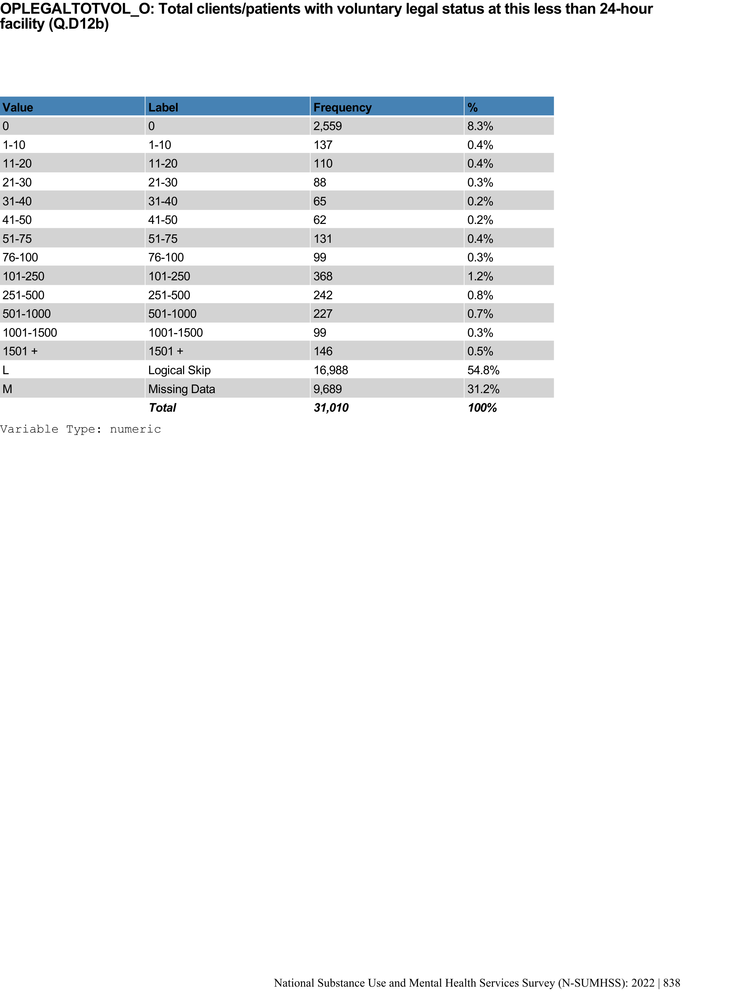

Variable Type: numeric

**OL: Total clients/patients with voluntary legal status at this less than 24-hour facility, unrolled (Q.D12b)**

| Value      | Label        | Frequency | %     |
|------------|--------------|-----------|-------|
| 0          | 0            | 2,545     | 8.2%  |
| 1-10       | 1-10         | 184       | 0.6%  |
| 11-20      | 11-20        | 140       | 0.5%  |
| 21-30      | 21-30        | 129       | 0.4%  |
| 31-40      | 31-40        | 66        | 0.2%  |
| 41-50      | 41-50        | 85        | 0.3%  |
| 51-75      | 51-75        | 169       | 0.5%  |
| 76-100     | 76-100       | 143       | 0.5%  |
| 101-250    | 101-250      | 497       | 1.6%  |
| 251-500    | 251-500      | 405       | 1.3%  |
| 501-1000   | 501-1000     | 312       | 1.0%  |
| 1001-1500  | 1001-1500    | 112       | 0.4%  |
| 1501 +     | 1501 +       | 111       | 0.4%  |
| L          | Logical Skip | 15,002    | 48.4% |
| M          | Missing Data | 11,110    | 35.8% |

**Total: 31,010  100%**

Variable Type: numeric

---

National Substance Use and Mental Health Services Survey (N-SUMHSS): 2022 | 839

### IOL: Percent clients/patients with voluntary legal status at this less than 24-hour facility (Q.D12b)

| Value | Label       | Frequency | %    |
|-------|-------------|-----------|------|
| 0     | 0           | 2,546     | 8.2% |
| 1-10  | 1-10        | 2         | 0.0% |
| 21-30 | 21-30       | 9         | 0.0% |
| 31-40 | 31-40       | 4         | 0.0% |
| 41-50 | 41-50       | 5         | 0.0% |
| 51-60 | 51-60       | 6         | 0.0% |
| 61-70 | 61-70       | 15        | 0.0% |
| 71-80 | 71-80       | 41        | 0.1% |
| 81-90 | 81-90       | 94        | 0.3% |
| 91-99 | 91-99       | 170       | 0.5% |
| 100   | 100         | 1,217     | 3.9% |
| L     | Logical Skip| 18,548    | 59.8%|
| M     | Missing Data| 8,353     | 26.9%|

Total                     31,010     100%

Variable Type: numeric

National Substance Use and Mental Health Services Survey (N-SUMHSS): 2022 | 840

# IONFOREN_O: Total clients/patients, involuntary (non-forensic) status at this less than 24-hour facility (Q.D12b)

| Value      | Label        | Frequency | %     |
|------------|--------------|-----------|-------|
| 0          | 0            | 4,000     | 12.9% |
| 1-10       | 1-10         | 171       | 0.6%  |
| 11-20      | 11-20        | 47        | 0.2%  |
| 21-30      | 21-30        | 23        | 0.1%  |
| 31-40      | 31-40        | 17        | 0.1%  |
| 41-50      | 41-50        | 10        | 0.0%  |
| 51-75      | 51-75        | 21        | 0.1%  |
| 76-100     | 76-100       | 19        | 0.1%  |
| 101-250    | 101-250      | 15        | 0.0%  |
| 251-500    | 251-500      | 5         | 0.0%  |
| 501-1000   | 501-1000     | 2         | 0.0%  |
| 1001-1500  | 1001-1500    | 1         | 0.0%  |
| 1501 +     | 1501 +       | 1         | 0.0%  |
| L          | Logical Skip | 16,988    | 54.8% |
| M          | Missing Data | 9,690     | 31.2% |

**Total**: 31,010 **100%**

Variable Type: numeric

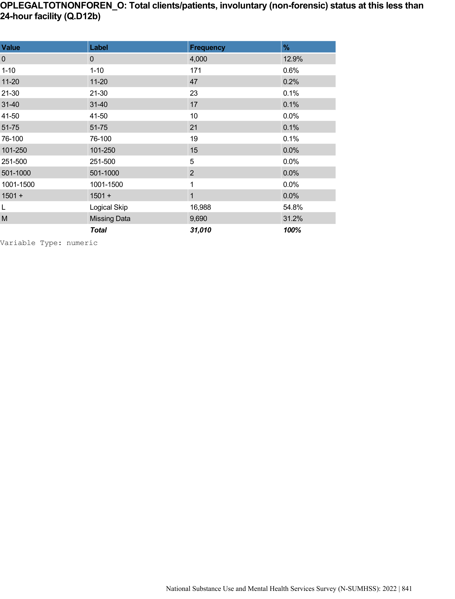

National Substance Use and Mental Health Services Survey (N-SUMHSS): 2022 | 841

# IONFOREN: Total clients/patients, involuntary, unrolled (non-forensic) status at this less than 24-hour facility, unrolled (Q.D12b)

| Value  | Label    | Frequency | %      |
|--------|----------|-----------|--------|
| 0      | 0        | 3,979     | 12.8%  |
| 1-10   | 1-10     | 236       | 0.8%   |
| 11-20  | 11-20    | 83        | 0.3%   |
| 21-30  | 21-30    | 23        | 0.1%   |
| 31-40  | 31-40    | 19        | 0.1%   |
| 41-50  | 41-50    | 20        | 0.1%   |
| 51-75  | 51-75    | 34        | 0.1%   |
| 76-100 | 76-100   | 19        | 0.1%   |
| 101-250| 101-250  | 39        | 0.1%   |
| 251-500| 251-500  | 2         | 0.0%   |
| 501-1000| 501-1000| 1         | 0.0%   |
| L      | Logical Skip | 15,002 | 48.4%  |
| M      | Missing Data | 11,553 | 37.3%  |

**Total:** 31,010  100%

**Variable Type:** numeric

National Substance Use and Mental Health Services Survey (N-SUMHSS): 2022 | 842

## ONFOREN: Percent clients/patients, involuntary (non-forensic) status at this less than 24-hour facility (Q.D12b)

| Value | Label       | Frequency | %     |
|-------|-------------|-----------|-------|
| 0     | 0           | 3,847     | 12.4% |
| 1-10  | 1-10        | 184       | 0.6%  |
| 11-20 | 11-20       | 33        | 0.1%  |
| 21-30 | 21-30       | 21        | 0.1%  |
| 31-40 | 31-40       | 8         | 0.0%  |
| 41-50 | 41-50       | 2         | 0.0%  |
| 51-60 | 51-60       | 3         | 0.0%  |
| 61-70 | 61-70       | 6         | 0.0%  |
| 71-80 | 71-80       | 2         | 0.0%  |
| 100   | 100         | 3         | 0.0%  |
| L     | Logical Skip| 18,548    | 59.8% |
| M     | Missing Data| 8,353     | 26.9% |

|       | **Total**   | **31,010**| **100%**|

Variable Type: numeric

National Substance Use and Mental Health Services Survey (N-SUMHSS): 2022 | 843

#OREN_O: Total clients/patients, involuntary (forensic) status at this less than 24-hour facility (Q.D12b)

| Value    | Label    | Frequency | %    |
|----------|----------|-----------|------|
| 0        | 0        | 4,142     | 13.4% |
| 1-10     | 1-10     | 104       | 0.3%  |
| 11-20    | 11-20    | 26        | 0.1%  |
| 21-30    | 21-30    | 14        | 0.0%  |
| 31-40    | 31-40    | 9         | 0.0%  |
| 41-50    | 41-50    | 7         | 0.0%  |
| 51-75    | 51-75    | 8         | 0.0%  |
| 76-100   | 76-100   | 7         | 0.0%  |
| 101-250  | 101-250  | 10        | 0.0%  |
| 251-500  | 251-500  | 4         | 0.0%  |
| 501-1000 | 501-1000 | 1         | 0.0%  |
| L        | Logical Skip | 16,988  | 54.8% |
| M        | Missing Data | 9,690   | 31.2% |

**Total**: 31,010 | 100%

Variable Type: numeric

National Substance Use and Mental Health Services Survey (N-SUMHSS): 2022 | 844

# OREN: Total clients/patients, involuntary, unrolled (forensic) status at this less than 24-hour facility, unrolled (Q.D12b)

| Value  | Label     | Frequency | %      |
|--------|-----------|-----------|--------|
| 0      | 0         | 4,138     | 13.3%  |
| 1-10   | 1-10      | 156       | 0.5%   |
| 11-20  | 11-20     | 32        | 0.1%   |
| 21-30  | 21-30     | 13        | 0.0%   |
| 31-40  | 31-40     | 8         | 0.0%   |
| 41-50  | 41-50     | 10        | 0.0%   |
| 51-75  | 51-75     | 9         | 0.0%   |
| 76-100 | 76-100    | 5         | 0.0%   |
| 101-250| 101-250   | 8         | 0.0%   |
| 251-500| 251-500   | 4         | 0.0%   |
| 501-1000| 501-1000 | 1         | 0.0%   |
| L      | Logical Skip | 15,002  | 48.4%  |
| M      | Missing Data | 11,624  | 37.5%  |
| **Total**|         | **31,010** | **100%** |

**Variable Type:** numeric

---

National Substance Use and Mental Health Services Survey (N-SUMHSS): 2022 | 845

**OREN: Percent clients/patients, involuntary (forensic) status at this less than 24-hour facility (Q.D12b)**

| Value | Label | Frequency | % |
|-------|-------|-----------|---|
| 0     | 0     | 3,953     | 12.7% |
| 1-10  | 1-10  | 113       | 0.4%  |
| 11-20 | 11-20 | 19        | 0.1%  |
| 21-30 | 21-30 | 9         | 0.0%  |
| 31-40 | 31-40 | 3         | 0.0%  |
| 41-50 | 41-50 | 3         | 0.0%  |
| 51-60 | 51-60 | 2         | 0.0%  |
| 61-70 | 61-70 | 1         | 0.0%  |
| 81-90 | 81-90 | 1         | 0.0%  |
| 91-99 | 91-99 | 1         | 0.0%  |
| 100   | 100   | 4         | 0.0%  |
| L     | Logical Skip | 18,548 | 59.8% |
| M     | Missing Data  | 8,353  | 26.9% |

**Total:** 31,010  100%

Variable Type: numeric

---

National Substance Use and Mental Health Services Survey (N-SUMHSS): 2022 | 846

#### R1: Percent of clients/patients with co-occurring mental health and substance use disorders (Q.D13)

| Value | Label       | Frequency | %       |
|-------|-------------|-----------|---------|
| 0     | 0           | 1,112     | 3.6%    |
| 1-10  | 1-10        | 948       | 3.1%    |
| 11-20 | 11-20       | 571       | 1.8%    |
| 21-30 | 21-30       | 558       | 1.8%    |
| 31-40 | 31-40       | 449       | 1.4%    |
| 41-50 | 41-50       | 387       | 1.2%    |
| 51-60 | 51-60       | 228       | 0.7%    |
| 61-70 | 61-70       | 209       | 0.7%    |
| 71-80 | 71-80       | 275       | 0.9%    |
| 81-90 | 81-90       | 139       | 0.4%    |
| 91-99 | 91-99       | 51        | 0.2%    |
| 100   | 100         | 206       | 0.7%    |
| L     | Logical Skip| 17,580    | 56.7%   |
| M     | Missing Data| 8,297     | 26.8%   |
|       | **Total**   | **31,010**| **100%**|

Variable Type: numeric

## Number of mental health admissions in 12 months period (Q.D14)

| Value    | Label    | Frequency | %    |
|----------|----------|-----------|------|
| 0        | 0        | 923       | 3.0% |
| 1-10     | 1-10     | 544       | 1.8% |
| 11-20    | 11-20    | 350       | 1.1% |
| 21-30    | 21-30    | 243       | 0.8% |
| 31-40    | 31-40    | 231       | 0.7% |
| 41-50    | 41-50    | 249       | 0.8% |
| 51-75    | 51-75    | 428       | 1.4% |
| 76-100   | 76-100   | 452       | 1.5% |
| 101-250  | 101-250  | 1,246     | 4.0% |
| 251-500  | 251-500  | 1,061     | 3.4% |
| 501-1000 | 501-1000 | 864       | 2.8% |
| 1001-1500| 1001-1500| 371       | 1.2% |
| 1501 +   | 1501 +   | 808       | 2.6% |
| L        | Logical Skip | 14,803 | 47.7% |
| M        | Missing Data | 8,437  | 27.2% |

**Total**            

**31,010**        

**100%**        

Variable Type: numeric

National Substance Use and Mental Health Services Survey (N-SUMHSS): 2022 | 848

# Percent of admissions that are Veterans (Q.D15)

| Value | Label | Frequency | % |
|-------|-------|-----------|----|
| 0     | 0     | 3,745     | 12.1% |
| 1-10  | 1-10  | 3,188     | 10.3% |
| 11-20 | 11-20 | 318       | 1.0% |
| 21-30 | 21-30 | 103       | 0.3% |
| 31-40 | 31-40 | 23        | 0.1% |
| 41-50 | 41-50 | 14        | 0.0% |
| 51-60 | 51-60 | 7         | 0.0% |
| 61-70 | 61-70 | 3         | 0.0% |
| 71-80 | 71-80 | 3         | 0.0% |
| 81-90 | 81-90 | 6         | 0.0% |
| 91-99 | 91-99 | 11        | 0.0% |
| 100   | 100   | 181       | 0.6% |
| L     | Logical Skip | 14,803 | 47.7% |
| M     | Missing Data | 8,605  | 27.7% |
|       | Total | 31,010    | 100% |

Variable Type: numeric

National Substance Use and Mental Health Services Survey (N-SUMHSS): 2022

## Total number of mental health clients

| Value  | Label       | Frequency | %     |
|--------|-------------|-----------|-------|
| 0      | 0           | 2,439     | 7.9%  |
| 1-10   | 1-10        | 812       | 2.6%  |
| 11-20  | 11-20       | 624       | 2.0%  |
| 21-30  | 21-30       | 331       | 1.1%  |
| 31-40  | 31-40       | 225       | 0.7%  |
| 41-50  | 41-50       | 229       | 0.7%  |
| 51-75  | 51-75       | 369       | 1.2%  |
| 76-100 | 76-100      | 316       | 1.0%  |
| 101-250| 101-250     | 830       | 2.7%  |
| 251-500| 251-500     | 560       | 1.8%  |
| 501-1000| 501-1000   | 488       | 1.6%  |
| 1001-1500|1001-1500  | 205       | 0.7%  |
| 1501 + | 1501 +      | 297       | 1.0%  |
| L      | Logical Skip| 11,574    | 37.3% |
| M      | Missing Data| 11,711    | 37.8% |

**Total** 31,010 100%

Variable Type: numeric

National Substance Use and Mental Health Services Survey (N-SUMHSS): 2022 | 850

number of mental health clients, unrolled

| Value | Label        | Frequency | %      |
|-------|--------------|-----------|--------|
| 0     | 0            | 2,443     | 7.9%   |
| 1-10  | 1-10         | 888       | 2.9%   |
| 11-20 | 11-20        | 662       | 2.1%   |
| 21-30 | 21-30        | 380       | 1.2%   |
| 31-40 | 31-40        | 243       | 0.8%   |
| 41-50 | 41-50        | 261       | 0.8%   |
| 51-75 | 51-75        | 421       | 1.4%   |
| 76-100| 76-100       | 353       | 1.1%   |
| 101-250| 101-250     | 952       | 3.1%   |
| 251-500| 251-500     | 704       | 2.3%   |
| 501-1000| 501-1000   | 611       | 2.0%   |
| 1001-1500| 1001-1500 | 220       | 0.7%   |
| 1501 +| 1501 +       | 256       | 0.8%   |
| L     | Logical Skip | 11,574    | 37.3%  |
| M     | Missing Data | 11,042    | 35.6%  |

**Total**: 31,010  &nbsp;&nbsp;&nbsp;&nbsp;&nbsp; **100%**

Variable Type: numeric

---

National Substance Use and Mental Health Services Survey (N-SUMHSS): 2022 | 851

>ffers evidence-based suicide prevention interventions (Q.VA1_SU)

| Value | Label          | Frequency | %      |
|-------|----------------|-----------|--------|
| 0     | No             | 3         | 0.0%   |
| 1     | Yes            | 352       | 1.1%   |
| L     | Logical Skip   | 22,710    | 73.2%  |
| M     | Missing Data   | 7,945     | 25.6%  |
|       | **Total**      | **31,010**| **100%**|

Variable Type: numeric

National Substance Use and Mental Health Services Survey (N-SUMHSS): 2022 | 852

## _SU: Offers suicide risk screening (Q.VA1_SU)

| Value | Label         | Frequency | %      |
|-------|---------------|-----------|--------|
| 0     | No            | 1         | 0.0%   |
| 1     | Yes           | 354       | 1.1%   |
| L     | Logical Skip  | 22,710    | 73.2%  |
| M     | Missing Data  | 7,945     | 25.6%  |
| **Total** |               | **31,010**  | **100%** |

Variable Type: numeric

National Substance Use and Mental Health Services Survey (N-SUMHSS): 2022 | 853

### SU: Offers suicide risk evaluation (Q.VA1_SU)

| Value | Label        | Frequency | %     |
|-------|--------------|-----------|-------|
| 1     | Yes          | 355       | 1.1%  |
| L     | Logical Skip | 22,710    | 73.2% |
| M     | Missing Data | 7,945     | 25.6% |

**Total**  |   |  31,010  |  **100%**

Variable Type: numeric

---

National Substance Use and Mental Health Services Survey (N-SUMHSS): 2022 | 854

**\_SU: None of the above are offered suicide-related services (Q.VA1_SU)**

| Value | Label         | Frequency | %    |
|-------|---------------|-----------|------|
| 0     | No            | 355       | 1.1% |
| L     | Logical Skip  | 22,710    | 73.2%|
| M     | Missing Data  | 7,945     | 25.6%|

**Total** | | **31,010** | **100%**

Variable Type: numeric

*National Substance Use and Mental Health Services Survey (N-SUMHSS): 2022 | 855*

## Uses Cognitive Therapy for Suicide Prevention (CBT-SP) (Q.VA2_SU):

| Value | Label        | Frequency | %      |
|-------|--------------|-----------|--------|
| 0     | No           | 149       | 0.5%   |
| 1     | Yes          | 198       | 0.6%   |
| L     | Logical Skip | 22,733    | 73.3%  |
| M     | Missing Data | 7,930     | 25.6%  |
|       | **Total**    | **31,010**| **100%**|

Variable Type: numeric

### es Cognitive Behavioral Therapy (CBT) (Q.VA2_SU)

| Value | Label        | Frequency | %      |
|-------|--------------|-----------|--------|
| 0     | No           | 23        | 0.1%   |
| 1     | Yes          | 324       | 1.0%   |
| L     | Logical Skip | 22,733    | 73.3%  |
| M     | Missing Data | 7,930     | 25.6%  |
| **Total** |              | **31,010**  | **100%** |

Variable Type: numeric

---

National Substance Use and Mental Health Services Survey (N-SUMHSS): 2022 | 857

### es Dialectical Behavior Therapy (DBT) (Q.VA2_SU)

| Value | Label        | Frequency | %     |
|-------|--------------|-----------|-------|
| 0     | No           | 123       | 0.4%  |
| 1     | Yes          | 224       | 0.7%  |
| L     | Logical Skip | 22,733    | 73.3% |
| M     | Missing Data | 7,930     | 25.6% |
| **Total** |              | **31,010**  | **100%** |

Variable Type: numeric

---

National Substance Use and Mental Health Services Survey (N-SUMHSS): 2022 | 858

## Problem Solving Therapy (PST) (Q.VA2_SU)

| Value | Label        | Frequency | %     |
|-------|--------------|-----------|-------|
| 0     | No           | 164       | 0.5%  |
| 1     | Yes          | 183       | 0.6%  |
| L     | Logical Skip | 22,733    | 73.3% |
| M     | Missing Data | 7,930     | 25.6% |
|       | **Total**    | **31,010**| **100%**|

Variable Type: numeric

National Substance Use and Mental Health Services Survey (N-SUMHSS): 2022 | 859

## U: Uses safety planning/crisis response planning (Q.VA2_SU)

| Value | Label        | Frequency |     %     |
|-------|--------------|-----------|-----------|
| 0     | No           | 125       | 0.4%      |
| 1     | Yes          | 222       | 0.7%      |
| L     | Logical Skip | 22,733    | 73.3%     |
| M     | Missing Data | 7,930     | 25.6%     |
|       | **Total**    | **31,010**| **100%**  |

Variable Type: numeric

National Substance Use and Mental Health Services Survey (N-SUMHSS): 2022 | 860

### es ketamine infusions (Q.VA2_SU)

| Value | Label        | Frequency | %     |
|-------|--------------|-----------|-------|
| 0     | No           | 320       | 1.0%  |
| 1     | Yes          | 26        | 0.1%  |
| L     | Logical Skip | 22,733    | 73.3% |
| M     | Missing Data | 7,931     | 25.6% |
|       | **Total**    | **31,010**| **100%** |

Variable Type: numeric

---
National Substance Use and Mental Health Services Survey (N-SUMHSS): 2022 | 861

### Is lithium treatment (Q.VA2_SU)

| Value | Label         | Frequency | %     |
|-------|---------------|-----------|-------|
| 0     | No            | 84        | 0.3%  |
| 1     | Yes           | 263       | 0.8%  |
| L     | Logical Skip  | 22,733    | 73.3% |
| M     | Missing Data  | 7,930     | 25.6% |

|       | **Total**     | 31,010    | **100%**|

Variable Type: numeric

---

National Substance Use and Mental Health Services Survey (N-SUMHSS): 2022 | 862

### ses clozapine treatment (Q.VA2_SU)

| Value | Label         | Frequency | %       |
|-------|---------------|-----------|---------|
| 0     | No            | 99        | 0.3%    |
| 1     | Yes           | 248       | 0.8%    |
| L     | Logical Skip  | 22,733    | 73.3%   |
| M     | Missing Data  | 7,930     | 25.6%   |
|       | **Total**     | **31,010**| **100%**|

Variable Type: numeric

---

National Substance Use and Mental Health Services Survey (N-SUMHSS): 2022 | 863

# _SU: Uses caring communications (Q.VA2_SU)

| Value | Label         | Frequency | %     |
|-------|---------------|-----------|-------|
| 0     | No            | 163       | 0.5%  |
| 1     | Yes           | 184       | 0.6%  |
| L     | Logical Skip  | 22,733    | 73.3% |
| M     | Missing Data  | 7,930     | 25.6% |

**Total: 31,010 100%**

Variable Type: numeric

---

National Substance Use and Mental Health Services Survey (N-SUMHSS): 2022 | 864

### Jses home support (Q.VA2_SU)

| Value | Label        | Frequency | %      |
|-------|--------------|-----------|--------|
| 0     | No           | 239       | 0.8%   |
| 1     | Yes          | 108       | 0.3%   |
| L     | Logical Skip | 22,733    | 73.3%  |
| M     | Missing Data | 7,930     | 25.6%  |
|       | **Total**    | **31,010**|**100%**|

Variable Type: numeric

---

National Substance Use and Mental Health Services Survey (N-SUMHSS): 2022 | 865

# J: Uses World Health Organization-Brief Intervention and Contact (WHO-BIC) (Q.VA2_SU)

| Value | Label | Frequency | %      |
|-------|-------|-----------|--------|
| 0     | No    | 337       | 1.1%   |
| 1     | Yes   | 10        | 0.0%   |
| L     | Logical Skip | 22,733 | 73.3% |
| M     | Missing Data | 7,930 | 25.6%   |
|       | Total | 31,010    | 100%   |

Variable Type: numeric

# U: Uses gate keeper training (Q.VA2_SU)

| Value | Label        | Frequency | %     |
|-------|--------------|-----------|-------|
| 0     | No           | 290       | 0.9%  |
| 1     | Yes          | 57        | 0.2%  |
| L     | Logical Skip | 22,733    | 73.3% |
| M     | Missing Data | 7,930     | 25.6% |

**Total**: **31,010** **100%**

Variable Type: numeric

---

National Substance Use and Mental Health Services Survey (N-SUMHSS): 2022 | 867

#### Uses lethal means safety counseling (Q.VA2_SU)

| Value | Label        | Frequency | %     |
|-------|--------------|-----------|-------|
| 0     | No           | 28        | 0.1%  |
| 1     | Yes          | 319       | 1.0%  |
| L     | Logical Skip | 22,733    | 73.3% |
| M     | Missing Data | 7,930     | 25.6% |

|       | Total        | 31,010    | 100%  |

Variable Type: numeric

---

National Substance Use and Mental Health Services Survey (N-SUMHSS): 2022 | 868

### _ SU: Uses other evidence-based suicide prevention interventions (Q.VA2_SU)

| Value | Label        | Frequency | %      |
|-------|--------------|-----------|--------|
| 0     | No           | 331       | 1.1%   |
| 1     | Yes          | 13        | 0.0%   |
| L     | Logical Skip | 22,733    | 73.3%  |
| M     | Missing Data | 7,933     | 25.6%  |
|       | **Total**    | **31,010**| **100%**|

Variable Type: numeric

National Substance Use and Mental Health Services Survey (N-SUMHSS): 2022 | 869

\_SU: Uses Columbia-Suicide Severity Rating Scale (C-SSRS) Screener (Q.VA3_SU)

| Value | Label         | Frequency | %     |
|-------|---------------|-----------|-------|
| 0     | No            | 1         | 0.0%  |
| 1     | Yes           | 348       | 1.1%  |
| L     | Logical Skip  | 22,731    | 73.3% |
| M     | Missing Data  | 7,930     | 25.6% |
|       | **Total**     | **31,010**| **100%**|

Variable Type: numeric

### Patient Health Questionnaire (PHQ-9) Item 9 (Q.VA3_SU)

| Value | Label        | Frequency | %      |
|-------|--------------|-----------|--------|
| 0     | No           | 35        | 0.1%   |
| 1     | Yes          | 326       | 1.1%   |
| L     | Logical Skip | 253       | 0.8%   |
| M     | Missing Data | 30,396    | 98.0%  |
|       | **Total**    | **31,010**| **100%** |

Variable Type: numeric

---

National Substance Use and Mental Health Services Survey (N-SUMHSS): 2022 | 871

# _JU: Uses other standardized suicide screening tools (Q.VA3_SU)

| Value | Label         | Frequency | %     |
|-------|---------------|-----------|-------|
| 0     | No            | 276       | 0.9%  |
| 1     | Yes           | 63        | 0.2%  |
| L     | Logical Skip  | 22,731    | 73.3% |
| M     | Missing Data  | 7,940     | 25.6% |
| **Total** |           | **31,010** | **100%** |

Variable Type: numeric

## Q.VA3_SU: None of the above standardized suicide screening tools (Q.VA3_SU)

| Value | Label         | Frequency | %     |
|-------|---------------|-----------|-------|
| 0     | No            | 349       | 1.1%  |
| L     | Logical Skip  | 22,730    | 73.3% |
| M     | Missing Data  | 7,931     | 25.6% |
|       | **Total**     | **31,010**| **100%** |

Variable Type: numeric

---

National Substance Use and Mental Health Services Survey (N-SUMHSS): 2022 | 873

# ._SU: Uses Columbia-Suicide Severity Rating Scale (C-SSRS) (Q.VA4_SU)

| Value | Label        | Frequency | %     |
|-------|--------------|-----------|-------|
| 0     | No           | 2         | 0.0%  |
| 1     | Yes          | 348       | 1.1%  |
| L     | Logical Skip | 22,730    | 73.3% |
| M     | Missing Data | 7,930     | 25.6% |
| **Total** |      | **31,010**   | **100%** |

Variable Type: numeric

National Substance Use and Mental Health Services Survey (N-SUMHSS): 2022 | 874

### es the Mini International Neuropsychiatric Interview (MINI) (Q.VA4_SU)

| Value | Label          | Frequency | %     |
|-------|----------------|-----------|-------|
| 0     | No             | 290       | 0.9%  |
| 1     | Yes            | 60        | 0.2%  |
| L     | Logical Skip   | 22,730    | 73.3% |
| M     | Missing Data   | 7,930     | 25.6% |
|       | **Total**      | **31,010**| **100%**|

Variable Type: numeric

National Substance Use and Mental Health Services Survey (N-SUMHSS): 2022 | 875

### Ises VA Comprehensive Suicide Risk Evaluation (CSRE) (Q.VA4_SU)

| Value | Label         | Frequency | %     |
|-------|---------------|-----------|-------|
| 1     | Yes           | 350       | 1.1%  |
| L     | Logical Skip  | 22,730    | 73.3% |
| M     | Missing Data  | 7,930     | 25.6% |
|       | **Total**     | **31,010**| **100%**|

**Variable Type:** numeric

---

National Substance Use and Mental Health Services Survey (N-SUMHSS): 2022 | 876

# Uses Suicide Assessment Five-step Evaluation and Triage (SAFE-T) (Q.VA4_SU)

| Value | Label         | Frequency | %    |
|-------|---------------|-----------|------|
| 0     | No            | 297       | 1.0% |
| 1     | Yes           | 53        | 0.2% |
| L     | Logical Skip  | 22,730    | 73.3%|
| M     | Missing Data  | 7,930     | 25.6%|
|       | **Total**     | **31,010**|**100%**|

Variable Type: numeric

National Substance Use and Mental Health Services Survey (N-SUMHSS): 2022 | 877

**-U: Uses other standardized suicide evaluation tools (Q.VA4_SU)**

| Value | Label        | Frequency | %      |
|-------|--------------|-----------|--------|
| 0     | No           | 335       | 1.1%   |
| 1     | Yes          | 14        | 0.0%   |
| L     | Logical Skip | 22,730    | 73.3%  |
| M     | Missing Data | 7,931     | 25.6%  |
|       | **Total**    | **31,010**| **100%**|

Variable Type: numeric

---

National Substance Use and Mental Health Services Survey (N-SUMHSS): 2022 | 878

## Q.VA4_SU: None of the above standardized suicide evaluation tools (Q.VA4_SU)

| Value | Label         | Frequency | %      |
|-------|---------------|-----------|--------|
| 0     | No            | 349       | 1.1%   |
| L     | Logical Skip  | 22,730    | 73.3%  |
| M     | Missing Data  | 7,931     | 25.6%  |

**Total: 31,010 (100%)**

Variable Type: numeric

---

National Substance Use and Mental Health Services Survey (N-SUMHSS): 2022 | 879

# _SU: Hospital inpatients identified as high risk of suicide (Q.VA5_SU)

| Value | Label        | Frequency | %     |
|-------|--------------|-----------|-------|
| 0     | 0            | 7         | 0.0%  |
| 1-10  | 1-10         | 19        | 0.1%  |
| 11-20 | 11-20        | 1         | 0.0%  |
| 501-1000 | 501-1000  | 1         | 0.0%  |
| L     | Logical Skip | 23,048    | 74.3% |
| M     | Missing Data | 7,934     | 25.6% |

**Total**: **31,010** **100%**

Variable Type: numeric

---

National Substance Use and Mental Health Services Survey (N-SUMHSS): 2022 | 880

## _SU: Residential clients identified as high risk of suicide (Q.VA6_SU)

| Value | Label         | Frequency | %      |
|-------|---------------|-----------|--------|
| 0     | 0             | 12        | 0.0%   |
| 1-10  | 1-10          | 35        | 0.1%   |
| 11-20 | 11-20         | 4         | 0.0%   |
| 31-40 | 31-40         | 1         | 0.0%   |
| 76-100| 76-100        | 1         | 0.0%   |
| 101-250| 101-250      | 1         | 0.0%   |
| L     | Logical Skip  | 23,023    | 74.2%  |
| M     | Missing Data  | 7,933     | 25.6%  |
|       | **Total**     | **31,010**| **100%**|

Variable Type: numeric

---

National Substance Use and Mental Health Services Survey (N-SUMHSS): 2022 | 881

> _SU: Outpatient clients identified as high risk of suicide (Q.VA7_SU)

| Value  | Label     | Frequency | %     |
|--------|-----------|-----------|-------|
| 0      | 0         | 36        | 0.1%  |
| 1-10   | 1-10      | 73        | 0.2%  |
| 11-20  | 11-20     | 12        | 0.0%  |
| 21-30  | 21-30     | 17        | 0.1%  |
| 31-40  | 31-40     | 5         | 0.0%  |
| 41-50  | 41-50     | 4         | 0.0%  |
| 51-75  | 51-75     | 6         | 0.0%  |
| 76-100 | 76-100    | 1         | 0.0%  |
| 101-250| 101-250   | 5         | 0.0%  |
| 251-500| 251-500   | 2         | 0.0%  |
| 501-1000| 501-1000 | 1         | 0.0%  |
| L      | Logical Skip | 22,902 | 73.9% |
| M      | Missing Data | 7,946  | 25.6% |
| Total  |           | 31,010   | 100%  |

Variable Type: numeric

---

National Substance Use and Mental Health Services Survey (N-SUMHSS): 2022 | 882

#### andardized process for referring clients based on treatment plan (Q.VA1_MH)

| Value | Label        | Frequency | %      |
|-------|--------------|-----------|--------|
| 0     | No           | 7         | 0.0%   |
| 1     | Yes          | 368       | 1.2%   |
| L     | Logical Skip | 22,692    | 73.2%  |
| M     | Missing Data | 7,943     | 25.6%  |
|       | **Total**    | **31,010**| **100%**|

Variable Type: numeric

---

National Substance Use and Mental Health Services Survey (N-SUMHSS): 2022 | 883

| Value | Label        | Frequency | %     |
|-------|--------------|-----------|-------|
| 0     | No           | 1         | 0.0%  |
| 1     | Yes          | 374       | 1.2%  |
| L     | Logical Skip | 22,692    | 73.2% |
| M     | Missing Data | 7,943     | 25.6% |
|       | Total        | 31,010    | 100%  |

Variable Type: numeric

National Substance Use and Mental Health Services Survey (N-SUMHSS): 2022 | 884

### Offers lethal means safety training (Q.VA3_MH)

| Value | Label        | Frequency | %      |
|-------|--------------|-----------|--------|
| 0     | No           | 27        | 0.1%   |
| 1     | Yes          | 345       | 1.1%   |
| L     | Logical Skip | 22,692    | 73.2%  |
| M     | Missing Data | 7,946     | 25.6%  |
|       | **Total**    | **31,010**| **100%**|

Variable Type: numeric

National Substance Use and Mental Health Services Survey (N-SUMHSS): 2022 | 885

_MH: Offers free gun locks (Q.VA3_MH)

| Value | Label       | Frequency | %      |
|-------|-------------|-----------|--------|
| 0     | No          | 6         | 0.0%   |
| 1     | Yes         | 369       | 1.2%   |
| L     | Logical Skip| 22,692    | 73.2%  |
| M     | Missing Data| 7,943     | 25.6%  |
|       | **Total**   | **31,010**| **100%**|

Variable Type: numeric

National Substance Use and Mental Health Services Survey (N-SUMHSS): 2022 | 886

### Offers community outreach of workshops (Q.VA3_MH)

| Value | Label         | Frequency | %      |
|-------|---------------|-----------|--------|
| 0     | No            | 43        | 0.1%   |
| 1     | Yes           | 332       | 1.1%   |
| L     | Logical Skip  | 22,692    | 73.2%  |
| M     | Missing Data  | 7,943     | 25.6%  |
|       | **Total**     | **31,010**|**100%**|

Variable Type: numeric

---

National Substance Use and Mental Health Services Survey (N-SUMHSS): 2022 | 887

#### _MH: None of these suicide prevention services (Q.VA3_MH)

| Value | Label        | Frequency | %     |
|-------|--------------|-----------|-------|
| 0     | No           | 374       | 1.2%  |
| L     | Logical Skip | 22,692    | 73.2% |
| M     | Missing Data | 7,944     | 25.6% |
|       | **Total**    | **31,010**| **100%**|

Variable Type: numeric

National Substance Use and Mental Health Services Survey (N-SUMHSS): 2022 | 888

#### Staff are trained when they begin working (Q.VA4_MH)

| Value | Label        | Frequency | %     |
|-------|--------------|-----------|-------|
| 0     | No           | 8         | 0.0%  |
| 1     | Yes          | 352       | 1.1%  |
| L     | Logical Skip | 22,708    | 73.2% |
| M     | Missing Data | 7,942     | 25.6% |
|       | **Total**    | **31,010**| **100%**|

Variable Type: numeric

National Substance Use and Mental Health Services Survey (N-SUMHSS): 2022 | 889

### MH: Trainings are held at regular intervals (Q.VA4_MH)

| Value | Label        | Frequency | %     |
|-------|--------------|-----------|-------|
| 0     | No           | 3         | 0.0%  |
| 1     | Yes          | 357       | 1.2%  |
| L     | Logical Skip | 22,708    | 73.2% |
| M     | Missing Data | 7,942     | 25.6% |

|       | **Total**    | **31,010**| **100%** |

Variable Type: numeric

---

National Substance Use and Mental Health Services Survey (N-SUMHSS): 2022 | 890

# H: Staff not trained on suicide prevention strategies (Q.VA4_MH)

| Value | Label          | Frequency | %      |
|-------|----------------|-----------|--------|
| 0     | No             | 359       | 1.2%   |
| L     | Logical Skip   | 22,708    | 73.2%  |
| M     | Missing Data   | 7,943     | 25.6%  |
|       | **Total**      | **31,010**| **100%**|

Variable Type: numeric

National Substance Use and Mental Health Services Survey (N-SUMHSS): 2022 | 891

ID_MH: Suicide risk screening program, indicated (Q.VA5_MH)

| Value | Label         | Frequency | %      |
|-------|---------------|-----------|--------|
| 0     | No            | 64        | 0.2%   |
| 1     | Yes           | 296       | 1.0%   |
| L     | Logical Skip  | 22,708    | 73.2%  |
| M     | Missing Data  | 7,942     | 25.6%  |
|       | **Total**     | **31,010**| **100%**|

Variable Type: numeric

National Substance Use and Mental Health Services Survey (N-SUMHSS): 2022

892

## EL_MH: Suicide risk screening program, selected (Q.VA5_MH)
    
| Value | Label        | Frequency | %     |
|-------|--------------|-----------|-------|
| 0     | No           | 65        | 0.2%  |
| 1     | Yes          | 295       | 1.0%  |
| L     | Logical Skip | 22,708    | 73.2% |
| M     | Missing Data | 7,942     | 25.6% |
|       | **Total**    | **31,010**| **100%** |

Variable Type: numeric

---

National Substance Use and Mental Health Services Survey (N-SUMHSS): 2022 | 893

# NIV_MH: Suicide risk screening program, universal (Q.VA5_MH)

| Value | Label        | Frequency | %     |
|-------|--------------|-----------|-------|
| 0     | No           | 16        | 0.1%  |
| 1     | Yes          | 344       | 1.1%  |
| L     | Logical Skip | 22,708    | 73.2% |
| M     | Missing Data | 7,942     | 25.6% |
| **Total** |  | **31,010** | **100%** |

Variable Type: numeric

G_MH: No suicide risk screening program (Q.VA5_MH)

| Value | Label        | Frequency | %     |
|-------|--------------|-----------|-------|
| 0     | No           | 359       | 1.2%  |
| L     | Logical Skip | 22,708    | 73.2% |
| M     | Missing Data | 7,943     | 25.6% |

**Total**  |   | 31,010    | **100%** |

Variable Type: numeric

National Substance Use and Mental Health Services Survey (N-SUMHSS): 2022 | 895

#### Identifies warning signs for suicide and violence (Q.VA6_MH)
| Value | Label         | Frequency | %      |
|-------|---------------|-----------|--------|
| 1     | Yes           | 62        | 0.2%   |
| L     | Logical Skip  | 23,019    | 74.2%  |
| M     | Missing Data  | 7,929     | 25.6%  |
|       | **Total**     | **31,010**| **100%**|

Variable Type: numeric

*National Substance Use and Mental Health Services Survey (N-SUMHSS): 2022*

K: Assesses each client level of risk for suicide (Q.VA7_MH)

| Value | Label        | Frequency |     %     |
|-------|--------------|-----------|-----------|
| 0     | No           | 3         | 0.0%      |
| 1     | Yes          | 357       | 1.2%      |
| L     | Logical Skip | 22,708    | 73.2%     |
| M     | Missing Data | 7,942     | 25.6%     |

|       | Total        | 31,010    | **100%**  |

Variable Type: numeric

National Substance Use and Mental Health Services Survey (N-SUMHSS): 2022 | 897

## Maintains a list of clients who are high risk for suicide (Q.VA8_MH)

| Value | Label        | Frequency | %      |
|-------|--------------|-----------|--------|
| 0     | No           | 10        | 0.0%   |
| 1     | Yes          | 350       | 1.1%   |
| L     | Logical Skip | 22,708    | 73.2%  |
| M     | Missing Data | 7,942     | 25.6%  |
| **Total** | **31,010**   | **100%** |

Variable Type: numeric

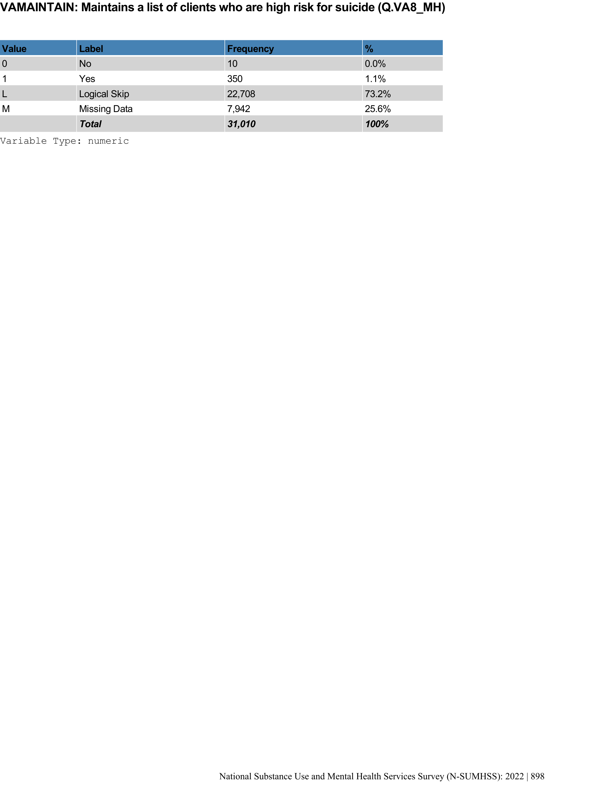

National Substance Use and Mental Health Services Survey (N-SUMHSS): 2022 | 898

### D: Process for ensuring high risk for suicide clients are followed up with (Q.VA8a_MH)

| Value | Label         | Frequency | %     |
|-------|---------------|-----------|-------|
| 0     | No            | 1         | 0.0%  |
| 1     | Yes           | 346       | 1.1%  |
| L     | Logical Skip  | 22,736    | 73.3% |
| M     | Missing Data  | 7,927     | 25.6% |

**Total** | **31,010** | **100%**

Variable Type: numeric

National Substance Use and Mental Health Services Survey (N-SUMHSS): 2022

## Ill-time Suicide Prevention Coordinators (SPCs) employed at this facility (Q.VA9_MH)

| Value | Label        | Frequency | %    |
|-------|--------------|-----------|------|
| 0     | 0            | 93        | 0.3% |
| 1-10  | 1-10         | 266       | 0.9% |
| 31-40 | 31-40        | 1         | 0.0% |
| L     | Logical Skip | 22,708    | 73.2%|
| M     | Missing Data | 7,942     | 25.6%|

**Total**: 31,010 **100%**

Variable Type: numeric

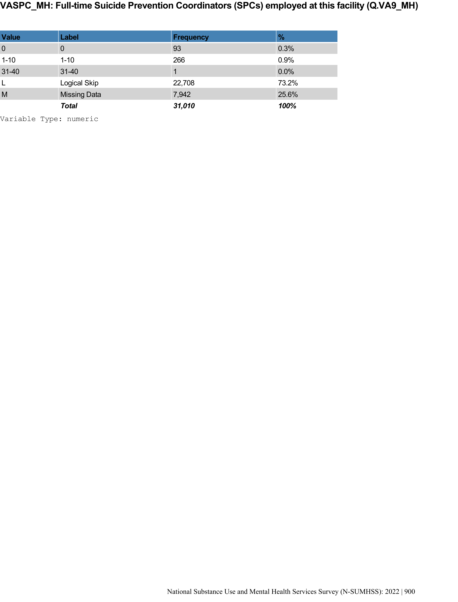

_National Substance Use and Mental Health Services Survey (N-SUMHSS): 2022 | 900_

_MH: Full-time care managers employed at this facility (Q.VA9_MH)_

| Value | Label        | Frequency | %     |
|-------|--------------|-----------|-------|
| 0     | 0            | 194       | 0.6%  |
| 1-10  | 1-10         | 163       | 0.5%  |
| 11-20 | 11-20        | 3         | 0.0%  |
| L     | Logical Skip | 22,708    | 73.2% |
| M     | Missing Data | 7,942     | 25.6% |

**Total** | 31,010 | 100%

Variable Type: numeric

National Substance Use and Mental Health Services Survey (N-SUMHSS): 2022 | 901

# _MH: Full-time program support assistants employed at this facility (Q.VA9_MH)

| Value | Label        | Frequency | %     |
|-------|--------------|-----------|-------|
| 0     | 0            | 214       | 0.7%  |
| 1-10  | 1-10         | 144       | 0.5%  |
| 21-30 | 21-30        | 2         | 0.0%  |
| L     | Logical Skip | 22,708    | 73.2% |
| M     | Missing Data | 7,942     | 25.6% |

**Total**: 31,010

**Variable Type**: numeric
  
National Substance Use and Mental Health Services Survey (N-SUMHSS): 2022 | 902

# _MH: Hospital inpatients identified as high risk of suicide (Q.VA10_MH)

| Value | Label       | Frequency | %      |
|-------|-------------|-----------|--------|
| 0     | 0           | 5         | 0.0%   |
| 1-10  | 1-10        | 22        | 0.1%   |
| 11-20 | 11-20       | 3         | 0.0%   |
| 101-250 | 101-250     | 1         | 0.0%   |
| L     | Logical Skip | 23,048    | 74.3%  |
| M     | Missing Data | 7,931     | 25.6%  |
|       | **Total**     | **31,010** | **100%** |

Variable Type: numeric

## \(c\_MH\): Residential clients identified as high risk of suicide (Q.VA11\_MH)

| Value | Label        | Frequency | %       |
|-------|--------------|-----------|---------|
| 0     | 0            | 8         | 0.0%    |
| 1-10  | 1-10         | 16        | 0.1%    |
| 11-20 | 11-20        | 3         | 0.0%    |
| 31-40 | 31-40        | 1         | 0.0%    |
| L     | Logical Skip | 23,055    | 74.3%   |
| M     | Missing Data | 7,927     | 25.6%   |
|       | Total        | 31,010    | 100%    |

Variable Type: numeric

National Substance Use and Mental Health Services Survey (N-SUMHSS): 2022 | 904

## _MH: Outpatient clients identified as high risk of suicide (Q.VA12_MH)

| Value  | Label      | Frequency | %     |
|--------|------------|-----------|-------|
| 0      | 0          | 9         | 0.0%  |
| 1-10   | 1-10       | 37        | 0.1%  |
| 11-20  | 11-20      | 8         | 0.0%  |
| 21-30  | 21-30      | 1         | 0.0%  |
| 31-40  | 31-40      | 2         | 0.0%  |
| 51-75  | 51-75      | 2         | 0.0%  |
| 76-100 | 76-100     | 3         | 0.0%  |
| 101-250| 101-250    | 3         | 0.0%  |
| 251-500| 251-500    | 1         | 0.0%  |
| 501-1000| 501-1000  | 1         | 0.0%  |
| L      | Logical Skip | 23,008  | 74.2% |
| M      | Missing Data | 7,935   | 25.6% |

**Total**: 31,010 (100%)

Variable Type: numeric

National Substance Use and Mental Health Services Survey (N-SUMHSS): 2022 | 905

| Value | Label                               | Frequency | %      |
|-------|-------------------------------------|-----------|--------|
| 1     | Treatment/detoxification            | 14,854    | 47.9%  |
| 2     | Non-treatment halfway house         | 22        | 0.1%   |
| 3     | Did not take survey                 | 6,016     | 19.4%  |
| 4     | Jail                                | 2         | 0.0%   |
| 5     | Solo practice                       | 4         | 0.0%   |
| M     | Missing Data                        | 10,112    | 32.6%  |
| **Total** | **31,010**   | **100%** |

Variable Type: numeric

National Substance Use and Mental Health Services Survey (N-SUMHSS): 2022 | 906

### ion/exclusion flag for mental health report

| Value | Label                    | Frequency | %    |
|-------|--------------------------|-----------|------|
| 1     | Treatment/detoxification | 9,586     | 30.9%|
| M     | Missing Data             | 21,424    | 69.1%|
|       | **Total**                | **31,010**|**100%**|

Variable Type: numeric

National Substance Use and Mental Health Services Survey (N-SUMHSS): 2022 | 907
