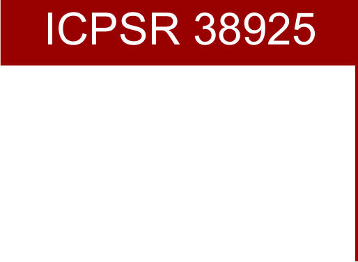

National Incident-Based Reporting System, 2022: Extract Files

United States. Bureau of Justice Statistics

ICPSR Codebook for Incident-Level File

Inter-university Consortium for Political and Social Research  
P.O. Box 1248  
Ann Arbor, Michigan 48106  
www.icpsr.umich.edu


## Terms of Use

The terms of use for this study can be found at:
[http://www.icpsr.umich.edu/web/ICPSR/studies/38925/terms](http://www.icpsr.umich.edu/web/ICPSR/studies/38925/terms)

## Information about Copyrighted Content

Some instruments administered for studies archived with ICPSR may contain in whole or substantially in part contents from copyrighted instruments. Reproductions of the instruments are provided as documentation for the analysis of the data associated with this collection. Restrictions on “fair use” apply to all copyrighted content. More information about the reproduction of copyrighted works by educators and librarians is available from the United States Copyright Office.

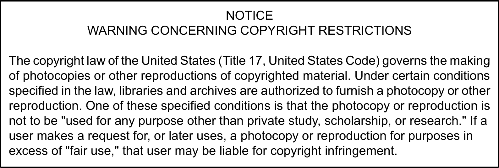


ICPSR PROCESSING NOTES FOR #38925  
National Incident-Based Reporting System, 2022: Extract Files  
DS 0003: Incident-Level File  

1. **Unlabeled Values**:

    a. The variable `FIPS_STATE` is unlabeled in the data. Please see the P.I. documentation for labels for this variable. In addition, the following value has the label:
      
      66 Guam

    b. The variable `BH017` has an unlabeled value. Please see the P.I. documentation for labels for this variable.

2. **Stata Limitations**: Due to Stata limitations, the variables `BH014`, `BH016`, `SEGMENT`, `V1012`, `V4017C1`, `V4017C2`, `V4017C3`, `V60071`, `V60072`, `V60073`, `V40181`, `V40182` and `V40183` do not contain value labels for non-integer values within the Stata files.

3. **Data/Documentation Discrepancies**: A number of variables in the data do not match their description in the P.I. documentation.


# ICPSR 38925

## National Incident-Based Reporting System, 2022: Extract Files

### Variable Description and Frequencies

**Note:** Frequencies displayed for the variables are not weighted. They are purely descriptive and may not be representative of the study population. Please review any sampling or weighting information available with the study.

Summary statistics (minimum, maximum, arithmetic mean, median, mode, and standard deviation) may not be available for every variable in the codebook. Conversely, a listing of frequencies in table format may not be present for every variable in the codebook either. However, all variables in the dataset are present and display sufficient information about each variable. These decisions are made intentionally and are at the discretion of the archive producing this codebook.


# Incident-Level File

## SEGMENT: SEGMENT LEVEL

|   | Unweighted Frequency | %       |
|---|-|-|
| 01 | 11207634             | 100.0 % |
| 1  | Admin segment        | 0       | 0.0 % |
| 4  | Victim segment       | 0       | 0.0 % |
| 5  | Offender segment     | 0       | 0.0 % |
| 6  | Arrestee segment     | 0       | 0.0 % |
| 7  | Group B arrest segment | 0       | 0.0 % |
| W1 | Window exceptional clearance segment | 0       | 0.0 % |
| W6 | Window arrest segment | 0       | 0.0 % |
| Total | 11,207,634         | 100 %   |

Based upon 11,207,634 valid cases out of 11,207,634 total cases.

*Location: 1-2 (width: 2; decimal: 0)*
*Variable Type: character*

## STATE: NUMERIC STATE CODE

| Value | Label | Unweighted Frequency | %   |
|-------|-|--------------------------|-|
| 1     | AL    | 214804               | 1.9 % |
| 2     | AZ    | 189010               | 1.7 % |
| 3     | AR    | 176545               | 1.6 % |
| 4     | CA    | 737745               | 6.6 % |
| 5     | CO    | 327646               | 2.9 % |
| 6     | CT    | 112134               | 1.0 % |
| 7     | DE    | 52741                | 0.5 % |
| 8     | DC    | 59726                | 0.5 % |
| 9     | FL    | 213003               | 1.9 % |
| 10    | GA    | 397697               | 3.5 % |
| 11    | ID    | 61845                | 0.6 % |
| 12    | IL    | 441504               | 3.9 % |
| 13    | IN    | 211350               | 1.9 % |
| 14    | IA    | 97542                | 0.9 % |
| 15    | KS    | 135768               | 1.2 % |
| 16    | KY    | 143680               | 1.3 % |
| 17    | LA    | 189649               | 1.7 % |
| 18    | ME    | 39394                | 0.4 % |
| 19    | MD    | 190103               | 1.7 % |


|      |                 | Unweighted  |      |
|------|-----------------|-------------|------|
| 20   | MA              | 192909      | 1.7% |
| 21   | MI              | 413881      | 3.7% |
| 22   | MN              | 230065      | 2.1% |
| 23   | MS              | 79389       | 0.7% |
| 24   | MO              | 299487      | 2.7% |
| 25   | MT              | 44893       | 0.4% |
| 26   | NB              | 57317       | 0.5% |
| 27   | NV              | 181697      | 1.6% |
| 28   | NH              | 45144       | 0.4% |
| 29   | NJ              | 164989      | 1.5% |
| 30   | NM              | 126145      | 1.1% |
| 31   | NY              | 145000      | 1.3% |
| 32   | NC              | 499698      | 4.5% |
| 33   | ND              | 40714       | 0.4% |
| 34   | OH              | 458532      | 4.1% |
| 35   | OK              | 213866      | 1.9% |
| 36   | OR              | 212742      | 1.9% |
| 37   | PA              | 231170      | 2.1% |
| 38   | RI              | 34017       | 0.3% |
| 39   | SC              | 296482      | 2.6% |
| 40   | SD              | 40861       | 0.4% |
| 41   | TN              | 402260      | 3.6% |
| 42   | TX              | 1517128     | 13.5%|
| 43   | UT              | 152007      | 1.4% |
| 44   | VT              | 19238       | 0.2% |
| 45   | VA              | 356083      | 3.2% |
| 46   | WA              | 424190      | 3.8% |
| 47   | WV              | 46162       | 0.4% |
| 48   | WI              | 198674      | 1.8% |
| 49   | WY              | 18176       | 0.2% |
| 50   | AK              | 14063       | 0.1% |
|      | Total           | 11,207,634  | 100% |

Please note that only the first 50 response categories are displayed in the PDF codebook. To view all response categories, please analyze the data file in the statistical package of your choice (SAS, SPSS, Stata, R).

Based upon 11,207,634 valid cases out of 11,207,634 total cases.

- Minimum: 1.00
- Maximum: 55.00

Location: 3-4 (width: 2; decimal: 0)     
Variable Type: numeric


## FIPS_STATE: FIPS State Numeric Code

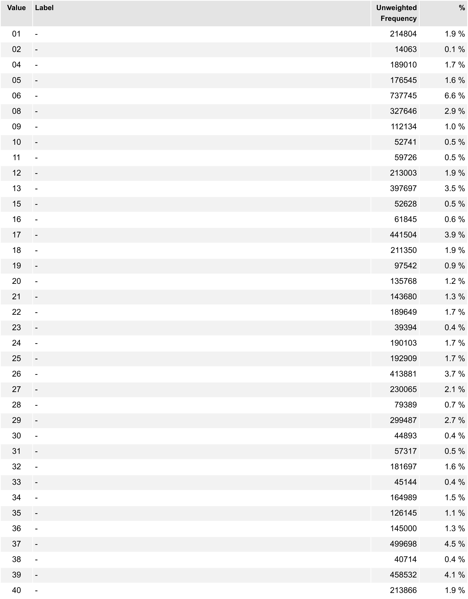

|        | Unweighted Frequency | %      |
|--------|-----------------------|--------|
| 01 -   | 214804                | 1.9 %  |
| 02 -   | 14063                 | 0.1 %  |
| 04 -   | 189010                | 1.7 %  |
| 05 -   | 176545                | 1.6 %  |
| 06 -   | 737745                | 6.6 %  |
| 08 -   | 327646                | 2.9 %  |
| 09 -   | 112134                | 1.0 %  |
| 10 -   | 52741                 | 0.5 %  |
| 11 -   | 59726                 | 0.5 %  |
| 12 -   | 213003                | 1.9 %  |
| 13 -   | 397697                | 3.5 %  |
| 15 -   | 52628                 | 0.5 %  |
| 16 -   | 61845                 | 0.6 %  |
| 17 -   | 441504                | 3.9 %  |
| 18 -   | 211350                | 1.9 %  |
| 19 -   | 97542                 | 0.9 %  |
| 20 -   | 135768                | 1.2 %  |
| 21 -   | 143680                | 1.3 %  |
| 22 -   | 189649                | 1.7 %  |
| 23 -   | 39394                 | 0.4 %  |
| 24 -   | 190103                | 1.7 %  |
| 25 -   | 192909                | 1.7 %  |
| 26 -   | 413881                | 3.7 %  |
| 27 -   | 230065                | 2.1 %  |
| 28 -   | 79389                 | 0.7 %  |
| 29 -   | 299487                | 2.7 %  |
| 30 -   | 44893                 | 0.4 %  |
| 31 -   | 57317                 | 0.5 %  |
| 32 -   | 181697                | 1.6 %  |
| 33 -   | 45144                 | 0.4 %  |
| 34 -   | 164989                | 1.5 %  |
| 35 -   | 126145                | 1.1 %  |
| 36 -   | 145000                | 1.3 %  |
| 37 -   | 499698                | 4.5 %  |
| 38 -   | 40714                 | 0.4 %  |
| 39 -   | 458532                | 4.1 %  |
| 40 -   | 213866                | 1.9 %  |


#### 7_0.png

|      | Unweighted Frequency | %      |
|------|-----------------------|--------|
| 41   | 212742                | 1.9 %  |
| 42   | 231170                | 2.1 %  |
| 44   | 34017                 | 0.3 %  |
| 45   | 296482                | 2.6 %  |
| 46   | 40861                 | 0.4 %  |
| 47   | 402260                | 3.6 %  |
| 48   | 1517128               | 13.5 % |
| 49   | 152007                | 1.4 %  |
| 50   | 19238                 | 0.2 %  |
| 51   | 356083                | 3.2 %  |
| 53   | 424190                | 3.8 %  |
| 54   | 46162                 | 0.4 %  |
| 55   | 198674                | 1.8 %  |
| **Total** | **11,207,634**         | **100%** |

Please note that only the first 50 response categories are displayed in the PDF codebook. To view all response categories, please analyze the data file in the statistical package of your choice (SAS, SPSS, Stata, R).

Based upon 11,207,634 valid cases out of 11,207,634 total cases.

Location: 5-6 (width: 2; decimal: 0)

Variable Type: character

#### 7_1.png

**ORI: REPORTING AGENCY IDENTIFIER**

Based upon 11,207,634 valid cases out of 11,207,634 total cases.

Location: 7-15 (width: 9; decimal: 0)

Variable Type: character

**INCNUM: INCIDENT NUMBER**

Based upon 11,207,634 valid cases out of 11,207,634 total cases.

Location: 16-27 (width: 12; decimal: 0)

Variable Type: character

#### 7_2.png

|            | Label | Unweighted Frequency | %      |
|------------|-------|-----------------------|--------|
| 01-APR-2022| -     | 39888                 | 0.4 %  |
| 01-AUG-2022| -     | 39794                 | 0.4 %  |
| 01-DEC-2022| -     | 33878                 | 0.3 %  |
| 01-FEB-2022| -     | 36377                 | 0.3 %  |
| 01-JAN-2022| -     | 38635                 | 0.3 %  |
| 01-JUL-2022| -     | 41053                 | 0.4 %  |
| 01-JUN-2022| -     | 39146                 | 0.3 %  |


|                    | Label | Unweighted Frequency | %    |
|--------------------|-------|----------------------|------|
| 01-MAR-2022        | -     | 37339                | 0.3% |
| 01-MAY-2022        | -     | 34840                | 0.3% |
| 01-NOV-2022        | -     | 36750                | 0.3% |
| 01-OCT-2022        | -     | 35756                | 0.3% |
| 01-SEP-2022        | -     | 38514                | 0.3% |
| 02-APR-2022        | -     | 30150                | 0.3% |
| 02-AUG-2022        | -     | 32641                | 0.3% |
| 02-DEC-2022        | -     | 32598                | 0.3% |
| 02-FEB-2022        | -     | 28783                | 0.3% |
| 02-JAN-2022        | -     | 22500                | 0.2% |
| 02-JUL-2022        | -     | 31906                | 0.3% |
| 02-JUN-2022        | -     | 32832                | 0.3% |
| 02-MAR-2022        | -     | 31230                | 0.3% |
| 02-MAY-2022        | -     | 33224                | 0.3% |
| 02-NOV-2022        | -     | 32062                | 0.3% |
| 02-OCT-2022        | -     | 28832                | 0.3% |
| 02-SEP-2022        | -     | 35583                | 0.3% |
| 03-APR-2022        | -     | 28294                | 0.3% |
| 03-AUG-2022        | -     | 32759                | 0.3% |
| 03-DEC-2022        | -     | 28508                | 0.3% |
| 03-FEB-2022        | -     | 26102                | 0.2% |
| 03-JAN-2022        | -     | 27328                | 0.2% |
| 03-JUL-2022        | -     | 30026                | 0.3% |
| 03-JUN-2022        | -     | 34363                | 0.3% |
| 03-MAR-2022        | -     | 31672                | 0.3% |
| 03-MAY-2022        | -     | 32193                | 0.3% |
| 03-NOV-2022        | -     | 31805                | 0.3% |
| 03-OCT-2022        | -     | 32731                | 0.3% |
| 03-SEP-2022        | -     | 31896                | 0.3% |
| 04-APR-2022        | -     | 33013                | 0.3% |
| 04-AUG-2022        | -     | 32828                | 0.3% |
| 04-DEC-2022        | -     | 26293                | 0.2% |
| 04-FEB-2022        | -     | 28695                | 0.3% |
| 04-JAN-2022        | -     | 27563                | 0.2% |
| 04-JUL-2022        | -     | 31380                | 0.3% |
| 04-JUN-2022        | -     | 30410                | 0.3% |
| 04-MAR-2022        | -     | 32949                | 0.3% |
| 04-MAY-2022        | -     | 32076                | 0.3% |
| 04-NOV-2022        | -     | 33262                | 0.3% |


### 9_0.png
| Label       | Unweighted Frequency | %      |
|-------------|----------------------|--------|
| 04-OCT-2022 | -                    | 31223  | 0.3 % |
| 04-SEP-2022 | -                    | 29027  | 0.3 % |
| 05-APR-2022 | -                    | 31375  | 0.3 % |
| 05-AUG-2022 | -                    | 33880  | 0.3 % |
| Total       | 11,207,634           | 100%   |

Please note that only the first 50 response categories are displayed in the PDF codebook. To view all response categories, please analyze the data file in the statistical package of your choice (SAS, SPSS, Stata, R).

Based upon 11,207,634 valid cases out of 11,207,634 total cases.

*Location: 28-38 (width: 11; decimal: 0)*  
*Variable Type: character*

---

### RECSBH: N BATCH HEADER RECORDS PER ORI-INCIDENT NUMBER

#### 9_1.png


|            | Unweighted Frequency | %        |
|------------|----------------------|----------|
| 1          | -                    | 11207634 | 100.0 % |
| Total      | 11,207,634           | 100%     |

Based upon 11,207,634 valid cases out of 11,207,634 total cases.

- Mean: 1.00
- Median: 1.00
- Mode: 1.00
- Minimum: 1.00
- Maximum: 1.00
- Standard Deviation: 0.00

*Location: 39-39 (width: 1; decimal: 0)*  
*Variable Type: numeric*

---

### RECSADM: N ADMINISTRATIVE (01) RECORDS PER ORI-INCIDENT NUMBER

#### 9_2.png


|        | Unweighted Frequency | %          |
|--------|----------------------|------------|
| 1      | -                    | 11207634   | 100.0 % |
| Total  | 11,207,634           | 100%       |

Based upon 11,207,634 valid cases out of 11,207,634 total cases.

- Mean: 1.00
- Median: 1.00
- Mode: 1.00
- Minimum: 1.00
- Maximum: 1.00
- Standard Deviation: 0.00

*Location: 40-41 (width: 2; decimal: 0)*  
*Variable Type: numeric*  
*(Range of) Missing Values: -5*


### RECSOFS: N OFFENSE (02) RECORDS PER ORI-INCIDENT NUMBER

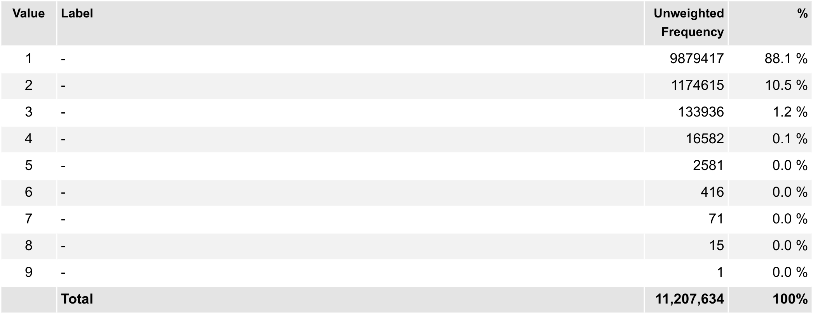

|     | Unweighted Frequency | %       |
|-----|-----------------------|---------|
| 1   | 9,879,417             | 88.1 %  |
| 2   | 1,174,615             | 10.5 %  |
| 3   | 133,936               | 1.2 %   |
| 4   | 16,582                | 0.1 %   |
| 5   | 2,581                 | 0.0 %   |
| 6   | 416                   | 0.0 %   |
| 7   | 71                    | 0.0 %   |
| 8   | 15                    | 0.0 %   |
| 9   | 1                     | 0.0 %   |
| **Total** | **11,207,634**   | **100%** |

Based upon 11,207,634 valid cases out of 11,207,634 total cases.

- Mean: 1.13
- Median: 1.00
- Mode: 1.00
- Minimum: 1.00
- Maximum: 9.00
- Standard Deviation: 0.39

*Location: 42-43 (width: 2; decimal: 0)*
*Variable Type: numeric*
*(Range of) Missing Values: -5*

### RECSPRP: N PROPERTY (03) RECORDS PER ORI-INCIDENT NUMBER

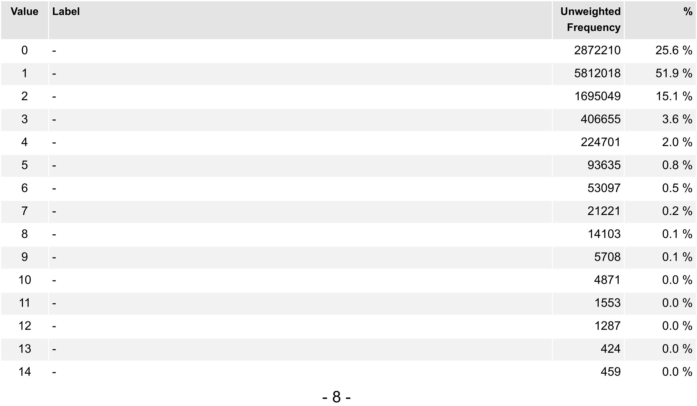

|     | Unweighted Frequency | %       |
|-----|-----------------------|---------|
| 0   | 2,872,210             | 25.6 %  |
| 1   | 5,812,018             | 51.9 %  |
| 2   | 1,695,049             | 15.1 %  |
| 3   | 406,655               | 3.6 %   |
| 4   | 224,701               | 2.0 %   |
| 5   | 93,635                | 0.8 %   |
| 6   | 53,097                | 0.5 %   |
| 7   | 21,221                | 0.2 %   |
| 8   | 14,103                | 0.1 %   |
| 9   | 5,708                 | 0.1 %   |
| 10  | 4,871                 | 0.0 %   |
| 11  | 1,553                 | 0.0 %   |
| 12  | 1,287                 | 0.0 %   |
| 13  | 424                   | 0.0 %   |
| 14  | 459                   | 0.0 %   |


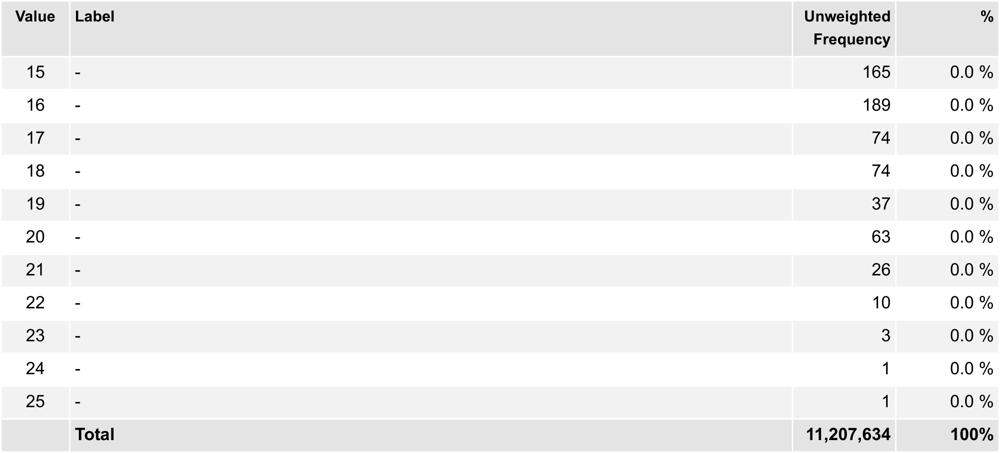

Based upon 11,207,634 valid cases out of 11,207,634 total cases.

- Mean: 1.12
- Median: 1.00
- Mode: 1.00
- Minimum: 0.00
- Maximum: 25.00
- Standard Deviation: 1.11

Location: 44–45 (width: 2; decimal: 0)

Variable Type: numeric

(Range of) Missing Values: -5

### RECSVIC: N VICTIM (04) RECORDS PER ORI-INCIDENT NUMBER

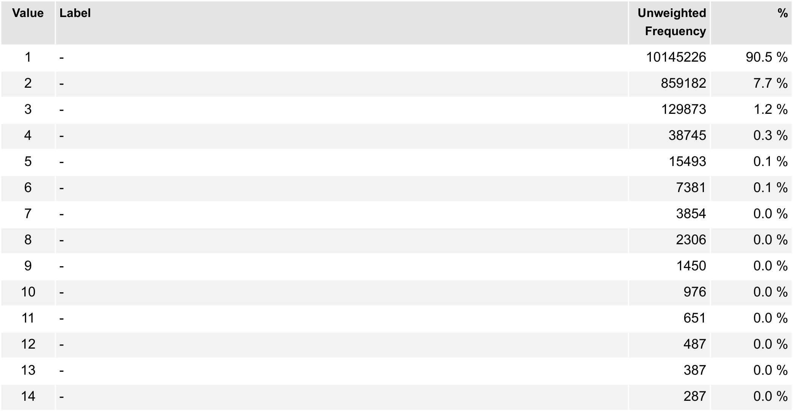


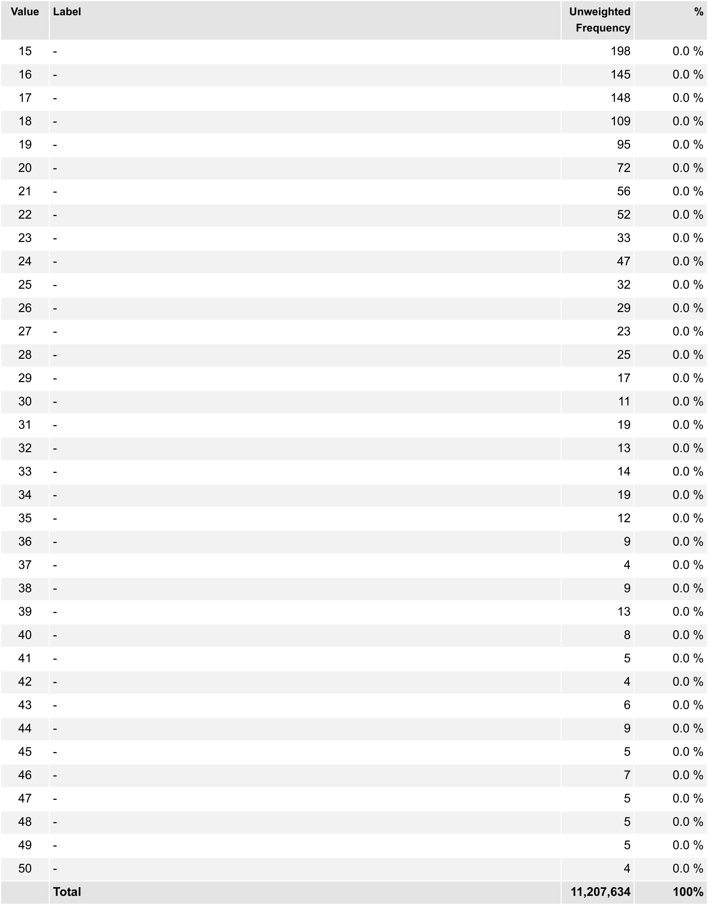

|     | Unweighted Frequency |     |
|-----|-----------------------|-----|
|  15 | 198                   | 0.0%|
|  16 | 145                   | 0.0%|
|  17 | 148                   | 0.0%|
|  18 | 109                   | 0.0%|
|  19 | 95                    | 0.0%|
|  20 | 72                    | 0.0%|
|  21 | 56                    | 0.0%|
|  22 | 52                    | 0.0%|
|  23 | 33                    | 0.0%|
|  24 | 47                    | 0.0%|
|  25 | 32                    | 0.0%|
|  26 | 29                    | 0.0%|
|  27 | 23                    | 0.0%|
|  28 | 25                    | 0.0%|
|  29 | 17                    | 0.0%|
|  30 | 11                    | 0.0%|
|  31 | 19                    | 0.0%|
|  32 | 13                    | 0.0%|
|  33 | 14                    | 0.0%|
|  34 | 19                    | 0.0%|
|  35 | 12                    | 0.0%|
|  36 |  9                    | 0.0%|
|  37 |  4                    | 0.0%|
|  38 |  9                    | 0.0%|
|  39 | 13                    | 0.0%|
|  40 |  8                    | 0.0%|
|  41 |  5                    | 0.0%|
|  42 |  4                    | 0.0%|
|  43 |  6                    | 0.0%|
|  44 |  9                    | 0.0%|
|  45 |  5                    | 0.0%|
|  46 |  7                    | 0.0%|
|  47 |  5                    | 0.0%|
|  48 |  5                    | 0.0%|
|  49 |  5                    | 0.0%|
|  50 |  4                    | 0.0%|
|     | Total  | 11,207,634              | 100%|


Please note that only the first 50 response categories are displayed in the PDF codebook. To view all response categories, please analyze the data file in the statistical package of your choice (SAS, SPSS, Stata, R).

Based upon 11,207,634 valid cases out of 11,207,634 total cases.

- **Mean:** 1.13
- **Median:** 1.00
- **Mode:** 1.00
- **Minimum:** 1.00
- **Maximum:** 163.00
- **Standard Deviation:** 0.57

*Location: 46-48 (width: 3; decimal: 0)*
*Variable Type: numeric*
*(Range of) Missing Values: -5*

**RECSFQR: N OFFENDER (05) RECORDS PER ORI-INCIDENT NUMBER**

| | Unweighted Frequency | % |
|---|---|---|
| 1 | 10253996 | 91.5 % |
| 2 | 744247 | 6.6 % |
| 3 | 141682 | 1.3 % |
| 4 | 44309 | 0.4 % |
| 5 | 13724 | 0.1 % |
| 6 | 5301 | 0.0 % |
| 7 | 2000 | 0.0 % |
| 8 | 1091 | 0.0 % |
| 9 | 448 | 0.0 % |
| 10 | 360 | 0.0 % |
| 11 | 141 | 0.0 % |
| 12 | 95 | 0.0 % |
| 13 | 54 | 0.0 % |
| 14 | 30 | 0.0 % |
| 15 | 38 | 0.0 % |
| 16 | 18 | 0.0 % |
| 17 | 14 | 0.0 % |
| 18 | 14 | 0.0 % |
| 19 | 11 | 0.0 % |
| 20 | 8 | 0.0 % |
| 21 | 10 | 0.0 % |
| 22 | 7 | 0.0 % |
| 23 | 5 | 0.0 % |
| 24 | 3 | 0.0 % |
| 25 | 3 | 0.0 % |
| 26 | 3 | 0.0 % |


|         | Unweighted Frequency |   %   |
|---------|---------------------:|-------:|
| 27      |                     3 | 0.0 % |
| 28      |                     4 | 0.0 % |
| 29      |                     1 | 0.0 % |
| 30      |                     2 | 0.0 % |
| 31      |                     1 | 0.0 % |
| 32      |                     1 | 0.0 % |
| 35      |                     1 | 0.0 % |
| 37      |                     1 | 0.0 % |
| 38      |                     1 | 0.0 % |
| 39      |                     1 | 0.0 % |
| 40      |                     1 | 0.0 % |
| 45      |                     1 | 0.0 % |
| 59      |                     1 | 0.0 % |
| 60      |                     1 | 0.0 % |
| 65      |                     1 | 0.0 % |
| 86      |                     1 | 0.0 % |
| **Total** | **11,207,634**      | **100%** |

Based upon 11,207,634 valid cases out of 11,207,634 total cases.

- Mean: 1.11
- Median: 1.00
- Mode: 1.00
- Minimum: 1.00
- Maximum: 86.00
- Standard Deviation: 0.44

*Location: 49-50 (width: 2; decimal: 0)  
Variable Type: numeric  
(Range of) Missing Values: -5*

## RECSARR: N ARRESTEE (06) RECORDS PER ORI-INCIDENT NUMBER

|         | Unweighted Frequency |   %   |
|---------|---------------------:|-------:|
| 0       |             8611556  | 76.8 % |
| 1       |             2348467  | 21.0 % |
| 2       |              205833  |  1.8 % |
| 3       |               29919  |  0.3 % |
| 4       |                8122  |  0.1 % |
| 5       |                2279  |  0.0 % |
| 6       |                 814  |  0.0 % |
| 7       |                 308  |  0.0 % |
| 8       |                 169  |  0.0 % |


## BH005: DATE ORI WAS ADDED

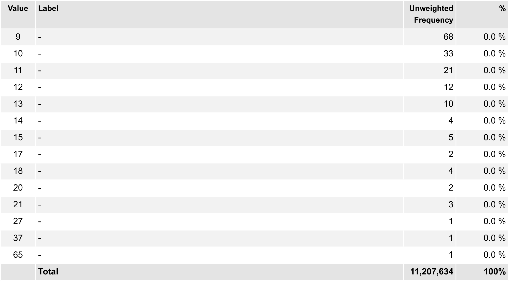

Based upon 11,207,634 valid cases out of 11,207,634 total cases.

- Mean: 0.26
- Median: 0.00
- Mode: 0.00
- Minimum: 0.00
- Maximum: 65.00
- Standard Deviation: 0.51

Location: 51-52 (width: 2; decimal: 0)
Variable Type: numeric
(Range of) Missing Values: -5

## BH005: DATE ORI WAS ADDED


Based upon 0 valid cases out of 11,207,634 total cases.

Location: 53-63 (width: 11; decimal: 0)
Variable Type: character
(Range of) Missing Values:

## BH006: DATE ORI WENT NIBRS


Label | Unweighted Frequency | %
--- | --- | ---
01-APR-1991 | - | 27 | 0.0 %
01-APR-1992 | - | 424 | 0.0 %
01-APR-1993 | - | 272 | 0.0 %
01-APR-1994 | - | 160 | 0.0 %
01-APR-1995 | - | 839 | 0.0 %
01-APR-1996 | - | 2763 | 0.0 %
01-APR-1997 | - | 10378 | 0.1 %
01-APR-1998 | - | 3527 | 0.0 %
01-APR-1999 | - | 8293 | 0.1 %
01-APR-2000 | - | 3343 | 0.0 %
01-APR-2001 | - | 2812 | 0.0 %
01-APR-2002 | - | 6237 | 0.1 %
01-APR-2003 | - | 6709 | 0.1 %
01-APR-2004 | - | 5794 | 0.1 %
01-APR-2005 | - | 5126 | 0.0 %
01-APR-2006 | - | 4423 | 0.0 %
01-APR-2007 | - | 3636 | 0.0 %
01-APR-2008 | - | 3393 | 0.0 %
01-APR-2009 | - | 593 | 0.0 %
01-APR-2010 | - | 3136 | 0.0 %
01-APR-2011 | - | 9471 | 0.1 %
01-APR-2012 | - | 4054 | 0.0 %
01-APR-2013 | - | 1034 | 0.0 %
01-APR-2014 | - | 4633 | 0.0 %
01-APR-2015 | - | 16313 | 0.1 %
01-APR-2016 | - | 894 | 0.0 %
01-APR-2017 | - | 3754 | 0.0 %
01-APR-2018 | - | 22483 | 0.2 %
01-APR-2019 | - | 33145 | 0.3 %
01-APR-2020 | - | 19102 | 0.2 %
01-APR-2021 | - | 173456 | 1.5 %
01-APR-2022 | - | 19039 | 0.2 %
01-AUG-1991 | - | 1309 | 0.0 %
01-AUG-1992 | - | 3190 | 0.0 %
01-AUG-1993 | - | 151 | 0.0 %
01-AUG-1995 | - | 3158 | 0.0 %
01-AUG-1996 | - | 3514 | 0.0 %
01-AUG-1997 | - | 5708 | 0.1 %
01-AUG-1998 | - | 7967 | 0.1 %


#### 17_0.png

|     | Label | Unweighted Frequency | %     |
|-----|-------|-----------------------|-------|
| 01-AUG-1999 | - | 25291 | 0.2 %  |
| 01-AUG-2000 | - | 108023 | 1.0 %  |
| 01-AUG-2001 | - | 4506 | 0.0 %  |
| 01-AUG-2002 | - | 28625 | 0.3 %  |
| 01-AUG-2003 | - | 8404 | 0.1 %  |
| 01-AUG-2004 | - | 4279 | 0.0 %  |
| 01-AUG-2005 | - | 1124 | 0.0 %  |
| 01-AUG-2006 | - | 504 | 0.0 %  |
| 01-AUG-2007 | - | 395 | 0.0 %  |
| 01-AUG-2008 | - | 3318 | 0.0 %  |
| 01-AUG-2009 | - | 4256 | 0.0 %  |

| Missing Data | - | 33 | 0.0 %  |
| Total | 11,207,634 | 100 %  |

Please note that only the first 50 response categories are displayed in the PDF codebook. To view all response categories, please analyze the data file in the statistical package of your choice (SAS, SPSS, Stata, R).

Based upon 11,207,601 valid cases out of 11,207,634 total cases.

Location: 64-74 (width: 11; decimal: 0)  
Variable Type: character  
(Range of) Missing Values:

#### 17_1.png

**NAME**

Based upon 11,207,634 valid cases out of 11,207,634 total cases.

Location: 75-99 (width: 25; decimal: 0)  
Variable Type: character

#### BH008: STATE ABBREVIATION

#### 17_2.png

|     | Unweighted Frequency | %     |
|-----|-----------------------|-------|
| AK  | 14063 | 0.1 %  |
| AL  | 214804 | 1.9 %  |
| AR  | 176545 | 1.6 %  |
| AZ  | 189010 | 1.7 %  |
| CA  | 737745 | 6.6 %  |
| CO  | 327646 | 2.9 %  |
| CT  | 112134 | 1.0 %  |
| DC  | 59726 | 0.5 %  |
| DE  | 52741 | 0.5 %  |
| FL  | 213003 | 1.9 %  |


GA -                | Unweighted Frequency | %  
------------------|-----------------------|-------  
                   | 397697                | 3.5 %  
GM -              | 6141                  | 0.1 %  
HI -              | 52628                 | 0.5 %  
IA -              | 97542                 | 0.9 %  
ID -              | 61845                 | 0.6 %  
IL -              | 441504                | 3.9 %  
IN -              | 211350                | 1.9 %  
KS -              | 135768                | 1.2 %  
KY -              | 143680                | 1.3 %  
LA -              | 189649                | 1.7 %  
MA -              | 192909                | 1.7 %  
MD -              | 190103                | 1.7 %  
ME -              | 39394                 | 0.4 %  
MI -              | 413881                | 3.7 %  
MN -              | 230065                | 2.1 %  
MO -              | 299487                | 2.7 %  
MS -              | 79389                 | 0.7 %  
MT -              | 44893                 | 0.4 %  
NB -              | 57317                 | 0.5 %  
NC -              | 499698                | 4.5 %  
ND -              | 40714                 | 0.4 %  
NH -              | 45144                 | 0.4 %  
NJ -              | 164989                | 1.5 %  
NM -              | 126145                | 1.1 %  
NV -              | 181697                | 1.6 %  
NY -              | 145000                | 1.3 %  
OH -              | 458532                | 4.1 %  
OK -              | 213866                | 1.9 %  
OR -              | 212742                | 1.9 %  
PA -              | 231170                | 2.1 %  
RI -              | 34017                 | 0.3 %  
SC -              | 296482                | 2.6 %  
SD -              | 40861                 | 0.4 %  
TN -              | 402260                | 3.6 %  
TX -              | 1517128               | 13.5 %  
UT -              | 152007                | 1.4 %  
VA -              | 356083                | 3.2 %  
VT -              | 19238                 | 0.2 %  
WA -              | 424190                | 3.8 %  


|           | Unweighted Frequency | %         |
|-----------|-----------------------|-----------|
| WI        | 198674                | 1.8 %     |
| **Total** | **11,207,634**        | **100%**  |

Please note that only the first 50 response categories are displayed in the PDF codebook. To view all response categories, please analyze the data file in the statistical package of your choice (SAS, SPSS, Stata, R).

Based upon 11,207,634 valid cases out of 11,207,634 total cases.

Location: 100-101 (width: 2; decimal: 0)  
Variable Type: character

---

### BH009: POPULATION GROUP

|           | Unweighted Frequency | %         |
|-----------|-----------------------|-----------|
| 0         | 6141                  | 0.1 %     |
| 10        | 0                     | 0.0 %     |
| 11        | 945976                | 8.4 %     |
| 12        | 1225718               | 10.9 %    |
| 13        | 871190                | 7.8 %     |
| 20        | 1450203               | 12.9 %    |
| 30        | 1262175               | 11.3 %    |
| 40        | 1087457               | 9.7 %     |
| 50        | 984130                | 8.8 %     |
| 60        | 574723                | 5.1 %     |
| 70        | 324582                | 2.9 %     |
| 80        | 0                     | 0.0 %     |
| 81        | 10915                 | 0.1 %     |
| 82        | 221291                | 2.0 %     |
| 83        | 182882                | 1.6 %     |
| 84        | 127393                | 1.1 %     |
| 85        | 20162                 | 0.2 %     |
| 90        | 0                     | 0.0 %     |
| 91        | 1157306               | 10.3 %    |
| 92        | 564691                | 5.0 %     |
| 93        | 95861                 | 0.9 %     |
| 94        | 94093                 | 0.8 %     |
| 95        | 745                   | 0.0 %     |
| **Total** | **11,207,634**        | **100%**  |

Based upon 11,207,634 valid cases out of 11,207,634 total cases.

- Minimum: 0.00
- Maximum: 95.00


BH010: COUNTRY DIVISION

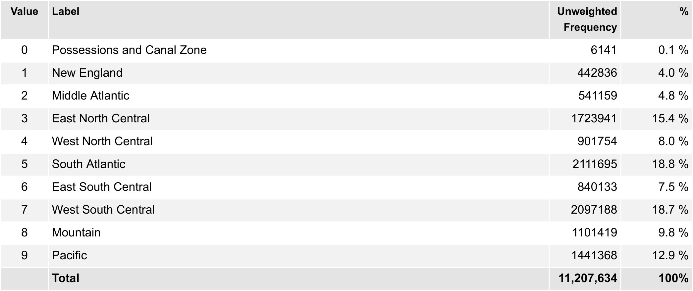

Based upon 11,207,634 valid cases out of 11,207,634 total cases.

- Minimum: 0.00
- Maximum: 9.00

BH011: COUNTRY REGION

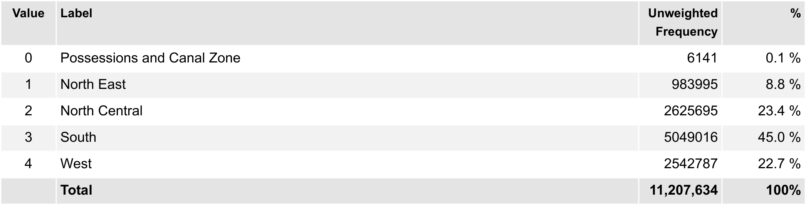

Based upon 11,207,634 valid cases out of 11,207,634 total cases.

- Minimum: 0.00
- Maximum: 4.00

BH012: AGENCY INDICATOR


|                                 |           Unweighted Frequency |           %     |
|---------------------------------|---------------------------------|-----------------|
| 0 Covered by another agency     | 0                               | 0.0 %           |
| 1 City                          | 8505953                         | 75.9 %          |
| 2 County                        | 2245631                         | 20.0 %          |
| 3 University or college         | 86141                           | 0.8 %           |
| 4 State Police                  | 224646                          | 2.0 %           |
| 5 Special Agency                | 83595                           | 0.7 %           |
| 6 Other state agencies          | 23696                           | 0.2 %           |
| 7 Tribal agencies               | 37972                           | 0.3 %           |
| 8 Federal agencies              | 0                               | 0.0 %           |
| **Total**                       | **11,207,634**                  | **100%**        |

Based upon 11,207,634 valid cases out of 11,207,634 total cases.

* Minimum: 1.00
* Maximum: 7.00

Location: 106-106 (width: 1; decimal: 0)  
Variable Type: numeric

### BH013: CORE CITY

|                                 |           Unweighted Frequency |           %     |
|---------------------------------|---------------------------------|-----------------|
| 0 No                            | 6012143                         | 53.6 %          |
| 1 Yes                           | 51545491                        | 46.4 %          |
| **Total**                       | **11,207,634**                  | **100%**        |

Based upon 11,207,634 valid cases out of 11,207,634 total cases.

* Minimum: 0.00
* Maximum: 1.00

Location: 107-107 (width: 1; decimal: 0)  
Variable Type: numeric

### BH014: COVERED BY ORI

|           Label                 |      Unweighted Frequency |           %     |
|---------------------------------|---------------------------|-----------------|
| GA0950000                       | 37                        | 0.0 %           |
| IL0550000                       | 4                         | 0.0 %           |
| IL0820000                       | 3                         | 0.0 %           |
| MN0060000                       | 47                        | 0.0 %           |
| MN0120000                       | 2                         | 0.0 %           |
| MN0750000                       | 82                        | 0.0 %           |
| OH0710000                       | 6                         | 0.0 %           |


**Label**
|                      | **Unweighted Frequency** |         %          |
|----------------------|---------------------------|------------------- |
| **Missing Data**     |                           |                   |
| -6 Not Applicable    | 11,207,453                | 100.0 %           |
| **Total**            | 11,207,634                | **100%**          |

Based upon 181 valid cases out of 11,207,634 total cases.

Location: 108-116 (width: 9; decimal: 0) Variable Type: character (Range of) Missing Values: -6

---

### BH015: FBI FIELD OFFICE

|                      | **Unweighted Frequency** |         %          |
|----------------------|---------------------------|------------------- |
| 0                    | 160                       | 0.0 %             |
| 3010                 | 75275                     | 0.7 %             |
| 3020                 | 126145                    | 1.1 %             |
| 3030                 | 14063                     | 0.1 %             |
| 3040                 | 397697                    | 3.5 %             |
| 3050                 | 242844                    | 2.2 %             |
| 3070                 | 124650                    | 1.1 %             |
| 3090                 | 311464                    | 2.8 %             |
| 3110                 | 66871                     | 0.6 %             |
| 3140                 | 499698                    | 4.5 %             |
| 3150                 | 342095                    | 3.1 %             |
| 3160                 | 240581                    | 2.1 %             |
| 3170                 | 217951                    | 1.9 %             |
| 3180                 | 296482                    | 2.6 %             |
| 3190                 | 519230                    | 4.6 %             |
| 3210                 | 345822                    | 3.1 %             |
| 3220                 | 413881                    | 3.7 %             |
| 3240                 | 54529                     | 0.5 %             |
| 3280                 | 58769                     | 0.5 %             |
| 3290                 | 515130                    | 4.6 %             |
| 3310                 | 211350                    | 1.9 %             |
| 3320                 | 79389                     | 0.7 %             |
| 3330                 | 79418                     | 0.7 %             |
| 3350                 | 301927                    | 2.7 %             |
| 3370                 | 128522                    | 1.1 %             |
| 3380                 | 181697                    | 1.6 %             |
| 3390                 | 176545                    | 1.6 %             |
| 3410                 | 225919                    | 2.0 %             |


### 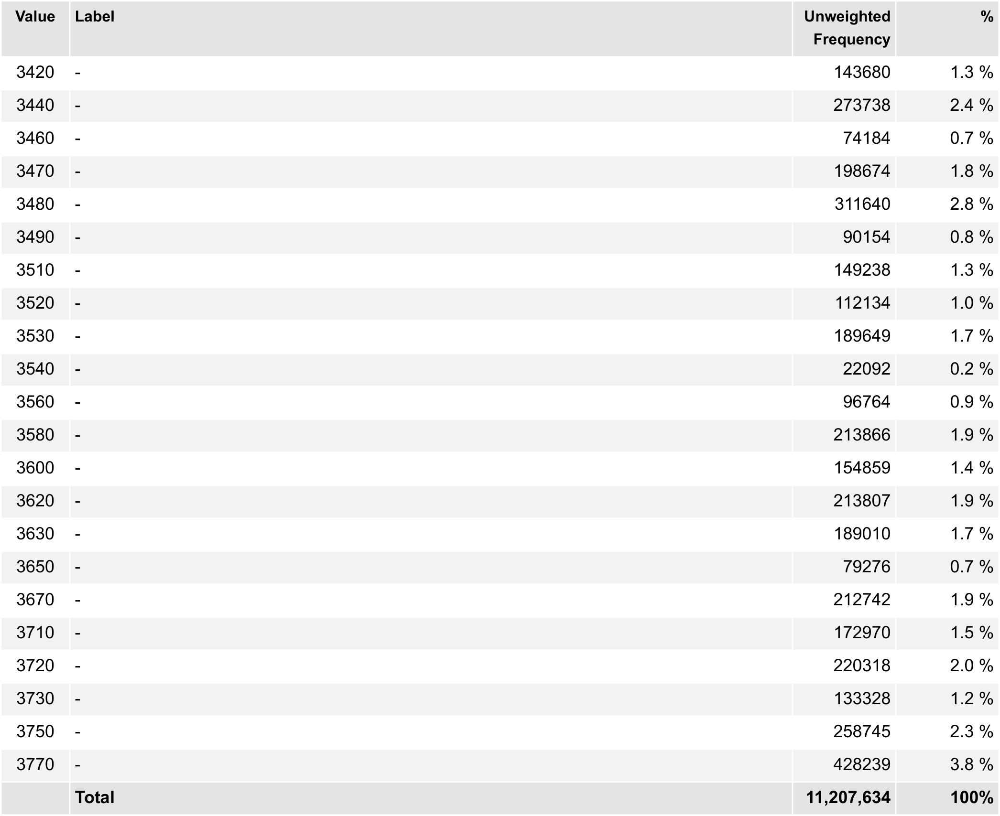

|      | Unweighted Frequency | %     |
|------|-----------------------|-------|
| 3420 | 143680                | 1.3 % |
| 3440 | 273738                | 2.4 % |
| 3460 | 74184                 | 0.7 % |
| 3470 | 198674                | 1.8 % |
| 3480 | 311640                | 2.8 % |
| 3490 | 90154                 | 0.8 % |
| 3510 | 149238                | 1.3 % |
| 3520 | 112134                | 1.0 % |
| 3530 | 189649                | 1.7 % |
| 3540 | 22092                 | 0.2 % |
| 3560 | 96764                 | 0.9 % |
| 3580 | 213866                | 1.9 % |
| 3600 | 154859                | 1.4 % |
| 3620 | 213807                | 1.9 % |
| 3630 | 189010                | 1.7 % |
| 3650 | 79276                 | 0.7 % |
| 3670 | 212742                | 1.9 % |
| 3710 | 172970                | 1.5 % |
| 3720 | 220318                | 2.0 % |
| 3730 | 133328                | 1.2 % |
| 3750 | 258745                | 2.3 % |
| 3770 | 428239                | 3.8 % |
| Total| 11,207,634            | 100%  |

Please note that only the first 50 response categories are displayed in the PDF codebook. To view all response categories, please analyze the data file in the statistical package of your choice (SAS, SPSS, Stata, R).

Based upon 11,207,634 valid cases out of 11,207,634 total cases.

- Mean: 3400.92
- Median: 3370.00
- Mode: 3190.00
- Minimum: 0.00
- Maximum: 3920.00
- Standard Deviation: 255.43

*Location: 117-120 (width: 4; decimal: 0)*  
*Variable Type: numeric*


### BH016: JUDICIAL DISTRICT


|      | Unweighted Frequency | %     |
|------|-----------------------|-------|
| 0000 | 396                   | 0.0 % |
| 005M | 50584                 | 0.5 % |


|      | Unweighted Frequency | %    |
|------|----------------------|------|
| 010N | 124650               | 1.1 %|
| 015S | 39570                | 0.4 %|
| 020A | 14063                | 0.1 %|
| 025A | 188799               | 1.7 %|
| 030E | 110200               | 1.0 %|
| 035W | 66345                | 0.6 %|
| 040C | 225919               | 2.0 %|
| 045E | 220318               | 2.0 %|
| 050N | 163147               | 1.5 %|
| 055S | 128201               | 1.1 %|
| 060A | 327646               | 2.9 %|
| 065A | 112134               | 1.0 %|
| 070A | 52741                | 0.5 %|
| 075A | 59726                | 0.5 %|
| 080M | 130015               | 1.2 %|
| 085N | 8804                 | 0.1 %|
| 090S | 74184                | 0.7 %|
| 095M | 81829                | 0.7 %|
| 100N | 282279               | 2.5 %|
| 105S | 33589                | 0.3 %|
| 110A | 52628                | 0.5 %|
| 115A | 61845                | 0.6 %|
| 120C | 74637                | 0.7 %|
| 125N | 342095               | 3.1 %|
| 130S | 24772                | 0.2 %|
| 135N | 64021                | 0.6 %|
| 140S | 147329               | 1.3 %|
| 145N | 40112                | 0.4 %|
| 150S | 57430                | 0.5 %|
| 155A | 135768               | 1.2 %|
| 160E | 62477                | 0.6 %|
| 165W | 81203                | 0.7 %|
| 170E | 58642                | 0.5 %|
| 175M | 52027                | 0.5 %|
| 180W | 78980                | 0.7 %|
| 185A | 39394                | 0.4 %|
| 190A | 190103               | 1.7 %|
| 195A | 192909               | 1.7 %|
| 200E | 266743               | 2.4 %|


|       | Unweighted Frequency | %     |
|-------|-----------------------|-------|
| 205W  | 147138                | 1.3 % |
| 210A  | 230065                | 2.1 % |
| 215N  | 35893                 | 0.3 % |
| 220S  | 43496                 | 0.4 % |
| 225E  | 133328                | 1.2 % |
| 230W  | 166159                | 1.5 % |
| 235A  | 44893                 | 0.4 % |
| 240A  | 57317                 | 0.5 % |
| 245A  | 181697                | 1.6 % |
| **Total** | **11,207,634**          | **100%** |

Please note that only the first 50 response categories are displayed in the PDF codebook. To view all response categories, please analyze the data file in the statistical package of your choice (SAS, SPSS, Stata, R).

Based upon 11,207,634 valid cases out of 11,207,634 total cases.

**Location**: 121-124 (width: 4; decimal: 0)
**Variable Type**: character  
**(Range of) Missing Values**: -6

BH017: AGENCY NIBRS FLAG

|       | Unweighted Frequency | %     |
|-------|-----------------------|-------|
| 0     | Does not yet participate | 0 | 0.0 % |
| 1     | 11207601              | 100.0 % |
| .     | 33                    | 0.0 % |
| **Total** | **11,207,634**         | **100%** |

Based upon 11,207,601 valid cases out of 11,207,634 total cases.

- **Mean**: 1.00
- **Median**: 1.00
- **Mode**: 1.00
- **Minimum**: 1.00
- **Maximum**: 1.00
- **Standard Deviation**: 0.00

**Location**: 125-125 (width: 1; decimal: 0)  
**Variable Type**: numeric 

BH018: AGENCY INACTIVE DATE

|             | Unweighted Frequency | %     |
|-------------|-----------------------|-------|
| **Missing Data** | 11207634              | 100.0 % |


## Total

|                      | Unweighted Frequency | %      |
|----------------------|-----------------------|--------|
| **Total**            | 11,207,634            | 100%   |

Based upon 0 valid cases out of 11,207,634 total cases.

*Location*: 126-136 (width: 11; decimal: 0)  
*Variable Type*: character  
*(Range of) Missing Values*:

---

## BH019: CURRENT POPULATION 1

Based upon 11,207,634 valid cases out of 11,207,634 total cases.

- **Mean**: 360598.53
- **Minimum**: 0.00
- **Maximum**: 2652124.00
- **Standard Deviation**: 573783.81

*Location*: 137-143 (width: 7; decimal: 0)  
*Variable Type*: numeric

---

## BH020: UCR COUNTY CODE 1

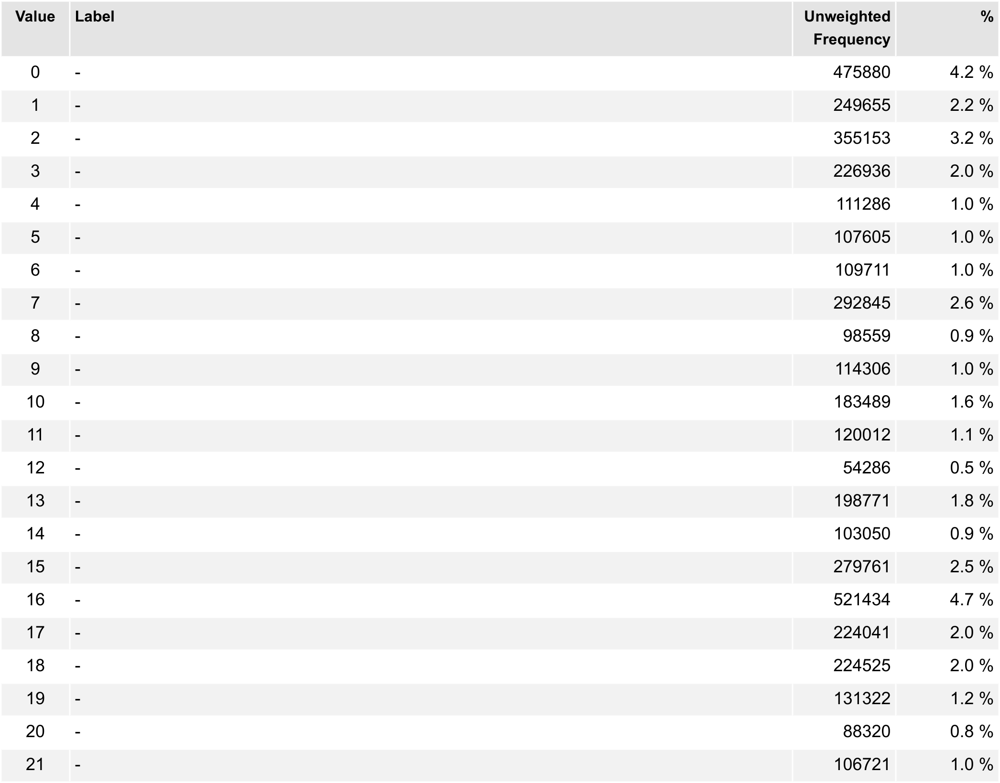

|     | Unweighted Frequency | %      |
|-----|-----------------------|--------|
| **0**   | 475880                 | 4.2%   |
| **1**   | 249655                 | 2.2%   |
| **2**   | 355153                 | 3.2%   |
| **3**   | 226936                 | 2.0%   |
| **4**   | 111286                 | 1.0%   |
| **5**   | 107605                 | 1.0%   |
| **6**   | 109711                 | 1.0%   |
| **7**   | 292845                 | 2.6%   |
| **8**   | 98559                  | 0.9%   |
| **9**   | 114306                 | 1.0%   |
| **10**  | 183489                 | 1.6%   |
| **11**  | 120012                 | 1.1%   |
| **12**  | 54286                  | 0.5%   |
| **13**  | 198771                 | 1.8%   |
| **14**  | 100350                 | 0.9%   |
| **15**  | 279761                 | 2.5%   |
| **16**  | 521434                 | 4.7%   |
| **17**  | 224041                 | 2.0%   |
| **18**  | 224525                 | 2.0%   |
| **19**  | 131322                 | 1.2%   |
| **20**  | 88320                  | 0.8%   |
| **21**  | 106721                 | 1.0%   |


|                  | Unweighted Frequency | %    |
|------------------|----------------------|------|
| 22               | 53128                | 0.5% |
| 23               | 92780                | 0.8% |
| 24               | 78655                | 0.7% |
| 25               | 164942               | 1.5% |
| 26               | 167543               | 1.5% |
| 27               | 192774               | 1.7% |
| 28               | 80050                | 0.7% |
| 29               | 90130                | 0.8% |
| 30               | 193584               | 1.7% |
| 31               | 126200               | 1.1% |
| 32               | 118638               | 1.1% |
| 33               | 106559               | 1.0% |
| 34               | 129694               | 1.2% |
| 35               | 57020                | 0.5% |
| 36               | 76159                | 0.7% |
| 37               | 225493               | 2.0% |
| 38               | 35128                | 0.3% |
| 39               | 108871               | 1.0% |
| 40               | 121358               | 1.1% |
| 41               | 129524               | 1.2% |
| 42               | 56006                | 0.5% |
| 43               | 90919                | 0.8% |
| 44               | 103881               | 0.9% |
| 45               | 62974                | 0.6% |
| 46               | 67267                | 0.6% |
| 47               | 64778                | 0.6% |
| 48               | 127708               | 1.1% |
| 49               | 141218               | 1.3% |
| **Total**        | **11,207,634**       | **100%** |

---

Please note that only the first 50 response categories are displayed in the PDF codebook. To view all response categories, please analyze the data file in the statistical package of your choice (SAS, SPSS, Stata, R).

Based upon 11,207,634 valid cases out of 11,207,634 total cases.

- Mean: 43.65
- Median: 31.00
- Mode: 16.00
- Minimum: 0.00
- Maximum: 300.00
- Standard Deviation: 44.88

**Location**: 144-146 (width: 3; decimal: 0)
**Variable Type**: numeric


**BH021: MSA CODE 1**

|        | Unweighted Frequency | %      |
|--------|-----------------------|--------|
| 0      | 1370088               | 12.2 % |
| 4      | 8596                  | 0.1 %  |
| 9      | 33719                 | 0.3 %  |
| 13     | 2756                  | 0.0 %  |
| 15     | 5434                  | 0.0 %  |
| 18     | 22435                 | 0.2 %  |
| 23     | 70142                 | 0.6 %  |
| 25     | 10456                 | 0.1 %  |
| 27     | 4570                  | 0.0 %  |
| 32     | 558                   | 0.0 %  |
| 36     | 18312                 | 0.2 %  |
| 37     | 2904                  | 0.0 %  |
| 38     | 908                   | 0.0 %  |
| 41     | 13330                 | 0.1 %  |
| 42     | 7135                  | 0.1 %  |
| 43     | 7314                  | 0.1 %  |
| 46     | 20282                 | 0.2 %  |
| 48     | 10407                 | 0.1 %  |
| 50     | 248996                | 2.2 %  |
| 55     | 12107                 | 0.1 %  |
| 57     | 8107                  | 0.1 %  |
| 59     | 11073                 | 0.1 %  |
| 64     | 115348                | 1.0 %  |
| 69     | 15520                 | 0.1 %  |
| 73     | 102555                | 0.9 %  |
| 74     | 5401                  | 0.0 %  |
| 76     | 5626                  | 0.1 %  |
| 78     | 52027                 | 0.5 %  |
| 80     | 8626                  | 0.1 %  |
| 82     | 3047                  | 0.0 %  |
| 87     | 20220                 | 0.2 %  |
| 88     | 4810                  | 0.0 %  |
| 89     | 14975                 | 0.1 %  |
| 90     | 6287                  | 0.1 %  |
| 92     | 11232                 | 0.1 %  |
| 96     | 8009                  | 0.1 %  |


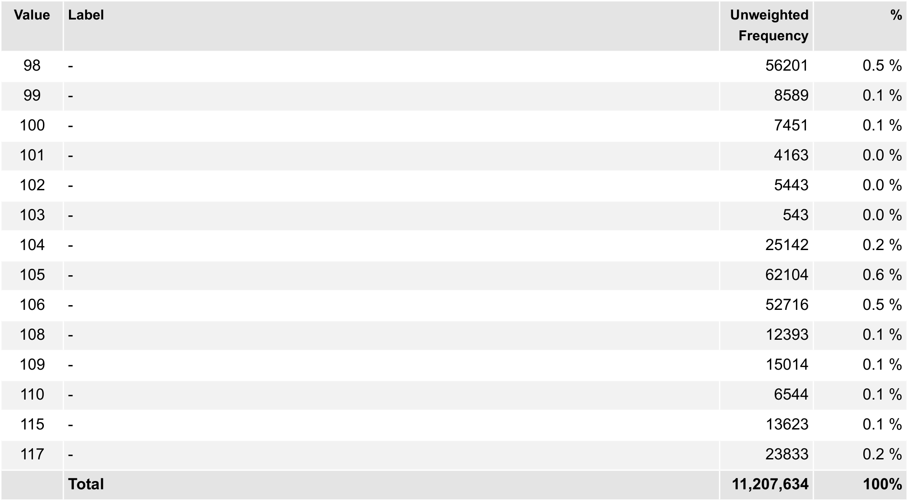

Please note that only the first 50 response categories are displayed in the PDF codebook. To view all response categories, please analyze the data file in the statistical package of your choice (SAS, SPSS, Stata, R).

Based upon 11,207,634 valid cases out of 11,207,634 total cases.

- Mean: 399.66
- Minimum: 0.00
- Maximum: 992.00
- Standard Deviation: 302.62

Location: 147-149 (width: 3; decimal: 0)  
Variable Type: numeric  
(Range of) Missing Values: -6

---

BH022: LAST POPULATION 1


Based upon 11,207,634 valid cases out of 11,207,634 total cases.

- Mean: 0.00
- Median: 0.00
- Mode: 0.00
- Minimum: 0.00
- Maximum: 0.00
- Standard Deviation: 0.00

Location: 150-150 (width: 1; decimal: 0)  
Variable Type: numeric


# BH023: CURRENT POPULATION 2

|            | Unweighted Frequency | %      |
|------------|-----------------------|--------|
| 0          | 9671636               | 86.3 % |
| 1          | 475                   | 0.0 %  |
| 2          | 22405                 | 0.2 %  |
| 3          | 10516                 | 0.1 %  |
| 4          | 4269                  | 0.0 %  |
| 5          | 8708                  | 0.1 %  |
| 6          | 2784                  | 0.0 %  |
| 7          | 2363                  | 0.0 %  |
| 8          | 141614                | 1.3 %  |
| 9          | 631                   | 0.0 %  |
| 10         | 91                    | 0.0 %  |
| 11         | 239                   | 0.0 %  |
| 12         | 277                   | 0.0 %  |
| 13         | 1                     | 0.0 %  |
| 14         | 183                   | 0.0 %  |
| 15         | 1924                  | 0.0 %  |
| 16         | 689                   | 0.0 %  |
| 17         | 80                    | 0.0 %  |
| 18         | 379                   | 0.0 %  |
| 19         | 51                    | 0.0 %  |
| 20         | 116                   | 0.0 %  |
| 23         | 338                   | 0.0 %  |
| 24         | 3624                  | 0.0 %  |
| 25         | 287                   | 0.0 %  |
| 26         | 4                     | 0.0 %  |
| 27         | 281                   | 0.0 %  |
| 28         | 2147                  | 0.0 %  |
| 29         | 36                    | 0.0 %  |
| 30         | 1063                  | 0.0 %  |
| 31         | 1557                  | 0.0 %  |
| 32         | 3                     | 0.0 %  |
| 33         | 400                   | 0.0 %  |
| 36         | 14                    | 0.0 %  |
| 37         | 129                   | 0.0 %  |
| 38         | 802                   | 0.0 %  |
| 39         | 153                   | 0.0 %  |
| 41         | 6898                  | 0.1 %  |


### 31_0.png

|                   | Unweighted Frequency | %    |
|-------------------|----------------------|------|
| 42                | 1563                 | 0.0% |
| 43                | 1169                 | 0.0% |
| 44                | 82                   | 0.0% |
| 45                | 1715                 | 0.0% |
| 46                | 650                  | 0.0% |
| 48                | 34                   | 0.0% |
| 50                | 15                   | 0.0% |
| 52                | 6                    | 0.0% |
| 53                | 297                  | 0.0% |
| 58                | 37                   | 0.0% |
| 59                | 705                  | 0.0% |
| 60                | 43                   | 0.0% |
| 62                | 3676                 | 0.0% |
| **Total**         | **11,207,634**       | **100%** |

Please note that only the first 50 response categories are displayed in the PDF codebook. To view all response categories, please analyze the data file in the statistical package of your choice (SAS, SPSS, Stata, R).

Based upon 11,207,634 valid cases out of 11,207,634 total cases.

- Mean: 3630.34
- Minimum: 0.00
- Maximum: 140447.00
- Standard Deviation: 14981.37

Location: 151-156 (width: 6; decimal: 0)  
Variable Type: numeric

### BH024: UCR COUNTY CODE 2

### 31_1.png

|                   | Unweighted Frequency | %    |
|-------------------|----------------------|------|
| 1                 | 44431                | 0.4% |
| 2                 | 3816                 | 0.0% |
| 3                 | 4078                 | 0.0% |
| 4                 | 9974                 | 0.1% |
| 5                 | 6338                 | 0.1% |
| 6                 | 393                  | 0.0% |
| 7                 | 3454                 | 0.0% |
| 8                 | 16172                | 0.1% |
| 9                 | 49352                | 0.4% |
| 10                | 5319                 | 0.0% |
| 11                | 2297                 | 0.0% |
| 12                | 4037                 | 0.0% |


|                  | Unweighted Frequency |     %     |
|------------------|----------------------|-----------|
| 13  -            | 333                  | 0.0 %     |
| 14  -            | 2831                 | 0.0 %     |
| 15  -            | 2345                 | 0.0 %     |
| 16  -            | 5175                 | 0.0 %     |
| 17  -            | 569                  | 0.0 %     |
| 18  -            | 12753                | 0.1 %     |
| 19  -            | 11038                | 0.1 %     |
| 20  -            | 181                  | 0.0 %     |
| 21  -            | 65369                | 0.6 %     |
| 22  -            | 21041                | 0.2 %     |
| 23  -            | 17217                | 0.2 %     |
| 24  -            | 44605                | 0.4 %     |
| 25  -            | 7171                 | 0.1 %     |
| 26  -            | 7361                 | 0.1 %     |
| 27  -            | 20689                | 0.2 %     |
| 28  -            | 5580                 | 0.0 %     |
| 29  -            | 9744                 | 0.1 %     |
| 30  -            | 10924                | 0.1 %     |
| 31  -            | 4073                 | 0.0 %     |
| 32  -            | 39794                | 0.4 %     |
| 33  -            | 3279                 | 0.0 %     |
| 34  -            | 63002                | 0.6 %     |
| 35  -            | 2929                 | 0.0 %     |
| 36  -            | 6437                 | 0.1 %     |
| 37  -            | 11469                | 0.1 %     |
| 38  -            | 148                  | 0.0 %     |
| 39  -            | 442                  | 0.0 %     |
| 40  -            | 2511                 | 0.0 %     |
| 41  -            | 12049                | 0.1 %     |
| 42  -            | 26249                | 0.2 %     |
| 43  -            | 117763               | 1.1 %     |
| 44  -            | 39456                | 0.4 %     |
| 45  -            | 7906                 | 0.1 %     |
| 47  -            | 6901                 | 0.1 %     |
| 48  -            | 448                  | 0.0 %     |
| 49  -            | 639                  | 0.0 %     |
| 50  -            | 6465                 | 0.1 %     |
| 52  -            | 540                  | 0.0 %     |
| Missing Data     |                      |           |


Please note that only the first 50 response categories are displayed in the PDF codebook. To view all response categories, please analyze the data file in the statistical package of your choice (SAS, SPSS, Stata, R).

Based upon 1,535,998 valid cases out of 11,207,634 total cases.

- Mean: 72.97
- Median: 57.00
- Mode: 79.00
- Minimum: 1.00
- Maximum: 247.00
- Standard Deviation: 62.76

Location: 157-159 (width: 3; decimal: 0)  
Variable Type: numeric  
(Range of) Missing Values: -6, .

## BH025: MSA CODE 2

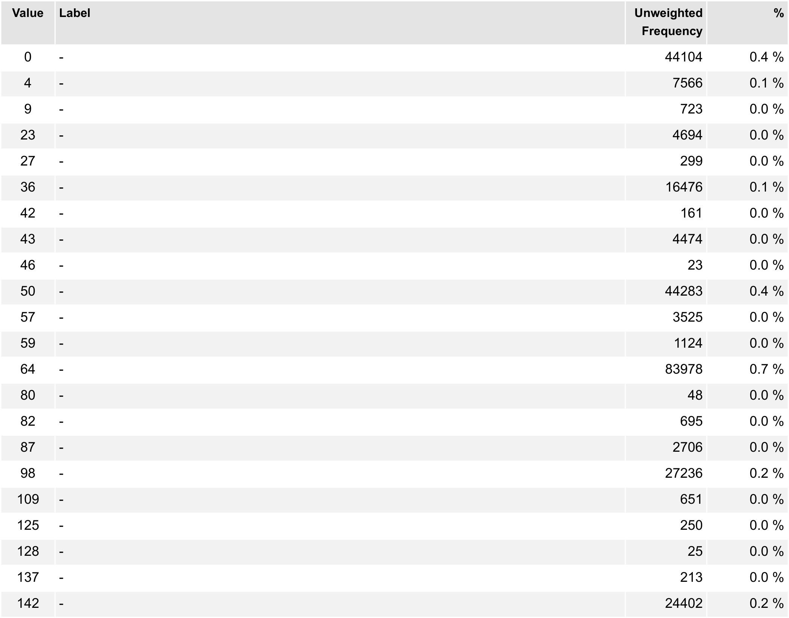


|       | Unweighted Frequency | %      |
|-------|-----------------------|--------|
| 151   |                       | 0.0 %  |
| 156   | 685                   | 0.0 %  |
| 160   | 16095                 | 0.1 %  |
| 161   | 7997                  | 0.1 %  |
| 163   | 312                   | 0.0 %  |
| 165   | 4589                  | 0.0 %  |
| 170   | 6                     | 0.0 %  |
| 174   | 4                     | 0.0 %  |
| 179   | 10764                 | 0.1 %  |
| 184   | 207                   | 0.0 %  |
| 186   | 142                   | 0.0 %  |
| 188   | 68477                 | 0.6 %  |
| 194   | 2684                  | 0.0 %  |
| 197   | 213339                | 1.9 %  |
| 198   | 16487                 | 0.1 %  |
| 202   | 80                    | 0.0 %  |
| 207   | 4561                  | 0.0 %  |
| 210   | 198                   | 0.0 %  |
| 216   | 47119                 | 0.4 %  |
| 220   | 6479                  | 0.1 %  |
| 223   | 114                   | 0.0 %  |
| 224   | 617                   | 0.0 %  |
| 227   | 8                     | 0.0 %  |
| 228   | 1453                  | 0.0 %  |
| 235   | 54391                 | 0.5 %  |
| 237   | 3473                  | 0.0 %  |
| 270   | 5324                  | 0.0 %  |
| 276   | 8                     | 0.0 %  |

| Missing Data |       | 9671636 | 86.3 % |
|--------------|-------|---------|--------|
| Total        |       | 11,207,634 | 100%  |

Please note that only the first 50 response categories are displayed in the PDF codebook. To view all response categories, please analyze the data file in the statistical package of your choice (SAS, SPSS, Stata, R).

Based upon 1,535,998 valid cases out of 11,207,634 total cases.

- **Mean**: 374.24
- **Median**: 352.00
- **Mode**: 358.00
- **Minimum**: 0.00
- **Maximum**: 989.00


• Standard Deviation: 269.57

Location: 160-162 (width: 3; decimal: 0)  
Variable Type: numeric  
(Range of) Missing Values: -6, .

---

### BH026: LAST POPULATION 2


Based upon 11,207,634 valid cases out of 11,207,634 total cases.

• Mean: 0.00  
• Median: 0.00  
• Mode: 0.00  
• Minimum: 0.00  
• Maximum: 0.00  
• Standard Deviation: 0.00

Location: 163-163 (width: 1; decimal: 0)  
Variable Type: numeric


---

### BH027: CURRENT POPULATION 3

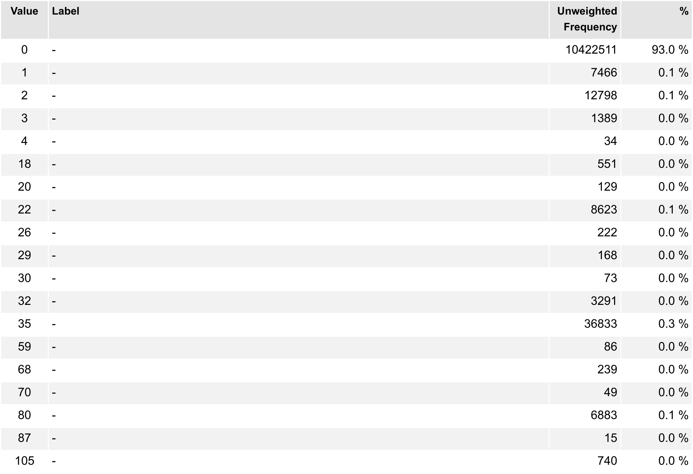


### Unweighted Frequency

|      |       |       |
|------|-------|-------|
| 113  |    -  |  9    |   0.0 %  |
| 125  |    -  |  354  |   0.0 %  |
| 191  |    -  |  142  |   0.0 %  |
| 212  |    -  |  65   |   0.0 %  |
| 233  |    -  |  2626 |   0.0 %  |
| 330  |    -  |  633  |   0.0 %  |
| 516  |    -  |  1946 |   0.0 %  |
| 588  |    -  |  70   |   0.0 %  |
| 638  |    -  |  2446 |   0.0 %  |
| 685  |    -  |  5117 |   0.0 %  |
| 836  |    -  |  62607|   0.6 %  |
| 858  |    -  |  5051 |   0.0 %  |
| 1007 |    -  |  67367|   0.6 %  |
| 1030 |    -  |  191  |   0.0 %  |
| 1101 |    -  |  39   |   0.0 %  |
| 1113 |    -  |  940  |   0.0 %  |
| 1401 |    -  |  47113|   0.4 %  |
| 1426 |    -  |  3679 |   0.0 %  |
| 1511 |    -  |  1024 |   0.0 %  |
| 1516 |    -  |  434  |   0.0 %  |
| 1788 |    -  |  1130 |   0.0 %  |
| 2593 |    -  |  4083 |   0.0 %  |
| 2930 |    -  |  808  |   0.0 %  |
| 3658 |    -  |  417  |   0.0 %  |
| 3696 |    -  |  30469|   0.3 %  |
| 4328 |    -  |  990  |   0.0 %  |
| 5665 |    -  |  1624 |   0.0 %  |
| 5864 |    -  |  4597 |   0.0 %  |
| 6560 |    -  |  5336 |   0.0 %  |
| 6904 |    -  |  203299 | 1.8 % |
| 11197|    -  |  63759 | 0.6 % |

**Total: 11,207,634 100%**

Please note that only the first 50 response categories are displayed in the PDF codebook. To view all response categories, please analyze the data file in the statistical package of your choice (SAS, SPSS, Stata, R).

Based upon 11,207,634 valid cases out of 11,207,634 total cases.

- Mean: 1008.43
- Median: 0.00
- Mode: 0.00
- Minimum: 0.00


- Maximum: 79475.00
- Standard Deviation: 6683.72

Location: 164-168 (width: 5; decimal: 0)
Variable Type: numeric

---

### BH028: UCR COUNTY CODE 3

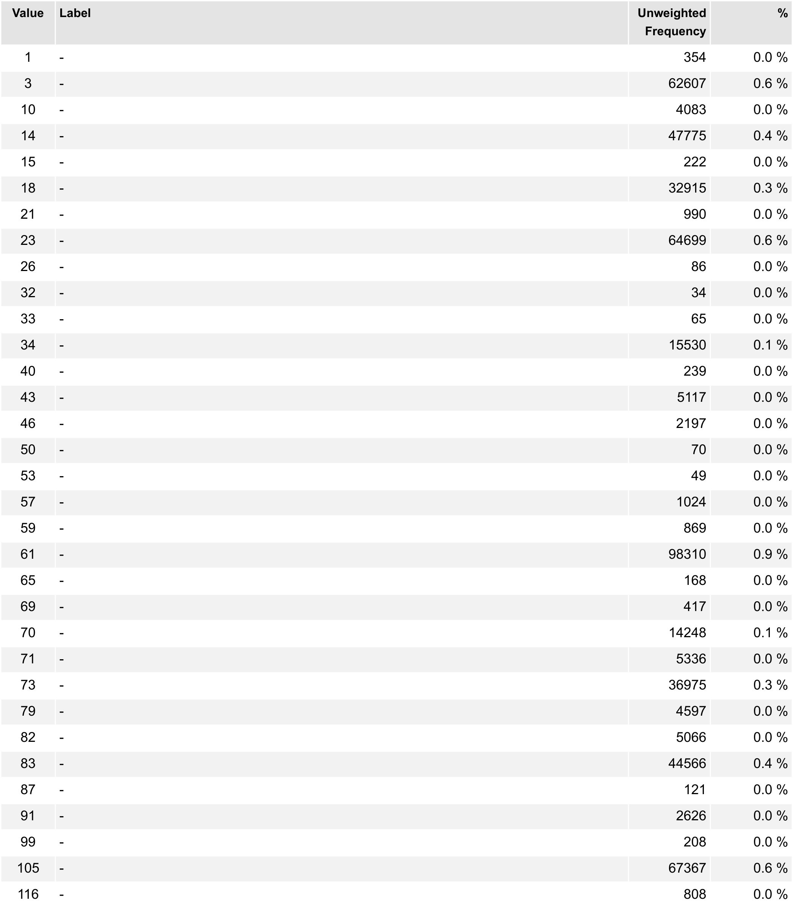


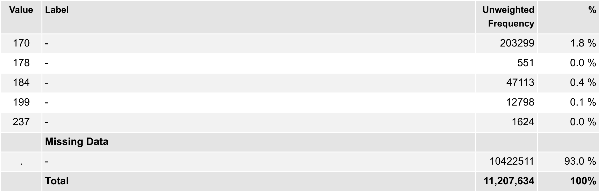

|        | Unweighted Frequency | %      |
|--------|----------------------|--------|
| 170    |                      |        |
| 178    | 203299               | 1.8 %  |
| 184    | 551                  | 0.0 %  |
| 199    | 47113                | 0.4 %  |
| 237    | 12798                | 0.1 %  |
| Missing Data | 1624 | 0.0 % |
| .      | 10422511             | 93.0 % |
| Total  | 11,207,634           | 100%   |

Based upon 785,123 valid cases out of 11,207,634 total cases.

- Mean: 92.05
- Median: 73.00
- Mode: 170.00
- Minimum: 1.00
- Maximum: 237.00
- Standard Deviation: 65.21

Location: 169-171 (width: 3; decimal: 0)  
Variable Type: numeric  
(Range of) Missing Values: -6, .  

BH029: MSA CODE 3

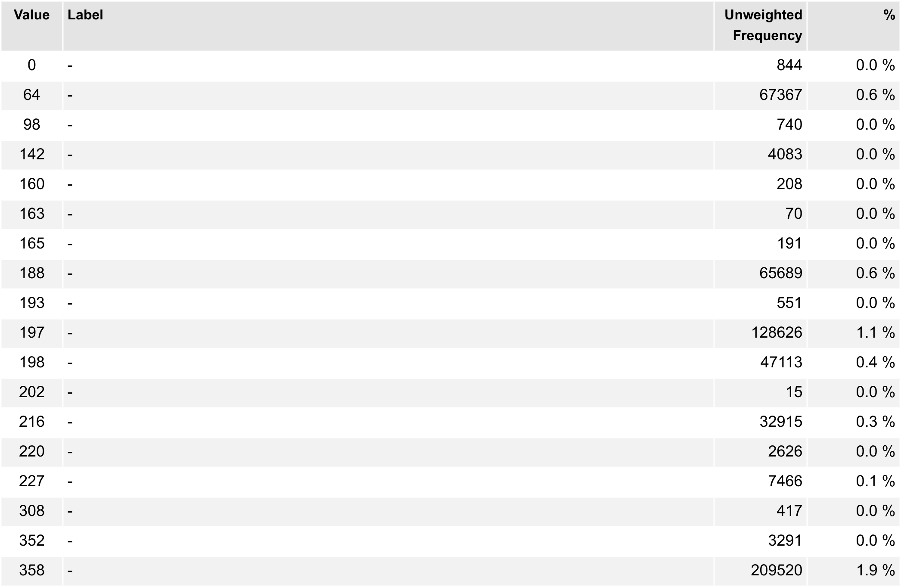

|      | Unweighted Frequency | %      |
|------|----------------------|--------|
| 0    | 844                  | 0.0 %  |
| 64   | 67367                | 0.6 %  |
| 98   | 740                  | 0.0 %  |
| 142  | 4083                 | 0.0 %  |
| 160  | 208                  | 0.0 %  |
| 163  | 70                   | 0.0 %  |
| 165  | 191                  | 0.0 %  |
| 188  | 65689                | 0.6 %  |
| 193  | 551                  | 0.0 %  |
| 197  | 128626               | 1.1 %  |
| 198  | 47113                | 0.4 %  |
| 202  | 15                   | 0.0 %  |
| 216  | 32915                | 0.3 %  |
| 220  | 2626                 | 0.0 %  |
| 227  | 7466                 | 0.1 %  |
| 308  | 417                  | 0.0 %  |
| 352  | 3291                 | 0.0 %  |
| 358  | 209520               | 1.9 %  |


#### 39_0.png

|           | Unweighted Frequency | %      |
|-----------|----------------------|--------|
| 372       | 142                  | 0.0 %  |
| 404       | 44375                | 0.4 %  |
| 411       | 5051                 | 0.0 %  |
| 413       | 168                  | 0.0 %  |
| 542       | 5336                 | 0.0 %  |
| 630       | 44484                | 0.4 %  |
| 635       | 3679                 | 0.0 %  |
| 685       | 63788                | 0.6 %  |
| 738       | 65                   | 0.0 %  |
| 768       | 2419                 | 0.0 %  |
| 892       | 39                   | 0.0 %  |
| 910       | 36962                | 0.3 %  |
| 974       | 6883                 | 0.1 %  |
| Missing Data |                   |        |
|           |                      |        |
| \.        |                      |        |
| Total     | 10422511             | 93.0 % |
|           | 11,207,634           | 100%   |

Based upon 785,123 valid cases out of 11,207,634 total cases.

- Mean: 353.06
- Median: 358.00
- Mode: 358.00
- Minimum: 0.00
- Maximum: 974.00
- Standard Deviation: 221.31

Location: 172-174 (width: 3; decimal: 0)

Variable Type: numeric

(Range of) Missing Values: -6, \.

#### BH030: LAST POPULATION 3

#### 39_1.png

|   | Unweighted Frequency | %      |
|---|----------------------|--------|
| 0 | 11207634             | 100.0% |
| Total | 11207634         | 100%   |

Based upon 11,207,634 valid cases out of 11,207,634 total cases.

- Mean: 0.00
- Median: 0.00
- Mode: 0.00
- Minimum: 0.00
- Maximum: 0.00
- Standard Deviation: 0.00

Location: 175-175 (width: 1; decimal: 0)

Variable Type: numeric


# BH031: CURRENT POPULATION 4

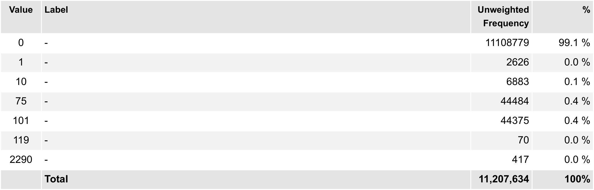
|                     | Unweighted Frequency | %       |
|---------------------|----------------------|---------|
| 0                   | 11108779             | 99.1 %  |
| 1                   | 2626                 | 0.0 %   |
| 10                  | 6883                 | 0.1 %   |
| 75                  | 44484                | 0.4 %   |
| 101                 | 44375                | 39 t-shirt with teal and red retro thread |
| 119                 | 70                   | 0.0 %   |
| 2290                | 417                  | 0.0 %   |
| **Total**           | **11,207,634**       | **100%**|

Based upon 11,207,634 valid cases out of 11,207,634 total cases.

- Mean: 0.79
- Median: 0.00
- Mode: 0.00
- Minimum: 0.00
- Maximum: 2290.00
- Standard Deviation: 16.04

Location: 176-179 (width: 4; decimal: 0)
Variable Type: numeric

# BH032: UCR COUNTY CODE 4

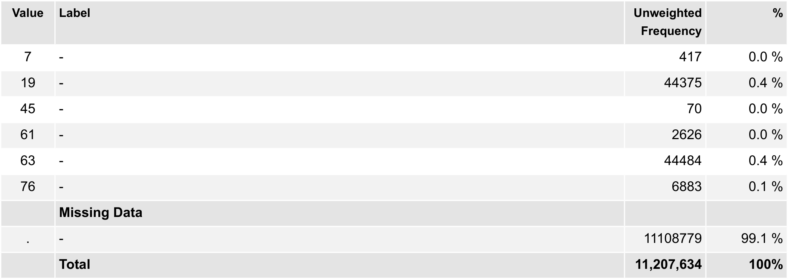
|                     | Unweighted Frequency | %       |
|---------------------|----------------------|---------|
| 7                   | 417                  | 0.0 %   |
| 19                  | 44375                | 0.4 %   |
| 45                  | 70                   | 0.0 %   |
| 61                  | 2626                 | 0.0 %   |
| 63                  | 44484                | 0.4 %   |
| 76                  | 6883                 | 0.1 %   |
| **Missing Data**    |                      |         |
| .                   | 11108779             | 99.1 %  |
| **Total**           | **11,207,634**       | **100%**|

Based upon 98,855 valid cases out of 11,207,634 total cases.

- Mean: 43.85
- Median: 63.00
- Mode: 63.00
- Minimum: 7.00
- Maximum: 76.00
- Standard Deviation: 22.97

Location: 180-181 (width: 2; decimal: 0)
Variable Type: numeric


BH033: MSA CODE 4


Based upon 98,855 valid cases out of 11,207,634 total cases.

- Mean: 210.57
- Median: 331.00
- Mode: 0.00
- Minimum: 0.00
- Maximum: 404.00
- Standard Deviation: 194.60

*Location: 182-184 (width: 3; decimal: 0)  
Variable Type: numeric  
(Range of) Missing Values: -6, . *

---

BH034: LAST POPULATION 4

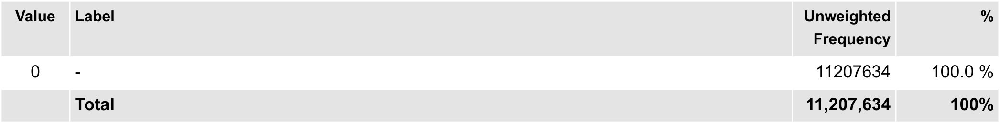

Based upon 11,207,634 valid cases out of 11,207,634 total cases.

- Mean: 0.00
- Median: 0.00
- Mode: 0.00
- Minimum: 0.00
- Maximum: 0.00
- Standard Deviation: 0.00

*Location: 185-185 (width: 1; decimal: 0)  
Variable Type: numeric*

---

BH035: CURRENT POPULATION 5


## BH036: UCR COUNTY CODE 5


Based upon 0 valid cases out of 11,207,634 total cases.

Location: 187-188 (width: 2; decimal: 0)  
Variable Type: numeric  
(Range of) Missing Values: -6, .

## BH037: MSA CODE 5

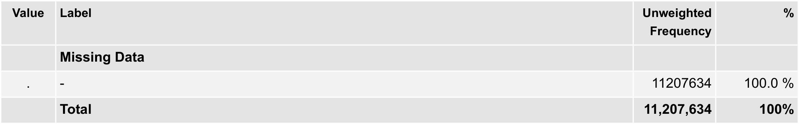

Based upon 0 valid cases out of 11,207,634 total cases.

Location: 189-190 (width: 2; decimal: 0)  
Variable Type: numeric  
(Range of) Missing Values: -6, .

## BH038: LAST POPULATION 5


Based upon 11,207,634 valid cases out of 11,207,634 total cases.


• Mean: 0.00
• Median: 0.00
• Mode: 0.00
• Minimum: 0.00
• Maximum: 0.00
• Standard Deviation: 0.00

*Location*: 191-191 (width: 1; decimal: 0)
*Variable Type*: numeric

---

## BH039: 01-06-12 INDICATOR

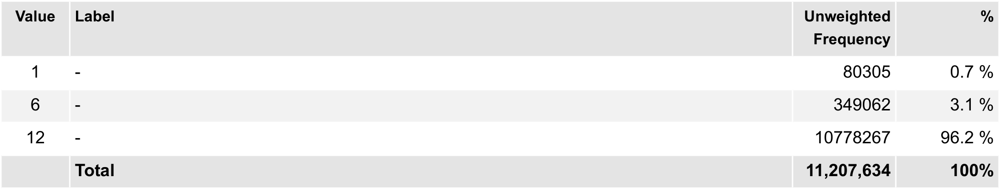

Based upon 11,207,634 valid cases out of 11,207,634 total cases.

• Mean: 11.73
• Median: 12.00
• Mode: 12.00
• Minimum: 1.00
• Maximum: 12.00
• Standard Deviation: 1.38

*Location*: 192-193 (width: 2; decimal: 0)
*Variable Type*: numeric
*(Range of)* *Missing Values*: -6

---

## BH040: NUMBER OF MONTHS REPORTED

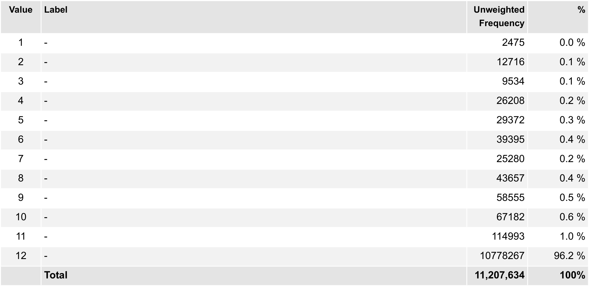


Based upon 11,207,634 valid cases out of 11,207,634 total cases.

- Mean: 11.86
- Median: 12.00
- Mode: 12.00
- Minimum: 1.00
- Maximum: 12.00
- Standard Deviation: 0.89

Location: 194-195 (width: 2; decimal: 0)
Variable Type: numeric

---

### BH041: MASTER FILE YEAR

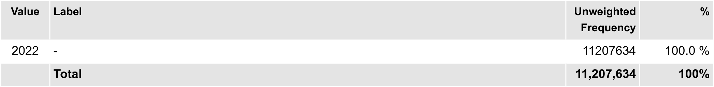

Based upon 11,207,634 valid cases out of 11,207,634 total cases.

- Mean: 2022.00
- Median: 2022.00
- Mode: 2022.00
- Minimum: 2022.00
- Maximum: 2022.00
- Standard Deviation: 0.00

Location: 196-199 (width: 4; decimal: 0)
Variable Type: numeric

---

### BH042: AGENCY ACTIVITY INDICATORS JANUARY (See Codebook)

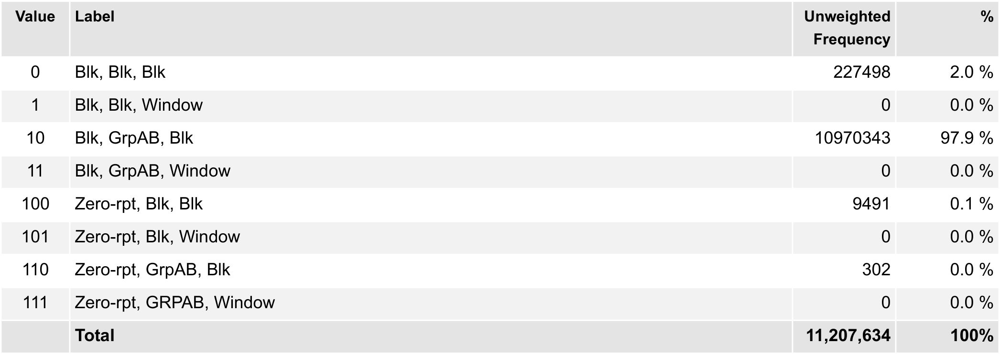

Based upon 11,207,634 valid cases out of 11,207,634 total cases.

- Minimum: 0.00
- Maximum: 110.00

Location: 200-202 (width: 3; decimal: 0)
Variable Type: numeric


# BH043: AGENCY ACTIVITY INDICATORS FEBRUARY (See Codebook)


Based upon 11,207,634 valid cases out of 11,207,634 total cases.

- Minimum: 0.00
- Maximum: 110.00

*Location:* 203-205 (width: 3; decimal: 0)
*Variable Type:* numeric

# BH044: AGENCY ACTIVITY INDICATORS MARCH (See Codebook)

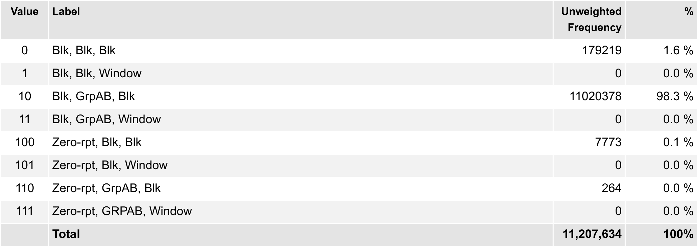

Based upon 11,207,634 valid cases out of 11,207,634 total cases.

- Minimum: 0.00
- Maximum: 110.00

*Location:* 206-208 (width: 3; decimal: 0)
*Variable Type:* numeric

# BH045: AGENCY ACTIVITY INDICATORS APRIL (See Codebook)

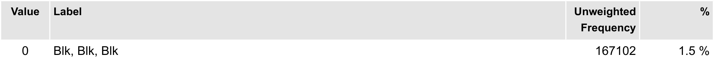


### 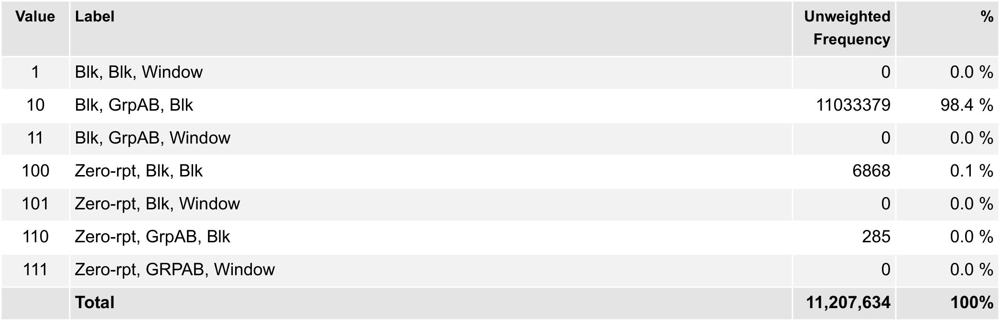

|   |                            | Unweighted Frequency | %       |
|---|----------------------------|----------------------|---------|
| 1 | Blk, Blk, Window           |                      | 0.0 %   |
| 10| Blk, GrpAB, Blk            | 11033379             | 98.4 %  |
| 11| Blk, GrpAB, Window         |                      | 0.0 %   |
| 100| Zero-rpt, Blk, Blk         | 6868                 | 0.1 %   |
| 101| Zero-rpt, Blk, Window      |                      | 0.0 %   |
| 110| Zero-rpt, GrpAB, Blk       | 285                  | 0.0 %   |
| 111| Zero-rpt, GRPAB, Window   |                      | 0.0 %   |
|    | **Total**                  | **11,207,634**       | **100%**|

Based upon 11,207,634 valid cases out of 11,207,634 total cases.

- Minimum: 0.00
- Maximum: 110.00

Location: 209-211 (width: 3; decimal: 0)  
Variable Type: numeric

### BH046: AGENCY ACTIVITY INDICATORS MAY (See Codebook)

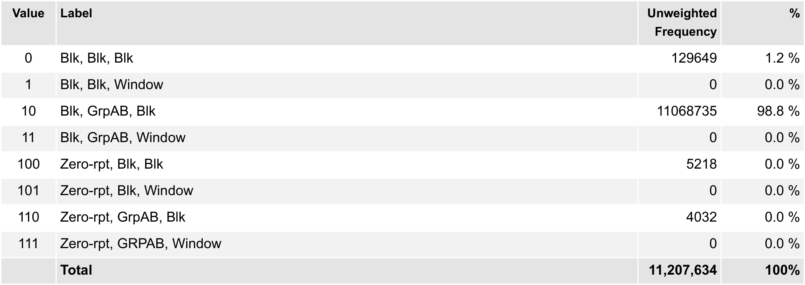

|   |                            | Unweighted Frequency | %       |
|---|----------------------------|----------------------|---------|
| 0 | Blk, Blk, Blk              | 129649               | 1.2 %   |
| 1 | Blk, Blk, Window           |                      | 0.0 %   |
| 10| Blk, GrpAB, Blk            | 11068735             | 98.8 %  |
| 11| Blk, GrpAB, Window         |                      | 0.0 %   |
| 100| Zero-rpt, Blk, Blk         | 5218                 | 0.0 %   |
| 101| Zero-rpt, Blk, Window      |                      | 0.0 %   |
| 110| Zero-rpt, GrpAB, Blk       | 4032                 | 0.0 %   |
| 111| Zero-rpt, GRPAB, Window   |                      | 0.0 %   |
|    | **Total**                  | **11,207,634**       | **100%**|

Based upon 11,207,634 valid cases out of 11,207,634 total cases.

- Minimum: 0.00
- Maximum: 110.00

Location: 212-214 (width: 3; decimal: 0)  
Variable Type: numeric

### BH047: AGENCY ACTIVITY INDICATORS JUNE (See Codebook)

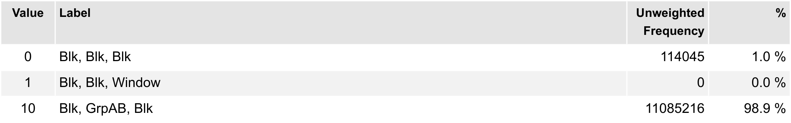

|   |                            | Unweighted Frequency | %       |
|---|----------------------------|----------------------|---------|
| 0 | Blk, Blk, Blk              | 114045               | 1.0 %   |
| 1 | Blk, Blk, Window           |                      | 0.0 %   |
| 10| Blk, GrpAB, Blk            | 11085216             | 98.9 %  |


## 47_0.png

|                     | Unweighted Frequency | %      |
|---------------------|----------------------|--------|
| 11  Blk, GrpAB, Window  | 0                    | 0.0 %  |
| 100 Zero-rpt, Blk, Blk  | 8108                 | 0.1 %  |
| 101 Zero-rpt, Blk, Window | 0                   | 0.0 %  |
| 110 Zero-rpt, GrpAB, Blk | 265                 | 0.0 %  |
| 111 Zero-rpt, GRPAB, Window | 0                | 0.0 %  |
| **Total**               | **11,207,634**       | **100%**|

Based upon 11,207,634 valid cases out of 11,207,634 total cases.

- Minimum: 0.00
- Maximum: 110.00

*Location: 215-217 (width: 3; decimal: 0)*
*Variable Type: numeric*

## BH048: AGENCY ACTIVITY INDICATORS JULY (See Codebook)

## 47_1.png

|                     | Unweighted Frequency | %      |
|---------------------|----------------------|--------|
| 0  Blk, Blk, Blk       | 103483               | 0.9 %  |
| 1  Blk, Blk, Window     | 0                    | 0.0 %  |
| 10 Blk, GrpAB, Blk     | 11092095             | 99.0 %  |
| 11 Blk, GrpAB, Window | 0                    | 0.0 %  |
| 100 Zero-rpt, Blk, Blk  | 11756                | 0.1 %  |
| 101 Zero-rpt, Blk, Window | 0                   | 0.0 %  |
| 110 Zero-rpt, GrpAB, Blk | 300                 | 0.0 %  |
| 111 Zero-rpt, GRPAB, Window | 0                | 0.0 %  |
| **Total**               | **11,207,634**       | **100%**|

Based upon 11,207,634 valid cases out of 11,207,634 total cases.

- Minimum: 0.00
- Maximum: 110.00

*Location: 218-220 (width: 3; decimal: 0)*
*Variable Type: numeric*

## BH049: AGENCY ACTIVITY INDICATORS AUGUST (See Codebook)

## 47_2.png

|                     | Unweighted Frequency | %      |
|---------------------|----------------------|--------|
| 0  Blk, Blk, Blk       | 78058                | 0.7 %  |
| 1  Blk, Blk, Window     | 0                    | 0.0 %  |
| 10 Blk, GrpAB, Blk     | 11122085             | 99.2 %  |
| 11 Blk, GrpAB, Window | 0                    | 0.0 %  |
| 100 Zero-rpt, Blk, Blk  | 6374                 | 0.1 %  |


101 | Zero-rpt, Blk, Window | 0 | 0.0%
---|---|---|---
110 | Zero-rpt, GrpAB, Blk | 217 | 0.0%
111 | Zero-rpt, GRPAB, Window | 0 | 0.0%
**Total** | | **11,207,634** | **100%**

Based upon 11,207,634 valid cases out of 11,207,634 total cases.

* Minimum: 0.00
* Maximum: 110.00

*Location: 221-223 (width: 3; decimal: 0)  
Variable Type: numeric*

## BH050: AGENCY ACTIVITY INDICATORS SEPTEMBER (See Codebook)
0 | Blk, Blk, Blk | 75884 | 0.7%
---|---|---|---
1 | Blk, Blk, Window | 0 | 0.0%
10 | Blk, GrpAB, Blk | 11124719 | 99.3%
11 | Blk, GrpAB, Window | 0 | 0.0%
100 | Zero-rpt, Blk, Blk | 6907 | 0.1%
101 | Zero-rpt, Blk, Window | 0 | 0.0%
110 | Zero-rpt, GrpAB, Blk | 124 | 0.0%
111 | Zero-rpt, GRPAB, Window | 0 | 0.0%
**Total** | | **11,207,634** | **100%**

Based upon 11,207,634 valid cases out of 11,207,634 total cases.

* Minimum: 0.00
* Maximum: 110.00

*Location: 224-226 (width: 3; decimal: 0)  
Variable Type: numeric*

## BH051: AGENCY ACTIVITY INDICATORS OCTOBER (See Codebook)
0 | Blk, Blk, Blk | 92447 | 0.8%
---|---|---|---
1 | Blk, Blk, Window | 0 | 0.0%
10 | Blk, GrpAB, Blk | 11107399 | 99.1%
11 | Blk, GrpAB, Window | 0 | 0.0%
100 | Zero-rpt, Blk, Blk | 7683 | 0.1%
101 | Zero-rpt, Blk, Window | 0 | 0.0%
110 | Zero-rpt, GrpAB, Blk | 105 | 0.0%
**Total** | | **11,207,634** | **100%**


111 Zero-rpt, GRPAB, Window | Unweighted Frequency | % 
--- | --- | ---
0 | 0.0 %

**Total** | **11,207,634** | **100%**

Based upon 11,207,634 valid cases out of 11,207,634 total cases.

- Minimum: 0.00
- Maximum: 110.00

*Location: 227-229 (width: 3; decimal: 0)*
*Variable Type: numeric*

# BH052: AGENCY ACTIVITY INDICATORS NOVEMBER (See Codebook)

0 Blk, Blk, Blk | Unweighted Frequency | % 
--- | --- | ---
121602 | 1.1 %
1 | Blk, Blk, Window | 0 | 0.0 %
10 | Blk, GrpAB, Blk | 11077218 | 98.8 %
11 | Blk, GrpAB, Window | 0 | 0.0 %
100 | Zero-rpt, Blk, Blk | 8687 | 0.1 %
101 | Zero-rpt, Blk, Window | 0 | 0.0 %
110 | Zero-rpt, GrpAB, Blk | 127 | 0.0 %
111 | Zero-rpt, GRPAB, Window | 0 | 0.0 %

**Total** | **11,207,634** | **100%**

Based upon 11,207,634 valid cases out of 11,207,634 total cases.

- Minimum: 0.00
- Maximum: 110.00

*Location: 230-232 (width: 3; decimal: 0)*
*Variable Type: numeric*

# BH053: AGENCY ACTIVITY INDICATORS DECEMBER (See Codebook)

0 Blk, Blk, Blk | Unweighted Frequency | % 
--- | --- | ---
190784 | 1.7 %
1 | Blk, Blk, Window | 0 | 0.0 %
10 | Blk, GrpAB, Blk | 11005483 | 98.2 %
11 | Blk, GrpAB, Window | 0 | 0.0 %
100 | Zero-rpt, Blk, Blk | 11244 | 0.1 %
101 | Zero-rpt, Blk, Window | 0 | 0.0 %
110 | Zero-rpt, GrpAB, Blk | 123 | 0.0 %
111 | Zero-rpt, GRPAB, Window | 0 | 0.0 %

**Total** | **11,207,634** | **100%**


Based upon 11,207,634 valid cases out of 11,207,634 total cases.

- Minimum: 0.00
- Maximum: 110.00

Location: 233-235 (width: 3; decimal: 0)  
Variable Type: numeric

## BH054: FIPS COUNTY 1

|  | Unweighted Frequency | % |
|---|-----------------------|---|
| 1  | 249655               | 2.2 % |
| 3  | 355153               | 3.2 % |
| 5  | 223833               | 2.0 % |
| 6  | 178                  | 0.0 % |
| 7  | 107541               | 1.0 % |
| 9  | 113780               | 1.0 % |
| 11 | 108806               | 1.0 % |
| 12 | 723                  | 0.0 % |
| 13 | 289989               | 2.6 % |
| 14 | 3154                 | 0.0 % |
| 15 | 97771                | 0.9 % |
| 16 | 47                   | 0.0 % |
| 17 | 119325               | 1.1 % |
| 19 | 175721               | 1.6 % |
| 21 | 127287               | 1.1 % |
| 23 | 54523                | 0.5 % |
| 25 | 118838               | 1.1 % |
| 27 | 112124               | 1.0 % |
| 28 | 173                  | 0.0 % |
| 29 | 252780               | 2.3 % |
| 31 | 522768               | 4.7 % |
| 33 | 248521               | 2.2 % |
| 35 | 220744               | 2.0 % |
| 36 | 144                  | 0.0 % |
| 37 | 193165               | 1.7 % |
| 39 | 87085                | 0.8 % |
| 41 | 103310               | 0.9 % |
| 43 | 50908                | 0.5 % |
| 45 | 97177                | 0.9 % |
| 47 | 80993                | 0.7 % |
| 49 | 161862               | 1.4 % |
| 50 | 236                  | 0.0 % |


|       |           | Unweighted Frequency | %    |
|-------|-----------|----------------------|------|
| 51    | -         | 170781               | 1.5 %|
| 53    | -         | 192086               | 1.7 %|
| 55    | -         | 75302                | 0.7 %|
| 57    | -         | 87646                | 0.8 %|
| 59    | -         | 201428               | 1.8 %|
| 60    | -         | 32                   | 0.0 %|
| 61    | -         | 121107               | 1.1 %|
| 63    | -         | 123487               | 1.1 %|
| 65    | -         | 74597                | 0.7 %|
| 67    | -         | 160507               | 1.4 %|
| 69    | -         | 56812                | 0.5 %|
| 70    | -         | 2                    | 0.0 %|
| 71    | -         | 76129                | 0.7 %|
| 73    | -         | 226539               | 2.0 %|
| 75    | -         | 29759                | 0.3 %|
| 77    | -         | 114206               | 1.0 %|
| 78    | -         | 73                   | 0.0 %|
| 79    | -         | 120503               | 1.1 %|
|       | Missing Data| 183927              | 1.6 %|
|       | Total     | 11,207,634           | 100% |

Please note that only the first 50 response categories are displayed in the PDF codebook. To view all response categories, please analyze the data file in the statistical package of your choice (SAS, SPSS, Stata, R).

Based upon 11,023,707 valid cases out of 11,207,634 total cases.

- Mean: 101.70
- Minimum: 1.00
- Maximum: 840.00
- Standard Deviation: 118.90

**Location:** 236-238 (width: 3; decimal: 0)  
**Variable Type:** numeric  
**(Range of) Missing Values:** -9, -6, .

---

### BH055: FIPS COUNTY 2

|       |           | Unweighted Frequency | %    |
|-------|-----------|----------------------|------|
| 1     | -         | 44431                | 0.4 %|
| 3     | -         | 3816                 | 0.0 %|
| 5     | -         | 4078                 | 0.0 %|
| 7     | -         | 9974                 | 0.1 %|
| 9     | -         | 6338                 | 0.1 %|


|        | Unweighted Frequency | %      |
|--------|-----------------------|--------|
| 11     |                       | 0.0 %  |
| 13     |                       | 0.0 %  |
| 15     | 16172                 | 0.1 %  |
| 17     | 49352                 | 0.4 %  |
| 19     | 5262                  | 0.0 %  |
| 21     | 2354                  | 0.0 %  |
| 23     | 4037                  | 0.0 %  |
| 25     | 333                   | 0.0 %  |
| 27     | 2831                  | 0.0 %  |
| 29     | 2345                  | 0.0 %  |
| 31     | 5175                  | 0.0 %  |
| 33     | 569                   | 0.0 %  |
| 35     | 12753                 | 0.1 %  |
| 37     | 11038                 | 0.1 %  |
| 39     | 181                   | 0.0 %  |
| 41     | 65369                 | 0.6 %  |
| 43     | 20690                 | 0.2 %  |
| 45     | 17568                 | 0.2 %  |
| 47     | 44605                 | 0.4 %  |
| 49     | 7171                  | 0.1 %  |
| 51     | 7361                  | 0.1 %  |
| 53     | 20689                 | 0.2 %  |
| 55     | 5580                  | 0.0 %  |
| 57     | 9744                  | 0.1 %  |
| 59     | 10924                 | 0.1 %  |
| 61     | 1938                  | 0.0 %  |
| 63     | 41929                 | 0.4 %  |
| 65     | 3279                  | 0.0 %  |
| 67     | 63002                 | 0.6 %  |
| 69     | 2893                  | 0.0 %  |
| 71     | 6473                  | 0.1 %  |
| 73     | 11469                 | 0.1 %  |
| 75     | 70                    | 0.0 %  |
| 77     | 520                   | 0.0 %  |
| 79     | 2511                  | 0.0 %  |
| 81     | 12049                 | 0.1 %  |
| 83     | 26249                 | 0.2 %  |
| 85     | 117763                | 1.1 %  |
| 87     | 215                   | 0.0 %  |


### 53_0.png

|                       | Unweighted Frequency | %        |
|-----------------------|----------------------|----------|
| 89                    | 47147                | 0.4 %    |
| 93                    | 6901                 | 0.1 %    |
| 95                    | 330                  | 0.0 %    |
| 97                    | 1005                 | 0.0 %    |
| 99                    | 6217                 | 0.1 %    |
| 103                   | 540                  | 0.0 %    |
| **Missing Data**      |                      |          |
| .                     | 9671636              | 86.3 %   |
| **Total**             | 11,207,634           | 100%     |

Please note that only the first 50 response categories are displayed in the PDF codebook. To view all response categories, please analyze the data file in the statistical package of your choice (SAS, SPSS, Stata, R).

Based upon 1,535,998 valid cases out of 11,207,634 total cases.

- Mean: 145.03
- Median: 113.00
- Mode: 157.00
- Minimum: 1.00
- Maximum: 493.00
- Standard Deviation: 125.51

Location: 239-241 (width: 3; decimal: 0)  
Variable Type: numeric  
(Range of) Missing Values: -9, -6, .  

### BH056: FIPS COUNTY 3
#### 53_1.png

|     | Unweighted Frequency | %        |
|-----|----------------------|----------|
| 1   | 354                  | 0.0 %    |
| 5   | 62607                | 0.6 %    |
| 19  | 4083                 | 0.0 %    |
| 27  | 47775                | 0.4 %    |
| 29  | 222                  | 0.0 %    |
| 35  | 32915                | 0.3 %    |
| 41  | 990                  | 0.0 %    |
| 45  | 64699                | 0.6 %    |
| 51  | 86                   | 0.0 %    |
| 63  | 34                   | 0.0 %    |
| 65  | 65                   | 0.0 %    |
| 67  | 15530                | 0.1 %    |
| 79  | 239                  | 0.0 %    |
| 85  | 5117                 | 0.0 %    |
| 91  | 2197                 | 0.0 %    |


|                  | Unweighted Frequency | %       |
|------------------|-----------------------|---------|
| 97               | 70                    | 0.0 %   |
| 105              | 49                    | 0.0 %   |
| 113              | 1024                  | 0.0 %   |
| 117              | 869                   | 0.0 %   |
| 121              | 98310                 | 0.9 %   |
| 129              | 168                   | 0.0 %   |
| 139              | 14665                 | 0.1 %   |
| 141              | 5336                  | 0.0 %   |
| 145              | 36975                 | 0.3 %   |
| 157              | 4597                  | 0.0 %   |
| 163              | 5066                  | 0.0 %   |
| 165              | 44566                 | 0.4 %   |
| 173              | 121                   | 0.0 %   |
| 181              | 2626                  | 0.0 %   |
| 197              | 208                   | 0.0 %   |
| 209              | 67367                 | 0.6 %   |
| 231              | 808                   | 0.0 %   |
| 339              | 203299                | 1.8 %   |
| 355              | 551                   | 0.0 %   |
| 367              | 47113                 | 0.4 %   |
| 397              | 12798                 | 0.1 %   |
| 473              | 1624                  | 0.0 %   |
| 900 UCR          | 0                     | 0.0 %   |
| Missing Data     |                       |         |
| .                | 10422511              | 93.0 %  |
| Total            | 11,207,634            | 100 %   |

Based upon 785,123 valid cases out of 11,207,634 total cases.

- Mean: 183.10
- Median: 145.00
- Mode: 339.00
- Minimum: 1.00
- Maximum: 473.00
- Standard Deviation: 130.43

Location: 242-244 (width: 3; decimal: 0)

Variable Type: numeric

(Range of) Missing Values: -9, -6, .

**BH057: FIPS COUNTY 4**


BH058: FIPS COUNTY 5

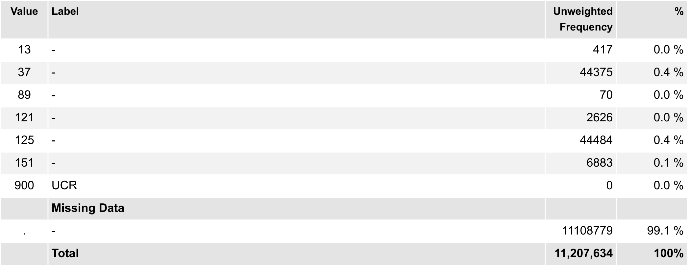

Based upon 98,855 valid cases out of 11,207,634 total cases.

- Mean: 86.70
- Median: 125.00
- Mode: 125.00
- Minimum: 13.00
- Maximum: 151.00
- Standard Deviation: 45.95

Location: 245-247 (width: 3; decimal: 0)  
Variable Type: numeric  
(Range of) Missing Values: -9, -6, .

---

BH058: FIPS COUNTY 5

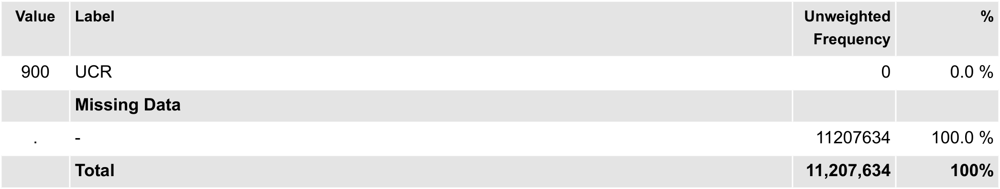

Based upon 0 valid cases out of 11,207,634 total cases.

Location: 248-250 (width: 3; decimal: 0)  
Variable Type: numeric  
(Range of) Missing Values: -9, -6, .

---

BH059: DATE STATE BEGAN IBR FOR REPORTING LEOKA


Based upon 0 valid cases out of 11,207,634 total cases.


### V1006: REPORT DATE INDICATOR

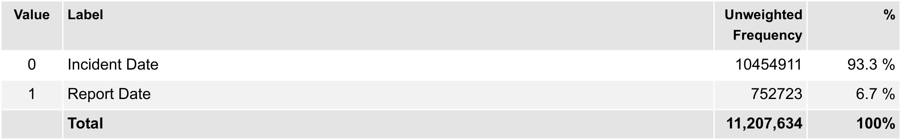
```
0    Incident Date        10454911       93.3 %
1    Report Date           752723         6.7 %
     Total                   11,207,634    100%
```

Based upon 11,207,634 valid cases out of 11,207,634 total cases.

- Minimum: 0.00
- Maximum: 1.00

```
Location: 262-263 (width: 2; decimal: 0)
Variable Type: numeric
(Range of) Missing Values: -5
```

### V1007: INCIDENT DATE HOUR

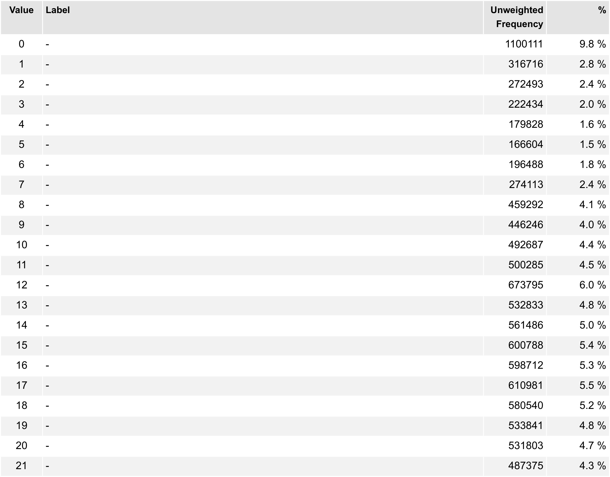


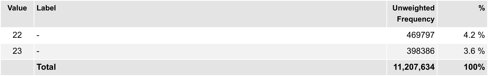

Based upon 11,207,634 valid cases out of 11,207,634 total cases.

- Mean: 12.23
- Median: 13.00
- Mode: 0.00
- Minimum: 0.00
- Maximum: 23.00
- Standard Deviation: 6.93

Location: 264-265 (width: 2; decimal: 0)

Variable Type: numeric

(Range of) Missing Values: -7, -5

## V1008: TOTAL OFFENSE SEGMENTS


Based upon 11,207,634 valid cases out of 11,207,634 total cases.

- Mean: 1.13
- Median: 1.00
- Mode: 1.00
- Minimum: 1.00
- Maximum: 9.00
- Standard Deviation: 0.39

Location: 266-267 (width: 2; decimal: 0)

Variable Type: numeric

(Range of) Missing Values: -5

## V1009: TOTAL VICTIM SEGMENTS


|    | Unweighted Frequency | %    |
|----|----------------------|------|
| 1  | 10145226             | 90.5 |
| 2  | 859182               | 7.7  |
| 3  | 129873               | 1.2  |
| 4  | 38745                | 0.3  |
| 5  | 15493                | 0.1  |
| 6  | 7381                 | 0.1  |
| 7  | 3854                 | 0.0  |
| 8  | 2306                 | 0.0  |
| 9  | 1450                 | 0.0  |
| 10 | 976                  | 0.0  |
| 11 | 651                  | 0.0  |
| 12 | 487                  | 0.0  |
| 13 | 387                  | 0.0  |
| 14 | 287                  | 0.0  |
| 15 | 198                  | 0.0  |
| 16 | 145                  | 0.0  |
| 17 | 148                  | 0.0  |
| 18 | 109                  | 0.0  |
| 19 | 95                   | 0.0  |
| 20 | 72                   | 0.0  |
| 21 | 56                   | 0.0  |
| 22 | 52                   | 0.0  |
| 23 | 33                   | 0.0  |
| 24 | 47                   | 0.0  |
| 25 | 32                   | 0.0  |
| 26 | 29                   | 0.0  |
| 27 | 23                   | 0.0  |
| 28 | 25                   | 0.0  |
| 29 | 17                   | 0.0  |
| 30 | 11                   | 0.0  |
| 31 | 19                   | 0.0  |
| 32 | 13                   | 0.0  |
| 33 | 14                   | 0.0  |
| 34 | 19                   | 0.0  |
| 35 | 12                   | 0.0  |
| 36 | 9                    | 0.0  |
| 37 | 4                    | 0.0  |
| 38 | 9                    | 0.0  |
| 39 | 13                   | 0.0  |


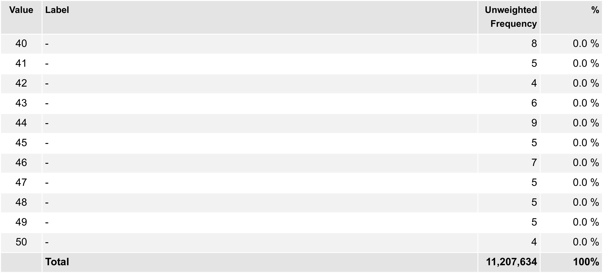

Please note that only the first 50 response categories are displayed in the PDF codebook. To view all response categories, please analyze the data file in the statistical package of your choice (SAS, SPSS, Stata, R).

Based upon 11,207,634 valid cases out of 11,207,634 total cases.

- Mean: 1.13
- Median: 1.00
- Mode: 1.00
- Minimum: 1.00
- Maximum: 163.00
- Standard Deviation: 0.57

Location: 268-270 (width: 3; decimal: 0)  
Variable Type: numeric  
(Range of) Missing Values: -5  

# V1010: TOTAL OFFENDER SEGMENTS


Unweighted Frequency   | %
------------------------|-----
13                      | 54   | 0.0%
14                      | 30   | 0.0%
15                      | 38   | 0.0%
16                      | 18   | 0.0%
17                      | 14   | 0.0%
18                      | 14   | 0.0%
19                      | 11   | 0.0%
20                      |  8   | 0.0%
21                      | 10   | 0.0%
22                      |  7   | 0.0%
23                      |  5   | 0.0%
24                      |  3   | 0.0%
25                      |  3   | 0.0%
26                      |  3   | 0.0%
27                      |  3   | 0.0%
28                      |  4   | 0.0%
29                      |  1   | 0.0%
30                      |  2   | 0.0%
31                      |  1   | 0.0%
32                      |  1   | 0.0%
35                      |  1   | 0.0%
37                      |  1   | 0.0%
38                      |  1   | 0.0%
39                      |  1   | 0.0%
40                      |  1   | 0.0%
45                      |  1   | 0.0%
59                      |  1   | 0.0%
60                      |  1   | 0.0%
65                      |  1   | 0.0%
86                      |  1   | 0.0%
Total                   | 11,207,634 | 100%

Based upon 11,207,634 valid cases out of 11,207,634 total cases.

- Mean: 1.11
- Median: 1.00
- Mode: 1.00
- Minimum: 1.00
- Maximum: 86.00
- Standard Deviation: 0.44

*Location:* 271-272 (width: 2; decimal: 0)

*Variable Type:* numeric


## V1011: TOTAL ARRESTEE SEGMENTS

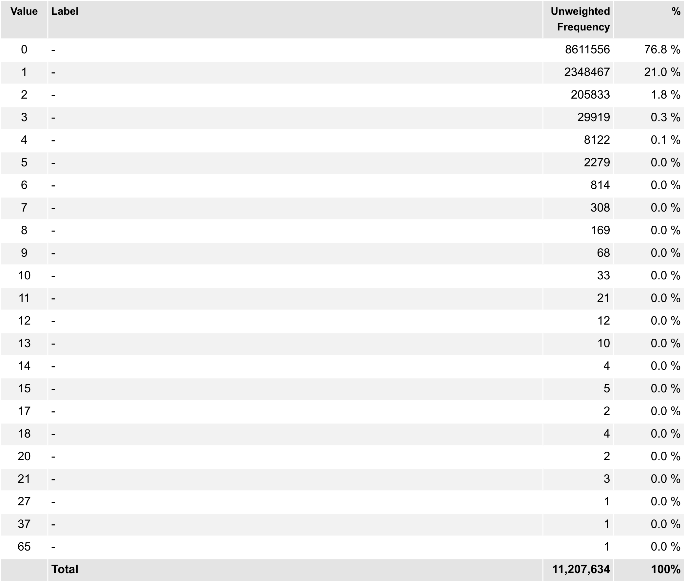

Based upon 11,207,634 valid cases out of 11,207,634 total cases.

- Mean: 0.26
- Median: 0.00
- Mode: 0.00
- Minimum: 0.00
- Maximum: 65.00
- Standard Deviation: 0.51

Location: 273-274 (width: 2; decimal: 0)  
Variable Type: numeric  
(Range of) Missing Values: -5

## V1012: CITY SUBMISSION


## 62_0.png

| Unweighted Frequency | %            |
|----------------------|--------------|
| Missing Data         |              |
| -6 Not Applicable    | 11,207,634   | 100% |
| Total                | 11,207,634   | 100% |

Based upon 0 valid cases out of 11,207,634 total cases.

**Location:** 275-276 (width: 2; decimal: 0)  
**Variable Type:** character  
**(Range of) Missing Values:** -5, -6

## V1013: CLEARED EXCEPTIONALLY

## 62_1.png

| Unweighted Frequency | %            |
|----------------------|--------------|
| 1 Death of offender                                  | 3,518   | 0.0% |
| 2 Prosecution declined                               | 149,661 | 1.3% |
| 3 In custody of other jurisdiction (includes extraditional denied) | 7,416   | 0.1% |
| 4 Victim refused coop                                | 152,021 | 1.4% |
| 5 Juvenile/no custody                                | 23,711  | 0.2% |
| .                                                    | 10,871,307 | 97.0% |
| Total                                                | 11,207,634 | 100% |

Based upon 336,327 valid cases out of 11,207,634 total cases.

- Minimum: 1.00
- Maximum: 5.00

**Location:** 277-278 (width: 2; decimal: 0)  
**Variable Type:** numeric  
**(Range of) Missing Values:** -6, -5, .

## V1014: EXCEPTIONAL CLEARANCE DATE

## 62_2.png

| Label      | Unweighted Frequency | %            |
|------------|----------------------|--------------|
| 01-APR-2022 | 859                 | 0.0% |
| 01-APR-2023 | 12                  | 0.0% |
| 01-AUG-2022 | 1,048               | 0.0% |
| 01-DEC-2022 | 1,056               | 0.0% |
| 01-FEB-2022 | 819                 | 0.0% |
| 01-FEB-2023 | 272                 | 0.0% |
| 01-JAN-2022 | 248                 | 0.0% |
| 01-JAN-2023 | 164                 | 0.0% |
| 01-JUL-2022 | 770                 | 0.0% |
| 01-JUN-2022 | 1,115               | 0.0% |


| Label        | Unweighted Frequency | %       |
|--------------|----------------------|---------|
| 01-MAR-2022  | -                    | 945     | 0.0 % |
| 01-MAR-2023  | -                    | 121     | 0.0 % |
| 01-MAY-2022  | -                    | 422     | 0.0 % |
| 01-NOV-2022  | -                    | 1133    | 0.0 % |
| 01-OCT-2022  | -                    | 419     | 0.0 % |
| 01-SEP-2022  | -                    | 980     | 0.0 % |
| 02-APR-2022  | -                    | 430     | 0.0 % |
| 02-APR-2023  | -                    | 15      | 0.0 % |
| 02-AUG-2022  | -                    | 987     | 0.0 % |
| 02-DEC-2022  | -                    | 921     | 0.0 % |
| 02-FEB-2022  | -                    | 766     | 0.0 % |
| 02-FEB-2023  | -                    | 257     | 0.0 % |
| 02-JAN-2022  | -                    | 259     | 0.0 % |
| 02-JAN-2023  | -                    | 298     | 0.0 % |
| 02-JUL-2022  | -                    | 410     | 0.0 % |
| 02-JUN-2022  | -                    | 1060    | 0.0 % |
| 02-MAR-2022  | -                    | 1016    | 0.0 % |
| 02-MAR-2023  | -                    | 154     | 0.0 % |
| 02-MAY-2022  | -                    | 1050    | 0.0 % |
| 02-NOV-2022  | -                    | 1087    | 0.0 % |
| 02-OCT-2022  | -                    | 446     | 0.0 % |
| 02-SEP-2022  | -                    | 905     | 0.0 % |
| 03-APR-2022  | -                    | 462     | 0.0 % |
| 03-APR-2023  | -                    | 32      | 0.0 % |
| 03-AUG-2022  | -                    | 953     | 0.0 % |
| 03-DEC-2022  | -                    | 350     | 0.0 % |
| 03-FEB-2022  | -                    | 744     | 0.0 % |
| 03-FEB-2023  | -                    | 212     | 0.0 % |
| 03-JAN-2023  | -                    | 338     | 0.0 % |
| 03-JUL-2022  | -                    | 784     | 0.0 % |
| 03-JUN-2022  | -                    | 399     | 0.0 % |
| 03-MAR-2022  | -                    | 898     | 0.0 % |
| 03-MAR-2023  | -                    | 978     | 0.0 % |
| 03-MAY-2022  | -                    | 159     | 0.0 % |
| 03-NOV-2022  | -                    | 1249    | 0.0 % |
| 03-OCT-2022  | -                    | 1142    | 0.0 % |
| 03-SEP-2022  | -                    | 1143    | 0.0 % |
| 04-APR-2022  | -                    | 399     | 0.0 % |
| 04-APR-2022  | -                    | 1172    | 0.0 % |


04-APR-2023

| Label           | Unweighted Frequency | %      |
|-----------------|----------------------|--------|
| -               | 74                   | 0.0 %  |
| Missing Data    | -                    | 10871307 | 97.0 % |
| Total           | 11,207,634           | 100%   |

Please note that only the first 50 response categories are displayed in the PDF codebook. To view all response categories, please analyze the data file in the statistical package of your choice (SAS, SPSS, Stata, R).

Based upon 336,327 valid cases out of 11,207,634 total cases.

Location: 279-289 (width: 11; decimal: 0)

Variable Type: character

(Range of) Missing Values:

---

V1016: CARGO THEFT

|                         | Unweighted Frequency | %      |
|-------------------------|----------------------|--------|
| 1 No                    | 11194632             | 99.9 % |
| 2 Yes                   | 13002                | 0.1 %  |
| Total                   |                      | 11,207,634 | 100% |

Based upon 11,207,634 valid cases out of 11,207,634 total cases.

- Minimum: 1.00
- Maximum: 2.00

Location: 290-291 (width: 2; decimal: 0)

Variable Type: numeric

(Range of) Missing Values: -6, -5

---

V20061: UCR OFFENSE CODE - 1

|                                      | Unweighted Frequency | %      |
|--------------------------------------|----------------------|--------|
| 91  Murder/Nonnegligent Manslaughter | 14994                | 0.1 %  |
| 92  Negligent Manslaughter           | 1585                 | 0.0 %  |
| 93  Justifiable Homicide             | 617                  | 0.0 %  |
| 100 Kidnaping/Abduction              | 39070                | 0.3 %  |
| 111 Rape                             | 74788                | 0.7 %  |
| 112 Sodomy                           | 16132                | 0.1 %  |
| 113 Sexual Assault With An Object    | 7003                 | 0.1 %  |
| 114 Fondling (Indecent Liberties/Child Molesting) | 79452 | 0.7 %  |
| 120 Robbery                          | 146656               | 1.3 %  |
| 131 Aggravated Assault               | 527725               | 4.7 %  |
| 132 Simple Assault                   | 1690938              | 15.1 % |
| 133 Intimidation                     | 457918               | 4.1 %  |


|               | Unweighted Frequency | %     |
|---------------|-----------------------|-------|
| 200 Arson     | 28612                 | 0.3 % |
| 210 Extortion/Blackmail | 19366        | 0.2 % |
| 220 Burglary/Breaking and Entering | 646654 | 5.8 % |
| 231 Pocket-picking | 20259             | 0.2 % |
| 232 Purse-snatching | 10496            | 0.1 % |
| 233 Shoplifting | 722400               | 6.4 % |
| 234 Theft From Building | 259459       | 2.3 % |
| 235 Theft From Coin-Operated Machine or Device | 5265 | 0.0 % |
| 236 Theft From Motor Vehicle | 841637  | 7.5 % |
| 237 Theft of Motor Vehicle Parts/Accessories | 372056 | 3.3 % |
| 238 All Other Larceny | 1274413        | 11.4 % |
| 240 Motor Vehicle Theft | 663607       | 5.9 % |
| 250 Counterfeiting/Forgery | 127408    | 1.1 % |
| 261 False Pretenses/Swindle/Confidence Game | 303805 | 2.7 % |
| 262 Credit Card/Automatic Teller Machine Fraud | 140074 | 1.2 % |
| 263 Impersonation | 66435              | 0.6 % |
| 264 Welfare Fraud | 4228               | 0.0 % |
| 265 Wire Fraud | 34659                 | 0.3 % |
| 266 Identity Theft | 156318            | 1.4 % |
| 267 Hacking/Computer Invasion | 5890   | 0.1 % |
| 270 Embezzlement | 29993               | 0.3 % |
| 280 Stolen Property Offenses | 86008   | 0.8 % |
| 290 Destruction/Damage/Vandalism of Property | 1053277 | 9.4 % |
| 351 Drug/Narcotic Violations | 895493  | 8.0 % |
| 352 Drug Equipment Violations | 136602 | 1.2 % |
| 361 Incest | 1113                      | 0.0 % |
| 362 Statutory Rape | 7296              | 0.1 % |
| 370 Pornography/Obscene Material | 35317 | 0.3 % |
| 391 Betting/Wagering | 558             | 0.0 % |
| 392 Operating/Promoting/Assisting Gambling | 803 | 0.0 % |
| 393 Gambling Equipment Violations | 301 | 0.0 % |
| 394 Sports Tampering | 2               | 0.0 % |
| 401 Prostitution | 6833                | 0.1 % |
| 402 Assisting or Promoting Prostitution | 2092 | 0.0 % |
| 403 Purchasing Prostitution | 2100     | 0.0 % |
| 510 Bribery | 414                      | 0.0 % |
| 520 Weapon Law Violations | 169006     | 1.5 % |
| 641 Human Trafficking- Commercial Sex Acts | 1246 | 0.0 % |
| **Total** | **11,207,634** | **100%** |


Please note that only the first 50 response categories are displayed in the PDF codebook. To view all response categories, please analyze the data file in the statistical package of your choice (SAS, SPSS, Stata, R).

Based upon 11,207,634 valid cases out of 11,207,634 total cases.

- Minimum: 91.00
- Maximum: 818.00

Location: 292-294 (width: 3; decimal: 0)
Variable Type: numeric
(Range of) Missing Values: -9, -8, -7, -6, -5

## V20062: UCR OFFENSE CODE - 2

|                    | Unweighted Frequency | %     |
|--------------------|----------------------|-------|
| 91  Murder/Nonnegligent Manslaughter | 0     | 0.0 % |
| 92  Negligent Manslaughter           | 3     | 0.0 % |
| 93  Justifiable Homicide             | 0     | 0.0 % |
| 100 Kidnaping/Abduction              | 78    | 0.0 % |
| 111 Rape                             | 1701  | 0.0 % |
| 112 Sodomy                           | 2095  | 0.0 % |
| 113 Sexual Assault With An Object    | 699   | 0.0 % |
| 114 Fondling (Indecent Liberties/Child Molesting) | 1211  | 0.0 % |
| 120 Robbery                          | 3184  | 0.0 % |
| 131 Aggravated Assault               | 12878 | 0.1 % |
| 132 Simple Assault                   | 33619 | 0.3 % |
| 133 Intimidation                     | 15750 | 0.1 % |
| 200 Arson                            | 1460  | 0.0 % |
| 210 Extortion/Blackmail              | 883   | 0.0 % |
| 220 Burglary/Breaking and Entering   | 24200 | 0.2 % |
| 231 Pocket-picking                   | 790   | 0.0 % |
| 232 Purse-snatching                  | 746   | 0.0 % |
| 233 Shoplifting                      | 11322 | 0.1 % |
| 234 Theft From Building              | 19388 | 0.2 % |
| 235 Theft From Coin-Operated Machine or Device | 232  | 0.0 % |
| 236 Theft From Motor Vehicle         | 9651  | 0.1 % |
| 237 Theft of Motor Vehicle Parts/Accessories | 6279  | 0.1 % |
| 238 All Other Larceny                | 64494 | 0.6 % |
| 240 Motor Vehicle Theft              | 54312 | 0.5 % |
| 250 Counterfeiting/Forgery           | 19856 | 0.2 % |
| 261 False Pretenses/Swindle/Confidence Game | 30281 | 0.3 % |
| 262 Credit Card/Automatic Teller Machine Fraud | 47538 | 0.4 % |
| 263 Impersonation                    | 10654 | 0.1 % |
| 264 Welfare Fraud                    | 287   | 0.0 % |


|                        | Unweighted Frequency | %    |
|------------------------|----------------------|------|
| 265  Wire Fraud        | 3083                 | 0.0 % |
| 266  Identity Theft    | 24725                | 0.2 % |
| 267  Hacking/Computer Invasion | 1812        | 0.0 % |
| 270  Embezzlement      | 2026                 | 0.0 % |
| 280  Stolen Property Offenses  | 24042         | 0.2 % |
| 290  Destruction/Damage/Vandalism of Property | 404360 | 3.6 % |
| 351  Drug/Narcotic Violations | 82955         | 0.7 % |
| 352  Drug Equipment Violations | 294474       | 2.6 % |
| 361  Incest            | 51                   | 0.0 % |
| 362  Statutory Rape    | 391                  | 0.0 % |
| 370  Pornography/Obscene Material | 4017      | 0.0 % |
| 391  Betting/Wagering  | 78                   | 0.0 % |
| 392  Operating/Promoting/Assisting Gambling | 88   | 0.0 % |
| 393  Gambling Equipment Violations | 222     | 0.0 % |
| 394  Sports Tampering  | 0                    | 0.0 % |
| 401  Prostitution      | 626                  | 0.0 % |
| 402  Assisting or Promoting Prostitution | 604 | 0.0 % |
| 403  Purchasing Prostitution | 220            | 0.0 % |
| 510  Bribery           | 153                  | 0.0 % |
| 520  Weapon Law Violations | 108905           | 1.0 % |
| 641  Human Trafficking- Commercial Sex Acts | 378 | 0.0 % |
| Missing Data           |                      |      |
| .                      |                      |      |
| Total                  | 9879417              | 88.1 % |
|                        | 11,207,634           | 100% |

Please note that only the first 50 response categories are displayed in the PDF codebook. To view all response categories, please analyze the data file in the statistical package of your choice (SAS, SPSS, Stata, R).

Based upon 1,328,217 valid cases out of 11,207,634 total cases.

- Minimum: 92.00
- Maximum: 808.00

Location: 295-297 (width: 3; decimal: 0)
Variable Type: numeric
(Range of) Missing Values: -9, -8, -7, -6, -5, .

### V20063: UCR OFFENSE CODE - 3

|                        | Unweighted Frequency | %    |
|------------------------|----------------------|------|
| 91  Murder/Nonnegligent Manslaughter | 0     | 0.0 % |
| 92  Negligent Manslaughter | 0               | 0.0 % |
| 93  Justifiable Homicide | 0                 | 0.0 % |


|                               | Unweighted Frequency | %    |
|-------------------------------|----------------------|------|
| 100 Kidnaping/Abduction       | 0                    | 0.0% |
| 111 Rape                      | 6                    | 0.0% |
| 112 Sodomy                    | 126                  | 0.0% |
| 113 Sexual Assault With An Object | 160              | 0.0% |
| 114 Fondling (Indecent Liberties/Child Molesting) | 43 | 0.0% |
| 120 Robbery                   | 149                  | 0.0% |
| 131 Aggravated Assault        | 282                  | 0.0% |
| 132 Simple Assault            | 646                  | 0.0% |
| 133 Intimidation              | 803                  | 0.0% |
| 200 Arson                     | 101                  | 0.0% |
| 210 Extortion/Blackmail       | 53                   | 0.0% |
| 220 Burglary/Breaking and Entering | 2121           | 0.0% |
| 231 Pocket-picking            | 28                   | 0.0% |
| 232 Purse-snatching           | 34                   | 0.0% |
| 233 Shoplifting               | 220                  | 0.0% |
| 234 Theft From Building       | 469                  | 0.0% |
| 235 Theft From Coin-Operated Machine or Device | 3  | 0.0% |
| 236 Theft From Motor Vehicle  | 337                  | 0.0% |
| 237 Theft of Motor Vehicle Parts/Accessories | 107  | 0.0% |
| 238 All Other Larceny         | 2408                 | 0.0% |
| 240 Motor Vehicle Theft       | 3624                 | 0.0% |
| 250 Counterfeiting/Forgery    | 689                  | 0.0% |
| 261 False Pretenses/Swindle/Confidence Game | 2840  | 0.0% |
| 262 Credit Card/Automatic Teller Machine Fraud | 3072 | 0.0% |
| 263 Impersonation             | 1729                 | 0.0% |
| 264 Welfare Fraud             | 57                   | 0.0% |
| 265 Wire Fraud                | 564                  | 0.0% |
| 266 Identity Theft            | 4432                 | 0.0% |
| 267 Hacking/Computer Invasion | 355                  | 0.0% |
| 270 Embezzlement              | 390                  | 0.0% |
| 280 Stolen Property Offenses  | 4518                 | 0.0% |
| 290 Destruction/Damage/Vandalism of Property | 38884 | 0.3% |
| 351 Drug/Narcotic Violations  | 12355                | 0.1% |
| 352 Drug Equipment Violations | 30121                | 0.3% |
| 361 Incest                    | 10                   | 0.0% |
| 362 Statutory Rape            | 53                   | 0.0% |
| 370 Pornography/Obscene Material | 474              | 0.0% |
| 391 Betting/Wagering          | 11                   | 0.0% |
| 392 Operating/Promoting/Assisting Gambling | 14     | 0.0% |


69_0.png

|    |                                        | Unweighted Frequency | %     |
|----|----------------------------------------|----------------------|-------|
| 393| Gambling Equipment Violations          | 31                   | 0.0 % |
| 394| Sports Tampering                       | 0                    | 0.0 % |
| 401| Prostitution                           | 185                  | 0.0 % |
| 402| Assisting or Promoting Prostitution    | 226                  | 0.0 % |
| 403| Purchasing Prostitution                | 48                   | 0.0 % |
| 510| Bribery                                | 68                   | 0.0 % |
| 520| Weapon Law Violations                  | 40215                | 0.4 % |
| 641| Human Trafficking- Commercial Sex Acts | 146                  | 0.0 % |
| .  | Missing Data                           | 11054032             | 98.6 %|
| .  | -                                      |                      |       |
|    | Total                                  | 11,207,634           | 100%  |

Please note that only the first 50 response categories are displayed in the PDF codebook. To view all response categories, please analyze the data file in the statistical package of your choice (SAS, SPSS, Stata, R).

Based upon 153,602 valid cases out of 11,207,634 total cases.

- Minimum: 111.00
- Maximum: 808.00

Location: 298-300 (width: 3; decimal: 0)
Variable Type: numeric
(Range of) Missing Values: -9, -8, -7, -6, -5, .

V20071: OFFENSE ATTEMPTED / COMPLETED - 1

69_1.png

|    |            | Unweighted Frequency | %     |
|----|------------|----------------------|-------|
|  0 | Attempted  | 269050               | 2.4 % |
|  1 | Completed  | 10938584             | 97.6 %|
|    | Total      | 11,207,634           | 100%  |

Based upon 11,207,634 valid cases out of 11,207,634 total cases.

- Minimum: 0.00
- Maximum: 1.00

Location: 301-302 (width: 2; decimal: 0)
Variable Type: numeric
(Range of) Missing Values: -9, -8, -7, -6, -5

V20072: OFFENSE ATTEMPTED / COMPLETED - 2

69_2.png

|    |            | Unweighted Frequency | %     |
|----|------------|----------------------|-------|
|  0 | Attempted  | 25044                | 0.2 % |
|  1 | Completed  | 1303173              | 11.6 %|
| .  | Missing Data |         |         |


## V20073: OFFENSE ATTEMPTED / COMPLETED - 3

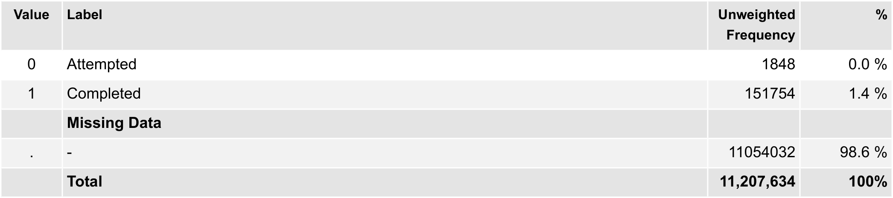

Based upon 153,602 valid cases out of 11,207,634 total cases.

- Minimum: 0.00
- Maximum: 1.00

Location: 305-306 (width: 2; decimal: 0)  
Variable Type: numeric  
Range of Missing Values: -9, -8, -7, -6, -5, .

## V20081: OFFENDER(S) SUSPECTED OF USING 1 - 1

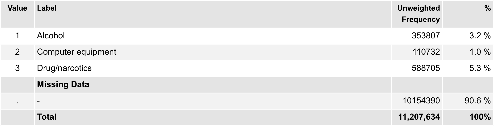

Based upon 1,053,244 valid cases out of 11,207,634 total cases.

- Minimum: 1.00
- Maximum: 3.00

Location: 307-308 (width: 2; decimal: 0)  
Variable Type: numeric  
Range of Missing Values: -9, -8, -7, -6, -5, .


### V20082: OFFENDER(S) SUSPECTED OF USING 1 - 2

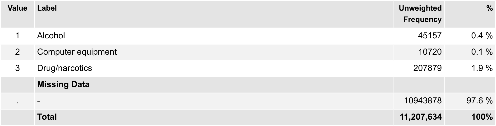

|                    | Unweighted Frequency | %       |
|--------------------|----------------------|---------|
| **1 Alcohol**      | 45157                | 0.4 %   |
| **2 Computer equipment** | 10720          | 0.1 %   |
| **3 Drug/narcotics**     | 207879         | 1.9 %   |
| **Missing Data**   | 10943878             | 97.6 %  |
| **.**              | .                    |         |
| **Total**          | 11,207,634           | 100%    |

Based upon 263,756 valid cases out of 11,207,634 total cases.

- Minimum: 1.00
- Maximum: 3.00

*Location:* 309-310 (width: 2; decimal: 0)  
*Variable Type:* numeric  
*(Range of) Missing Values:* -9, -8, -7, -6, -5, .


### V20083: OFFENDER(S) SUSPECTED OF USING 1 - 3

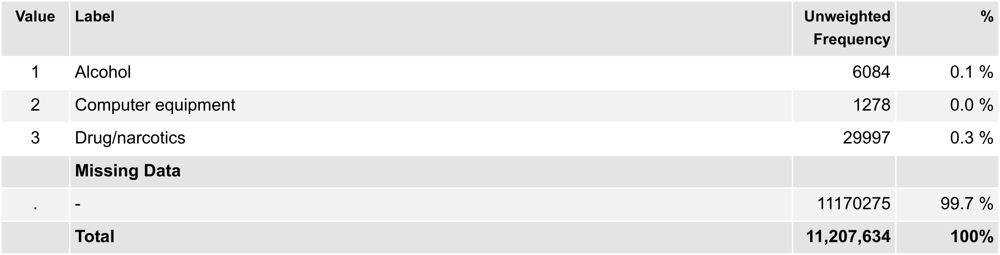

|                    | Unweighted Frequency | %       |
|--------------------|----------------------|---------|
| **1 Alcohol**      | 6084                 | 0.1 %   |
| **2 Computer equipment** | 1278          | 0.0 %   |
| **3 Drug/narcotics**     | 29997         | 0.3 %   |
| **Missing Data**   | 11170275             | 99.7 %  |
| **.**              | .                    |         |
| **Total**          | 11,207,634           | 100%    |

Based upon 37,359 valid cases out of 11,207,634 total cases.

- Minimum: 1.00
- Maximum: 3.00

*Location:* 311-312 (width: 2; decimal: 0)  
*Variable Type:* numeric  
*(Range of) Missing Values:* -9, -8, -7, -6, -5, .


### V20091: OFFENDER(S) SUSPECTED OF USING 2 - 1

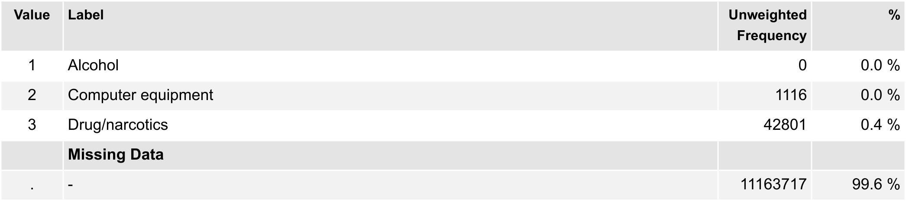

|                    | Unweighted Frequency | %       |
|--------------------|----------------------|---------|
| **1 Alcohol**      | 0                | 0.0 %   |
| **2 Computer equipment** | 1116           | 0.0 %   |
| **3 Drug/narcotics**     | 42801         | 0.4 %   |
| **Missing Data**   | 11163717             | 99.6 %  |
| **.**              | .                    |         |
| **Total**          | 11,207,634           | 100%    |

Based upon 37,359 valid cases out of 11,207,634 total cases.

- Minimum: 1.00
- Maximum: 3.00

*Location:* 311-312 (width: 2; decimal: 0)  
*Variable Type:* numeric  
*(Range of) Missing Values:* -9, -8, -7, -6, -5, .


### 72_0.png

|                | Unweighted Frequency | %      |
|----------------|-----------------------|--------|
|  Total         | 11,207,634            | 100%   |

Based upon 43,917 valid cases out of 11,207,634 total cases.

- Minimum: 2.00
- Maximum: 3.00

*Location:* 313-314 (width: 2; decimal: 0)  
*Variable Type:* numeric  
*(Range of) Missing Values:* -9, -8, -7, -6, -5, .

---

### V20092: OFFENDER(S) SUSPECTED OF USING 2 - 2

#### 72_1.png
|                | Unweighted Frequency | %      |
|----------------|-----------------------|--------|
|  1 Alcohol     | 0                     | 0.0 %  |
|  2 Computer equipment | 178           | 0.0 %  |
|  3 Drug/narcotics | 11389              | 0.1 %  |
|  Missing Data  |                       |        |
|  .             | 11196067              | 99.9 % |
|  Total         | 11,207,634            | 100%   |

Based upon 11,567 valid cases out of 11,207,634 total cases.

- Minimum: 2.00
- Maximum: 3.00

*Location:* 315-316 (width: 2; decimal: 0)  
*Variable Type:* numeric  
*(Range of) Missing Values:* -9, -8, -7, -6, -5, .

---

### V20093: OFFENDER(S) SUSPECTED OF USING 2 - 3

#### 72_2.png
|                | Unweighted Frequency | %      |
|----------------|-----------------------|--------|
|  1 Alcohol     | 0                     | 0.0 %  |
|  2 Computer equipment | 34            | 0.0 %  |
|  3 Drug/narcotics | 2001               | 0.0 %  |
|  Missing Data  |                       |        |
|  .             | 11205599              | 100.0 %|
|  Total         | 11,207,634            | 100%   |

Based upon 2,035 valid cases out of 11,207,634 total cases.

- Minimum: 2.00
- Maximum: 3.00

*Location:* 317-318 (width: 2; decimal: 0)  
*Variable Type:* numeric  
*(Range of) Missing Values:* -9, -8, -7, -6, -5, .


# V20101: OFFENDER(S) SUSPECTED OF USING 3 - 1

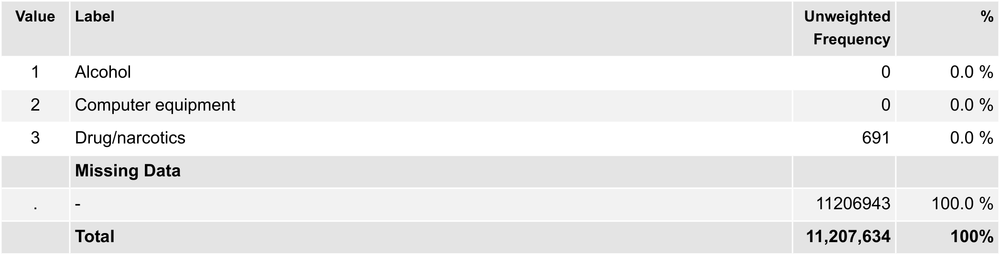

|                  | Unweighted Frequency | %       |
|------------------|----------------------|---------|
| 1 Alcohol        | 0                    | 0.0 %   |
| 2 Computer equipment | 0                | 0.0 %   |
| 3 Drug/narcotics | 691                  | 0.0 %   |
| Missing Data     |                      |         |
| .                |                      |         |
| Total            | 11206943             | 100.0 % |
|                  | **11,207,634**       | **100%**|

Based upon 691 valid cases out of 11,207,634 total cases.

- Minimum: 3.00
- Maximum: 3.00

*Location:* 319-320 (width: 2; decimal: 0)
*Variable Type:* numeric
*(Range of) Missing Values:* -9, -8, -7, -6, -5, .

# V20102: OFFENDER(S) SUSPECTED OF USING 3 - 2


|                  | Unweighted Frequency | %       |
|------------------|----------------------|---------|
| 1 Alcohol        | 0                    | 0.0 %   |
| 2 Computer equipment | 0                | 0.0 %   |
| 3 Drug/narcotics | 125                  | 0.0 %   |
| Missing Data     |                      |         |
| .                |                      |         |
| Total            | 11207509             | 100.0 % |
|                  | **11,207,634**       | **100%**|

Based upon 125 valid cases out of 11,207,634 total cases.

- Minimum: 3.00
- Maximum: 3.00

*Location:* 321-322 (width: 2; decimal: 0)
*Variable Type:* numeric
*(Range of) Missing Values:* -9, -8, -7, -6, -5, .

# V20103: OFFENDER(S) SUSPECTED OF USING 3 - 3

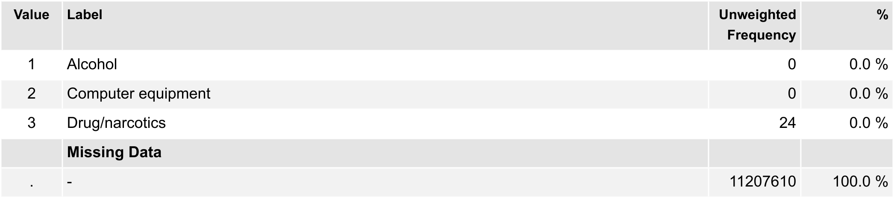

|                  | Unweighted Frequency | %       |
|------------------|----------------------|---------|
| 1 Alcohol        | 0                    | 0.0 %   |
| 2 Computer equipment | 0                | 0.0 %   |
| 3 Drug/narcotics | 24                   | 0.0 %   |
| Missing Data     |                      |         |
| .                |                      |         |
| Total            | 11207610             | 100.0 % |
|                  | **11,207,634**       | **100%**|

Based upon 24 valid cases out of 11,207,634 total cases.

- Minimum: 3.00
- Maximum: 3.00

*Location:* 321-322 (width: 2; decimal: 0)
*Variable Type:* numeric
*(Range of) Missing Values:* -9, -8, -7, -6, -5, .


## 

|                    | Unweighted Frequency | %       |
|--------------------|----------------------|---------|
| **Total**          | 11,207,634           | 100%    |

Based upon 24 valid cases out of 11,207,634 total cases.

- Minimum: 3.00
- Maximum: 3.00

*Location*: 323-324 (width: 2; decimal: 0) 
*Variable Type*: numeric 
*(Range of Missing Values)*: -9, -8, -7, -6, -5, . 

## V20111: LOCATION TYPE - 1

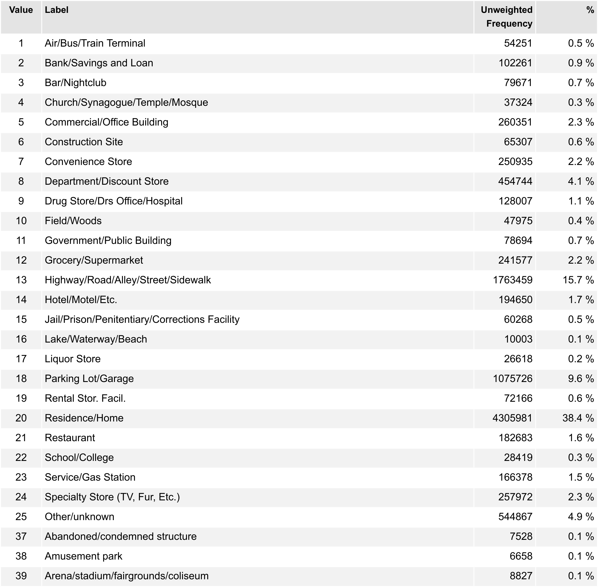

|                                         | Unweighted Frequency | %       |
|-----------------------------------------|----------------------|---------|
| Air/Bus/Train Terminal                  | 54251                | 0.5 %   |
| Bank/Savings and Loan                   | 102261               | 0.9 %   |
| Bar/Nightclub                           | 79671                | 0.7 %   |
| Church/Synagogue/Temple/Mosque          | 37324                | 0.3 %   |
| Commercial/Office Building              | 260351               | 2.3 %   |
| Construction Site                       | 65307                | 0.6 %   |
| Convenience Store                       | 250935               | 2.2 %   |
| Department/Discount Store               | 454744               | 4.1 %   |
| Drug Store/Drs Office/Hospital          | 128007               | 1.1 %   |
| Field/Woods                             | 47975                | 0.4 %   |
| Government/Public Building              | 78694                | 0.7 %   |
| Grocery/Supermarket                     | 241577               | 2.2 %   |
| Highway/Road/Alley/Street/Sidewalk      | 1763459              | 15.7 %  |
| Hotel/Motel/Etc.                        | 194650               | 1.7 %   |
| Jail/Prison/Penitentiary/Corrections Facility | 60268          | 0.5 %   |
| Lake/Waterway/Beach                     | 10003                | 0.1 %   |
| Liquor Store                            | 26618                | 0.2 %   |
| Parking Lot/Garage                      | 1075726              | 9.6 %   |
| Rental Stor. Facil.                     | 72166                | 0.6 %   |
| Residence/Home                          | 4305981              | 38.4 %  |
| Restaurant                              | 182683               | 1.6 %   |
| School/College                          | 28419                | 0.3 %   |
| Service/Gas Station                     | 166378               | 1.5 %   |
| Specialty Store (TV, Fur, Etc.)         | 257972               | 2.3 %   |
| Other/unknown                           | 544867               | 4.9 %   |
| Abandoned/condemned structure           | 7528                 | 0.1 %   |
| Amusement park                          | 6658                 | 0.1 %   |
| Arena/stadium/fairgrounds/coliseum      | 8827                 | 0.1 %   |


### 75_0.png

|                             | Unweighted Frequency | %    |
|-----------------------------|----------------------|------|
| 40  ATM separate from bank  | 7991                 | 0.1% |
| 41  Auto dealership new/used| 35985                | 0.3% |
| 42  Camp/campground         | 10692                | 0.1% |
| 44  Daycare facility        | 6732                 | 0.1% |
| 45  Dock/wharf/freight/modal terminal | 5993 | 0.1% |
| 46  Farm facility           | 9188                 | 0.1% |
| 47  Gambling facility/casino/race track | 29245 | 0.3% |
| 48  Industrial site         | 19718                | 0.2% |
| 49  Military installation   | 543                  | 0.0% |
| 50  Park/playground         | 98532                | 0.9% |
| 51  Rest area               | 2848                 | 0.0% |
| 52  School--college/university | 60442             | 0.5% |
| 53  School--elementary/secondary | 208720          | 1.9% |
| 54  Shelter--mission/homeless | 10755              | 0.1% |
| 55  Shopping mall           | 51728                | 0.5% |
| 56  Tribal lands            | 4722                 | 0.0% |
| 57  Community Center        | 12921                | 0.1% |
| 58  Cyberspace              | 117579               | 1.0% |

**Total:** 11,207,634 100%

Please note that only the first 50 response categories are displayed in the PDF codebook. To view all response categories, please analyze the data file in the statistical package of your choice (SAS, SPSS, Stata, R).

Based upon 11,207,634 valid cases out of 11,207,634 total cases.

- Minimum: 1.00
- Maximum: 58.00

Location: 325-326 (width: 2; decimal: 0)

Variable Type: numeric

(Range of) Missing Values: -9, -8, -7, -6, -5


### V20112: LOCATION TYPE - 2

#### 75_1.png

|  |                            | Unweighted Frequency | %    |
|--|----------------------------|----------------------|------|
| 1 | Air/Bus/Train Terminal    | 3989                 | 0.0% |
| 2 | Bank/Savings and Loan     | 16559                | 0.1% |
| 3 | Bar/Nightclub             | 7106                 | 0.1% |
| 4 | Church/Synagogue/Temple/Mosque | 4511          | 0.0% |
| 5 | Commercial/Office Building| 29588                | 0.3% |
| 6 | Construction Site         | 6578                 | 0.1% |
| 7 | Convenience Store         | 27319                | 0.2% |
| 8 | Department/Discount Store | 34947                | 0.3% |


|                              | Unweighted Frequency | %   |
|------------------------------|----------------------|-----|
| 9  Drug Store/Drs Office/Hospital         | 9620                 | 0.1 % |
| 10 Field/Woods                             | 5495                 | 0.0 % |
| 11 Government/Public Building              | 7585                 | 0.1 % |
| 12 Grocery/Supermarket                     | 19261                | 0.2 % |
| 13 Highway/Road/Alley/Street/Sidewalk      | 348818               | 3.1 % |
| 14 Hotel/Motel/Etc.                        | 27065                | 0.2 % |
| 15 Jail/Prison/Penitentiary/Corrections Facility | 4410          | 0.0 % |
| 16 Lake/Waterway/Beach                     | 1139                 | 0.0 % |
| 17 Liquor Store                            | 2052                 | 0.0 % |
| 18 Parking Lot/Garage                      | 151314               | 1.4 % |
| 19 Rental Stor. Facil.                     | 9187                 | 0.1 % |
| 20 Residence/Home                          | 420177               | 3.7 % |
| 21 Restaurant                              | 18684                | 0.2 % |
| 22 School/College                          | 1894                 | 0.0 % |
| 23 Service/Gas Station                     | 21203                | 0.2 % |
| 24 Specialty Store (TV, Fur, Etc.)         | 24200                | 0.2 % |
| 25 Other/unknown                           | 61180                | 0.5 % |
| 37 Abandoned/condemned structure           | 1088                 | 0.0 % |
| 38 Amusement park                          | 547                   | 0.0 % |
| 39 Arena/stadium/fairgrounds/coliseum      | 701                   | 0.0 % |
| 40 ATM separate from bank                  | 1091                 | 0.0 % |
| 41 Auto dealership new/used                | 5220                 | 0.0 % |
| 42 Camp/campground                         | 1402                 | 0.0 % |
| 44 Daycare facility                        | 485                   | 0.0 % |
| 45 Dock/wharf/freight/modal terminal       | 436                   | 0.0 % |
| 46 Farm facility                           | 1228                 | 0.0 % |
| 47 Gambling facility/casino/race track     | 2868                 | 0.0 % |
| 48 Industrial site                         | 2852                 | 0.0 % |
| 49 Military installation                   | 48                    | 0.0 % |
| 50 Park/playground                         | 12584                | 0.1 % |
| 51 Rest area                               | 322                   | 0.0 % |
| 52 School--college/university              | 5062                 | 0.0 % |
| 53 School--elementary/secondary            | 12601                | 0.1 % |
| 54 Shelter--mission/homeless               | 744                   | 0.0 % |
| 55 Shopping mall                           | 4708                 | 0.0 % |
| 56 Tribal lands                            | 546                   | 0.0 % |
| 57 Community Center                        | 1286                 | 0.0 % |
| 58 Cyberspace                              | 8517                 | 0.1 % |

**Missing Data**


|                | Unweighted Frequency | %       |
|----------------|----------------------|---------|
| .              | 9879417              | 88.1 %  |
| Total          | 11,207,634           | 100%    |

Please note that only the first 50 response categories are displayed in the PDF codebook. To view all response categories, please analyze the data file in the statistical package of your choice (SAS, SPSS, Stata, R).

Based upon 1,328,217 valid cases out of 11,207,634 total cases.

- Minimum: 1.00
- Maximum: 58.00

Location: 327-328 (width: 2; decimal: 0)  
Variable Type: numeric  
(Range of) Missing Values: -9, -8, -7, -6, -5, .

### V201113: LOCATION TYPE - 3

|                          | Unweighted Frequency | %       |
|--------------------------|----------------------|---------|
| Air/Bus/Train Terminal   | 544                  | 0.0 %   |
| Bank/Savings and Loan    | 2543                 | 0.0 %   |
| Bar/Nightclub            | 728                  | 0.0 %   |
| Church/Synagogue/Temple/Mosque | 419           | 0.0 %   |
| Commercial/Office Building | 3066               | 0.0 %   |
| Construction Site        | 630                  | 0.0 %   |
| Convenience Store        | 3309                 | 0.0 %   |
| Department/Discount Store | 5201                | 0.0 %   |
| Drug Store/Drs Office/Hospital | 828            | 0.0 %   |
| Field/Woods              | 676                  | 0.0 %   |
| Government/Public Building | 834                | 0.0 %   |
| Grocery/Supermarket      | 2560                 | 0.0 %   |
| Highway/Road/Alley/Street/Sidewalk | 41066      | 0.4 %   |
| Hotel/Motel/Etc.         | 3849                 | 0.0 %   |
| Jail/Prison/Penitentiary/Corrections Facility | 496 | 0.0 % |
| Lake/Waterway/Beach      | 81                   | 0.0 %   |
| Liquor Store             | 212                  | 0.0 %   |
| Parking Lot/Garage       | 15715                | 0.1 %   |
| Rental Stor. Facil.      | 1003                 | 0.0 %   |
| Residence/Home           | 49109                | 0.4 %   |
| Restaurant               | 1595                 | 0.0 %   |
| School/College           | 142                  | 0.0 %   |
| Service/Gas Station      | 2560                 | 0.0 %   |
| Specialty Store (TV, Fur, Etc.) | 2644          | 0.0 %   |
| Other/unknown            | 7153                 | 0.1 %   |


### 78_0.png

|                                         | Unweighted Frequency | %      |
|-----------------------------------------|----------------------|--------|
| 37  Abandoned/condemned structure       | 118                  | 0.0 %  |
| 38  Amusement park                      | 59                   | 0.0 %  |
| 39  Arena/stadium/fairgrounds/coliseum  | 52                   | 0.0 %  |
| 40  ATM separate from bank              | 116                  | 0.0 %  |
| 41  Auto dealership new/used            | 786                  | 0.0 %  |
| 42  Camp/campground                     | 171                  | 0.0 %  |
| 44  Daycare facility                    | 41                   | 0.0 %  |
| 45  Dock/wharf/freight/modal terminal   | 37                   | 0.0 %  |
| 46  Farm facility                       | 145                  | 0.0 %  |
| 47  Gambling facility/casino/race track | 376                  | 0.0 %  |
| 48  Industrial site                     | 332                  | 0.0 %  |
| 49  Military installation               | 4                    | 0.0 %  |
| 50  Park/playground                     | 1489                 | 0.0 %  |
| 51  Rest area                           | 40                   | 0.0 %  |
| 52  School--college/university          | 385                  | 0.0 %  |
| 53  School--elementary/secondary        | 695                  | 0.0 %  |
| 54  Shelter--mission/homeless           | 65                   | 0.0 %  |
| 55  Shopping mall                       | 640                  | 0.0 %  |
| 56  Tribal lands                        | 89                   | 0.0 %  |
| 57  Community Center                    | 147                  | 0.0 %  |
| 58  Cyberspace                          | 852                  | 0.0 %  |
| .   Missing Data                        |                      |        |
| .   .                                   | 11054032             | 98.6 % |
| **Total**                               | **11,207,634**       | **100%**|

Please note that only the first 50 response categories are displayed in the PDF codebook. To view all response categories, please analyze the data file in the statistical package of your choice (SAS, SPSS, Stata, R).

Based upon 153,602 valid cases out of 11,207,634 total cases.

- Minimum: 1.00
- Maximum: 58.00

Location: 329-330 (width: 2; decimal: 0)  
Variable Type: numeric  
(Range of) Missing Values: -9, -8, -7, -6, -5, .

### V20121: NUMBER OF PREMISES ENTERED - 1

### 78_1.png

|   | Unweighted Frequency | %      |
|---|----------------------|--------|
| 1 | 38237                | 0.3 %  |
| 2 | 2093                 | 0.0 %  |
| 3 | 894                  | 0.0 %  |


|     |                        | Unweighted         |         |
|-----|------------------------|--------------------|---------|
| 4   | -                      | 559                | 0.0 %   |
| 5   | -                      | 368                | 0.0 %   |
| 6   | -                      | 261                | 0.0 %   |
| 7   | -                      | 185                | 0.0 %   |
| 8   | -                      | 151                | 0.0 %   |
| 9   | -                      | 92                 | 0.0 %   |
| 10  | -                      | 112                | 0.0 %   |
| 11  | -                      | 53                 | 0.0 %   |
| 12  | -                      | 74                 | 0.0 %   |
| 13  | -                      | 38                 | 0.0 %   |
| 14  | -                      | 80                 | 0.0 %   |
| 15  | -                      | 53                 | 0.0 %   |
| 16  | -                      | 31                 | 0.0 %   |
| 17  | -                      | 25                 | 0.0 %   |
| 18  | -                      | 23                 | 0.0 %   |
| 19  | -                      | 146                | 0.0 %   |
| 20  | -                      | 40                 | 0.0 %   |
| 21  | -                      | 15                 | 0.0 %   |
| 22  | -                      | 24                 | 0.0 %   |
| 23  | -                      | 11                 | 0.0 %   |
| 24  | -                      | 13                 | 0.0 %   |
| 25  | -                      | 11                 | 0.0 %   |
| 26  | -                      | 5                  | 0.0 %   |
| 27  | -                      | 9                  | 0.0 %   |
| 28  | -                      | 7                  | 0.0 %   |
| 29  | -                      | 2                  | 0.0 %   |
| 30  | -                      | 20                 | 0.0 %   |
| 31  | -                      | 13                 | 0.0 %   |
| 32  | -                      | 3                  | 0.0 %   |
| 33  | -                      | 10                 | 0.0 %   |
| 34  | -                      | 18                 | 0.0 %   |
| 35  | -                      | 8                  | 0.0 %   |
| 36  | -                      | 6                  | 0.0 %   |
| 37  | -                      | 10                 | 0.0 %   |
| 38  | -                      | 6                  | 0.0 %   |
| 39  | -                      | 6                  | 0.0 %   |
| 40  | -                      | 5                  | 0.0 %   |
| 41  | -                      | 3                  | 0.0 %   |
| 42  | -                      | 3                  | 0.0 %   |

- 77 -


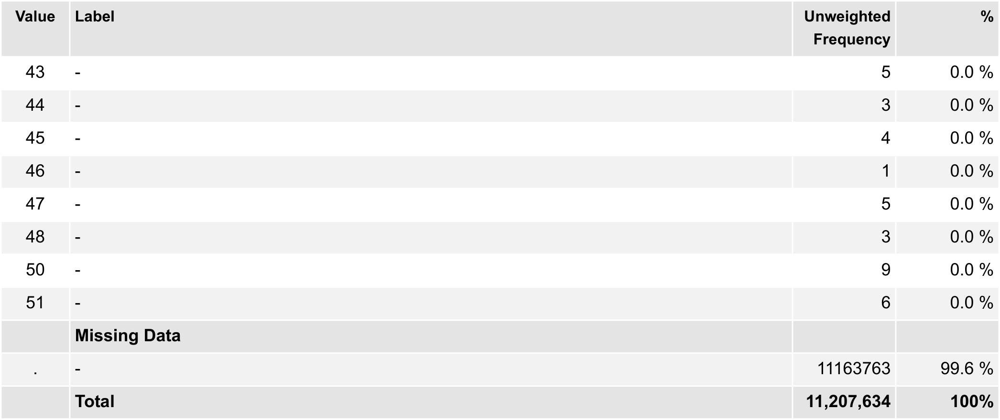

Please note that only the first 50 response categories are displayed in the PDF codebook. To view all response categories, please analyze the data file in the statistical package of your choice (SAS, SPSS, Stata, R).

Based upon 43,871 valid cases out of 11,207,634 total cases.

- Mean: 1.84
- Median: 1.00
- Mode: 1.00
- Minimum: 1.00
- Maximum: 99.00
- Standard Deviation: 4.98

Location: 331-332 (width: 2; decimal: 0)  
Variable Type: numeric  
(Range of) Missing Values: -9, -8, -7, -6, -5, .

V20122: NUMBER OF PREMISES ENTERED - 2

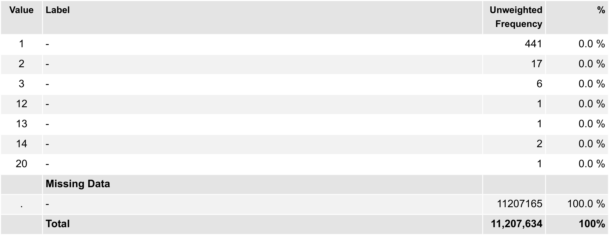

Based upon 469 valid cases out of 11,207,634 total cases.

- Mean: 1.21


• Median: 1.00
• Mode: 1.00
• Minimum: 1.00
• Maximum: 20.00
• Standard Deviation: 1.45

Location: 333-334 (width: 2; decimal: 0)

Variable Type: numeric

(Range of) Missing Values: -9, -8, -7, -6, -5, .

## V20123: NUMBER OF PREMISES ENTERED - 3

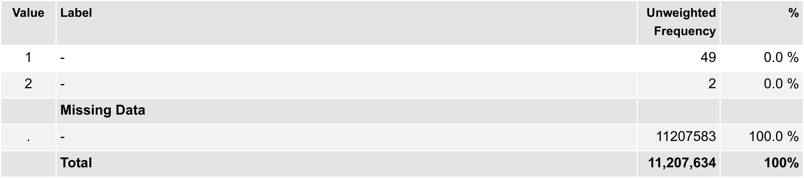

Based upon 51 valid cases out of 11,207,634 total cases.

• Mean: 1.04
• Median: 1.00
• Mode: 1.00
• Minimum: 1.00
• Maximum: 2.00
• Standard Deviation: 0.20

Location: 335-336 (width: 2; decimal: 0)

Variable Type: numeric

(Range of) Missing Values: -9, -8, -7, -6, -5, .

## V20131: METHOD OF ENTRY - 1

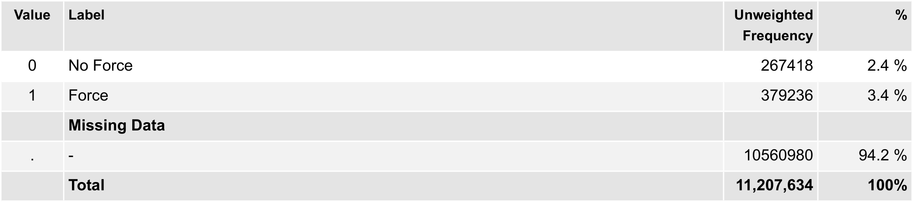

Based upon 646,654 valid cases out of 11,207,634 total cases.

• Minimum: 0.00
• Maximum: 1.00

Location: 337-338 (width: 2; decimal: 0)

Variable Type: numeric

(Range of) Missing Values: -9, -8, -7, -6, -5, .


## V20132: METHOD OF ENTRY - 2


Based upon 24,200 valid cases out of 11,207,634 total cases.

- Minimum: 0.00
- Maximum: 1.00

_**Location**_: 339-340 (width: 2; decimal: 0)
**Variable Type**: numeric
_(Range of) Missing Values_: -9, -8, -7, -6, -5, .

## V20133: METHOD OF ENTRY - 3

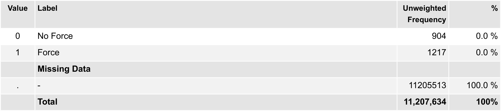

Based upon 2,121 valid cases out of 11,207,634 total cases.

- Minimum: 0.00
- Maximum: 1.00

_**Location**_: 341-342 (width: 2; decimal: 0)
**Variable Type**: numeric
_(Range of) Missing Values_: -9, -8, -7, -6, -5, .

## V20141: TYPE CRIMINAL ACTIVITY/GANG INFO 1 - 1

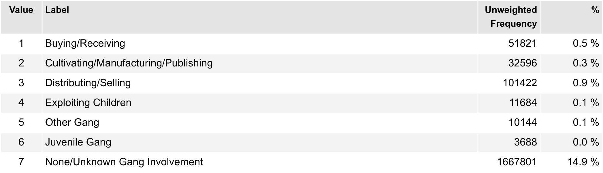

- 80 -


### 83_0.png

|                | Unweighted Frequency | %     |
|----------------|-----------------------|-------|
| **8**          | Operating/Promoting/Assisting |  17866  | 0.2 % |
| **9**          | Possessing/Concealing         | 1083796 | 9.7 % |
| **10**         | Transporting/Transmitting/Importing | 12951 | 0.1 % |
| **11**         | Using/Consuming               | 138151  | 1.2 % |
| **12**         | Intentional Abuse and Torture |  5597   | 0.0 % |
| **1001**       | Simple/Gross Neglect          |  12653  | 0.1 % |
| **1002**       | Organized Abuse               |  220    | 0.0 % |
| **1003**       | Animal Sexual Abuse           |  240    | 0.0 % |
| **Missing Data**       |                     |         |
| \.                       | 8057004          | 71.9 % |
| **Total**               | **11,207,634** | **100%** |

Based upon 3,150,630 valid cases out of 11,207,634 total cases.

- Minimum: 1.00
- Maximum: 1003.00

Location: 343-346 (width: 4; decimal: 0)  
Variable Type: numeric  
(Range of) Missing Values: -9, -8, -7, -6, -5, \.  

### V20142: TYPE CRIMINAL ACTIVITY/GANG INFO 1 - 2

### 83_1.png

|                           | Unweighted Frequency | %     |
|---------------------------|----------------------|-------|
| **1**          | Buying/Receiving               |  12779 | 0.1 % |
| **2**          | Cultivating/Manufacturing/Publishing |  5471  | 0.0 % |
| **3**          | Distributing/Selling           | 15835  | 0.1 % |
| **4**          | Exploiting Children            |  1050  | 0.0 % |
| **5**          | Other Gang                     |   362  | 0.0 % |
| **6**          | Juvenile Gang                  |    96  | 0.0 % |
| **7**          | None/Unknown Gang Involvement  | 38550  | 0.3 % |
| **8**          | Operating/Promoting/Assisting  |  4862  | 0.0 % |
| **9**          | Possessing/Concealing          | 449423 | 4.0 % |
| **10**         | Transporting/Transmitting/Importing | 2426  | 0.0 % |
| **11**         | Using/Consuming                | 42626  | 0.4 % |
| **12**         | Intentional Abuse and Torture  |   907  | 0.0 % |
| **1001**       | Simple/Gross Neglect           |   364  | 0.0 % |
| **1002**       | Organized Abuse                |    25  | 0.0 % |
| **1003**       | Animal Sexual Abuse            |    40  | 0.0 % |
| **Missing Data**       |                   |         |
| \.                         | 1063218           | 94.9 % |
| **Total**                 | **11,207,634**   | **100%** |

- 81 -


Based upon 574,816 valid cases out of 11,207,634 total cases.

- Minimum: 1.00
- Maximum: 1003.00

Location: 347-350 (width: 4; decimal: 0)  
Variable Type: numeric  
(Range of) Missing Values: -9, -8, -7, -6, -5, .

---

### V20143: TYPE CRIMINAL ACTIVITY/GANG INFO 1 - 3
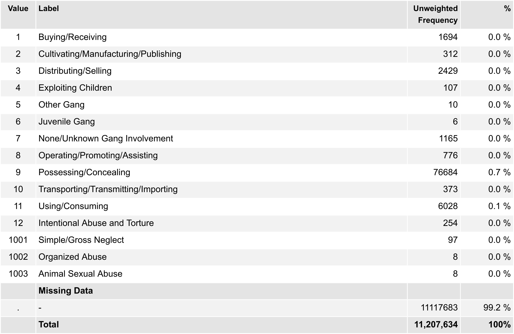

---

Based upon 89,951 valid cases out of 11,207,634 total cases.

- Minimum: 1.00
- Maximum: 1003.00

Location: 351-354 (width: 4; decimal: 0)  
Variable Type: numeric  
(Range of) Missing Values: -9, -8, -7, -6, -5, .

---

### V20151: TYPE CRIMINAL ACTIVITY/GANG INFO 2 - 1
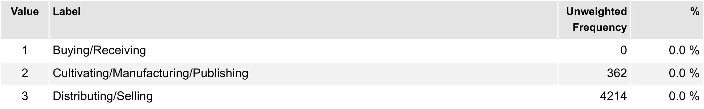


### 85_0.png

|                               | Unweighted Frequency | %    |
|-------------------------------|----------------------|------|
| 4   Exploiting Children       | 734                  | 0.0% |
| 5   Other Gang                | 0                    | 0.0% |
| 6   Juvenile Gang             | 72                   | 0.0% |
| 7   None/Unknown Gang Involvement | 0                | 0.0% |
| 8   Operating/Promoting/Assisting | 587              | 0.0% |
| 9   Possessing/Concealing     | 25591                | 0.2% |
| 10  Transporting/Transmitting/Importing | 11006      | 0.1% |
| 11  Using/Consuming           | 31570                | 0.3% |
| 12  Intentional Abuse and Torture | 180              | 0.0% |
| 1001 Simple/Gross Neglect     | 0                    | 0.0% |
| 1002 Organized Abuse          | 22                   | 0.0% |
| 1003 Animal Sexual Abuse      | 6                    | 0.0% |
|                               |                      |      |
| Missing Data                  | 11133290             | 99.3%|
|                               | __11,207,634__       | 100% |

Based upon 74,344 valid cases out of 11,207,634 total cases.

- Minimum: 2.00
- Maximum: 1003.00

Location: 355-358 (width: 4; decimal: 0)  
Variable Type: numeric  
(Range of) Missing Values: -9, -8, -7, -6, -5, .

---

### 85_1.png

|                               | Unweighted Frequency | %    |
|-------------------------------|----------------------|------|
| 1   Buying/Receiving          | 0                    | 0.0% |
| 2   Cultivating/Manufacturing/Publishing | 87        | 0.0% |
| 3   Distributing/Selling      | 748                  | 0.0% |
| 4   Exploiting Children       | 115                  | 0.0% |
| 5   Other Gang                | 0                    | 0.0% |
| 6   Juvenile Gang             | 3                    | 0.0% |
| 7   None/Unknown Gang Involvement | 0                | 0.0% |
| 8   Operating/Promoting/Assisting | 175              | 0.0% |
| 9   Possessing/Concealing     | 6596                 | 0.1% |
| 10  Transporting/Transmitting/Importing | 4599       | 0.0% |
| 11  Using/Consuming           | 13504                | 0.1% |
| 12  Intentional Abuse and Torture | 5                | 0.0% |
| 1001 Simple/Gross Neglect     | 0                    | 0.0% |
| 1002 Organized Abuse          | 6                    | 0.0% |


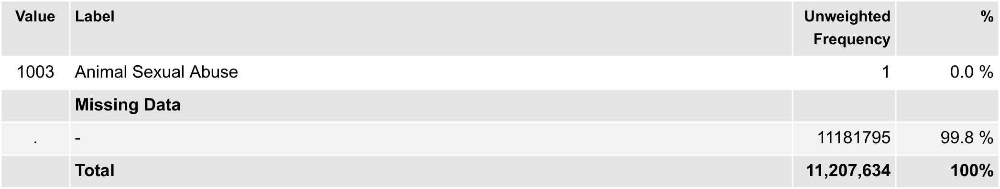

|       | Unweighted Frequency | %       |
|-------|-----------------------|---------|
| 1003  | Animal Sexual Abuse   | 1       | 0.0%  |
|       | Missing Data          |         |       |
|       | .                     | 11181795| 99.8% |
|       | Total                 | 11,207,634 | 100% |

Based upon 25,839 valid cases out of 11,207,634 total cases.

- Minimum: 2.00
- Maximum: 1003.00

Location: 359-362 (width: 4; decimal: 0)  
Variable Type: numeric  
(Range of) Missing Values: -9, -8, -7, -6, -5, .  

V20153: TYPE CRIMINAL ACTIVITY/GANG INFO 2 - 3  
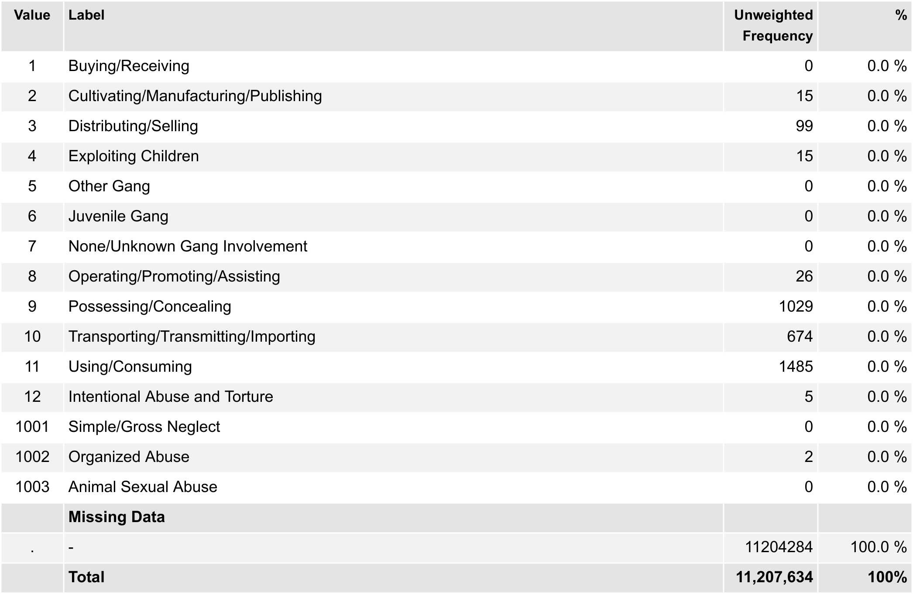

|       | Unweighted Frequency | %       |
|-------|-----------------------|---------|
| 1     | Buying/Receiving      | 0       | 0.0%  |
| 2     | Cultivating/Manufacturing/Publishing | 15  | 0.0%  |
| 3     | Distributing/Selling  | 99      | 0.0%  |
| 4     | Exploiting Children   | 15      | 0.0%  |
| 5     | Other Gang            | 0       | 0.0%  |
| 6     | Juvenile Gang         | 0       | 0.0%  |
| 7     | None/Unknown Gang Involvement | 0 | 0.0%  |
| 8     | Operating/Promoting/Assisting | 26 | 0.0%  |
| 9     | Possessing/Concealing | 1029    | 0.0%  |
| 10    | Transporting/Transmitting/Importing | 674 | 0.0%  |
| 11    | Using/Consuming       | 1485    | 0.0%  |
| 12    | Intentional Abuse and Torture | 5 | 0.0%  |
| 1001  | Simple/Gross Neglect  | 0       | 0.0%  |
| 1002  | Organized Abuse       | 2       | 0.0%  |
| 1003  | Animal Sexual Abuse   | 0       | 0.0%  |
|       | Missing Data          |         |       |
|       | .                     | 11204284| 100.0% |
|       | Total                 | 11,207,634 | 100% |

Based upon 3,350 valid cases out of 11,207,634 total cases.

- Minimum: 2.00
- Maximum: 1002.00

Location: 363-366 (width: 4; decimal: 0)  
Variable Type: numeric  
(Range of) Missing Values: -9, -8, -7, -6, -5, .  


# V20161: TYPE CRIMINAL ACTIVITY/GANG INFO 3 - 1


|                                              | Unweighted Frequency |        %     |
|----------------------------------------------|----------------------|--------------|
| 1   Buying/Receiving                         | 0                    | 0.0 %        |
| 2   Cultivating/Manufacturing/Publishing     | 0                    | 0.0 %        |
| 3   Distributing/Selling                     | 136                  | 0.0 %        |
| 4   Exploiting Children                      | 96                   | 0.0 %        |
| 5   Other Gang                               | 0                    | 0.0 %        |
| 6   Juvenile Gang                            | 0                    | 0.0 %        |
| 7   None/Unknown Gang Involvement            | 0                    | 0.0 %        |
| 8   Operating/Promoting/Assisting            | 93                   | 0.0 %        |
| 9   Possessing/Concealing                    | 2184                 | 0.0 %        |
| 10  Transporting/Transmitting/Importing      | 3204                 | 0.0 %        |
| 11  Using/Consuming                          | 7465                 | 0.1 %        |
| 12  Intentional Abuse and Torture            | 15                   | 0.0 %        |
| 1001 Simple/Gross Neglect                    | 0                    | 0.0 %        |
| 1002 Organized Abuse                         | 0                    | 0.0 %        |
| 1003 Animal Sexual Abuse                     | 1                    | 0.0 %        |
|                                              |                      |              |
| Missing Data                                 | 11194440             | 99.9 %       |
| .                                            |                      |              |
| Total                                        | 11,207,634           | 100%         |

Based upon 13,194 valid cases out of 11,207,634 total cases.

-   Minimum: 3.00
-   Maximum: 1003.00

Location: 367-370 (width: 4; decimal: 0)
Variable Type: numeric
(Range of) Missing Values: -9, -8, -7, -6, -5, .

---

# V20162: TYPE CRIMINAL ACTIVITY/GANG INFO 3 - 2

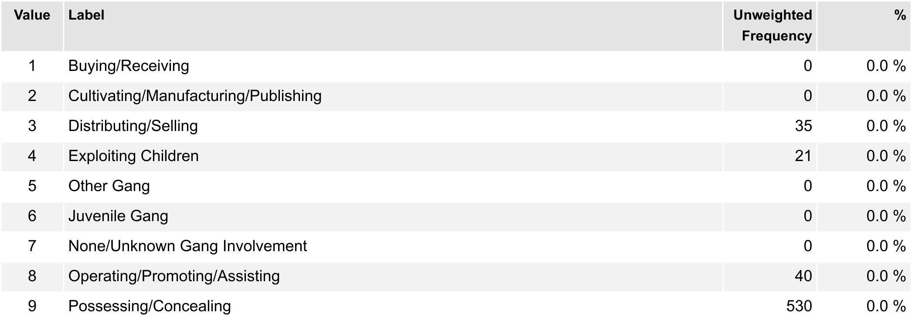

|                                              | Unweighted Frequency |       %      |
|----------------------------------------------|----------------------|--------------|
| 1   Buying/Receiving                         | 0                    | 0.0 %        |
| 2   Cultivating/Manufacturing/Publishing     | 0                    | 0.0 %        |
| 3   Distributing/Selling                     | 35                   | 0.0 %        |
| 4   Exploiting Children                      | 21                   | 0.0 %        |
| 5   Other Gang                               | 0                    | 0.0 %        |
| 6   Juvenile Gang                            | 0                    | 0.0 %        |
| 7   None/Unknown Gang Involvement            | 0                    | 0.0 %        |
| 8   Operating/Promoting/Assisting            | 40                   | 0.0 %        |
| 9   Possessing/Concealing                    | 530                  | 0.0 %        |


### 88_0.png

|                                     | Unweighted Frequency | %      |
|-------------------------------------|----------------------|--------|
| 10 Transporting/Transmitting/Importing | 824                  | 0.0 %  |
| 11 Using/Consuming                  | 3174                 | 0.0 %  |
| 12 Intentional Abuse and Torture    | 6                    | 0.0 %  |
| 1001 Simple/Gross Neglect           | 0                    | 0.0 %  |
| 1002 Organized Abuse                | 0                    | 0.0 %  |
| 1003 Animal Sexual Abuse            | 0                    | 0.0 %  |
| Missing Data                        |                      |        |
| . -                                 | 11203004             | 100.0 %|
| **Total**                           | **11,207,634**       | **100%**|

Based upon 4,630 valid cases out of 11,207,634 total cases.

- Minimum: 3.00
- Maximum: 12.00

Location: 371-374 (width: 4; decimal: 0)
Variable Type: numeric
(Range of) Missing Values: -9, -8, -7, -6, -5, .

---

### 88_1.png

|                                     | Unweighted Frequency | %      |
|-------------------------------------|----------------------|--------|
| 1 Buying/Receiving                  | 0                    | 0.0 %  |
| 2 Cultivating/Manufacturing/Publishing | 0                    | 0.0 %  |
| 3 Distributing/Selling              | 11                   | 0.0 %  |
| 4 Exploiting Children               | 2                    | 0.0 %  |
| 5 Other Gang                        | 0                    | 0.0 %  |
| 6 Juvenile Gang                     | 0                    | 0.0 %  |
| 7 None/Unknown Gang Involvement     | 0                    | 0.0 %  |
| 8 Operating/Promoting/Assisting     | 6                    | 0.0 %  |
| 9 Possessing/Concealing             | 78                   | 0.0 %  |
| 10 Transporting/Transmitting/Importing | 133                  | 0.0 %  |
| 11 Using/Consuming                  | 391                  | 0.0 %  |
| 12 Intentional Abuse and Torture    | 2                    | 0.0 %  |
| 1001 Simple/Gross Neglect           | 0                    | 0.0 %  |
| 1002 Organized Abuse                | 0                    | 0.0 %  |
| 1003 Animal Sexual Abuse            | 0                    | 0.0 %  |
| Missing Data                        |                      |        |
| . -                                 | 11207011             | 100.0 %|
| **Total**                           | **11,207,634**       | **100%**|

Based upon 623 valid cases out of 11,207,634 total cases.


 • Minimum: 3.00
 • Maximum: 12.00
 
Location: 375-378 (width: 4; decimal: 0) Variable Type: numeric
(Range of) Missing Values: -9, -8, -7, -6, -5, .

V20171: WEAPON / FORCE 1 - 1

|     |        | Unweighted Frequency | %    |
|-----|--------|-----------------------|------|
| 110 | Firearm (type not stated)       | 116587              | 1.0 % |
| 111 | Firearm-automatic               | 3333                | 0.0 % |
| 120 | Handgun                         | 235384              | 2.1 % |
| 121 | Handgun-automatic               | 7702                | 0.1 % |
| 130 | Rifle                           | 11874               | 0.1 % |
| 131 | Rifle-automatic                 | 710                 | 0.0 % |
| 140 | Shotgun                         | 6360                | 0.1 % |
| 141 | Shotgun-automatic               | 89                  | 0.0 % |
| 150 | Other Firearm                   | 9623                | 0.1 % |
| 151 | Other Firearm-automatic         | 250                 | 0.0 % |
| 200 | Knife/Cutting Instrument        | 111800              | 1.0 % |
| 300 | Blunt Object                    | 57753               | 0.5 % |
| 350 | Motor Vehicle/Vessel            | 28439               | 0.3 % |
| 400 | Personal Weapons (hands, feet, teeth, etc.) | 1570622             | 14.0 %|
| 500 | Poison (include gas)            | 633                 | 0.0 % |
| 600 | Explosives                      | 1415                | 0.0 % |
| 650 | Fire/Incendiary Device          | 1284                | 0.0 % |
| 700 | Drugs/Narcotics/Sleeping Pills  | 2118                | 0.0 % |
| 850 | Asphyxiation                    | 11192               | 0.1 % |
| 900 | Other (BB guns, pellet guns, Tasers, pepper spray, stun guns, etc.) | 204876              | 1.8 % |
| 990 | None                            | 321417              | 2.9 % |
|     | **Missing Data**                |                     |       |
| -7  | Unknown/missing/DNR             | 85419               | 0.8 % |
| .   |                                 | 8418754             | 75.1 %|

**Total**: 11,207,634             **100%**

Based upon 2,703,461 valid cases out of 11,207,634 total cases.

• Minimum: 110.00
• Maximum: 990.00

Location: 379-381 (width: 3; decimal: 0)
Variable Type: numeric
(Range of) Missing Values: -9, -8, -7, -6, -5, .


# V20172: WEAPON / FORCE 1 - 2

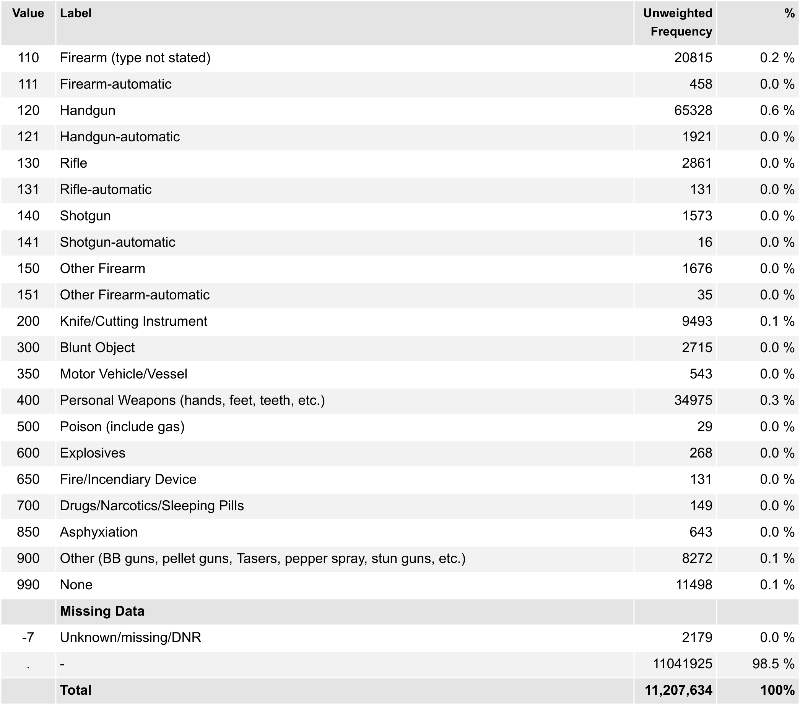

|    | Unweighted Frequency | %   |
|----|-----------------------|-----|
| 110 | Firearm (type not stated) | 20815 | 0.2 % |
| 111 | Firearm-automatic | 458 | 0.0 % |
| 120 | Handgun | 65328 | 0.6 % |
| 121 | Handgun-automatic | 1921 | 0.0 % |
| 130 | Rifle | 2861 | 0.0 % |
| 131 | Rifle-automatic | 131 | 0.0 % |
| 140 | Shotgun | 1573 | 0.0 % |
| 141 | Shotgun-automatic | 16 | 0.0 % |
| 150 | Other Firearm | 1676 | 0.0 % |
| 151 | Other Firearm-automatic | 35 | 0.0 % |
| 200 | Knife/Cutting Instrument | 9493 | 0.1 % |
| 300 | Blunt Object | 2715 | 0.0 % |
| 350 | Motor Vehicle/Vessel | 543 | 0.0 % |
| 400 | Personal Weapons (hands, feet, teeth, etc.) | 34975 | 0.3 % |
| 500 | Poison (include gas) | 29 | 0.0 % |
| 600 | Explosives | 268 | 0.0 % |
| 650 | Fire/Incendiary Device | 131 | 0.0 % |
| 700 | Drugs/Narcotics/Sleeping Pills | 149 | 0.0 % |
| 850 | Asphyxiation | 643 | 0.0 % |
| 900 | Other (BB guns, pellet guns, Tasers, pepper spray, stun guns, etc.) | 8272 | 0.1 % |
| 990 | None | 11498 | 0.1 % |
| Missing Data | | |
| -7 | Unknown/missing/DNR | 2179 | 0.0 % |
| - | . | 11041925 | 98.5 % |
| Total | 11,207,634 | 100 % |

Based upon 163,530 valid cases out of 11,207,634 total cases.

Minimum: 110.00  
Maximum: 990.00

Location: 382-384 (width: 3; decimal: 0)  
Variable Type: numeric  
Range of Missing Values: -9, -8, -7, -6, -5, .

# V20173: WEAPON / FORCE 1 - 3

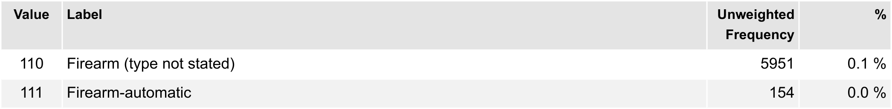

|    | Unweighted Frequency | %   |
|----|-----------------------|-----|
| 110 | Firearm (type not stated) | 5951 | 0.1 % |
| 111 | Firearm-automatic | 154 | 0.0 % |


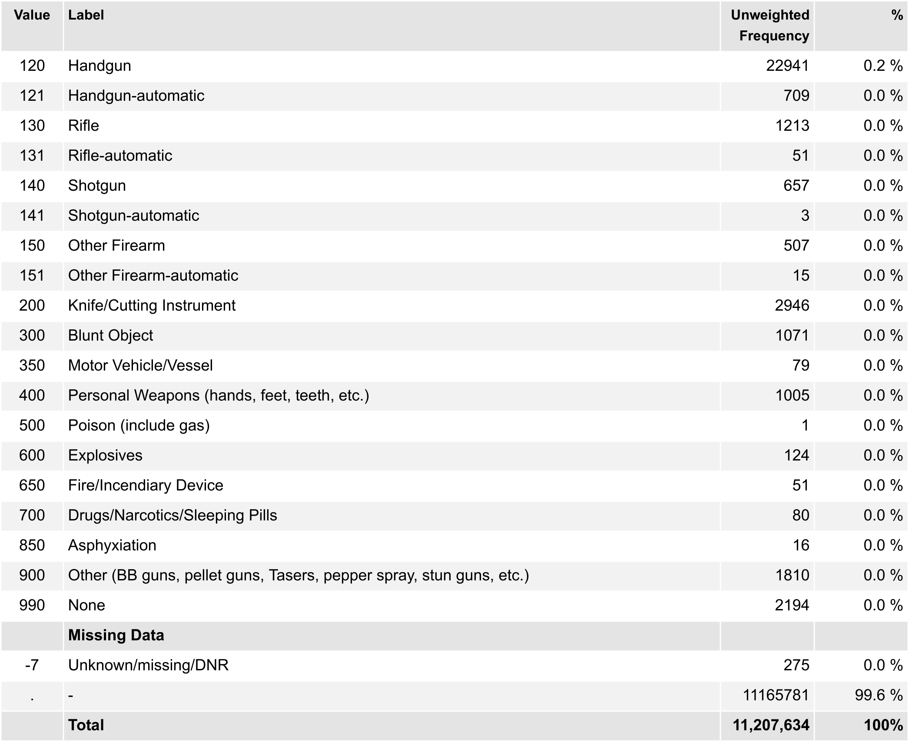

|                          | Unweighted Frequency | %     |
|--------------------------|----------------------|-------|
| 120 Handgun              | 22941                | 0.2 % |
| 121 Handgun-automatic    | 709                  | 0.0 % |
| 130 Rifle                | 1213                 | 0.0 % |
| 131 Rifle-automatic      | 51                   | 0.0 % |
| 140 Shotgun              | 657                  | 0.0 % |
| 141 Shotgun-automatic    | 3                    | 0.0 % |
| 150 Other Firearm        | 507                  | 0.0 % |
| 151 Other Firearm-automatic | 15                | 0.0 % |
| 200 Knife/Cutting Instrument | 2946             | 0.0 % |
| 300 Blunt Object         | 1071                 | 0.0 % |
| 350 Motor Vehicle/Vessel | 79                   | 0.0 % |
| 400 Personal Weapons (hands, feet, teeth, etc.) | 1005 | 0.0 % |
| 500 Poison (include gas) | 1                    | 0.0 % |
| 600 Explosives           | 124                  | 0.0 % |
| 650 Fire/Incendiary Device | 51                 | 0.0 % |
| 700 Drugs/Narcotics/Sleeping Pills | 80        | 0.0 % |
| 850 Asphyxiation         | 16                   | 0.0 % |
| 890 Other (BB guns, pellet guns, Tasers, pepper spray, stun guns, etc.) | 1810 | 0.0 % |
| 990 None                 | 2194                 | 0.0 % |
| Missing Data             |                      |       |
| -7 Unknown/missing/DNR   | 275                  | 0.0 % |
|                          | 11165781             | 99.6 % |
| Total                    | 11,207,634           | 100%  |

Based upon 41,578 valid cases out of 11,207,634 total cases.

- Minimum: 110.00
- Maximum: 990.00

Location: 385-387 (width: 3; decimal: 0)  
Variable Type: numeric  
(Range of) Missing Values: -9, -8, -7, -6, -5, .

---

V20181: WEAPON / FORCE 2 - 1

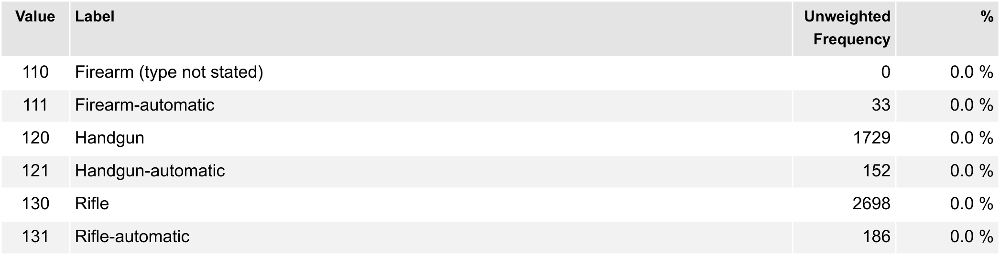

|                           | Unweighted Frequency | %     |
|---------------------------|----------------------|-------|
| 110 Firearm (type not stated) | 0                 | 0.0 % |
| 111 Firearm-automatic     | 33                   | 0.0 % |
| 120 Handgun               | 1729                 | 0.0 % |
| 121 Handgun-automatic     | 152                  | 0.0 % |
| 130 Rifle                 | 2698                 | 0.0 % |
| 131 Rifle-automatic       | 186                  | 0.0 % |


#### 92_0.png

|                             | Unweighted Frequency | %    |
|-----------------------------|----------------------|------|
| 140 Shotgun                 | 642                  | 0.0 %|
| 141 Shotgun-automatic       | 15                   | 0.0 %|
| 150 Other Firearm           | 287                  | 0.0 %|
| 151 Other Firearm-automatic | 14                   | 0.0 %|
| 200 Knife/Cutting Instrument| 1570                 | 0.0 %|
| 300 Blunt Object            | 2763                 | 0.0 %|
| 350 Motor Vehicle/Vessel    | 792                  | 0.0 %|
| 400 Personal Weapons (hands, feet, teeth, etc.) | 11938 | 0.1 %|
| 500 Poison (include gas)    | 54                   | 0.0 %|
| 600 Explosives              | 83                   | 0.0 %|
| 650 Fire/Incendiary Device  | 165                  | 0.0 %|
| 700 Drugs/Narcotics/Sleeping Pills | 296          | 0.0 %|
| 850 Asphyxiation            | 5038                 | 0.0 %|
| 900 Other (BB guns, pellet guns, Tasers, pepper spray, stun guns, etc.) | 14395 | 0.1 %|
| 990 None                    | 0                    | 0.0 %|

**Missing Data**

|         |               |
|---------|---------------|
| -7      | Unknown/missing/DNR | 1880 | 0.0 % |
| -       | -                   | 11162904 | 99.6 % |

**Total**

|                    |                 |
|--------------------|-----------------|
| 11,207,634         | 100%            |

Based upon 42,850 valid cases out of 11,207,634 total cases.

- Minimum: 111.0
- Maximum: 900.00

Location: 388-390 (width: 3; decimal: 0)

Variable Type: numeric

(Range of) Missing Values: -9, -8, -7, -6, -5, .

#### 92_1.png

|                             | Unweighted Frequency | %    |
|-----------------------------|----------------------|------|
| 110 Firearm (type not stated) | 0                 | 0.0 %|
| 111 Firearm-automatic         | 11                | 0.0 %|
| 120 Handgun                   | 520               | 0.0 %|
| 121 Handgun-automatic         | 55                | 0.0 %|
| 130 Rifle                     | 959               | 0.0 %|
| 131 Rifle-automatic           | 49                | 0.0 %|
| 140 Shotgun                   | 305               | 0.0 %|
| 141 Shotgun-automatic         | 6                 | 0.0 %|
| 150 Other Firearm             | 85                | 0.0 %|
| 151 Other Firearm-automatic   | 12                | 0.0 %|

V20182: WEAPON / FORCE 2 - 2


## 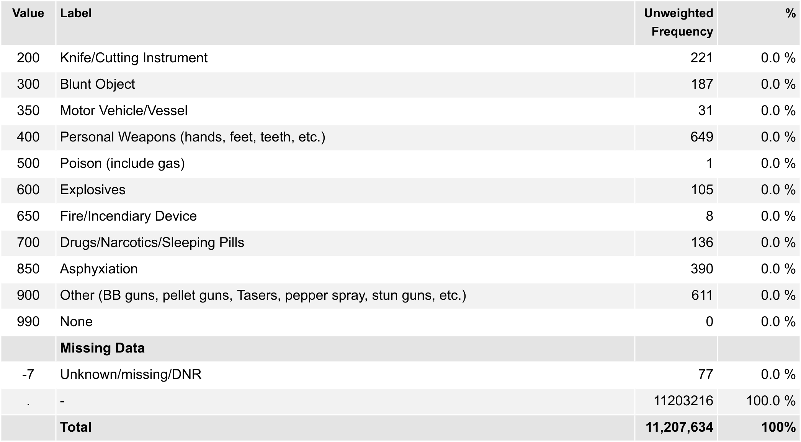
|      |                                        | Unweighted Frequency | %      |
|------|----------------------------------------|----------------------|--------|
| 200  | Knife/Cutting Instrument               | 221                  | 0.0 %  |
| 300  | Blunt Object                           | 187                  | 0.0 %  |
| 350  | Motor Vehicle/Vessel                   | 31                   | 0.0 %  |
| 400  | Personal Weapons (hands, feet, teeth, etc.) | 649                  | 0.0 %  |
| 500  | Poison (include gas)                   | 1                    | 0.0 %  |
| 600  | Explosives                             | 105                  | 0.0 %  |
| 650  | Fire/Incendiary Device                 | 8                    | 0.0 %  |
| 700  | Drugs/Narcotics/Sleeping Pills         | 136                  | 0.0 %  |
| 850  | Asphyxiation                           | 390                  | 0.0 %  |
| 900  | Other (BB guns, pellet guns, Tasers, pepper spray, stun guns, etc.) | 611   | 0.0 %  |
| 990  | None                                   | 0                    | 0.0 %  |
|      | Missing Data                           |                      |        |
| -7   | Unknown/missing/DNR                    | 77                   | 0.0 %  |
| -    | -                                      |                      |        |
|      | Total                                  | 11203216             | 100.0 %|
|      |                                        | 11,207,634           | 100%   |

* Based upon 4,341 valid cases out of 11,207,634 total cases.

* Minimum: 111.00
* Maximum: 900.00

  _Location: 391-393 (width: 3; decimal: 0)_  
  _Variable Type: numeric_  
  _(Range of) Missing Values: -9, -8, -7, -6, -5_  

## V20183: WEAPON / FORCE 2 - 3

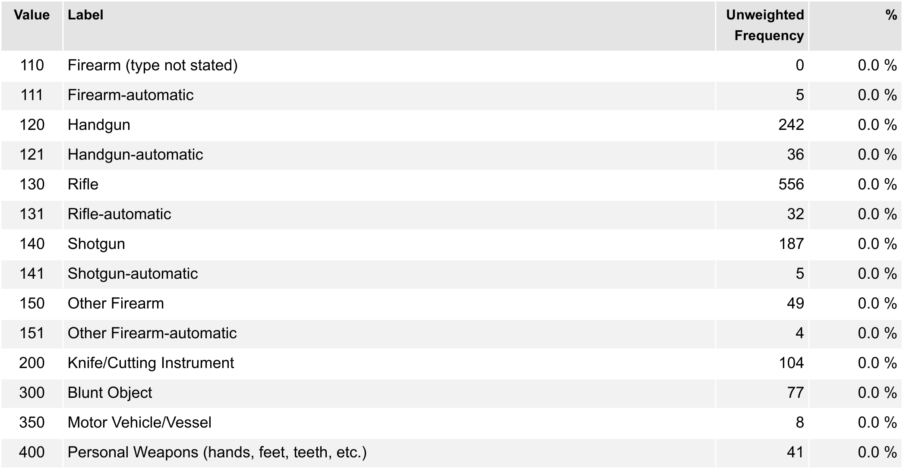
|      |                                      | Unweighted Frequency | %      |
|------|--------------------------------------|----------------------|--------|
| 110  | Firearm (type not stated)            | 0                    | 0.0 %  |
| 111  | Firearm-automatic                    | 5                    | 0.0 %  |
| 120  | Handgun                              | 242                  | 0.0 %  |
| 121  | Handgun-automatic                    | 36                   | 0.0 %  |
| 130  | Rifle                                | 556                  | 0.0 %  |
| 131  | Rifle-automatic                      | 32                   | 0.0 %  |
| 140  | Shotgun                              | 187                  | 0.0 %  |
| 141  | Shotgun-automatic                    | 5                    | 0.0 %  |
| 150  | Other Firearm                        | 49                   | 0.0 %  |
| 151  | Other Firearm-automatic              | 4                    | 0.0 %  |
| 200  | Knife/Cutting Instrument             | 104                  | 0.0 %  |
| 300  | Blunt Object                         | 77                   | 0.0 %  |
| 350  | Motor Vehicle/Vessel                 | 8                    | 0.0 %  |
| 400  | Personal Weapons (hands, feet, teeth, etc.) | 41            | 0.0 %  |


### 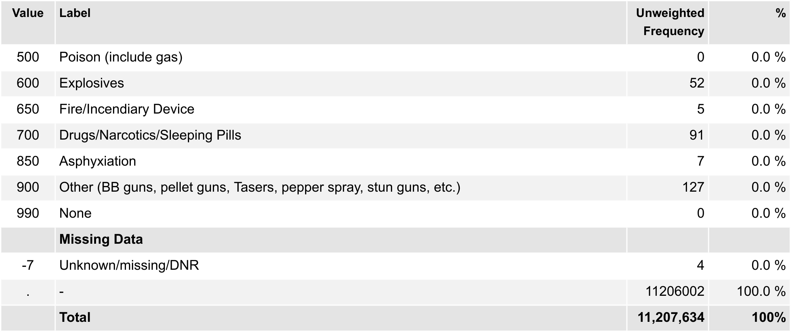

|                             | Unweighted Frequency | %    |
|-----------------------------|----------------------|------|
| 500 Poison (include gas)    | 0                    | 0.0% |
| 600 Explosives              | 52                   | 0.0% |
| 650 Fire/Incendiary Device  | 5                    | 0.0% |
| 700 Drugs/Narcotics/Sleeping Pills | 91       | 0.0% |
| 850 Asphyxiation            | 7                    | 0.0% |
| 900 Other (BB guns, pellet guns, Tasers, pepper spray, stun guns, etc.) | 127 | 0.0% |
| 990 None                    | 0                    | 0.0% |
| Missing Data                |                      |      |
| -7 Unknown/missing/DNR      | 4                    | 0.0% |
| . -                         |                      |      |
| **Total**                   | 11206002             | 100.0% |
|                             | **11,207,634**       | **100%** |

Based upon 1,628 valid cases out of 11,207,634 total cases.

- Minimum: 111.00
- Maximum: 900.00

    Location: 394-396 (width: 3; decimal: 0)
    Variable Type: numeric
    (Range of) Missing Values: -9, -8, -7, -6, -5, .

---

### V20191: WEAPON / FORCE 3 - 1

### 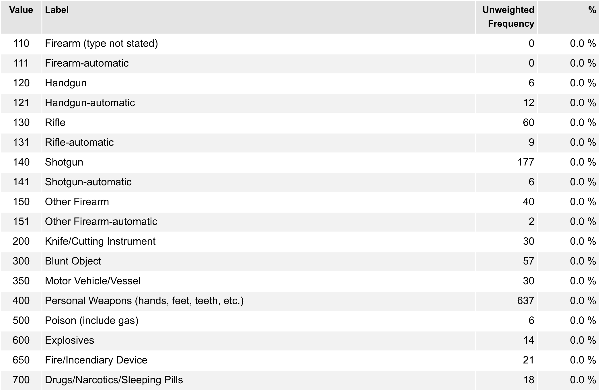

|                             | Unweighted Frequency | %    |
|-----------------------------|----------------------|------|
| 110 Firearm (type not stated) | 0                  | 0.0% |
| 111 Firearm-automatic       | 0                    | 0.0% |
| 120 Handgun                 | 6                    | 0.0% |
| 121 Handgun-automatic       | 12                   | 0.0% |
| 130 Rifle                   | 60                   | 0.0% |
| 131 Rifle-automatic         | 9                    | 0.0% |
| 140 Shotgun                 | 177                  | 0.0% |
| 141 Shotgun-automatic       | 6                    | 0.0% |
| 150 Other Firearm           | 40                   | 0.0% |
| 151 Other Firearm-automatic | 2                    | 0.0% |
| 200 Knife/Cutting Instrument| 30                   | 0.0% |
| 300 Blunt Object            | 57                   | 0.0% |
| 350 Motor Vehicle/Vessel    | 30                   | 0.0% |
| 400 Personal Weapons (hands, feet, teeth, etc.) | 637 | 0.0% |
| 500 Poison (include gas)    | 6                    | 0.0% |
| 600 Explosives              | 14                   | 0.0% |
| 650 Fire/Incendiary Device  | 21                   | 0.0% |
| 700 Drugs/Narcotics/Sleeping Pills | 18           | 0.0% |


## 95_0.png

|                              | Unweighted Frequency | %        |
|------------------------------|----------------------|----------|
| 850  Asphyxiation            | 363                  | 0.0 %    |
| 900  Other (BB guns, pellet guns, Tasers, pepper spray, stun guns, etc.) | 647     | 0.0 %    |
| 990  None                    | 0                    |          |
| **Missing Data**             |                      |          |
| -7  Unknown/missing/DNR      | 79                   | 0.0 %    |
| -                            | -                    |          |
| **Total**                    | 11,207,634           | 100.0 %  |

Based upon 2,135 valid cases out of 11,207,634 total cases.

- Minimum: 120.00
- Maximum: 900.00

**Location:** 397-399 (width: 3; decimal: 0)  
**Variable Type:** numeric  
**(Range of) Missing Values:** -9, -8, -7, -6, -5, .  

## V20192: WEAPON / FORCE 3 - 2

## 95_1.png

|                                | Unweighted Frequency | %        |
|--------------------------------|----------------------|----------|
| 110  Firearm (type not stated) | 0                    | 0.0 %    |
| 111  Firearm-automatic         | 0                    | 0.0 %    |
| 120  Handgun                   | 1                    | 0.0 %    |
| 121  Handgun-automatic         | 2                    | 0.0 %    |
| 130  Rifle                     | 30                   | 0.0 %    |
| 131  Rifle-automatic           | 6                    | 0.0 %    |
| 140  Shotgun                   | 109                  | 0.0 %    |
| 141  Shotgun-automatic         | 2                    | 0.0 %    |
| 150  Other Firearm             | 11                   | 0.0 %    |
| 151  Other Firearm-automatic   | 1                    | 0.0 %    |
| 200  Knife/Cutting Instrument  | 11                   | 0.0 %    |
| 300  Blunt Object              | 17                   | 0.0 %    |
| 350  Motor Vehicle/Vessel      | 3                    | 0.0 %    |
| 400  Personal Weapons (hands, feet, teeth, etc.) | 45        | 0.0 %    |
| 500  Poison (include gas)      | 0                    | 0.0 %    |
| 600  Explosives                | 11                   | 0.0 %    |
| 650  Fire/Incendiary Device    | 6                    | 0.0 %    |
| 700  Drugs/Narcotics/Sleeping Pills | 21             | 0.0 %    |
| 850  Asphyxiation              | 54                   | 0.0 %    |
| 900  Other (BB guns, pellet guns, Tasers, pepper spray, stun guns, etc.) | 76   | 0.0 %    |
| 990  None                      | 0                    | 0.0 %    |
| **Missing Data**               |                      |          |


|                          | Unweighted Frequency | %       |
|--------------------------|----------------------|---------|
| -7 Unknown/missing/DNR   | 4                    | 0.0 %   |
| -                        |                      |         |
| **Total**                | 11,207,224           | **100%**|

Based upon 406 valid cases out of 11,207,634 total cases.

- Minimum: 120.00
- Maximum: 900.00

*Location*: 400-402 (width: 3; decimal: 0)
*Variable Type*: numeric
*(Range of) Missing Values*: -9, -8, -7, -6, -5, .

---

## V20193: WEAPON / FORCE 3 - 3

|                                      | Unweighted Frequency | %       |
|--------------------------------------|----------------------|---------|
| 110 Firearm (type not stated)        | 0                    | 0.0 %   |
| 111 Firearm-automatic                | 0                    | 0.0 %   |
| 120 Handgun                          | 0                    | 0.0 %   |
| 121 Handgun-automatic                | 0                    | 0.0 %   |
| 130 Rifle                            | 17                   | 0.0 %   |
| 131 Rifle-automatic                  | 1                    | 0.0 %   |
| 140 Shotgun                          | 115                  | 0.0 %   |
| 141 Shotgun-automatic                | 1                    | 0.0 %   |
| 150 Other Firearm                    | 9                    | 0.0 %   |
| 151 Other Firearm-automatic          | 2                    | 0.0 %   |
| 200 Knife/Cutting Instrument         | 12                   | 0.0 %   |
| 300 Blunt Object                     | 4                    | 0.0 %   |
| 350 Motor Vehicle/Vessel             | 0                    | 0.0 %   |
| 400 Personal Weapons (hands, feet, teeth, etc.) | 3                    | 0.0 %   |
| 500 Poison (include gas)             | 0                    | 0.0 %   |
| 600 Explosives                       | 8                    | 0.0 %   |
| 650 Fire/Incendiary Device           | 0                    | 0.0 %   |
| 700 Drugs/Narcotics/Sleeping Pills   | 11                   | 0.0 %   |
| 850 Asphyxiation                     | 1                    | 0.0 %   |
| 990 None                             | 0                    | 0.0 %   |
| 850 Asphyxiation                     | 20                   | 0.0 %   |
| **Missing Data**                                  |            |         |
| -7 Unknown/missing/DNR               | 1                    | 0.0 %   |
| -                                    | 11,207,429           | 100.0 % |
| **Total**                            | 11,207,634           | **100%** |


Based upon 204 valid cases out of 11,207,634 total cases.

- Minimum: 130.00
- Maximum: 900.00

Location: 403-405 (width: 3; decimal: 0)  
Variable Type: numeric  
(Range of) Missing Values: -9, -8, -7, -6, -5, .

V20201: BIAS MOTIVATION 1 - 1

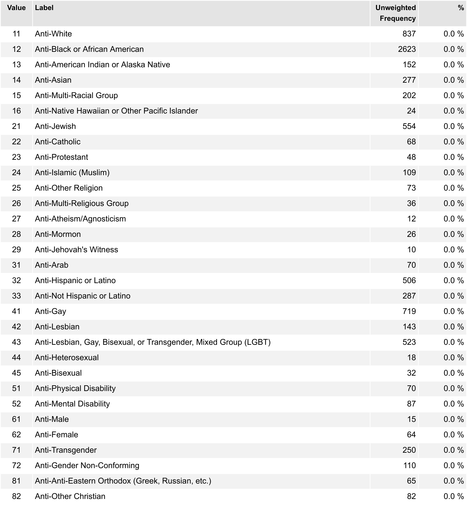

|        |                                    | Unweighted Frequency | %    |
|--------|------------------------------------|----------------------|------|
| 11     | Anti-White                         | 837                  | 0.0 %|
| 12     | Anti-Black or African American     | 2623                 | 0.0 %|
| 13     | Anti-American Indian or Alaska Native | 152               | 0.0 %|
| 14     | Anti-Asian                         | 277                  | 0.0 %|
| 15     | Anti-Multi-Racial Group            | 202                  | 0.0 %|
| 16     | Anti-Native Hawaiian or Other Pacific Islander | 24 | 0.0 %|
| 21     | Anti-Jewish                        | 554                  | 0.0 %|
| 22     | Anti-Catholic                      | 68                   | 0.0 %|
| 23     | Anti-Protestant                    | 48                   | 0.0 %|
| 24     | Anti-Islamic (Muslim)              | 109                  | 0.0 %|
| 25     | Anti-Other Religion                | 73                   | 0.0 %|
| 26     | Anti-Multi-Religious Group         | 36                   | 0.0 %|
| 27     | Anti-Atheism/Agnosticism           | 12                   | 0.0 %|
| 28     | Anti-Mormon                        | 26                   | 0.0 %|
| 29     | Anti-Jehovah’s Witness             | 10                   | 0.0 %|
| 31     | Anti-Arab                          | 70                   | 0.0 %|
| 32     | Anti-Hispanic or Latino            | 506                  | 0.0 %|
| 33     | Anti-Not Hispanic or Latino        | 287                  | 0.0 %|
| 41     | Anti-Gay                           | 719                  | 0.0 %|
| 42     | Anti-Lesbian                       | 143                  | 0.0 %|
| 43     | Anti-Lesbian, Gay, Bisexual, or Transgender, Mixed Group (LGBT) | 523 | 0.0 %|
| 44     | Anti-Heterosexual                  | 18                   | 0.0 %|
| 45     | Anti-Bisexual                      | 32                   | 0.0 %|
| 51     | Anti-Physical Disability           | 70                   | 0.0 %|
| 52     | Anti-Mental Disability             | 87                   | 0.0 %|
| 61     | Anti-Male                          | 15                   | 0.0 %|
| 62     | Anti-Female                        | 64                   | 0.0 %|
| 71     | Anti-Transgender                   | 250                  | 0.0 %|
| 72     | Anti-Gender Non-Conforming         | 110                  | 0.0 %|
| 81     | Anti-Anti-Eastern Orthodox (Greek, Russian, etc.) | 65 | 0.0 %|
| 82     | Anti-Other Christian               | 82                   | 0.0 %|


## 98_0.png

|    |                             | Unweighted Frequency |     %      |
|----|-----------------------------|----------------------|------------|
| 83 | Anti-Buddhist               | 17                   | 0.0 %      |
| 84 | Anti-Hindu                  | 18                   | 0.0 %      |
| 85 | Anti-Sikh                   | 151                  | 0.0 %      |
| 88 | None                        | 11116085             | 99.2 %     |
| 99 | Unknown                     | 83271                | 0.7 %      |
|    | **Total**                   | **11,207,634**       | **100%**   |

Based upon 11,207,634 valid cases out of 11,207,634 total cases.

- Minimum: 11.00
- Maximum: 99.00

Location: 406-407 (width: 2; decimal: 0)
Variable Type: numeric
(Range of) Missing Values: -9, -8, -7, -6, -5


## V20202: BIAS MOTIVATION 1 - 2

## 98_1.png

|    |                                                                       | Unweighted Frequency |     %      |
|----|-----------------------------------------------------------------------|----------------------|------------|
| 11 | Anti-White                                                            | 45                   | 0.0 %      |
| 12 | Anti-Black or African American                                        | 169                  | 0.0 %      |
| 13 | Anti-American Indian or Alaska Native                                 | 22                   | 0.0 %      |
| 14 | Anti-Asian                                                            | 26                   | 0.0 %      |
| 15 | Anti-Multi-Racial Group                                               | 10                   | 0.0 %      |
| 16 | Anti-Native Hawaiian or Other Pacific Islander                        | 1                    | 0.0 %      |
| 21 | Anti-Jewish                                                           | 20                   | 0.0 %      |
| 22 | Anti-Catholic                                                         | 6                    | 0.0 %      |
| 23 | Anti-Protestant                                                       | 8                    | 0.0 %      |
| 24 | Anti-Islamic (Muslim)                                                 | 11                   | 0.0 %      |
| 25 | Anti-Other Religion                                                   | 11                   | 0.0 %      |
| 26 | Anti-Multi-Religious Group                                            | 4                    | 0.0 %      |
| 27 | Anti-Atheism/Agnosticism                                              | 2                    | 0.0 %      |
| 28 | Anti-Mormon                                                           | 5                    | 0.0 %      |
| 29 | Anti-Jehovah's Witness                                                | 1                    | 0.0 %      |
| 31 | Anti-Arab                                                             | 4                    | 0.0 %      |
| 32 | Anti-Hispanic or Latino                                               | 51                   | 0.0 %      |
| 33 | Anti-Not Hispanic or Latino                                           | 10                   | 0.0 %      |
| 41 | Anti-Gay                                                              | 33                   | 0.0 %      |
| 42 | Anti-Lesbian                                                          | 4                    | 0.0 %      |
| 43 | Anti-Lesbian, Gay, Bisexual, or Transgender, Mixed Group (LGBT)       | 44                   | 0.0 %      |
| 44 | Anti-Heterosexual                                                     | 2                    | 0.0 %      |
| 45 | Anti-Bisexual                                                         | 2                    | 0.0 %      |


## 99_0.png

|                                          | Unweighted Frequency | %     |
|------------------------------------------|----------------------|-------|
| 51  Anti-Physical Disability             | 5                    | 0.0 % |
| 52  Anti-Mental Disability               | 6                    | 0.0 % |
| 61  Anti-Male                            | 3                    | 0.0 % |
| 62  Anti-Female                          | 7                    | 0.0 % |
| 71  Anti-Transgender                     | 11                   | 0.0 % |
| 72  Anti-Gender Non-Conforming           | 6                    | 0.0 % |
| 81  Anti-Anti-Eastern Orthodox (Greek, Russian, etc.) | 8 | 0.0 % |
| 82  Anti-Other Christian                 | 7                    | 0.0 % |
| 83  Anti-Buddhist                        | 2                    | 0.0 % |
| 84  Anti-Hindu                           | 2                    | 0.0 % |
| 85  Anti-Sikh                            | 24                   | 0.0 % |
| 88  None                                 | 1,318,520            | 11.8 %|
| 99  Unknown                              | 9,125                | 0.1 % |
| Missing Data                             |                      |       |
| .                                        | 987,9417             | 88.1 %|
| Total                                    | 11,207,634           | 100 % |

Based upon 1,328,217 valid cases out of 11,207,634 total cases.

- Minimum: 11.00
- Maximum: 99.00

Location: 408-409 (width: 2; decimal: 0)  
Variable Type: numeric  
(Range of) Missing Values: -9, -8, -7, -6, -5, .

## V20203: BIAS MOTIVATION 1 - 3

## 99_1.png

|                                          | Unweighted Frequency | %     |
|------------------------------------------|----------------------|-------|
| 11  Anti-White                           | 7                    | 0.0 % |
| 12  Anti-Black or African American       | 11                   | 0.0 % |
| 13  Anti-American Indian or Alaska Native| 12                   | 0.0 % |
| 14  Anti-Asian                           | 1                    | 0.0 % |
| 15  Anti-Multi-Racial Group              | 1                    | 0.0 % |
| 16  Anti-Native Hawaiian or Other Pacific Islander | 0        | 0.0 % |
| 21  Anti-Jewish                          | 2                    | 0.0 % |
| 22  Anti-Catholic                        | 2                    | 0.0 % |
| 23  Anti-Protestant                      | 0                    | 0.0 % |
| 24  Anti-Islamic (Muslim)                | 1                    | 0.0 % |
| 25  Anti-Other Religion                  | 0                    | 0.0 % |
| 26  Anti-Multi-Religious Group           | 2                    | 0.0 % |
| 27  Anti-Atheism/Agnosticism             | 0                    | 0.0 % |


|                                | Unweighted Frequency | %    |
|--------------------------------|----------------------|------|
| 28  Anti-Mormon                | 1                    | 0.0 %|
| 29  Anti-Jehovah's Witness     | 0                    | 0.0 %|
| 31  Anti-Arab                  | 2                    | 0.0 %|
| 32  Anti-Hispanic or Latino    | 2                    | 0.0 %|
| 33  Anti-Not Hispanic or Latino| 2                    | 0.0 %|
| 41  Anti-Gay                   | 0                    | 0.0 %|
| 42  Anti-Lesbian               | 1                    | 0.0 %|
| 43  Anti-Lesbian, Gay, Bisexual, or Transgender, Mixed Group (LGBT) | 3 | 0.0 %|
| 44  Anti-Heterosexual          | 1                    | 0.0 %|
| 45  Anti-Bisexual              | 0                    | 0.0 %|
| 51  Anti-Physical Disability   | 1                    | 0.0 %|
| 52  Anti-Mental Disability     | 0                    | 0.0 %|
| 61  Anti-Male                  | 0                    | 0.0 %|
| 62  Anti-Female                | 0                    | 0.0 %|
| 71  Anti-Transgender           | 1                    | 0.0 %|
| 72  Anti-Gender Non-Conforming | 2                    | 0.0 %|
| 81  Anti-Anti-Eastern Orthodox (Greek, Russian, etc.)| 2    | 0.0 %|
| 82  Anti-Other Christian       | 5                    | 0.0 %|
| 83  Anti-Buddhist              | 0                    | 0.0 %|
| 84  Anti-Hindu                 | 0                    | 0.0 %|
| 85  Anti-Sikh                  | 3                    | 0.0 %|
| 88  None                       | 152374               | 1.4 %|
| 99  Unknown                    |                      |      |
| Missing Data                   | 1163                 | 0.0 %|
| Total                          | 11054032             | 98.6%|

* Based upon 153,602 valid cases out of 11,207,634 total cases.

* Minimum: 11.00
* Maximum: 99.00

Location: 410-411 (width: 2; decimal: 0)  
Variable Type: numeric  
(Range of) Missing Values: -9, -8, -7, -6, -5, .

V2020B1: BIAS MOTIVATION 2 - 1

|                                | Unweighted Frequency | %    |
|--------------------------------|----------------------|------|
| 11  Anti-White                 | 0                    | 0.0 %|
| 12  Anti-Black or African American | 0               | 0.0 %|
| 13  Anti-American Indian or Alaska Native | 0        | 0.0 %|


|                           | Unweighted Frequency |      %      |
|---------------------------|----------------------|-------------|
| 14 Anti-Asian             | 0                    | 0.0%        |
| 15 Anti-Multi-Racial Group| 0                    | 0.0%        |
| 16 Anti-Native Hawaiian or Other Pacific Islander| 0           | 0.0%        |
| 21 Anti-Jewish            | 0                    | 0.0%        |
| 22 Anti-Catholic          | 0                    | 0.0%        |
| 23 Anti-Protestant        | 0                    | 0.0%        |
| 24 Anti-Islamic (Muslim)  | 0                    | 0.0%        |
| 25 Anti-Other Religion    | 0                    | 0.0%        |
| 26 Anti-Multi-Religious Group| 0                 | 0.0%        |
| 27 Anti-Atheism/Agnosticism| 0                   | 0.0%        |
| 28 Anti-Mormon            | 0                    | 0.0%        |
| 29 Anti-Jehovah's Witness | 0                    | 0.0%        |
| 31 Anti-Arab              | 0                    | 0.0%        |
| 32 Anti-Hispanic or Latino| 0                    | 0.0%        |
| 33 Anti-Not Hispanic or Latino| 0                | 0.0%        |
| 41 Anti-Gay               | 0                    | 0.0%        |
| 42 Anti-Lesbian           | 0                    | 0.0%        |
| 43 Anti-Lesbian, Gay, Bisexual, or Transgender, Mixed Group (LGBT)| 0 | 0.0%       |
| 44 Anti-Heterosexual      | 0                    | 0.0%        |
| 45 Anti-Bisexual          | 0                    | 0.0%        |
| 51 Anti-Physical Disability| 0                   | 0.0%        |
| 52 Anti-Mental Disability | 0                    | 0.0%        |
| 61 Anti-Male              | 0                    | 0.0%        |
| 62 Anti-Female            | 0                    | 0.0%        |
| 71 Anti-Transgender       | 0                    | 0.0%        |
| 72 Anti-Gender Non-Conforming| 0                 | 0.0%        |
| 81 Anti-Anti-Eastern Orthodox (Greek, Russian, etc.)| 0         | 0.0%        |
| 82 Anti-Other Christian   | 0                    | 0.0%        |
| 83 Anti-Buddhist          | 0                    | 0.0%        |
| 84 Anti-Hindu             | 0                    | 0.0%        |
| 85 Anti-Sikh              | 0                    | 0.0%        |
| 88 None                   | 0                    | 0.0%        |
| 99 Unknown                | 0                    | 0.0%        |

|                           |             |             |
|---------------------------|-------------|-------------|
| Missing Data              | 11207634    | 100.0%      |
| Total                     | 11207634    | 100%        |

Based upon 0 valid cases out of 11,207,634 total cases.

Location: 412-413 (width: 2; decimal: 0)

Variable Type: numeric


# V2020B2: BIAS MOTIVATION 2 - 2

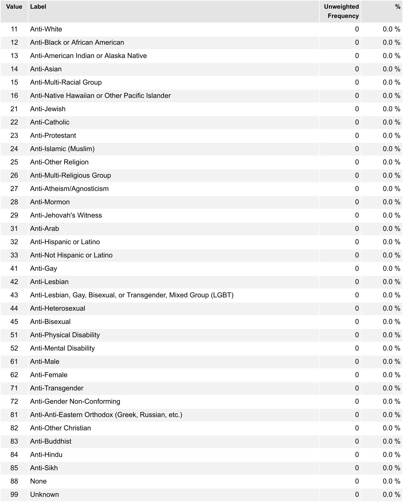

|                                          | Unweighted Frequency | %     |
|------------------------------------------|----------------------|-------|
| 11  | Anti-White                                | 0                    | 0.0 % |
| 12  | Anti-Black or African American            | 0                    | 0.0 % |
| 13  | Anti-American Indian or Alaska Native     | 0                    | 0.0 % |
| 14  | Anti-Asian                                 | 0                    | 0.0 % |
| 15  | Anti-Multi-Racial Group                    | 0                    | 0.0 % |
| 16  | Anti-Native Hawaiian or Other Pacific Islander | 0                    | 0.0 % |
| 21  | Anti-Jewish                                | 0                    | 0.0 % |
| 22  | Anti-Catholic                              | 0                    | 0.0 % |
| 23  | Anti-Protestant                            | 0                    | 0.0 % |
| 24  | Anti-Islamic (Muslim)                      | 0                    | 0.0 % |
| 25  | Anti-Other Religion                        | 0                    | 0.0 % |
| 26  | Anti-Multi-Religious Group                 | 0                    | 0.0 % |
| 27  | Anti-Atheism/Agnosticism                   | 0                    | 0.0 % |
| 28  | Anti-Mormon                                | 0                    | 0.0 % |
| 29  | Anti-Jehovah's Witness                     | 0                    | 0.0 % |
| 31  | Anti-Arab                                  | 0                    | 0.0 % |
| 32  | Anti-Hispanic or Latino                    | 0                    | 0.0 % |
| 33  | Anti-Not Hispanic or Latino                | 0                    | 0.0 % |
| 41  | Anti-Gay                                   | 0                    | 0.0 % |
| 42  | Anti-Lesbian                               | 0                    | 0.0 % |
| 43  | Anti-Lesbian, Gay, Bisexual, or Transgender, Mixed Group (LGBT) | 0                    | 0.0 % |
| 44  | Anti-Heterosexual                          | 0                    | 0.0 % |
| 45  | Anti-Bisexual                              | 0                    | 0.0 % |
| 51  | Anti-Physical Disability                   | 0                    | 0.0 % |
| 52  | Anti-Mental Disability                     | 0                    | 0.0 % |
| 61  | Anti-Male                                  | 0                    | 0.0 % |
| 62  | Anti-Female                                | 0                    | 0.0 % |
| 71  | Anti-Transgender                           | 0                    | 0.0 % |
| 72  | Anti-Gender Non-Conforming                 | 0                    | 0.0 % |
| 81  | Anti-Eastern Orthodox (Greek, Russian, etc.) | 0                    | 0.0 % |
| 82  | Anti-Other Christian                       | 0                    | 0.0 % |
| 83  | Anti-Buddhist                              | 0                    | 0.0 % |
| 84  | Anti-Hindu                                 | 0                    | 0.0 % |
| 85  | Anti-Sikh                                  | 0                    | 0.0 % |
| 88  | None                                       | 0                    | 0.0 % |
| 99  | Unknown                                    | 0                    | 0.0 % |


| Missing Data | Unweighted Frequency | % |
|--------------|-----------------------|---|
| -            | 11207634              | 100.0 % |
| Total        | 11,207,634            | 100% |

Based upon 0 valid cases out of 11,207,634 total cases.

Location: 414-415 (width: 2; decimal: 0)  
Variable Type: numeric  
(Range of) Missing Values: -9, -8, -7, -6, -5, .

# V2020B3: BIAS MOTIVATION 2 - 3

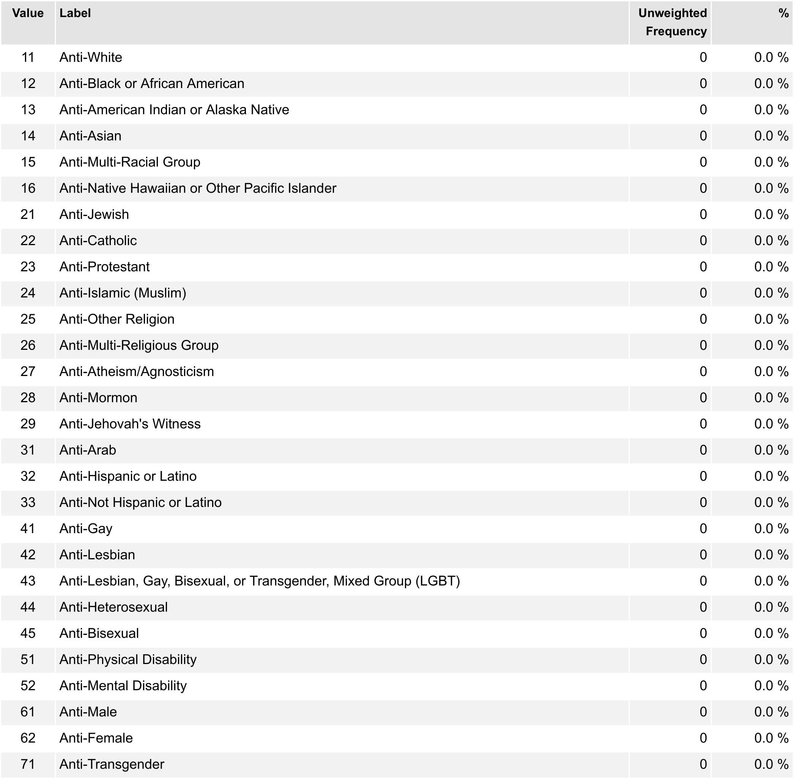

|         | Unweighted Frequency | %   |
|---------|-----------------------|-----|
| 11      | Anti-White            | 0.0 % |
| 12      | Anti-Black or African American | 0.0 % |
| 13      | Anti-American Indian or Alaska Native | 0.0 % |
| 14      | Anti-Asian            | 0.0 % |
| 15      | Anti-Multi-Racial Group | 0.0 % |
| 16      | Anti-Native Hawaiian or Other Pacific Islander | 0.0 % |
| 21      | Anti-Jewish           | 0.0 % |
| 22      | Anti-Catholic         | 0.0 % |
| 23      | Anti-Protestant       | 0.0 % |
| 24      | Anti-Islamic (Muslim) | 0.0 % |
| 25      | Anti-Other Religion   | 0.0 % |
| 26      | Anti-Multi-Religious Group | 0.0 % |
| 27      | Anti-Atheism/Agnosticism | 0.0 % |
| 28      | Anti-Mormon           | 0.0 % |
| 29      | Anti-Jehovah's Witness | 0.0 % |
| 31      | Anti-Arab             | 0.0 % |
| 32      | Anti-Hispanic or Latino | 0.0 % |
| 33      | Anti-Not Hispanic or Latino | 0.0 % |
| 41      | Anti-Gay              | 0.0 % |
| 42      | Anti-Lesbian          | 0.0 % |
| 43      | Anti-Lesbian, Gay, Bisexual, or Transgender, Mixed Group (LGBT) | 0.0 % |
| 44      | Anti-Heterosexual     | 0.0 % |
| 45      | Anti-Bisexual         | 0.0 % |
| 51      | Anti-Physical Disability | 0.0 % |
| 52      | Anti-Mental Disability | 0.0 % |
| 61      | Anti-Male             | 0.0 % |
| 62      | Anti-Female           | 0.0 % |
| 71      | Anti-Transgender      | 0.0 % |


## 104_0.png

|                                      | Unweighted Frequency | %      |
|--------------------------------------|----------------------|--------|
| 72  Anti-Gender Non-Conforming       | 0                    | 0.0 %  |
| 81  Anti-Anti-Eastern Orthodox (Greek, Russian, etc.) | 0                    | 0.0 %  |
| 82  Anti-Other Christian             | 0                    | 0.0 %  |
| 83  Anti-Buddhist                    | 0                    | 0.0 %  |
| 84  Anti-Hindu                       | 0                    | 0.0 %  |
| 85  Anti-Sikh                        | 0                    | 0.0 %  |
| 88  None                             | 0                    | 0.0 %  |
| 99  Unknown                          | 0                    | 0.0 %  |
| Missing Data                         | 11207634             | 100.0% |
| Total                                | 11,207,634           | 100%   |

Based upon 0 valid cases out of 11,207,634 total cases.

**Location:** 416-417 (width: 2; decimal: 0)

**Variable Type:** numeric

**(Range of) Missing Values:** -9, -8, -7, -6, -5, .

---

## V2020C1: BIAS MOTIVATION 3 - 1

## 104_1.png

|                                      | Unweighted Frequency | %      |
|--------------------------------------|----------------------|--------|
| 11  Anti-White                       | 0                    | 0.0 %  |
| 12  Anti-Black or African American   | 0                    | 0.0 %  |
| 13  Anti-American Indian or Alaska Native | 0              | 0.0 %  |
| 14  Anti-Asian                       | 0                    | 0.0 %  |
| 15  Anti-Multi-Racial Group          | 0                    | 0.0 %  |
| 16  Anti-Native Hawaiian or Other Pacific Islander | 0       | 0.0 %  |
| 21  Anti-Jewish                      | 0                    | 0.0 %  |
| 22  Anti-Catholic                    | 0                    | 0.0 %  |
| 23  Anti-Protestant                  | 0                    | 0.0 %  |
| 24  Anti-Islamic (Muslim)            | 0                    | 0.0 %  |
| 25  Anti-Other Religion              | 0                    | 0.0 %  |
| 26  Anti-Multi-Religious Group       | 0                    | 0.0 %  |
| 27  Anti-Atheism/Agnosticism         | 0                    | 0.0 %  |
| 28  Anti-Mormon                      | 0                    | 0.0 %  |
| 29  Anti-Jehovah's Witness           | 0                    | 0.0 %  |
| 31  Anti-Arab                        | 0                    | 0.0 %  |
| 32  Anti-Hispanic or Latino          | 0                    | 0.0 %  |
| 33  Anti-Not Hispanic or Latino      | 0                    | 0.0 %  |
| 41  Anti-Gay                         | 0                    | 0.0 %  |
| 42  Anti-Lesbian                     | 0                    | 0.0 %  |


## 105_0.png

|                                        |  Unweighted Frequency | %    |
|----------------------------------------|-----------------------|------|
| 43 Anti-Lesbian, Gay, Bisexual, or Transgender, Mixed Group (LGBT) | 0 | 0.0 % |
| 44 Anti-Heterosexual                    | 0                     | 0.0 % |
| 45 Anti-Bisexual                        | 0                     | 0.0 % |
| 51 Anti-Physical Disability             | 0                     | 0.0 % |
| 52 Anti-Mental Disability               | 0                     | 0.0 % |
| 61 Anti-Male                            | 0                     | 0.0 % |
| 62 Anti-Female                          | 0                     | 0.0 % |
| 71 Anti-Transgender                     | 0                     | 0.0 % |
| 72 Anti-Gender Non-Conforming           | 0                     | 0.0 % |
| 81 Anti-Anti-Eastern Orthodox (Greek, Russian, etc.) | 0 | 0.0 % |
| 82 Anti-Other Christian                 | 0                     | 0.0 % |
| 83 Anti-Buddhist                        | 0                     | 0.0 % |
| 84 Anti-Hindu                           | 0                     | 0.0 % |
| 85 Anti-Sikh                            | 0                     | 0.0 % |
| 88 None                                 | 0                     | 0.0 % |
| 99 Unknown                              | 0                     | 0.0 % |
|                                        |                       |      |
| Missing Data                           | 11207634              | 100.0 % |
|                                        |                       |      |
| Total                                  | 11,207,634            | 100% |

Based upon 0 valid cases out of 11,207,634 total cases.

Location: 418-419 (width: 2; decimal: 0)  
Variable Type: numeric  
(Range of) Missing Values: -9, -8, -7, -6, -5, .

## V2020C2: BIAS MOTIVATION 3 - 2

## 105_1.png

|                                        |  Unweighted Frequency | %    |
|----------------------------------------|-----------------------|------|
| 11  Anti-White                         | 0                     | 0.0 % |
| 12  Anti-Black or African American     | 0                     | 0.0 % |
| 13  Anti-American Indian or Alaska Native | 0                  | 0.0 % |
| 14  Anti-Asian                         | 0                     | 0.0 % |
| 15  Anti-Multi-Racial Group            | 0                     | 0.0 % |
| 16  Anti-Native Hawaiian or Other Pacific Islander | 0        | 0.0 % |
| 21  Anti-Jewish                        | 0                     | 0.0 % |
| 22  Anti-Catholic                      | 0                     | 0.0 % |
| 23  Anti-Protestant                    | 0                     | 0.0 % |
| 24  Anti-Islamic (Muslim)              | 0                     | 0.0 % |
| 25  Anti-Other Religion                | 0                     | 0.0 % |
| 26  Anti-Multi-Religious Group         | 0                     | 0.0 % |


|                                         | Unweighted Frequency | %    |
|-----------------------------------------|----------------------|------|
| 27  Anti-Atheism/Agnosticism             | 0                    | 0.0% |
| 28  Anti-Mormon                          | 0                    | 0.0% |
| 29  Anti-Jehovah's Witness               | 0                    | 0.0% |
| 31  Anti-Arab                            | 0                    | 0.0% |
| 32  Anti-Hispanic or Latino              | 0                    | 0.0% |
| 33  Anti-Not Hispanic or Latino          | 0                    | 0.0% |
| 41  Anti-Gay                             | 0                    | 0.0% |
| 42  Anti-Lesbian                         | 0                    | 0.0% |
| 43  Anti-Lesbian, Gay, Bisexual, or Transgender, Mixed Group (LGBT) | 0  | 0.0% |
| 44  Anti-Heterosexual                    | 0                    | 0.0% |
| 45  Anti-Bisexual                        | 0                    | 0.0% |
| 51  Anti-Physical Disability             | 0                    | 0.0% |
| 52  Anti-Mental Disability               | 0                    | 0.0% |
| 61  Anti-Male                            | 0                    | 0.0% |
| 62  Anti-Female                          | 0                    | 0.0% |
| 71  Anti-Transgender                     | 0                    | 0.0% |
| 72  Anti-Gender Non-Conforming           | 0                    | 0.0% |
| 81  Anti-Eastern Orthodox (Greek, Russian, etc.) | 0             | 0.0% |
| 82  Anti-Other Christian                 | 0                    | 0.0% |
| 83  Anti-Buddhist                        | 0                    | 0.0% |
| 84  Anti-Hindu                           | 0                    | 0.0% |
| 85  Anti-Sikh                            | 0                    | 0.0% |
| 88  None                                 | 0                    | 0.0% |
| 99  Unknown                              | 0                    | 0.0% |
|     Missing Data                         | 0                    | 0.0% |
| .                                       |                      |      |
|     Total                                | 11207634             | 100.0%|

Based upon 0 valid cases out of 11,207,634 total cases.

Location: 420-421 (width: 2; decimal: 0)  
Variable Type: numeric  
(Range of) Missing Values: -9, -8, -7, -6, -5, .  

---

### V2020C3: BIAS MOTIVATION 3 - 3

|                                         | Unweighted Frequency | %    |
|-----------------------------------------|----------------------|------|
| 11  Anti-White                          | 0                    | 0.0% |
| 12  Anti-Black or African American      | 0                    | 0.0% |
| 13  Anti-American Indian or Alaska Native | 0                  | 0.0% |
| 14  Anti-Asian                          | 0                    | 0.0% |


|                         | Unweighted Frequency | %    |
|-------------------------|----------------------|------|
| 15  Anti-Multi-Racial Group                | 0                    | 0.0 % |
| 16  Anti-Native Hawaiian or Other Pacific Islander           | 0                    | 0.0 % |
| 21  Anti-Jewish                   | 0                    | 0.0 % |
| 22  Anti-Catholic                 | 0                    | 0.0 % |
| 23  Anti-Protestant               | 0                    | 0.0 % |
| 24  Anti-Islamic (Muslim)         | 0                    | 0.0 % |
| 25  Anti-Other Religion           | 0                    | 0.0 % |
| 26  Anti-Multi-Religious Group    | 0                    | 0.0 % |
| 27  Anti-Atheism/Agnosticism      | 0                    | 0.0 % |
| 28  Anti-Mormon                   | 0                    | 0.0 % |
| 29  Anti-Jehovah's Witness        | 0                    | 0.0 % |
| 31  Anti-Arab                     | 0                    | 0.0 % |
| 32  Anti-Hispanic or Latino       | 0                    | 0.0 % |
| 33  Anti-Not Hispanic or Latino   | 0                    | 0.0 % |
| 41  Anti-Gay                      | 0                    | 0.0 % |
| 42  Anti-Lesbian                  | 0                    | 0.0 % |
| 43  Anti-Lesbian, Gay, Bisexual, or Transgender, Mixed Group (LGBT) | 0        | 0.0 % |
| 44  Anti-Heterosexual             | 0                    | 0.0 % |
| 45  Anti-Bisexual                 | 0                    | 0.0 % |
| 51  Anti-Physical Disability      | 0                    | 0.0 % |
| 52  Anti-Mental Disability        | 0                    | 0.0 % |
| 61  Anti-Male                     | 0                    | 0.0 % |
| 62  Anti-Female                   | 0                    | 0.0 % |
| 71  Anti-Transgender              | 0                    | 0.0 % |
| 72  Anti-Gender Non-Conforming    | 0                    | 0.0 % |
| 81  Anti-Anti-Eastern Orthodox (Greek, Russian, etc.)   | 0                 | 0.0 % |
| 82  Anti-Other Christian          | 0                    | 0.0 % |
| 83  Anti-Buddhist                 | 0                    | 0.0 % |
| 84  Anti-Hindu                    | 0                    | 0.0 % |
| 85  Anti-Sikh                     | 0                    | 0.0 % |
| 88  None                          | 0                    | 0.0 % |
| 99  Unknown                       | 0                    | 0.0 % |
| Missing Data                      |                      |      |
| .                                 |                      |      |
| Total                             | 11207634             | 100.0 % |

Based upon 0 valid cases out of 11,207,634 total cases.

Location: 422-423 (width: 2; decimal: 0)
Variable Type: numeric
(Range of) Missing Values: -9, -8, -7, -6, -5, .


## V2020D1: BIAS MOTIVATION 4 - 1

|                                        | Unweighted Frequency | %    |
|----------------------------------------|----------------------|------|
| 11 Anti-White                          | 0                    | 0.0% |
| 12 Anti-Black or African American      | 0                    | 0.0% |
| 13 Anti-American Indian or Alaska Native | 0                  | 0.0% |
| 14 Anti-Asian                          | 0                    | 0.0% |
| 15 Anti-Multi-Racial Group             | 0                    | 0.0% |
| 16 Anti-Native Hawaiian or Other Pacific Islander | 0          | 0.0% |
| 21 Anti-Jewish                         | 0                    | 0.0% |
| 22 Anti-Catholic                       | 0                    | 0.0% |
| 23 Anti-Protestant                     | 0                    | 0.0% |
| 24 Anti-Islamic (Muslim)               | 0                    | 0.0% |
| 25 Anti-Other Religion                 | 0                    | 0.0% |
| 26 Anti-Multi-Religious Group          | 0                    | 0.0% |
| 27 Anti-Atheism/Agnosticism            | 0                    | 0.0% |
| 28 Anti-Mormon                         | 0                    | 0.0% |
| 29 Anti-Jehovah's Witness              | 0                    | 0.0% |
| 31 Anti-Arab                           | 0                    | 0.0% |
| 32 Anti-Hispanic or Latino             | 0                    | 0.0% |
| 33 Anti-Not Hispanic or Latino         | 0                    | 0.0% |
| 41 Anti-Gay                            | 0                    | 0.0% |
| 42 Anti-Lesbian                        | 0                    | 0.0% |
| 43 Anti-Lesbian, Gay, Bisexual, or Transgender, Mixed Group (LGBT) | 0 | 0.0% |
| 44 Anti-Heterosexual                   | 0                    | 0.0% |
| 45 Anti-Bisexual                       | 0                    | 0.0% |
| 51 Anti-Physical Disability            | 0                    | 0.0% |
| 52 Anti-Mental Disability              | 0                    | 0.0% |
| 61 Anti-Male                           | 0                    | 0.0% |
| 62 Anti-Female                         | 0                    | 0.0% |
| 71 Anti-Transgender                    | 0                    | 0.0% |
| 72 Anti-Gender Non-Conforming          | 0                    | 0.0% |
| 81 Anti-Anti-Eastern Orthodox (Greek, Russian, etc.) | 0        | 0.0% |
| 82 Anti-Other Christian                | 0                    | 0.0% |
| 83 Anti-Buddhist                       | 0                    | 0.0% |
| 84 Anti-Hindu                          | 0                    | 0.0% |
| 85 Anti-Sikh                           | 0                    | 0.0% |
| 88 None                                | 0                    | 0.0% |
| 99 Unknown                             | 0                    | 0.0% |

**Missing Data**


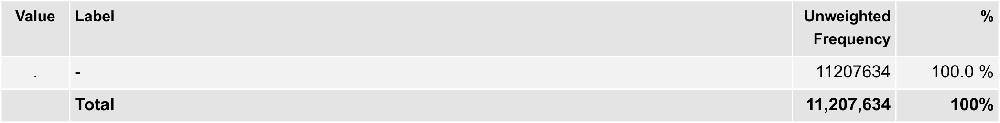

|                     | Unweighted Frequency | %         |
|---------------------|----------------------|-----------|
| . -                 |                      |           |
| **Total**           | 11207634             | 100.0%    |

Based upon 0 valid cases out of 11,207,634 total cases.

Location: 424-425 (width: 2; decimal: 0)  
Variable Type: numeric  
(Range of) Missing Values: -9, -8, -7, -6, -5, .


## V2020D2: BIAS MOTIVATION 4 - 2

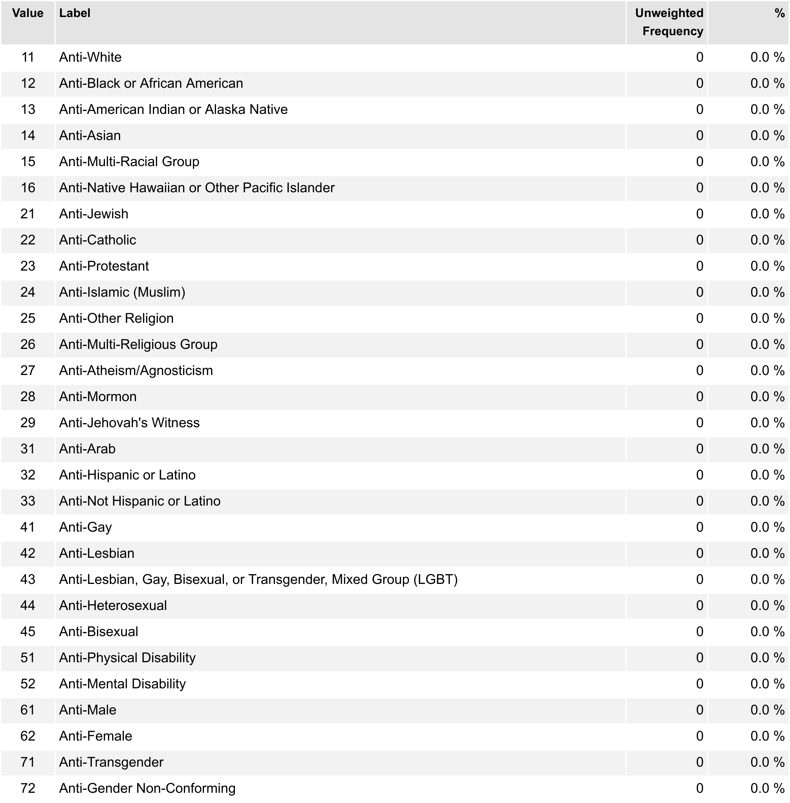

|                                       | Unweighted Frequency | %         |
|---------------------------------------|----------------------|-----------|
| 11  Anti-White                        | 0                    | 0.0%      |
| 12  Anti-Black or African American    | 0                    | 0.0%      |
| 13  Anti-American Indian or Alaska Native | 0                | 0.0%      |
| 14  Anti-Asian                        | 0                    | 0.0%      |
| 15  Anti-Multi-Racial Group           | 0                    | 0.0%      |
| 16  Anti-Native Hawaiian or Other Pacific Islander | 0      | 0.0%      |
| 21  Anti-Jewish                       | 0                    | 0.0%      |
| 22  Anti-Catholic                     | 0                    | 0.0%      |
| 23  Anti-Protestant                   | 0                    | 0.0%      |
| 24  Anti-Islamic (Muslim)             | 0                    | 0.0%      |
| 25  Anti-Other Religion               | 0                    | 0.0%      |
| 26  Anti-Multi-Religious Group        | 0                    | 0.0%      |
| 27  Anti-Atheism/Agnosticism          | 0                    | 0.0%      |
| 28  Anti-Mormon                       | 0                    | 0.0%      |
| 29  Anti-Jehovah's Witness            | 0                    | 0.0%      |
| 31  Anti-Arab                         | 0                    | 0.0%      |
| 32  Anti-Hispanic or Latino           | 0                    | 0.0%      |
| 33  Anti-Not Hispanic or Latino       | 0                    | 0.0%      |
| 41  Anti-Gay                          | 0                    | 0.0%      |
| 42  Anti-Lesbian                      | 0                    | 0.0%      |
| 43  Anti-Lesbian, Gay, Bisexual, or Transgender, Mixed Group (LGBT) | 0 | 0.0% |
| 44  Anti-Heterosexual                 | 0                    | 0.0%      |
| 45  Anti-Bisexual                     | 0                    | 0.0%      |
| 51  Anti-Physical Disability          | 0                    | 0.0%      |
| 52  Anti-Mental Disability            | 0                    | 0.0%      |
| 61  Anti-Male                         | 0                    | 0.0%      |
| 62  Anti-Female                       | 0                    | 0.0%      |
| 71  Anti-Transgender                  | 0                    | 0.0%      |
| 72  Anti-Gender Non-Conforming        | 0                    | 0.0%      |


### 110_0.png
|                               | Unweighted Frequency | %     |
|-------------------------------|----------------------|-------|
| 81  Anti-Eastern Orthodox (Greek, Russian, etc.) | 0                    | 0.0 % |
| 82  Anti-Other Christian    | 0                    | 0.0 % |
| 83  Anti-Buddhist           | 0                    | 0.0 % |
| 84  Anti-Hindu              | 0                    | 0.0 % |
| 85  Anti-Sikh               | 0                    | 0.0 % |
| 88  None                    | 0                    | 0.0 % |
| 99  Unknown                 | 0                    | 0.0 % |
| **Missing Data**            |                      |       |
| .                           |                      |       |
| **Total**                   | 11207634             | 100.0 % |

Based upon 0 valid cases out of 11,207,634 total cases.

Location: 426-427 (width: 2; decimal: 0)

Variable Type: numeric

(Range of) Missing Values: -9, -8, -7, -6, -5, .

### 110_1.png
|                                             | Unweighted Frequency | %     |
|---------------------------------------------|----------------------|-------|
| 11  Anti-White                              | 0                    | 0.0 % |
| 12  Anti-Black or African American          | 0                    | 0.0 % |
| 13  Anti-American Indian or Alaska Native   | 0                    | 0.0 % |
| 14  Anti-Asian                              | 0                    | 0.0 % |
| 15  Anti-Multi-Racial Group                 | 0                    | 0.0 % |
| 16  Anti-Native Hawaiian or Other Pacific Islander | 0              | 0.0 % |
| 21  Anti-Jewish                             | 0                    | 0.0 % |
| 22  Anti-Catholic                           | 0                    | 0.0 % |
| 23  Anti-Protestant                         | 0                    | 0.0 % |
| 24  Anti-Islamic (Muslim)                   | 0                    | 0.0 % |
| 25  Anti-Other Religion                     | 0                    | 0.0 % |
| 26  Anti-Multi-Religious Group              | 0                    | 0.0 % |
| 27  Anti-Atheism/Agnosticism                | 0                    | 0.0 % |
| 28  Anti-Mormon                             | 0                    | 0.0 % |
| 29  Anti-Jehovah's Witness                  | 0                    | 0.0 % |
| 31  Anti-Arab                               | 0                    | 0.0 % |
| 32  Anti-Hispanic or Latino                 | 0                    | 0.0 % |
| 33  Anti-Not Hispanic or Latino             | 0                    | 0.0 % |
| 41  Anti-Gay                                | 0                    | 0.0 % |
| 42  Anti-Lesbian                            | 0                    | 0.0 % |
| 43  Anti-Lesbian, Gay, Bisexual, or Transgender, Mixed Group (LGBT) | 0   | 0.0 % |


111_0.png

|                      | Unweighted Frequency | %   |
|----------------------|----------------------|-----|
| 44 Anti-Heterosexual | 0                    | 0.0 % |
| 45 Anti-Bisexual     | 0                    | 0.0 % |
| 51 Anti-Physical Disability | 0            | 0.0 % |
| 52 Anti-Mental Disability | 0               | 0.0 % |
| 61 Anti-Male         | 0                    | 0.0 % |
| 62 Anti-Female       | 0                    | 0.0 % |
| 71 Anti-Transgender  | 0                    | 0.0 % |
| 72 Anti-Gender Non-Conforming | 0          | 0.0 % |
| 81 Anti-Anti-Eastern Orthodox (Greek, Russian, etc.) | 0 | 0.0 % |
| 82 Anti-Other Christian | 0                | 0.0 % |
| 83 Anti-Buddhist     | 0                    | 0.0 % |
| 84 Anti-Hindu        | 0                    | 0.0 % |
| 85 Anti-Sikh         | 0                    | 0.0 % |
| 88 None              | 0                    | 0.0 % |
| 99 Unknown           | 0                    | 0.0 % |
|                      |                      |     |
| **Total**            | **11207634**         | **100.0 %** |

Based upon 0 valid cases out of 11,207,634 total cases.

Location: 428-429 (width: 2; decimal: 0)  
Variable Type: numeric  
(Range of) Missing Values: -9, -8, -7, -6, -5, .

---

V2020E1: BIAS MOTIVATION 5 - 1

111_1.png

|                                    | Unweighted Frequency | %   |
|------------------------------------|----------------------|-----|
| 11 Anti-White                      | 0                    | 0.0 % |
| 12 Anti-Black or African American  | 0                    | 0.0 % |
| 13 Anti-American Indian or Alaska Native | 0            | 0.0 % |
| 14 Anti-Asian                      | 0                    | 0.0 % |
| 15 Anti-Multi-Racial Group         | 0                    | 0.0 % |
| 16 Anti-Native Hawaiian or Other Pacific Islander | 0   | 0.0 % |
| 21 Anti-Jewish                     | 0                    | 0.0 % |
| 22 Anti-Catholic                   | 0                    | 0.0 % |
| 23 Anti-Protestant                 | 0                    | 0.0 % |
| 24 Anti-Islamic (Muslim)           | 0                    | 0.0 % |
| 25 Anti-Other Religion             | 0                    | 0.0 % |
| 26 Anti-Multi-Religious Group      | 0                    | 0.0 % |
| 27 Anti-Atheism/Agnosticism        | 0                    | 0.0 % |


## 112_0.png

|                              | Unweighted Frequency | %      |
|------------------------------|----------------------|--------|
| 28   Anti-Mormon             | 0                    | 0.0 %  |
| 29   Anti-Jehovah’s Witness  | 0                    | 0.0 %  |
| 31   Anti-Arab               | 0                    | 0.0 %  |
| 32   Anti-Hispanic or Latino | 0                    | 0.0 %  |
| 33   Anti-Not Hispanic or Latino | 0              | 0.0 %  |
| 41   Anti-Gay                | 0                    | 0.0 %  |
| 42   Anti-Lesbian            | 0                    | 0.0 %  |
| 43   Anti-Lesbian, Gay, Bisexual, or Transgender, Mixed Group (LGBT) | 0 | 0.0 %  |
| 44   Anti-Heterosexual       | 0                    | 0.0 %  |
| 45   Anti-Bisexual           | 0                    | 0.0 %  |
| 51   Anti-Physical Disability | 0                   | 0.0 %  |
| 52   Anti-Mental Disability  | 0                    | 0.0 %  |
| 61   Anti-Male               | 0                    | 0.0 %  |
| 62   Anti-Female             | 0                    | 0.0 %  |
| 71   Anti-Transgender        | 0                    | 0.0 %  |
| 72   Anti-Gender Non-Conforming | 0                 | 0.0 %  |
| 81   Anti-Anti-Eastern Orthodox (Greek, Russian, etc.) | 0   | 0.0 %  |
| 82   Anti-Other Christian    | 0                    | 0.0 %  |
| 83   Anti-Buddhist           | 0                    | 0.0 %  |
| 84   Anti-Hindu              | 0                    | 0.0 %  |
| 85   Anti-Sikh               | 0                    | 0.0 %  |
| 88   None                    | 0                    | 0.0 %  |
| 99   Unknown                 | 0                    | 0.0 %  |
|                              |                      |        |
| Missing Data                 |                      |        |
| .                            |                      |        |
| Total                        | 11207634             | 100.0 %|

Based upon 0 valid cases out of 11,207,634 total cases.

Location: 430-431 (width: 2; decimal: 0)  
Variable Type: numeric  
(Range of) Missing Values: -9, -8, -7, -6, -5, .  


## 112_1.png

### V2020E2: BIAS MOTIVATION 5 - 2

|                              | Unweighted Frequency | %      |
|------------------------------|----------------------|--------|
| 11   Anti-White              | 0                    | 0.0 %  |
| 12   Anti-Black or African American | 0            | 0.0 %  |
| 13   Anti-American Indian or Alaska Native | 0      | 0.0 %  |
| 14   Anti-Asian              | 0                    | 0.0 %  |
| 15   Anti-Multi-Racial Group | 0                    | 0.0 %  |


|                                       | Unweighted Frequency | %     |
|---------------------------------------|----------------------|-------|
| 16 Anti-Native Hawaiian or Other Pacific Islander | 0                    | 0.0 % |
| 21 Anti-Jewish                        | 0                    | 0.0 % |
| 22 Anti-Catholic                      | 0                    | 0.0 % |
| 23 Anti-Protestant                    | 0                    | 0.0 % |
| 24 Anti-Islamic (Muslim)              | 0                    | 0.0 % |
| 25 Anti-Other Religion                | 0                    | 0.0 % |
| 26 Anti-Multi-Religious Group         | 0                    | 0.0 % |
| 27 Anti-Atheism/Agnosticism           | 0                    | 0.0 % |
| 28 Anti-Mormon                        | 0                    | 0.0 % |
| 29 Anti-Jehovah's Witness             | 0                    | 0.0 % |
| 31 Anti-Arab                          | 0                    | 0.0 % |
| 32 Anti-Hispanic or Latino            | 0                    | 0.0 % |
| 33 Anti-Not Hispanic or Latino        | 0                    | 0.0 % |
| 41 Anti-Gay                           | 0                    | 0.0 % |
| 42 Anti-Lesbian                       | 0                    | 0.0 % |
| 43 Anti-Lesbian, Gay, Bisexual, or Transgender, Mixed Group (LGBT) | 0 | 0.0 % |
| 44 Anti-Heterosexual                  | 0                    | 0.0 % |
| 45 Anti-Bisexual                      | 0                    | 0.0 % |
| 51 Anti-Physical Disability           | 0                    | 0.0 % |
| 52 Anti-Mental Disability             | 0                    | 0.0 % |
| 61 Anti-Male                          | 0                    | 0.0 % |
| 62 Anti-Female                        | 0                    | 0.0 % |
| 71 Anti-Transgender                   | 0                    | 0.0 % |
| 72 Anti-Gender Non-Conforming         | 0                    | 0.0 % |
| 81 Anti-Anti-Eastern Orthodox (Greek, Russian, etc.) | 0         | 0.0 % |
| 82 Anti-Other Christian               | 0                    | 0.0 % |
| 83 Anti-Buddhist                      | 0                    | 0.0 % |
| 84 Anti-Hindu                         | 0                    | 0.0 % |
| 85 Anti-Sikh                          | 0                    | 0.0 % |
| 88 None                               | 0                    | 0.0 % |
| 99 Unknown                            | 0                    | 0.0 % |
|                                       | 11207634              | 100.0 % |
| Total                                 | 11,207,634            | 100%  |

Based upon 0 valid cases out of 11,207,634 total cases.

Location: 432-433 (width: 2; decimal: 0)

Variable Type: numeric

(Range of) Missing Values: -9, -8, -7, -6, -5, .


V2020E3: BIAS MOTIVATION 5 - 3

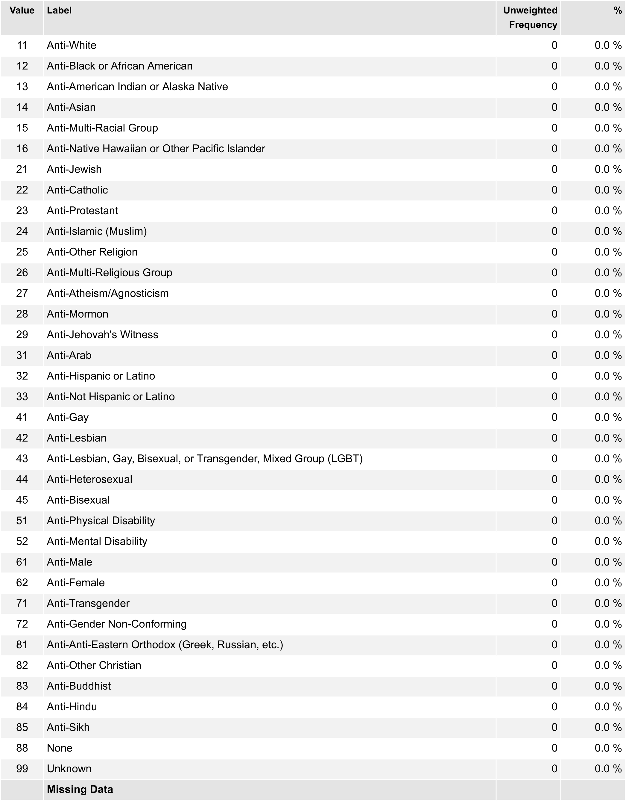

|                | Unweighted Frequency | %      |
|----------------|----------------------|--------|
| 11  | Anti-White                                         | 0                    | 0.0 % |
| 12  | Anti-Black or African American                     | 0                    | 0.0 % |
| 13  | Anti-American Indian or Alaska Native              | 0                    | 0.0 % |
| 14  | Anti-Asian                                         | 0                    | 0.0 % |
| 15  | Anti-Multi-Racial Group                            | 0                    | 0.0 % |
| 16  | Anti-Native Hawaiian or Other Pacific Islander     | 0                    | 0.0 % |
| 21  | Anti-Jewish                                        | 0                    | 0.0 % |
| 22  | Anti-Catholic                                      | 0                    | 0.0 % |
| 23  | Anti-Protestant                                    | 0                    | 0.0 % |
| 24  | Anti-Islamic (Muslim)                              | 0                    | 0.0 % |
| 25  | Anti-Other Religion                                | 0                    | 0.0 % |
| 26  | Anti-Multi-Religious Group                         | 0                    | 0.0 % |
| 27  | Anti-Atheism/Agnosticism                           | 0                    | 0.0 % |
| 28  | Anti-Mormon                                        | 0                    | 0.0 % |
| 29  | Anti-Jehovah's Witness                             | 0                    | 0.0 % |
| 31  | Anti-Arab                                          | 0                    | 0.0 % |
| 32  | Anti-Hispanic or Latino                            | 0                    | 0.0 % |
| 33  | Anti-Not Hispanic or Latino                        | 0                    | 0.0 % |
| 41  | Anti-Gay                                           | 0                    | 0.0 % |
| 42  | Anti-Lesbian                                       | 0                    | 0.0 % |
| 43  | Anti-Lesbian, Gay, Bisexual, or Transgender, Mixed Group (LGBT) | 0      | 0.0 % |
| 44  | Anti-Heterosexual                                  | 0                    | 0.0 % |
| 45  | Anti-Bisexual                                      | 0                    | 0.0 % |
| 51  | Anti-Physical Disability                           | 0                    | 0.0 % |
| 52  | Anti-Mental Disability                             | 0                    | 0.0 % |
| 61  | Anti-Male                                          | 0                    | 0.0 % |
| 62  | Anti-Female                                        | 0                    | 0.0 % |
| 71  | Anti-Transgender                                   | 0                    | 0.0 % |
| 72  | Anti-Gender Non-Conforming                         | 0                    | 0.0 % |
| 81  | Anti-Anti-Eastern Orthodox (Greek, Russian, etc.)  | 0                    | 0.0 % |
| 82  | Anti-Other Christian                               | 0                    | 0.0 % |
| 83  | Anti-Buddhist                                      | 0                    | 0.0 % |
| 84  | Anti-Hindu                                         | 0                    | 0.0 % |
| 85  | Anti-Sikh                                          | 0                    | 0.0 % |
| 88  | None                                               | 0                    | 0.0 % |
| 99  | Unknown                                            | 0                    | 0.0 % |

**Missing Data**


|                                            | Unweighted Frequency | %        |
|--------------------------------------------|----------------------|----------|
| .                                          |                      |          |
| -                                          |                      |          |
| Total                                      | 11207634             | 100.0 %  |
|                                            | 11,207,634           | 100%     |

Based upon 0 valid cases out of 11,207,634 total cases. 

*Location*: 434-435 (width: 2; decimal: 0)  
*Variable Type*: numeric  
*Range of Missing Values*: -9, -8, -7, -6, -5, .

## V30061: TYPE PROPERTY LOSS - 1
|                                            | Unweighted Frequency | %        |
|--------------------------------------------|----------------------|----------|
| 1  None                                    | 586882               | 5.2 %    |
| 2  Burned (includes damage caused in fighting the fire) | 28124 | 0.3 %    |
| 3  Counterfeited/Forged                    | 118194               | 1.1 %    |
| 4  Destroyed/Damaged Vandalized            | 1429461              | 12.8 %   |
| 5  Recovered (to impound property that was previously stolen) | 872480 | 7.8 %   |
| 6  Seized (to impound property that was not previously stolen) | 996681 | 8.9 %   |
| 7  Stolen/Etc. (includes bribed, defrauded, embezzled, extorted, ransomed, robbed, etc.) | 4279099 | 38.2 %  |
| Missing Data                               |                      |          |
| -8  NA LT 3 records                        | 24503                | 0.2 %    |
| -                                          | 2872210              | 25.6 %   |
| Total                                      | 11,207,634           | 100%     |

Based upon 8,310,921 valid cases out of 11,207,634 total cases.

* Minimum: 1.00  
* Maximum: 7.00

*Location*: 436-437 (width: 2; decimal: 0)  
*Variable Type*: numeric  
*Range of Missing Values*: -9, -8, -7, -6, -5, .

## V30062: TYPE PROPERTY LOSS - 2
|                                            | Unweighted Frequency | %        |
|--------------------------------------------|----------------------|----------|
| 1  None                                    | 0                    | 0.0 %    |
| 2  Burned (includes damage caused in fighting the fire) | 2633  | 0.0 %    |
| 3  Counterfeited/Forged                    | 4987                 | 0.0 %    |
| 4  Destroyed/Damaged Vandalized            | 182842               | 1.6 %    |
| 5  Recovered (to impound property that was previously stolen) | 122309 | 1.1 %    |
| 6  Seized (to impound property that was not previously stolen) | 354161 | 3.2 %    |
| 7  Stolen/Etc. (includes bribed, defrauded, embezzled, extorted, ransomed, robbed, etc.) | 1850539 | 16.5 %  |
| Missing Data                               |                      |          |
| -8  NA LT 3 records                        |                      |          |
| -                                          |                      |          |

| Total                                      | 11,207,634           | 100%     |


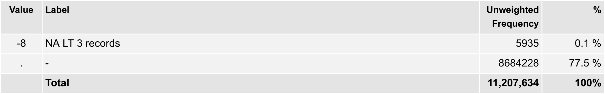

Based upon 2,517,471 valid cases out of 11,207,634 total cases.

- Minimum: 2.00
- Maximum: 7.00

*Location: 438-439 (width: 2; decimal: 0)*
*Variable Type: numeric*
*(Range of) Missing Values: -9, -8, -7, -6, -5, .*


## V30063: TYPE PROPERTY LOSS - 3

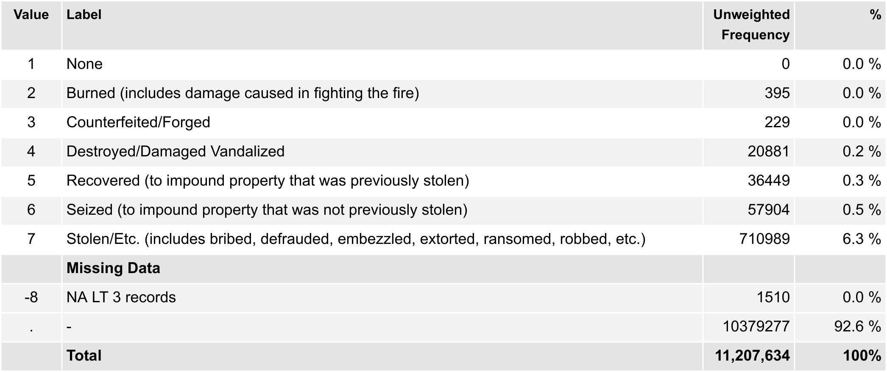

Based upon 826,847 valid cases out of 11,207,634 total cases.

- Minimum: 2.00
- Maximum: 7.00

*Location: 440-441 (width: 2; decimal: 0)*
*Variable Type: numeric*
*(Range of) Missing Values: -9, -8, -7, -6, -5, .*

## V30071: PROPERTY DESCRIPTION - 1

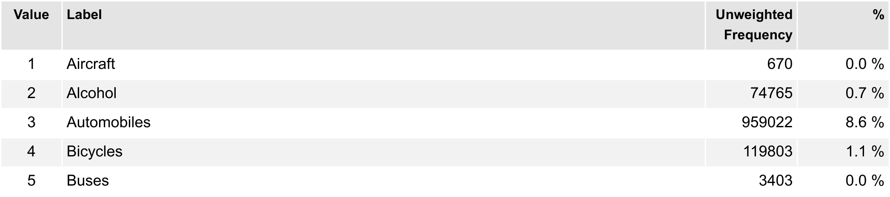


|                               | Unweighted Frequency |       %       |
|-------------------------------|----------------------|---------------|
| 6  Clothes/furs               | 316037               | 2.8 %         |
| 7  Computer hardware/software | 161710               | 1.4 %         |
| 8  Consumable goods           | 211190               | 1.9 %         |
| 9  Credit/debit cards         | 252196               | 2.3 %         |
| 10 Drugs/narcotics            | 873011               | 7.8 %         |
| 11 Drug/narcotic equip.       | 125432               | 1.1 %         |
| 12 Farm equipment             | 9529                 | 0.1 %         |
| 13 Firearms                   | 143257               | 1.3 %         |
| 14 Gambling equipment         | 4549                 | 0.0 %         |
| 15 Heavy construction/industrial equipment | 26034 | 0.2 %         |
| 16 Household goods            | 192286               | 1.7 %         |
| 17 Jewelry/precious metals/gems | 80347               | 0.7 %         |
| 18 Livestock                  | 2462                 | 0.0 %         |
| 19 Merchandise                | 255769               | 2.3 %         |
| 20 Money                      | 608411               | 5.4 %         |
| 21 Negotiable instruments     | 71581                | 0.6 %         |
| 22 Nonnegotiable instruments  | 26916                | 0.2 %         |
| 23 Office-type equipment      | 32650                | 0.3 %         |
| 24 Other motor vehicles       | 69626                | 0.6 %         |
| 25 Purses/handbags/wallets    | 96935                | 0.9 %         |
| 26 Radios/tvs/vcrs/dvd players | 75666                | 0.7 %         |
| 27 Recordings-audio/visual    | 9096                 | 0.1 %         |
| 28 Recreational vehicles      | 14077                | 0.1 %         |
| 29 Structures-single occupancy dwellings | 72461     | 0.6 %         |
| 30 Structures-other dwellings | 34633                | 0.3 %         |
| 31 Structures-commercial/business | 46988           | 0.4 %         |
| 32 Structures-industrial/manufacturing | 2230        | 0.0 %         |
| 33 Structures-public/community | 20108               | 0.2 %         |
| 34 Structures-storage          | 8493                | 0.1 %         |
| 35 Structures-other            | 55225               | 0.5 %         |
| 36 Tools-power/hand            | 190211               | 1.7 %         |
| 37 Trucks                     | 117179               | 1.0 %         |
| 38 Vehicle parts/accessories  | 611955               | 5.5 %         |
| 39 Watercraft                 | 3742                 | 0.0 %         |
| 41 Aircraft parts/accessories | 906                  | 0.0 %         |
| 42 Artistic supplies/accessories | 2905              | 0.0 %         |
| 43 Building materials         | 91434                | 0.8 %         |
| 44 Camping/hunting/fishing equipment/supplies | 11610 | 0.1 %       |
| 45 Chemicals                  | 2650                 | 0.0 %         |


<div style="page-break-after: always;"></div>

### V30072: PROPERTY DESCRIPTION - 2

|   | Unweighted Frequency | % |
|---|-----------------------|---|
| 46 | Collections/collectibles | 7575 | 0.1 % |
| 47 | Crops | 2399 | 0.0 % |
| 48 | Documents/personal or business | 45971 | 0.4 % |
| 49 | Explosives | 1106 | 0.0 % |
| 59 | Firearm accessories | 3299 | 0.0 % |
| 64 | Fuel | 22909 | 0.2 % |
| -  | Missing Data | - | 31.1 % |
| - | Total | 11,207,634 | 100% |

Please note that only the first 50 response categories are displayed in the PDF codebook. To view all response categories, please analyze the data file in the statistical package of your choice (SAS, SPSS, Stata, R).

Based upon 7,724,039 valid cases out of 11,207,634 total cases.

- Minimum: 1.00
- Maximum: 99.00

Location: 442-443 (width: 2; decimal: 0)  
Variable Type: numeric  
(Range of) Missing Values: -9, -8, -7, -6, -5, .

---

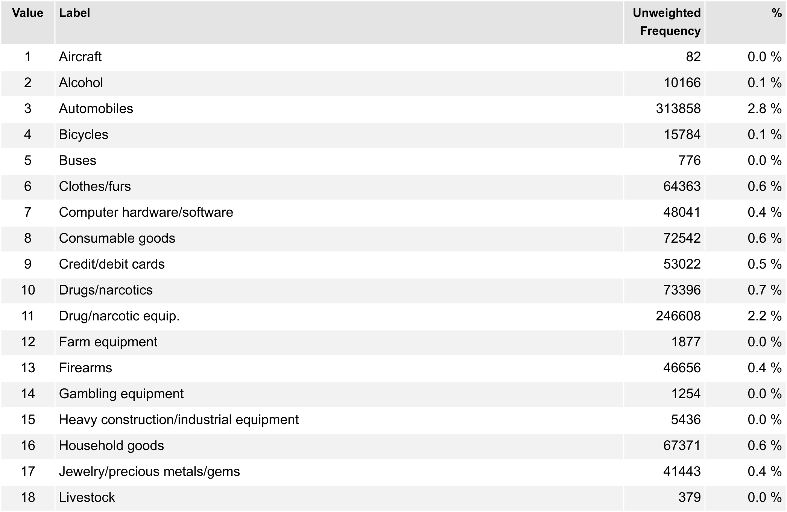


|                       | Unweighted     | % |
|-----------------------|----------------|---|
| 19  Merchandise       | 101780         | 0.9 % |
| 20  Money             | 196177         | 1.8 % |
| 21  Negotiable instruments | 15183     | 0.1 % |
| 22  Nonnegotiable instruments | 8977  | 0.1 % |
| 23  Office-type equipment | 17856      | 0.2 % |
| 24  Other motor vehicles | 22900       | 0.2 % |
| 25  Purses/handbags/wallets | 128666  | 1.1 % |
| 26  Radios/tvs/vcrs/dvd players | 45910 | 0.4 % |
| 27  Recordings-audio/visual | 5710     | 0.1 % |
| 28  Recreational vehicles | 4277       | 0.0 % |
| 29  Structures-single occupancy dwellings | 11292 | 0.1 % |
| 30  Structures-other dwellings | 4974   | 0.0 % |
| 31  Structures-commercial/business | 6112 | 0.1 % |
| 32  Structures-industrial/manufacturing | 329 | 0.0 % |
| 33  Structures-public/community | 1163  | 0.0 % |
| 34  Structures-storage | 1655           | 0.0 % |
| 35  Structures-other | 6389            | 0.1 % |
| 36  Tools-power/hand | 84243           | 0.8 % |
| 37  Trucks | 52634                    | 0.5 % |
| 38  Vehicle parts/accessories | 138057 | 1.2 % |
| 39  Watercraft | 1061                 | 0.0 % |
| 41  Aircraft parts/accessories | 360  | 0.0 % |
| 42  Artistic supplies/accessories | 1892 | 0.0 % |
| 43  Building materials | 17818         | 0.2 % |
| 44  Camping/hunting/fishing equipment/supplies | 8337 | 0.1 % |
| 45  Chemicals | 1693                  | 0.0 % |
| 46  Collections/collectibles | 4864   | 0.0 % |
| 47  Crops | 436                       | 0.0 % |
| 48  Documents/personal or business | 22459 | 0.2 % |
| 49  Explosives | 1721                 | 0.0 % |
| 59  Firearm accessories | 7855        | 0.1 % |
| 64  Fuel | 6004                       | 0.1 % |

**Missing Data**

|        |               |     |
|--------|---------------|-----|
|        | 8690163       | 77.5 % |

**Total**

|            |               |        |
|------------|---------------|--------|
| 11,207,634 |               | 100%   |

Please note that only the first 50 response categories are displayed in the PDF codebook. To view all response categories, please analyze the data file in the statistical package of your choice (SAS, SPSS, Stata, R).

Based upon 2,517,471 valid cases out of 11,207,634 total cases.


• Minimum: 1.00
• Maximum: 99.00

Location: 444-445 (width: 2; decimal: 0)
Variable Type: numeric
(Range of) Missing Values: -9, -8, -7, -6, -5, .

### V30073: PROPERTY DESCRIPTION - 3

|                          | Unweighted Frequency | %     |
|--------------------------|----------------------|-------|
| 1     | Aircraft                          | 17                   | 0.0 % |
| 2     | Alcohol                           | 2466                 | 0.0 % |
| 3     | Automobiles                       | 23541                | 0.2 % |
| 4     | Bicycles                          | 1956                 | 0.0 % |
| 5     | Buses                             | 74                   | 0.0 % |
| 6     | Clothes/furs                      | 22229                | 0.2 % |
| 7     | Computer hardware/software        | 12159                | 0.1 % |
| 8     | Consumable goods                  | 15130                | 0.1 % |
| 9     | Credit/debit cards                | 17837                | 0.2 % |
| 10    | Drugs/narcotics                   | 10416                | 0.1 % |
| 11    | Drug/narcotic equip.              | 19887                | 0.2 % |
| 12    | Farm equipment                    | 444                  | 0.0 % |
| 13    | Firearms                          | 16320                | 0.1 % |
| 14    | Gambling equipment                | 344                  | 0.0 % |
| 15    | Heavy construction/industrial equipment | 1385          | 0.0 % |
| 16    | Household goods                   | 21618                | 0.2 % |
| 17    | Jewelry/precious metals/gems      | 18566                | 0.2 % |
| 18    | Livestock                         | 75                   | 0.0 % |
| 19    | Merchandise                       | 15082                | 0.1 % |
| 20    | Money                             | 61081                | 0.5 % |
| 21    | Negotiable instruments            | 5981                 | 0.1 % |
| 22    | Nonnegotiable instruments         | 5463                 | 0.0 % |
| 23    | Office-type equipment             | 9307                 | 0.1 % |
| 24    | Other motor vehicles              | 3614                 | 0.0 % |
| 25    | Purses/handbags/wallets           | 106694               | 1.0 % |
| 26    | Radios/tvs/vcrs/dvd players       | 26050                | 0.2 % |
| 27    | Recordings-audio/visual           | 3485                 | 0.0 % |
| 28    | Recreational vehicles             | 874                  | 0.0 % |
| 29    | Structures-single occupancy dwellings | 1068            | 0.0 % |
| 30    | Structures-other dwellings        | 568                  | 0.0 % |
| 31    | Structures-commercial/business    | 490                  | 0.0 % |
| 32    | Structures-industrial/manufacturing| 50                  | 0.0 % |
| 33    | Structures-public/community       | 140                  | 0.0 % |

- 118 -


### 121_0.png

|                                        | Unweighted Frequency | %      |
|----------------------------------------|----------------------|--------|
| 34  Structures-storage                  | 208                  | 0.0 %  |
| 35  Structures-other                    | 818                  | 0.0 %  |
| 36  Tools-power/hand                    | 36490                | 0.3 %  |
| 37  Trucks                              | 8853                 | 0.1 %  |
| 38  Vehicle parts/accessories           | 39880                | 0.4 %  |
| 39  Watercraft                          | 405                  | 0.0 %  |
| 41  Aircraft parts/accessories          | 130                  | 0.0 %  |
| 42  Artistic supplies/accessories       | 1238                 | 0.0 %  |
| 43  Building materials                  | 4397                 | 0.0 %  |
| 44  Camping/hunting/fishing equipment/supplies | 5057 | 0.0 %  |
| 45  Chemicals                           | 878                  | 0.0 %  |
| 46  Collections/collectibles            | 3256                 | 0.0 %  |
| 47  Crops                               | 107                  | 0.0 %  |
| 48  Documents/personal or business      | 18754                | 0.2 %  |
| 49  Explosives                          | 1340                 | 0.0 %  |
| 59  Firearm accessories                 | 5621                 | 0.1 %  |
| 64  Fuel                                | 1560                 | 0.0 %  |
| Missing Data                            | 10380787             | 92.6 % |
| .                                       | .                    | .      |
| .                                       | .                    | .      |
| Total                                   | 11,207,634           | 100%   |

Please note that only the first 50 response categories are displayed in the PDF codebook. To view all response categories, please analyze the data file in the statistical package of your choice (SAS, SPSS, Stata, R).

Based upon 826,847 valid cases out of 11,207,634 total cases.

- Minimum: 1.00
- Maximum: 99.00

**Location:** 446-447 (width: 2; decimal: 0)  
**Variable Type:** numeric  
*(Range of) Missing Values:* -9, -8, -7, -6, -5, .

---

## V30081: VALUE OF PROPERTY - 1

### 121_1.png

|                                        | Unweighted Frequency | %      |
|----------------------------------------|----------------------|--------|
| -9  Undetermined                        | -                    | -      |
| -8  NA LT 3 records                     | -                    | -      |
| -7  Unknown/missing/DNR                 | -                    | -      |
| -6  Not Applicable                      | -                    | -      |
| -5  NA Window/Grp B Record              | -                    | -      |
| Total                                   | 11,207,634           | 100%   |


Based upon 6,861,382 valid cases out of 11,207,634 total cases.

- Mean: 101782.31
- Minimum: 0.00
- Maximum: 999999999.00
- Standard Deviation: 9887886.27

*Location: 448-456 (width: 9; decimal: 0)*
*Variable Type: numeric*
*(Range of) Missing Values: -9, -8, -7, -6, -5*

### V30082: VALUE OF PROPERTY - 2

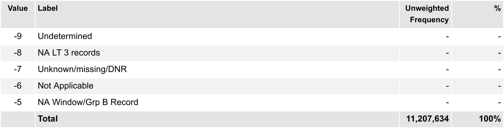

Based upon 2,447,152 valid cases out of 11,207,634 total cases.

- Mean: 63079.22
- Minimum: 0.00
- Maximum: 999999999.00
- Standard Deviation: 7729287.30

*Location: 457-465 (width: 9; decimal: 0)*
*Variable Type: numeric*
*(Range of) Missing Values: -9, -8, -7, -6, -5*

### V30083: VALUE OF PROPERTY - 3

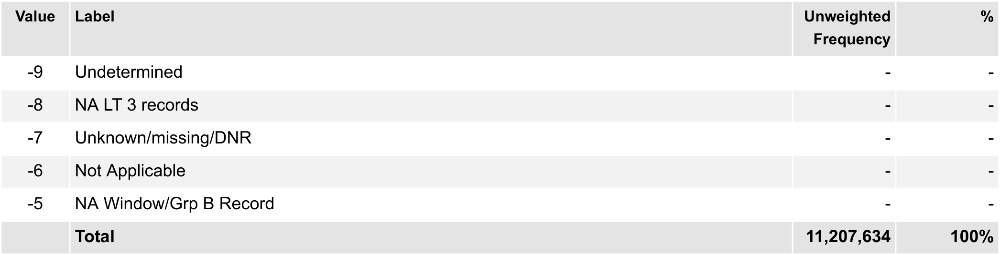

Based upon 814,733 valid cases out of 11,207,634 total cases.

- Mean: 62006.26
- Minimum: 0.00
- Maximum: 999999999.00
- Standard Deviation: 7755515.92

*Location: 466-474 (width: 9; decimal: 0)*
*Variable Type: numeric*


(Range of) Missing Values: -9, -8, -7, -6, -5

# V30091: DATE RECOVERED - 1

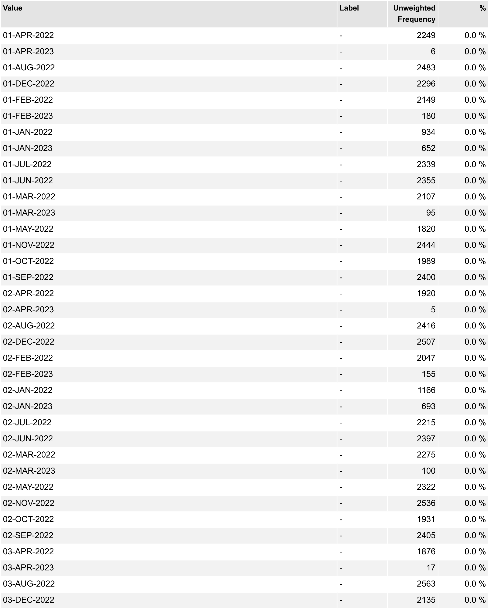

| Label      | Unweighted Frequency | %    |
|------------|----------------------|------|
| 01-APR-2022 | -                    | 2249 | 0.0 % |
| 01-APR-2023 | -                    | 6    | 0.0 % |
| 01-AUG-2022 | -                    | 2483 | 0.0 % |
| 01-DEC-2022 | -                    | 2296 | 0.0 % |
| 01-FEB-2022 | -                    | 2149 | 0.0 % |
| 01-FEB-2023 | -                    | 180  | 0.0 % |
| 01-JAN-2022 | -                    | 934  | 0.0 % |
| 01-JAN-2023 | -                    | 652  | 0.0 % |
| 01-JUL-2022 | -                    | 2339 | 0.0 % |
| 01-JUN-2022 | -                    | 2355 | 0.0 % |
| 01-MAR-2022 | -                    | 2107 | 0.0 % |
| 01-MAR-2023 | -                    | 95   | 0.0 % |
| 01-MAY-2022 | -                    | 1820 | 0.0 % |
| 01-NOV-2022 | -                    | 2444 | 0.0 % |
| 01-OCT-2022 | -                    | 1989 | 0.0 % |
| 01-SEP-2022 | -                    | 2400 | 0.0 % |
| 02-APR-2022 | -                    | 1920 | 0.0 % |
| 02-APR-2023 | -                    | 5    | 0.0 % |
| 02-AUG-2022 | -                    | 2416 | 0.0 % |
| 02-DEC-2022 | -                    | 2507 | 0.0 % |
| 02-FEB-2022 | -                    | 2047 | 0.0 % |
| 02-FEB-2023 | -                    | 155  | 0.0 % |
| 02-JAN-2022 | -                    | 1166 | 0.0 % |
| 02-JAN-2023 | -                    | 693  | 0.0 % |
| 02-JUL-2022 | -                    | 2215 | 0.0 % |
| 02-JUN-2022 | -                    | 2397 | 0.0 % |
| 02-MAR-2022 | -                    | 2275 | 0.0 % |
| 02-MAR-2023 | -                    | 100  | 0.0 % |
| 02-MAY-2022 | -                    | 2322 | 0.0 % |
| 02-NOV-2022 | -                    | 2536 | 0.0 % |
| 02-OCT-2022 | -                    | 1931 | 0.0 % |
| 02-SEP-2022 | -                    | 2405 | 0.0 % |
| 03-APR-2022 | -                    | 1876 | 0.0 % |
| 03-APR-2023 | -                    | 17   | 0.0 % |
| 03-AUG-2022 | -                    | 2563 | 0.0 % |
| 03-DEC-2022 | -                    | 2135 | 0.0 % |


#### 03-FEB-2022
Label | Unweighted Frequency | %
------| ---------------------| ---
-     | 1922                | 0.0 %

#### 03-FEB-2023
Label | Unweighted Frequency | %
------| ---------------------| ---
-     | 160                 | 0.0 %

#### 03-JAN-2022
Label | Unweighted Frequency | %
------| ---------------------| ---
-     | 1337                | 0.0 %

#### 03-JAN-2023
Label | Unweighted Frequency | %
------| ---------------------| ---
-     | 826                 | 0.0 %

#### 03-JUL-2022
Label | Unweighted Frequency | %
------| ---------------------| ---
-     | 1924                | 0.0 %

#### 03-JUN-2022
Label | Unweighted Frequency | %
------| ---------------------| ---
-     | 2349                | 0.0 %

#### 03-MAR-2022
Label | Unweighted Frequency | %
------| ---------------------| ---
-     | 2324                | 0.0 %

#### 03-MAR-2023
Label | Unweighted Frequency | %
------| ---------------------| ---
-     | 76                  | 0.0 %

#### 03-MAY-2022
Label | Unweighted Frequency | %
------| ---------------------| ---
-     | 2354                | 0.0 %

#### 03-NOV-2022
Label | Unweighted Frequency | %
------| ---------------------| ---
-     | 2578                | 0.0 %

#### 03-OCT-2022
Label | Unweighted Frequency | %
------| ---------------------| ---
-     | 2438                | 0.0 %

#### 03-SEP-2022
Label | Unweighted Frequency | %
------| ---------------------| ---
-     | 2141                | 0.0 %

#### 04-APR-2022
Label | Unweighted Frequency | %
------| ---------------------| ---
-     | 2373                | 0.0 %

#### 04-APR-2023
Label | Unweighted Frequency | %
------| ---------------------| ---
-     | 18                  | 0.0 %

#### Missing Data
Label | Unweighted Frequency | %
------| ---------------------| ---
-     | 10335154            | 92.2 %

#### Total
Label | Unweighted Frequency | %
------| ---------------------| ---
-     | 11,207,634          | 100%


Please note that only the first 50 response categories are displayed in the PDF codebook. To view all response categories, please analyze the data file in the statistical package of your choice (SAS, SPSS, Stata, R).

Based upon 872,480 valid cases out of 11,207,634 total cases.

Location: 475-485 (width: 11; decimal: 0)  
Variable Type: character  
(Range of) Missing Values:

#### V30092: DATE RECOVERED - 2
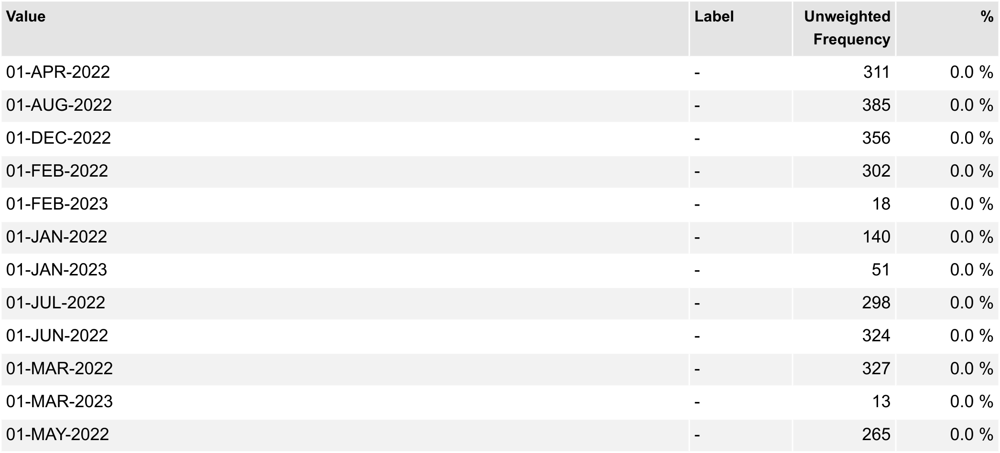


|                  | Label | Unweighted Frequency | %   |
|------------------|-------|----------------------|-----|
| 01-NOV-2022      | -     | 323                  | 0.0%|
| 01-OCT-2022      | -     | 286                  | 0.0%|
| 01-SEP-2022      | -     | 312                  | 0.0%|
| 02-APR-2022      | -     | 276                  | 0.0%|
| 02-AUG-2022      | -     | 350                  | 0.0%|
| 02-DEC-2022      | -     | 338                  | 0.0%|
| 02-FEB-2022      | -     | 307                  | 0.0%|
| 02-FEB-2023      | -     | 17                   | 0.0%|
| 02-JAN-2022      | -     | 197                  | 0.0%|
| 02-JAN-2023      | -     | 51                   | 0.0%|
| 02-JUL-2022      | -     | 357                  | 0.0%|
| 02-JUN-2022      | -     | 340                  | 0.0%|
| 02-MAR-2022      | -     | 361                  | 0.0%|
| 02-MAR-2023      | -     | 15                   | 0.0%|
| 02-MAY-2022      | -     | 353                  | 0.0%|
| 02-NOV-2022      | -     | 332                  | 0.0%|
| 02-OCT-2022      | -     | 265                  | 0.0%|
| 02-SEP-2022      | -     | 363                  | 0.0%|
| 03-APR-2022      | -     | 304                  | 0.0%|
| 03-APR-2023      | -     | 2                    | 0.0%|
| 03-AUG-2022      | -     | 350                  | 0.0%|
| 03-DEC-2022      | -     | 298                  | 0.0%|
| 03-FEB-2022      | -     | 276                  | 0.0%|
| 03-FEB-2023      | -     | 19                   | 0.0%|
| 03-JAN-2022      | -     | 205                  | 0.0%|
| 03-JAN-2023      | -     | 73                   | 0.0%|
| 03-JUL-2022      | -     | 264                  | 0.0%|
| 03-JUN-2022      | -     | 350                  | 0.0%|
| 03-MAR-2022      | -     | 337                  | 0.0%|
| 03-MAR-2023      | -     | 4                    | 0.0%|
| 03-MAY-2022      | -     | 356                  | 0.0%|
| 03-NOV-2022      | -     | 346                  | 0.0%|
| 03-OCT-2022      | -     | 339                  | 0.0%|
| 03-SEP-2022      | -     | 300                  | 0.0%|
| 04-APR-2022      | -     | 334                  | 0.0%|
| 04-APR-2023      | -     | 4                    | 0.0%|
| 04-AUG-2022      | -     | 337                  | 0.0%|
| 04-DEC-2022      | -     | 291                  | 0.0%|


Please note that only the first 50 response categories are displayed in the PDF codebook. To view all response categories, please analyze the data file in the statistical package of your choice (SAS, SPSS, Stata, R).

Based upon 122,309 valid cases out of 11,207,634 total cases.

Location: 486-496 (width: 11; decimal: 0)  
Variable Type: character  
(Range of) Missing Values:

V300093: DATE RECOVERED - 3

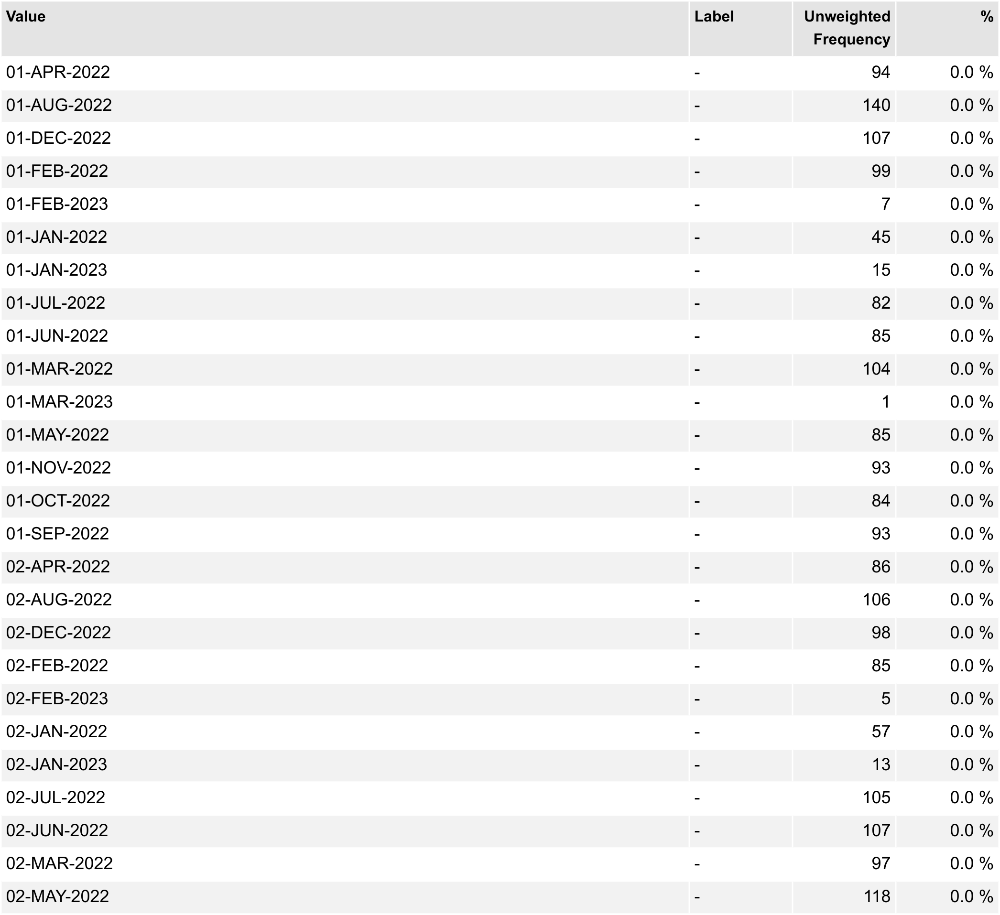


| Label      | Unweighted Frequency | %    |
|------------|----------------------|------|
| 02-NOV-2022| -                    | 93   | 0.0 % |
| 02-OCT-2022| -                    | 76   | 0.0 % |
| 02-SEP-2022| -                    | 99   | 0.0 % |
| 03-APR-2022| -                    | 110  | 0.0 % |
| 03-AUG-2022| -                    | 98   | 0.0 % |
| 03-DEC-2022| -                    | 99   | 0.0 % |
| 03-FEB-2022| -                    | 88   | 0.0 % |
| 03-FEB-2023| -                    | 5    | 0.0 % |
| 03-JAN-2022| -                    | 65   | 0.0 % |
| 03-JAN-2023| -                    | 16   | 0.0 % |
| 03-JUL-2022| -                    | 74   | 0.0 % |
| 03-JUN-2022| -                    | 107  | 0.0 % |
| 03-MAR-2022| -                    | 96   | 0.0 % |
| 03-MAY-2022| -                    | 99   | 0.0 % |
| 03-NOV-2022| -                    | 106  | 0.0 % |
| 03-OCT-2022| -                    | 77   | 0.0 % |
| 03-SEP-2022| -                    | 84   | 0.0 % |
| 04-APR-2022| -                    | 93   | 0.0 % |
| 04-AUG-2022| -                    | 84   | 0.0 % |
| 04-DEC-2022| -                    | 86   | 0.0 % |
| 04-FEB-2022| -                    | 99   | 0.0 % |
| 04-JAN-2022| -                    | 72   | 0.0 % |
| 04-JAN-2023| -                    | 19   | 0.0 % |
| 04-JUL-2022| -                    | 78   | 0.0 % |

|            |                      |         |
|:-----------|:---------------------|:--------|
| Missing Data        |   -     | 11171185 | 99.7 % |

| Total        | 11,207,634 | 100%   |

Please note that only the first 50 response categories are displayed in the PDF codebook. To view all response categories, please analyze the data file in the statistical package of your choice (SAS, SPSS, Stata, R).

Based upon 36,449 valid cases out of 11,207,634 total cases.

Location: 497-507 (width: 11; decimal: 0)  
Variable type: character  
(Range of) missing values:

---

### V30101: NUMBER OF STOLEN MOTOR VEHICLES - 1

|            | Unweighted Frequency | %    |
|------------|----------------------|------|
| 0          | -                    | 427  | 0.0 % |
| 1          | -                    | 298354 | 2.7 % |


|     | Unweighted Frequency |     |
|-----|----------------------|-----|
| 2   | 5621                 | 0.1 % |
| 3   | 632                  | 0.0 % |
| 4   | 253                  | 0.0 % |
| 5   | 68                   | 0.0 % |
| 6   | 42                   | 0.0 % |
| 7   | 15                   | 0.0 % |
| 8   | 16                   | 0.0 % |
| 9   | 4                    | 0.0 % |
| 10  | 4                    | 0.0 % |
| 11  | 3                    | 0.0 % |
| 12  | 2                    | 0.0 % |
| 13  | 3                    | 0.0 % |
| 14  | 2                    | 0.0 % |
| 15  | 2                    | 0.0 % |
| 16  | 2                    | 0.0 % |
| 17  | 1                    | 0.0 % |
| 18  | 2                    | 0.0 % |
| 19  | 2                    | 0.0 % |
| 20  | 4                    | 0.0 % |
| 21  | 1                    | 0.0 % |
| 24  | 2                    | 0.0 % |
| 25  | 1                    | 0.0 % |
| 26  | 1                    | 0.0 % |
| 27  | 1                    | 0.0 % |
| 30  | 3                    | 0.0 % |
| 32  | 1                    | 0.0 % |
| 37  | 3                    | 0.0 % |
| 50  | 1                    | 0.0 % |
| 99  | 1                    | 0.0 % |


|        |                       |       |
|--------|-----------------------|-------|
|        | Missing Data          |       |
|        |                       |       |
|        | .                     |       |
|        | Total                 | 100%  |
|        |                       |       |
|        | 11,207,634            |       |
|        | 100%                  |       |

Based upon 305,474 valid cases out of 11,207,634 total cases.

- Mean: 1.03
- Median: 1.00
- Mode: 1.00
- Minimum: 0.00
- Maximum: 99.00
- Standard Deviation: 0.37


**Location:** 508-509 (width: 2; decimal: 0)  
**Variable Type:** numeric  
**Range of Missing Values:** -9, -8, -7, -6, -5

## V30102: NUMBER OF STOLEN MOTOR VEHICLES - 2

|     | Unweighted Frequency | %       |
|-----|----------------------|---------|
| 0   |                   66 | 0.0 %   |
| 1   |               328481 | 2.9 %   |
| 2   |                 8072 | 0.1 %   |
| 3   |                  697 | 0.0 %   |
| 4   |                  326 | 0.0 %   |
| 5   |                   89 | 0.0 %   |
| 6   |                   66 | 0.0 %   |
| 7   |                   23 | 0.0 %   |
| 8   |                   17 | 0.0 %   |
| 9   |                    8 | 0.0 %   |
| 10  |                    9 | 0.0 %   |
| 11  |                    3 | 0.0 %   |
| 12  |                    5 | 0.0 %   |
| 13  |                    2 | 0.0 %   |
| 14  |                    1 | 0.0 %   |
| 15  |                    1 | 0.0 %   |
| 16  |                    1 | 0.0 %   |
| 17  |                    3 | 0.0 %   |
| 18  |                    2 | 0.0 %   |
| 19  |                    2 | 0.0 %   |
| 20  |                    1 | 0.0 %   |
| 21  |                    1 | 0.0 %   |
| 22  |                    1 | 0.0 %   |
| 24  |                    1 | 0.0 %   |
| 25  |                    3 | 0.0 %   |
| 28  |                    2 | 0.0 %   |
| 30  |                    1 | 0.0 %   |
| 32  |                    1 | 0.0 %   |
| 34  |                    1 | 0.0 %   |
| 35  |                    1 | 0.0 %   |
| 37  |                    1 | 0.0 %   |
| **Missing Data** |           **10869746** | **97.0 %** |
| .   |                      |         |
| **Total**          |       **11,207,634** | **100%** |


Based upon 337,888 valid cases out of 11,207,634 total cases.

- Mean: 1.04
- Median: 1.00
- Mode: 1.00
- Minimum: 0.00
- Maximum: 37.00
- Standard Deviation: 0.31

*Location*: 510-511 (width: 2, decimal: 0)

*Variable Type*: numeric

*(Range of) Missing Values*: -9, -8, -7, -6, -5, .

### V30103: NUMBER OF STOLEN MOTOR VEHICLES - 3

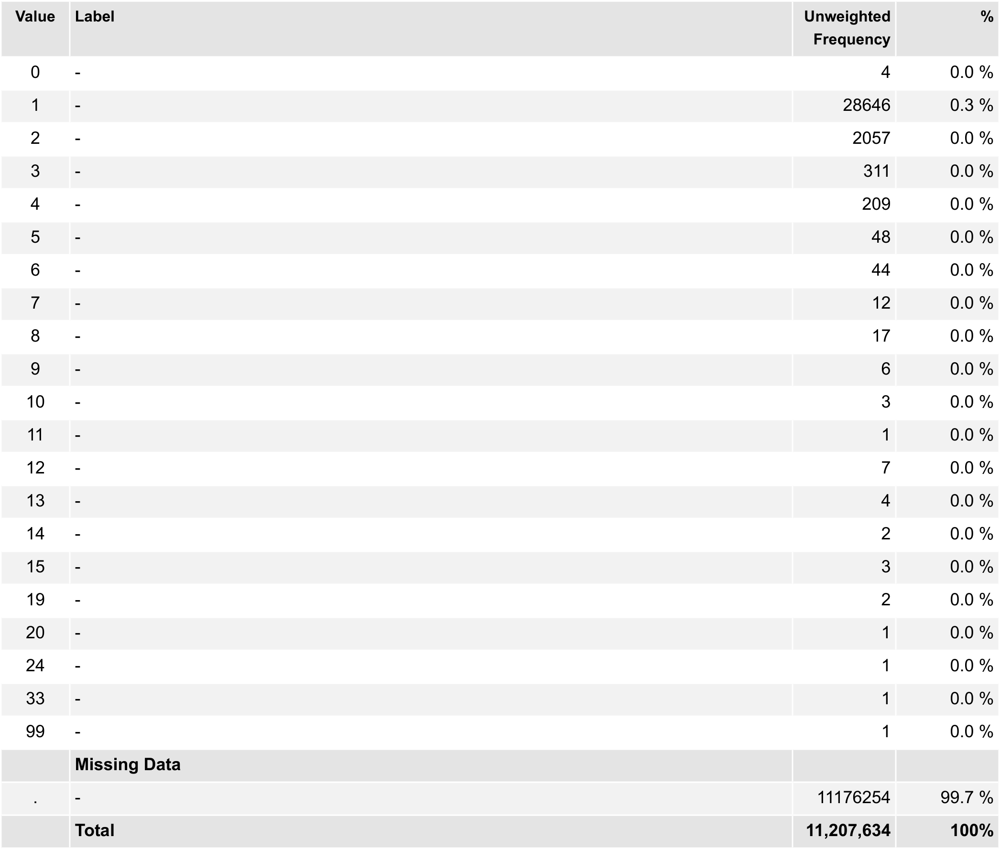

|   | Unweighted Frequency | %    |
|---|----------------------|------|
| 0 | 4                    | 0.0% |
| 1 | 28646                | 0.3% |
| 2 | 2057                 | 0.0% |
| 3 | 311                  | 0.0% |
| 4 | 209                  | 0.0% |
| 5 | 48                   | 0.0% |
| 6 | 44                   | 0.0% |
| 7 | 12                   | 0.0% |
| 8 | 17                   | 0.0% |
| 9 | 6                    | 0.0% |
| 10| 3                    | 0.0% |
| 11| 1                    | 0.0% |
| 12| 7                    | 0.0% |
| 13| 4                    | 0.0% |
| 14| 2                    | 0.0% |
| 15| 3                    | 0.0% |
| 19| 2                    | 0.0% |
| 20| 1                    | 0.0% |
| 24| 1                    | 0.0% |
| 33| 1                    | 0.0% |
| 99| 1                    | 0.0% |

- Missing Data
  - . 11176254 99.7%
  
- Total 11,207,634 100%

Based upon 31,380 valid cases out of 11,207,634 total cases.

- Mean: 1.14
- Median: 1.00
- Mode: 1.00


• Minimum: 0.00
• Maximum: 99.00
• Standard Deviation: 0.86

_Location: 512-513 (width: 2; decimal: 0)_
_Variable Type: numeric_
_(Range of) Missing Values: -9, -8, -7, -6, -5, ._

# V30111: NUMBER OF RECOVERED MOTOR VEHICLES - 1


Based upon 350,869 valid cases out of 11,207,634 total cases.

• Mean: 1.01
• Median: 1.00
• Mode: 1.00
• Minimum: 0.00
• Maximum: 37.00
• Standard Deviation: 0.19

_Location: 514-515 (width: 2; decimal: 0)_
_Variable Type: numeric_
_(Range of) Missing Values: -9, -8, -7, -6, -5, ._


# V30112: NUMBER OF RECOVERED MOTOR VEHICLES - 2

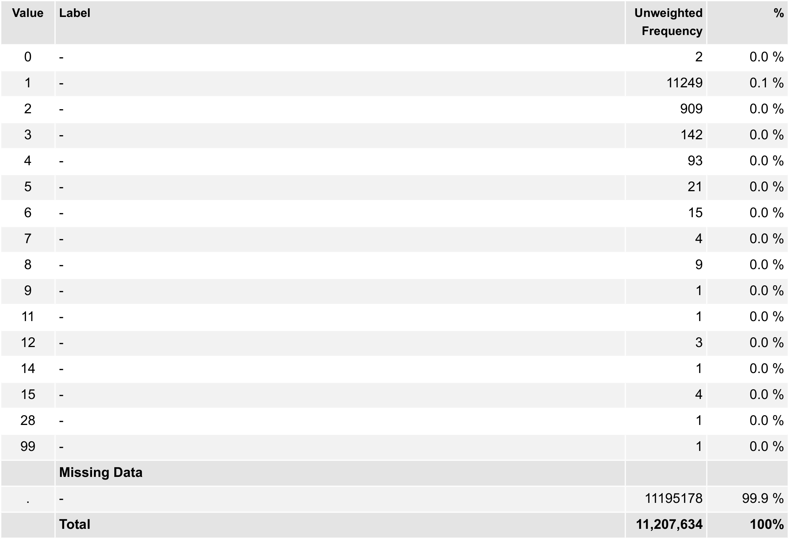

Based upon 12,456 valid cases out of 11,207,634 total cases.

- Mean: 1.16
- Median: 1.00
- Mode: 1.00
- Minimum: 0.00
- Maximum: 99.00
- Standard Deviation: 1.10

Location: 516-517 (width: 2; decimal: 0)  
Variable Type: numeric  
(Range of) Missing Values: -9, -8, -7, -6, -5, .

---

# V30113: NUMBER OF RECOVERED MOTOR VEHICLES - 3

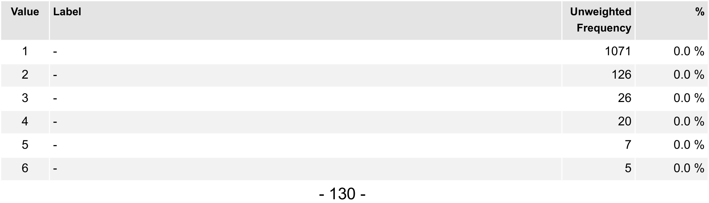


|   | Unweighted Frequency | %     |
|---|----------------------|-------|
| 7 | 2                    | 0.0 % |
| 8 | 2                    | 0.0 % |
| 12| 1                    | 0.0 % |
| 15| 3                    | 0.0 % |
| 16| 1                    | 0.0 % |
| 22| 1                    | 0.0 % |

**Missing Data**

| . | 11206369 | 100.0 % |

**Total**

| 11,207,634 | 100% |

Based upon 1,265 valid cases out of 11,207,634 total cases.

- Mean: 1.32
- Median: 1.00
- Mode: 1.00
- Minimum: 1.00
- Maximum: 22.00
- Standard Deviation: 1.28

Location: 518-519 (width: 2; decimal: 0)  
Variable Type: numeric  
(Range of) Missing Values: -9, -8 , -7, -6, -5, .

---

### V30121: SUSPECTED DRUG TYPE 1 - 1

|   | Unweighted Frequency | %     |
|---|----------------------|-------|
| 1 | Crack Cocaine        | 42736 | 0.4 % |
| 2 | Cocaine (all forms except Crack) | 50119 | 0.4 % |
| 3 | Hashish              | 4328  | 0.0 % |
| 4 | Heroin               | 43389 | 0.4 % |
| 5 | Marijuana            | 384770| 3.4 % |
| 6 | Morphine             | 809   | 0.0 % |
| 7 | Opium                | 7521  | 0.1 % |
| 8 | Other Narcotics      | 50725 | 0.5 % |
| 9 | LSD                  | 992   | 0.0 % |
| 10| PCP                  | 1206  | 0.0 % |
| 11| Other Hallucinogens  | 6466  | 0.1 % |
| 12| Amphetamines/Methamphetamines | 194701 | 1.7 % |
| 13| Other Stimulants     | 2900  | 0.0 % |
| 14| Barbiturates         | 1146  | 0.0 % |
| 15| Other Depressants    | 4855  | 0.0 % |
| 16| Other Drugs: Antidepressants | 34400 | 0.3 % |
| 93| Over 3 Drug Types    | 0     | 0.0 % |


### 134_0.png

|                      | Unweighted Frequency | %       |
|----------------------|----------------------|---------|
| **Missing Data**     |                      |         |
| -7 Unknown/missing/DNR | 18399                | 0.2 %   |
| . -                  | 10358172             | 92.4 %  |
| **Total**            | **11,207,634**       | **100%**|

Based upon 831,063 valid cases out of 11,207,634 total cases.

- Minimum: 1.00
- Maximum: 16.00

Location: 520-521 (width: 2; decimal: 0)\
Variable Type: numeric\
(Range of) Missing Values: -9, -8, -7, -6, -5, .


### V30122: SUSPECTED DRUG TYPE 1 - 2

### 134_1.png

|                                     | Unweighted Frequency | %       |
|-------------------------------------|----------------------|---------|
| 1. Crack Cocaine                    | 15892                | 0.1 %   |
| 2. Cocaine (all forms except Crack) | 16461                | 0.1 %   |
| 3. Hashish                          | 2193                 | 0.0 %   |
| 4. Heroin                           | 19413                | 0.2 %   |
| 5. Marijuana                        | 141729               | 1.3 %   |
| 6. Morphine                         | 335                  | 0.0 %   |
| 7. Opium                            | 3306                 | 0.0 %   |
| 8. Other Narcotics                  | 22483                | 0.2 %   |
| 9. LSD                              | 339                  | 0.0 %   |
| 10. PCP                             | 242                  | 0.0 %   |
| 11. Other Hallucinogens             | 1830                 | 0.0 %   |
| 12. Amphetamines/Methamphetamines   | 87527                | 0.8 %   |
| 13. Other Stimulants                | 907                  | 0.0 %   |
| 14. Barbiturates                    | 343                  | 0.0 %   |
| 15. Other Depressants               | 1538                 | 0.0 %   |
| 16. Other Drugs: Antidepressants    | 10774                | 0.1 %   |
| 93. Over 3 Drug Types               | 0                    | 0.0 %   |
| **Missing Data**                    |                      |         |
| -7. Unknown/missing/DNR             | 6549                 | 0.1 %   |
| . -                                 | 10875773             | 97.0 %  |
| **Total**                           | **11,207,634**       | **100%**|

Based upon 325,312 valid cases out of 11,207,634 total cases.

- Minimum: 1.00
- Maximum: 16.00


_V30123: SUSPECTED DRUG TYPE 1 - 3_

|                       | Unweighted Frequency | %        |
|-----------------------|----------------------|----------|
| **1** Crack Cocaine          | 3709                 | 0.0 %   |
| **2** Cocaine (all forms except Crack) | 3779           | 0.0 %   |
| **3** Hashish                | 284                  | 0.0 %   |
| **4** Heroin                 | 3819                 | 0.0 %   |
| **5** Marijuana              | 20083                | 0.2 %   |
| **6** Morphine               | 78                   | 0.0 %   |
| **7** Opium                  | 668                  | 0.0 %   |
| **8** Other Narcotics        | 3822                 | 0.0 %   |
| **9** LSD                    | 75                   | 0.0 %   |
| **10** PCP                   | 42                   | 0.0 %   |
| **11** Other Hallucinogens   | 316                  | 0.0 %   |
| **12** Amphetamines/Methamphetamines | 13490        | 0.1 %   |
| **13** Other Stimulants      | 136                  | 0.0 %   |
| **14** Barbiturates          | 69                   | 0.0 %   |
| **15** Other Depressants     | 280                  | 0.0 %   |
| **16** Other Drugs: Antidepressants | 1810          | 0.0 %   |
| **93** Over 3 Drug Types     | 0                    | 0.0 %   |
| **Missing Data**             | 1282                 | 0.0 %   |
| **-7** Unknown/missing/DNR   | 11153892             | 99.5 %  |
| **-** Total                  | 11,207,634           | 100%    |

Based upon 52,460 valid cases out of 11,207,634 total cases.

- Minimum: 1.00
- Maximum: 16.00

---

_V30131: ESTIMATED QUANTITY 1 - 1_

|                       | Unweighted Frequency | %        |
|-----------------------|----------------------|----------|
| **-9** Undetermined          | -                    | -        |
| **-8** NA LT 3 records       | -                    | -        |
| **-7** Unknown/missing/DNR   | -                    | -        |
| **-6** Not Applicable        | -                    | -        |


### -5 NA Window/Grp B Record

|                       | Unweighted Frequency | %           |
|-----------------------|----------------------|-------------|
| Total                 | 11,207,634           | 100%        |

Based upon 849,462 valid cases out of 11,207,634 total cases.

- Mean: 1293.07
- Minimum: 0.00
- Maximum: 276916718.00
- Standard Deviation: 381580.01

Location: 526-534 (width: 9; decimal: 0)  
Variable Type: numeric  
(Range of) Missing Values: -9, -8, -7, -6, -5

## V30132: ESTIMATED QUANTITY 1 - 2

| Label | Unweighted Frequency | %     |
|-------|----------------------|-------|
| 0     | 74594                | 0.7 % |
| 1     | 91594                | 0.8 % |
| 2     | 28632                | 0.3 % |
| 3     | 18288                | 0.2 % |
| 4     | 12499                | 0.1 % |
| 5     | 9798                 | 0.1 % |
| 6     | 7406                 | 0.1 % |
| 7     | 6011                 | 0.1 % |
| 8     | 5352                 | 0.0 % |
| 9     | 4229                 | 0.0 % |
| 10    | 5189                 | 0.0 % |
| 11    | 3193                 | 0.0 % |
| 12    | 3650                 | 0.0 % |
| 13    | 3025                 | 0.0 % |
| 14    | 2919                 | 0.0 % |
| 15    | 2676                 | 0.0 % |
| 16    | 2126                 | 0.0 % |
| 17    | 1762                 | 0.0 % |
| 18    | 1767                 | 0.0 % |
| 19    | 1487                 | 0.0 % |
| 20    | 2010                 | 0.0 % |
| 21    | 1349                 | 0.0 % |
| 22    | 1363                 | 0.0 % |
| 23    | 1063                 | 0.0 % |
| 24    | 1246                 | 0.0 % |
| 25    | 1202                 | 0.0 % |


| Label | Unweighted Frequency | %         |
|-------|----------------------|-----------|
| 26    | 1129                 | 0.0 %     |
| 27    | 1051                 | 0.0 %     |
| 28    | 1497                 | 0.0 %     |
| 29    | 966                  | 0.0 %     |
| 30    | 1346                 | 0.0 %     |
| 31    | 763                  | 0.0 %     |
| 32    | 744                  | 0.0 %     |
| 33    | 617                  | 0.0 %     |
| 34    | 578                  | 0.0 %     |
| 35    | 621                  | 0.0 %     |
| 36    | 518                  | 0.0 %     |
| 37    | 488                  | 0.0 %     |
| 38    | 458                  | 0.0 %     |
| 39    | 480                  | 0.0 %     |
| 40    | 701                  | 0.0 %     |
| 41    | 377                  | 0.0 %     |
| 42    | 454                  | 0.0 %     |
| 43    | 373                  | 0.0 %     |
| 44    | 394                  | 0.0 %     |
| 45    | 398                  | 0.0 %     |
| 46    | 317                  | 0.0 %     |
| 47    | 307                  | 0.0 %     |
| 48    | 364                  | 0.0 %     |
| 49    | 270                  | 0.0 %     |
|       |                      |           |
| Missing Data    |         |           |
| .     | 10875773             | 97.0 %    |
| Total | 11,207,634           | 100%      |

Please note that only the first 50 response categories are displayed in the PDF codebook. To view all response categories, please analyze the data file in the statistical package of your choice (SAS, SPSS, Stata, R).

Based upon 331,861 valid cases out of 11,207,634 total cases.

- Mean: 839.34
- Minimum: 0.00
- Maximum: 100000000.00
- Standard Deviation: 193792.61

*Location: 535-543 (width: 9; decimal: 0)*
*Variable Type: numeric*
*(Range of) Missing Values: -9, -8, -7, -6, -5, .*

V30133: ESTIMATED QUANTITY 1 - 3


|       | Label  | Unweighted Frequency | %    |
|-------|--------|----------------------|------|
| 0     | -      | 10510                | 0.1% |
| 1     | -      | 13483                | 0.1% |
| 2     | -      | 4091                 | 0.0% |
| 3     | -      | 2837                 | 0.0% |
| 4     | -      | 2007                 | 0.0% |
| 5     | -      | 1642                 | 0.0% |
| 6     | -      | 1229                 | 0.0% |
| 7     | -      | 1035                 | 0.0% |
| 8     | -      | 832                  | 0.0% |
| 9     | -      | 778                  | 0.0% |
| 10    | -      | 911                  | 0.0% |
| 11    | -      | 539                  | 0.0% |
| 12    | -      | 594                  | 0.0% |
| 13    | -      | 544                  | 0.0% |
| 14    | -      | 506                  | 0.0% |
| 15    | -      | 473                  | 0.0% |
| 16    | -      | 420                  | 0.0% |
| 17    | -      | 309                  | 0.0% |
| 18    | -      | 343                  | 0.0% |
| 19    | -      | 272                  | 0.0% |
| 20    | -      | 380                  | 0.0% |
| 21    | -      | 248                  | 0.0% |
| 22    | -      | 249                  | 0.0% |
| 23    | -      | 210                  | 0.0% |
| 24    | -      | 243                  | 0.0% |
| 25    | -      | 215                  | 0.0% |
| 26    | -      | 202                  | 0.0% |
| 27    | -      | 225                  | 0.0% |
| 28    | -      | 286                  | 0.0% |
| 29    | -      | 204                  | 0.0% |
| 30    | -      | 227                  | 0.0% |
| 31    | -      | 163                  | 0.0% |
| 32    | -      | 141                  | 0.0% |
| 33    | -      | 120                  | 0.0% |
| 34    | -      | 119                  | 0.0% |
| 35    | -      | 137                  | 0.0% |
| 36    | -      | 112                  | 0.0% |
| 37    | -      | 102                  | 0.0% |
| 38    | -      | 97                   | 0.0% |


### 139_0.png

| Label | Unweighted Frequency | % |
|-------|-----------------------|---|
| 39    | 99                    | 0.0 % |
| 40    | 141                   | 0.0 % |
| 41    | 85                    | 0.0 % |
| 42    | 106                   | 0.0 % |
| 43    | 78                    | 0.0 % |
| 44    | 87                    | 0.0 % |
| 45    | 91                    | 0.0 % |
| 46    | 66                    | 0.0 % |
| 47    | 72                    | 0.0 % |
| 48    | 87                    | 0.0 % |
| 49    | 52                    | 0.0 % |
| Missing Data | 11153892 | 99.5 % |
| **Total** | **11,207,634** | **100%** |

Please note that only the first 50 response categories are displayed in the PDF codebook. To view all response categories, please analyze the data file in the statistical package of your choice (SAS, SPSS, Stata, R).

Based upon 53,742 valid cases out of 11,207,634 total cases.

- Mean: 2252.01
- Minimum: 0.00
- Maximum: 1000000000.00
- Standard Deviation: 433148.48

*Location:* 544-552 (width: 9; decimal: 0)  
*Variable Type:* numeric  
*(Range of) Missing Values:* -9, -8, -7, -6, -5, .

---

### V30141: ESTIMATED QTY 1 1/1000TH - 1

### 139_1.png


|   | Unweighted Frequency | %     |
|---|-----------------------|-------|
| 0 | 410016             | 3.7 % |
| 1 | 17089              | 0.2 % |
| 2 | 2688               | 0.0 % |
| 3 | 1959               | 0.0 % |
| 4 | 1274               | 0.0 % |
| 5 | 2086               | 0.0 % |
| 6 | 832                | 0.0 % |
| 7 | 1098               | 0.0 % |
| 8 | 848                | 0.0 % |
| 9 | 617                | 0.0 % |
| 10 | 9902              | 0.1 % |
| 11 | 284               | 0.0 % |


|                    | Unweighted Frequency | %    |
|--------------------|----------------------|------|
| 12                 | 279                  | 0.0% |
| 13                 | 191                  | 0.0% |
| 14                 | 498                  | 0.0% |
| 15                 | 438                  | 0.0% |
| 16                 | 175                  | 0.0% |
| 17                 | 670                  | 0.0% |
| 18                 | 192                  | 0.0% |
| 19                 | 167                  | 0.0% |
| 20                 | 2889                 | 0.0% |
| 21                 | 360                  | 0.0% |
| 22                 | 207                  | 0.0% |
| 23                 | 145                  | 0.0% |
| 24                 | 254                  | 0.0% |
| 25                 | 538                  | 0.0% |
| 26                 | 169                  | 0.0% |
| 27                 | 127                  | 0.0% |
| 28                 | 426                  | 0.0% |
| 29                 | 201                  | 0.0% |
| 30                 | 2078                 | 0.0% |
| 31                 | 222                  | 0.0% |
| 32                 | 159                  | 0.0% |
| 33                 | 135                  | 0.0% |
| 34                 | 147                  | 0.0% |
| 35                 | 2235                 | 0.0% |
| 36                 | 108                  | 0.0% |
| 37                 | 105                  | 0.0% |
| 38                 | 215                  | 0.0% |
| 39                 | 131                  | 0.0% |
| 40                 | 1874                 | 0.0% |
| 41                 | 107                  | 0.0% |
| 42                 | 258                  | 0.0% |
| 43                 | 119                  | 0.0% |
| 44                 | 125                  | 0.0% |
| 45                 | 296                  | 0.0% |
| 46                 | 96                   | 0.0% |
| 47                 | 83                   | 0.0% |
| 48                 | 99                   | 0.0% |
| 49                 | 245                  | 0.0% |
| Missing Data       |                      |      |


### 
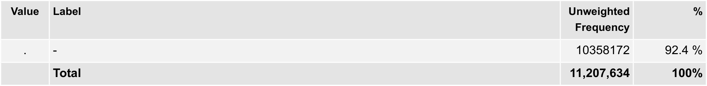

| Unweighted Frequency | %      |
|----------------------|--------|
| 10358172             | 92.4 % |
| Total                | 11,207,634 | 100% |

Please note that only the first 50 response categories are displayed in the PDF codebook. To view all response categories, please analyze the data file in the statistical package of your choice (SAS, SPSS, Stata, R).

Based upon 849,462 valid cases out of 11,207,634 total cases.

- Mean: 205.02
- Minimum: 0.00
- Maximum: 999.00
- Standard Deviation: 283.60

Location: 553-555 (width: 3; decimal: 0)  
Variable Type: numeric  
(Range of) Missing Values: -9, -8, -7, -6, -5, .

### V30142: ESTIMATED QTY 1 1/1000TH - 2

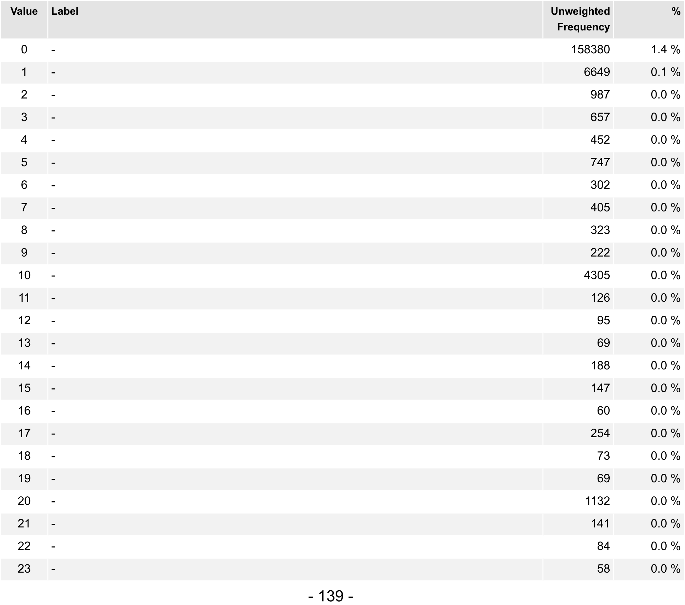

| Unweighted Frequency | %      |
|----------------------|--------|
| 0                    | 158380 | 1.4 % |
| 1                    | 6649   | 0.1 % |
| 2                    | 987    | 0.0 % |
| 3                    | 657    | 0.0 % |
| 4                    | 452    | 0.0 % |
| 5                    | 747    | 0.0 % |
| 6                    | 302    | 0.0 % |
| 7                    | 405    | 0.0 % |
| 8                    | 323    | 0.0 % |
| 9                    | 222    | 0.0 % |
| 10                   | 4305   | 0.0 % |
| 11                   | 126    | 0.0 % |
| 12                   | 95     | 0.0 % |
| 13                   | 69     | 0.0 % |
| 14                   | 188    | 0.0 % |
| 15                   | 147    | 0.0 % |
| 16                   | 60     | 0.0 % |
| 17                   | 254    | 0.0 % |
| 18                   | 73     | 0.0 % |
| 19                   | 69     | 0.0 % |
| 20                   | 1132   | 0.0 % |
| 21                   | 141    | 0.0 % |
| 22                   | 84     | 0.0 % |
| 23                   | 58     | 0.0 % |


|   | Unweighted Frequency | %    |
|---|----------------------|------|
| 24|                      | 85   | 0.0 % |
| 25|                      | 250  | 0.0 % |
| 26|                      | 63   | 0.0 % |
| 27|                      | 47   | 0.0 % |
| 28|                      | 140  | 0.0 % |
| 29|                      | 72   | 0.0 % |
| 30|                      | 789  | 0.0 % |
| 31|                      | 83   | 0.0 % |
| 32|                      | 58   | 0.0 % |
| 33|                      | 54   | 0.0 % |
| 34|                      | 57   | 0.0 % |
| 35|                      | 764  | 0.0 % |
| 36|                      | 39   | 0.0 % |
| 37|                      | 38   | 0.0 % |
| 38|                      | 70   | 0.0 % |
| 39|                      | 47   | 0.0 % |
| 40|                      | 710  | 0.0 % |
| 41|                      | 42   | 0.0 % |
| 42|                      | 79   | 0.0 % |
| 43|                      | 39   | 0.0 % |
| 44|                      | 39   | 0.0 % |
| 45|                      | 86   | 0.0 % |
| 46|                      | 48   | 0.0 % |
| 47|                      | 40   | 0.0 % |
| 48|                      | 40   | 0.0 % |
| 49|                      | 84   | 0.0 % |

**Missing Data**

10875773 97.0 %

**Total**

11,207,634 100%

---

Please note that only the first 50 response categories are displayed in the PDF codebook. To view all response categories, please analyze the data file in the statistical package of your choice (SAS, SPSS, Stata, R).

Based upon 331,861 valid cases out of 11,207,634 total cases.

- Mean: 208.36
- Minimum: 0.00
- Maximum: 999.00
- Standard Deviation: 285.24

Location: 556-558 (width: 3; decimal: 0)
Variable Type: numeric
(Range of) Missing Values: -9, -8, -7, -6, -5, .


V30143: ESTIMATED QTY 1 1/1000TH - 3

|    | Unweighted Frequency |      % |
|--- | --------------------- | ------ |
| 0  | 25410                 | 0.2 %  |
| 1  | 698                   | 0.0 %  |
| 2  | 164                   | 0.0 %  |
| 3  | 115                   | 0.0 %  |
| 4  | 100                   | 0.0 %  |
| 5  | 148                   | 0.0 %  |
| 6  | 63                    | 0.0 %  |
| 7  | 69                    | 0.0 %  |
| 8  | 66                    | 0.0 %  |
| 9  | 46                    | 0.0 %  |
| 10 | 603                   | 0.0 %  |
| 11 | 28                    | 0.0 %  |
| 12 | 21                    | 0.0 %  |
| 13 | 17                    | 0.0 %  |
| 14 | 37                    | 0.0 %  |
| 15 | 29                    | 0.0 %  |
| 16 | 14                    | 0.0 %  |
| 17 | 32                    | 0.0 %  |
| 18 | 12                    | 0.0 %  |
| 19 | 16                    | 0.0 %  |
| 20 | 183                   | 0.0 %  |
| 21 | 24                    | 0.0 %  |
| 22 | 17                    | 0.0 %  |
| 23 | 12                    | 0.0 %  |
| 24 | 19                    | 0.0 %  |
| 25 | 41                    | 0.0 %  |
| 26 | 11                    | 0.0 %  |
| 27 | 6                     | 0.0 %  |
| 28 | 30                    | 0.0 %  |
| 29 | 11                    | 0.0 %  |
| 30 | 144                   | 0.0 %  |
| 31 | 14                    | 0.0 %  |
| 32 | 17                    | 0.0 %  |
| 33 | 14                    | 0.0 %  |
| 34 | 14                    | 0.0 %  |
| 35 | 66                    | 0.0 %  |
| 36 | 8                     | 0.0 %  |


#### 144_0.png

|   | Unweighted Frequency | %   |
|---|-----------------------|-----|
| 37| 5                     | 0.0%|
| 38| 11                    | 0.0%|
| 39| 12                    | 0.0%|
| 40| 120                   | 0.0%|
| 41| 12                    | 0.0%|
| 42| 13                    | 0.0%|
| 43| 8                     | 0.0%|
| 44| 7                     | 0.0%|
| 45| 11                    | 0.0%|
| 46| 5                     | 0.0%|
| 47| 5                     | 0.0%|
| 48| 8                     | 0.0%|
| 49| 8                     | 0.0%|

| Missing Data |  |  |
|--------------|--|--|
| . | 11153892 | 99.5% |

| Total | 11,207,634 | 100% |

Please note that only the first 50 response categories are displayed in the PDF codebook. To view all response categories, please analyze the data file in the statistical package of your choice (SAS, SPSS, Stata, R).

Based upon 53,742 valid cases out of 11,207,634 total cases.

• Mean: 217.75  
• Minimum: 0.00  
• Maximum: 999.00  
• Standard Deviation: 291.13  

Location: 559-561 (width: 3; decimal: 0)  
Variable Type: numeric  
(Range of) Missing Values: -9, -8, -7, -6, -5, .

#### V30151: TYPE MEASUREMENT 1 - 1

#### 144_1.png

|   | Unweighted Frequency | %    |
|---|-----------------------|------|
| 1 | Gram                  | 620991 | 5.5%  |
| 2 | Kilogram              | 7229   | 0.1%  |
| 3 | Ounce                 | 57976  | 0.5%  |
| 4 | Pound                 | 5713   | 0.1%  |
| 5 | Milliliter            | 3244   | 0.0%  |
| 6 | Liter                 | 107    | 0.0%  |
| 7 | Fluid Ounce           | 3448   | 0.0%  |
| 8 | Gallon                | 1008   | 0.0%  |
| 9 | Dosage Unit/Items     | 99741  | 0.9%  |
| 10| Number of Plants      | 2136   | 0.0%  |


## 145_0.png

|                        | Unweighted Frequency | %       |
|------------------------|----------------------|---------|
| **Missing Data**       |                      |         |
| -7 Unknown/missing/DNR | 47869                | 0.4 %   |
| .                      | 10358172             | 92.4 %  |
| **Total**              | **11,207,634**       | **100%**|

Based upon 801,593 valid cases out of 11,207,634 total cases.

- Minimum: 1.00
- Maximum: 10.00

Location: 562-563 (width: 2; decimal: 0)

Variable Type: numeric

(Range of) Missing Values: -9, -8, -7, -6, -5, .

## V30152: TYPE MEASUREMENT 1 - 2

## 145_1.png

|                            | Unweighted Frequency | %       |
|----------------------------|----------------------|---------|
| 1 Gram                     | 248977               | 2.2 %   |
| 2 Kilogram                 | 2916                 | 0.0 %   |
| 3 Ounce                    | 17062                | 0.2 %   |
| 4 Pound                    | 1713                 | 0.0 %   |
| 5 Milliliter               | 1386                 | 0.0 %   |
| 6 Liter                    | 50                   | 0.0 %   |
| 7 Fluid Ounce              | 1030                 | 0.0 %   |
| 8 Gallon                   | 425                  | 0.0 %   |
| 9 Dosage Unit/Items        | 38830                | 0.3 %   |
| 10 Number of Plants        | 481                  | 0.0 %   |
| **Missing Data**           |                      |         |
| -7 Unknown/missing/DNR     | 18991                | 0.2 %   |
| .                          | 10875773             | 97.0 %  |
| **Total**                  | **11,207,634**       | **100%**|

Based upon 312,870 valid cases out of 11,207,634 total cases.

- Minimum: 1.00
- Maximum: 10.00

Location: 564-565 (width: 2; decimal: 0)

Variable Type: numeric

(Range of) Missing Values: -9, -8, -7, -6, -5, .

## V30153: TYPE MEASUREMENT 1 - 3

## 145_2.png

|      | Unweighted Frequency | %      |
|------|----------------------|--------|
| 1 Gram | 39160                | 0.3 % |


#### 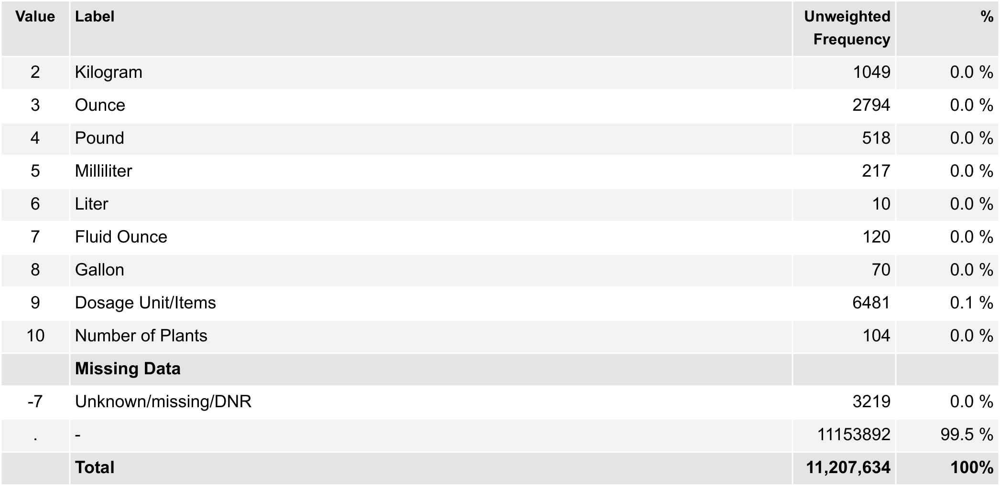

|                                            | Unweighted Frequency | %      |
|--------------------------------------------|----------------------|--------|
| 2 Kilogram                                 | 1049                 | 0.0 %  |
| 3 Ounce                                    | 2794                 | 0.0 %  |
| 4 Pound                                    | 518                  | 0.0 %  |
| 5 Milliliter                               | 217                  | 0.0 %  |
| 6 Liter                                    | 10                   | 0.0 %  |
| 7 Fluid Ounce                              | 120                  | 0.0 %  |
| 8 Gallon                                   | 70                   | 0.0 %  |
| 9 Dosage Unit/Items                        | 6481                 | 0.1 %  |
| 10 Number of Plants                        | 104                  | 0.0 %  |
| Missing Data                               |                      |        |
| -7 Unknown/missing/DNR                     | 3219                 | 0.0 %  |
| -                                          |                      |        |
| Total                                      | 11153892             | 99.5 % |
|                                            | 11,207,634           | 100%   |

Based upon 50,523 valid cases out of 11,207,634 total cases.

- Minimum: 1.00
- Maximum: 10.00

*Location*: 566-567 (width: 2; decimal: 0)
Variable Type: numeric
(Range of) Missing Values: -9, -8, -7, -6, -5, .

---

#### V30161: SUSPECTED DRUG TYPE 2 - 1

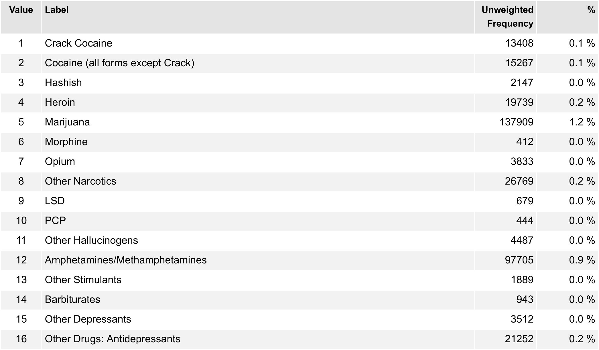

|                                           | Unweighted Frequency | %      |
|-------------------------------------------|----------------------|--------|
| 1 Crack Cocaine                           | 13408                | 0.1 %  |
| 2 Cocaine (all forms except Crack)        | 15267                | 0.1 %  |
| 3 Hashish                                 | 2147                 | 0.0 %  |
| 4 Heroin                                  | 19739                | 0.2 %  |
| 5 Marijuana                               | 137909               | 1.2 %  |
| 6 Morphine                                | 412                  | 0.0 %  |
| 7 Opium                                   | 3833                 | 0.0 %  |
| 8 Other Narcotics                         | 26769                | 0.2 %  |
| 9 LSD                                     | 679                  | 0.0 %  |
| 10 PCP                                    | 444                  | 0.0 %  |
| 11 Other Hallucinogens                    | 4487                 | 0.0 %  |
| 12 Amphetamines/Methamphetamines          | 97705                | 0.9 %  |
| 13 Other Stimulants                       | 1889                 | 0.0 %  |
| 14 Barbiturates                           | 943                  | 0.0 %  |
| 15 Other Depressants                      | 3512                 | 0.0 %  |
| 16 Other Drugs: Antidepressants           | 21252                | 0.2 %  |


## 93 Over 3 Drug Types

|                      | Unweighted Frequency | %       |
|----------------------|----------------------|---------|
| **Missing Data**     |                      |         |
| -7 Unknown/missing/DNR | 9973                 | 0.1 %   |
| .                    | -                    | -       |
| **Total**            | 10847266             | 96.8 %  |
|                      | 11,207,634           | 100%    |

Based upon 350,395 valid cases out of 11,207,634 total cases.

- Minimum: 1.00
- Maximum: 16.00

Location: 568-569 (width: 2; decimal: 0)  
Variable Type: numeric  
Range of Missing Values: -9, -8, -7, -6, -5, .  

## V30162: SUSPECTED DRUG TYPE 2 - 2

|                                | Unweighted Frequency | %       |
|--------------------------------|----------------------|---------|
| 1 Crack Cocaine                | 14192                | 0.1 %   |
| 2 Cocaine (all forms except Crack) | 14407            | 0.1 %   |
| 3 Hashish                      | 2122                 | 0.0 %   |
| 4 Heroin                       | 17314                | 0.2 %   |
| 5 Marijuana                    | 130201               | 1.2 %   |
| 6 Morphine                     | 311                  | 0.0 %   |
| 7 Opium                        | 3008                 | 0.0 %   |
| 8 Other Narcotics              | 20092                | 0.2 %   |
| 9 LSD                          | 324                  | 0.0 %   |
| 10 PCP                         | 185                  | 0.0 %   |
| 11 Other Hallucinogens         | 1760                 | 0.0 %   |
| 12 Amphetamines/Methamphetamines | 78466             | 0.7 %   |
| 13 Other Stimulants            | 826                  | 0.0 %   |
| 14 Barbiturates                | 313                  | 0.0 %   |
| 15 Other Depressants           | 1425                 | 0.0 %   |
| 16 Other Drugs: Antidepressants | 9881                | 0.1 %   |
| 93 Over 3 Drug Types           | 0                    | 0.0 %   |
| **Missing Data**               |                      |         |
| -7 Unknown/missing/DNR         | 5611                 | 0.1 %   |
| .                              | 10907196             | 97.3 %  |
| **Total**                      | 11,207,634           | 100%    |

Based upon 294,827 valid cases out of 11,207,634 total cases.

- Minimum: 1.00


## V30163: SUSPECTED DRUG TYPE 2 - 3
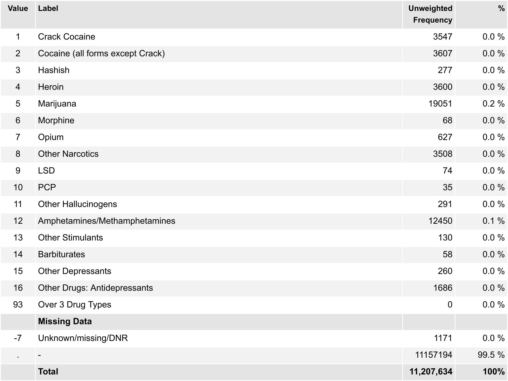

Based upon 49,269 valid cases out of 11,207,634 total cases.

- Minimum: 1.00
- Maximum: 16.00

Location: 572-573 (width: 2; decimal: 0)  
Variable Type: numeric  
(Range of) Missing Values: -9, -8, -7, -6, -5, .

## V30171: ESTIMATED QUANTITY 2 - 1
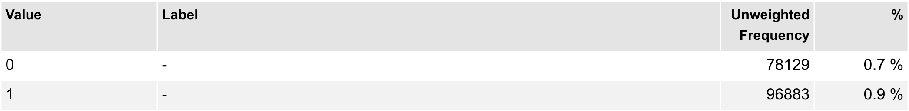


| Label | Unweighted Frequency | % |
| ----- | -------------------- | - |
| 2     | 31511                | 0.3 % |
| 3     | 20206                | 0.2 % |
| 4     | 13767                | 0.1 % |
| 5     | 10772                | 0.1 % |
| 6     | 8258                 | 0.1 % |
| 7     | 6747                 | 0.1 % |
| 8     | 6040                 | 0.1 % |
| 9     | 4570                 | 0.0 % |
| 10    | 5778                 | 0.1 % |
| 11    | 3570                 | 0.0 % |
| 12    | 4007                 | 0.0 % |
| 13    | 3245                 | 0.0 % |
| 14    | 3186                 | 0.0 % |
| 15    | 3028                 | 0.0 % |
| 16    | 2336                 | 0.0 % |
| 17    | 1993                 | 0.0 % |
| 18    | 1936                 | 0.0 % |
| 19    | 1633                 | 0.0 % |
| 20    | 2227                 | 0.0 % |
| 21    | 1531                 | 0.0 % |
| 22    | 1498                 | 0.0 % |
| 23    | 1213                 | 0.0 % |
| 24    | 1369                 | 0.0 % |
| 25    | 1375                 | 0.0 % |
| 26    | 1272                 | 0.0 % |
| 27    | 1155                 | 0.0 % |
| 28    | 1704                 | 0.0 % |
| 29    | 1150                 | 0.0 % |
| 30    | 1583                 | 0.0 % |
| 31    | 849                  | 0.0 % |
| 32    | 850                  | 0.0 % |
| 33    | 685                  | 0.0 % |
| 34    | 663                  | 0.0 % |
| 35    | 742                  | 0.0 % |
| 36    | 589                  | 0.0 % |
| 37    | 574                  | 0.0 % |
| 38    | 511                  | 0.0 % |
| 39    | 534                  | 0.0 % |
| 40    | 811                  | 0.0 % |


### 150_0.png

| Label         | Unweighted Frequency | %        |
|---------------|-----------------------|----------|
| 41            | 449                   | 0.0 %    |
| 42            | 511                   | 0.0 %    |
| 43            | 420                   | 0.0 %    |
| 44            | 439                   | 0.0 %    |
| 45            | 428                   | 0.0 %    |
| 46            | 370                   | 0.0 %    |
| 47            | 339                   | 0.0 %    |
| 48            | 439                   | 0.0 %    |
| 49            | 320                   | 0.0 %    |
| Missing Data  | 10847266              | 96.8 %   |
| Total         | 11,207,634            | 100%     |

Please note that only the first 50 response categories are displayed in the PDF codebook. To view all response categories, please analyze the data file in the statistical package of your choice (SAS, SPSS, Stata, R).

Based upon 360,368 valid cases out of 11,207,634 total cases.

- Mean: 950.27
- Minimum: 0.00
- Maximum: 100000000.00
- Standard Deviation: 223474.29

Location: 574-582 (width: 9; decimal: 0)  
Variable Type: numeric  
(Range of) Missing Values: -9, -8, -7, -6, -5, .  

### V30172: ESTIMATED QUANTITY 2 - 2

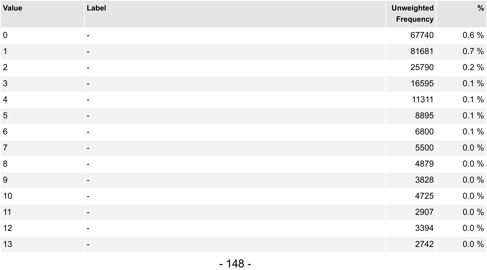


| Label | Unweighted Frequency | %     |
|-------|----------------------|-------|
| 14    | 2643                 | 0.0 % |
| 15    | 2437                 | 0.0 % |
| 16    | 1916                 | 0.0 % |
| 17    | 1597                 | 0.0 % |
| 18    | 1598                 | 0.0 % |
| 19    | 1335                 | 0.0 % |
| 20    | 1840                 | 0.0 % |
| 21    | 1243                 | 0.0 % |
| 22    | 1245                 | 0.0 % |
| 23    | 966                  | 0.0 % |
| 24    | 1146                 | 0.0 % |
| 25    | 1117                 | 0.0 % |
| 26    | 1022                 | 0.0 % |
| 27    | 969                  | 0.0 % |
| 28    | 1353                 | 0.0 % |
| 29    | 897                  | 0.0 % |
| 30    | 1261                 | 0.0 % |
| 31    | 696                  | 0.0 % |
| 32    | 691                  | 0.0 % |
| 33    | 564                  | 0.0 % |
| 34    | 541                  | 0.0 % |
| 35    | 583                  | 0.0 % |
| 36    | 469                  | 0.0 % |
| 37    | 450                  | 0.0 % |
| 38    | 417                  | 0.0 % |
| 39    | 436                  | 0.0 % |
| 40    | 644                  | 0.0 % |
| 41    | 346                  | 0.0 % |
| 42    | 428                  | 0.0 % |
| 43    | 336                  | 0.0 % |
| 44    | 358                  | 0.0 % |
| 45    | 357                  | 0.0 % |
| 46    | 280                  | 0.0 % |
| 47    | 269                  | 0.0 % |
| 48    | 337                  | 0.0 % |
| 49    | 251                  | 0.0 % |

| Missing Data | 10907196 | 97.3 % |
|--------------|----------|-------|
| Total        | 11,207,634   | 100%  |


Please note that only the first 50 response categories are displayed in the PDF codebook. To view all response categories, please analyze the data file in the statistical package of your choice (SAS, SPSS, Stata, R).

Based upon 300,438 valid cases out of 11,207,634 total cases.

- Mean: 895.98
- Minimum: 0.00
- Maximum: 100000000.00
- Standard Deviation: 203581.93

Location: 583-591 (width: 9; decimal: 0)  
Variable Type: numeric  
(Range of) Missing Values: -9, -8, -7, -6, -5, .

**V30173: ESTIMATED QUANTITY 2 - 3**

| Label | Unweighted Frequency | %    |
|-------|----------------------|------|
| 0     | 9765                 | 0.1% |
| 1     | 12458                | 0.1% |
| 2     | 3826                 | 0.0% |
| 3     | 2649                 | 0.0% |
| 4     | 1853                 | 0.0% |
| 5     | 1540                 | 0.0% |
| 6     | 1176                 | 0.0% |
| 7     | 965                  | 0.0% |
| 8     | 806                  | 0.0% |
| 9     | 732                  | 0.0% |
| 10    | 863                  | 0.0% |
| 11    | 515                  | 0.0% |
| 12    | 568                  | 0.0% |
| 13    | 511                  | 0.0% |
| 14    | 458                  | 0.0% |
| 15    | 455                  | 0.0% |
| 16    | 370                  | 0.0% |
| 17    | 291                  | 0.0% |
| 18    | 321                  | 0.0% |
| 19    | 260                  | 0.0% |
| 20    | 360                  | 0.0% |
| 21    | 235                  | 0.0% |
| 22    | 239                  | 0.0% |
| 23    | 207                  | 0.0% |
| 24    | 236                  | 0.0% |
| 25    | 203                  | 0.0% |
| 26    | 190                  | 0.0% |
| 27    | 220                  | 0.0% |


#### Label

| Label | Unweighted Frequency | %  |
|-------|-----------------------|----|
| 28    | 278                   | 0.0% |
| 29    | 200                   | 0.0% |
| 30    | 222                   | 0.0% |
| 31    | 155                   | 0.0% |
| 32    | 131                   | 0.0% |
| 33    | 115                   | 0.0% |
| 34    | 120                   | 0.0% |
| 35    | 130                   | 0.0% |
| 36    | 105                   | 0.0% |
| 37    | 96                    | 0.0% |
| 38    | 95                    | 0.0% |
| 39    | 92                    | 0.0% |
| 40    | 133                   | 0.0% |
| 41    | 79                    | 0.0% |
| 42    | 104                   | 0.0% |
| 43    | 77                    | 0.0% |
| 44    | 81                    | 0.0% |
| 45    | 86                    | 0.0% |
| 46    | 59                    | 0.0% |
| 47    | 66                    | 0.0% |
| 48    | 86                    | 0.0% |
| 49    | 54                    | 0.0% |
|       | **Missing Data**      | 11157194 | 99.5% |
|       | **Total**             | **11,207,634** | **100%** |

Please note that only the first 50 response categories are displayed in the PDF codebook. To view all response categories, please analyze the data file in the statistical package of your choice (SAS, SPSS, Stata, R).

Based upon 50,440 valid cases out of 11,207,634 total cases.

- Mean: 2389.76
- Minimum: 0.00
- Maximum: 100000000.00
- Standard Deviation: 447086.82

Location: 592-600 (width: 9; decimal: 0)  
Variable Type: numeric  
(Range of) Missing Values: -9, -8, -7, -6, -5, .

---

### V30181: ESTIMATED QTY 2 1/1000TH - 1

|       | Unweighted Frequency | %  |
|-------|-----------------------|----|
| 0     | 175827                | 1.6% |


|   | Unweighted Frequency | %   |
|---|---------------------|-----|
| 1 | 6795                | 0.1 |
| 2 | 1063                | 0.0 |
| 3 | 730                 | 0.0 |
| 4 | 485                 | 0.0 |
| 5 | 828                 | 0.0 |
| 6 | 341                 | 0.0 |
| 7 | 463                 | 0.0 |
| 8 | 374                 | 0.0 |
| 9 | 248                 | 0.0 |
| 10| 4450                | 0.0 |
| 11| 137                 | 0.0 |
| 12| 110                 | 0.0 |
| 13| 77                  | 0.0 |
| 14| 189                 | 0.0 |
| 15| 167                 | 0.0 |
| 16| 64                  | 0.0 |
| 17| 261                 | 0.0 |
| 18| 91                  | 0.0 |
| 19| 73                  | 0.0 |
| 20| 1188                | 0.0 |
| 21| 156                 | 0.0 |
| 22| 85                  | 0.0 |
| 23| 64                  | 0.0 |
| 24| 104                 | 0.0 |
| 25| 253                 | 0.0 |
| 26| 68                  | 0.0 |
| 27| 51                  | 0.0 |
| 28| 157                 | 0.0 |
| 29| 81                  | 0.0 |
| 30| 845                 | 0.0 |
| 31| 82                  | 0.0 |
| 32| 66                  | 0.0 |
| 33| 64                  | 0.0 |
| 34| 62                  | 0.0 |
| 35| 801                 | 0.0 |
| 36| 46                  | 0.0 |
| 37| 44                  | 0.0 |
| 38| 77                  | 0.0 |
| 39| 54                  | 0.0 |


|      | Unweighted Frequency | %     |
|------|-----------------------|-------|
| 40   |                       |       |
| 41   |                       |       |
| 42   |                       |       |
| 43   |                       |       |
| 44   |                       |       |
| 45   |                       |       |
| 46   |                       |       |
| 47   |                       |       |
| 48   |                       |       |
| 49   |                       |       |
| 40   | 758                   | 0.0 % |
| 41   | 47                    | 0.0 % |
| 42   | 89                    | 0.0 % |
| 43   | 46                    | 0.0 % |
| 44   | 45                    | 0.0 % |
| 45   | 104                   | 0.0 % |
| 46   | 52                    | 0.0 % |
| 47   | 35                    | 0.0 % |
| 48   | 47                    | 0.0 % |
| 49   | 92                    | 0.0 % |
| Missing Data | 10847266               | 96.8 % |
| Total        | 11,207,634             | 100%  |

Please note that only the first 50 response categories are displayed in the PDF codebook. To view all response categories, please analyze the data file in the statistical package of your choice (SAS, SPSS, Stata, R).

Based upon 360,368 valid cases out of 11,207,634 total cases.

- Mean: 205.13
- Minimum: 0.00
- Maximum: 999.00
- Standard Deviation: 284.22

Location: 601-603 (width: 3; decimal: 0)  
Variable Type: numeric  
(Range of) Missing Values: -9, -8, -7, -6, -5, .

---

V30182: ESTIMATED QTY 2 1/1000TH - 2

|      | Unweighted Frequency | %     |
|------|-----------------------|-------|
| 0    | 142962                | 1.3 % |
| 1    | 6307                  | 0.1 % |
| 2    | 935                   | 0.0 % |
| 3    | 607                   | 0.0 % |
| 4    | 415                   | 0.0 % |
| 5    | 706                   | 0.0 % |
| 6    | 281                   | 0.0 % |
| 7    | 384                   | 0.0 % |
| 8    | 309                   | 0.0 % |
| 9    | 210                   | 0.0 % |
| 10   | 3986                  | 0.0 % |
| 11   | 122                   | 0.0 % |
| 12   | 91                    | 0.0 % |


|     | Unweighted Frequency | %    |
|-----|----------------------|------|
| 13  | 65                   | 0.0% |
| 14  | 173                  | 0.0% |
| 15  | 140                  | 0.0% |
| 16  | 55                   | 0.0% |
| 17  | 237                  | 0.0% |
| 18  | 72                   | 0.0% |
| 19  | 62                   | 0.0% |
| 20  | 1033                 | 0.0% |
| 21  | 132                  | 0.0% |
| 22  | 73                   | 0.0% |
| 23  | 54                   | 0.0% |
| 24  | 82                   | 0.0% |
| 25  | 231                  | 0.0% |
| 26  | 61                   | 0.0% |
| 27  | 43                   | 0.0% |
| 28  | 129                  | 0.0% |
| 29  | 70                   | 0.0% |
| 30  | 714                  | 0.0% |
| 31  | 76                   | 0.0% |
| 32  | 55                   | 0.0% |
| 33  | 54                   | 0.0% |
| 34  | 57                   | 0.0% |
| 35  | 702                  | 0.0% |
| 36  | 37                   | 0.0% |
| 37  | 37                   | 0.0% |
| 38  | 67                   | 0.0% |
| 39  | 46                   | 0.0% |
| 40  | 632                  | 0.0% |
| 41  | 41                   | 0.0% |
| 42  | 72                   | 0.0% |
| 43  | 36                   | 0.0% |
| 44  | 37                   | 0.0% |
| 45  | 83                   | 0.0% |
| 46  | 45                   | 0.0% |
| 47  | 34                   | 0.0% |
| 48  | 41                   | 0.0% |
| 49  | 78                   | 0.0% |

**Missing Data**
- 10907196  97.3%


|                  | Unweighted Frequency | %      |
|------------------|----------------------|--------|
| Total            | 11,207,634           | 100%   |

Please note that only the first 50 response categories are displayed in the PDF codebook. To view all response categories, please analyze the data file in the statistical package of your choice (SAS, SPSS, Stata, R).

Based upon 300,438 valid cases out of 11,207,634 total cases.

- Mean: 207.70
- Minimum: 0.00
- Maximum: 999.00
- Standard Deviation: 284.77

Location: 604-606 (width: 3; decimal: 0)  
Variable Type: numeric  
(Range of) Missing Values: -9, -8, -7, -6, -5, .  

V30183: ESTIMATED QTY 2 1/1000TH - 3

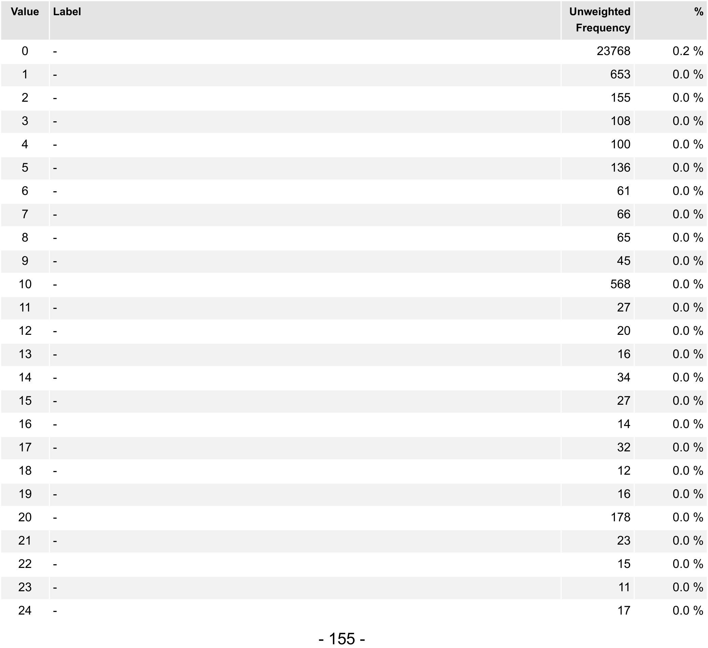

|    | Unweighted Frequency | %      |
|----|----------------------|--------|
| 0  | 23768                | 0.2 %  |
| 1  | 653                  | 0.0 %  |
| 2  | 155                  | 0.0 %  |
| 3  | 108                  | 0.0 %  |
| 4  | 100                  | 0.0 %  |
| 5  | 136                  | 0.0 %  |
| 6  | 61                   | 0.0 %  |
| 7  | 66                   | 0.0 %  |
| 8  | 65                   | 0.0 %  |
| 9  | 45                   | 0.0 %  |
| 10 | 568                  | 0.0 %  |
| 11 | 27                   | 0.0 %  |
| 12 | 20                   | 0.0 %  |
| 13 | 16                   | 0.0 %  |
| 14 | 34                   | 0.0 %  |
| 15 | 27                   | 0.0 %  |
| 16 | 14                   | 0.0 %  |
| 17 | 32                   | 0.0 %  |
| 18 | 12                   | 0.0 %  |
| 19 | 16                   | 0.0 %  |
| 20 | 178                  | 0.0 %  |
| 21 | 23                   | 0.0 %  |
| 22 | 15                   | 0.0 %  |
| 23 | 11                   | 0.0 %  |
| 24 | 17                   | 0.0 %  |


|         | Unweighted Frequency | %        |
|---------|----------------------|----------|
| 25      | 37                   | 0.0 %    |
| 26      | 11                   | 0.0 %    |
| 27      | 6                    | 0.0 %    |
| 28      | 24                   | 0.0 %    |
| 29      | 12                   | 0.0 %    |
| 30      | 138                  | 0.0 %    |
| 31      | 11                   | 0.0 %    |
| 32      | 16                   | 0.0 %    |
| 33      | 13                   | 0.0 %    |
| 34      | 11                   | 0.0 %    |
| 35      | 62                   | 0.0 %    |
| 36      | 8                    | 0.0 %    |
| 37      | 5                    | 0.0 %    |
| 38      | 10                   | 0.0 %    |
| 39      | 13                   | 0.0 %    |
| 40      | 111                  | 0.0 %    |
| 41      | 13                   | 0.0 %    |
| 42      | 13                   | 0.0 %    |
| 43      | 5                    | 0.0 %    |
| 44      | 6                    | 0.0 %    |
| 45      | 10                   | 0.0 %    |
| 46      | 5                    | 0.0 %    |
| 47      | 5                    | 0.0 %    |
| 48      | 8                    | 0.0 %    |
| 49      | 7                    | 0.0 %    |
| Missing Data | 11157194         | 99.5 %   |
| Total   | 11,207,634           | 100%     |

Please note that only the first 50 response categories are displayed in the PDF codebook. To view all response categories, please analyze the data file in the statistical package of your choice (SAS, SPSS, Stata, R).

Based upon 50,440 valid cases out of 11,207,634 total cases.

- Mean: 218.62
- Minimum: 0.00
- Maximum: 999.00
- Standard Deviation: 291.40

Location: 607-609 (width: 3; decimal: 0)  
Variable Type: numeric  
(Range of) Missing Values: -9, -8, -7, -6, -5, .  


## V30191: TYPE MEASUREMENT 2 - 1

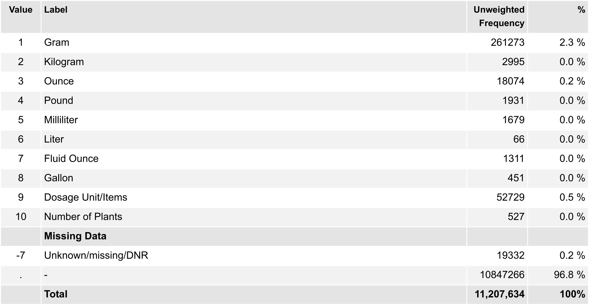

|          |                              | Unweighted Frequency |       | 
|----------|------------------------------|-----------------------|-------|
| 1        | Gram                         | 261273                | 2.3 % |
| 2        | Kilogram                     | 2995                  | 0.0 % |
| 3        | Ounce                        | 18074                 | 0.2 % |
| 4        | Pound                        | 1931                  | 0.0 % |
| 5        | Milliliter                   | 1679                  | 0.0 % |
| 6        | Liter                        | 66                    | 0.0 % |
| 7        | Fluid Ounce                  | 1311                  | 0.0 % |
| 8        | Gallon                       | 451                   | 0.0 % |
| 9        | Dosage Unit/Items            | 52729                 | 0.5 % |
| 10       | Number of Plants             | 527                   | 0.0 % |
|          | **Missing Data**             |                       |       | 
| -7       | Unknown/missing/DNR          | 19332                 | 0.2 % | 
| .        | -                            | 10847266              | 96.8 % | 
| **Total**|                              | **11,207,634**        | **100%** |

Based upon 341,036 valid cases out of 11,207,634 total cases.

- Minimum: 1.00
- Maximum: 10.00

Location: 610-611 (width: 2; decimal: 0)  
Variable Type: numeric  
(Range of) Missing Values: -9, -8, -7, -6, -5, .

## V30192: TYPE MEASUREMENT 2 - 2

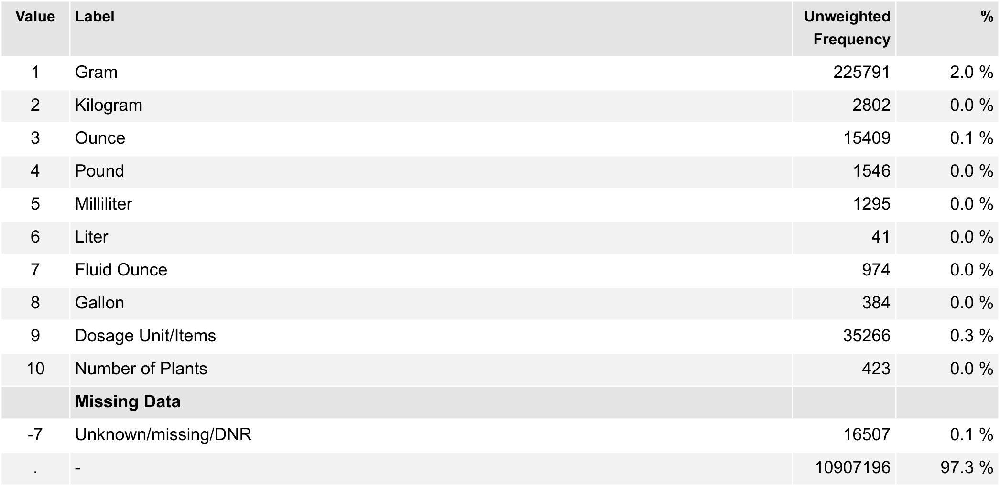

|          |                              | Unweighted Frequency    |       | 
|----------|------------------------------|--------------------------|-------|
| 1        | Gram                         | 225791                  | 2.0 % |
| 2        | Kilogram                     | 2802                    | 0.0 % |
| 3        | Ounce                        | 15409                   | 0.1 % |
| 4        | Pound                        | 1546                    | 0.0 % |
| 5        | Milliliter                   | 1295                    | 0.0 % |
| 6        | Liter                        | 41                      | 0.0 % |
| 7        | Fluid Ounce                  | 974                     | 0.0 % |
| 8        | Gallon                       | 384                     | 0.0 % |
| 9        | Dosage Unit/Items            | 35266                   | 0.3 % |
| 10       | Number of Plants             | 423                     | 0.0 % |
|          | **Missing Data**             |                          |       | 
| -7       | Unknown/missing/DNR          | 16507                   | 0.1 % | 
| .        | -                            | 10907196                | 97.3 % | 
| **Total**|                              | **11,207,634**          | **100%** |

Based upon 341,036 valid cases out of 11,207,634 total cases.

- Minimum: 1.00
- Maximum: 10.00

Location: 610-611 (width: 2; decimal: 0)  
Variable Type: numeric  
(Range of) Missing Values: -9, -8, -7, -6, -5, .


### 

|                           | Unweighted Frequency | %      |
|---------------------------|----------------------|--------|
| **Total**                 | 11,207,634           | 100%   |

Based upon 283,931 valid cases out of 11,207,634 total cases.

- Minimum: 1.00
- Maximum: 10.00

*Location: 612-613 (width: 2; decimal: 0)*
*Variable Type: numeric*
*(Range of) Missing Values: -9, -8, -7, -6, -5, .*

---

### V30193: TYPE MEASUREMENT 2 - 3


|                                | Unweighted Frequency | %      |
|--------------------------------|----------------------|--------|
| 1  Gram                        | 36756                | 0.3 %  |
| 2  Kilogram                    | 1030                 | 0.0 %  |
| 3  Ounce                       | 2638                 | 0.0 %  |
| 4  Pound                       | 516                  | 0.0 %  |
| 5  Milliliter                  | 207                  | 0.0 %  |
| 6  Liter                       | 10                   | 0.0 %  |
| 7  Fluid Ounce                 | 123                  | 0.0 %  |
| 8  Gallon                      | 65                   | 0.0 %  |
| 9  Dosage Unit/Items           | 6020                 | 0.1 %  |
| 10 Number of Plants            | 102                  | 0.0 %  |
| **Missing Data**               |                      |        |
| -7 Unknown/missing/DNR         | 2973                 | 0.0 %  |
| .                              | 11157194             | 99.5 % |
| **Total**                      | 11,207,634           | 100%   |

Based upon 47,467 valid cases out of 11,207,634 total cases.

- Minimum: 1.00
- Maximum: 10.00

*Location: 614-615 (width: 2; decimal: 0)*
*Variable Type: numeric*
*(Range of) Missing Values: -9, -8, -7, -6, -5, .*

---

### V30201: SUSPECTED DRUG TYPE 3 - 1

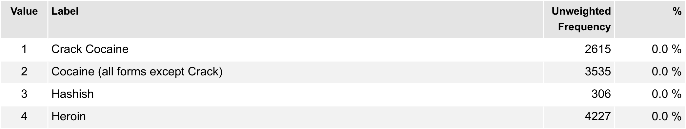

|                                 | Unweighted Frequency | %     |
|---------------------------------|----------------------|-------|
| 1 Crack Cocaine                 | 2615                 | 0.0 % |
| 2 Cocaine (all forms except Crack) | 3535                 | 0.0 % |
| 3 Hashish                       | 306                  | 0.0 % |
| 4 Heroin                        | 4227                 | 0.0 % |


## 161_0.png

|                                       | Unweighted Frequency |           |  
|---------------------------------------|----------------------|-----------|  
| 5  Marijuana                           | 23019                | 0.2 %     |  
| 6  Morphine                            | 155                  | 0.0 %     |  
| 7  Opium                               | 1331                 | 0.0 %     |  
| 8  Other Narcotics                     | 8702                 | 0.1 %     |  
| 9  LSD                                 | 407                  | 0.0 %     |  
| 10 PCP                                 | 140                  | 0.0 %     |  
| 11 Other Hallucinogens                 | 2697                 | 0.0 %     |  
| 12 Amphetamines/Methamphetamines       | 35206                | 0.3 %     |  
| 13 Other Stimulants                    | 1132                 | 0.0 %     |  
| 14 Barbiturates                        | 625                  | 0.0 %     |  
| 15 Other Depressants                   | 2335                 | 0.0 %     |  
| 16 Other Drugs: Antidepressants        | 12907                | 0.1 %     |  
| 93 Over 3 Drug Types                   | 0                    | 0.0 %     |  

### Missing Data

|                         | Unweighted Frequency |           |  
|-------------------------|----------------------|-----------|  
| -7 Unknown/missing/DNR  | 6288                 | 0.1 %     |  
| .                       | 11102007             | 99.1 %    |  

**Total** | **11,207,634** | **100%**  

Based upon 99,339 valid cases out of 11,207,634 total cases.

- Minimum: 1.00
- Maximum: 16.00

Location: 616-617 (width: 2; decimal: 0)  
Variable Type: numeric  
(Range of) Missing Values: -9, -8, -7, -6, -5, .

## V30202: SUSPECTED DRUG TYPE 3 - 2

## 161_1.png

|                                       | Unweighted Frequency |           |  
|---------------------------------------|----------------------|-----------|  
| 1  Crack Cocaine                      | 2778                 | 0.0 %     |  
| 2  Cocaine (all forms except Crack)   | 3763                 | 0.0 %     |  
| 3  Hashish                            | 318                  | 0.0 %     |  
| 4  Heroin                             | 4389                 | 0.0 %     |  
| 5  Marijuana                          | 23644                | 0.2 %     |  
| 6  Morphine                           | 152                  | 0.0 %     |  
| 7  Opium                              | 1321                 | 0.0 %     |  
| 8  Other Narcotics                    | 8276                 | 0.1 %     |  
| 9  LSD                                | 368                  | 0.0 %     |  
| 10 PCP                                | 104                  | 0.0 %     |  
| 11 Other Hallucinogens                | 2317                 | 0.0 %     |  
| 12 Amphetamines/Methamphetamines      | 33707                | 0.3 %     |  


### 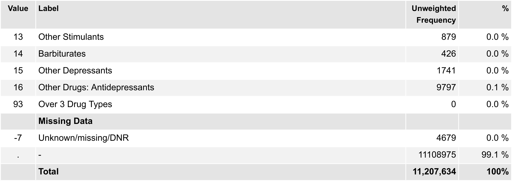

|                                  | Unweighted Frequency | %       |
|----------------------------------|----------------------|---------|
| 13 Other Stimulants              | 879                  | 0.0 %   |
| 14 Barbiturates                  | 426                  | 0.0 %   |
| 15 Other Depressants             | 1741                 | 0.0 %   |
| 16 Other Drugs: Antidepressants  | 9797                 | 0.1 %   |
| 93 Over 3 Drug Types             | 0                    | 0.0 %   |
|           **Missing Data**       |                      |         |
| -7 Unknown/missing/DNR           | 4679                 | 0.0 %   |
| -                                |                      |         |
| **Total**                        | **11,207,634**       | **100%**|

Based upon 93,980 valid cases out of 11,207,634 total cases.

- Minimum: 1.00
- Maximum: 16.00

Location: 618-619 (width: 2; decimal: 0)  
Variable Type: numeric  
(Range of) Missing Values: -9, -8, -7, -6, -5, .  

---

### V30203: SUSPECTED DRUG TYPE 3 - 3


|                                  | Unweighted Frequency | %       |
|----------------------------------|----------------------|---------|
|  1  Crack Cocaine                | 2756                 | 0.0 %   |
|  2  Cocaine (all forms except Crack) | 2840                 | 0.0 %   |
|  3  Hashish                      | 233                  | 0.0 %   |
|  4  Heroin                       | 2362                 | 0.0 %   |
|  5  Marijuana                    | 14210                | 0.1 %   |
|  6  Morphine                     | 57                   | 0.0 %   |
|  7  Opium                        | 412                  | 0.0 %   |
|  8  Other Narcotics              | 2191                 | 0.0 %   |
|  9  LSD                          | 82                   | 0.0 %   |
| 10  PCP                          | 27                   | 0.0 %   |
| 11  Other Hallucinogens          | 302                  | 0.0 %   |
| 12  Amphetamines/Methamphetamines| 8001                 | 0.1 %   |
| 13  Other Stimulants             | 106                  | 0.0 %   |
| 14  Barbiturates                 | 66                   | 0.0 %   |
| 15  Other Depressants            | 273                  | 0.0 %   |
| 16  Other Drugs: Antidepressants | 1640                 | 0.0 %   |
| 93  Over 3 Drug Types            | 0                    | 0.0 %   |
|           **Missing Data**       |                      |         |
| -7  Unknown/missing/DNR          | 894                  | 0.0 %   |
| -                                |                      |         |
| **Total**                        | **11,171,182**       | **99.7%**|


**Total** | **Unweighted Frequency** | **%**
--- | --- | ---
 | 11,207,634 | 100%

Based upon 35,558 valid cases out of 11,207,634 total cases.

- Minimum: 1.00
- Maximum: 16.00

Location: 620-621 (width: 2; decimal: 0)  
Variable Type: numeric  
(Range of) Missing Values: -9, -8, -7, -6, -5, .

---

**V30211: ESTIMATED QUANTITY 3 - 1**

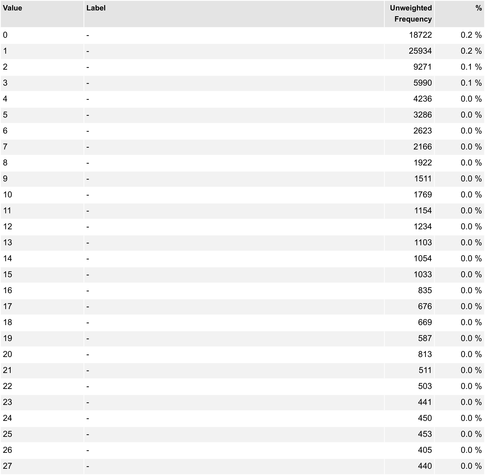


| Label | Unweighted Frequency | % |
|-------|----------------------|---|
| 28    | 583                  | 0.0 % |
| 29    | 404                  | 0.0 % |
| 30    | 536                  | 0.0 % |
| 31    | 292                  | 0.0 % |
| 32    | 302                  | 0.0 % |
| 33    | 264                  | 0.0 % |
| 34    | 263                  | 0.0 % |
| 35    | 252                  | 0.0 % |
| 36    | 242                  | 0.0 % |
| 37    | 206                  | 0.0 % |
| 38    | 200                  | 0.0 % |
| 39    | 166                  | 0.0 % |
| 40    | 291                  | 0.0 % |
| 41    | 165                  | 0.0 % |
| 42    | 208                  | 0.0 % |
| 43    | 159                  | 0.0 % |
| 44    | 155                  | 0.0 % |
| 45    | 182                  | 0.0 % |
| 46    | 136                  | 0.0 % |
| 47    | 134                  | 0.0 % |
| 48    | 160                  | 0.0 % |
| 49    | 107                  | 0.0 % |
| Missing Data | 11102007 | 99.1 % |
| .            | .        |      |
| **Total**    | **11,207,634** | **100%** |

Please note that only the first 50 response categories are displayed in the PDF codebook. To view all response categories, please analyze the data file in the statistical package of your choice (SAS, SPSS, Stata, R).

Based upon 105,627 valid cases out of 11,207,634 total cases.

- Mean: 1143.87
- Minimum: 0.00
- Maximum: 100000000.00
- Standard Deviation: 307965.28

*Location:* 622-630 (width: 9; decimal: 0)  
*Variable Type:* numeric  
*(Range of) Missing Values:* -9, -8, -7, -6, -5, .

## V30212: ESTIMATED QUANTITY 3 - 2

| Label | Unweighted Frequency | % |
|-------|----------------------|---|
| 0     | 18010                | 0.2 % |


| Label | Unweighted Frequency | %     |
|-------|-----------------------|-------|
| 1     |                       | 24252 | 0.2 % |
| 2     |                       | 8628  | 0.1 % |
| 3     |                       | 5541  | 0.0 % |
| 4     |                       | 3903  | 0.0 % |
| 5     |                       | 2998  | 0.0 % |
| 6     |                       | 2473  | 0.0 % |
| 7     |                       | 1958  | 0.0 % |
| 8     |                       | 1771  | 0.0 % |
| 9     |                       | 1439  | 0.0 % |
| 10    |                       | 1680  | 0.0 % |
| 11    |                       | 1044  | 0.0 % |
| 12    |                       | 1138  | 0.0 % |
| 13    |                       | 1050  | 0.0 % |
| 14    |                       | 996   | 0.0 % |
| 15    |                       | 970   | 0.0 % |
| 16    |                       | 758   | 0.0 % |
| 17    |                       | 622   | 0.0 % |
| 18    |                       | 615   | 0.0 % |
| 19    |                       | 544   | 0.0 % |
| 20    |                       | 741   | 0.0 % |
| 21    |                       | 468   | 0.0 % |
| 22    |                       | 459   | 0.0 % |
| 23    |                       | 394   | 0.0 % |
| 24    |                       | 405   | 0.0 % |
| 25    |                       | 421   | 0.0 % |
| 26    |                       | 380   | 0.0 % |
| 27    |                       | 414   | 0.0 % |
| 28    |                       | 532   | 0.0 % |
| 29    |                       | 372   | 0.0 % |
| 30    |                       | 478   | 0.0 % |
| 31    |                       | 270   | 0.0 % |
| 32    |                       | 278   | 0.0 % |
| 33    |                       | 240   | 0.0 % |
| 34    |                       | 237   | 0.0 % |
| 35    |                       | 241   | 0.0 % |
| 36    |                       | 224   | 0.0 % |
| 37    |                       | 189   | 0.0 % |
| 38    |                       | 191   | 0.0 % |
| 39    |                       | 165   | 0.0 % |


### 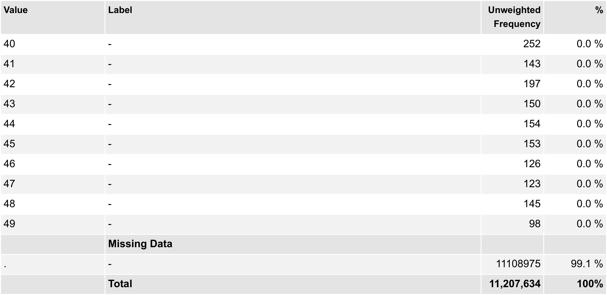

| Label | Unweighted Frequency | %  |
|-------|----------------------|----|
| 40    | 252                  | 0.0|
| 41    | 143                  | 0.0|
| 42    | 197                  | 0.0|
| 43    | 150                  | 0.0|
| 44    | 154                  | 0.0|
| 45    | 153                  | 0.0|
| 46    | 126                  | 0.0|
| 47    | 123                  | 0.0|
| 48    | 145                  | 0.0|
| 49    | 98                   | 0.0|
| Missing Data | | |
| .     | 11108975             | 99.1|
| Total | 11,207,634           | 100%|

Please note that only the first 50 response categories are displayed in the PDF codebook. To view all response categories, please analyze the data file in the statistical package of your choice (SAS, SPSS, Stata, R).

Based upon 98,659 valid cases out of 11,207,634 total cases.

- Mean: 1187.17
- Minimum: 0.00
- Maximum: 100000000.00
- Standard Deviation: 318637.68

Location: 631-639 (width: 9; decimal: 0)
Variable Type: numeric
(Range of) Missing Values: -9, -8, -7, -6, -5, .

### V30213: ESTIMATED QUANTITY 3 - 3

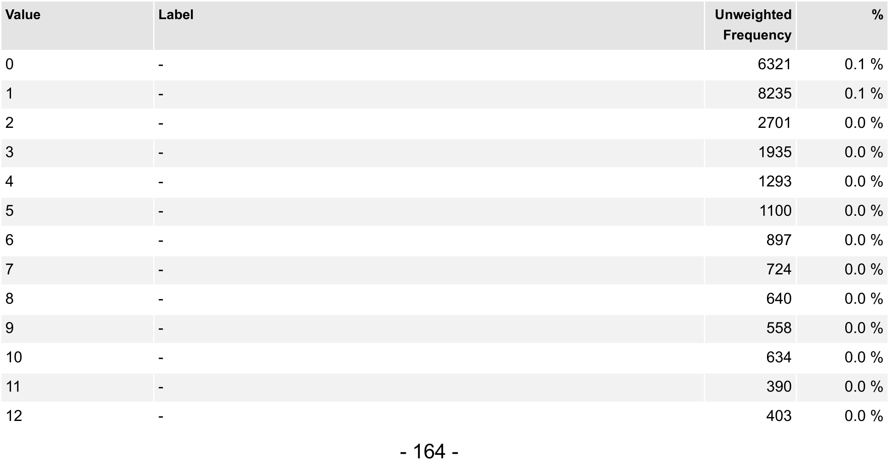

| Label | Unweighted Frequency | %  |
|-------|----------------------|----|
| 0     | 6321                 | 0.1|
| 1     | 8235                 | 0.1|
| 2     | 2701                 | 0.0|
| 3     | 1935                 | 0.0|
| 4     | 1293                 | 0.0|
| 5     | 1100                 | 0.0|
| 6     | 897                  | 0.0|
| 7     | 724                  | 0.0|
| 8     | 640                  | 0.0|
| 9     | 558                  | 0.0|
| 10    | 634                  | 0.0|
| 11    | 390                  | 0.0|
| 12    | 403                  | 0.0|


| Label | Unweighted Frequency | %     |
|-------|----------------------|-------|
| 13    | 373                  | 0.0 % |
| 14    | 368                  | 0.0 % |
| 15    | 358                  | 0.0 % |
| 16    | 282                  | 0.0 % |
| 17    | 250                  | 0.0 % |
| 18    | 253                  | 0.0 % |
| 19    | 205                  | 0.0 % |
| 20    | 272                  | 0.0 % |
| 21    | 203                  | 0.0 % |
| 22    | 174                  | 0.0 % |
| 23    | 165                  | 0.0 % |
| 24    | 165                  | 0.0 % |
| 25    | 166                  | 0.0 % |
| 26    | 151                  | 0.0 % |
| 27    | 185                  | 0.0 % |
| 28    | 228                  | 0.0 % |
| 29    | 164                  | 0.0 % |
| 30    | 176                  | 0.0 % |
| 31    | 128                  | 0.0 % |
| 32    | 113                  | 0.0 % |
| 33    | 102                  | 0.0 % |
| 34    | 104                  | 0.0 % |
| 35    | 112                  | 0.0 % |
| 36    | 92                   | 0.0 % |
| 37    | 81                   | 0.0 % |
| 38    | 82                   | 0.0 % |
| 39    | 83                   | 0.0 % |
| 40    | 96                   | 0.0 % |
| 41    | 55                   | 0.0 % |
| 42    | 96                   | 0.0 % |
| 43    | 67                   | 0.0 % |
| 44    | 74                   | 0.0 % |
| 45    | 55                   | 0.0 % |
| 46    | 52                   | 0.0 % |
| 47    | 59                   | 0.0 % |
| 48    | 73                   | 0.0 % |
| 49    | 40                   | 0.0 % |

| Missing Data | 11171182 | 99.7 % |


| Label | Unweighted Frequency | % |
|-------|----------------------|---|
|       |                      |   |
| Total | 11,207,634           | 100% |

Please note that only the first 50 response categories are displayed in the PDF codebook. To view all response categories, please analyze the data file in the statistical package of your choice (SAS, SPSS, Stata, R).

Based upon 36,452 valid cases out of 11,207,634 total cases.

- Mean: 2930.89
- Minimum: 0.00
- Maximum: 100000000.00
- Standard Deviation: 523801.93

Location: 640-648 (width: 9; decimal: 0)  
Variable Type: numeric  
(Range of) Missing Values: -9, -8, -7, -6, -5, .

### V30221: ESTIMATED QTY 3 1/1000TH - 1

|      | Unweighted Frequency | %   |
|------|----------------------|-----|
| 0    | 55124                | 0.5 % |
| 1    | 1344                 | 0.0 % |
| 2    | 384                  | 0.0 % |
| 3    | 216                  | 0.0 % |
| 4    | 177                  | 0.0 % |
| 5    | 215                  | 0.0 % |
| 6    | 113                  | 0.0 % |
| 7    | 113                  | 0.0 % |
| 8    | 111                  | 0.0 % |
| 9    | 73                   | 0.0 % |
| 10   | 971                  | 0.0 % |
| 11   | 44                   | 0.0 % |
| 12   | 35                   | 0.0 % |
| 13   | 28                   | 0.0 % |
| 14   | 46                   | 0.0 % |
| 15   | 37                   | 0.0 % |
| 16   | 28                   | 0.0 % |
| 17   | 78                   | 0.0 % |
| 18   | 24                   | 0.0 % |
| 19   | 20                   | 0.0 % |
| 20   | 324                  | 0.0 % |
| 21   | 47                   | 0.0 % |
| 22   | 26                   | 0.0 % |
| 23   | 13                   | 0.0 % |
| 24   | 35                   | 0.0 % |


|      | Unweighted Frequency | %      |
|------|-----------------------|--------|
| 25   | 39                    | 0.0 %  |
| 26   | 23                    | 0.0 %  |
| 27   | 10                    | 0.0 %  |
| 28   | 34                    | 0.0 %  |
| 29   | 19                    | 0.0 %  |
| 30   | 221                   | 0.0 %  |
| 31   | 16                    | 0.0 %  |
| 32   | 21                    | 0.0 %  |
| 33   | 22                    | 0.0 %  |
| 34   | 23                    | 0.0 %  |
| 35   | 186                   | 0.0 %  |
| 36   | 10                    | 0.0 %  |
| 37   | 15                    | 0.0 %  |
| 38   | 13                    | 0.0 %  |
| 39   | 10                    | 0.0 %  |
| 40   | 208                   | 0.0 %  |
| 41   | 18                    | 0.0 %  |
| 42   | 24                    | 0.0 %  |
| 43   | 9                     | 0.0 %  |
| 44   | 15                    | 0.0 %  |
| 45   | 23                    | 0.0 %  |
| 46   | 12                    | 0.0 %  |
| 47   | 9                     | 0.0 %  |
| 48   | 10                    | 0.0 %  |
| 49   | 20                    | 0.0 %  |

|      |      |        |
|------|------|--------|
|      |      |        |
| Total|      | 11102007  99.1 % |
|      |      | 11,207,634  100% |

Please note that only the first 50 response categories are displayed in the PDF codebook. To view all response categories, please analyze the data file in the statistical package of your choice (SAS, SPSS, Stata, R).

Based upon 105,627 valid cases out of 11,207,634 total cases.

- Mean: 198.64
- Minimum: 0.00
- Maximum: 999.00
- Standard Deviation: 283.72

Location: 649-651 (width: 3; decimal: 0)   
Variable Type: numeric   
(Range of) Missing Values: -9, -8, -7, -6, -5, .


### V30222: ESTIMATED QTY 3 1/1000TH - 2

|                   | Unweighted Frequency |       %        |
|-------------------|----------------------|----------------|
| 0                 | 50527                | 0.5 %          |
| 1                 | 1320                 | 0.0 %          |
| 2                 | 365                  | 0.0 %          |
| 3                 | 209                  | 0.0 %          |
| 4                 | 161                  | 0.0 %          |
| 5                 | 187                  | 0.0 %          |
| 6                 | 109                  | 0.0 %          |
| 7                 | 104                  | 0.0 %          |
| 8                 | 108                  | 0.0 %          |
| 9                 | 73                   | 0.0 %          |
| 10                | 942                  | 0.0 %          |
| 11                | 46                   | 0.0 %          |
| 12                | 37                   | 0.0 %          |
| 13                | 27                   | 0.0 %          |
| 14                | 51                   | 0.0 %          |
| 15                | 39                   | 0.0 %          |
| 16                | 28                   | 0.0 %          |
| 17                | 76                   | 0.0 %          |
| 18                | 23                   | 0.0 %          |
| 19                | 22                   | 0.0 %          |
| 20                | 320                  | 0.0 %          |
| 21                | 45                   | 0.0 %          |
| 22                | 25                   | 0.0 %          |
| 23                | 10                   | 0.0 %          |
| 24                | 30                   | 0.0 %          |
| 25                | 37                   | 0.0 %          |
| 26                | 22                   | 0.0 %          |
| 27                | 10                   | 0.0 %          |
| 28                | 35                   | 0.0 %          |
| 29                | 19                   | 0.0 %          |
| 30                | 208                  | 0.0 %          |
| 31                | 16                   | 0.0 %          |
| 32                | 21                   | 0.0 %          |
| 33                | 19                   | 0.0 %          |
| 34                | 22                   | 0.0 %          |
| 35                | 182                  | 0.0 %          |
| 36                | 10                   | 0.0 %          |

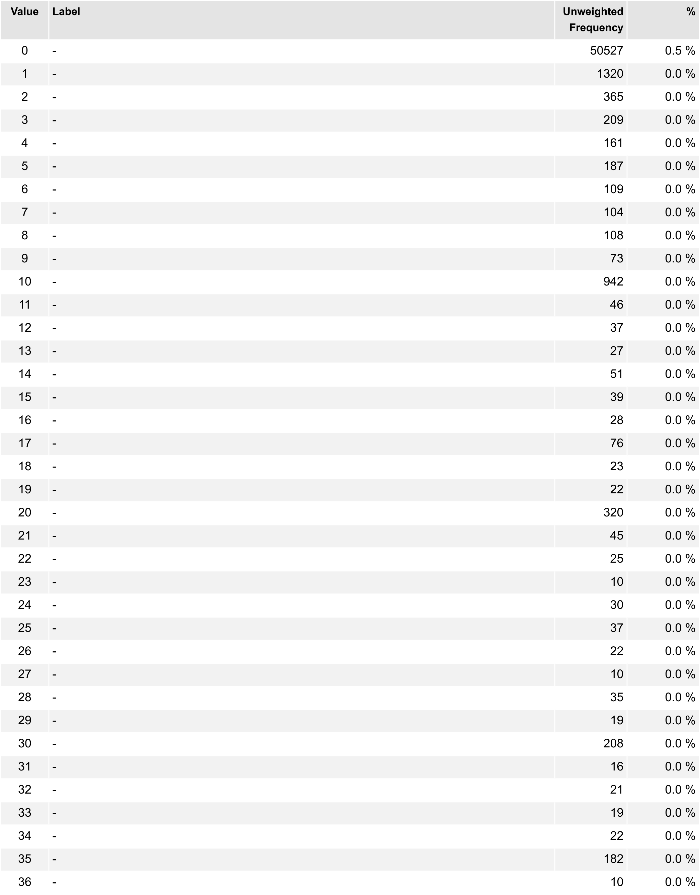

- 168 -


## 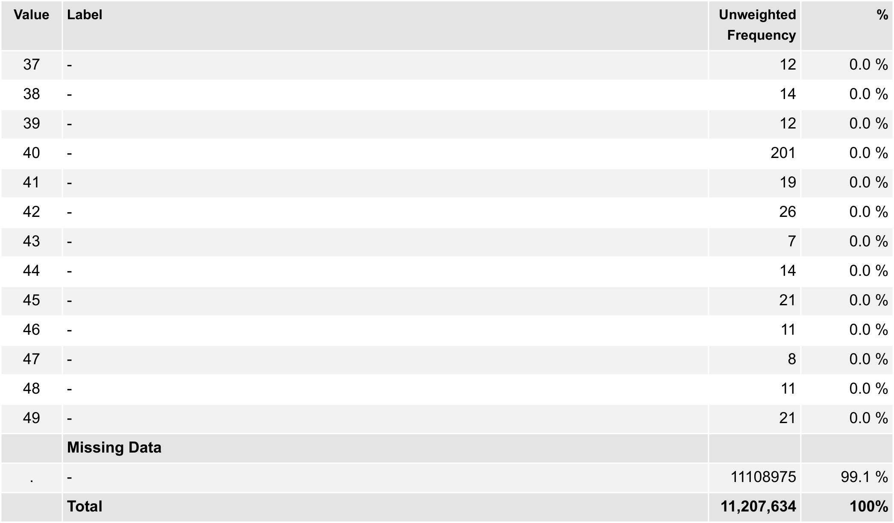

| Unweighted Frequency | %    |
|----------------------|------|
| 37                   | 12   | 0.0 % |
| 38                   | 14   | 0.0 % |
| 39                   | 12   | 0.0 % |
| 40                   | 201  | 0.0 % |
| 41                   | 19   | 0.0 % |
| 42                   | 26   | 0.0 % |
| 43                   | 7    | 0.0 % |
| 44                   | 14   | 0.0 % |
| 45                   | 21   | 0.0 % |
| 46                   | 11   | 0.0 % |
| 47                   | 8    | 0.0 % |
| 48                   | 11   | 0.0 % |
| 49                   | 21   | 0.0 % |
| Missing Data         |      |
|                      | 11108975 | 99.1 % |
| Total                | 11,207,634 | 100% |

Please note that only the first 50 response categories are displayed in the PDF codebook. To view all response categories, please analyze the data file in the statistical package of your choice (SAS, SPSS, Stata, R).

Based upon 98,659 valid cases out of 11,207,634 total cases.

* Mean: 202.05
* Minimum: 0.00
* Maximum: 999.00
* Standard Deviation: 284.88

Location: 652-654 (width: 3; decimal: 0)  
Variable Type: numeric  
(Range of) Missing Values: -9, -8, -7, -6, -5, .

## V30223: ESTIMATED QTY 3 1/1000TH - 3  

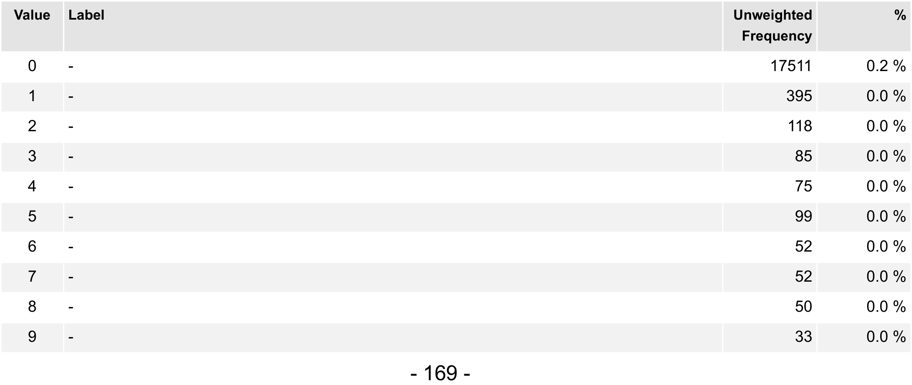


|     | Unweighted Frequency | %    |
|-----|----------------------|------|
| 10  | 383                  | 0.0% |
| 11  | 27                   | 0.0% |
| 12  | 18                   | 0.0% |
| 13  | 15                   | 0.0% |
| 14  | 20                   | 0.0% |
| 15  | 22                   | 0.0% |
| 16  | 11                   | 0.0% |
| 17  | 18                   | 0.0% |
| 18  | 11                   | 0.0% |
| 19  | 9                    | 0.0% |
| 20  | 128                  | 0.0% |
| 21  | 16                   | 0.0% |
| 22  | 14                   | 0.0% |
| 23  | 6                    | 0.0% |
| 24  | 14                   | 0.0% |
| 25  | 25                   | 0.0% |
| 26  | 10                   | 0.0% |
| 27  | 5                    | 0.0% |
| 28  | 16                   | 0.0% |
| 29  | 11                   | 0.0% |
| 30  | 98                   | 0.0% |
| 31  | 8                    | 0.0% |
| 32  | 12                   | 0.0% |
| 33  | 9                    | 0.0% |
| 34  | 11                   | 0.0% |
| 35  | 31                   | 0.0% |
| 36  | 4                    | 0.0% |
| 37  | 5                    | 0.0% |
| 38  | 7                    | 0.0% |
| 39  | 7                    | 0.0% |
| 40  | 75                   | 0.0% |
| 41  | 11                   | 0.0% |
| 42  | 10                   | 0.0% |
| 43  | 4                    | 0.0% |
| 44  | 5                    | 0.0% |
| 45  | 10                   | 0.0% |
| 46  | 3                    | 0.0% |
| 47  | 4                    | 0.0% |
| 48  | 8                    | 0.0% |


### 173_0.png

|                               | Unweighted Frequency | %          |
|-------------------------------|----------------------|------------|
| 49                            | 5                    | 0.0 %      |
| **Missing Data**              |                      |            |
| .                             | -                    |            |
| **Total**                     | 11,171,182           | 99.7 %     |
| **Total**                     | 11,207,634           | 100%       |

Please note that only the first 50 response categories are displayed in the PDF codebook. To view all response categories, please analyze the data file in the statistical package of your choice (SAS, SPSS, Stata, R).

Based upon 36,452 valid cases out of 11,207,634 total cases.

- **Mean**: 217.81
- **Minimum**: 0.00
- **Maximum**: 998.00
- **Standard Deviation**: 292.19

*Location*: 655-657 (width: 3; decimal: 0)  
*Variable Type*: numeric  
*(Range of) Missing Values*: -9, -8, -7, -6, -5, .

---

### V30231: TYPE MEASUREMENT 3 - 1


Based upon 100,397 valid cases out of 11,207,634 total cases.

- **Minimum**: 1.00
- **Maximum**: 10.00

*Location*: 658-659 (width: 2; decimal: 0)  
*Variable Type*: numeric  
*(Range of) Missing Values*: -9, -8, -7, -6, -5, .


## V30232: TYPE MEASUREMENT 3 - 2

### 

|   |                           | Unweighted Frequency | %       |
|---|---------------------------|----------------------|---------|
| 1 | Gram                      | 65518                | 0.6 %   |
| 2 | Kilogram                  | 1275                 | 0.0 %   |
| 3 | Ounce                     | 4047                 | 0.0 %   |
| 4 | Pound                     | 682                  | 0.0 %   |
| 5 | Milliliter                | 570                  | 0.0 %   |
| 6 | Liter                     | 20                   | 0.0 %   |
| 7 | Fluid Ounce               | 371                  | 0.0 %   |
| 8 | Gallon                    | 120                  | 0.0 %   |
| 9 | Dosage Unit/Items         | 20913                | 0.2 %   |
|10 | Number of Plants          | 174                  | 0.0 %   |
|   | **Missing Data**          |                      |         |
| -7| Unknown/missing/DNR       | 4969                 | 0.0 %   |
| . |                           | 11108975             | 99.1 %  |
|   | **Total**                 | 11207634             | 100%    |

Based upon 93,690 valid cases out of 11,207,634 total cases.

- Minimum: 1.00
- Maximum: 10.00

Location: 660-661 (width: 2; decimal: 0)

Variable Type: numeric

(Range of) Missing Values: -9, -8, -7, -6, -5, .

## V30233: TYPE MEASUREMENT 3 - 3

### 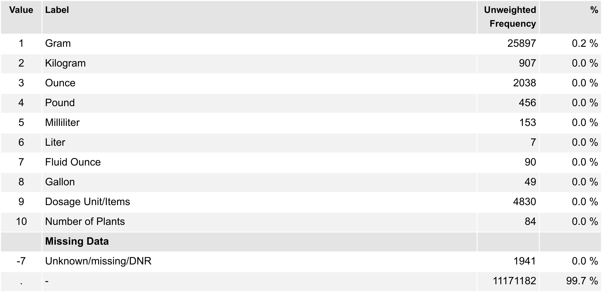

|   |                           | Unweighted Frequency | %       |
|---|---------------------------|----------------------|---------|
| 1 | Gram                      | 25897                | 0.2 %   |
| 2 | Kilogram                  | 907                  | 0.0 %   |
| 3 | Ounce                     | 2038                 | 0.0 %   |
| 4 | Pound                     | 456                  | 0.0 %   |
| 5 | Milliliter                | 153                  | 0.0 %   |
| 6 | Liter                     | 7                    | 0.0 %   |
| 7 | Fluid Ounce               | 90                   | 0.0 %   |
| 8 | Gallon                    | 49                   | 0.0 %   |
| 9 | Dosage Unit/Items         | 4830                 | 0.0 %   |
|10 | Number of Plants          | 84                   | 0.0 %   |
|   | **Missing Data**          |                      |         |
| -7| Unknown/missing/DNR       | 1941                 | 0.0 %   |
| . |                           | 11171182             | 99.7 %  |

- Minimum: 1.00
- Maximum: 10.00

Location: 660-661 (width: 2; decimal: 0)

Variable Type: numeric

(Range of) Missing Values: -9, -8, -7, -6, -5, .


Total | Unweighted Frequency | %  
--- | --- | ---  
 | 11,207,634 | 100%  

Based upon 34,511 valid cases out of 11,207,634 total cases.

- Minimum: 1.00  
- Maximum: 10.00  

Location: 662-663 (width: 2; decimal: 0)  
Variable Type: numeric  
(Range of) Missing Values: -9, -8, -7, -6, -5, .

V40061: VICTIM SEQUENCE NUMBER - 1

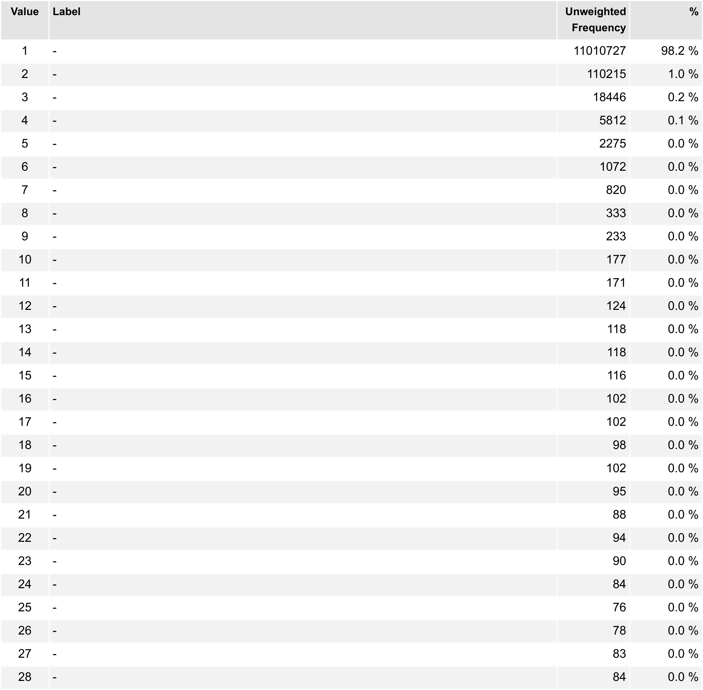

1 | 11010727 | 98.2%  
--- | --- | ---  
2 | 110215 | 1.0%  
3 | 18446 | 0.2%  
4 | 5812 | 0.1%  
5 | 2275 | 0.0%  
6 | 1072 | 0.0%  
7 | 820 | 0.0%  
8 | 333 | 0.0%  
9 | 233 | 0.0%  
10 | 177 | 0.0%  
11 | 171 | 0.0%  
12 | 124 | 0.0%  
13 | 118 | 0.0%  
14 | 118 | 0.0%  
15 | 116 | 0.0%  
16 | 102 | 0.0%  
17 | 102 | 0.0%  
18 | 98 | 0.0%  
19 | 102 | 0.0%  
20 | 95 | 0.0%  
21 | 88 | 0.0%  
22 | 94 | 0.0%  
23 | 90 | 0.0%  
24 | 84 | 0.0%  
25 | 76 | 0.0%  
26 | 78 | 0.0%  
27 | 83 | 0.0%  
28 | 84 | 0.0%  


#### 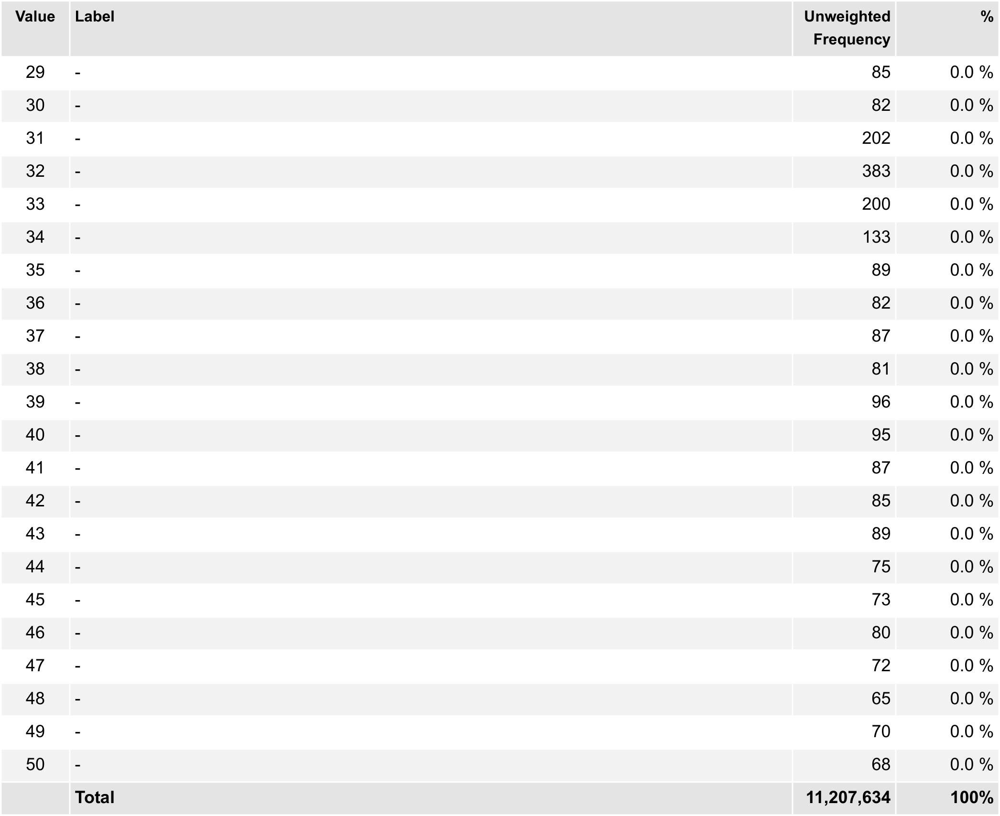

| Unweighted Frequency | %     |
|----------------------|-------|
| 29                   | 85    | 0.0 % |
| 30                   | 82    | 0.0 % |
| 31                   | 202   | 0.0 % |
| 32                   | 383   | 0.0 % |
| 33                   | 200   | 0.0 % |
| 34                   | 133   | 0.0 % |
| 35                   | 89    | 0.0 % |
| 36                   | 82    | 0.0 % |
| 37                   | 87    | 0.0 % |
| 38                   | 81    | 0.0 % |
| 39                   | 96    | 0.0 % |
| 40                   | 95    | 0.0 % |
| 41                   | 87    | 0.0 % |
| 42                   | 85    | 0.0 % |
| 43                   | 89    | 0.0 % |
| 44                   | 75    | 0.0 % |
| 45                   | 73    | 0.0 % |
| 46                   | 80    | 0.0 % |
| 47                   | 72    | 0.0 % |
| 48                   | 65    | 0.0 % |
| 49                   | 70    | 0.0 % |
| 50                   | 68    | 0.0 % |
| Total                | 11,207,634 | 100%   |

Please note that only the first 50 response categories are displayed in the PDF codebook. To view all response categories, please analyze the data file in the statistical package of your choice (SAS, SPSS, Stata, R).

Based upon 11,207,634 valid cases out of 11,207,634 total cases.

- Mean: 3.21
- Minimum: 1.00
- Maximum: 999.00
- Standard Deviation: 39.63

Location: 664-666 (width: 3; decimal: 0)  
Variable Type: numeric  
(Range of) Missing Values: -9, -8, -7, -6, -5

#### V40062: VICTIM SEQUENCE NUMBER - 2  

#### 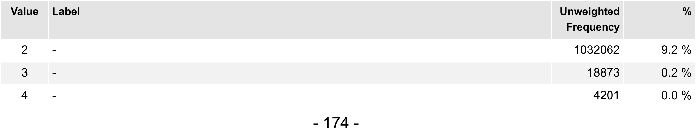

| Unweighted Frequency | %     |
|----------------------|-------|
| 2                    | 1032062  | 9.2 % |
| 3                    | 18873    | 0.2 % |
| 4                    | 4201     | 0.0 % |


|     | Unweighted Frequency | %   |
|-----|----------------------|-----|
| 5   | -                    | 1407| 0.0 % |
| 6   | -                    | 588 | 0.0 % |
| 7   | -                    | 306 | 0.0 % |
| 8   | -                    | 139 | 0.0 % |
| 9   | -                    | 80  | 0.0 % |
| 10  | -                    | 106 | 0.0 % |
| 11  | -                    | 42  | 0.0 % |
| 12  | -                    | 33  | 0.0 % |
| 13  | -                    | 16  | 0.0 % |
| 14  | -                    | 10  | 0.0 % |
| 15  | -                    | 10  | 0.0 % |
| 16  | -                    | 10  | 0.0 % |
| 17  | -                    | 13  | 0.0 % |
| 18  | -                    | 10  | 0.0 % |
| 19  | -                    | 5   | 0.0 % |
| 20  | -                    | 8   | 0.0 % |
| 21  | -                    | 11  | 0.0 % |
| 22  | -                    | 5   | 0.0 % |
| 23  | -                    | 13  | 0.0 % |
| 24  | -                    | 8   | 0.0 % |
| 25  | -                    | 12  | 0.0 % |
| 26  | -                    | 5   | 0.0 % |
| 27  | -                    | 3   | 0.0 % |
| 28  | -                    | 9   | 0.0 % |
| 29  | -                    | 7   | 0.0 % |
| 30  | -                    | 4   | 0.0 % |
| 31  | -                    | 21  | 0.0 % |
| 32  | -                    | 24  | 0.0 % |
| 33  | -                    | 27  | 0.0 % |
| 34  | -                    | 14  | 0.0 % |
| 35  | -                    | 16  | 0.0 % |
| 36  | -                    | 10  | 0.0 % |
| 37  | -                    | 8   | 0.0 % |
| 38  | -                    | 7   | 0.0 % |
| 39  | -                    | 3   | 0.0 % |
| 40  | -                    | 5   | 0.0 % |
| 41  | -                    | 7   | 0.0 % |
| 42  | -                    | 5   | 0.0 % |
| 43  | -                    | 5   | 0.0 % |


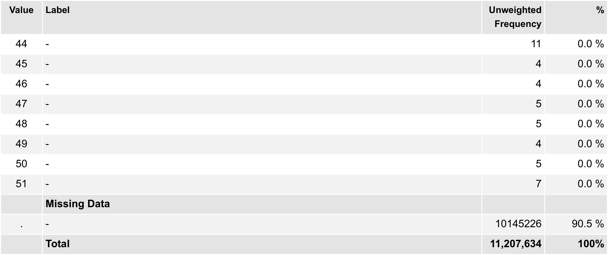

Please note that only the first 50 response categories are displayed in the PDF codebook. To view all response categories, please analyze the data file in the statistical package of your choice (SAS, SPSS, Stata, R).

Based upon 1,062,408 valid cases out of 11,207,634 total cases.

- Mean: 3.51
- Minimum: 2.00
- Maximum: 999.00
- Standard Deviation: 32.70

Location: 667-669 (width: 3; decimal: 0)  
Variable Type: numeric  
(Range of) Missing Values: -9, -8, -7, -6, -5, .

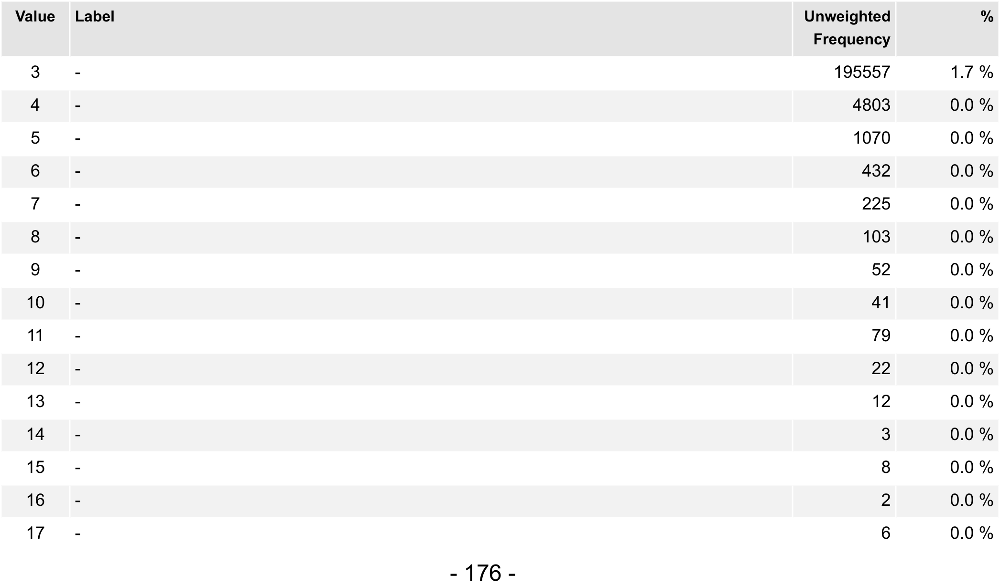


|     | Unweighted Frequency | %       |
|---  |----------------------|---------|
| 18  | -                    | 4  0.0% |
| 19  | -                    | 5  0.0% |
| 20  | -                    | 1  0.0% |
| 21  | -                    | 2  0.0% |
| 22  | -                    | 4  0.0% |
| 24  | -                    | 5  0.0% |
| 26  | -                    | 3  0.0% |
| 28  | -                    | 2  0.0% |
| 29  | -                    | 1  0.0% |
| 30  | -                    | 2  0.0% |
| 31  | -                    | 1  0.0% |
| 32  | -                    | 5  0.0% |
| 33  | -                    | 9  0.0% |
| 34  | -                    | 7  0.0% |
| 35  | -                    | 4  0.0% |
| 36  | -                    | 3  0.0% |
| 37  | -                    | 2  0.0% |
| 39  | -                    | 1  0.0% |
| 42  | -                    | 1  0.0% |
| 43  | -                    | 1  0.0% |
| 45  | -                    | 2  0.0% |
| 46  | -                    | 2  0.0% |
| 47  | -                    | 1  0.0% |
| 48  | -                    | 1  0.0% |
| 49  | -                    | 1  0.0% |
| 50  | -                    | 1  0.0% |
| 52  | -                    | 1  0.0% |
| 53  | -                    | 1  0.0% |
| 54  | -                    | 1  0.0% |
| 55  | -                    | 2  0.0% |
| 56  | -                    | 2  0.0% |
| 57  | -                    | 2  0.0% |
| 59  | -                    | 1  0.0% |
| 60  | -                    | 1  0.0% |
| 62  | -                    | 1  0.0% |
|     |                      |         |
|     | **Missing Data**     |         |
|     |                      | 11,004,408 98.2% |
|     | **Total**            | 11,207,634 100% |


Please note that only the first 50 response categories are displayed in the PDF codebook. To view all response categories, please analyze the data file in the statistical package of your choice (SAS, SPSS, Stata, R).

Based upon 203,226 valid cases out of 11,207,634 total cases.

- Mean: 4.47
- Minimum: 3.00
- Maximum: 999.00
- Standard Deviation: 32.61

Location: 670-672 (width: 3; decimal: 0)  
Variable Type: numeric  
(Range of) Missing Values: -9, -8, -7, -6, -5, .

### V40071: UCR OFFENSE CODE 1 - 1

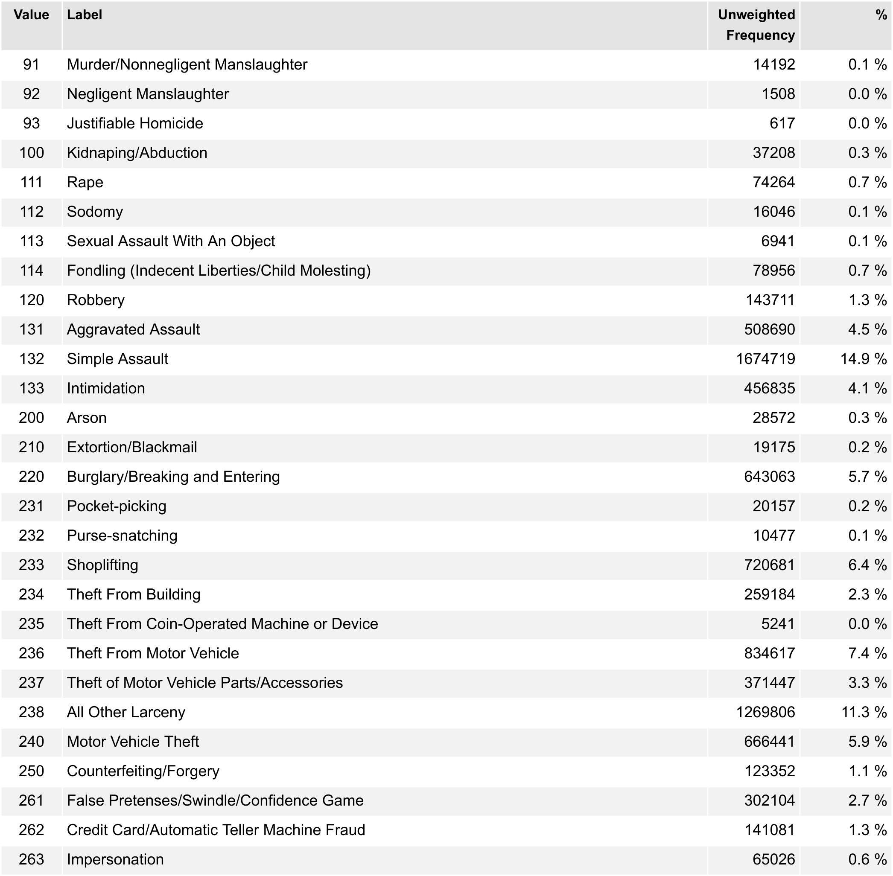

|      | Unweighted Frequency | %    |
|------|----------------------|------|
| 91   | 14192                | 0.1% |
| 92   | 1508                 | 0.0% |
| 93   | 617                  | 0.0% |
| 100  | 37208                | 0.3% |
| 111  | 74264                | 0.7% |
| 112  | 16046                | 0.1% |
| 113  | 6941                 | 0.1% |
| 114  | 78956                | 0.7% |
| 120  | 143711               | 1.3% |
| 131  | 508690               | 4.5% |
| 132  | 1674719              | 14.9% |
| 133  | 456835               | 4.1% |
| 200  | 28572                | 0.3% |
| 210  | 19175                | 0.2% |
| 220  | 643063               | 5.7% |
| 231  | 20157                | 0.2% |
| 232  | 10477                | 0.1% |
| 233  | 720681               | 6.4% |
| 234  | 259184               | 2.3% |
| 235  | 5241                 | 0.0% |
| 236  | 834617               | 7.4% |
| 237  | 371447               | 3.3% |
| 238  | 1269806              | 11.3% |
| 240  | 666441               | 5.9% |
| 250  | 123352               | 1.1% |
| 261  | 302104               | 2.7% |
| 262  | 141081               | 1.3% |
| 263  | 65026                | 0.6% |


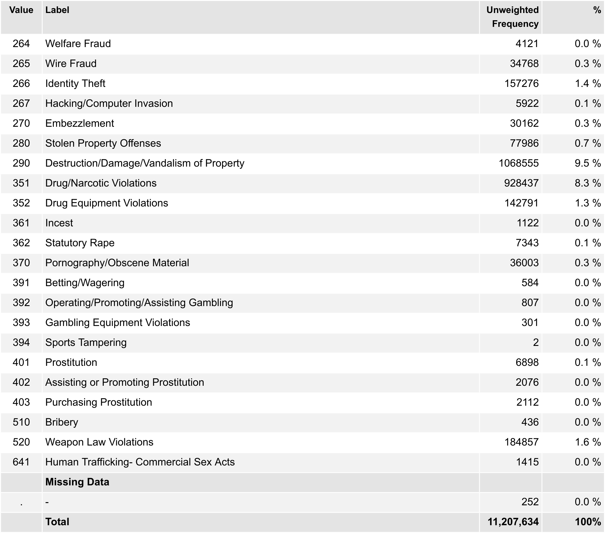

264 Welfare Fraud | 4121 | 0.0 %
--- | --- | ---
265 Wire Fraud | 34768 | 0.3 %
266 Identity Theft | 157276 | 1.4 %
267 Hacking/Computer Invasion | 5922 | 0.1 %
270 Embezzlement | 30162 | 0.3 %
280 Stolen Property Offenses | 77986 | 0.7 %
290 Destruction/Damage/Vandalism of Property | 1068555 | 9.5 %
351 Drug/Narcotic Violations | 928437 | 8.3 %
352 Drug Equipment Violations | 142791 | 1.3 %
361 Incest | 1122 | 0.0 %
362 Statutory Rape | 7343 | 0.1 %
370 Pornography/Obscene Material | 36003 | 0.3 %
391 Betting/Wagering | 584 | 0.0 %
392 Operating/Promoting/Assisting Gambling | 807 | 0.0 %
393 Gambling Equipment Violations | 301 | 0.0 %
394 Sports Tampering | 2 | 0.0 %
401 Prostitution | 6898 | 0.1 %
402 Assisting or Promoting Prostitution | 2076 | 0.0 %
403 Purchasing Prostitution | 2112 | 0.0 %
510 Bribery | 436 | 0.0 %
520 Weapon Law Violations | 184857 | 1.6 %
641 Human Trafficking- Commercial Sex Acts | 1415 | 0.0 %

Missing Data | 252 | 0.0 %
Total | 11,207,634 | 100 %

Please note that only the first 50 response categories are displayed in the PDF codebook. To view all response categories, please analyze the data file in the statistical package of your choice (SAS, SPSS, Stata, R).

Based upon 11,207,382 valid cases out of 11,207,634 total cases.

- Minimum: 91.00
- Maximum: 720.00

Location: 673-675 (width: 3; decimal: 0)
Variable Type: numeric
(Range of Missing Values: -9, -8, -7, -6, -5, .)

V40072: UCR OFFENSE CODE 1 - 2

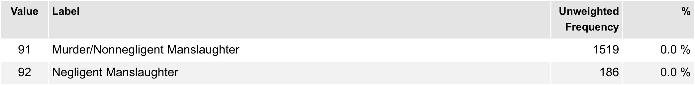

91 Murder/Nonnegligent Manslaughter | 1519 | 0.0 %
--- | --- | ---
92 Negligent Manslaughter | 186 | 0.0 %


|                                | Unweighted Frequency | %    |
|--------------------------------|----------------------|------|
| 93  Justifiable Homicide        | 13                   | 0.0% |
| 100 Kidnapping/Abduction        | 4060                 | 0.0% |
| 111 Rape                        | 2060                 | 0.0% |
| 112 Sodomy                      | 1111                 | 0.0% |
| 113 Sexual Assault With An Object | 377                  | 0.0% |
| 114 Fondling (Indecent Liberties/Child Molesting) | 6402 | 0.1% |
| 120 Robbery                     | 39426                | 0.4% |
| 131 Aggravated Assault          | 96023                | 0.9% |
| 132 Simple Assault              | 235672               | 2.1% |
| 133 Intimidation                | 58820                | 0.5% |
| 200 Arson                       | 3962                 | 0.0% |
| 210 Extortion/Blackmail         | 678                  | 0.0% |
| 220 Burglary/Breaking and Entering | 85901             | 0.8% |
| 231 Pocket-picking              | 707                  | 0.0% |
| 232 Purse-snatching             | 483                  | 0.0% |
| 233 Shoplifting                 | 23634                | 0.2% |
| 234 Theft From Building         | 13312                | 0.1% |
| 235 Theft From Coin-Operated Machine or Device | 342  | 0.0% |
| 236 Theft From Motor Vehicle    | 86057                | 0.8% |
| 237 Theft of Motor Vehicle Parts/Accessories | 11943  | 0.1% |
| 238 All Other Larceny           | 59250                | 0.5% |
| 240 Motor Vehicle Theft         | 32793                | 0.3% |
| 250 Counterfeiting/Forgery      | 14639                | 0.1% |
| 261 False Pretenses/Swindle/Confidence Game | 22886  | 0.2% |
| 262 Credit Card/Automatic Teller Machine Fraud | 12173 | 0.1% |
| 263 Impersonation               | 6813                 | 0.1% |
| 264 Welfare Fraud               | 249                  | 0.0% |
| 265 Wire Fraud                  | 1961                 | 0.0% |
| 266 Identity Theft              | 8722                 | 0.1% |
| 267 Hacking/Computer Invasion   | 374                  | 0.0% |
| 270 Embezzlement                | 1302                 | 0.0% |
| 280 Stolen Property Offenses    | 20924                | 0.2% |
| 290 Destruction/Damage/Vandalism of Property | 93279 | 0.8% |
| 351 Drug/Narcotic Violations    | 53667                | 0.5% |
| 352 Drug Equipment Violations   | 14033                | 0.1% |
| 361 Incest                      | 125                  | 0.0% |
| 362 Statutory Rape              | 544                  | 0.0% |
| 370 Pornography/Obscene Material| 3308                 | 0.0% |
| 391 Betting/Wagering            | 15                   | 0.0% |


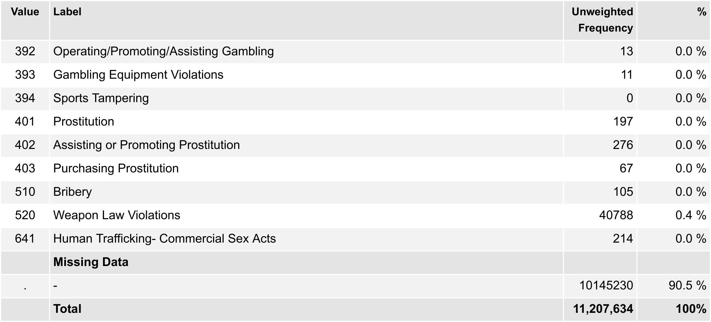

|                              | Unweighted Frequency | %     |
|------------------------------|----------------------|-------|
| 392 Operating/Promoting/Assisting Gambling | 13                   | 0.0 % |
| 393 Gambling Equipment Violations            | 11                   | 0.0 % |
| 394 Sports Tampering                         | 0                    | 0.0 % |
| 401 Prostitution                             | 197                  | 0.0 % |
| 402 Assisting or Promoting Prostitution      | 276                  | 0.0 % |
| 403 Purchasing Prostitution                  | 67                   | 0.0 % |
| 510 Bribery                                  | 105                  | 0.0 % |
| 520 Weapon Law Violations                    | 40788                | 0.4 % |
| 641 Human Trafficking- Commercial Sex Acts   | 214                  | 0.0 % |
| Missing Data                                 |                      |       |
| .                                            | 10145230             | 90.5% |
| Total                                        | 11,207,634           | 100%  |

Please note that only the first 50 response categories are displayed in the PDF codebook. To view all response categories, please analyze the data file in the statistical package of your choice (SAS, SPSS, Stata, R).

Based upon 1,062,404 valid cases out of 11,207,634 total cases.

- Minimum: 91.00
- Maximum: 720.00

**Location:** 676-678 (width: 3; decimal: 0)  
**Variable Type:** numeric  
**Range of Missing Values:** -9, -8, -7, -6, -5, .  

# V40073: UCR OFFENSE CODE 1 - 3

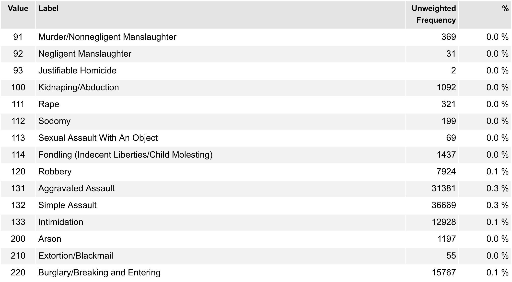

| Unweighted Frequency | %     |
|----------------------|-------|
| 91   Murder/Nonnegligent Manslaughter        | 369                  | 0.0 % |
| 92   Negligent Manslaughter                    | 31                   | 0.0 % |
| 93   Justifiable Homicide                      | 2                    | 0.0 % |
| 100  Kidnaping/Abduction                       | 1092                 | 0.0 % |
| 111  Rape                                      | 321                  | 0.0 % |
| 112  Sodomy                                    | 199                  | 0.0 % |
| 113  Sexual Assault With An Object             | 69                   | 0.0 % |
| 114  Fondling (Indecent Liberties/Child Molesting) | 1437                 | 0.0 % |
| 120  Robbery                                   | 7924                 | 0.1 % |
| 131  Aggravated Assault                        | 31381                | 0.3 % |
| 132  Simple Assault                            | 36669                | 0.3 % |
| 133  Intimidation                              | 12928                | 0.1 % |
| 200  Arson                                     | 1197                 | 0.0 % |
| 210  Extortion/Blackmail                       | 55                   | 0.0 % |
| 220  Burglary/Breaking and Entering            | 15767                | 0.1 % |


|  | Unweighted Frequency | % |
| --- | --- | --- |
| 231 | Pocket-picking               | 91    | 0.0 % |
| 232 | Purse-snatching              | 64    | 0.0 % |
| 233 | Shoplifting                  | 2142  | 0.0 % |
| 234 | Theft From Building          | 1963  | 0.0 % |
| 235 | Theft From Coin-Operated Machine or Device | 37    | 0.0 % |
| 236 | Theft From Motor Vehicle     | 17718 | 0.2 % |
| 237 | Theft of Motor Vehicle Parts/Accessories | 2081  | 0.0 % |
| 238 | All Other Larceny            | 8412  | 0.1 % |
| 240 | Motor Vehicle Theft          | 2770  | 0.0 % |
| 250 | Counterfeiting/Forgery       | 2312  | 0.0 % |
| 261 | False Pretenses/Swindle/Confidence Game | 3229  | 0.0 % |
| 262 | Credit Card/Automatic Teller Machine Fraud | 4081  | 0.0 % |
| 263 | Impersonation                | 1225  | 0.0 % |
| 264 | Welfare Fraud                | 33    | 0.0 % |
| 265 | Wire Fraud                   | 160   | 0.0 % |
| 266 | Identity Theft               | 2469  | 0.0 % |
| 267 | Hacking/Computer Invasion    | 49    | 0.0 % |
| 270 | Embezzlement                 | 172   | 0.0 % |
| 280 | Stolen Property Offenses     | 5053  | 0.0 % |
| 290 | Destruction/Damage/Vandalism of Property | 20547 | 0.2 % |
| 351 | Drug/Narcotic Violations     | 7495  | 0.1 % |
| 352 | Drug Equipment Violations    | 1782  | 0.0 % |
| 361 | Incest                       | 24    | 0.0 % |
| 362 | Statutory Rape               | 62    | 0.0 % |
| 370 | Pornography/Obscene Material | 255   | 0.0 % |
| 391 | Betting/Wagering             | 1     | 0.0 % |
| 392 | Operating/Promoting/Assisting Gambling | 1     | 0.0 % |
| 393 | Gambling Equipment Violations | 1     | 0.0 % |
| 394 | Sports Tampering             | 0     | 0.0 % |
| 401 | Prostitution                 | 17    | 0.0 % |
| 402 | Assisting or Promoting Prostitution | 18    | 0.0 % |
| 403 | Purchasing Prostitution      | 5     | 0.0 % |
| 510 | Bribery                      | 22    | 0.0 % |
| 520 | Weapon Law Violations        | 9255  | 0.1 % |
| 641 | Human Trafficking- Commercial Sex Acts | 59    | 0.0 % |
| . | Missing Data                  | 11004409 | 98.2 % |
| Total |  | 11,207,634 | 100% |


Please note that only the first 50 response categories are displayed in the PDF codebook. To view all response categories, please analyze the data file in the statistical package of your choice (SAS, SPSS, Stata, R).

Based upon 203,225 valid cases out of 11,207,634 total cases.

- Minimum: 91.00
- Maximum: 720.00

Location: 679-681 (width: 3; decimal: 0)
Variable Type: numeric
(Range of) Missing Values: -9, -8, -7, -6, -5, .

## V40081: UCR OFFENSE CODE 2 - 1

|    | Offense                                   | Unweighted Frequency | %    |
|----|-------------------------------------------|----------------------|------|
| 91 | Murder/Nonnegligent Manslaughter          | 0                    | 0.0% |
| 92 | Negligent Manslaughter                    | 0                    | 0.0% |
| 93 | Justifiable Homicide                      | 0                    | 0.0% |
| 100| Kidnaping/Abduction                       | 41                   | 0.0% |
| 111| Rape                                      | 1653                 | 0.0% |
| 112| Sodomy                                    | 1883                 | 0.0% |
| 113| Sexual Assault With An Object             | 664                  | 0.0% |
| 114| Fondling (Indecent Liberties/Child Molesting) | 668              | 0.0% |
| 120| Robbery                                   | 2708                 | 0.0% |
| 131| Aggravated Assault                        | 7752                 | 0.1% |
| 132| Simple Assault                            | 10653                | 0.1% |
| 133| Intimidation                              | 995                  | 0.0% |
| 200| Arson                                     | 954                  | 0.0% |
| 210| Extortion/Blackmail                       | 810                  | 0.0% |
| 220| Burglary/Breaking and Entering            | 19347                | 0.2% |
| 231| Pocket-picking                            | 699                  | 0.0% |
| 232| Purse-snatching                           | 646                  | 0.0% |
| 233| Shoplifting                               | 1804                 | 0.0% |
| 234| Theft From Building                       | 16872                | 0.2% |
| 235| Theft From Coin-Operated Machine or Device| 180                  | 0.0% |
| 236| Theft From Motor Vehicle                  | 7235                 | 0.1% |
| 237| Theft of Motor Vehicle Parts/Accessories  | 5321                 | 0.0% |
| 238| All Other Larceny                         | 54777                | 0.5% |
| 240| Motor Vehicle Theft                       | 43780                | 0.4% |
| 250| Counterfeiting/Forgery                    | 16774                | 0.1% |
| 261| False Pretenses/Swindle/Confidence Game   | 22661                | 0.2% |
| 262| Credit Card/Automatic Teller Machine Fraud| 43532                | 0.4% |
| 263| Impersonation                             | 7197                 | 0.1% |
| 264| Welfare Fraud                             | 247                  | 0.0% |


#### Unweighted Frequency

| % |
|---|
| **265** | **Wire Fraud** | **2804** | **0.0**% |
| **266** | **Identity Theft** | **20165** | **0.2**% |
| **267** | **Hacking/Computer Invasion** | **1759** | **0.0**% |
| **270** | **Embezzlement** | **1669** | **0.0**% |
| **280** | **Stolen Property Offenses** | **15883** | **0.1**% |
| **290** | **Destruction/Damage/Vandalism of Property** | **349546** | **3.1**% |
| **351** | **Drug/Narcotic Violations** | **0** | **0.0**% |
| **352** | **Drug Equipment Violations** | **287551** | **2.6**% |
| **361** | **Incest** | **29** | **0.0**% |
| **362** | **Statutory Rape** | **235** | **0.0**% |
| **370** | **Pornography/Obscene Material** | **129** | **0.0**% |
| **391** | **Betting/Wagering** | **41** | **0.0**% |
| **392** | **Operating/Promoting/Assisting Gambling** | **72** | **0.0**% |
| **393** | **Gambling Equipment Violations** | **212** | **0.0**% |
| **394** | **Sports Tampering** | **0** | **0.0**% |
| **401** | **Prostitution** | **386** | **0.0**% |
| **402** | **Assisting or Promoting Prostitution** | **374** | **0.0**% |
| **403** | **Purchasing Prostitution** | **148** | **0.0**% |
| **510** | **Bribery** | **80** | **0.0**% |
| **520** | **Weapon Law Violations** | **54378** | **0.5**% |
| **641** | **Human Trafficking- Commercial Sex Acts** | **253** | **0.0**% |
| **Missing Data** | | **-** |
| **.** | | **.** |
| **Total** | **0** | **10201735** | **91.0**% |
| **Total** | | **11,207,634** | **100%** |

Please note that only the first 50 response categories are displayed in the PDF codebook. To view all response categories, please analyze the data file in the statistical package of your choice (SAS, SPSS, Stata, R).

Based upon 1,005,899 valid cases out of 11,207,634 total cases.

- Minimum: 100.00
- Maximum: 720.00

Location: 682-684 (width: 3; decimal: 0)
Variable Type: numeric 
(Range of) Missing Values: -9, -8, -7, -6, -5, .

#### V40082: UCR OFFENSE CODE 2 - 2

| Unweighted Frequency | % |
|------------------------|---|
| **91** | **Murder/Nonnegligent Manslaughter** | **0** | **0.0%** |
| **92** | **Negligent Manslaughter** | **0** | **0.0%** |
| **93** | **Justifiable Homicide** | **0** | **0.0%** |


|                       | Unweighted Frequency | %   |
|-----------------------|----------------------|-----|
| 100  Kidnaping/Abduction | 3                    | 0.0 % |
| 111  Rape               | 35                   | 0.0 % |
| 112  Sodomy             | 68                   | 0.0 % |
| 113  Sexual Assault With An Object | 22               | 0.0 % |
| 114  Fondling (Indecent Liberties/Child Molesting) | 35  | 0.0 % |
| 120  Robbery            | 328                 | 0.0 % |
| 131  Aggravated Assault | 587                 | 0.0 % |
| 132  Simple Assault    | 533                  | 0.0 % |
| 133  Intimidation      | 153                  | 0.0 % |
| 200  Arson             | 214                  | 0.0 % |
| 210  Extortion/Blackmail | 77                | 0.0 % |
| 220  Burglary/Breaking and Entering | 2828        | 0.0 % |
| 231  Pocket-picking    | 50                   | 0.0 % |
| 232  Purse-snatching   | 36                   | 0.0 % |
| 233  Shoplifting       | 277                  | 0.0 % |
| 234  Theft From Building | 1531              | 0.0 % |
| 235  Theft From Coin-Operated Machine or Device | 11   | 0.0 % |
| 236  Theft From Motor Vehicle | 983          | 0.0 % |
| 237  Theft of Motor Vehicle Parts/Accessories | 397   | 0.0 % |
| 238  All Other Larceny | 4394                | 0.0 % |
| 240  Motor Vehicle Theft | 3563              | 0.0 % |
| 250  Counterfeiting/Forgery | 1492           | 0.0 % |
| 261  False Pretenses/Swindle/Confidence Game | 2242   | 0.0 % |
| 262  Credit Card/Automatic Teller Machine Fraud | 3285 | 0.0 % |
| 263  Impersonation      | 866              | 0.0 % |
| 264  Welfare Fraud      | 15               | 0.0 % |
| 265  Wire Fraud         | 223              | 0.0 % |
| 266  Identity Theft     | 1949             | 0.0 % |
| 267  Hacking/Computer Invasion | 116        | 0.0 % |
| 270  Embezzlement       | 147              | 0.0 % |
| 280  Stolen Property Offenses | 2373       | 0.0 % |
| 290  Destruction/Damage/Vandalism of Property | 30786 | 0.3 % |
| 351  Drug/Narcotic Violations | 0         | 0.0 % |
| 352  Drug Equipment Violations | 16418     | 0.1 % |
| 361  Incest             | 2                | 0.0 % |
| 362  Statutory Rape     | 21               | 0.0 % |
| 370  Pornography/Obscene Material | 30    | 0.0 % |
| 391  Betting/Wagering   | 0                | 0.0 % |
| 392  Operating/Promoting/Assisting Gambling | 1 | 0.0 % |


### 188_0.png

|                                              | Unweighted Frequency | %      |
|----------------------------------------------|----------------------|--------|
| 393  Gambling Equipment Violations           | 0                    | 0.0 %  |
| 394  Sports Tampering                        | 0                    | 0.0 %  |
| 401  Prostitution                            | 18                   | 0.0 %  |
| 402  Assisting or Promoting Prostitution     | 49                   | 0.0 %  |
| 403  Purchasing Prostitution                 | 12                   | 0.0 %  |
| 510  Bribery                                 | 14                   | 0.0 %  |
| 520  Weapon Law Violations                   | 4611                 | 0.0 %  |
| 641  Human Trafficking- Commercial Sex Acts  | 37                   | 0.0 %  |
| Missing Data                                 | 11126735             | 99.3 % |
| Total                                        | 11,207,634           | 100%   |

Please note that only the first 50 response categories are displayed in the PDF codebook. To view all response categories, please analyze the data file in the statistical package of your choice (SAS, SPSS, Stata, R).

Based upon 80,899 valid cases out of 11,207,634 total cases.

- Minimum: 100.00
- Maximum: 720.00

**Location:** 685-687 (width: 3; decimal: 0)  
**Variable Type:** numeric  
**(Range of) Missing Values:** -9, -8, -7, -6, -5, .

### 188_1.png

|                                              | Unweighted Frequency | %      |
|----------------------------------------------|----------------------|--------|
| 91   Murder/Nonnegligent Manslaughter        | 0                    | 0.0 %  |
| 92   Negligent Manslaughter                  | 0                    | 0.0 %  |
| 93   Justifiable Homicide                    | 0                    | 0.0 %  |
| 100  Kidnaping/Abduction                     | 2                    | 0.0 %  |
| 111  Rape                                    | 7                    | 0.0 %  |
| 112  Sodomy                                  | 12                   | 0.0 %  |
| 113  Sexual Assault With An Object           | 6                    | 0.0 %  |
| 114  Fondling (Indecent Liberties/Child Molesting) | 3             | 0.0 %  |
| 120  Robbery                                 | 95                   | 0.0 %  |
| 131  Aggravated Assault                      | 140                  | 0.0 %  |
| 132  Simple Assault                          | 82                   | 0.0 %  |
| 133  Intimidation                            | 47                   | 0.0 %  |
| 200  Arson                                   | 74                   | 0.0 %  |
| 210  Extortion/Blackmail                     | 14                   | 0.0 %  |
| 220  Burglary/Breaking and Entering          | 637                  | 0.0 %  |
| 231  Pocket-picking                          | 8                    | 0.0 %  |


|      | Unweighted Frequency | %     |
|------|----------------------|-------|
| 232  | Purse-snatching      | 4     | 0.0 % |
| 233  | Shoplifting          | 50    | 0.0 % |
| 234  | Theft From Building  | 231   | 0.0 % |
| 235  | Theft From Coin-Operated Machine or Device | 4 | 0.0 % |
| 236  | Theft From Motor Vehicle | 156 | 0.0 % |
| 237  | Theft of Motor Vehicle Parts/Accessories | 68 | 0.0 % |
| 238  | All Other Larceny    | 677   | 0.0 % |
| 240  | Motor Vehicle Theft  | 411   | 0.0 % |
| 250  | Counterfeiting/Forgery | 257 | 0.0 % |
| 261  | False Pretenses/Swindle/Confidence Game | 399 | 0.0 % |
| 262  | Credit Card/Automatic Teller Machine Fraud | 568 | 0.0 % |
| 263  | Impersonation        | 146   | 0.0 % |
| 264  | Welfare Fraud        | 6     | 0.0 % |
| 265  | Wire Fraud           | 34    | 0.0 % |
| 266  | Identity Theft       | 427   | 0.0 % |
| 267  | Hacking/Computer Invasion | 12 | 0.0 % |
| 270  | Embezzlement         | 28    | 0.0 % |
| 280  | Stolen Property Offenses | 594 | 0.0 % |
| 290  | Destruction/Damage/Vandalism of Property | 6101 | 0.1 % |
| 351  | Drug/Narcotic Violations | 0 | 0.0 % |
| 352  | Drug Equipment Violations | 2373 | 0.0 % |
| 361  | Incest               | 0     | 0.0 % |
| 362  | Statutory Rape       | 5     | 0.0 % |
| 370  | Pornography/Obscene Material | 3 | 0.0 % |
| 391  | Betting/Wagering     | 0     | 0.0 % |
| 392  | Operating/Promoting/Assisting Gambling | 1 | 0.0 % |
| 393  | Gambling Equipment Violations | 0 | 0.0 % |
| 394  | Sports Tampering     | 0     | 0.0 % |
| 401  | Prostitution         | 4     | 0.0 % |
| 402  | Assisting or Promoting Prostitution | 7 | 0.0 % |
| 403  | Purchasing Prostitution | 2 | 0.0 % |
| 510  | Bribery              | 3     | 0.0 % |
| 520  | Weapon Law Violations | 852 | 0.0 % |
| 641  | Human Trafficking-Commercial Sex Acts | 6 | 0.0 % |

**Missing Data** | 11193066 | 99.9 % |

---

**Total** | 11,207,634 | 100 % |


Please note that only the first 50 response categories are displayed in the PDF codebook. To view all response categories, please analyze the data file in the statistical package of your choice (SAS, SPSS, Stata, R).

Based upon 14,568 valid cases out of 11,207,634 total cases.

- Minimum: 100.00
- Maximum: 720.00

Location: 688-690 (width: 3, decimal: 0)  
Variable Type: numeric  
(Range of) Missing Values: -9, -8, -7, -6, -5, .

## V40091: UCR OFFENSE CODE 3 - 1

|   |   | Unweighted Frequency | %    |
|---|---|-----------------------|------|
| 91  | Murder/Nonnegligent Manslaughter  | 0                     | 0.0 % |
| 92  | Negligent Manslaughter            | 0                     | 0.0 % |
| 93  | Justifiable Homicide              | 0                     | 0.0 % |
| 100 | Kidnaping/Abduction               | 0                     | 0.0 % |
| 111 | Rape                              | 6                     | 0.0 % |
| 112 | Sodomy                            | 123                   | 0.0 % |
| 113 | Sexual Assault With An Object     | 142                   | 0.0 % |
| 114 | Fondling (Indecent Liberties/Child Molesting) | 0       | 0.0 % |
| 120 | Robbery                           | 132                   | 0.0 % |
| 131 | Aggravated Assault                | 79                    | 0.0 % |
| 132 | Simple Assault                    | 0                     | 0.0 % |
| 133 | Intimidation                      | 0                     | 0.0 % |
| 200 | Arson                             | 18                    | 0.0 % |
| 210 | Extortion/Blackmail               | 38                    | 0.0 % |
| 220 | Burglary/Breaking and Entering    | 959                   | 0.0 % |
| 231 | Pocket-picking                    | 14                    | 0.0 % |
| 232 | Purse-snatching                   | 21                    | 0.0 % |
| 233 | Shoplifting                       | 6                     | 0.0 % |
| 234 | Theft From Building               | 299                   | 0.0 % |
| 235 | Theft From Coin-Operated Machine or Device | 2           | 0.0 % |
| 236 | Theft From Motor Vehicle          | 147                   | 0.0 % |
| 237 | Theft of Motor Vehicle Parts/Accessories | 74            | 0.0 % |
| 238 | All Other Larceny                 | 1424                  | 0.0 % |
| 240 | Motor Vehicle Theft               | 2419                  | 0.0 % |
| 250 | Counterfeiting/Forgery            | 415                   | 0.0 % |
| 261 | False Pretenses/Swindle/Confidence Game | 1988          | 0.0 % |
| 262 | Credit Card/Automatic Teller Machine Fraud | 2319        | 0.0 % |
| 263 | Impersonation                     | 1011                  | 0.0 % |
| 264 | Welfare Fraud                     | 48                    | 0.0 % |


191_0.png

|                                  | Unweighted Frequency | %     |
|----------------------------------|----------------------|-------|
| 265  | Wire Fraud                         | 481                  | 0.0 % |
| 266  | Identity Theft                     | 3023                 | 0.0 % |
| 267  | Hacking/Computer Invasion          | 305                  | 0.0 % |
| 270  | Embezzlement                       | 264                  | 0.0 % |
| 280  | Stolen Property Offenses           | 2210                 | 0.0 % |
| 290  | Destruction/Damage/Vandalism of Property | 27137           | 0.2 % |
| 351  | Drug/Narcotic Violations           | 0                    | 0.0 % |
| 352  | Drug Equipment Violations          | 0                    | 0.0 % |
| 361  | Incest                             | 0                    | 0.0 % |
| 362  | Statutory Rape                     | 18                   | 0.0 % |
| 370  | Pornography/Obscene Material       | 79                   | 0.0 % |
| 391  | Betting/Wagering                   | 8                    | 0.0 % |
| 392  | Operating/Promoting/Assisting Gambling | 12               | 0.0 % |
| 393  | Gambling Equipment Violations      | 30                   | 0.0 % |
| 394  | Sports Tampering                   | 0                    | 0.0 % |
| 401  | Prostitution                       | 135                  | 0.0 % |
| 402  | Assisting or Promoting Prostitution | 130                 | 0.0 % |
| 403  | Purchasing Prostitution            | 27                   | 0.0 % |
| 510  | Bribery                            | 22                   | 0.0 % |
| 520  | Weapon Law Violations              | 23206                | 0.2 % |
| 641  | Human Trafficking- Commercial Sex Acts | 36               | 0.0 % |
| Missing Data                              |                      |       |
| .                                        |                      |       |
| Total                                    | 11,207,634           | 100%  |

Please note that only the first 50 response categories are displayed in the PDF codebook. To view all response categories, please analyze the data file in the statistical package of your choice (SAS, SPSS, Stata, R).

Based upon 68,872 valid cases out of 11,207,634 total cases.

- Minimum: 111.00
- Maximum: 720.00

Location: 691-693 (width: 3; decimal: 0)  
Variable Type: numeric  
(Range of) Missing Values: -9, -8, -7, -6, -5, .

191_1.png

|    |                                        | Unweighted Frequency | %     |
|----|----------------------------------------|----------------------|-------|
| 91 | Murder/Nonnegligent Manslaughter       | 0                    | 0.0 % |
| 92 | Negligent Manslaughter                 | 0                    | 0.0 % |
| 93 | Justifiable Homicide                   | 0                    | 0.0 % |


|                                        | Unweighted Frequency | %    |
|----------------------------------------|----------------------|------|
| 100  Kidnaping/Abduction               | 0                    | 0.0% |
| 111  Rape                              | 0                    | 0.0% |
| 112  Sodomy                            | 2                    | 0.0% |
| 113  Sexual Assault With An Object     | 11                   | 0.0% |
| 114  Fondling (Indecent Liberties/Child Molesting) | 0        | 0.0% |
| 120  Robbery                           | 8                    | 0.0% |
| 131  Aggravated Assault                | 1                    | 0.0% |
| 132  Simple Assault                    | 0                    | 0.0% |
| 133  Intimidation                      | 0                    | 0.0% |
| 200  Arson                             | 1                    | 0.0% |
| 210  Extortion/Blackmail               | 1                    | 0.0% |
| 220  Burglary/Breaking and Entering    | 119                  | 0.0% |
| 231  Pocket-picking                    | 1                    | 0.0% |
| 232  Purse-snatching                   | 1                    | 0.0% |
| 233  Shoplifting                       | 1                    | 0.0% |
| 234  Theft From Building               | 17                   | 0.0% |
| 235  Theft From Coin-Operated Machine or Device | 0            | 0.0% |
| 236  Theft From Motor Vehicle          | 19                   | 0.0% |
| 237  Theft of Motor Vehicle Parts/Accessories | 7            | 0.0% |
| 238  All Other Larceny                 | 137                  | 0.0% |
| 240  Motor Vehicle Theft               | 236                  | 0.0% |
| 250  Counterfeiting/Forgery            | 45                   | 0.0% |
| 261  False Pretenses/Swindle/Confidence Game | 225            | 0.0% |
| 262  Credit Card/Automatic Teller Machine Fraud | 262          | 0.0% |
| 263  Impersonation                     | 133                  | 0.0% |
| 264  Welfare Fraud                     | 2                    | 0.0% |
| 265  Wire Fraud                        | 33                   | 0.0% |
| 266  Identity Theft                    | 352                  | 0.0% |
| 267  Hacking/Computer Invasion         | 37                   | 0.0% |
| 270  Embezzlement                      | 25                   | 0.0% |
| 280  Stolen Property Offenses          | 389                  | 0.0% |
| 290  Destruction/Damage/Vandalism of Property | 2416          | 0.0% |
| 351  Drug/Narcotic Violations          | 0                    | 0.0% |
| 352  Drug Equipment Violations         | 0                    | 0.0% |
| 361  Incest                            | 1                    | 0.0% |
| 362  Statutory Rape                    | 1                    | 0.0% |
| 370  Pornography/Obscene Material      | 14                   | 0.0% |
| 391  Betting/Wagering                  | 0                    | 0.0% |
| 392  Operating/Promoting/Assisting Gambling | 0                | 0.0% |


193_0.png

|                                                      | Unweighted Frequency | %       |
|------------------------------------------------------|----------------------|---------|
| 393  Gambling Equipment Violations                   | 0                    | 0.0 %   |
| 394  Sports Tampering                                | 0                    | 0.0 %   |
| 401  Prostitution                                    | 10                   | 0.0 %   |
| 402  Assisting or Promoting Prostitution             | 5                    | 0.0 %   |
| 403  Purchasing Prostitution                         | 5                    | 0.0 %   |
| 510  Bribery                                         | 1                    | 0.0 %   |
| 520  Weapon Law Violations                           | 1880                 | 0.0 %   |
| 641  Human Trafficking- Commercial Sex Acts          | 3                    | 0.0 %   |
| **Missing Data**                                     |                      |         |
| .                                                    | 11201223             | 99.9 %  |
| **Total**                                            | **11,207,634**       | **100%**|

Please note that only the first 50 response categories are displayed in the PDF codebook. To view all response categories, please analyze the data file in the statistical package of your choice (SAS, SPSS, Stata, R).

Based upon 6,411 valid cases out of 11,207,634 total cases.

• Minimum: 112.00
• Maximum: 720.00

*Location:* 694-696 (width: 3; decimal: 0)
*Variable Type:* numeric
*(Range of)* **Missing Values:** -9, -8, -7, -6, -5, .

193_1.png

**V40093: UCR OFFENSE CODE 3 - 3**

|                                                      | Unweighted Frequency | %       |
|------------------------------------------------------|----------------------|---------|
| 91  Murder/Nonnegligent Manslaughter                 | 0                    | 0.0 %   |
| 92  Negligent Manslaughter                           | 0                    | 0.0 %   |
| 93  Justifiable Homicide                             | 0                    | 0.0 %   |
| 100  Kidnaping/Abduction                             | 0                    | 0.0 %   |
| 111  Rape                                            | 0                    | 0.0 %   |
| 112  Sodomy                                          | 0                    | 0.0 %   |
| 113  Sexual Assault With An Object                   | 2                    | 0.0 %   |
| 114  Fondling (Indecent Liberties/Child Molesting)   | 0                    | 0.0 %   |
| 120  Robbery                                         | 0                    | 0.0 %   |
| 131  Aggravated Assault                              | 0                    | 0.0 %   |
| 132  Simple Assault                                  | 0                    | 0.0 %   |
| 133  Intimidation                                    | 0                    | 0.0 %   |
| 200  Arson                                           | 1                    | 0.0 %   |
| 210  Extortion/Blackmail                             | 0                    | 0.0 %   |
| 220  Burglary/Breaking and Entering                  | 35                   | 0.0 %   |
| 231  Pocket-picking                                  | 0                    | 0.0 %   |


|              | Unweighted Frequency | %       |
|--------------|-----------------------|---------|
| 232          | Purse-snatching       | 0       | 0.0 % |
| 233          | Shoplifting           | 0       | 0.0 % |
| 234          | Theft From Building   | 2       | 0.0 % |
| 235          | Theft From Coin-Operated Machine or Device | 0 | 0.0 % |
| 236          | Theft From Motor Vehicle | 5    | 0.0 % |
| 237          | Theft of Motor Vehicle Parts/Accessories | 0  | 0.0 % |
| 238          | All Other Larceny     | 18      | 0.0 % |
| 240          | Motor Vehicle Theft   | 43      | 0.0 % |
| 250          | Counterfeiting/Forgery | 10     | 0.0 % |
| 261          | False Pretenses/Swindle/Confidence Game | 46 | 0.0 % |
| 262          | Credit Card/Automatic Teller Machine Fraud | 45 | 0.0 % |
| 263          | Impersonation         | 28      | 0.0 % |
| 264          | Welfare Fraud         | 2       | 0.0 % |
| 265          | Wire Fraud            | 4       | 0.0 % |
| 266          | Identity Theft        | 79      | 0.0 % |
| 267          | Hacking/Computer Invasion | 2  | 0.0 % |
| 270          | Embezzlement          | 6       | 0.0 % |
| 280          | Stolen Property Offenses | 89   | 0.0 % |
| 290          | Destruction/Damage/Vandalism of Property | 425 | 0.0 % |
| 351          | Drug/Narcotic Violations | 0    | 0.0 % |
| 352          | Drug Equipment Violations | 0   | 0.0 % |
| 361          | Incest                | 0       | 0.0 % |
| 362          | Statutory Rape        | 0       | 0.0 % |
| 370          | Pornography/Obscene Material | 1 | 0.0 % |
| 391          | Betting/Wagering          | 0       | 0.0 % |
| 392          | Operating/Promoting/Assisting Gambling | 0 | 0.0 % |
| 393          | Gambling Equipment Violations | 0 | 0.0 % |
| 394          | Sports Tampering      | 0       | 0.0 % |
| 401          | Prostitution          | 1       | 0.0 % |
| 402          | Assisting or Promoting Prostitution | 1 | 0.0 % |
| 403          | Purchasing Prostitution | 0     | 0.0 % |
| 510          | Bribery               | 3       | 0.0 % |
| 520          | Weapon Law Violations | 361     | 0.0 % |
| 641          | Human Trafficking- Commercial Sex Acts | 0 | 0.0 % |

**Missing Data**

|                | 11206421             | 100.0 % |

**Total**

|                | 11,207,634           | 100%    |


Please note that only the first 50 response categories are displayed in the PDF codebook. To view all response categories, please analyze the data file in the statistical package of your choice (SAS, SPSS, Stata, R).

Based upon 1,213 valid cases out of 11,207,634 total cases.

- Minimum: 113.00
- Maximum: 720.00

Location: 697-699 (width: 3; decimal: 0)
Variable Type: numeric
(Range of) Missing Values: -9, -8, -7, -6, -5, .

## V40101: UCR OFFENSE CODE 4 - 1

| Offense                              | Unweighted Frequency | %     |
|--------------------------------------|----------------------|-------|
| 91  Murder/Nonnegligent Manslaughter | 0                    | 0.0 % |
| 92  Negligent Manslaughter           | 0                    | 0.0 % |
| 93  Justifiable Homicide             | 0                    | 0.0 % |
| 100 Kidnaping/Abduction              | 0                    | 0.0 % |
| 111 Rape                             | 0                    | 0.0 % |
| 112 Sodomy                           | 0                    | 0.0 % |
| 113 Sexual Assault With An Object    | 9                    | 0.0 % |
| 114 Fondling (Indcent Liberties/Child Molesting) | 0         | 0.0 % |
| 120 Robbery                          | 7                    | 0.0 % |
| 131 Aggravated Assault               | 0                    | 0.0 % |
| 132 Simple Assault                   | 0                    | 0.0 % |
| 133 Intimidation                     | 0                    | 0.0 % |
| 200 Arson                            | 2                    | 0.0 % |
| 210 Extortion/Blackmail              | 1                    | 0.0 % |
| 220 Burglary/Breaking and Entering   | 31                   | 0.0 % |
| 231 Pocket-picking                   | 0                    | 0.0 % |
| 232 Purse-snatching                  | 1                    | 0.0 % |
| 233 Shoplifting                      | 0                    | 0.0 % |
| 234 Theft From Building             | 6                    | 0.0 % |
| 235 Theft From Coin-Operated Machine or Device | 0           | 0.0 % |
| 236 Theft From Motor Vehicle         | 2                    | 0.0 % |
| 237 Theft of Motor Vehicle Parts/Accessories | 1             | 0.0 % |
| 238 All Other Larceny                | 37                   | 0.0 % |
| 240 Motor Vehicle Theft              | 105                  | 0.0 % |
| 250 Counterfeiting/Forgery           | 16                   | 0.0 % |
| 261 False Pretenses/Swindle/Confidence Game | 50             | 0.0 % |
| 262 Credit Card/Automatic Teller Machine Fraud | 147         | 0.0 % |
| 263 Impersonation                    | 111                  | 0.0 % |
| 264 Welfare Fraud                    | 5                    | 0.0 % |


### 196_0.png

|                                       | Unweighted Frequency | %     |
|---------------------------------------|----------------------|-------|
| 265  Wire Fraud                       | 49                   | 0.0 % |
| 266  Identity Theft                   | 343                  | 0.0 % |
| 267  Hacking/Computer Invasion        | 69                   | 0.0 % |
| 270  Embezzlement                     | 44                   | 0.0 % |
| 280  Stolen Property Offenses         | 282                  | 0.0 % |
| 290  Destruction/Damage/Vandalism of Property | 1509       | 0.0 % |
| 351  Drug/Narcotic Violations         | 0                    | 0.0 % |
| 352  Drug Equipment Violations        | 0                    | 0.0 % |
| 361  Incest                           | 0                    | 0.0 % |
| 362  Statutory Rape                   | 0                    | 0.0 % |
| 370  Pornography/Obscene Material     | 0                    | 0.0 % |
| 391  Betting/Wagering                 | 0                    | 0.0 % |
| 392  Operating/Promoting/Assisting Gambling | 1             | 0.0 % |
| 393  Gambling Equipment Violations    | 4                    | 0.0 % |
| 394  Sports Tampering                 | 0                    | 0.0 % |
| 401  Prostitution                     | 0                    | 0.0 % |
| 402  Assisting or Promoting Prostitution | 11                 | 0.0 % |
| 403  Purchasing Prostitution          | 2                    | 0.0 % |
| 510  Bribery                          | 5                    | 0.0 % |
| 520  Weapon Law Violations            | 43                   | 0.0 % |
| 641  Human Trafficking- Commercial Sex Acts | 4             | 0.0 % |
| Missing Data                          |                      |       |
| . .                                   |                      |       |
| Total                                 | 11204726             | 100.0 % |
|                                       | 11,207,634           | 100%  |

Please note that only the first 50 response categories are displayed in the PDF codebook. To view all response categories, please analyze the data file in the statistical package of your choice (SAS, SPSS, Stata, R).

Based upon 2,908 valid cases out of 11,207,634 total cases.

- Minimum: 113.00
- Maximum: 720.00

Location: 700-702 (width: 3; decimal: 0)  
Variable Type: numeric  
(Range of) Missing Values: -9, -8, -7, -6, -5, .

### V40102: UCR OFFENSE CODE 4 - 2

### 196_1.png

|                                  | Unweighted Frequency | %     |
|----------------------------------|----------------------|-------|
| 91  Murder/Nonnegligent Manslaughter      | 0                    | 0.0 % |
| 92  Negligent Manslaughter                | 0                    | 0.0 % |
| 93  Justifiable Homicide                  | 0                    | 0.0 % |


|                                             | Unweighted Frequency | %    |
|---------------------------------------------|----------------------|------|
| 100  Kidnaping/Abduction                    | 0                    | 0.0% |
| 111  Rape                                   | 0                    | 0.0% |
| 112  Sodomy                                 | 0                    | 0.0% |
| 113  Sexual Assault With An Object          | 0                    | 0.0% |
| 114  Fondling (Indecent Liberties/Child Molesting) | 0              | 0.0% |
| 120  Robbery                                | 0                    | 0.0% |
| 131  Aggravated Assault                     | 0                    | 0.0% |
| 132  Simple Assault                         | 0                    | 0.0% |
| 133  Intimidation                           | 0                    | 0.0% |
| 200  Arson                                  | 1                    | 0.0% |
| 210  Extortion/Blackmail                    | 0                    | 0.0% |
| 220  Burglary/Breaking and Entering         | 7                    | 0.0% |
| 231  Pocket-picking                         | 0                    | 0.0% |
| 232  Purse-snatching                        | 0                    | 0.0% |
| 233  Shoplifting                            | 1                    | 0.0% |
| 234  Theft From Building                    | 0                    | 0.0% |
| 235  Theft From Coin-Operated Machine or Device | 0                | 0.0% |
| 236  Theft From Motor Vehicle               | 0                    | 0.0% |
| 237  Theft of Motor Vehicle Parts/Accessories | 0                   | 0.0% |
| 238  All Other Larceny                      | 6                    | 0.0% |
| 240  Motor Vehicle Theft                    | 12                   | 0.0% |
| 250  Counterfeiting/Forgery                 | 6                    | 0.0% |
| 261  False Pretenses/Swindle/Confidence Game | 9                   | 0.0% |
| 262  Credit Card/Automatic Teller Machine Fraud | 20               | 0.0% |
| 263  Impersonation                          | 12                   | 0.0% |
| 264  Welfare Fraud                          | 0                    | 0.0% |
| 265  Wire Fraud                             | 5                    | 0.0% |
| 266  Identity Theft                         | 47                   | 0.0% |
| 267  Hacking/Computer Invasion              | 5                    | 0.0% |
| 270  Embezzlement                           | 4                    | 0.0% |
| 280  Stolen Property Offenses               | 55                   | 0.0% |
| 290  Destruction/Damage/Vandalism of Property | 165                | 0.0% |
| 351  Drug/Narcotic Violations               | 0                    | 0.0% |
| 352  Drug Equipment Violations              | 0                    | 0.0% |
| 361  Incest                                 | 0                    | 0.0% |
| 362  Statutory Rape                         | 0                    | 0.0% |
| 370  Pornography/Obscene Material           | 0                    | 0.0% |
| 391  Betting/Wagering                       | 0                    | 0.0% |
| 392  Operating/Promoting/Assisting Gambling | 0                    | 0.0% |


### 198_0.png

|          | Unweighted Frequency | %     |
|----------|----------------------|-------|
| 393      | Gambling Equipment Violations | 0     | 0.0 % |
| 394      | Sports Tampering              | 0     | 0.0 % |
| 401      | Prostitution                  | 0     | 0.0 % |
| 402      | Assisting or Promoting Prostitution | 2     | 0.0 % |
| 403      | Purchasing Prostitution       | 0     | 0.0 % |
| 510      | Bribery                       | 0     | 0.0 % |
| 520      | Weapon Law Violations         | 4     | 0.0 % |
| 641      | Human Trafficking-Commercial Sex Acts | 1     | 0.0 % |

#### Missing Data
|          |                              |         |
|----------|------------------------------|---------|
| .        | -                            |11207270 | 100.0 %|

**Total**
|          |                              |11207270 |100%   |

Please note that only the first 50 response categories are displayed in the PDF codebook. To view all response categories, please analyze the data file in the statistical package of your choice (SAS, SPSS, Stata, R).

Based upon 364 valid cases out of 11,207,634 total cases.

- Minimum: 200.00
- Maximum: 720.00

Location: 703-705 (width: 3; decimal: 0)
Variable Type: numeric
(Range of) Missing Values: -9, -8, -7, -6, -5, .


### V40103: UCR OFFENSE CODE 4 - 3

#### 198_1.png

|          | Unweighted Frequency | %     |
|----------|----------------------|-------|
| 91       | Murder/Nonnegligent Manslaughter | 0     | 0.0 % |
| 92       | Negligent Manslaughter           | 0     | 0.0 % |
| 93       | Justifiable Homicide             | 0     | 0.0 % |
| 100      | Kidnaping/Abduction              | 0     | 0.0 % |
| 111      | Rape                             | 0     | 0.0 % |
| 112      | Sodomy                           | 0     | 0.0 % |
| 113      | Sexual Assault With An Object    | 0     | 0.0 % |
| 114      | Fondling (Indecent Liberties/Child Molesting) | 0     | 0.0 % |
| 120      | Robbery                          | 0     | 0.0 % |
| 131      | Aggravated Assault               | 0     | 0.0 % |
| 132      | Simple Assault                   | 0     | 0.0 % |
| 133      | Intimidation                     | 0     | 0.0 % |
| 200      | Arson                            | 0     | 0.0 % |
| 210      | Extortion/Blackmail              | 0     | 0.0 % |
| 220      | Burglary/Breaking and Entering   | 0     | 0.0 % |
| 231      | Pocket-picking                   | 0     | 0.0 % |


|                                | Unweighted Frequency | %       |
|--------------------------------|----------------------|---------|
| 232 Purse-snatching            | 0                    | 0.0 %   |
| 233 Shoplifting                | 0                    | 0.0 %   |
| 234 Theft From Building        | 0                    | 0.0 %   |
| 235 Theft From Coin-Operated Machine or Device | 0 | 0.0 %   |
| 236 Theft From Motor Vehicle   | 0                    | 0.0 %   |
| 237 Theft of Motor Vehicle Parts/Accessories | 0         | 0.0 % |
| 238 All Other Larceny          | 1                    | 0.0 %   |
| 240 Motor Vehicle Theft        | 1                    | 0.0 %   |
| 250 Counterfeiting/Forgery     | 0                    | 0.0 %   |
| 261 False Pretenses/Swindle/Confidence Game | 0         | 0.0 % |
| 262 Credit Card/Automatic Teller Machine Fraud | 2      | 0.0 % |
| 263 Impersonation              | 4                    | 0.0 %   |
| 264 Welfare Fraud              | 0                    | 0.0 %   |
| 265 Wire Fraud                 | 0                    | 0.0 %   |
| 266 Identity Theft             | 16                   | 0.0 %   |
| 267 Hacking/Computer Invasion  | 0                    | 0.0 %   |
| 270 Embezzlement               | 0                    | 0.0 %   |
| 280 Stolen Property Offenses   | 18                   | 0.0 %   |
| 290 Destruction/Damage/Vandalism of Property | 25       | 0.0 % |
| 351 Drug/Narcotic Violations   | 0                    | 0.0 %   |
| 352 Drug Equipment Violations  | 0                    | 0.0 %   |
| 361 Incest                     | 0                    | 0.0 %   |
| 362 Statutory Rape             | 0                    | 0.0 %   |
| 370 Pornography/Obscene Material | 0                  | 0.0 %   |
| 391 Betting/Wagering           | 0                    | 0.0 %   |
| 392 Operating/Promoting/Assisting Gambling | 0         | 0.0 % |
| 393 Gambling Equipment Violations | 0                  | 0.0 %   |
| 394 Sports Tampering           | 0                    | 0.0 %   |
| 401 Prostitution               | 1                    | 0.0 %   |
| 402 Assisting or Promoting Prostitution | 0            | 0.0 %   |
| 403 Purchasing Prostitution    | 0                    | 0.0 %   |
| 510 Bribery                    | 0                    | 0.0 %   |
| 520 Weapon Law Violations      | 0                    | 0.0 %   |
| 641 Human Trafficking- Commercial Sex Acts | 0         | 0.0 %   |

**Missing Data**

| Unweighted Frequency | %     |
|----------------------|-------|
| 11207566             | 100.0 %|

**Total**

| Unweighted Frequency | %     |
|----------------------|-------|
| 11,207,634           | 100 % |


Please note that only the first 50 response categories are displayed in the PDF codebook. To view all response categories, please analyze the data file in the statistical package of your choice (SAS, SPSS, Stata, R).

Based upon 68 valid cases out of 11,207,634 total cases.

- Minimum: 238.00
- Maximum: 401.00

Location: 706-708 (width: 3; decimal: 0)
Variable Type: numeric
(Range of) Missing Values: -9, -8, -7, -6, -5, .

# V40111: UCR OFFENSE CODE 5 - 1

| %s                                                                                                                                             |
|-----------------------------------------------------------------------------------------------------------------------------------------------|
| 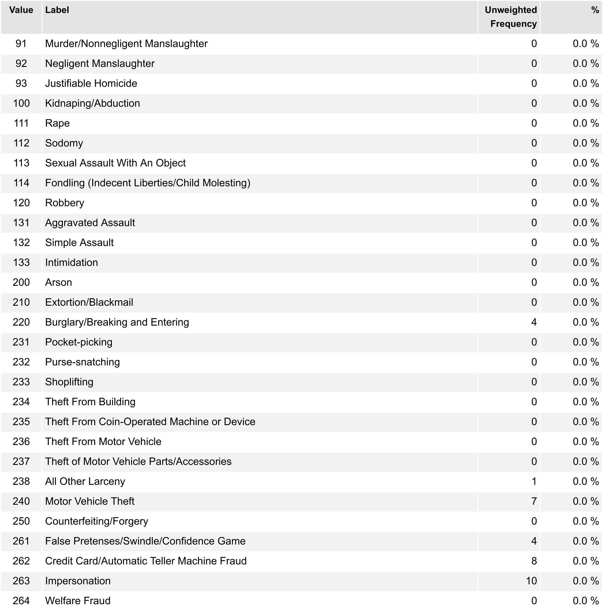                                                                                                                       |
|-----------------------------------------------------------------------------------------------------------------------------------------------|
| %s (\%)                                                                                                                                |
|-----------------------------------------------------------------------------------------------------------------------------------------------|


|                                                    | Unweighted Frequency | %    |
|----------------------------------------------------|----------------------|------|
| **265** Wire Fraud                                 | 3                    | 0.0% |
| **266** Identity Theft                             | 31                   | 0.0% |
| **267** Hacking/Computer Invasion                  | 9                    | 0.0% |
| **270** Embezzlement                               | 12                   | 0.0% |
| **280** Stolen Property Offenses                   | 33                   | 0.0% |
| **290** Destruction/Damage/Vandalism of Property   | 99                   | 0.0% |
| **351** Drug/Narcotic Violations                   | 0                    | 0.0% |
| **352** Drug Equipment Violations                  | 0                    | 0.0% |
| **361** Incest                                     | 0                    | 0.0% |
| **362** Statutory Rape                             | 0                    | 0.0% |
| **370** Pornography/Obscene Material               | 0                    | 0.0% |
| **391** Betting/Wagering                           | 0                    | 0.0% |
| **392** Operating/Promoting/Assisting Gambling     | 0                    | 0.0% |
| **393** Gambling Equipment Violations              | 0                    | 0.0% |
| **394** Sports Tampering                           | 0                    | 0.0% |
| **401** Prostitution                               | 0                    | 0.0% |
| **402** Assisting or Promoting Prostitution        | 0                    | 0.0% |
| **403** Purchasing Prostitution                    | 0                    | 0.0% |
| **510** Bribery                                    | 0                    | 0.0% |
| **520** Weapon Law Violations                      | 2                    | 0.0% |
| **641** Human Trafficking- Commercial Sex Acts     | 0                    | 0.0% |
| **Missing Data**                                   | .                    |      |
| **.** -                                            |                      |      |
| **Total**                                          | 11207411             | 100.0% |

Please note that only the first 50 response categories are displayed in the PDF codebook. To view all response categories, please analyze the data file in the statistical package of your choice (SAS, SPSS, Stata, R).

Based upon 223 valid cases out of 11,207,634 total cases.

- Minimum: 220.00
- Maximum: 520.00

**Location:** 709-711 (width: 3; decimal: 0)  
**Variable Type:** numeric  
**(Range of) Missing Values:** -9, -8, -7, -6, -5, .

---

### V40112: UCR OFFENSE CODE 5 - 2

|                                                    | Unweighted Frequency | %    |
|----------------------------------------------------|----------------------|------|
| **91**  Murder/Nonnegligent Manslaughter           | 0                    | 0.0% |
| **92**  Negligent Manslaughter                     | 0                    | 0.0% |
| **93**  Justifiable Homicide                       | 0                    | 0.0% |


## 202_0.png

|                                 | Unweighted Frequency | %    |
|---------------------------------|-----------------------|------|
| 100 Kidnaping/Abduction         | 0                     | 0.0% |
| 111 Rape                        | 0                     | 0.0% |
| 112 Sodomy                      | 0                     | 0.0% |
| 113 Sexual Assault With An Object | 0                   | 0.0% |
| 114 Fondling (Indecent Liberties/Child Molesting) | 0      | 0.0% |
| 120 Robbery                     | 0                     | 0.0% |
| 131 Aggravated Assault          | 0                     | 0.0% |
| 132 Simple Assault              | 0                     | 0.0% |
| 133 Intimidation                | 0                     | 0.0% |
| 200 Arson                       | 0                     | 0.0% |
| 210 Extortion/Blackmail         | 0                     | 0.0% |
| 220 Burglary/Breaking and Entering | 0                   | 0.0% |
| 231 Pocket-picking              | 0                     | 0.0% |
| 232 Purse-snatching             | 0                     | 0.0% |
| 233 Shoplifting                 | 0                     | 0.0% |
| 234 Theft From Building         | 0                     | 0.0% |
| 235 Theft From Coin-Operated Machine or Device | 0        | 0.0% |
| 236 Theft From Motor Vehicle    | 0                     | 0.0% |
| 237 Theft of Motor Vehicle Parts/Accessories | 0         | 0.0% |
| 238 All Other Larceny           | 0                     | 0.0% |
| 240 Motor Vehicle Theft         | 1                     | 0.0% |
| 250 Counterfeiting/Forgery      | 0                     | 0.0% |
| 261 False Pretenses/Swindle/Confidence Game | 1           | 0.0% |
| 262 Credit Card/Automatic Teller Machine Fraud | 3        | 0.0% |
| 263 Impersonation               | 0                     | 0.0% |
| 264 Welfare Fraud               | 0                     | 0.0% |
| 265 Wire Fraud                  | 0                     | 0.0% |
| 266 Identity Theft              | 5                     | 0.0% |
| 267 Hacking/Computer Invasion   | 1                     | 0.0% |
| 270 Embezzlement                | 1                     | 0.0% |
| 280 Stolen Property Offenses    | 9                     | 0.0% |
| 290 Destruction/Damage/Vandalism of Property | 13         | 0.0% |
| 351 Drug/Narcotic Violations    | 0                     | 0.0% |
| 352 Drug Equipment Violations   | 0                     | 0.0% |
| 361 Incest                      | 0                     | 0.0% |
| 362 Statutory Rape              | 0                     | 0.0% |
| 370 Pornography/Obscene Material | 0                    | 0.0% |
| 391 Betting/Wagering            | 0                     | 0.0% |
| 392 Operating/Promoting/Assisting Gambling | 0            | 0.0% |


### 203_0.png

|                                        | Unweighted Frequency | %     |
|----------------------------------------|----------------------|-------|
| 393 Gambling Equipment Violations      | 0                    | 0.0 % |
| 394 Sports Tampering                   | 0                    | 0.0 % |
| 401 Prostitution                       | 0                    | 0.0 % |
| 402 Assisting or Promoting Prostitution| 0                    | 0.0 % |
| 403 Purchasing Prostitution            | 0                    | 0.0 % |
| 510 Bribery                            | 0                    | 0.0 % |
| 520 Weapon Law Violations              | 0                    | 0.0 % |
| 641 Human Trafficking- Commercial Sex Acts| 0                  | 0.0 % |
| Missing Data                           | 11207600             | 100.0 % |
| Total                                  | 11,207,634           | 100%  |

Please note that only the first 50 response categories are displayed in the PDF codebook. To view all response categories, please analyze the data file in the statistical package of your choice (SAS, SPSS, Stata, R).

Based upon 34 valid cases out of 11,207,634 total cases.

- **Minimum:** 240.00
- **Maximum:** 290.00

Location: 712-714 (width: 3; decimal: 0)
Variable Type: numeric
(Range of) Missing Values: -9, -8, -7, -6, -5, .

---

### V40113: UCR OFFENSE CODE 5 - 3

### 203_1.png

|                                        | Unweighted Frequency | %     |
|----------------------------------------|----------------------|-------|
| 91  Murder/Nonnegligent Manslaughter   | 0                    | 0.0 % |
| 92  Negligent Manslaughter             | 0                    | 0.0 % |
| 93  Justifiable Homicide               | 0                    | 0.0 % |
| 100 Kidnaping/Abduction                | 0                    | 0.0 % |
| 111 Rape                               | 0                    | 0.0 % |
| 112 Sodomy                             | 0                    | 0.0 % |
| 113 Sexual Assault With An Object      | 0                    | 0.0 % |
| 114 Fondling (Indecent Liberties/Child Molesting) | 0         | 0.0 % |
| 120 Robbery                            | 0                    | 0.0 % |
| 131 Aggravated Assault                 | 0                    | 0.0 % |
| 132 Simple Assault                     | 0                    | 0.0 % |
| 133 Intimidation                       | 0                    | 0.0 % |
| 200 Arson                              | 0                    | 0.0 % |
| 210 Extortion/Blackmail                | 0                    | 0.0 % |
| 220 Burglary/Breaking and Entering     | 0                    | 0.0 % |
| 231 Pocket-picking                     | 0                    | 0.0 % |


|                            | Unweighted Frequency | %    |
|----------------------------|-----------------------|------|
| 232 Purse-snatching        | 0                     | 0.0 %|
| 233 Shoplifting            | 0                     | 0.0 %|
| 234 Theft From Building    | 0                     | 0.0 %|
| 235 Theft From Coin-Operated Machine or Device | 0   | 0.0 %|
| 236 Theft From Motor Vehicle | 0                   | 0.0 %|
| 237 Theft of Motor Vehicle Parts/Accessories | 0      | 0.0 %|
| 238 All Other Larceny      | 0                     | 0.0 %|
| 240 Motor Vehicle Theft    | 1                     | 0.0 %|
| 250 Counterfeiting/Forgery | 0                     | 0.0 %|
| 261 False Pretenses/Swindle/Confidence Game | 0     | 0.0 %|
| 262 Credit Card/Automatic Teller Machine Fraud | 0  | 0.0 %|
| 263 Impersonation          | 0                     | 0.0 %|
| 264 Welfare Fraud          | 0                     | 0.0 %|
| 265 Wire Fraud             | 0                     | 0.0 %|
| 266 Identity Theft         | 2                     | 0.0 %|
| 267 Hacking/Computer Invasion | 1                  | 0.0 %|
| 270 Embezzlement           | 0                     | 0.0 %|
| 280 Stolen Property Offenses | 4                   | 0.0 %|
| 290 Destruction/Damage/Vandalism of Property | 3    | 0.0 %|
| 351 Drug/Narcotic Violations | 0                   | 0.0 %|
| 352 Drug Equipment Violations | 0                  | 0.0 %|
| 361 Incest                 | 0                     | 0.0 %|
| 362 Statutory Rape         | 0                     | 0.0 %|
| 370 Pornography/Obscene Material | 0              | 0.0 %|
| 391 Betting/Wagering       | 0                     | 0.0 %|
| 392 Operating/Promoting/Assisting Gambling | 0     | 0.0 %|
| 393 Gambling Equipment Violations | 0             | 0.0 %|
| 394 Sports Tampering       | 0                     | 0.0 %|
| 401 Prostitution           | 0                     | 0.0 %|
| 402 Assisting or Promoting Prostitution | 1        | 0.0 %|
| 403 Purchasing Prostitution | 0                    | 0.0 %|
| 510 Bribery                | 0                     | 0.0 %|
| 520 Weapon Law Violations  | 0                     | 0.0 %|
| 641 Human Trafficking- Commercial Sex Acts | 0     | 0.0 %|

| Missing Data            | 11,207,622 | 100.0 % |
|------------------------|------------|---------|
| Total                  | 11,207,634 | 100%    |


Please note that only the first 50 response categories are displayed in the PDF codebook. To view all response categories, please analyze the data file in the statistical package of your choice (SAS, SPSS, Stata, R).

Based upon 12 valid cases out of 11,207,634 total cases.

- Minimum: 240.00
- Maximum: 402.00

Location: 715-717 (width: 3; decimal: 0)
Variable Type: numeric
(Range of) Missing Values: -9, -8, -7, -6, -5, .

---

### V40121: UCR OFFENSE CODE 6 - 1


|                     | Unweighted Frequency | %     |
|---------------------|----------------------|-------|
| 91  Murder/Nonnegligent Manslaughter      | 0                    | 0.0 % |
| 92  Negligent Manslaughter                | 0                    | 0.0 % |
| 93  Justifiable Homicide                  | 0                    | 0.0 % |
| 100 Kidnaping/Abduction                   | 0                    | 0.0 % |
| 111 Rape                                  | 0                    | 0.0 % |
| 112 Sodomy                                | 0                    | 0.0 % |
| 113 Sexual Assault With An Object         | 0                    | 0.0 % |
| 114 Fondling (Indecent Liberties/Child Molesting) | 0          | 0.0 % |
| 120 Robbery                               | 0                    | 0.0 % |
| 131 Aggravated Assault                    | 0                    | 0.0 % |
| 132 Simple Assault                        | 0                    | 0.0 % |
| 133 Intimidation                          | 0                    | 0.0 % |
| 200 Arson                                 | 0                    | 0.0 % |
| 210 Extortion/Blackmail                   | 0                    | 0.0 % |
| 220 Burglary/Breaking and Entering        | 0                    | 0.0 % |
| 231 Pocket-picking                        | 0                    | 0.0 % |
| 232 Purse-snatching                       | 0                    | 0.0 % |
| 233 Shoplifting                           | 0                    | 0.0 % |
| 234 Theft From Building                   | 0                    | 0.0 % |
| 235 Theft From Coin-Operated Machine or Device | 0                | 0.0 % |
| 236 Theft From Motor Vehicle              | 0                    | 0.0 % |
| 237 Theft of Motor Vehicle Parts/Accessories | 0                  | 0.0 % |
| 238 All Other Larceny                     | 0                    | 0.0 % |
| 240 Motor Vehicle Theft                   | 0                    | 0.0 % |
| 250 Counterfeiting/Forgery                | 0                    | 0.0 % |
| 261 False Pretenses/Swindle/Confidence Game | 0                  | 0.0 % |
| 262 Credit Card/Automatic Teller Machine Fraud | 0                | 0.0 % |
| 263 Impersonation                         | 0                    | 0.0 % |
| 264 Welfare Fraud                         | 0                    | 0.0 % |


### 206_0.png

|                      | Unweighted Frequency | %     |
|----------------------|----------------------|-------|
| 265  Wire Fraud      | 0                    | 0.0 % |
| 266  Identity Theft  | 0                    | 0.0 % |
| 267  Hacking/Computer Invasion | 0          | 0.0 % |
| 270  Embezzlement    | 0                    | 0.0 % |
| 280  Stolen Property Offenses | 14          | 0.0 % |
| 290  Destruction/Damage/Vandalism of Property | 8  | 0.0 % |
| 351  Drug/Narcotic Violations | 0           | 0.0 % |
| 352  Drug Equipment Violations | 0          | 0.0 % |
| 361  Incest         | 0                    | 0.0 % |
| 362  Statutory Rape | 0                    | 0.0 % |
| 370  Pornography/Obscene Material | 0       | 0.0 % |
| 391  Betting/Wagering | 0                   | 0.0 % |
| 392  Operating/Promoting/Assisting Gambling | 0     | 0.0 % |
| 393  Gambling Equipment Violations | 0      | 0.0 % |
| 394  Sports Tampering | 0                   | 0.0 % |
| 401  Prostitution  | 0                    | 0.0 % |
| 402  Assisting or Promoting Prostitution | 0 | 0.0 % |
| 403  Purchasing Prostitution | 0            | 0.0 % |
| 510  Bribery       | 0                    | 0.0 % |
| 520  Weapon Law Violations | 0             | 0.0 % |
| 641  Human Trafficking- Commercial Sex Acts | 0     | 0.0 % |
| Missing Data       | .                    | .     |
|                   | 11207612             | 100.0 % |
| **Total**           | **11,207,634**         | **100%**|

Please note that only the first 50 response categories are displayed in the PDF codebook. To view all response categories, please analyze the data file in the statistical package of your choice (SAS, SPSS, Stata, R).

Based upon 22 valid cases out of 11,207,634 total cases.

- Minimum: 280.00
- Maximum: 290.00

**Location:** 718-720 (width: 3; decimal: 0)  
**Variable Type:** numeric  
**(Range of) Missing Values:** -9, -8, -7, -6, -5, .

---

### V40122: UCR OFFENSE CODE 6 - 2
---

### 206_1.png

|                       | Unweighted Frequency | %     |
|-----------------------|----------------------|-------|
| 91   Murder/Nonnegligent Manslaughter | 0 | 0.0 % |
| 92   Negligent Manslaughter | 0          | 0.0 % |
| 93   Justifiable Homicide  | 0          | 0.0 % |


|  | Unweighted Frequency | % |
|---|----------------------|---|
| 100 | Kidnaping/Abduction              | 0       | 0.0 % |
| 111 | Rape                             | 0       | 0.0 % |
| 112 | Sodomy                           | 0       | 0.0 % |
| 113 | Sexual Assault With An Object    | 0       | 0.0 % |
| 114 | Fondling (Indecent Liberties/Child Molesting) | 0       | 0.0 % |
| 120 | Robbery                          | 0       | 0.0 % |
| 131 | Aggravated Assault               | 0       | 0.0 % |
| 132 | Simple Assault                   | 0       | 0.0 % |
| 133 | Intimidation                     | 0       | 0.0 % |
| 200 | Arson                            | 0       | 0.0 % |
| 210 | Extortion/Blackmail              | 0       | 0.0 % |
| 220 | Burglary/Breaking and Entering   | 0       | 0.0 % |
| 231 | Pocket-picking                   | 0       | 0.0 % |
| 232 | Purse-snatching                  | 0       | 0.0 % |
| 233 | Shoplifting                      | 0       | 0.0 % |
| 234 | Theft From Building              | 0       | 0.0 % |
| 235 | Theft From Coin-Operated Machine or Device | 0       | 0.0 % |
| 236 | Theft From Motor Vehicle         | 0       | 0.0 % |
| 237 | Theft of Motor Vehicle Parts/Accessories | 0       | 0.0 % |
| 238 | All Other Larceny                | 0       | 0.0 % |
| 240 | Motor Vehicle Theft              | 0       | 0.0 % |
| 250 | Counterfeiting/Forgery           | 0       | 0.0 % |
| 261 | False Pretenses/Swindle/Confidence Game | 0       | 0.0 % |
| 262 | Credit Card/Automatic Teller Machine Fraud | 0       | 0.0 % |
| 263 | Impersonation                    | 0       | 0.0 % |
| 264 | Welfare Fraud                    | 0       | 0.0 % |
| 265 | Wire Fraud                       | 0       | 0.0 % |
| 266 | Identity Theft                   | 0       | 0.0 % |
| 267 | Hacking/Computer Invasion        | 0       | 0.0 % |
| 270 | Embezzlement                     | 0       | 0.0 % |
| 280 | Stolen Property Offenses         | 1       | 0.0 % |
| 290 | Destruction/Damage/Vandalism of Property | 2       | 0.0 % |
| 351 | Drug/Narcotic Violations         | 0       | 0.0 % |
| 352 | Drug Equipment Violations        | 0       | 0.0 % |
| 361 | Incest                           | 0       | 0.0 % |
| 362 | Statutory Rape                   | 0       | 0.0 % |
| 370 | Pornography/Obscene Material     | 0       | 0.0 % |
| 391 | Betting/Wagering                 | 0       | 0.0 % |
| 392 | Operating/Promoting/Assisting Gambling | 0       | 0.0 % |


## 208_0.png

|           | Unweighted Frequency | %     |
|-----------|-----------------------|-------|
| 393       | Gambling Equipment Violations | 0 | 0.0 % |
| 394       | Sports Tampering | 0 | 0.0 % |
| 401       | Prostitution | 0 | 0.0 % |
| 402       | Assisting or Promoting Prostitution | 0 | 0.0 % |
| 403       | Purchasing Prostitution | 0 | 0.0 % |
| 510       | Bribery | 0 | 0.0 % |
| 520       | Weapon Law Violations | 0 | 0.0 % |
| 641       | Human Trafficking-Commercial Sex Acts | 0 | 0.0 % |
| Missing Data | 11207631 | 100.0 % |
| Total | 11,207,634 | 100% |


Please note that only the first 50 response categories are displayed in the PDF codebook. To view all response categories, please analyze the data file in the statistical package of your choice (SAS, SPSS, Stata, R).

Based upon 3 valid cases out of 11,207,634 total cases.

- Minimum: 280.00
- Maximum: 290.00

Location: 721-723 (width: 3; decimal: 0)  
Variable Type: numeric  
(Range of) Missing Values: -9, -8, -7, -6, -5, .

## V40123: UCR OFFENSE CODE 6 - 3

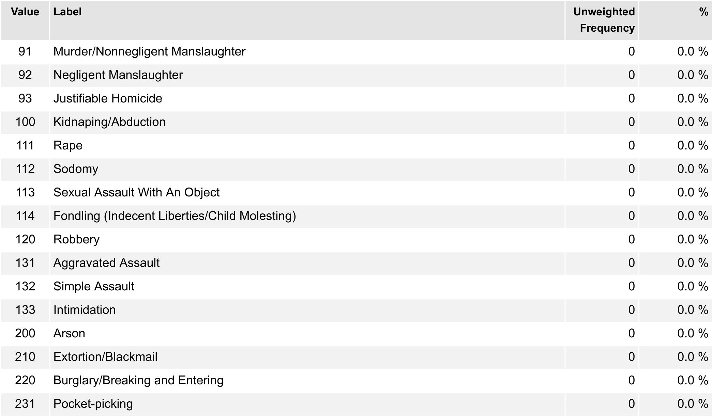


|                        | Unweighted Frequency | %     |
|------------------------|----------------------|-------|
| 232 Purse-snatching    | 0                    | 0.0 % |
| 233 Shoplifting        | 0                    | 0.0 % |
| 234 Theft From Building| 0                    | 0.0 % |
| 235 Theft From Coin-Operated Machine or Device | 0  | 0.0 % |
| 236 Theft From Motor Vehicle | 0               | 0.0 % |
| 237 Theft of Motor Vehicle Parts/Accessories | 0  | 0.0 % |
| 238 All Other Larceny  | 0                    | 0.0 % |
| 240 Motor Vehicle Theft | 0                   | 0.0 % |
| 250 Counterfeiting/Forgery | 0                | 0.0 % |
| 261 False Pretenses/Swindle/Confidence Game | 0| 0.0 % |
| 262 Credit Card/Automatic Teller Machine Fraud | 0   | 0.0 % |
| 263 Impersonation      | 0                    | 0.0 % |
| 264 Welfare Fraud      | 0                    | 0.0 % |
| 265 Wire Fraud         | 0                    | 0.0 % |
| 266 Identity Theft     | 0                    | 0.0 % |
| 267 Hacking/Computer Invasion | 0             | 0.0 % |
| 270 Embezzlement       | 0                    | 0.0 % |
| 280 Stolen Property Offenses | 2              | 0.0 % |
| 290 Destruction/Damage/Vandalism of Property | 1  | 0.0 % |
| 351 Drug/Narcotic Violations | 0              | 0.0 % |
| 352 Drug Equipment Violations | 0             | 0.0 % |
| 361 Incest             | 0                    | 0.0 % |
| 362 Statutory Rape     | 0                    | 0.0 % |
| 370 Pornography/Obscene Material | 0          | 0.0 % |
| 391 Betting/Wagering   | 0                    | 0.0 % |
| 392 Operating/Promoting/Assisting Gambling | 0  | 0.0 % |
| 393 Gambling Equipment Violations | 0         | 0.0 % |
| 394 Sports Tampering   | 0                    | 0.0 % |
| 401 Prostitution       | 0                    | 0.0 % |
| 402 Assisting or Promoting Prostitution | 0   | 0.0 % |
| 403 Purchasing Prostitution | 0               | 0.0 % |
| 510 Bribery            | 0                    | 0.0 % |
| 520 Weapon Law Violations | 0                 | 0.0 % |
| 641 Human Trafficking-Commercial Sex Acts | 0 | 0.0 % |
| .                      | 11207631             | 100.0 %|
| Missing Data           | .                    | .     |
| Total                  | 11,207,634           | 100%  |


Please note that only the first 50 response categories are displayed in the PDF codebook. To view all response categories, please analyze the data file in the statistical package of your choice (SAS, SPSS, Stata, R).

Based upon 3 valid cases out of 11,207,634 total cases.

- Minimum: 280.00
- Maximum: 290.00

Location: 724-726 (width: 3; decimal: 0)  
Variable Type: numeric  
(Range of) Missing Values: -9, -8, -7, -6, -5, .

## V40131: UCR OFFENSE CODE 7 - 1

|                    | Unweighted Frequency | %    |
|--------------------|----------------------|------|
| 91   Murder/Nonnegligent Manslaughter       | 0                    | 0.0% |
| 92   Negligent Manslaughter                 | 0                    | 0.0% |
| 93   Justifiable Homicide                   | 0                    | 0.0% |
| 100  Kidnaping/Abduction                    | 0                    | 0.0% |
| 111  Rape                                   | 0                    | 0.0% |
| 112  Sodomy                                 | 0                    | 0.0% |
| 113  Sexual Assault With An Object          | 0                    | 0.0% |
| 114  Fondling (Indecent Liberties/Child Molesting) | 0               | 0.0% |
| 120  Robbery                                | 0                    | 0.0% |
| 131  Aggravated Assault                     | 0                    | 0.0% |
| 132  Simple Assault                         | 0                    | 0.0% |
| 133  Intimidation                           | 0                    | 0.0% |
| 200  Arson                                  | 0                    | 0.0% |
| 210  Extortion/Blackmail                    | 0                    | 0.0% |
| 220  Burglary/Breaking and Entering         | 0                    | 0.0% |
| 231  Pocket-picking                         | 0                    | 0.0% |
| 232  Purse-snatching                        | 0                    | 0.0% |
| 233  Shoplifting                            | 0                    | 0.0% |
| 234  Theft From Building                    | 0                    | 0.0% |
| 235  Theft From Coin-Operated Machine or Device | 0                | 0.0% |
| 236  Theft From Motor Vehicle               | 0                    | 0.0% |
| 237  Theft of Motor Vehicle Parts/Accessories | 0                  | 0.0% |
| 238  All Other Larceny                      | 0                    | 0.0% |
| 240  Motor Vehicle Theft                    | 0                    | 0.0% |
| 250  Counterfeiting/Forgery                 | 0                    | 0.0% |
| 261  False Pretenses/Swindle/Confidence Game | 0                   | 0.0% |
| 262  Credit Card/Automatic Teller Machine Fraud | 0                | 0.0% |
| 263  Impersonation                          | 0                    | 0.0% |
| 264  Welfare Fraud                          | 0                    | 0.0% |


|       | Unweighted Frequency  | %     |
|-------|-----------------------|-------|
| 265   | Wire Fraud            | 0     | 0.0 % |
| 266   | Identity Theft        | 0     | 0.0 % |
| 267   | Hacking/Computer Invasion | 0 | 0.0 % |
| 270   | Embezzlement          | 0     | 0.0 % |
| 280   | Stolen Property Offenses | 0  | 0.0 % |
| 290   | Destruction/Damage/Vandalism of Property | 4 | 0.0 % |
| 351   | Drug/Narcotic Violations | 0  | 0.0 % |
| 352   | Drug Equipment Violations | 0 | 0.0 % |
| 361   | Incest                | 0     | 0.0 % |
| 362   | Statutory Rape        | 0     | 0.0 % |
| 370   | Pornography/Obscene Material | 0 | 0.0 % |
| 391   | Betting/Wagering      | 0     | 0.0 % |
| 392   | Operating/Promoting/Assisting Gambling | 0 | 0.0 % |
| 393   | Gambling Equipment Violations | 0 | 0.0 % |
| 394   | Sports Tampering      | 0     | 0.0 % |
| 401   | Prostitution          | 0     | 0.0 % |
| 402   | Assisting or Promoting Prostitution | 0 | 0.0 % |
| 403   | Purchasing Prostitution | 0   | 0.0 % |
| 510   | Bribery               | 0     | 0.0 % |
| 520   | Weapon Law Violations | 0     | 0.0 % |
| 641   | Human Trafficking- Commercial Sex Acts | 0 | 0.0 % |

|       |                       |       |
|-------|-----------------------|-------|
|       | Total                | 11207630 | 100.0 % |

Please note that only the first 50 response categories are displayed in the PDF codebook. To view all response categories, please analyze the data file in the statistical package of your choice (SAS, SPSS, Stata, R).

Based upon 4 valid cases out of 11,207,634 total cases.

- Minimum: 290.00
- Maximum: 290.00

Location: 727-729 (width: 3; decimal: 0)  
Variable Type: numeric  
(Range of) Missing Values: -9, -8, -7, -6, -5, .  


### V40132: UCR OFFENSE CODE 7 - 2

|       | Unweighted Frequency  | %     |
|-------|-----------------------|-------|
| 91    | Murder/Nonnegligent Manslaughter | 0 | 0.0 % |
| 92    | Negligent Manslaughter | 0    | 0.0 % |
| 93    | Justifiable Homicide  | 0     | 0.0 % |


| Unweighted Frequency | %  |
|--------------------- |----|
| 0                   | 0.0% |
| 0                   | 0.0% |
| 0                   | 0.0% |
| 0                   | 0.0% |
| 0                   | 0.0% |
| 0                   | 0.0% |
| 0                   | 0.0% |
| 0                   | 0.0% |
| 0                   | 0.0% |
| 0                   | 0.0% |
| 0                   | 0.0% |
| 0                   | 0.0% |
| 0                   | 0.0% |
| 0                   | 0.0% |
| 0                   | 0.0% |
| 0                   | 0.0% |
| 0                   | 0.0% |
| 0                   | 0.0% |
| 0                   | 0.0% |
| 0                   | 0.0% |
| 0                   | 0.0% |
| 0                   | 0.0% |
| 0                   | 0.0% |
| 0                   | 0.0% |
| 0                   | 0.0% |
| 0                   | 0.0% |
| 0                   | 0.0% |
| 0                   | 0.0% |
| 0                   | 0.0% |
| 0                   | 0.0% |


### 213_0.png

|                                              | Unweighted Frequency | %      |
|----------------------------------------------|----------------------|--------|
| 393  Gambling Equipment Violations           | 0                    | 0.0 %  |
| 394  Sports Tampering                        | 0                    | 0.0 %  |
| 401  Prostitution                            | 0                    | 0.0 %  |
| 402  Assisting or Promoting Prostitution     | 0                    | 0.0 %  |
| 403  Purchasing Prostitution                 | 0                    | 0.0 %  |
| 510  Bribery                                 | 0                    | 0.0 %  |
| 520  Weapon Law Violations                   | 0                    | 0.0 %  |
| 641  Human Trafficking- Commercial Sex Acts  | 0                    | 0.0 %  |
| **Missing Data**                             |                      |        |
| .                                            | 11207634             | 100.0 %|
| **Total**                                    | **11,207,634**       | **100%**|

*Please note that only the first 50 response categories are displayed in the PDF codebook. To view all response categories, please analyze the data file in the statistical package of your choice (SAS, SPSS, Stata, R).*

*Based upon 0 valid cases out of 11,207,634 total cases.*

*Location: 730-732 (width: 3; decimal: 0)  
Variable Type: numeric  
(Range of Missing Values: -9, -8, -7, -6, -5, .)*
  
### V40133: UCR OFFENSE CODE 7 - 3


### 213_1.png

|                                                | Unweighted Frequency | %      |
|------------------------------------------------|----------------------|--------|
| 91  Murder/Nonneglinent Manslaughter           | 0                    | 0.0 %  |
| 92  Negligent Manslaughter                     | 0                    | 0.0 %  |
| 93  Justifiable Homicide                       | 0                    | 0.0 %  |
| 100  Kidnaping/Abduction                       | 0                    | 0.0 %  |
| 111  Rape                                      | 0                    | 0.0 %  |
| 112  Sodomy                                    | 0                    | 0.0 %  |
| 113  Sexual Assault With An Object             | 0                    | 0.0 %  |
| 114  Fondling (Indecent Liberties/Child Molesting) | 0                    | 0.0 %  |
| 120  Robbery                                   | 0                    | 0.0 %  |
| 131  Aggravated Assault                        | 0                    | 0.0 %  |
| 132  Simple Assault                            | 0                    | 0.0 %  |
| 133  Intimidation                              | 0                    | 0.0 %  |
| 200  Arson                                     | 0                    | 0.0 %  |
| 210  Extortion/Blackmail                       | 0                    | 0.0 %  |
| 220  Burglary/Breaking and Entering            | 0                    | 0.0 %  |
| 231  Pocket-picking                            | 0                    | 0.0 %  |
| 232  Purse-snatching                           | 0                    | 0.0 %  |
| 233  Shoplifting                               | 0                    | 0.0 %  |


%  | Unweighted Frequency | %
---| ---------------------| ---
234 | Theft From Building                       | 0 | 0.0% 
235 | Theft From Coin-Operated Machine or Device | 0 | 0.0% 
236 | Theft From Motor Vehicle                  | 0 | 0.0% 
237 | Theft of Motor Vehicle Parts/Accessories  | 0 | 0.0% 
238 | All Other Larceny                         | 0 | 0.0% 
240 | Motor Vehicle Theft                       | 0 | 0.0% 
250 | Counterfeiting/Forgery                    | 0 | 0.0% 
261 | False Pretenses/Swindle/Confidence Game   | 0 | 0.0% 
262 | Credit Card/Automatic Teller Machine Fraud | 0 | 0.0% 
263 | Impersonation                             | 0 | 0.0% 
264 | Welfare Fraud                             | 0 | 0.0% 
265 | Wire Fraud                                | 0 | 0.0% 
266 | Identity Theft                            | 0 | 0.0% 
267 | Hacking/Computer Invasion                 | 0 | 0.0% 
270 | Embezzlement                              | 0 | 0.0% 
280 | Stolen Property Offenses                  | 0 | 0.0% 
290 | Destruction/Damage/Vandalism of Property  | 0 | 0.0% 
351 | Drug/Narcotic Violations                  | 0 | 0.0% 
352 | Drug Equipment Violations                 | 0 | 0.0% 
361 | Incest                                    | 0 | 0.0% 
362 | Statutory Rape                            | 0 | 0.0% 
370 | Pornography/Obscene Material              | 0 | 0.0% 
391 | Betting/Wagering                          | 0 | 0.0% 
392 | Operating/Promoting/Assisting Gambling    | 0 | 0.0% 
393 | Gambling Equipment Violations             | 0 | 0.0% 
394 | Sports Tampering                          | 0 | 0.0% 
401 | Prostitution                              | 0 | 0.0% 
402 | Assisting or Promoting Prostitution       | 0 | 0.0% 
403 | Purchasing Prostitution                   | 0 | 0.0% 
510 | Bribery                                   | 0 | 0.0% 
520 | Weapon Law Violations                     | 0 | 0.0% 
641 | Human Trafficking- Commercial Sex Acts    | 0 | 0.0% 

**Missing Data**

11207634 | 100.0% 

**Total**

11,207,634 | 100%

Please note that only the first 50 response categories are displayed in the PDF codebook. To view all response categories, please analyze the data file in the statistical package of your choice (SAS, SPSS, Stata, R).

Based upon 0 valid cases out of 11,207,634 total cases.

Location: 733-735 (width: 3; decimal: 0)

- 212 -


## V40141: UCR OFFENSE CODE 8 - 1

|                                             | Unweighted Frequency | %    |
|---------------------------------------------|----------------------|------|
| 91  Murder/Nonnegligent Manslaughter        | 0                    | 0.0% |
| 92  Negligent Manslaughter                  | 0                    | 0.0% |
| 93  Justifiable Homicide                    | 0                    | 0.0% |
| 100 Kidnaping/Abduction                     | 0                    | 0.0% |
| 111 Rape                                    | 0                    | 0.0% |
| 112 Sodomy                                  | 0                    | 0.0% |
| 113 Sexual Assault With An Object           | 0                    | 0.0% |
| 114 Fondling (Indecent Liberties/Child Molesting) | 0              | 0.0% |
| 120 Robbery                                 | 0                    | 0.0% |
| 131 Aggravated Assault                      | 0                    | 0.0% |
| 132 Simple Assault                          | 0                    | 0.0% |
| 133 Intimidation                            | 0                    | 0.0% |
| 200 Arson                                   | 0                    | 0.0% |
| 210 Extortion/Blackmail                     | 0                    | 0.0% |
| 220 Burglary/Breaking and Entering          | 0                    | 0.0% |
| 231 Pocket-picking                          | 0                    | 0.0% |
| 232 Purse-snatching                         | 0                    | 0.0% |
| 233 Shoplifting                             | 0                    | 0.0% |
| 234 Theft From Building                     | 0                    | 0.0% |
| 235 Theft From Coin-Operated Machine or Device | 0                | 0.0% |
| 236 Theft From Motor Vehicle                | 0                    | 0.0% |
| 237 Theft of Motor Vehicle Parts/Accessories | 0                   | 0.0% |
| 238 All Other Larceny                       | 0                    | 0.0% |
| 240 Motor Vehicle Theft                     | 0                    | 0.0% |
| 250 Counterfeiting/Forgery                  | 0                    | 0.0% |
| 261 False Pretenses/Swindle/Confidence Game | 0                    | 0.0% |
| 262 Credit Card/Automatic Teller Machine Fraud | 0                 | 0.0% |
| 263 Impersonation                           | 0                    | 0.0% |
| 264 Welfare Fraud                           | 0                    | 0.0% |
| 265 Wire Fraud                              | 0                    | 0.0% |
| 266 Identity Theft                          | 0                    | 0.0% |
| 267 Hacking/Computer Invasion               | 0                    | 0.0% |
| 270 Embezzlement                            | 0                    | 0.0% |
| 280 Stolen Property Offenses                | 0                    | 0.0% |
| 290 Destruction/Damage/Vandalism of Property | 0                   | 0.0% |


### 216_0.png

|                   | Unweighted Frequency | %     |
|-------------------|----------------------|-------|
| 351 Drug/Narcotic Violations     | 0                    | 0.0 % |
| 352 Drug Equipment Violations    | 0                    | 0.0 % |
| 361 Incest                       | 0                    | 0.0 % |
| 362 Statutory Rape               | 0                    | 0.0 % |
| 370 Pornography/Obscene Material | 0                    | 0.0 % |
| 391 Betting/Wagering             | 0                    | 0.0 % |
| 392 Operating/Promoting/Assisting Gambling | 0 | 0.0 % |
| 393 Gambling Equipment Violations | 0                   | 0.0 % |
| 394 Sports Tampering             | 0                    | 0.0 % |
| 401 Prostitution                 | 0                    | 0.0 % |
| 402 Assisting or Promoting Prostitution | 0             | 0.0 % |
| 403 Purchasing Prostitution      | 0                    | 0.0 % |
| 510 Bribery                      | 0                    | 0.0 % |
| 520 Weapon Law Violations        | 0                    | 0.0 % |
| 641 Human Trafficking- Commercial Sex Acts | 0         | 0.0 % |

| Missing Data                     | 11207634             | 100.0 % |
| Total                            | 11,207,634           | 100%    |

Please note that only the first 50 response categories are displayed in the PDF codebook. To view all response categories, please analyze the data file in the statistical package of your choice (SAS, SPSS, Stata, R).

Based upon 0 valid cases out of 11,207,634 total cases.

Location: 736-738 (width: 3; decimal: 0)
Variable Type: numeric
(Range of) Missing Values: -9, -8, -7, -6, -5, .

---

### V40142: UCR OFFENSE CODE 8 - 2

#### 216_1.png

|                                           | Unweighted Frequency | %     |
|-------------------------------------------|----------------------|-------|
| 91 Murder/Nonnegligent Manslaughter       | 0                    | 0.0 % |
| 92 Negligent Manslaughter                 | 0                    | 0.0 % |
| 93 Justifiable Homicide                   | 0                    | 0.0 % |
| 100 Kidnaping/Abduction                   | 0                    | 0.0 % |
| 111 Rape                                  | 0                    | 0.0 % |
| 112 Sodomy                                | 0                    | 0.0 % |
| 113 Sexual Assault With An Object         | 0                    | 0.0 % |
| 114 Fondling (Indecent Liberties/Child Molesting) | 0          | 0.0 % |
| 120 Robbery                               | 0                    | 0.0 % |
| 131 Aggravated Assault                    | 0                    | 0.0 % |
| 132 Simple Assault                        | 0                    | 0.0 % |


|                 | Unweighted Frequency | %    |
|-----------------|----------------------|------|
| 133 Intimidation| 0                    | 0.0% |
| 200 Arson       | 0                    | 0.0% |
| 210 Extortion/Blackmail | 0            | 0.0% |
| 220 Burglary/Breaking and Entering | 0 | 0.0% |
| 231 Pocket-picking     | 0             | 0.0% |
| 232 Purse-snatching    | 0             | 0.0% |
| 233 Shoplifting        | 0             | 0.0% |
| 234 Theft From Building| 0             | 0.0% |
| 235 Theft From Coin-Operated Machine or Device | 0 | 0.0% |
| 236 Theft From Motor Vehicle | 0       | 0.0% |
| 237 Theft of Motor Vehicle Parts/Accessories | 0 | 0.0% |
| 238 All Other Larceny  | 0             | 0.0% |
| 240 Motor Vehicle Theft| 0             | 0.0% |
| 250 Counterfeiting/Forgery | 0         | 0.0% |
| 261 False Pretenses/Swindle/Confidence Game | 0 | 0.0% |
| 262 Credit Card/Automatic Teller Machine Fraud | 0 | 0.0% |
| 263 Impersonation      | 0             | 0.0% |
| 264 Welfare Fraud      | 0             | 0.0% |
| 265 Wire Fraud         | 0             | 0.0% |
| 266 Identity Theft     | 0             | 0.0% |
| 267 Hacking/Computer Invasion | 0      | 0.0% |
| 270 Embezzlement       | 0             | 0.0% |
| 280 Stolen Property Offenses | 0       | 0.0% |
| 290 Destruction/Damage/Vandalism of Property | 0 | 0.0% |
| 351 Drug/Narcotic Violations | 0       | 0.0% |
| 352 Drug Equipment Violations | 0      | 0.0% |
| 361 Incest             | 0             | 0.0% |
| 362 Statutory Rape     | 0             | 0.0% |
| 370 Pornography/Obscene Material | 0   | 0.0% |
| 391 Betting/Wagering   | 0             | 0.0% |
| 392 Operating/Promoting/Assisting Gambling | 0 | 0.0% |
| 393 Gambling Equipment Violations | 0  | 0.0% |
| 394 Sports Tampering   | 0             | 0.0% |
| 401 Prostitution       | 0             | 0.0% |
| 402 Assisting or Promoting Prostitution | 0 | 0.0% |
| 403 Purchasing Prostitution | 0        | 0.0% |
| 510 Bribery            | 0             | 0.0% |
| 520 Weapon Law Violations | 0          | 0.0% |
| 641 Human Trafficking-Commercial Sex Acts | 0 | 0.0% |

- 215 -


### 218_0.png

|                          | Unweighted Frequency | %       |
|--------------------------|----------------------|---------|
| **Missing Data**         |                      |         |
| -                        | 11,207,634           | 100.0 % |
| **Total**                | 11,207,634           | 100%    |

Please note that only the first 50 response categories are displayed in the PDF codebook. To view all response categories, please analyze the data file in the statistical package of your choice (SAS, SPSS, Stata, R).

Based upon 0 valid cases out of 11,207,634 total cases.

*Location*: 739-741 (width: 3; decimal: 0)  
*Variable Type*: numeric  
*(Range of) Missing Values*: -9, -8, -7, -6, -5, .

### V40143: UCR OFFENSE CODE 8 - 3

### 218_1.png

|                                                   | Unweighted Frequency | %       |
|---------------------------------------------------|----------------------|---------|
| **91**  Murder/Nonnegligent Manslaughter          | 0                    | 0.0 %   |
| **92**  Negligent Manslaughter                     | 0                    | 0.0 %   |
| **93**  Justifiable Homicide                       | 0                    | 0.0 %   |
| **100** Kidnaping/Abduction                        | 0                    | 0.0 %   |
| **111** Rape                                       | 0                    | 0.0 %   |
| **112** Sodomy                                     | 0                    | 0.0 %   |
| **113** Sexual Assault With An Object              | 0                    | 0.0 %   |
| **114** Fondling (Indecent Liberties/Child Molesting) | 0                  | 0.0 %   |
| **120** Robbery                                    | 0                    | 0.0 %   |
| **131** Aggravated Assault                         | 0                    | 0.0 %   |
| **132** Simple Assault                             | 0                    | 0.0 %   |
| **133** Intimidation                               | 0                    | 0.0 %   |
| **200** Arson                                      | 0                    | 0.0 %   |
| **210** Extortion/Blackmail                        | 0                    | 0.0 %   |
| **220** Burglary/Breaking and Entering             | 0                    | 0.0 %   |
| **231** Pocket-picking                             | 0                    | 0.0 %   |
| **232** Purse-snatching                            | 0                    | 0.0 %   |
| **233** Shoplifting                                | 0                    | 0.0 %   |
| **234** Theft From Building                        | 0                    | 0.0 %   |
| **235** Theft From Coin-Operated Machine or Device | 0                    | 0.0 %   |
| **236** Theft From Motor Vehicle                   | 0                    | 0.0 %   |
| **237** Theft of Motor Vehicle Parts/Accessories   | 0                    | 0.0 %   |
| **238** All Other Larceny                          | 0                    | 0.0 %   |
| **240** Motor Vehicle Theft                        | 0                    | 0.0 %   |
| **250** Counterfeiting/Forgery                     | 0                    | 0.0 %   |
| **261** False Pretenses/Swindle/Confidence Game    | 0                    | 0.0 %   |


### 219_0.png

|                                                   | Unweighted Frequency | %     |
|---------------------------------------------------|----------------------|-------|
| **262** Credit Card/Automatic Teller Machine Fraud | 0                    | 0.0 % |
| **263** Impersonation                              | 0                    | 0.0 % |
| **264** Welfare Fraud                              | 0                    | 0.0 % |
| **265** Wire Fraud                                 | 0                    | 0.0 % |
| **266** Identity Theft                             | 0                    | 0.0 % |
| **267** Hacking/Computer Invasion                  | 0                    | 0.0 % |
| **270** Embezzlement                               | 0                    | 0.0 % |
| **280** Stolen Property Offenses                   | 0                    | 0.0 % |
| **290** Destruction/Damage/Vandalism of Property   | 0                    | 0.0 % |
| **351** Drug/Narcotic Violations                   | 0                    | 0.0 % |
| **352** Drug Equipment Violations                  | 0                    | 0.0 % |
| **361** Incest                                     | 0                    | 0.0 % |
| **362** Statutory Rape                             | 0                    | 0.0 % |
| **370** Pornography/Obscene Material               | 0                    | 0.0 % |
| **391** Betting/Wagering                           | 0                    | 0.0 % |
| **392** Operating/Promoting/Assisting Gambling     | 0                    | 0.0 % |
| **393** Gambling Equipment Violations              | 0                    | 0.0 % |
| **394** Sports Tampering                           | 0                    | 0.0 % |
| **401** Prostitution                               | 0                    | 0.0 % |
| **402** Assisting or Promoting Prostitution        | 0                    | 0.0 % |
| **403** Purchasing Prostitution                    | 0                    | 0.0 % |
| **510** Bribery                                    | 0                    | 0.0 % |
| **520** Weapon Law Violations                      | 0                    | 0.0 % |
| **641** Human Trafficking- Commercial Sex Acts     | 0                    | 0.0 % |

| Missing Data |                      |          |
|--------------|----------------------|----------|
| .            | 11207634             | 100.0 %  |

| Total        | 11,207,634           | 100%     |

Please note that only the first 50 response categories are displayed in the PDF codebook. To view all response categories, please analyze the data file in the statistical package of your choice (SAS, SPSS, Stata, R).

Based upon 0 valid cases out of 11,207,634 total cases.

Location: 742-744 (width: 3; decimal: 0)
Variable Type: numeric
(Range of) Missing Values: -9, -8, -7, -6, -5, .

---

### V40151: UCR OFFENSE CODE 9 - 1

#### 219_1.png

|                                                   | Unweighted Frequency | %       |
|---------------------------------------------------|----------------------|---------|
| **91** Murder/Nonnegligent Manslaughter           | 0                    | 0.0 %   |
| **92** Negligent Manslaughter                      | 0                    | 0.0 %   |


|                                | Unweighted Frequency | %    |
|--------------------------------|----------------------|------|
| 93  Justifiable Homicide       | 0                    | 0.0% |
| 100 Kidnaping/Abduction        | 0                    | 0.0% |
| 111 Rape                       | 0                    | 0.0% |
| 112 Sodomy                     | 0                    | 0.0% |
| 113 Sexual Assault With An Object | 0                | 0.0% |
| 114 Fondling (Indecent Liberties/Child Molesting) | 0    | 0.0% |
| 120 Robbery                    | 0                    | 0.0% |
| 131 Aggravated Assault         | 0                    | 0.0% |
| 132 Simple Assault             | 0                    | 0.0% |
| 133 Intimidation               | 0                    | 0.0% |
| 200 Arson                      | 0                    | 0.0% |
| 210 Extortion/Blackmail        | 0                    | 0.0% |
| 220 Burglary/Breaking and Entering | 0                | 0.0% |
| 231 Pocket-picking             | 0                    | 0.0% |
| 232 Purse-snatching            | 0                    | 0.0% |
| 233 Shoplifting                | 0                    | 0.0% |
| 234 Theft From Building        | 0                    | 0.0% |
| 235 Theft From Coin-Operated Machine or Device | 0      | 0.0% |
| 236 Theft From Motor Vehicle   | 0                    | 0.0% |
| 237 Theft of Motor Vehicle Parts/Accessories | 0       | 0.0% |
| 238 All Other Larceny          | 0                    | 0.0% |
| 240 Motor Vehicle Theft        | 0                    | 0.0% |
| 250 Counterfeiting/Forgery     | 0                    | 0.0% |
| 261 False Pretenses/Swindle/Confidence Game | 0        | 0.0% |
| 262 Credit Card/Automatic Teller Machine Fraud | 0     | 0.0% |
| 263 Impersonation              | 0                    | 0.0% |
| 264 Welfare Fraud              | 0                    | 0.0% |
| 265 Wire Fraud                 | 0                    | 0.0% |
| 266 Identity Theft             | 0                    | 0.0% |
| 267 Hacking/Computer Invasion  | 0                    | 0.0% |
| 270 Embezzlement               | 0                    | 0.0% |
| 280 Stolen Property Offenses   | 0                    | 0.0% |
| 290 Destruction/Damage/Vandalism of Property | 0       | 0.0% |
| 351 Drug/Narcotic Violations   | 0                    | 0.0% |
| 352 Drug Equipment Violations  | 0                    | 0.0% |
| 361 Incest                     | 0                    | 0.0% |
| 362 Statutory Rape             | 0                    | 0.0% |
| 370 Pornography/Obscene Material | 0                  | 0.0% |
| 391 Betting/Wagering           | 0                    | 0.0% |


### 221_0.png

|      | Unweighted Frequency | %     |
|------|-----------------------|-------|
| 392  | Operating/Promoting/Assisting Gambling | 0     | 0.0 % |
| 393  | Gambling Equipment Violations             | 0     | 0.0 % |
| 394  | Sports Tampering                          | 0     | 0.0 % |
| 401  | Prostitution                              | 0     | 0.0 % |
| 402  | Assisting or Promoting Prostitution       | 0     | 0.0 % |
| 403  | Purchasing Prostitution                   | 0     | 0.0 % |
| 510  | Bribery                                   | 0     | 0.0 % |
| 520  | Weapon Law Violations                     | 0     | 0.0 % |
| 641  | Human Trafficking- Commercial Sex Acts    | 0     | 0.0 % |

|      |                                           | 11,207,634 | 100.0 % |

**Total** | 11,207,634 | **100%**

---

Please note that only the first 50 response categories are displayed in the PDF codebook. To view all response categories, please analyze the data file in the statistical package of your choice (SAS, SPSS, Stata, R).

Based upon 0 valid cases out of 11,207,634 total cases.

**Location**: 745-747 (width: 3; decimal: 0)  
**Variable Type**: numeric  
(Range of) Missing Values: -9, -8, -7, -6, -5, .

---

### 221_1.png

|     | Unweighted Frequency | %     |
|-----|-----------------------|-------|
| 91  | Murder/Nonnegligent Manslaughter | 0     | 0.0 % |
| 92  | Negligent Manslaughter            | 0     | 0.0 % |
| 93  | Justifiable Homicide              | 0     | 0.0 % |
| 100 | Kidnaping/Abduction               | 0     | 0.0 % |
| 111 | Rape                              | 0     | 0.0 % |
| 112 | Sodomy                            | 0     | 0.0 % |
| 113 | Sexual Assault With An Object     | 0     | 0.0 % |
| 114 | Fondling (Indecent Liberties/Child Molesting) | 0 | 0.0 % |
| 120 | Robbery                           | 0     | 0.0 % |
| 131 | Aggravated Assault                | 0     | 0.0 % |
| 132 | Simple Assault                    | 0     | 0.0 % |
| 133 | Intimidation                      | 0     | 0.0 % |
| 200 | Arson                             | 0     | 0.0 % |
| 210 | Extortion/Blackmail               | 0     | 0.0 % |
| 220 | Burglary/Breaking and Entering    | 0     | 0.0 % |
| 231 | Pocket-picking                    | 0     | 0.0 % |
| 232 | Purse-snatching                   | 0     | 0.0 % |


|                                    | Unweighted Frequency | %      |
|------------------------------------|----------------------|--------|
| 233 Shoplifting                    | 0                    | 0.0 %  |
| 234 Theft From Building            | 0                    | 0.0 %  |
| 235 Theft From Coin-Operated Machine or Device | 0                    | 0.0 %  |
| 236 Theft From Motor Vehicle       | 0                    | 0.0 %  |
| 237 Theft of Motor Vehicle Parts/Accessories | 0                    | 0.0 %  |
| 238 All Other Larceny              | 0                    | 0.0 %  |
| 240 Motor Vehicle Theft            | 0                    | 0.0 %  |
| 250 Counterfeiting/Forgery         | 0                    | 0.0 %  |
| 261 False Pretenses/Swindle/Confidence Game | 0                    | 0.0 %  |
| 262 Credit Card/Automatic Teller Machine Fraud | 0                    | 0.0 %  |
| 263 Impersonation                  | 0                    | 0.0 %  |
| 264 Welfare Fraud                  | 0                    | 0.0 %  |
| 265 Wire Fraud                     | 0                    | 0.0 %  |
| 266 Identity Theft                 | 0                    | 0.0 %  |
| 267 Hacking/Computer Invasion      | 0                    | 0.0 %  |
| 270 Embezzlement                   | 0                    | 0.0 %  |
| 280 Stolen Property Offenses       | 0                    | 0.0 %  |
| 290 Destruction/Damage/Vandalism of Property | 0                    | 0.0 %  |
| 351 Drug/Narcotic Violations       | 0                    | 0.0 %  |
| 352 Drug Equipment Violations      | 0                    | 0.0 %  |
| 361 Incest                         | 0                    | 0.0 %  |
| 362 Statutory Rape                 | 0                    | 0.0 %  |
| 370 Pornography/Obscene Material   | 0                    | 0.0 %  |
| 391 Betting/Wagering               | 0                    | 0.0 %  |
| 392 Operating/Promoting/Assisting Gambling | 0                    | 0.0 %  |
| 393 Gambling Equipment Violations  | 0                    | 0.0 %  |
| 394 Sports Tampering               | 0                    | 0.0 %  |
| 401 Prostitution                   | 0                    | 0.0 %  |
| 402 Assisting or Promoting Prostitution | 0                    | 0.0 %  |
| 403 Purchasing Prostitution        | 0                    | 0.0 %  |
| 510 Bribery                        | 0                    | 0.0 %  |
| 520 Weapon Law Violations          | 0                    | 0.0 %  |
| 641 Human Trafficking-Commercial Sex Acts | 0                    | 0.0 %  |
|                                    | 11207634             | 100.0% |
| **Total**                          | **11,207,634**       | **100%** |

Please note that only the first 50 response categories are displayed in the PDF codebook. To view all response categories, please analyze the data file in the statistical package of your choice (SAS, SPSS, Stata, R).


Based upon 0 valid cases out of 11,207,634 total cases.

Location: 748-750 (width: 3; decimal: 0)
Variable Type: numeric
(Range of) Missing Values: -9, -8, -7, -6, -5, .

### V40153: UCR OFFENSE CODE 9 - 3

|                   | Unweighted Frequency | %     |
|-------------------|-----------------------|-------|
|  91  | Murder/Nonnegligent Manslaughter   | 0     | 0.0 % |
|  92  | Negligent Manslaughter             | 0     | 0.0 % |
|  93  | Justifiable Homicide               | 0     | 0.0 % |
| 100  | Kidnaping/Abduction                | 0     | 0.0 % |
| 111  | Rape                               | 0     | 0.0 % |
| 112  | Sodomy                             | 0     | 0.0 % |
| 113  | Sexual Assault With An Object      | 0     | 0.0 % |
| 114  | Fondling (Indecent Liberties/Child Molesting) | 0 | 0.0 % |
| 120  | Robbery                            | 0     | 0.0 % |
| 131  | Aggravated Assault                 | 0     | 0.0 % |
| 132  | Simple Assault                     | 0     | 0.0 % |
| 133  | Intimidation                       | 0     | 0.0 % |
| 200  | Arson                              | 0     | 0.0 % |
| 210  | Extortion/Blackmail                | 0     | 0.0 % |
| 220  | Burglary/Breaking and Entering     | 0     | 0.0 % |
| 231  | Pocket-picking                     | 0     | 0.0 % |
| 232  | Purse-snatching                    | 0     | 0.0 % |
| 233  | Shoplifting                        | 0     | 0.0 % |
| 234  | Theft From Building                | 0     | 0.0 % |
| 235  | Theft From Coin-Operated Machine or Device | 0 | 0.0 % |
| 236  | Theft From Motor Vehicle           | 0     | 0.0 % |
| 237  | Theft of Motor Vehicle Parts/Accessories | 0 | 0.0 % |
| 238  | All Other Larceny                  | 0     | 0.0 % |
| 240  | Motor Vehicle Theft                | 0     | 0.0 % |
| 250  | Counterfeiting/Forgery             | 0     | 0.0 % |
| 261  | False Pretenses/Swindle/Confidence Game | 0 | 0.0 % |
| 262  | Credit Card/Automatic Teller Machine Fraud | 0 | 0.0 % |
| 263  | Impersonation                      | 0     | 0.0 % |
| 264  | Welfare Fraud                      | 0     | 0.0 % |
| 265  | Wire Fraud                         | 0     | 0.0 % |
| 266  | Identity Theft                     | 0     | 0.0 % |
| 267  | Hacking/Computer Invasion          | 0     | 0.0 % |
| 270  | Embezzlement                       | 0     | 0.0 % |


|                                  | Unweighted Frequency | %     |
|----------------------------------|----------------------|-------|
| 280 Stolen Property Offenses     | 0                    | 0.0 % |
| 290 Destruction/Damage/Vandalism of Property | 0        | 0.0 % |
| 351 Drug/Narcotic Violations     | 0                    | 0.0 % |
| 352 Drug Equipment Violations    | 0                    | 0.0 % |
| 361 Incest                       | 0                    | 0.0 % |
| 362 Statutory Rape               | 0                    | 0.0 % |
| 370 Pornography/Obscene Material | 0                    | 0.0 % |
| 391 Betting/Wagering             | 0                    | 0.0 % |
| 392 Operating/Promoting/Assisting Gambling | 0          | 0.0 % |
| 393 Gambling Equipment Violations| 0                    | 0.0 % |
| 394 Sports Tampering             | 0                    | 0.0 % |
| 401 Prostitution                 | 0                    | 0.0 % |
| 402 Assisting or Promoting Prostitution | 0             | 0.0 % |
| 403 Purchasing Prostitution      | 0                    | 0.0 % |
| 510 Bribery                      | 0                    | 0.0 % |
| 520 Weapon Law Violations        | 0                    | 0.0 % |
| 641 Human Trafficking- Commercial Sex Acts | 0          | 0.0 % |
| Missing Data                     |                      |       |
| .                                |                      |       |
| .                                |                      |       |
| Total                            | 11207634             | 100.0 % |
| Total                            | 11,207,634           | 100%   |


Please note that only the first 50 response categories are displayed in the PDF codebook. To view all response categories, please analyze the data file in the statistical package of your choice (SAS, SPSS, Stata, R).

Based upon 0 valid cases out of 11,207,634 total cases.

Location: 751-753 (width: 3; decimal: 0)  
Variable Type: numeric  
(Range of Missing Values: -9 , -8 , -7 , -6 , -5 , .  

---

V40161: UCR OFFENSE CODE 10 - 1

|                                      | Unweighted Frequency | %     |
|--------------------------------------|----------------------|-------|
| 91  Murder/Nonnegligent Manslaughter | 0                    | 0.0 % |
| 92  Negligent Manslaughter           | 0                    | 0.0 % |
| 93  Justifiable Homicide             | 0                    | 0.0 % |
| 100 Kidnaping/Abduction              | 0                    | 0.0 % |
| 111 Rape                             | 0                    | 0.0 % |
| 112 Sodomy                           | 0                    | 0.0 % |
| 113 Sexual Assault With An Object    | 0                    | 0.0 % |
| 114 Fondling (Indecent Liberties/Child Molesting) | 0      | 0.0 % |
| 120 Robbery                          | 0                    | 0.0 % |


|                       | Unweighted Frequency | %   |
|-----------------------|----------------------|-----|
| 131 Aggravated Assault| 0                    | 0.0%|
| 132 Simple Assault    | 0                    | 0.0%|
| 133 Intimidation      | 0                    | 0.0%|
| 200 Arson             | 0                    | 0.0%|
| 210 Extortion/Blackmail| 0                   | 0.0%|
| 220 Burglary/Breaking and Entering| 0        | 0.0%|
| 231 Pocket-picking    | 0                    | 0.0%|
| 232 Purse-snatching   | 0                    | 0.0%|
| 233 Shoplifting       | 0                    | 0.0%|
| 234 Theft From Building| 0                   | 0.0%|
| 235 Theft From Coin-Operated Machine or Device | 0 | 0.0%|
| 236 Theft From Motor Vehicle | 0             | 0.0%|
| 237 Theft of Motor Vehicle Parts/Accessories | 0 | 0.0%|
| 238 All Other Larceny | 0                    | 0.0%|
| 240 Motor Vehicle Theft | 0                  | 0.0%|
| 250 Counterfeiting/Forgery | 0               | 0.0%|
| 261 False Pretenses/Swindle/Confidence Game | 0  | 0.0%|
| 262 Credit Card/Automatic Teller Machine Fraud | 0 | 0.0%|
| 263 Impersonation     | 0                    | 0.0%|
| 264 Welfare Fraud     | 0                    | 0.0%|
| 265 Wire Fraud        | 0                    | 0.0%|
| 266 Identity Theft    | 0                    | 0.0%|
| 267 Hacking/Computer Invasion | 0            | 0.0%|
| 270 Embezzlement      | 0                    | 0.0%|
| 280 Stolen Property Offenses | 0             | 0.0%|
| 290 Destruction/Damage/Vandalism of Property | 0 | 0.0%|
| 351 Drug/Narcotic Violations | 0             | 0.0%|
| 352 Drug Equipment Violations | 0            | 0.0%|
| 361 Incest            | 0                    | 0.0%|
| 362 Statutory Rape    | 0                    | 0.0%|
| 370 Pornography/Obscene Material | 0         | 0.0%|
| 391 Betting/Wagering | 0                     | 0.0%|
| 392 Operating/Promoting/Assisting Gambling | 0 | 0.0%|
| 393 Gambling Equipment Violations | 0        | 0.0%|
| 394 Sports Tampering  | 0                    | 0.0%|
| 401 Prostitution      | 0                    | 0.0%|
| 402 Assisting or Promoting Prostitution | 0  | 0.0%|
| 403 Purchasing Prostitution | 0              | 0.0%|
| 510 Bribery           | 0                    | 0.0%|


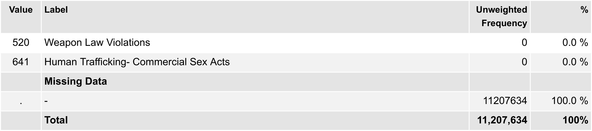

520 Weapon Law Violations | 0 | 0.0% 
--- | --- | --- 
641 Human Trafficking- Commercial Sex Acts | 0 | 0.0% 
Missing Data | |  
. | 11207634 | 100.0%  
Total | 11207634 | 100%

Please note that only the first 50 response categories are displayed in the PDF codebook. To view all response categories, please analyze the data file in the statistical package of your choice (SAS, SPSS, Stata, R). 

Based upon 0 valid cases out of 11,207,634 total cases. 

Location: 754-756 (width: 3; decimal: 0)  
Variable Type: numeric  
(Range of) Missing Values: -9, -8, -7, -6, -5, .  

-----

### V40162: UCR OFFENSE CODE 10 - 2

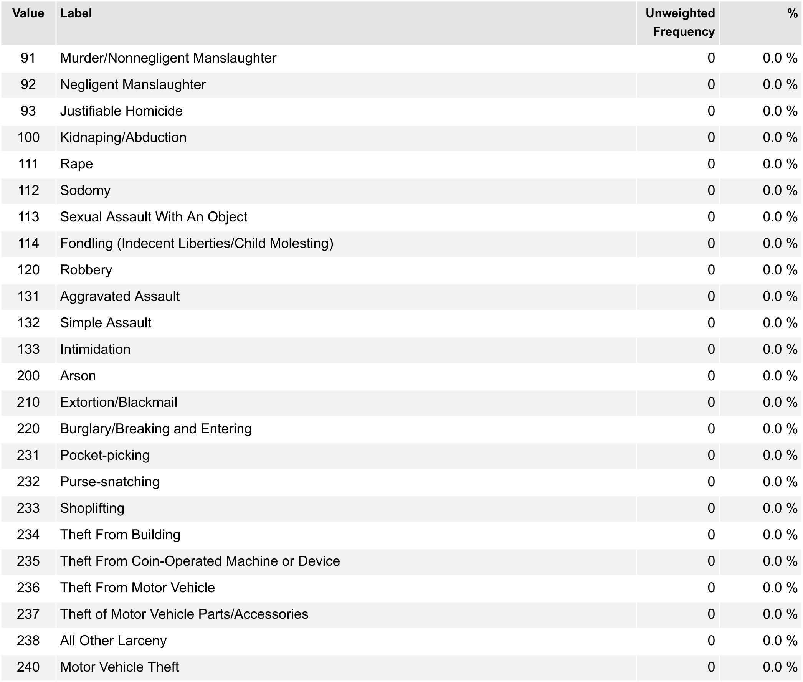

91 Murder/Nonnegligent Manslaughter | 0 | 0.0% 
--- | --- | --- 
92 Negligent Manslaughter | 0 | 0.0% 
93 Justifiable Homicide | 0 | 0.0% 
100 Kidnaping/Abduction | 0 | 0.0% 
111 Rape | 0 | 0.0% 
112 Sodomy | 0 | 0.0% 
113 Sexual Assault With An Object | 0 | 0.0% 
114 Fondling (Indecent Liberties/Child Molesting) | 0 | 0.0% 
120 Robbery | 0 | 0.0% 
131 Aggravated Assault | 0 | 0.0% 
132 Simple Assault | 0 | 0.0% 
133 Intimidation | 0 | 0.0% 
200 Arson | 0 | 0.0% 
210 Extortion/Blackmail | 0 | 0.0% 
220 Burglary/Breaking and Entering | 0 | 0.0% 
231 Pocket-picking | 0 | 0.0% 
232 Purse-snatching | 0 | 0.0% 
233 Shoplifting | 0 | 0.0% 
234 Theft From Building | 0 | 0.0% 
235 Theft From Coin-Operated Machine or Device | 0 | 0.0% 
236 Theft From Motor Vehicle | 0 | 0.0% 
237 Theft of Motor Vehicle Parts/Accessories | 0 | 0.0% 
238 All Other Larceny | 0 | 0.0% 
240 Motor Vehicle Theft | 0 | 0.0%


|                                             | Unweighted Frequency | %      |
|---------------------------------------------|----------------------|--------|
| 250 Counterfeiting/Forgery                  | 0                    | 0.0 %  |
| 261 False Pretenses/Swindle/Confidence Game | 0                    | 0.0 %  |
| 262 Credit Card/Automatic Teller Machine Fraud | 0                    | 0.0 %  |
| 263 Impersonation                           | 0                    | 0.0 %  |
| 264 Welfare Fraud                           | 0                    | 0.0 %  |
| 265 Wire Fraud                              | 0                    | 0.0 %  |
| 266 Identity Theft                          | 0                    | 0.0 %  |
| 267 Hacking/Computer Invasion               | 0                    | 0.0 %  |
| 270 Embezzlement                            | 0                    | 0.0 %  |
| 280 Stolen Property Offenses                | 0                    | 0.0 %  |
| 290 Destruction/Damage/Vandalism of Property | 0                    | 0.0 %  |
| 351 Drug/Narcotic Violations                | 0                    | 0.0 %  |
| 352 Drug Equipment Violations               | 0                    | 0.0 %  |
| 361 Incest                                  | 0                    | 0.0 %  |
| 362 Statutory Rape                          | 0                    | 0.0 %  |
| 370 Pornography/Obscene Material            | 0                    | 0.0 %  |
| 391 Betting/Wagering                        | 0                    | 0.0 %  |
| 392 Operating/Promoting/Assisting Gambling  | 0                    | 0.0 %  |
| 393 Gambling Equipment Violations           | 0                    | 0.0 %  |
| 394 Sports Tampering                        | 0                    | 0.0 %  |
| 401 Prostitution                            | 0                    | 0.0 %  |
| 402 Assisting or Promoting Prostitution     | 0                    | 0.0 %  |
| 403 Purchasing Prostitution                 | 0                    | 0.0 %  |
| 510 Bribery                                 | 0                    | 0.0 %  |
| 520 Weapon Law Violations                   | 0                    | 0.0 %  |
| 641 Human Trafficking- Commercial Sex Acts  | 0                    | 0.0 %  |

| Missing Data                                |                      |        |
|---------------------------------------------|----------------------|--------|
| .                                           | 11207634             | 100.0 %|
| Total                                       | 11,207,634           | 100%   |

Please note that only the first 50 response categories are displayed in the PDF codebook. To view all response categories, please analyze the data file in the statistical package of your choice (SAS, SPSS, Stata, R).

Based upon 0 valid cases out of 11,207,634 total cases.

Location: 757-759 (width: 3; decimal: 0)  
Variable Type: numeric  
(Range of) Missing Values: -9, -8, -7, -6, -5, .

V40163: UCR OFFENSE CODE 10 - 3


|                                   | Unweighted Frequency | %     |
|-----------------------------------|----------------------|-------|
| 91  Murder/Nonnegligent Manslaughter  | 0                    | 0.0 % |
| 92  Negligent Manslaughter             | 0                    | 0.0 % |
| 93  Justifiable Homicide                   | 0                    | 0.0 % |
| 100 Kidnaping/Abduction                | 0                    | 0.0 % |
| 111 Rape                                        | 0                    | 0.0 % |
| 112 Sodomy                                    | 0                    | 0.0 % |
| 113 Sexual Assault With An Object  | 0                    | 0.0 % |
| 114 Fondling (Indecent Liberties/Child Molesting) | 0    | 0.0 % |
| 120 Robbery                                  | 0                    | 0.0 % |
| 131 Aggravated Assault               | 0                    | 0.0 % |
| 132 Simple Assault                       | 0                    | 0.0 % |
| 133 Intimidation                           | 0                    | 0.0 % |
| 200 Arson                                     | 0                    | 0.0 % |
| 210 Extortion/Blackmail                | 0                    | 0.0 % |
| 220 Burglary/Breaking and Entering | 0                    | 0.0 % |
| 231 Pocket-picking                        | 0                    | 0.0 % |
| 232 Purse-snatching                     | 0                    | 0.0 % |
| 233 Shoplifting                              | 0                    | 0.0 % |
| 234 Theft From Building                 | 0                    | 0.0 % |
| 235 Theft From Coin-Operated Machine or Device | 0      | 0.0 % |
| 236 Theft From Motor Vehicle     | 0                    | 0.0 % |
| 237 Theft of Motor Vehicle Parts/Accessories | 0            | 0.0 % |
| 238 All Other Larceny                    | 0                    | 0.0 % |
| 240 Motor Vehicle Theft               | 0                    | 0.0 % |
| 250 Counterfeiting/Forgery           | 0                    | 0.0 % |
| 261 False Pretenses/Swindle/Confidence Game | 0          | 0.0 % |
| 262 Credit Card/Automatic Teller Machine Fraud | 0       | 0.0 % |
| 263 Impersonation                       | 0                    | 0.0 % |
| 264 Welfare Fraud                        | 0                    | 0.0 % |
| 265 Wire Fraud                                | 0                    | 0.0 % |
| 266 Identity Theft                          | 0                    | 0.0 % |
| 267 Hacking/Computer Invasion  | 0                    | 0.0 % |
| 270 Embezzlement                       | 0                    | 0.0 % |
| 280 Stolen Property Offenses       | 0                    | 0.0 % |
| 290 Destruction/Damage/Vandalism of Property | 0         | 0.0 % |
| 351 Drug/Narcotic Violations       | 0                    | 0.0 % |
| 352 Drug Equipment Violations   | 0                    | 0.0 % |
| 361 Incest                                    | 0                    | 0.0 % |
| 362 Statutory Rape                        | 0                    | 0.0 % |


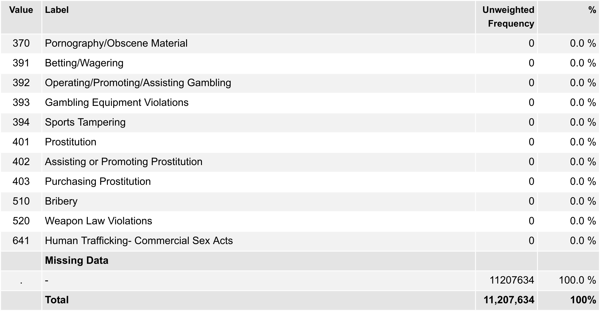

|                                       | Unweighted Frequency | %      |
|---------------------------------------|----------------------|--------|
| 370 Pornography/Obscene Material      | 0                    | 0.0 %  |
| 391 Betting/Wagering                  | 0                    | 0.0 %  |
| 392 Operating/Promoting/Assisting Gambling | 0              | 0.0 %  |
| 393 Gambling Equipment Violations     | 0                    | 0.0 %  |
| 394 Sports Tampering                  | 0                    | 0.0 %  |
| 401 Prostitution                      | 0                    | 0.0 %  |
| 402 Assisting or Promoting Prostitution | 0                   | 0.0 %  |
| 403 Purchasing Prostitution           | 0                    | 0.0 %  |
| 510 Bribery                           | 0                    | 0.0 %  |
| 520 Weapon Law Violations             | 0                    | 0.0 %  |
| 641 Human Trafficking- Commercial Sex Acts | 0               | 0.0 %  |
| Missing Data                          | 11207634             | 100.0 %|
| Total                                 | 11,207,634          | 100%   |

Please note that only the first 50 response categories are displayed in the PDF codebook. To view all response categories, please analyze the data file in the statistical package of your choice (SAS, SPSS, Stata, R).

Based upon 0 valid cases out of 11,207,634 total cases.

Location: 760-762 (width: 3; decimal: 0)
Variable Type: numeric
(Range of) Missing Values: -9, -8, -7, -6, -5, .

---

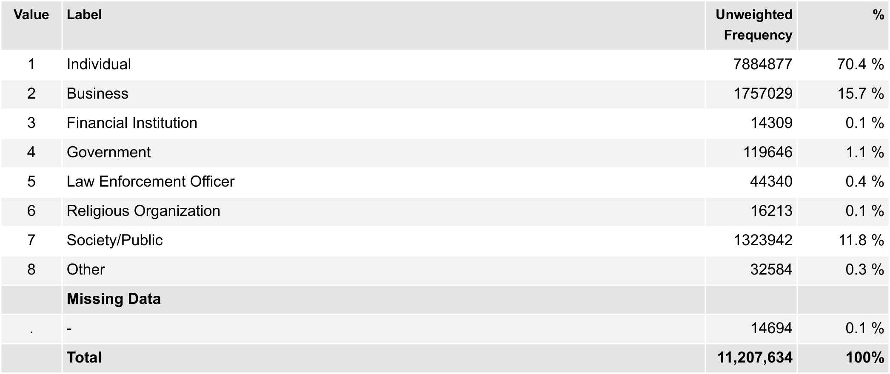

|                         | Unweighted Frequency | %      |
|-------------------------|----------------------|--------|
| 1 Individual            | 7884877              | 70.4 % |
| 2 Business              | 1757029              | 15.7 % |
| 3 Financial Institution | 14309                | 0.1 %  |
| 4 Government            | 119646               | 1.1 %  |
| 5 Law Enforcement Officer | 44340              | 0.4 %  |
| 6 Religious Organization | 16213               | 0.1 %  |
| 7 Society/Public        | 1323942              | 11.8 % |
| 8 Other                 | 32584                | 0.3 %  |
| Missing Data            | 14694                | 0.1 %  |
| Total                   | 11,207,634           | 100%   |

Based upon 11,192,940 valid cases out of 11,207,634 total cases.

- Minimum: 1.00
- Maximum: 8.00

Location: 763-764 (width: 2; decimal: 0)

- 227 -


## V40172: TYPE OF VICTIM - 2

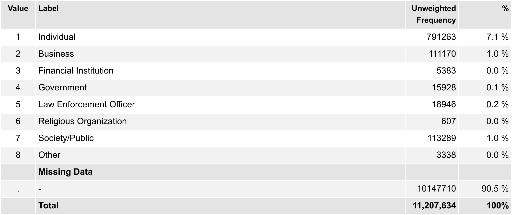

Based upon 1,059,924 valid cases out of 11,207,634 total cases.

- Minimum: 1.00
- Maximum: 8.00

Location: 765-766 (width: 2; decimal: 0)
Variable Type: numeric
(Range of) Missing Values: -9, -7, -6, .

## V40173: TYPE OF VICTIM - 3

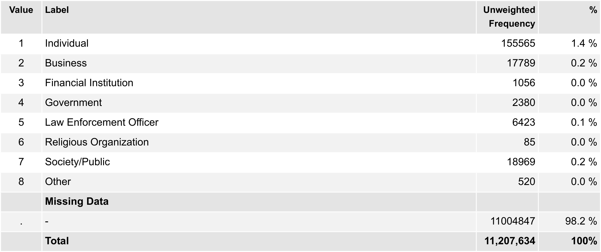

Based upon 202,787 valid cases out of 11,207,634 total cases.

- Minimum: 1.00


### V4017A1: TYPE OF ACTIVITY (OFFICER) - 1
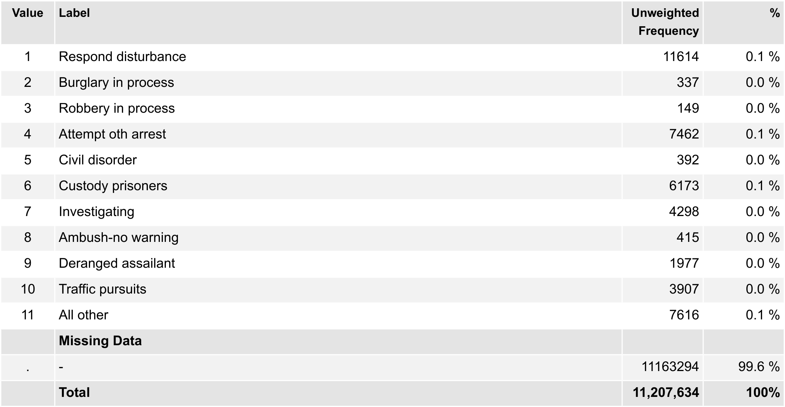

1. **Respond disturbance** | Unweighted Frequency: 11614 | %: 0.1 %
2. **Burglary in process** | Unweighted Frequency: 337 | %: 0.0 %
3. **Robbery in process** | Unweighted Frequency: 149 | %: 0.0 %
4. **Attempt oth arrest** | Unweighted Frequency: 7462 | %: 0.1 %
5. **Civil disorder** | Unweighted Frequency: 392 | %: 0.0 %
6. **Custody prisoners** | Unweighted Frequency: 6173 | %: 0.1 %
7. **Investigating** | Unweighted Frequency: 4298 | %: 0.0 %
8. **Ambush-no warning** | Unweighted Frequency: 415 | %: 0.0 %
9. **Deranged assailant** | Unweighted Frequency: 1977 | %: 0.0 %
10. **Traffic pursuits** | Unweighted Frequency: 3907 | %: 0.0 %
11. **All other** | Unweighted Frequency: 7616 | %: 0.1 %

**Missing Data**
- Unweighted Frequency: 11163294 | %: 99.6 %

**Total**
- Unweighted Frequency: 11,207,634 | %: 100 %

---

**Based upon 44,340 valid cases out of 11,207,634 total cases.**

- **Minimum:** 1.00
- **Maximum:** 11.00

---

### V4017A2: TYPE OF ACTIVITY (OFFICER) - 2
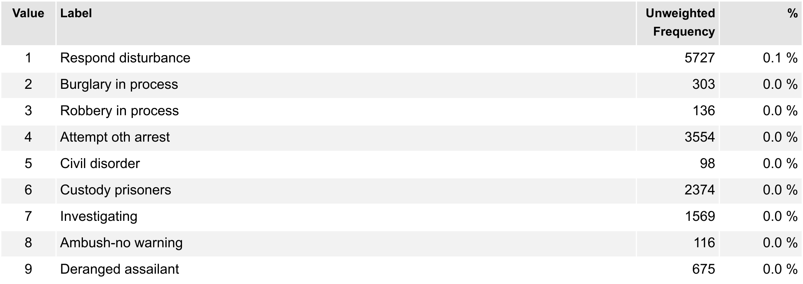

1. **Respond disturbance** | Unweighted Frequency: 5727 | %: 0.1 %
2. **Burglary in process** | Unweighted Frequency: 303 | %: 0.0 %
3. **Robbery in process** | Unweighted Frequency: 136 | %: 0.0 %
4. **Attempt oth arrest** | Unweighted Frequency: 3554 | %: 0.0 %
5. **Civil disorder** | Unweighted Frequency: 98 | %: 0.0 %
6. **Custody prisoners** | Unweighted Frequency: 2374 | %: 0.0 %
7. **Investigating** | Unweighted Frequency: 1569 | %: 0.0 %
8. **Ambush-no warning** | Unweighted Frequency: 116 | %: 0.0 %
9. **Deranged assailant** | Unweighted Frequency: 675 | %: 0.0 %


### 232_0.png

|                           | Unweighted Frequency | %        |
|---------------------------|----------------------|----------|
| 10 Traffic pursuits       | 1674                 | 0.0 %    |
| 11 All other              | 2720                 | 0.0 %    |
| Missing Data              |                      |          |
| . -                       |                      |          |
| Total                     | 1118688              | 99.8 %   |
|                           | 11,207,634           | 100%     |

Based upon 18,946 valid cases out of 11,207,634 total cases.

- Minimum: 1.00
- Maximum: 11.00

*Location: 771-772 (width: 2; decimal: 0)*
*Variable Type: numeric*
*(Range of) Missing Values: -9, -7, -6, .*

### V4017A3: TYPE OF ACTIVITY (OFFICER) - 3

### 232_1.png

|                           | Unweighted Frequency | %        |
|---------------------------|----------------------|----------|
| 1 Respond disturbance     | 2120                 | 0.0 %    |
| 2 Burglary in process     | 116                  | 0.0 %    |
| 3 Robbery in process      | 75                   | 0.0 %    |
| 4 Attempt oth arrest      | 1179                 | 0.0 %    |
| 5 Civil disorder          | 38                   | 0.0 %    |
| 6 Custody prisoners       | 812                  | 0.0 %    |
| 7 Investigating           | 472                  | 0.0 %    |
| 8 Ambush-no warning       | 38                   | 0.0 %    |
| 9 Deranged assailant      | 235                  | 0.0 %    |
| 10 Traffic pursuits       | 516                  | 0.0 %    |
| 11 All other              | 822                  | 0.0 %    |
| Missing Data              |                      |          |
| . -                       |                      |          |
| Total                     | 11201211             | 99.9 %   |
|                           | 11,207,634           | 100%     |

Based upon 6,423 valid cases out of 11,207,634 total cases.

- Minimum: 1.00
- Maximum: 11.00

*Location: 773-774 (width: 2; decimal: 0)*
*Variable Type: numeric*
*(Range of) Missing Values: -9, -7, -6, .*


|                          | Unweighted Frequency | %      |
|--------------------------|----------------------|--------|
| 1  Two-officer vehicle   | 4943                 | 0.0 %  |
| 2  1 officer veh (alone) | 14837                | 0.1 %  |
| 3  1 officer veh (assist)| 13456                | 0.1 %  |
| 4  Detective or Spec assign (alone) | 549     | 0.0 %  |
| 5  Detective or Spec assign (assist)| 859      | 0.0 %  |
| 6  Other (alone)         | 3197                 | 0.0 %  |
| 7  Other (assisted)      | 6499                 | 0.1 %  |
| Missing Data             | .                    |        |
| .                        | 11163294             | 99.6 % |
| Total                    | 11,207,634           | 100%   |

Based upon 44,340 valid cases out of 11,207,634 total cases.

- Minimum: 1.00
- Maximum: 7.00

*Location: 775-776 (width: 2; decimal: 0)*
*Variable Type: numeric*
*(Range of) Missing Values: -9, -7, -6, .*

---

**V4017B2: ASSIGNMENT TYPE (OFFICER) - 2**

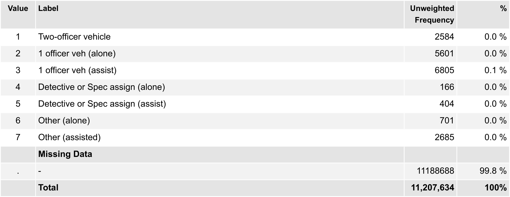

|                          | Unweighted Frequency | %      |
|--------------------------|----------------------|--------|
| 1  Two-officer vehicle   | 2584                 | 0.0 %  |
| 2  1 officer veh (alone) | 5601                 | 0.0 %  |
| 3  1 officer veh (assist)| 6805                 | 0.1 %  |
| 4  Detective or Spec assign (alone) | 166      | 0.0 %  |
| 5  Detective or Spec assign (assist)| 404      | 0.0 %  |
| 6  Other (alone)         | 701                  | 0.0 %  |
| 7  Other (assisted)      | 2685                 | 0.0 %  |
| Missing Data             | .                    |        |
| .                        | 11188688             | 99.8 % |
| Total                    | 11,207,634           | 100%   |

Based upon 18,946 valid cases out of 11,207,634 total cases.

- Minimum: 1.00
- Maximum: 7.00

*Location: 777-778 (width: 2; decimal: 0)*
*Variable Type: numeric*
*(Range of) Missing Values: -9, -7, -6, .*


## 1. Two-officer vehicle
    Unweighted Frequency: 827  
    %: 0.0 %

## 2. 1 officer veh (alone)
    Unweighted Frequency: 1780  
    %: 0.0 %

## 3. 1 officer veh (assist)
    Unweighted Frequency: 2354  
    %: 0.0 %

## 4. Detective or Spec assign (alone)
    Unweighted Frequency: 58  
    %: 0.0 %

## 5. Detective or Spec assign (assist)
    Unweighted Frequency: 184  
    %: 0.0 %

## 6. Other (alone)
    Unweighted Frequency: 210  
    %: 0.0 %

## 7. Other (assisted)
    Unweighted Frequency: 1010  
    %: 0.0 %

## Missing Data
    Unweighted Frequency: 11201211  
    %: 99.9 %

## Total
    Unweighted Frequency: 11,207,634  
    %: 100 %  

Based upon 6,423 valid cases out of 11,207,634 total cases.

- Minimum: 1.00
- Maximum: 7.00

*Location:* 779-780 (width: 2; decimal: 0)  
*Variable Type:* numeric  
*(Range of) Missing Values:* -9, -7, -6, .  


## V4017C1: ORI OTHER JURISDICTION (OFFICER) - 1

| Label      | Unweighted Frequency | %    |
|------------|----------------------|------|
| AK0010300  | 1                    | 0.0 %|
| AK0010400  | 1                    | 0.0 %|
| AK0015600  | 1                    | 0.0 %|
| AL0010000  | 9                    | 0.0 %|
| AL0020000  | 6                    | 0.0 %|
| AL0020700  | 1                    | 0.0 %|
| AL0050000  | 1                    | 0.0 %|
| AL0070200  | 1                    | 0.0 %|
| AL0110400  | 1                    | 0.0 %|
| AL0130000  | 1                    | 0.0 %|
| AL0281000  | 1                    | 0.0 %|
| AL0370000  | 1                    | 0.0 %|
| AL0380100  | 1                    | 0.0 %|
| AL0410000  | 1                    | 0.0 %|
| AL0420200  | 1                    | 0.0 %|
| AL0450000  | 1                    | 0.0 %|
| AL0460100  | 1                    | 0.0 %|
| AL0470500  | 1                    | 0.0 %|
| AL0520900  | 1                    | 0.0 %|


| Label     | Unweighted Frequency | %     |
|-----------|----------------------|-------|
| AL0550000 | 1                    | 0.0 % |
| AL0580400 | 1                    | 0.0 % |
| AL0620200 | 1                    | 0.0 % |
| AL0630100 | 1                    | 0.0 % |
| AR0040000 | 4                    | 0.0 % |
| AR0041600 | 1                    | 0.0 % |
| AR0170100 | 1                    | 0.0 % |
| AR0280000 | 4                    | 0.0 % |
| AR0280100 | 3                    | 0.0 % |
| AR0460100 | 1                    | 0.0 % |
| AR0600000 | 6                    | 0.0 % |
| AR0600200 | 32                   | 0.0 % |
| AR0600900 | 2                    | 0.0 % |
| AR0702000 | 6                    | 0.0 % |
| AR0730100 | 1                    | 0.0 % |
| AZ0020000 | 1                    | 0.0 % |
| AZ0020500 | 4                    | 0.0 % |
| AZ0070300 | 1                    | 0.0 % |
| AZ0070500 | 1                    | 0.0 % |
| AZ0070700 | 1                    | 0.0 % |
| AZ0071100 | 3                    | 0.0 % |
| AZ0076200 | 2                    | 0.0 % |
| AZ0079700 | 7                    | 0.0 % |
| AZ0079900 | 1                    | 0.0 % |
| AZ0090100 | 1                    | 0.0 % |
| AZ0098900 | 2                    | 0.0 % |
| AZ0100900 | 4                    | 0.0 % |
| AZ0111500 | 24                   | 0.0 % |
| AZ0130700 | 1                    | 0.0 % |
| AZCBP1600 | 1                    | 0.0 % |
| AZDI0660  | 1                    | 0.0 % |
| Missing Data |                  |       |
| -6 Not applicable | 11203389     | 100.0 % |
| Total     | 11,207,634           | 100%  |

Please note that only the first 50 response categories are displayed in the PDF codebook. To view all response categories, please analyze the data file in the statistical package of your choice (SAS, SPSS, Stata, R).

Based upon 4,245 valid cases out of 11,207,634 total cases.

Location: 781-789 (width: 9; decimal: 0)\
Variable Type: character

- 233 -


(Range of) Missing Values: -6

V4017C2: ORI OTHER JURISDICTION (OFFICER) - 2

| Label   | Unweighted Frequency | %    |
|---------|----------------------|------|
| AK0010300 | - | 1 | 0.0 % |
| AK0011700 | - | 1 | 0.0 % |
| AK0012200 | - | 1 | 0.0 % |
| AL0020000 | - | 2 | 0.0 % |
| AL0020200 | - | 1 | 0.0 % |
| AL0021500 | - | 1 | 0.0 % |
| AL0020100 | - | 1 | 0.0 % |
| AL0370000 | - | 1 | 0.0 % |
| AL0410600 | - | 1 | 0.0 % |
| AL0480000 | - | 1 | 0.0 % |
| AR0040000 | - | 2 | 0.0 % |
| AR0041300 | - | 1 | 0.0 % |
| AR0280000 | - | 1 | 0.0 % |
| AR0280100 | - | 2 | 0.0 % |
| AR0600000 | - | 2 | 0.0 % |
| AR0600200 | - | 14 | 0.0 % |
| AR0720000 | - | 1 | 0.0 % |
| AR0720200 | - | 4 | 0.0 % |
| AZ0020000 | - | 2 | 0.0 % |
| AZ0020500 | - | 1 | 0.0 % |
| AZ0030800 | - | 1 | 0.0 % |
| AZ0070700 | - | 1 | 0.0 % |
| AZ0079700 | - | 3 | 0.0 % |
| AZ0098900 | - | 3 | 0.0 % |
| AZ0110100 | - | 1 | 0.0 % |
| AZ0111500 | - | 7 | 0.0 % |
| AZ0130700 | - | 1 | 0.0 % |
| CA0070100 | - | 3 | 0.0 % |
| CA0070400 | - | 1 | 0.0 % |
| CA0070500 | - | 1 | 0.0 % |
| CA0070800 | - | 1 | 0.0 % |
| CA0071100 | - | 1 | 0.0 % |
| CA0071600 | - | 1 | 0.0 % |
| CA0079920 | - | 2 | 0.0 % |
| CA0120000 | - | 2 | 0.0 % |
| CA0150300 | - | 1 | 0.0 % |


| Label      | Unweighted Frequency | %    |
|------------|----------------------|------|
| CA0190200  | 5                    | 0.0 %|
| CA0190900  | 1                    | 0.0 %|
| CA0191200  | 14                   | 0.0 %|
| CA0192300  | 2                    | 0.0 %|
| CA0195300  | 1                    | 0.0 %|
| CA0195500  | 1                    | 0.0 %|
| CA0195600  | 1                    | 0.0 %|
| CA0196300  | 1                    | 0.0 %|
| CA0196400  | 1                    | 0.0 %|
| CA0197500  | 1                    | 0.0 %|
| CA0197600  | 1                    | 0.0 %|
| CA0199940  | 1                    | 0.0 %|
| CA019A900  | 2                    | 0.0 %|
| CA0209950  | 1                    | 0.0 %|

| Missing Data   |                    |        |
|----------------|--------------------|--------|
| -6             | Not applicable     | 11206142 | 100.0 % |

| Total          |                    | 11,207,634 | 100 % |

Please note that only the first 50 response categories are displayed in the PDF codebook. To view all response categories, please analyze the data file in the statistical package of your choice (SAS, SPSS, Stata, R).

Based upon 1,492 valid cases out of 11,207,634 total cases.

Location: 790-798 (width: 9; decimal: 0)  
Variable Type: character  
(Range of Missing Values: -6)

### V4017C3: ORI OTHER JURISDICTION (OFFICER) - 3

| Label      | Unweighted Frequency | %    |
|------------|----------------------|------|
| AK0012200  | 1                    | 0.0 %|
| AL0020000  | 4                    | 0.0 %|
| AL0240200  | 1                    | 0.0 %|
| AR0600000  | 1                    | 0.0 %|
| AR0600200  | 5                    | 0.0 %|
| AR0702200  | 1                    | 0.0 %|
| AZ0111500  | 2                    | 0.0 %|
| CA0070400  | 1                    | 0.0 %|
| CA0071100  | 1                    | 0.0 %|
| CA0190200  | 1                    | 0.0 %|
| CA0191200  | 6                    | 0.0 %|
| CA0192300  | 1                    | 0.0 %|


| Label      |         | Unweighted Frequency | %   |
|------------|---------|-----------------------|-----|
| CA0197600  | -       | 1                     | 0.0 % |
| CA0210900  | -       | 1                     | 0.0 % |
| CA0280800  | -       | 3                     | 0.0 % |
| CA0290000  | -       | 1                     | 0.0 % |
| CA0302200  | -       | 1                     | 0.0 % |
| CA0360500  | -       | 1                     | 0.0 % |
| CA0390500  | -       | 2                     | 0.0 % |
| CA0400000  | -       | 1                     | 0.0 % |
| CA0400100  | -       | 1                     | 0.0 % |
| CA040015M  | -       | 4                     | 0.0 % |
| CA0400800  | -       | 2                     | 0.0 % |
| CA0431000  | -       | 3                     | 0.0 % |
| CA0431600  | -       | 1                     | 0.0 % |
| CA0440000  | -       | 2                     | 0.0 % |
| CA0480000  | -       | 1                     | 0.0 % |
| CA0520000  | -       | 1                     | 0.0 % |
| CO0160200  | -       | 1                     | 0.0 % |
| CO0210200  | -       | 1                     | 0.0 % |
| CO0350000  | -       | 3                     | 0.0 % |
| CO0390100  | -       | 1                     | 0.0 % |
| CT0010600  | -       | 1                     | 0.0 % |
| DE0010100  | -       | 4                     | 0.0 % |
| DE0010300  | -       | 2                     | 0.0 % |
| DE0010400  | -       | 1                     | 0.0 % |
| DE0020300  | -       | 19                    | 0.0 % |
| DE0020500  | -       | 1                     | 0.0 % |
| DE0020600  | -       | 4                     | 0.0 % |
| DE0030100  | -       | 1                     | 0.0 % |
| DE0030300  | -       | 2                     | 0.0 % |
| DE0030500  | -       | 1                     | 0.0 % |
| DE0030800  | -       | 1                     | 0.0 % |
| DE0031500  | -       | 1                     | 0.0 % |
| DE301SP00  | -       | 4                     | 0.0 % |
| DE302SP00  | -       | 6                     | 0.0 % |
| DE303SP00  | -       | 6                     | 0.0 % |
| FL0063400  | -       | 3                     | 0.0 % |
| FL0110000  | -       | 1                     | 0.0 % |
| FL0110300  | -       | 1                     | 0.0 % |

**Missing Data**

- 236 -


### 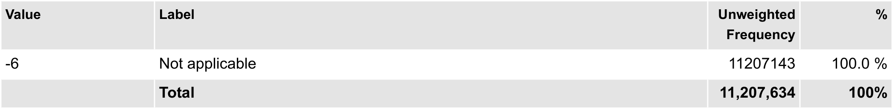
| Label              | Unweighted Frequency | %       |
|--------------------|----------------------|---------|
| -6 Not applicable  | 11207143             | 100.0 % |
| **Total**          | **11,207,634**       | **100%**|

Please note that only the first 50 response categories are displayed in the PDF codebook. To view all response categories, please analyze the data file in the statistical package of your choice (SAS, SPSS, Stata, R).

Based upon 491 valid cases out of 11,207,634 total cases.

Location: 799-807 (width: 9; decimal: 0)  
Variable Type: character  
(Range of) Missing Values: -6

### V40181: AGE OF VICTIM - 1

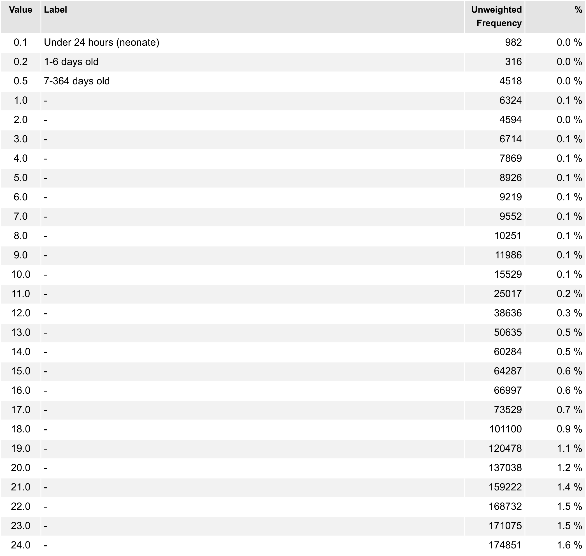


|       | Unweighted Frequency | %      |
|-------|----------------------|--------|
| 25.0  | 178903               | 1.6 %  |
| 26.0  | 177270               | 1.6 %  |
| 27.0  | 184384               | 1.6 %  |
| 28.0  | 184634               | 1.6 %  |
| 29.0  | 189509               | 1.7 %  |
| 30.0  | 196098               | 1.7 %  |
| 31.0  | 193212               | 1.7 %  |
| 32.0  | 196492               | 1.8 %  |
| 33.0  | 185738               | 1.7 %  |
| 34.0  | 182061               | 1.6 %  |
| 35.0  | 179218               | 1.6 %  |
| 36.0  | 174137               | 1.6 %  |
| 37.0  | 172328               | 1.5 %  |
| 38.0  | 163622               | 1.5 %  |
| 39.0  | 161229               | 1.4 %  |
| 40.0  | 161142               | 1.4 %  |
| 41.0  | 153331               | 1.4 %  |
| 42.0  | 151825               | 1.4 %  |
| 43.0  | 139089               | 1.2 %  |
| 44.0  | 132720               | 1.2 %  |
| 45.0  | 129331               | 1.2 %  |
| 46.0  | 118804               | 1.1 %  |
| 47.0  | 118744               | 1.1 %  |

| **Missing Data** |        |        |
|------------------|--------|--------|
| -7.0             | Unknown/missing/DNR | 101433 | 0.9 % |

|        | -      | 3278417 | 29.3 %       |
| ------ | ------ | ------- | ------------ |
| **Total** | **11,207,634** | **100%** |

Please note that only the first 50 response categories are displayed in the PDF codebook. To view all response categories, please analyze the data file in the statistical package of your choice (SAS, SPSS, Stata, R).

Based upon 7,827,784 valid cases out of 11,207,634 total cases.

- **Mean**: 40.14
- **Median**: 38.00
- **Mode**: 32.00
- **Minimum**: 0.10
- **Maximum**: 99.00
- **Standard Deviation**: 17.06

**Location**: 808-811 (width: 4; decimal: 1)  
**Variable Type**: numeric  
**(Range of) Missing Values**: -9.0, -8.0, -7.0, -6.0, -5.0, .


## V40182: AGE OF VICTIM - 2

|                 | Unweighted Frequency | %    |
|-----------------|-----------------------|------|
| 0.1  | Under 24 hours (neonate)   | 187   | 0.0 % |
| 0.2  | 1-6 days old               | 50    | 0.0 % |
| 0.5  | 7-364 days old             | 2556  | 0.0 % |
| 1.0  |                            | 3210  | 0.0 % |
| 2.0  |                            | 2628  | 0.0 % |
| 3.0  |                            | 2675  | 0.0 % |
| 4.0  |                            | 2605  | 0.0 % |
| 5.0  |                            | 2689  | 0.0 % |
| 6.0  |                            | 2682  | 0.0 % |
| 7.0  |                            | 2824  | 0.0 % |
| 8.0  |                            | 2965  | 0.0 % |
| 9.0  |                            | 3328  | 0.0 % |
| 10.0 |                            | 3914  | 0.0 % |
| 11.0 |                            | 5255  | 0.0 % |
| 12.0 |                            | 7364  | 0.1 % |
| 13.0 |                            | 9409  | 0.1 % |
| 14.0 |                            | 11165 | 0.1 % |
| 15.0 |                            | 12340 | 0.1 % |
| 16.0 |                            | 13020 | 0.1 % |
| 17.0 |                            | 13746 | 0.1 % |
| 18.0 |                            | 14677 | 0.1 % |
| 19.0 |                            | 15635 | 0.1 % |
| 20.0 |                            | 16736 | 0.1 % |
| 21.0 |                            | 18442 | 0.2 % |
| 22.0 |                            | 18873 | 0.2 % |
| 23.0 |                            | 18336 | 0.2 % |
| 24.0 |                            | 18500 | 0.2 % |
| 25.0 |                            | 19003 | 0.2 % |
| 26.0 |                            | 17991 | 0.2 % |
| 27.0 |                            | 18633 | 0.2 % |
| 28.0 |                            | 18211 | 0.2 % |
| 29.0 |                            | 18202 | 0.2 % |
| 30.0 |                            | 19461 | 0.2 % |
| 31.0 |                            | 18126 | 0.2 % |
| 32.0 |                            | 18680 | 0.2 % |
| 33.0 |                            | 17192 | 0.2 % |
| 34.0 |                            | 16776 | 0.1 % |


### 242_0.png

|    | Unweighted Frequency | %   |
|----|-----------------------|-----|
| 35.0 | 16742 | 0.1 % |
| 36.0 | 15358 | 0.1 % |
| 37.0 | 15539 | 0.1 % |
| 38.0 | 14742 | 0.1 % |
| 39.0 | 14561 | 0.1 % |
| 40.0 | 14942 | 0.1 % |
| 41.0 | 13649 | 0.1 % |
| 42.0 | 13742 | 0.1 % |
| 43.0 | 12334 | 0.1 % |
| 44.0 | 11739 | 0.1 % |
| 45.0 | 11646 | 0.1 % |
| 46.0 | 10538 | 0.1 % |
| 47.0 | 10731 | 0.1 % |

#### Missing Data

|    |   |
|----|---|
| -7.0 | Unknown/missing/DNR | 21677 | 0.2 % |
| . | 10397425 | 92.8 % |

#### Total

|    | 11,207,634 | 100% |

Please note that only the first 50 response categories are displayed in the PDF codebook. To view all response categories, please analyze the data file in the statistical package of your choice (SAS, SPSS, Stata, R).

Based upon 788,532 valid cases out of 11,207,634 total cases.

- Mean: 36.21
- Median: 34.00
- Mode: 30.00
- Minimum: 0.10
- Maximum: 99.00
- Standard Deviation: 17.57

Location: 812-815 (width: 4; decimal: 1)
Variable Type: numeric
(Range of) Missing Values: -9.0, -8.0, -7.0, -6.0, -5.0, . 

### V40183: AGE OF VICTIM - 3

### 242_1.png

|    | Unweighted Frequency | %   |
|----|-----------------------|-----|
| 0.1 | Under 24 hours (neonate) | 77 | 0.0 % |
| 0.2 | 1-6 days old | 15 | 0.0 % |
| 0.5 | 7-364 days old | 1027 | 0.0 % |
| 1.0 | 1402 | 0.0 % |
| 2.0 | 1372 | 0.0 % |
| 3.0 | 1324 | 0.0 % |
| 4.0 | 1307 | 0.0 % |


|        | Unweighted Frequency |  %  |
|--------|----------------------|-----|
| 5.0    | 1325                 | 0.0 % |
| 6.0    | 1273                 | 0.0 % |
| 7.0    | 1283                 | 0.0 % |
| 8.0    | 1282                 | 0.0 % |
| 9.0    | 1422                 | 0.0 % |
| 10.0   | 1496                 | 0.0 % |
| 11.0   | 1769                 | 0.0 % |
| 12.0   | 2160                 | 0.0 % |
| 13.0   | 2637                 | 0.0 % |
| 14.0   | 3019                 | 0.0 % |
| 15.0   | 3373                 | 0.0 % |
| 16.0   | 3478                 | 0.0 % |
| 17.0   | 3524                 | 0.0 % |
| 18.0   | 3679                 | 0.0 % |
| 19.0   | 3469                 | 0.0 % |
| 20.0   | 3432                 | 0.0 % |
| 21.0   | 3820                 | 0.0 % |
| 22.0   | 3734                 | 0.0 % |
| 23.0   | 3567                 | 0.0 % |
| 24.0   | 3430                 | 0.0 % |
| 25.0   | 3540                 | 0.0 % |
| 26.0   | 3287                 | 0.0 % |
| 27.0   | 3373                 | 0.0 % |
| 28.0   | 3263                 | 0.0 % |
| 29.0   | 3196                 | 0.0 % |
| 30.0   | 3578                 | 0.0 % |
| 31.0   | 3036                 | 0.0 % |
| 32.0   | 3139                 | 0.0 % |
| 33.0   | 2883                 | 0.0 % |
| 34.0   | 2789                 | 0.0 % |
| 35.0   | 2900                 | 0.0 % |
| 36.0   | 2553                 | 0.0 % |
| 37.0   | 2566                 | 0.0 % |
| 38.0   | 2392                 | 0.0 % |
| 39.0   | 2472                 | 0.0 % |
| 40.0   | 2582                 | 0.0 % |
| 41.0   | 2197                 | 0.0 % |
| 42.0   | 2294                 | 0.0 % |
| 43.0   | 2020                 | 0.0 % |


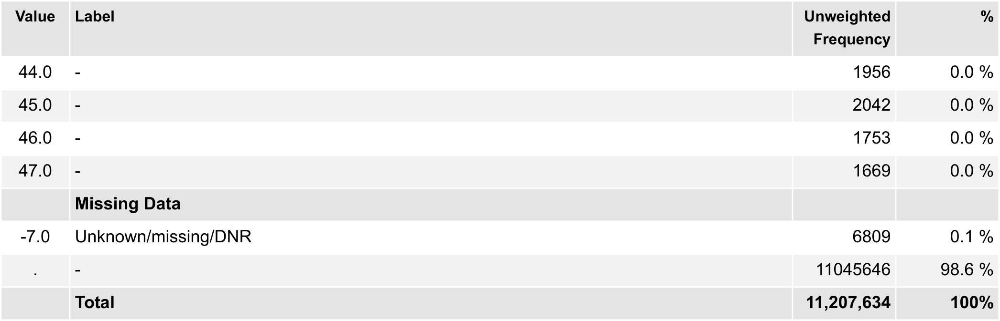

Please note that only the first 50 response categories are displayed in the PDF codebook. To view all response categories, please analyze the data file in the statistical package of your choice (SAS, SPSS, Stata, R).

Based upon 155,179 valid cases out of 11,207,634 total cases.

- Mean: 32.56
- Median: 30.00
- Mode: 21.00
- Minimum: 0.10
- Maximum: 99.00
- Standard Deviation: 18.35

Location: 816-819 (width: 4; decimal: 1)  
Variable Type: numeric  
(Range of) Missing Values: -9.0, -8.0, -7.0, -6.0, -5.0, .

V40191: SEX OF VICTIM - 1

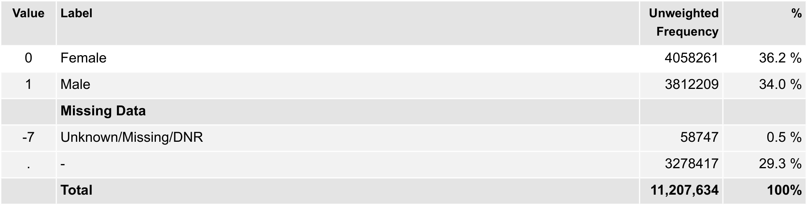

Based upon 7,870,470 valid cases out of 11,207,634 total cases.

- Minimum: 0.00
- Maximum: 1.00

Location: 820-821 (width: 2; decimal: 0)  
Variable Type: numeric  
(Range of) Missing Values: -9, -7, -6, .

V40192: SEX OF VICTIM - 2


## 0.png

|                | Unweighted Frequency | %    |
|----------------|----------------------|------|
| 0 Female       | 374714               | 3.3% |
| 1 Male         | 424288               | 3.8% |
| Missing Data   |                      |      |
| -7 Unknown/Missing/DNR | 11207        | 0.1% |
| .              |                      |      |
| Total          | 10397425             | 92.8%|
|                | 11,207,634           | 100% |

Based upon 799,002 valid cases out of 11,207,634 total cases.

- Minimum: 0.00
- Maximum: 1.00

*Location:* 822-823 (width: 2; decimal: 0)  
*Variable Type:* numeric  
*(Range of) Missing Values:* -9, -7, -6, .

---

## V40193: SEX OF VICTIM - 3

### 1.png

|                | Unweighted Frequency | %    |
|----------------|----------------------|------|
| 0 Female       | 72183                | 0.6% |
| 1 Male         | 86354                | 0.8% |
| Missing Data   |                      |      |
| -7 Unknown/Missing/DNR | 3451          | 0.0% |
| .              |                      |      |
| Total          | 11045646             | 98.6%|
|                | 11,207,634           | 100% |

Based upon 158,537 valid cases out of 11,207,634 total cases.

- Minimum: 0.00
- Maximum: 1.00

*Location:* 824-825 (width: 2; decimal: 0)  
*Variable Type:* numeric  
*(Range of) Missing Values:* -9, -7, -6, .

---

## V40201: RACE OF VICTIM - 1

### 2.png

|                                            | Unweighted Frequency | %     |
|--------------------------------------------|----------------------|-------|
| 1 White                                    | 5123455              | 45.7% |
| 2 Black or African American                | 1982781              | 17.7% |
| 3 American Indian or Alaska Native         | 77283                | 0.7%  |
| 4 Asian                                    | 205772               | 1.8%  |
| 5 Native Hawaiian or Other Pacific Islander| 22850                | 0.2%  |
| Missing Data                               |                      |       |
| -7 Unknown/missing/DNR                     | 517076               | 4.6%  |


246_0.png

|            | Unweighted Frequency | %       |
|------------|-----------------------|---------|
| . -        | 3278417               | 29.3 %  |
| **Total**  | **11,207,634**        | **100%**|

Based upon 7,412,141 valid cases out of 11,207,634 total cases.

- Minimum: 1.00
- Maximum: 5.00

Location: 826-827 (width: 2; decimal: 0)  
Variable Type: numeric  
(Range of) Missing Values: -9, -8, -7, -6, -5, .  

---

V40202: RACE OF VICTIM - 2

246_1.png

|            | Unweighted Frequency | %        |
|------------|-----------------------|----------|
| 1 White    | 513793               | 4.6 %   |
| 2 Black or African American | 207067       | 1.8 %    |
| 3 American Indian or Alaska Native | 7974  | 0.1 %    |
| 4 Asian    | 21544                 | 0.2 %    |
| 5 Native Hawaiian or Other Pacific Islander | 2544 | 0.0 %    |
| **Missing Data** | | |
| -7 Unknown/missing/DNR | 57287     | 0.5 %   |
| . -        | 10397425              | 92.8 %  |
| **Total**  | **11,207,634**        | **100%**|

Based upon 752,922 valid cases out of 11,207,634 total cases.

- Minimum: 1.00
- Maximum: 5.00

Location: 828-829 (width: 2; decimal: 0)  
Variable Type: numeric  
(Range of) Missing Values: -9, -8, -7, -6, -5, .  

---

V40203: RACE OF VICTIM - 3

246_2.png

|            | Unweighted Frequency | %        |
|------------|-----------------------|----------|
| 1 White    | 97478                 | 0.9 %    |
| 2 Black or African American | 43878         | 0.4 %    |
| 3 American Indian or Alaska Native | 1499   | 0.0 %    |
| 4 Asian    | 4173                  | 0.0 %    |
| 5 Native Hawaiian or Other Pacific Islander | 499 | 0.0 %    |
| **Missing Data** | | |
| -7 Unknown/missing/DNR | 14461     | 0.1 %    |
| . -        | 11045646              | 98.6 %   |
| **Total**  | **11,207,634**        | **100%**|


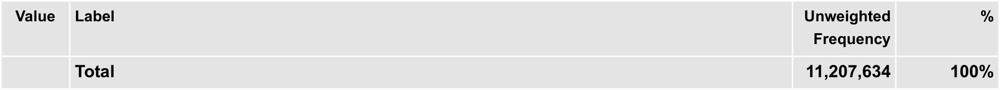

Based upon 147,527 valid cases out of 11,207,634 total cases.

- Minimum: 1.00
- Maximum: 5.00

Location: 830-831 (width: 2; decimal: 0)  
Variable Type: numeric  
(Range of) Missing Values: -9, -8, -7, -6, -5, .

---

### V40211: ETHNICITY OF VICTIM - 1

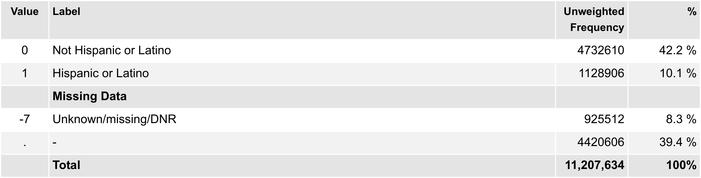

Based upon 5,861,516 valid cases out of 11,207,634 total cases.

- Minimum: 0.00
- Maximum: 1.00

Location: 832-833 (width: 2; decimal: 0)  
Variable Type: numeric  
(Range of) Missing Values: -9, -8, -7, -6, -5, .

---

### V40212: ETHNICITY OF VICTIM - 2

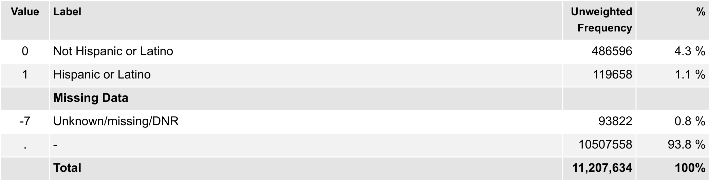

Based upon 606,254 valid cases out of 11,207,634 total cases.

- Minimum: 0.00
- Maximum: 1.00

Location: 834-835 (width: 2; decimal: 0)  
Variable Type: numeric  
(Range of) Missing Values: -9, -8, -7, -6, -5, .


V40213: ETHNICITY OF VICTIM - 3

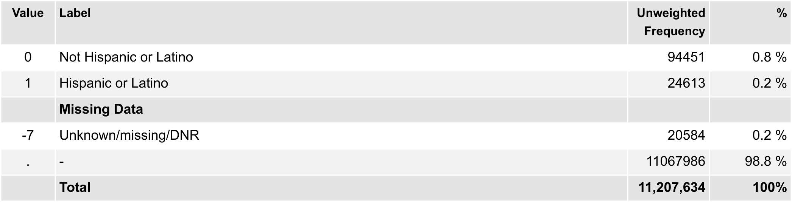
Based upon 119,064 valid cases out of 11,207,634 total cases.

- Minimum: 0.00
- Maximum: 1.00

Location: 836-837 (width: 2; decimal: 0)  
Variable Type: numeric  
(Range of) Missing Values: -9, -8, -7, -6, -5, .

V40221: RESIDENT STATUS OF VICTIM - 1

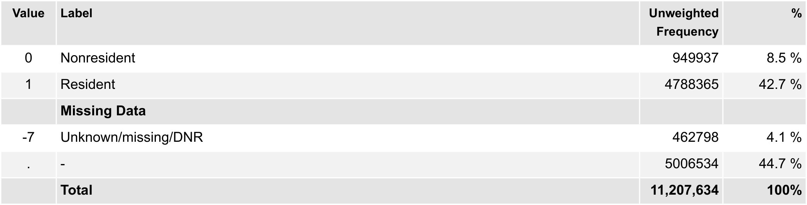
Based upon 5,738,302 valid cases out of 11,207,634 total cases.

- Minimum: 0.00
- Maximum: 1.00

Location: 838-839 (width: 2; decimal: 0)  
Variable Type: numeric  
(Range of) Missing Values: -9, -8, -7, -6, -5, .

V40222: RESIDENT STATUS OF VICTIM - 2

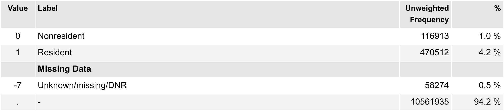


Based upon 587,425 valid cases out of 11,207,634 total cases.

- Minimum: 0.00
- Maximum: 1.00

*Location: 840-841 (width: 2; decimal: 0)*
*Variable Type: numeric*
*(Range of) Missing Values: -9, -8 , -7 , -6 , -5, . *

## V40223: RESIDENT STATUS OF VICTIM - 3

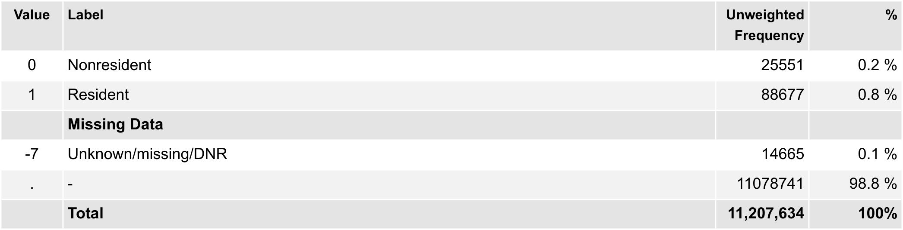

Based upon 114,228 valid cases out of 11,207,634 total cases.

- Minimum: 0.00
- Maximum: 1.00

*Location: 842-843 (width: 2; decimal: 0)*
*Variable Type: numeric*
*(Range of) Missing Values: -9, -8 , -7 , -6 , -5, . *

## V40231: AGG ASLT/HOMICIDE CIRCUMSTANCE 1 - 1

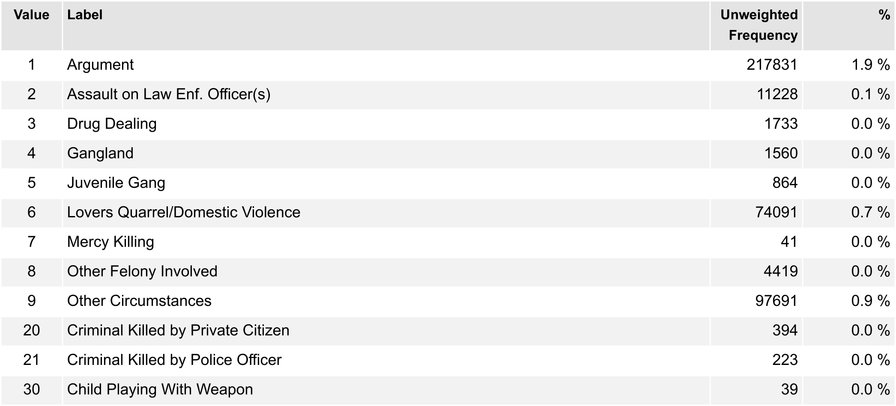


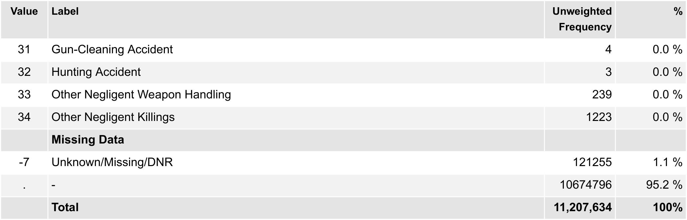

31 Gun-Cleaning Accident   4    0.0%

32 Hunting Accident       3    0.0%

33 Other Negligent Weapon Handling   239   0.0%

34 Other Negligent Killings          1223  0.0%

Missing Data
-7 Unknown/Missing/DNR  121255  1.1%

. .  10674796  95.2%

**Total**  11,207,634  100%

Based upon 411,583 valid cases out of 11,207,634 total cases.

- Minimum: 1.00
- Maximum: 34.00

*Location:* 844-845 (width: 2; decimal: 0)

*Variable Type:* numeric

*(Range of) Missing Values:* -9, -8, -7, -6, -5, .

**V40232: AGG ASLT/HOMICIDE CIRCUMSTANCE 1 - 2**


1 Argument     32561   0.3%

2 Assault on Law Enf. Officer(s)   4884   0.0%

3 Drug Dealing     392   0.0%

4 Gangland      595   0.0%

5 Juvenile Gang  292   0.0%

6 Lovers Quarrel/Domestic Violence  6875   0.1%

7 Mercy Killing    5   0.0%

8 Other Felony Involved   2704   0.0%

9 Other Circumstances     22055   0.2%

20 Criminal Killed by Private Citizen   12   0.0%

21 Criminal Killed by Police Officer     1   0.0%

30 Child Playing With Weapon      1   0.0%

31 Gun-Cleaning Accident     0   0.0%

32 Hunting Accident  0   0.0%

33 Other Negligent Weapon Handling  28   0.0%

34 Other Negligent Killings  157  0.0%

Missing Data
-7 Unknown/Missing/DNR  27767  0.2%

. .  11109305   99.1%

**Total**  11,207,634  100%


Based upon 70,562 valid cases out of 11,207,634 total cases.

* Minimum: 1.00
* Maximum: 34.00

* Location: 846-847 (width: 2; decimal: 0)
* Variable Type: numeric
* (Range of) Missing Values: -9, -8, -7, -6, -5, .

### V40233: AGG ASLT/HOMICIDE CIRCUMSTANCE 1 - 3

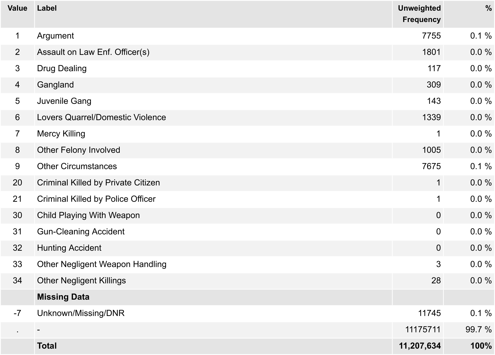

Based upon 20,178 valid cases out of 11,207,634 total cases.

* Minimum: 1.00
* Maximum: 34.00

* Location: 848-849 (width: 2; decimal: 0)
* Variable Type: numeric
* (Range of) Missing Values: -9, -8, -7, -6, -5, .

### V40241: AGG ASLT/HOMICIDE CIRCUMSTANCE 2 - 1

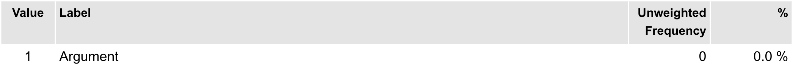


|                                 | Unweighted Frequency | %         |
|---------------------------------|----------------------|-----------|
| 2  Assault on Law Enf. Officer(s)   | 88                   | 0.0 %     |
| 3  Drug Dealing                    | 140                  | 0.0 %     |
| 4  Gangland                        | 67                   | 0.0 %     |
| 5  Juvenile Gang                   | 56                   | 0.0 %     |
| 6  Lovers Quarrel/Domestic Violence| 7546                 | 0.1 %     |
| 7  Mercy Killing                   | 3                    | 0.0 %     |
| 8  Other Felony Involved           | 588                  | 0.0 %     |
| 9  Other Circumstances             | 3358                 | 0.0 %     |
| 20 Criminal Killed by Private Citizen | 0                    | 0.0 %     |
| 21 Criminal Killed by Police Officer | 0                    | 0.0 %     |
| 30 Child Playing With Weapon       | 0                    | 0.0 %     |
| 31 Gun-Cleaning Accident           | 0                    | 0.0 %     |
| 32 Hunting Accident                | 0                    | 0.0 %     |
| 33 Other Negligent Weapon Handling | 0                    | 0.0 %     |
| 34 Other Negligent Killings        | 0                    | 0.0 %     |
| **Missing Data**                |                      |           |
| .                                 |                      |           |
| **Total**                         | **11,195,788**       | **99.9 %**|
|                                   | **11,207,634**       | **100%**  |

Based upon 11,846 valid cases out of 11,207,634 total cases.

- Minimum: 2.00
- Maximum: 9.00

*Location:* 850-851 (width: 2; decimal: 0)
*Variable Type:* numeric
*(Range of) Missing Values:* -9, -8, -7, -6, -5, .

---

## V40242: AGG ASLT/HOMICIDE CIRCUMSTANCE 2 - 2

|                                 | Unweighted Frequency | %         |
|---------------------------------|----------------------|-----------|
| 1 Argument                      | 0                    | 0.0 %     |
| 2 Assault on Law Enf. Officer(s)| 36                   | 0.0 %     |
| 3 Drug Dealing                  | 22                   | 0.0 %     |
| 4 Gangland                      | 16                   | 0.0 %     |
| 5 Juvenile Gang                 | 23                   | 0.0 %     |
| 6 Lovers Quarrel/Domestic Violence | 628                 | 0.0 %     |
| 7 Mercy Killing                 | 0                    | 0.0 %     |
| 8 Other Felony Involved         | 209                  | 0.0 %     |
| 9 Other Circumstances           | 634                  | 0.0 %     |
| 20 Criminal Killed by Private Citizen | 0                    | 0.0 %     |
| 21 Criminal Killed by Police Officer | 0                    | 0.0 %     |


### 253_0.png

|                               | Unweighted Frequency | %       |
|-------------------------------|----------------------|---------|
| 30 Child Playing With Weapon  | 0                    | 0.0 %   |
| 31 Gun-Cleaning Accident      | 0                    | 0.0 %   |
| 32 Hunting Accident           | 0                    | 0.0 %   |
| 33 Other Negligent Weapon Handling | 0                    | 0.0 %   |
| 34 Other Negligent Killings   | 0                    | 0.0 %   |
| **Missing Data**              |                      |         |
| .                             |                      |         |
| **Total**                     | 1120666              | 100.0 % |
|                               | 11,207,634           | 100%    |

Based upon 1,568 valid cases out of 11,207,634 total cases.

- Minimum: 2.00
- Maximum: 9.00

Location: 852-853 (width: 2; decimal: 0)   
Variable Type: numeric   
(Range of) Missing Values: -9, -8, -7, -6, -5, .

---

### 253_1.png

#### V40243: AGG ASLT/HOMICIDE CIRCUMSTANCE 2 - 3

|                                                     | Unweighted Frequency | %       |
|-----------------------------------------------------|----------------------|---------|
| 1 Argument                                          | 0                    | 0.0 %   |
| 2 Assault on Law Enf. Officer(s)                    | 11                   | 0.0 %   |
| 3 Drug Dealing                                      | 0                    | 0.0 %   |
| 4 Gangland                                          | 3                    | 0.0 %   |
| 5 Juvenile Gang                                     | 10                   | 0.0 %   |
| 6 Lovers Quarrel/Domestic Violence                  | 94                   | 0.0 %   |
| 7 Mercy Killing                                     | 0                    | 0.0 %   |
| 8 Other Felony Involved                             | 67                   | 0.0 %   |
| 9 Other Circumstances                               | 185                  | 0.0 %   |
| 20 Criminal Killed by Private Citizen               | 0                    | 0.0 %   |
| 21 Criminal Killed by Police Officer                | 0                    | 0.0 %   |
| 30 Child Playing With Weapon                        | 0                    | 0.0 %   |
| 31 Gun-Cleaning Accident                            | 0                    | 0.0 %   |
| 32 Hunting Accident                                 | 0                    | 0.0 %   |
| 33 Other Negligent Weapon Handling                  | 0                    | 0.0 %   |
| 34 Other Negligent Killings                         | 0                    | 0.0 %   |
| **Missing Data**                                    |                      |         |
| .                                                   |                      |         |
| **Total**                                           | 11207264             | 100.0 % |
|                                                     | 11,207,634           | 100%    |

Based upon 370 valid cases out of 11,207,634 total cases.


## V40251: ADDITIONAL JUSTIFIABLE HOMICIDE CIRCUMSTANCES - 1

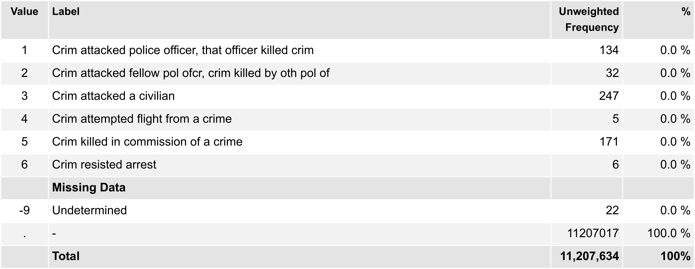

Based upon 595 valid cases out of 11,207,634 total cases.

- Minimum: 1.00
- Maximum: 6.00

Location: 856-857 (width: 2; decimal: 0)  
Variable Type: numeric  
(Range of) Missing Values: -9, -8, -7, -6, -5, .  

## V40252: ADDITIONAL JUSTIFIABLE HOMICIDE CIRCUMSTANCES - 2


Based upon 13 valid cases out of 11,207,634 total cases.

- Minimum: 2.00
- Maximum: 5.00


### V40253: ADDITIONAL JUSTIFIABLE HOMICIDE CIRCUMSTANCES - 3

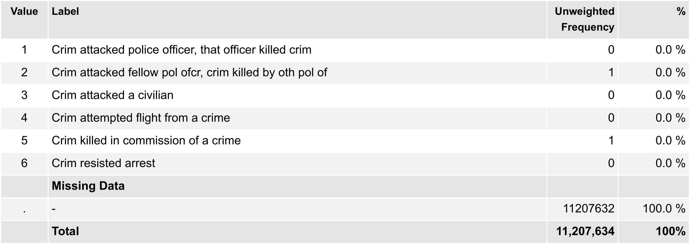

Based upon 2 valid cases out of 11,207,634 total cases.

- Minimum: 2.00
- Maximum: 5.00

### V40261: INJURY 1 - 1

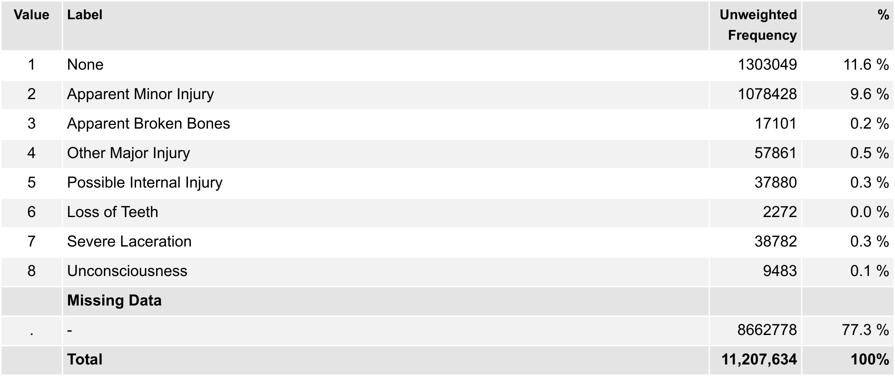

Based upon 2,544,856 valid cases out of 11,207,634 total cases.

- Minimum: 1.00
- Maximum: 8.00


## V40262: INJURY 1 - 2


|   |                 | Unweighted Frequency |     %   |
|---|-----------------|-----------------------|---------|
| 1 | None            | 243183                | 2.2 %   |
| 2 | Apparent Minor Injury | 118222        | 1.1 %   |
| 3 | Apparent Broken Bones | 1032          | 0.0 %   |
| 4 | Other Major Injury    | 7424          | 0.1 %   |
| 5 | Possible Internal Injury | 2647      | 0.0 %   |
| 6 | Loss of Teeth         | 137            | 0.0 %   |
| 7 | Severe Laceration     | 2941           | 0.0 %   |
| 8 | Unconsciousness       | 447            | 0.0 %   |
|   | Missing Data     | 10831601             | 96.6 %  |
| . |                   |                     |         |
|   | **Total**         | **11,207,634**       | **100%**|

Based upon 376,033 valid cases out of 11,207,634 total cases.

- Minimum: 1.00
- Maximum: 8.00

Location: 864-865 (width: 2; decimal: 0)

Variable Type: numeric  
(Range of) Missing Values: -9, -8, -7, -6, -5, .

## V40263: INJURY 1 - 3
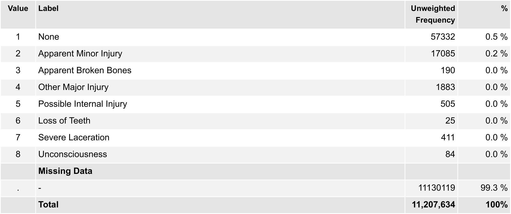

|   |                     | Unweighted Frequency |     %    |
|---|---------------------|-----------------------|----------|
| 1 | None                | 57332                 | 0.5 %    |
| 2 | Apparent Minor Injury | 17085              | 0.2 %    |
| 3 | Apparent Broken Bones | 190                | 0.0 %    |
| 4 | Other Major Injury     | 1883              | 0.0 %    |
| 5 | Possible Internal Injury | 505            | 0.0 %    |
| 6 | Loss of Teeth           | 25               | 0.0 %    |
| 7 | Severe Laceration       | 411              | 0.0 %    |
| 8 | Unconsciousness         | 84               | 0.0 %    |
|   | Missing Data       | 11130119             | 99.3 %   |
| . |                     |                      |          |
|   | **Total**           | **11,207,634**        | **100%** |

Based upon 77,515 valid cases out of 11,207,634 total cases.

- Minimum: 1.00
- Maximum: 8.00


## V40271: INJURY 2 - 1

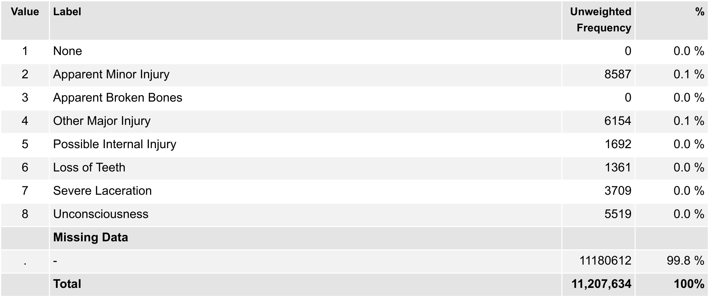

|                              | Unweighted Frequency | %      |
|------------------------------|----------------------|--------|
| 1 None                       | 0                    | 0.0 %  |
| 2 Apparent Minor Injury      | 8587                 | 0.1 %  |
| 3 Apparent Broken Bones      | 0                    | 0.0 %  |
| 4 Other Major Injury         | 6154                 | 0.1 %  |
| 5 Possible Internal Injury   | 1692                 | 0.0 %  |
| 6 Loss of Teeth              | 1361                 | 0.0 %  |
| 7 Severe Laceration          | 3709                 | 0.0 %  |
| 8 Unconsciousness            | 5519                 | 0.0 %  |
| **Missing Data**             |                      |        |
| .                            | 11180612             | 99.8 % |
| **Total**                    | **11,207,634**       | **100%**|

Based upon 27,022 valid cases out of 11,207,634 total cases.

## V40272: INJURY 2 - 2


|                              | Unweighted Frequency | %      |
|------------------------------|----------------------|--------|
| 1 None                       | 0                    | 0.0 %  |
| 2 Apparent Minor Injury      | 484                  | 0.0 %  |
| 3 Apparent Broken Bones      | 0                    | 0.0 %  |
| 4 Other Major Injury         | 451                  | 0.0 %  |
| 5 Possible Internal Injury   | 116                  | 0.0 %  |
| 6 Loss of Teeth              | 60                   | 0.0 %  |
| 7 Severe Laceration          | 278                  | 0.0 %  |
| 8 Unconsciousness            | 240                  | 0.0 %  |
| **Missing Data**             |                      |        |
| .                            | 11206005             | 100.0 %|
| **Total**                    | **11,207,634**       | **100%**|

Based upon 1,629 valid cases out of 11,207,634 total cases.


• Minimum: 2.00
• Maximum: 8.00

Location: 870-871 (width: 2; decimal: 0)  
Variable Type: numeric  
(Range of) Missing Values: -9, -8, -7, -6, -5, .

### V40273: INJURY 2 - 3


Based upon 251 valid cases out of 11,207,634 total cases.

• Minimum: 2.00
• Maximum: 8.00

Location: 872-873 (width: 2; decimal: 0)  
Variable Type: numeric  
(Range of) Missing Values: -9, -8, -7, -6, -5, .

### V40281: INJURY 3 - 1


Based upon 4,565 valid cases out of 11,207,634 total cases.

- Minimum: 2.00
- Maximum: 8.00

*Location*: 874-875 (width: 2; decimal: 0)  
*Variable Type*: numeric  
*(Range of) Missing Values*: -9, -8, -7, -6, -5, .

### V40282: INJURY 3 - 2

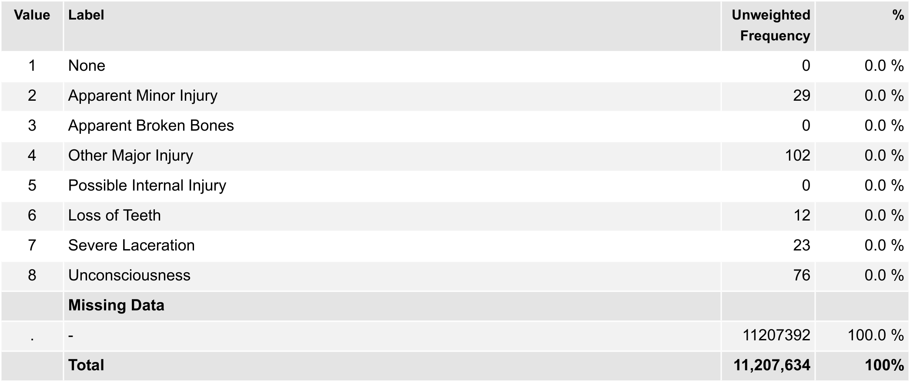

Based upon 242 valid cases out of 11,207,634 total cases.

- Minimum: 2.00
- Maximum: 8.00

*Location*: 876-877 (width: 2; decimal: 0)  
*Variable Type*: numeric  
*(Range of) Missing Values*: -9, -8, -7, -6, -5, .

### V40283: INJURY 3 - 3

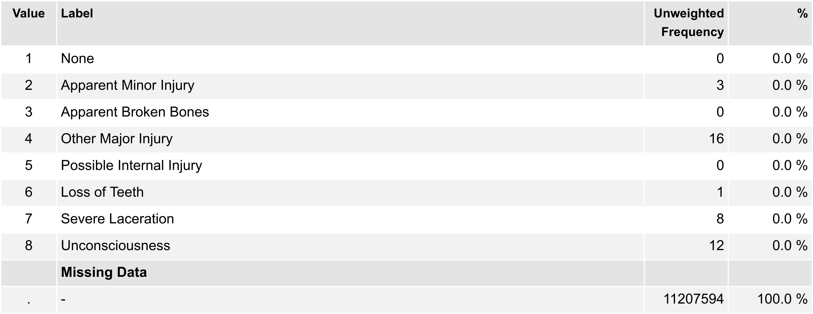


## 260_0.png

|                        | Unweighted Frequency | %       |
|------------------------|----------------------|---------|
| **Total**              | 11,207,634           | 100%    |

Based upon 40 valid cases out of 11,207,634 total cases.

- Minimum: 2.00
- Maximum: 8.00

Location: 878-879 (width: 2; decimal: 0)  
Variable Type: numeric  
(Range of) Missing Values: -9, -8, -7, -6, -5, .

---

## V40291: INJURY 4 - 1

## 260_1.png

|                        | Unweighted Frequency | %       |
|------------------------|----------------------|---------|
| 1 None                 | 0                    | 0.0 %   |
| 2 Apparent Minor Injury| 26                   | 0.0 %   |
| 3 Apparent Broken Bones| 0                    | 0.0 %   |
| 4 Other Major Injury   | 202                  | 0.0 %   |
| 5 Possible Internal Injury| 0                 | 0.0 %   |
| 6 Loss of Teeth        | 59                   | 0.0 %   |
| 7 Severe Laceration    | 0                    | 0.0 %   |
| 8 Unconsciousness      | 380                  | 0.0 %   |
| . Missing Data         | -                    | -       |
| **Total**              | 11,206,967           | 100.0 % |
|                        | 11,207,634           | 100%    |

Based upon 667 valid cases out of 11,207,634 total cases.

- Minimum: 2.00
- Maximum: 8.00

Location: 880-881 (width: 2; decimal: 0)  
Variable Type: numeric  
(Range of) Missing Values: -9, -8, -7, -6, -5, .

---

## V40292: INJURY 4 - 2

## 260_2.png

|                        | Unweighted Frequency | %       |
|------------------------|----------------------|---------|
| 1 None                 | 0                    | 0.0 %   |
| 2 Apparent Minor Injury| 4                    | 0.0 %   |
| 3 Apparent Broken Bones| 0                    | 0.0 %   |
| 4 Other Major Injury   | 18                   | 0.0 %   |
| 5 Possible Internal Injury| 0                 | 0.0 %   |
| 6 Loss of Teeth        | 1                    | 0.0 %   |
| 7 Severe Laceration    | 0                    | 0.0 %   |


### 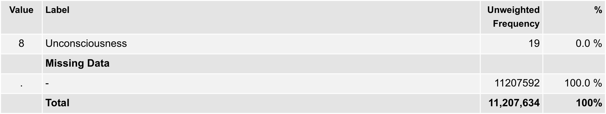

8 | Unconsciousness              | 19       | 0.0 %
--|------------------------------|----------|------
  | Missing Data                 |          |
  | .                            |          |
  | Total                        | 11207592 | 100.0%

Based upon 42 valid cases out of 11,207,634 total cases.

- Minimum: 2.00
- Maximum: 8.00

Location: 882-883 (width: 2; decimal: 0)  
Variable Type: numeric  
(Range of) Missing Values: -9, -8, -7, -6, -5, .


### V40293: INJURY 4 - 3

### 

1 | None                     | 0        | 0.0 %
--|--------------------------|----------|------
2 | Apparent Minor Injury    | 0        | 0.0 %
3 | Apparent Broken Bones    | 0        | 0.0 %
4 | Other Major Injury       | 1        | 0.0 %
5 | Possible Internal Injury | 0        | 0.0 %
6 | Loss of Teeth            | 1        | 0.0 %
7 | Severe Laceration        | 0        | 0.0 %
8 | Unconsciousness          | 0        | 0.0 %
  | Missing Data             |          |
  | .                        |          |
  | Total                    | 11207632 | 100.0%

Based upon 2 valid cases out of 11,207,634 total cases.

- Minimum: 4.00
- Maximum: 6.00

Location: 884-885 (width: 2; decimal: 0)  
Variable Type: numeric  
(Range of) Missing Values: -9, -8, -7, -6, -5, .


### V40301: INJURY 5 - 1

### 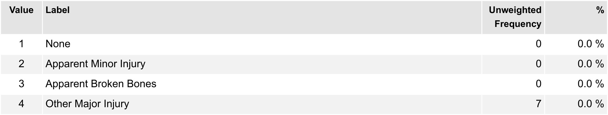

1 | None                   | 0 | 0.0 %
--|------------------------|---|------
2 | Apparent Minor Injury  | 0 | 0.0 %
3 | Apparent Broken Bones  | 0 | 0.0 %
4 | Other Major Injury     | 7 | 0.0 %


|     |                       | Unweighted Frequency |    %    |
|-----|-----------------------|----------------------|---------|
| 5   | Possible Internal Injury    | 0                    | 0.0 %   |
| 6   | Loss of Teeth         | 10                   | 0.0 %   |
| 7   | Severe Laceration     | 0                    | 0.0 %   |
| 8   | Unconsciousness       | 72                   | 0.0 %   |
|     | **Missing Data**        |                      |         |
|     | -                     | 11207545             | 100.0 % |
|     | **Total**               | **11,207,634**         | **100%** |

Based upon 89 valid cases out of 11,207,634 total cases.

- Minimum: 4.00
- Maximum: 8.00

Location: 886-887 (width: 2; decimal: 0)
Variable Type: numeric
(Range of) Missing Values: -9, -8, -7, -6, -5, .

#### V40302: INJURY 5 - 2

|     |                       | Unweighted Frequency |    %    |
|-----|-----------------------|----------------------|---------|
| 1   | None                  | 0                    | 0.0 %   |
| 2   | Apparent Minor Injury | 0                    | 0.0 %   |
| 3   | Apparent Broken Bones | 0                    | 0.0 %   |
| 4   | Other Major Injury    | 1                    | 0.0 %   |
| 5   | Possible Internal Injury    | 0                    | 0.0 %   |
| 6   | Loss of Teeth         | 2                    | 0.0 %   |
| 7   | Severe Laceration     | 0                    | 0.0 %   |
| 8   | Unconsciousness       | 1                    | 0.0 %   |
|     | **Missing Data**        |                      |         |
|     | -                     | 11207630             | 100.0 % |
|     | **Total**               | **11,207,634**         | **100%** |

Based upon 4 valid cases out of 11,207,634 total cases.

- Minimum: 4.00
- Maximum: 8.00

Location: 888-889 (width: 2; decimal: 0)
Variable Type: numeric
(Range of) Missing Values: -9, -8, -7, -6, -5, .

#### V40303: INJURY 5 - 3

|     |                       | Unweighted Frequency |    %    |
|-----|-----------------------|----------------------|---------|
| 1   | None                  | 0                    | 0.0 %   |


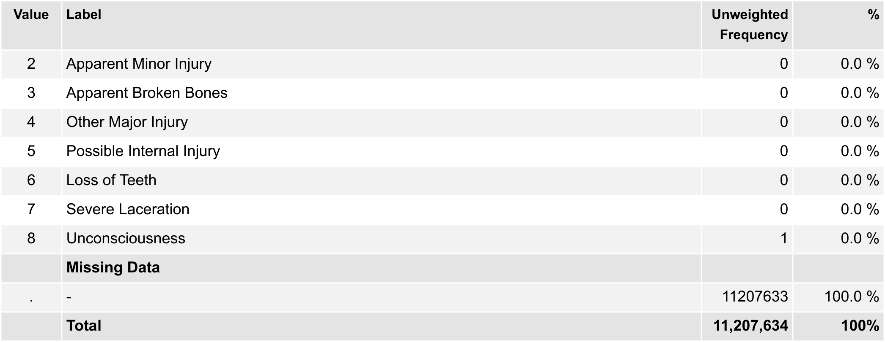

|                            | Unweighted Frequency |     %       |
|----------------------------|----------------------|-------------|
| 2 Apparent Minor Injury    | 0                    | 0.0 %       |
| 3 Apparent Broken Bones    | 0                    | 0.0 %       |
| 4 Other Major Injury       | 0                    | 0.0 %       |
| 5 Possible Internal Injury | 0                    | 0.0 %       |
| 6 Loss of Teeth            | 0                    | 0.0 %       |
| 7 Severe Laceration        | 0                    | 0.0 %       |
| 8 Unconsciousness          | 1                    | 0.0 %       |
| Missing Data               | -                    |             |
| Total                      | 11207633             | 100.0 %     |

Based upon 1 valid cases out of 11,207,634 total cases.

* Minimum: 8.00
* Maximum: 8.00

Location: 890-891 (width: 2; decimal: 0)  
Variable Type: numeric  
(Range of) Missing Values: -9, -8, -7, -6, -5, .

V40311: OFFENDER NUMBER 1 - 1

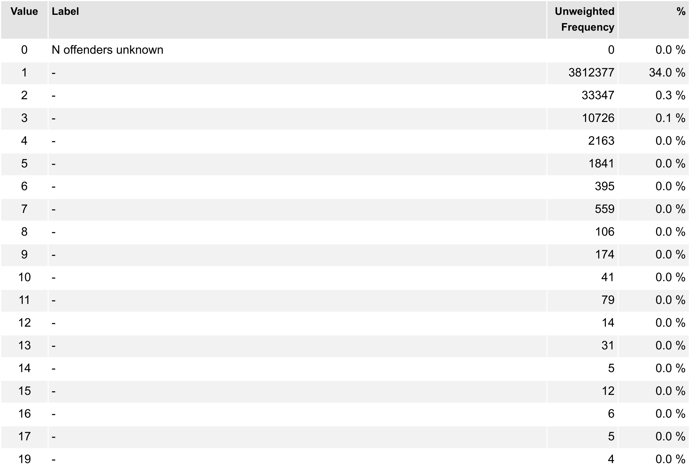

|         | Unweighted Frequency |     %     |
|---------|----------------------|-----------|
| 0 N offenders unknown | 0                    | 0.0 %     |
| 1       | 3812377              | 34.0 %     |
| 2       | 33347                | 0.3 %      |
| 3       | 10726                | 0.1 %      |
| 4       | 2163                 | 0.0 %      |
| 5       | 1841                 | 0.0 %      |
| 6       | 395                  | 0.0 %      |
| 7       | 559                  | 0.0 %      |
| 8       | 106                  | 0.0 %      |
| 9       | 174                  | 0.0 %      |
| 10      | 41                   | 0.0 %      |
| 11      | 79                   | 0.0 %      |
| 12      | 14                   | 0.0 %      |
| 13      | 31                   | 0.0 %      |
| 14      | 5                    | 0.0 %      |
| 15      | 12                   | 0.0 %      |
| 16      | 6                    | 0.0 %      |
| 17      | 5                    | 0.0 %      |
| 19      | 4                    | 0.0 %      |


|        | Unweighted Frequency | %     |
|--------|-----------------------|-------|
| 20     | 3                     | 0.0 % |
| 21     | 2                     | 0.0 % |
| 22     | 1                     | 0.0 % |
| 23     | 2                     | 0.0 % |
| 24     | 1                     | 0.0 % |
| 26     | 1                     | 0.0 % |
| 27     | 1                     | 0.0 % |
| 31     | 7                     | 0.0 % |
| 32     | 4                     | 0.0 % |
| 33     | 1                     | 0.0 % |
| 34     | 1                     | 0.0 % |
| 37     | 1                     | 0.0 % |
| 38     | 1                     | 0.0 % |
| 40     | 1                     | 0.0 % |
| 50     | 1                     | 0.0 % |
| 54     | 1                     | 0.0 % |
| 59     | 1                     | 0.0 % |
| 99     | 3                     | 0.0 % |

| Missing Data |                   |       |
|--------------|-------------------|-------|
| .            |                   |       |
| Total        | 7,345,716         | 65.5% |
| Total        | 11,207,634        | 100%  |

Based upon 3,861,918 valid cases out of 11,207,634 total cases.

* Mean: 1.02
* Median: 1.00
* Mode: 1.00
* Minimum: 1.00
* Maximum: 99.00
* Standard Deviation: 0.26

Location: 892-893 (width: 2; decimal: 0)  
Variable Type: numeric  
(Range of) Missing Values: -9, -8, -7, -6, -5, .  

## V40312: OFFENDER NUMBER 1 - 2

|        | Unweighted Frequency | %     |
|--------|-----------------------|-------|
| 0      | N offenders unknown   | 0     | 0.0 % |
| 1      | -                     | 529,406 | 4.7 % |
| 2      | -                     | 3,880   | 0.0 % |
| 3      | -                     | 2,243   | 0.0 % |
| 4      | -                     | 468     | 0.0 % |


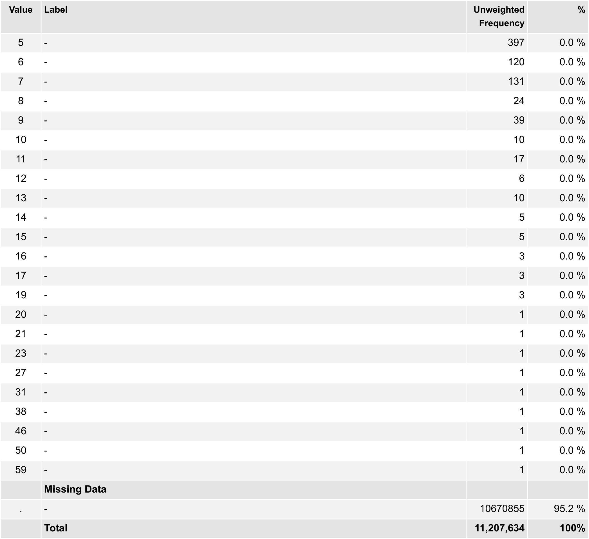

|     |                     | Unweighted Frequency | %      |
|-----|---------------------|----------------------|--------|
| 5   | -                   | 397                  | 0.0 %  |
| 6   | -                   | 120                  | 0.0 %  |
| 7   | -                   | 131                  | 0.0 %  |
| 8   | -                   | 24                   | 0.0 %  |
| 9   | -                   | 39                   | 0.0 %  |
| 10  | -                   | 10                   | 0.0 %  |
| 11  | -                   | 17                   | 0.0 %  |
| 12  | -                   | 6                    | 0.0 %  |
| 13  | -                   | 10                   | 0.0 %  |
| 14  | -                   | 5                    | 0.0 %  |
| 15  | -                   | 5                    | 0.0 %  |
| 16  | -                   | 3                    | 0.0 %  |
| 17  | -                   | 3                    | 0.0 %  |
| 19  | -                   | 3                    | 0.0 %  |
| 20  | -                   | 1                    | 0.0 %  |
| 21  | -                   | 1                    | 0.0 %  |
| 23  | -                   | 1                    | 0.0 %  |
| 27  | -                   | 1                    | 0.0 %  |
| 31  | -                   | 1                    | 0.0 %  |
| 38  | -                   | 1                    | 0.0 %  |
| 46  | -                   | 1                    | 0.0 %  |
| 50  | -                   | 1                    | 0.0 %  |
| 59  | -                   | 1                    | 0.0 %  |
|     | **Missing Data**    |                      |        |
|     | .                   | 10670855             | 95.2 % |
|     | **Total**           | **11,207,634**       | **100%**|

Based upon 536,779 valid cases out of 11,207,634 total cases.

- Mean: 1.03
- Median: 1.00
- Mode: 1.00
- Minimum: 1.00
- Maximum: 59.00
- Standard Deviation: 0.32

*Location: 894-895 (width: 2; decimal: 0)*
*Variable Type: numeric*
*(Range of) Missing Values: -9, -8, -7, -6, -5, .*

**V40313: OFFENDER NUMBER 1 - 3**


## 266_0.png

|                            | Unweighted Frequency |       %       |
|----------------------------|----------------------|---------------|
| 0 N offenders unknown      | 0                    | 0.0 %         |
| 1                          | 105976               | 0.9 %         |
| 2                          | 1015                 | 0.0 %         |
| 3                          | 330                  | 0.0 %         |
| 4                          | 134                  | 0.0 %         |
| 5                          | 139                  | 0.0 %         |
| 6                          | 55                   | 0.0 %         |
| 7                          | 60                   | 0.0 %         |
| 8                          | 11                   | 0.0 %         |
| 9                          | 20                   | 0.0 %         |
| 10                         | 9                    | 0.0 %         |
| 11                         | 6                    | 0.0 %         |
| 12                         | 4                    | 0.0 %         |
| 13                         | 4                    | 0.0 %         |
| 14                         | 3                    | 0.0 %         |
| 15                         | 2                    | 0.0 %         |
| 16                         | 2                    | 0.0 %         |
| 17                         | 1                    | 0.0 %         |
| 19                         | 2                    | 0.0 %         |
| 21                         | 1                    | 0.0 %         |
| 38                         | 1                    | 0.0 %         |
| 59                         | 1                    | 0.0 %         |
| **Missing Data**           | **1109858**          | **99.0 %**    |
| **Total**                  | **11,207,634**       | **100%**      |
  
  Based upon 107,776 valid cases out of 11,207,634 total cases.
  
  - Mean: 1.04
  - Median: 1.00
  - Mode: 1.00
  - Minimum: 1.00
  - Maximum: 59.00
  - Standard Deviation: 0.44
  
  *Location*: 896-897 (width: 2; decimal: 0)
  *Variable Type*: numeric
  *(Range of) Missing Values*: -9, -8, -7, -6, -5, .

## V40321: RELATIONSHIP VIC TO OFF 1 - 1

## 266_1.png

|                            | Unweighted Frequency |       %       |
|----------------------------|----------------------|---------------|
| 0 N offenders unknown      | 0                    | 0.0 %         |


|                         | Unweighted Frequency | %     |
|-------------------------|----------------------|-------|
| 1   Victim was Spouse                   | 197892               | 1.8 % |
| 2   Victim was Common-Law Spouse        | 24223                | 0.2 % |
| 3   Victim was Parent                   | 147320               | 1.3 % |
| 4   Victim was Sibling                  | 84667                | 0.8 % |
| 5   Victim was Child                    | 94272                | 0.8 % |
| 6   Victim was Grandparent              | 16518                | 0.1 % |
| 7   Victim was Grandchild               | 6989                 | 0.1 % |
| 8   Victim was In-Law                   | 15862                | 0.1 % |
| 9   Victim was Stepparent               | 13223                | 0.1 % |
| 10  Victim was Stepchild                | 14942                | 0.1 % |
| 11  Victim was Stepsibling              | 3877                 | 0.0 % |
| 12  Victim was Other Family Member      | 95285                | 0.9 % |
| 13  Victim was Offender                 | 59885                | 0.5 % |
| 14  Victim was Acquaintance             | 428841               | 3.8 % |
| 15  Victim was Friend                   | 89062                | 0.8 % |
| 16  Victim was Neighbor                 | 72002                | 0.6 % |
| 17  Victim was Babysittee (the baby)    | 2010                 | 0.0 % |
| 18  Victim was Boyfriend/Girlfriend     | 508698               | 4.5 % |
| 19  Victim was Child of Boyfriend/Girlfriend | 10482            | 0.1 % |
| 20  Homosexual Relationship             | 0                    | 0.0 % |
| 21  Victim was Ex-Spouse                | 50110                | 0.4 % |
| 22  Victim was Employee                 | 13129                | 0.1 % |
| 23  Victim was Employer                 | 12002                | 0.1 % |
| 24  Victim was Otherwise Known          | 321290               | 2.9 % |
| 25  Victim was Stranger                 | 504229               | 4.5 % |
| 26  Victim was Ex-relationship (Ex-boyfriend/ex-girlfriend) | 164204 | 1.5 % |
| Missing Data                            |                      |       |
| .                                       | 8256620              | 73.7 % |
|                                         | 11,207,634           | 100%  |

Based upon 2,951,014 valid cases out of 11,207,634 total cases.

- Minimum: 1.00
- Maximum: 26.00

Location: 898-899 (width: 2; decimal: 0)

Variable Type: numeric

(Range of) Missing Values: -9, -8, -7, -6, -5, . 

V40322: RELATIONSHIP VIC TO OFF 1 - 2


|                   | Unweighted Frequency | %     |
|-------------------|----------------------|-------|
| 0 N offenders unknown        | 0                    | 0.0 % |
| 1 Victim was Spouse          | 10357                | 0.1 % |
| 2 Victim was Common-Law Spouse | 1198                 | 0.0 % |
| 3 Victim was Parent          | 14893                | 0.1 % |
| 4 Victim was Sibling         | 15146                | 0.1 % |
| 5 Victim was Child           | 23810                | 0.2 % |
| 6 Victim was Grandparent     | 2190                 | 0.0 % |
| 7 Victim was Grandchild      | 1293                 | 0.0 % |
| 8 Victim was In-Law          | 3238                 | 0.0 % |
| 9 Victim was Stepparent      | 2429                 | 0.0 % |
| 10 Victim was Stepchild       | 3444                 | 0.0 % |
| 11 Victim was Stepsibling     | 597                  | 0.0 % |
| 12 Victim was Other Family Member | 14229                | 0.1 % |
| 13 Victim was Offender        | 31595                | 0.3 % |
| 14 Victim was Acquaintance    | 58246                | 0.5 % |
| 15 Victim was Friend          | 8884                 | 0.1 % |
| 16 Victim was Neighbor        | 10964                | 0.1 % |
| 17 Victim was Babysittee (the baby) | 257                  | 0.0 % |
| 18 Victim was Boyfriend/Girlfriend | 28092                | 0.3 % |
| 19 Victim was Child of Boyfriend/Girlfriend | 2869                 | 0.0 % |
| 20 Homosexual Relationship    | 0                    | 0.0 % |
| 21 Victim was Ex-Spouse       | 2078                 | 0.0 % |
| 22 Victim was Employee        | 1348                 | 0.0 % |
| 23 Victim was Employer        | 1372                 | 0.0 % |
| 24 Victim was Otherwise Known | 47445                | 0.4 % |
| 25 Victim was Stranger        | 109574               | 1.0 % |
| 26 Victim was Ex-relationship (Ex-boyfriend/ex-girlfriend) | 7315                 | 0.1 % |
| Missing Data                 |                      |       |
| .                            | 10804771             | 96.4 % |
| Total                        | 11,207,634           | 100%  |

Based upon 402,863 valid cases out of 11,207,634 total cases.

- Minimum: 1.00
- Maximum: 26.00

Location: 900-901 (width: 2; decimal: 0)
Variable Type: numeric
(Range of Missing Values: -9, -8, -7, -6, -5 .)

V40323: RELATIONSHIP VIC TO OFF 1 - 3


|                                            | Unweighted Frequency |   %    |
|--------------------------------------------|----------------------|--------|
| 0  N offenders unknown                     | 0                    | 0.0 %  |
| 1  Victim was Spouse                       | 596                  | 0.0 %  |
| 2  Victim was Common-Law Spouse            | 77                   | 0.0 %  |
| 3  Victim was Parent                       | 1414                 | 0.0 %  |
| 4  Victim was Sibling                      | 2296                 | 0.0 %  |
| 5  Victim was Child                        | 6612                 | 0.1 %  |
| 6  Victim was Grandparent                  | 278                  | 0.0 %  |
| 7  Victim was Grandchild                   | 336                  | 0.0 %  |
| 8  Victim was In-Law                       | 499                  | 0.0 %  |
| 9  Victim was Stepparent                   | 267                  | 0.0 %  |
| 10 Victim was Stepchild                    | 740                  | 0.0 %  |
| 11 Victim was Stepibling                   | 112                  | 0.0 %  |
| 12 Victim was Other Family Member          | 2809                 | 0.0 %  |
| 13 Victim was Offender                     | 1740                 | 0.0 %  |
| 14 Victim was Acquaintance                 | 11341                | 0.1 %  |
| 15 Victim was Friend                       | 1490                 | 0.0 %  |
| 16 Victim was Neighbor                     | 2317                 | 0.0 %  |
| 17 Victim was Babysittee (the baby)        | 69                   | 0.0 %  |
| 18 Victim was Boyfriend/Girlfriend         | 1564                 | 0.0 %  |
| 19 Victim was Child of Boyfriend/Girlfriend| 723                  | 0.0 %  |
| 20 Homosexual Relationship                 | 0                    | 0.0 %  |
| 21 Victim was Ex-Spouse                    | 172                  | 0.0 %  |
| 22 Victim was Employee                     | 259                  | 0.0 %  |
| 23 Victim was Employer                     | 149                  | 0.0 %  |
| 24 Victim was Otherwise Known              | 10003                | 0.1 %  |
| 25 Victim was Stranger                     | 27791                | 0.2 %  |
| 26 Victim was Ex-relationship (Ex-boyfriend/ex-girlfriend) | 534 | 0.0 %  |
| Missing Data                               |                      |        |
| .                                          | 11133446             | 99.3 % |
| Total                                      | 11,207,634           | 100%   |

Based upon 74,188 valid cases out of 11,207,634 total cases.

- Minimum: 1.00
- Maximum: 26.00

Location: 902-903 (width: 2; decimal: 0)
Variable Type: numeric
(Range of) Missing Values: -9, -8, -7, -6, -5, .

V40331: OFFENDER NUMBER 2 - 1

- 267 -


|      | Unweighted Frequency | %    |
|------|----------------------|------|
| 0    | N offenders unknown  | 0    | 0.0% |
| 2    | -                    | 440113   | 3.9% |
| 3    | -                    | 5543     | 0.0% |
| 4    | -                    | 1685     | 0.0% |
| 5    | -                    | 5151     | 0.0% |
| 6    | -                    | 350      | 0.0% |
| 7    | -                    | 151      | 0.0% |
| 8    | -                    | 1046     | 0.0% |
| 9    | -                    | 48       | 0.0% |
| 10   | -                    | 30       | 0.0% |
| 11   | -                    | 375      | 0.0% |
| 12   | -                    | 18       | 0.0% |
| 13   | -                    | 9        | 0.0% |
| 14   | -                    | 108      | 0.0% |
| 15   | -                    | 6        | 0.0% |
| 16   | -                    | 3        | 0.0% |
| 17   | -                    | 53       | 0.0% |
| 18   | -                    | 6        | 0.0% |
| 19   | -                    | 1        | 0.0% |
| 20   | -                    | 12       | 0.0% |
| 21   | -                    | 1        | 0.0% |
| 22   | -                    | 4        | 0.0% |
| 23   | -                    | 6        | 0.0% |
| 24   | -                    | 1        | 0.0% |
| 25   | -                    | 1        | 0.0% |
| 26   | -                    | 1        | 0.0% |
| 28   | -                    | 1        | 0.0% |
| 29   | -                    | 1        | 0.0% |
| 30   | -                    | 3        | 0.0% |
| 31   | -                    | 3        | 0.0% |
| 32   | -                    | 1        | 0.0% |
| 33   | -                    | 3        | 0.0% |
| 36   | -                    | 2        | 0.0% |
| 37   | -                    | 1        | 0.0% |
| 41   | -                    | 1        | 0.0% |
| 56   | -                    | 1        | 0.0% |
| 60   | -                    | 1        | 0.0% |

**Missing Data** | 10752894 | 95.9% |


#### 

|                        | Unweighted Frequency | %       |
|------------------------|----------------------|---------|
| **Total**              | 11,207,634           | 100%    |

Based upon 454,740 valid cases out of 11,207,634 total cases.

- Mean: 2.09
- Median: 2.00
- Mode: 2.00
- Minimum: 2.00
- Maximum: 60.00
- Standard Deviation: 0.67

*Location*: 904-905 (width: 2; decimal: 0)

*Variable Type*: numeric

*(Range of) Missing Values*: -9, -8, -7, -6, -5, .

### V40332: OFFENDER NUMBER 2 - 2

#### 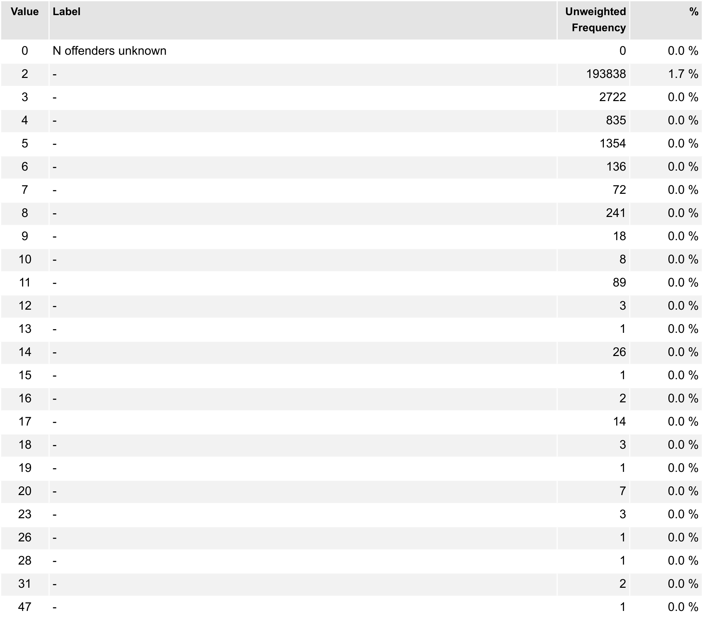

|    |                         | Unweighted Frequency | %     |
|----|-------------------------|----------------------|-------|
| 0  | N offenders unknown     | 0                    | 0.0%  |
| 2  | -                       | 193838               | 1.7%  |
| 3  | -                       | 2722                 | 0.0%  |
| 4  | -                       | 835                  | 0.0%  |
| 5  | -                       | 1354                 | 0.0%  |
| 6  | -                       | 136                  | 0.0%  |
| 7  | -                       | 72                   | 0.0%  |
| 8  | -                       | 241                  | 0.0%  |
| 9  | -                       | 18                   | 0.0%  |
| 10 | -                       | 8                    | 0.0%  |
| 11 | -                       | 89                   | 0.0%  |
| 12 | -                       | 3                    | 0.0%  |
| 13 | -                       | 1                    | 0.0%  |
| 14 | -                       | 26                   | 0.0%  |
| 15 | -                       | 1                    | 0.0%  |
| 16 | -                       | 2                    | 0.0%  |
| 17 | -                       | 14                   | 0.0%  |
| 18 | -                       | 3                    | 0.0%  |
| 19 | -                       | 1                    | 0.0%  |
| 20 | -                       | 7                    | 0.0%  |
| 23 | -                       | 3                    | 0.0%  |
| 26 | -                       | 1                    | 0.0%  |
| 28 | -                       | 1                    | 0.0%  |
| 31 | -                       | 2                    | 0.0%  |
| 47 | -                       | 1                    | 0.0%  |


#### 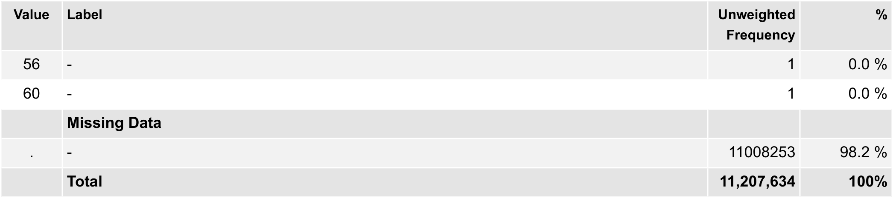

| Unweighted Frequency | %     |
|----------------------|-------|
| 56                   | -     |
| 60                   | -     |
| Missing Data         |       |
| .                    | 1,100,8253 | 98.2% |
| Total                | 11,207,634 | 100%  |

Based upon 199,381 valid cases out of 11,207,634 total cases.  

- Mean: 2.06  
- Median: 2.00  
- Mode: 2.00  
- Minimum: 2.00  
- Maximum: 60.00  
- Standard Deviation: 0.56  

Location: 906-907 (width: 2; decimal: 0)  
Variable Type: numeric  
(Range of) Missing Values: -9, -8, -7, -6, -5, .  

#### V40333: OFFENDER NUMBER 2 - 3

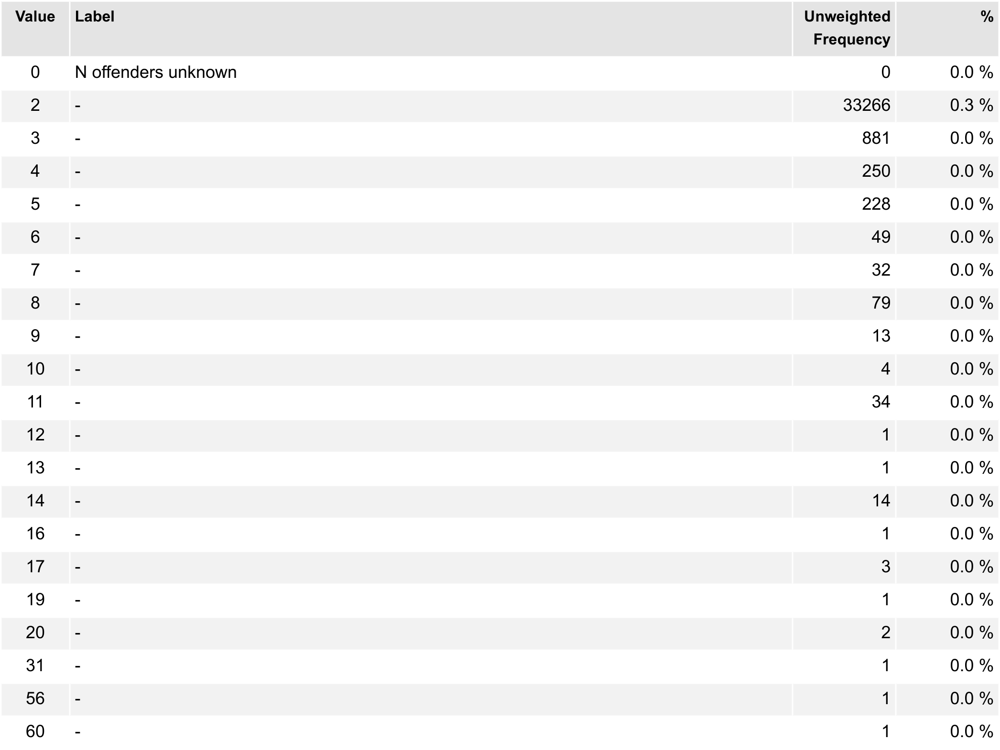


|                           | Unweighted Frequency | %       |
|---------------------------|----------------------|---------|
| **Missing Data**          |                      |         |
| .                         | 11172772             | 99.7%   |
| **Total**                 | **11,207,634**       | **100%**|

Based upon 34,862 valid cases out of 11,207,634 total cases.

- Mean: 2.11
- Median: 2.00
- Mode: 2.00
- Minimum: 2.00
- Maximum: 60.00
- Standard Deviation: 0.81

*Location:* 908-909 (width: 2; decimal: 0)  
*Variable Type:* numeric  
*(Range of) Missing Values:* -9, -8, -7, -6, -5, .

---

**V40341: RELATIONSHIP VIC TO OFF 2 - 1**

|                                                        | Unweighted Frequency | %       |
|--------------------------------------------------------|----------------------|---------|
| 0  N offenders unknown                                 | 0                    | 0.0%    |
| 1  Victim was Spouse                                   | 7427                 | 0.1%    |
| 2  Victim was Common-Law Spouse                        | 895                  | 0.0%    |
| 3  Victim was Parent                                   | 5854                 | 0.1%    |
| 4  Victim was Sibling                                  | 7332                 | 0.1%    |
| 5  Victim was Child                                    | 7542                 | 0.1%    |
| 6  Victim was Grandparent                              | 777                  | 0.0%    |
| 7  Victim was Grandchild                               | 671                  | 0.0%    |
| 8  Victim was In-Law                                   | 1981                 | 0.0%    |
| 9  Victim was Stepparent                               | 885                  | 0.0%    |
| 10 Victim was Stepchild                                | 1164                 | 0.0%    |
| 11 Victim was Stepsibling                              | 303                  | 0.0%    |
| 12 Victim was Other Family Member                      | 9336                 | 0.1%    |
| 13 Victim was Offender                                 | 31640                | 0.3%    |
| 14 Victim was Acquaintance                             | 60440                | 0.5%    |
| 15 Victim was Friend                                   | 9236                 | 0.1%    |
| 16 Victim was Neighbor                                 | 7457                 | 0.1%    |
| 17 Victim was Babysittee (the baby)                    | 170                  | 0.0%    |
| 18 Victim was Boyfriend/Girlfriend                     | 22377                | 0.2%    |
| 19 Victim was Child of Boyfriend/Girlfriend            | 838                  | 0.0%    |
| 20 Homosexual Relationship                             | 0                    | 0.0%    |
| 21 Victim was Ex-Spouse                                | 1390                 | 0.0%    |
| 22 Victim was Employee                                 | 793                  | 0.0%    |


# 274_0.png

|                       | Unweighted Frequency | %    |
|-----------------------|----------------------|------|
| 23 Victim was Employer| 775                  | 0.0 %|
| 24 Victim was Otherwise Known| 36803               | 0.3 %|
| 25 Victim was Stranger| 91341               | 0.8 %|
| 26 Victim was Ex-relationship (Ex-boyfriend/ex-girlfriend)| 4950 | 0.0 %|
| **Missing Data**       |                     |      |
| .                     |                      |      |
| **Total**             | 10895257             | 97.2 %|
| .                     |                      |      |
| **Total**             | **11,207,634**       | **100%**|

Based upon 312,377 valid cases out of 11,207,634 total cases.

- Minimum: 1.00
- Maximum: 26.00

Location: 910-911 (width: 2; decimal: 0)  
Variable Type: numeric  
(Range of) Missing Values: -9, -8, -7, -6, -5, .

# 274_1.png

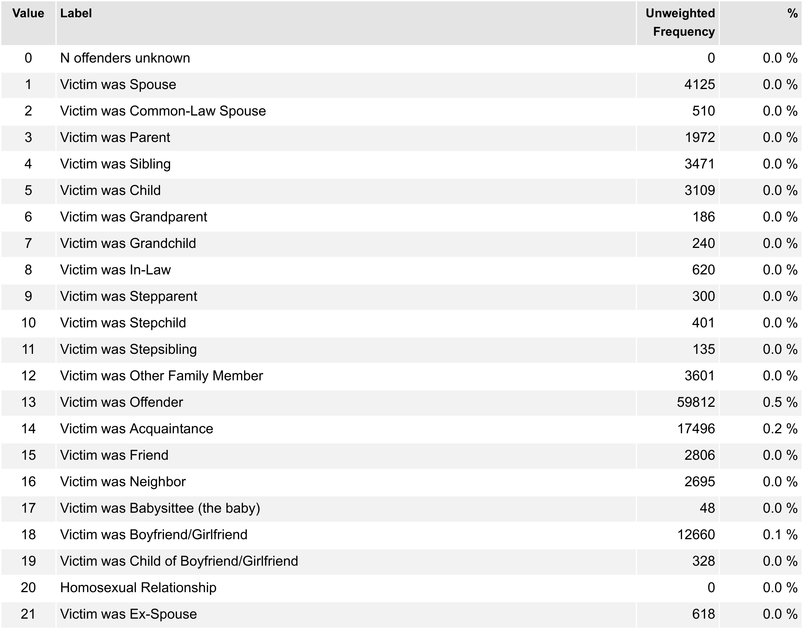


## 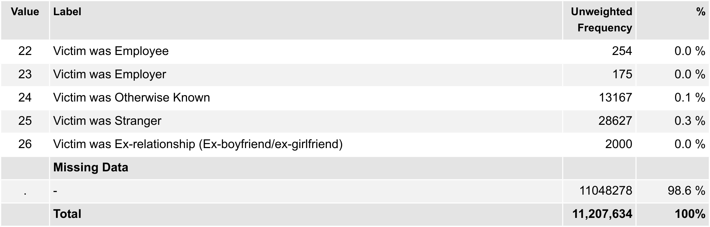

|                                                | Unweighted Frequency | %        |
|------------------------------------------------|-----------------------|----------|
| 22 Victim was Employee                         | 254                   | 0.0 %    |
| 23 Victim was Employer                         | 175                   | 0.0 %    |
| 24 Victim was Otherwise Known                  | 13167                 | 0.1 %    |
| 25 Victim was Stranger                         | 28627                 | 0.3 %    |
| 26 Victim was Ex-relationship (Ex-boyfriend/ex-girlfriend) | 2000           | 0.0 %    |
| Missing Data                                   |                       |          |
| .                                              | 11048278              | 98.6 %   |
| Total                                          | 11,207,634            | 100%     |

Based upon 159,356 valid cases out of 11,207,634 total cases.

- Minimum: 1.00
- Maximum: 26.00

*Location:* 912-913 (width: 2; decimal: 0)
*Variable Type:* numeric
*(Range of) Missing Values:* -9, -8, -7, -6, -5, .

## V40343: RELATIONSHIP VIC TO OFF 2 - 3

## 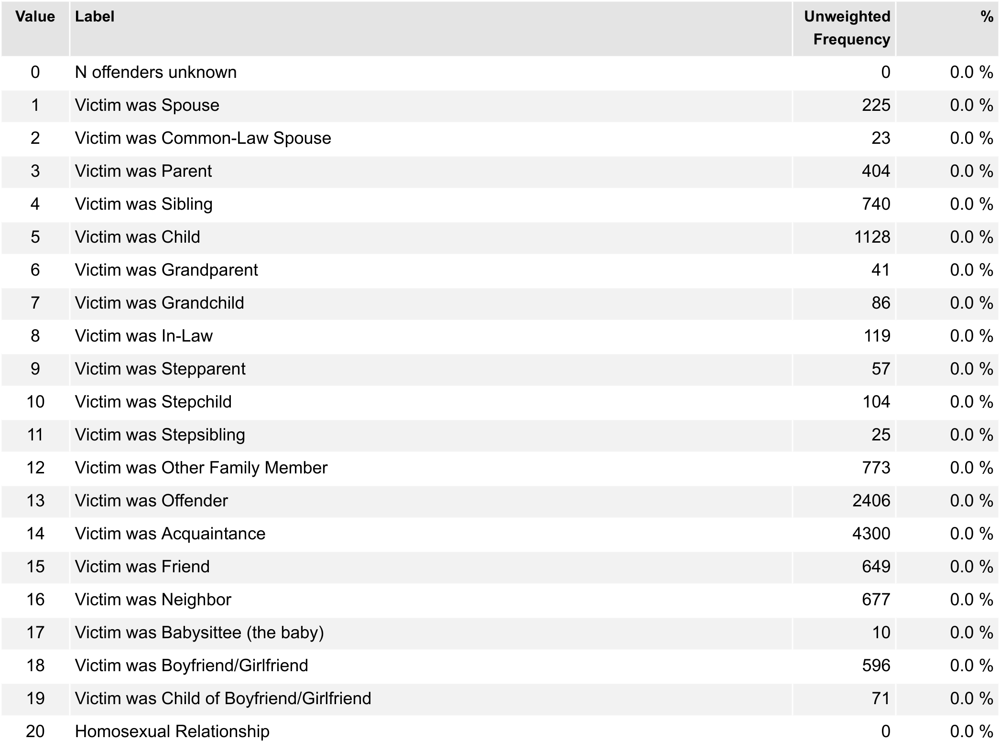

|                                                | Unweighted Frequency | %        |
|------------------------------------------------|-----------------------|----------|
| 0 N offenders unknown                          | 0                     | 0.0 %    |
| 1 Victim was Spouse                            | 225                   | 0.0 %    |
| 2 Victim was Common-Law Spouse                 | 23                    | 0.0 %    |
| 3 Victim was Parent                            | 404                   | 0.0 %    |
| 4 Victim was Sibling                           | 740                   | 0.0 %    |
| 5 Victim was Child                             | 1128                  | 0.0 %    |
| 6 Victim was Grandparent                       | 41                    | 0.0 %    |
| 7 Victim was Grandchild                        | 86                    | 0.0 %    |
| 8 Victim was In-Law                            | 119                   | 0.0 %    |
| 9 Victim was Stepparent                        | 57                    | 0.0 %    |
| 10 Victim was Stepchild                        | 104                   | 0.0 %    |
| 11 Victim was Stepsibling                      | 25                    | 0.0 %    |
| 12 Victim was Other Family Member              | 773                   | 0.0 %    |
| 13 Victim was Offender                         | 2406                  | 0.0 %    |
| 14 Victim was Acquaintance                     | 4300                  | 0.0 %    |
| 15 Victim was Friend                           | 649                   | 0.0 %    |
| 16 Victim was Neighbor                         | 677                   | 0.0 %    |
| 17 Victim was Babysittee (the baby)            | 10                    | 0.0 %    |
| 18 Victim was Boyfriend/Girlfriend             | 596                   | 0.0 %    |
| 19 Victim was Child of Boyfriend/Girlfriend    | 71                    | 0.0 %    |
| 20 Homosexual Relationship                     | 0                     | 0.0 %    |


### 276_0.png

|                                          | Unweighted Frequency | %   |
|------------------------------------------|----------------------|-----|
| 21 Victim was Ex-Spouse                  | 37                   | 0.0 % |
| 22 Victim was Employee                   | 44                   | 0.0 % |
| 23 Victim was Employer                   | 27                   | 0.0 % |
| 24 Victim was Otherwise Known            | 2848                 | 0.0 % |
| 25 Victim was Stranger                   | 8027                 | 0.1 % |
| 26 Victim was Ex-relationship (Ex-boyfriend/ex-girlfriend) | 133 | 0.0 % |
| Missing Data                             |                      |     |
| .                                        |                      |     |
| Total                                    | 11184084             | 99.8 % |
|                                          | 11,207,634           | 100% |

Based upon 23,550 valid cases out of 11,207,634 total cases.

* Minimum: 1.00
* Maximum: 26.00

Location: 914-915 (width: 2; decimal: 0)
Variable Type: numeric
(Range of) Missing Values: -9, -8, -7, -6, -5, .

### 276_1.png

#### V40351: OFFENDER NUMBER 3 - 1

|    | Unweighted Frequency | %   |
|----|----------------------|-----|
| 0  | N offenders unknown  | 0   | 0.0 % |
| 3  |                      | 93382 | 0.8 % |
| 4  |                      | 1175 | 0.0 % |
| 5  |                      | 444 | 0.0 % |
| 6  |                      | 188 | 0.0 % |
| 7  |                      | 130 | 0.0 % |
| 8  |                      | 52  | 0.0 % |
| 9  |                      | 29  | 0.0 % |
| 10 |                      | 19  | 0.0 % |
| 11 |                      | 999 | 0.0 % |
| 12 |                      | 30  | 0.0 % |
| 13 |                      | 12  | 0.0 % |
| 14 |                      | 12  | 0.0 % |
| 15 |                      | 354 | 0.0 % |
| 16 |                      | 6   | 0.0 % |
| 17 |                      | 3   | 0.0 % |
| 18 |                      | 5   | 0.0 % |
| 19 |                      | 104 | 0.0 % |
| 20 |                      | 3   | 0.0 % |
| 21 |                      | 1   | 0.0 % |


#### 277_0.png

|      | Unweighted Frequency | %    |
|------|-----------------------|------|
| 22   | 1                     | 0.0% |
| 23   | -                     |      |
| 24   | 1                     | 0.0% |
| 27   | 11                    | 0.0% |
| 29   | 2                     | 0.0% |
| 31   | 5                     | 0.0% |
| 36   | 1                     | 0.0% |
| 39   | 1                     | 0.0% |
| 42   | 1                     | 0.0% |
| 60   | 1                     | 0.0% |
| 67   | 1                     | 0.0% |
|      |                       |      |
| Missing Data | | |
| .    | 11110613              | 99.1%|
| Total| 11,207,634            | 100% |

Based upon 97,021 valid cases out of 11,207,634 total cases.

- Mean: 3.21
- Median: 3.00
- Mode: 3.00
- Minimum: 3.00
- Maximum: 67.00
- Standard Deviation: 1.43

Location: 916-917 (width: 2; decimal: 0)  
Variable Type: numeric  
(Range of) Missing Values: -9, -8, -7, -6, -5, .

---

#### V40352: OFFENDER NUMBER 3 - 2

#### 277_1.png

|      | Unweighted Frequency | %    |
|------|-----------------------|------|
| 0    | N offenders unknown   | 0.0% |
| 3    | 33296                 | 0.3% |
| 4    | 447                   | 0.0% |
| 5    | 221                   | 0.0% |
| 6    | 84                    | 0.0% |
| 7    | 65                    | 0.0% |
| 8    | 24                    | 0.0% |
| 9    | 18                    | 0.0% |
| 10   | 7                     | 0.0% |
| 11   | 219                   | 0.0% |
| 12   | 13                    | 0.0% |
| 13   | 6                     | 0.0% |


##### 278_0.png

|  | Unweighted Frequency | % |
| -- |  -- | -- |
| 14 | - | - |
| 15 | 82 | 0.0 % |
| 16 | 1 | 0.0 % |
| 17 | 1 | 0.0 % |
| 18 | 1 | 0.0 % |
| 19 | 23 | 0.0 % |
| 20 | 1 | 0.0 % |
| 21 | 1 | 0.0 % |
| 23 | 13 | 0.0 % |
| 27 | 5 | 0.0 % |
| 29 | 1 | 0.0 % |
| 31 | 2 | 0.0 % |
| 48 | 1 | 0.0 % |
| 67 | 1 | 0.0 % |

- **Missing Data**
    - 11,173,099 (99.7 %)
    - **Total**: 11,207,634 (100 %)

Based upon 34,535 valid cases out of 11,207,634 total cases.

- Mean: 3.16
- Median: 3.00
- Mode: 3.00
- Minimum: 3.00
- Maximum: 67.00
- Standard Deviation: 1.26

Location: 918-919 (width: 2; decimal: 0)\
Variable Type: numeric\
(Range of) Missing Values: -9, -8, -7, -6, -5, .

---

#### V40353: OFFENDER NUMBER 3 - 3

##### 278_1.png

|  | Unweighted Frequency | % |
| -- | -- | -- |
| 0 | N offenders unknown | 0 | 0.0 % |
| 3 | 14680 | 0.1 % |
| 4 | 224 | 0.0 % |
| 5 | 77 | 0.0 % |
| 6 | 42 | 0.0 % |
| 7 | 35 | 0.0 % |
| 8 | 12 | 0.0 % |
| 9 | 10 | 0.0 % |
| 10 | 4 | 0.0 % |


### 279_0.png

|      | Unweighted Frequency | %   |
|------|-----------------------|-----|
| 11   | 73                    | 0.0%|
| 12   | 6                     | 0.0%|
| 13   | 5                     | 0.0%|
| 14   | 1                     | 0.0%|
| 15   | 31                    | 0.0%|
| 19   | 12                    | 0.0%|
| 20   | 1                     | 0.0%|
| 23   | 3                     | 0.0%|
| 27   | 1                     | 0.0%|
| 67   | 1                     | 0.0%|
| Missing Data |  |  |
| .    | 11192416              | 99.9%|
| Total| 11,207,634            | 100%|

Based upon 15,218 valid cases out of 11,207,634 total cases.

* Mean: 3.15
* Median: 3.00
* Mode: 3.00
* Minimum: 3.00
* Maximum: 67.00
* Standard Deviation: 1.19

Location: 920-921 (width: 2; decimal: 0)  
Variable Type: numeric  
(Range of) Missing Values: -9, -8, -7, -6, -5, .

### V40361: RELATIONSHIP VIC TO OFF 3 - 1

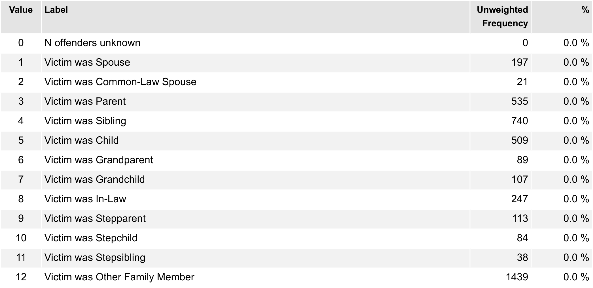


### 280_0.png

|                                  | Unweighted Frequency | %       |
|----------------------------------|----------------------|---------|
| 13 Victim was Offender           | 1400                 | 0.0 %   |
| 14 Victim was Acquaintance       | 13295                | 0.1 %   |
| 15 Victim was Friend             | 1563                 | 0.0 %   |
| 16 Victim was Neighbor           | 1216                 | 0.0 %   |
| 17 Victim was Babysittee (the baby) | 28                   | 0.0 %   |
| 18 Victim was Boyfriend/Girlfriend | 518                   | 0.0 %   |
| 19 Victim was Child of Boyfriend/Girlfriend | 55                    | 0.0 %   |
| 20 Homosexual Relationship       | 0                    | %       |
| 21 Victim was Ex-Spouse          | 64                   | 0.0 %   |
| 22 Victim was Employee           | 118                  | 0.0 %   |
| 23 Victim was Employer           | 122                  | 0.0 %   |
| 24 Victim was Otherwise Known    | 7153                 | 0.1 %   |
| 25 Victim was Stranger           | 25263                | 0.2 %   |
| 26 Victim was Ex-relationship (Ex-boyfriend/ex-girlfriend) | 208                 | 0.0 %   |
| Missing Data                     |                      |         |
| .                                | 1115212              | 99.5 %  |
| Total                            | 11,207,634           | 100%    |

Based upon 55,122 valid cases out of 11,207,634 total cases.

- Minimum: 1.00
- Maximum: 26.00

Location: 922-923 (width: 2; decimal: 0)  
Variable Type: numeric  
(Range of) Missing Values: -9, -8, -7, -6, -5, .

### V40362: RELATIONSHIP VIC TO OFF 3 - 2

#### 280_1.png

|                                  | Unweighted Frequency | %       |
|----------------------------------|----------------------|---------|
| 0 N offenders unknown            | 0                    | 0.0 %   |
| 1 Victim was Spouse              | 170                  | 0.0 %   |
| 2 Victim was Common-Law Spouse   | 12                   | 0.0 %   |
| 3 Victim was Parent              | 321                  | 0.0 %   |
| 4 Victim was Sibling             | 593                  | 0.0 %   |
| 5 Victim was Child               | 353                  | 0.0 %   |
| 6 Victim was Grandparent         | 35                   | 0.0 %   |
| 7 Victim was Grandchild          | 41                   | 0.0 %   |
| 8 Victim was In-Law              | 117                  | 0.0 %   |
| 9 Victim was Stepparent          | 28                   | 0.0 %   |
| 10 Victim was Stepchild          | 35                   | 0.0 %   |
| 11 Victim was Stepsibling        | 23                   | 0.0 %   |


## 281_0.png

|                                      | Unweighted Frequency | %      |
|--------------------------------------|----------------------|--------|
| 12  Victim was Other Family Member   | 678                  | 0.0 %  |
| 13  Victim was Offender              | 1663                 | 0.0 %  |
| 14  Victim was Acquaintance          | 4710                 | 0.0 %  |
| 15  Victim was Friend                | 672                  | 0.0 %  |
| 16  Victim was Neighbor              | 589                  | 0.0 %  |
| 17  Victim was Babysittee (the baby) | 9                    | 0.0 %  |
| 18  Victim was Boyfriend/Girlfriend  | 349                  | 0.0 %  |
| 19  Victim was Child of Boyfriend/Girlfriend | 21           | 0.0 %  |
| 20  Homosexual Relationship          | 0                    | 0.0 %  |
| 21  Victim was Ex-Spouse             | 22                   | 0.0 %  |
| 22  Victim was Employee              | 36                   | 0.0 %  |
| 23  Victim was Employer              | 23                   | 0.0 %  |
| 24  Victim was Otherwise Known       | 2753                 | 0.0 %  |
| 25  Victim was Stranger              | 8488                 | 0.1 %  |
| 26  Victim was Ex-relationship (Ex-boyfriend/ex-girlfriend) | 77 | 0.0 % |
| **Missing Data**                     |                      |        |
| -                                    | 11185816             | 99.8 % |
| **Total**                            | 11,207,634           | 100%   |

Based upon 21,818 valid cases out of 11,207,634 total cases.

- Minimum: 1.00
- Maximum: 26.00

> Location: 924-925 (width: 2; decimal: 0) 
> Variable Type: numeric 
> (Range of) Missing Values: -9, -8, -7, -6, -5, .

## V40363: RELATIONSHIP VIC TO OFF 3 - 3

## 281_1.png

|                                      | Unweighted Frequency | %      |
|--------------------------------------|----------------------|--------|
| 0   N offenders unknown              | 0                    | 0.0 %  |
| 1   Victim was Spouse                | 44                   | 0.0 %  |
| 2   Victim was Common-Law Spouse     | 4                    | 0.0 %  |
| 3   Victim was Parent                | 83                   | 0.0 %  |
| 4   Victim was Sibling               | 198                  | 0.0 %  |
| 5   Victim was Child                 | 112                  | 0.0 %  |
| 6   Victim was Grandparent           | 6                    | 0.0 %  |
| 7   Victim was Grandchild            | 21                   | 0.0 %  |
| 8   Victim was In-Law                | 33                   | 0.0 %  |
| 9   Victim was Stepparent            | 9                    | 0.0 %  |
| 10  Victim was Stepchild             | 15                   | 0.0 %  |


#### 282_0.png

|                              | Unweighted Frequency | %      |
|------------------------------|----------------------|--------|
| 11  Victim was Stepsibling   | 10                   | 0.0 %  |
| 12  Victim was Other Family Member | 238         | 0.0 %  |
| 13  Victim was Offender      | 3581                 | 0.0 %  |
| 14  Victim was Acquaintance  | 1591                 | 0.0 %  |
| 15  Victim was Friend        | 215                  | 0.0 %  |
| 16  Victim was Neighbor      | 225                  | 0.0 %  |
| 17  Victim was Babysittee (the baby) | 5            | 0.0 %  |
| 18  Victim was Boyfriend/Girlfriend | 95           | 0.0 %  |
| 19  Victim was Child of Boyfriend/Girlfriend | 9   | 0.0 %  |
| 20  Homosexual Relationship  | 0                    | 0.0 %  |
| 21  Victim was Ex-Spouse     | 10                   | 0.0 %  |
| 22  Victim was Employee      | 7                    | 0.0 %  |
| 23  Victim was Employer      | 7                    | 0.0 %  |
| 24  Victim was Otherwise Known | 1109               | 0.0 %  |
| 25  Victim was Stranger      | 2836                 | 0.0 %  |
| 26  Victim was Ex-relationship (Ex-boyfriend/ex-girlfriend) | 20 | 0.0 %  |
| Missing Data                 | 11197151             | 99.9 % |
| Total                        | 11,207,634           | 100%   |

Based upon 10,483 valid cases out of 11,207,634 total cases.

- Minimum: 1.00
- Maximum: 26.00

Location: 926-927 (width: 2; decimal: 0)

Variable Type: numeric

(Range of) Missing Values: -9, -8, -7, -6, -5, .

#### V40371: OFFENDER NUMBER 4 - 1

#### 282_1.png

|   | Unweighted Frequency | %      |
|---|----------------------|--------|
| 0 | N offenders unknown  | 0      | 0.0 %  |
| 4 | -                    | 31307  | 0.3 %  |
| 5 | -                    | 417    | 0.0 %  |
| 6 | -                    | 134    | 0.0 %  |
| 7 | -                    | 110    | 0.0 %  |
| 8 | -                    | 47     | 0.0 %  |
| 9 | -                    | 37     | 0.0 %  |
| 10| -                    | 20     | 0.0 %  |
| 11| -                    | 14     | 0.0 %  |
| 12| -                    | 6      | 0.0 %  |


#### 283_0.png

|                   | Unweighted Frequency | %     |
|-------------------|----------------------|-------|
| 13                | 7                    | 0.0 % |
| 14                | 4                    | 0.0 % |
| 15                | 4                    | 0.0 % |
| 16                | 3                    | 0.0 % |
| 17                | 2                    | 0.0 % |
| 19                | 350                  | 0.0 % |
| 20                | 5                    | 0.0 % |
| 21                | 2                    | 0.0 % |
| 22                | 3                    | 0.0 % |
| 23                | 1                    | 0.0 % |
| 24                | 103                  | 0.0 % |
| 25                | 2                    | 0.0 % |
| 28                | 2                    | 0.0 % |
| 29                | 46                   | 0.0 % |
| 30                | 1                    | 0.0 % |
| 31                | 1                    | 0.0 % |
| 32                | 1                    | 0.0 % |
| 34                | 12                   | 0.0 % |
| 36                | 1                    | 0.0 % |
| 39                | 5                    | 0.0 % |
| 48                | 1                    | 0.0 % |
| 71                | 1                    | 0.0 % |
| Missing Data      | 11174985             | 99.7 %|
| .                 | .                    |       |
| Total             | 11,207,634           | 100%  |

Based upon 32,649 valid cases out of 11,207,634 total cases.

- Mean: 4.35
- Median: 4.00
- Mode: 4.00
- Minimum: 4.00
- Maximum: 71.00
- Standard Deviation: 2.38

Location: 928-929 (width: 2; decimal: 0)  
Variable Type: numeric  
(Range of) Missing Values: -9, -8, -7, -6, -5, .

#### V40372: OFFENDER NUMBER 4 - 2

|   | Unweighted Frequency | %     |
|---|----------------------|-------|
| 0 | N offenders unknown  | 0.0 % |

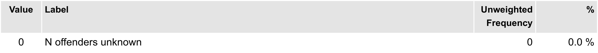


|                         | Unweighted Frequency | %     |
|-------------------------|----------------------|-------|
| 4                       | 11768                | 0.1 % |
| 5                       | 175                  | 0.0 % |
| 6                       | 56                   | 0.0 % |
| 7                       | 68                   | 0.0 % |
| 8                       | 28                   | 0.0 % |
| 9                       | 19                   | 0.0 % |
| 10                      | 14                   | 0.0 % |
| 11                      | 7                    | 0.0 % |
| 12                      | 2                    | 0.0 % |
| 13                      | 3                    | 0.0 % |
| 14                      | 1                    | 0.0 % |
| 15                      | 1                    | 0.0 % |
| 16                      | 3                    | 0.0 % |
| 17                      | 1                    | 0.0 % |
| 19                      | 80                   | 0.0 % |
| 20                      | 1                    | 0.0 % |
| 24                      | 24                   | 0.0 % |
| 28                      | 1                    | 0.0 % |
| 29                      | 12                   | 0.0 % |
| 31                      | 1                    | 0.0 % |
| 32                      | 1                    | 0.0 % |
| 34                      | 5                    | 0.0 % |
| 39                      | 2                    | 0.0 % |
| 49                      | 1                    | 0.0 % |
| 71                      | 1                    | 0.0 % |
| **Missing Data**        |                      |       |
| .                       | 11195359             | 99.9 %|
| **Total**               | **11,207,634**       |**100%**|

Based upon 12,275 valid cases out of 11,207,634 total cases.

- Mean: 4.27
- Median: 4.00
- Mode: 4.00
- Minimum: 4.00
- Maximum: 71.00
- Standard Deviation: 2.10

Location: 930-931 (width: 2; decimal: 0)
Variable Type: numeric
(Range of) Missing Values: -9, -8, -7, -6, -5, .

**V40373: OFFENDER NUMBER 4 - 3**

- 282 -


#### 285_0.png

|   | Unweighted Frequency | %    |
|---|-----------------------|------|
| 0 | N offenders unknown   | 0    | 0.0 % |
| 4 |                      | 5646 | 0.1 % |
| 5 |                      | 80   | 0.0 % |
| 6 |                      | 25   | 0.0 % |
| 7 |                      | 29   | 0.0 % |
| 8 |                      | 17   | 0.0 % |
| 9 |                      | 10   | 0.0 % |
| 10 |                     | 8    | 0.0 % |
| 11 |                     | 5    | 0.0 % |
| 12 |                     | 1    | 0.0 % |
| 13 |                     | 4    | 0.0 % |
| 15 |                     | 1    | 0.0 % |
| 16 |                     | 2    | 0.0 % |
| 17 |                     | 1    | 0.0 % |
| 19 |                     | 32   | 0.0 % |
| 24 |                     | 13   | 0.0 % |
| 29 |                     | 3    | 0.0 % |
| 31 |                     | 1    | 0.0 % |
| 32 |                     | 1    | 0.0 % |
| 34 |                     | 1    | 0.0 % |
| 71 |                     | 1    | 0.0 % |

**Missing Data**

|   |                       |       |
|---|-----------------------|-------|
| . |                       | 11201753 | 99.9 % |

**Total**

|   |                       |       |
|---|-----------------------|-------|
|   |                       | 11201753  | 99.9 % |
|   | **11,207,634**        | **100%** |

Based upon 5,881 valid cases out of 11,207,634 total cases.

- Mean: 4.25
- Median: 4.00
- Mode: 4.00
- Minimum: 4.00
- Maximum: 71.00
- Standard Deviation: 1.99

Location: 932-933 (width: 2; decimal: 0) \
Variable Type: numeric \
(Range of) Missing Values: -9, -8, -7, -6, -5, .

---

#### V40381: RELATIONSHIP VIC TO OFF 4 - 1

#### 285_1.png

|   | Unweighted Frequency | %    |
|---|-----------------------|------|
| 0 | N offenders unknown   | 0    | 0.0 % |
| 1 | Victim was Spouse     | 39   | 0.0 % |


### 286_0.png

|                      | Unweighted Frequency | %    |
|----------------------|-----------------------|------|
| Victim was Common-Law Spouse  | 4                     | 0.0% |
| Victim was Parent              | 112                   | 0.0% |
| Victim was Sibling             | 166                   | 0.0% |
| Victim was Child               | 82                    | 0.0% |
| Victim was Grandparent         | 15                    | 0.0% |
| Victim was Grandchild          | 23                    | 0.0% |
| Victim was In-Law              | 51                    | 0.0% |
| Victim was Stepparent          | 21                    | 0.0% |
| Victim was Stepchild           | 12                    | 0.0% |
| Victim was Stepsibling         | 13                    | 0.0% |
| Victim was Other Family Member | 391                   | 0.0% |
| Victim was Offender            | 277                   | 0.0% |
| Victim was Acquaintance        | 4474                  | 0.0% |
| Victim was Friend              | 479                   | 0.0% |
| Victim was Neighbor            | 344                   | 0.0% |
| Victim was Babysittee (the baby)| 9                    | 0.0% |
| Victim was Boyfriend/Girlfriend| 113                   | 0.0% |
| Victim was Child of Boyfriend/Girlfriend | 6        | 0.0% |
| Homosexual Relationship        | 0                     | 0.0% |
| Victim was Ex-Spouse           | 12                    | 0.0% |
| Victim was Employee            | 28                    | 0.0% |
| Victim was Employer            | 29                    | 0.0% |
| Victim was Otherwise Known     | 2373                  | 0.0% |
| Victim was Stranger            | 8713                  | 0.1% |
| Victim was Ex-relationship (Ex-boyfriend/ex-girlfriend) | 56 | 0.0% |
| Missing Data                   | 11189792              | 99.8% |

| Total                           | 11,207,634            | 100% |

Based upon 17,842 valid cases out of 11,207,634 total cases.

* Minimum: 1.00
* Maximum: 26.00

**Location**: 934-935 (width: 2; decimal: 0)  
**Variable Type**: numeric  
**(Range of) Missing Values**: -9, -8, -7, -6, -5, .

**V40382: RELATIONSHIP VIC TO OFF 4 - 2**


### 286_1.png

|   | Unweighted Frequency | %     |
|---|-----------------------|-------|
| 0 | 0                     | 0.0%  |

**N offenders unknown**


|                  | Unweighted Frequency | %      |
|------------------|----------------------|--------|
| 1  Victim was Spouse                 | 22                   | 0.0 %  |
| 2  Victim was Common-Law Spouse      | 4                    | 0.0 %  |
| 3  Victim was Parent                 | 65                   | 0.0 %  |
| 4  Victim was Sibling                | 114                  | 0.0 %  |
| 5  Victim was Child                  | 46                   | 0.0 %  |
| 6  Victim was Grandparent            | 7                    | 0.0 %  |
| 7  Victim was Grandchild             | 7                    | 0.0 %  |
| 8  Victim was In-Law                 | 24                   | 0.0 %  |
| 9  Victim was Stepparent             | 4                    | 0.0 %  |
| 10 Victim was Stepchild              | 6                    | 0.0 %  |
| 11 Victim was Stepsibling            | 7                    | 0.0 %  |
| 12 Victim was Other Family Member    | 188                  | 0.0 %  |
| 13 Victim was Offender               | 347                  | 0.0 %  |
| 14 Victim was Acquaintance           | 1855                 | 0.0 %  |
| 15 Victim was Friend                 | 212                  | 0.0 %  |
| 16 Victim was Neighbor               | 184                  | 0.0 %  |
| 17 Victim was Babysittee (the baby)  | 4                    | 0.0 %  |
| 18 Victim was Boyfriend/Girlfriend   | 45                   | 0.0 %  |
| 19 Victim was Child of Boyfriend/Girlfriend | 2             | 0.0 %  |
| 20 Homosexual Relationship           | 0                    | 0.0 %  |
| 21 Victim was Ex-Spouse              | 4                    | 0.0 %  |
| 22 Victim was Employee               | 10                   | 0.0 %  |
| 23 Victim was Employer               | 4                    | 0.0 %  |
| 24 Victim was Otherwise Known        | 979                  | 0.0 %  |
| 25 Victim was Stranger               | 3198                 | 0.0 %  |
| 26 Victim was Ex-relationship (Ex-boyfriend/ex-girlfriend) | 11 | 0.0 %  |
| Missing Data .                       | 11200285             | 99.9 % |

| Total                                | 11,207,634           | 100 %  |

Based upon 7,349 valid cases out of 11,207,634 total cases.

- Minimum: 1.00
- Maximum: 26.00

Location: 936-937 (width: 2; decimal: 0)  
Variable Type: numeric  
(Range of) Missing Values: -9, -8, -7, -6, -5, .  

**V40383: RELATIONSHIP VIC TO OFF 4 - 3**  


|                                               | Unweighted Frequency | %        |
|-----------------------------------------------|----------------------|----------|
| N offenders unknown                           | 0                    | 0.0 %    |
| Victim was Spouse                             | 30                   | 0.0 %    |
| Victim was Common-Law Spouse                  | 1                    | 0.0 %    |
| Victim was Parent                             | 45                   | 0.0 %    |
| Victim was Sibling                            | 137                  | 0.0 %    |
| Victim was Child                              | 42                   | 0.0 %    |
| Victim was Grandparent                        | 0                    | 0.0 %    |
| Victim was Grandchild                         | 4                    | 0.0 %    |
| Victim was In-Law                             | 16                   | 0.0 %    |
| Victim was Stepparent                         | 2                    | 0.0 %    |
| Victim was Stepchild                          | 6                    | 0.0 %    |
| Victim was Stepsibling                        | 3                    | 0.0 %    |
| Victim was Other Family Member                | 140                  | 0.0 %    |
| Victim was Offender                           | 309                  | 0.0 %    |
| Victim was Acquaintance                       | 1021                 | 0.0 %    |
| Victim was Friend                             | 158                  | 0.0 %    |
| Victim was Neighbor                           | 112                  | 0.0 %    |
| Victim was Babysittee (the baby)              | 3                    | 0.0 %    |
| Victim was Boyfriend/Girlfriend               | 55                   | 0.0 %    |
| Victim was Child of Boyfriend/Girlfriend      | 5                    | 0.0 %    |
| Homosexual Relationship                       | 0                    | 0.0 %    |
| Victim was Ex-Spouse                          | 3                    | 0.0 %    |
| Victim was Employee                           | 1                    | 0.0 %    |
| Victim was Employer                           | 1                    | 0.0 %    |
| Victim was Otherwise Known                    | 546                  | 0.0 %    |
| Victim was Stranger                           | 1195                 | 0.0 %    |
| Victim was Ex-relationship (Ex-boyfriend/ex-girlfriend) | 2     | 0.0 %    |
| Missing Data                                  |                      |          |
| .                                             | 11203797             | 100.0 %  |
| Total                                         | 11,207,634           | 100%     |

Based upon 3,837 valid cases out of 11,207,634 total cases.

- Minimum: 1.00
- Maximum: 26.00

Location: 938-939 (width: 2; decimal: 0)  
Variable Type: numeric  
(Range of) Missing Values: -9, -8, -7, -6, -5, .

**V40391: OFFENDER NUMBER 5 - 1**


|     |                                  | Unweighted Frequency | %         |
|-----|----------------------------------|---------------------|-----------|
| 0   | N offenders unknown              |                     |           |
| 5   |                                  |                 10987 | 0.1 %     |
| 6   |                                  |                   157 | 0.0 %     |
| 7   |                                  |                    61 | 0.0 %     |
| 8   |                                  |                    30 | 0.0 %     |
| 9   |                                  |                    42 | 0.0 %     |
| 10  |                                  |                    16 | 0.0 %     |
| 11  |                                  |                     7 | 0.0 %     |
| 12  |                                  |                     8 | 0.0 %     |
| 13  |                                  |                     8 | 0.0 %     |
| 14  |                                  |                     2 | 0.0 %     |
| 15  |                                  |                     3 | 0.0 %     |
| 16  |                                  |                     4 | 0.0 %     |
| 17  |                                  |                     1 | 0.0 %     |
| 18  |                                  |                     1 | 0.0 %     |
| 21  |                                  |                     1 | 0.0 %     |
| 23  |                                  |                     1 | 0.0 %     |
| 25  |                                  |                     2 | 0.0 %     |
| 29  |                                  |                   102 | 0.0 %     |
| 30  |                                  |                     2 | 0.0 %     |
| 33  |                                  |                     3 | 0.0 %     |
| 35  |                                  |                    46 | 0.0 %     |
| 36  |                                  |                     1 | 0.0 %     |
| 41  |                                  |                    10 | 0.0 %     |
| 43  |                                  |                     1 | 0.0 %     |
| 47  |                                  |                     5 | 0.0 %     |
| 57  |                                  |                     1 | 0.0 %     |
|     | **Missing Data**                 |            11196132 | 99.9 %     |
|     | **Total**                        |            11,207,634 | 100%     |

Based upon 11,502 valid cases out of 11,207,634 total cases.

- Mean: 5.49
- Median: 5.00
- Mode: 5.00
- Minimum: 5.00
- Maximum: 57.00
- Standard Deviation: 3.41

Location: 940-941 (width: 2; decimal: 0)
Variable Type: numeric
(Range of) Missing Values: -9, -8, -7, -6, -5, .


### V40392: OFFENDER NUMBER 5 - 2

#### 290_0.png

|     | Unweighted Frequency | %     |
|-----|-----------------------|-------|
| 0   | N offenders unknown   | 0     | 0.0 % |
| 5   |                       | 4365  | 0.0 % |
| 6   |                       | 72    | 0.0 % |
| 7   |                       | 29    | 0.0 % |
| 8   |                       | 18    | 0.0 % |
| 9   |                       | 23    | 0.0 % |
| 10  |                       | 8     | 0.0 % |
| 11  |                       | 4     | 0.0 % |
| 12  |                       | 3     | 0.0 % |
| 13  |                       | 5     | 0.0 % |
| 14  |                       | 1     | 0.0 % |
| 15  |                       | 1     | 0.0 % |
| 17  |                       | 1     | 0.0 % |
| 18  |                       | 1     | 0.0 % |
| 21  |                       | 1     | 0.0 % |
| 25  |                       | 2     | 0.0 % |
| 29  |                       | 23    | 0.0 % |
| 33  |                       | 1     | 0.0 % |
| 35  |                       | 12    | 0.0 % |
| 41  |                       | 5     | 0.0 % |
| 47  |                       | 2     | 0.0 % |
| 54  |                       | 1     | 0.0 % |
| **Missing Data** |                       |   |
| .   |                       | 11203056 | 100.0 % |
| .   | **Total**             | **11,207,634** | **100%** |

Based upon 4,578 valid cases out of 11,207,634 total cases.

- **Mean**: 5.38
- **Median**: 5.00
- **Mode**: 5.00
- **Minimum**: 5.00
- **Maximum**: 54.00
- **Standard Deviation**: 2.94

**Location**: 942-943 (width: 2; decimal: 0)  
**Variable Type**: numeric  
**(Range of) Missing Values**: -9, -8, -7, -6, -5, .


## 291_0.png

|                | Unweighted Frequency | %     |
|----------------|-----------------------|-------|
| N offenders unknown | 0                     | 0.0 % |
| 5               | 2176                   | 0.0 % |
| 6               | 34                     | 0.0 % |
| 7               | 8                      | 0.0 % |
| 8               | 8                      | 0.0 % |
| 9               | 13                     | 0.0 % |
| 10              | 7                      | 0.0 % |
| 11              | 1                      | 0.0 % |
| 12              | 3                      | 0.0 % |
| 13              | 3                      | 0.0 % |
| 15              | 1                      | 0.0 % |
| 18              | 1                      | 0.0 % |
| 21              | 1                      | 0.0 % |
| 25              | 1                      | 0.0 % |
| 29              | 12                     | 0.0 % |
| 35              | 3                      | 0.0 % |
| 41              | 1                      | 0.0 % |

**Missing Data**
|                |                       |       |
|----------------|-----------------------|-------|
| .              | 11205361              | 100.0 % |

**Total**
|                |                       |       |
|----------------|-----------------------|-------|
| .              | 11,207,634            | 100%  |

Based upon 2,273 valid cases out of 11,207,634 total cases.

- Mean: 5.30
- Median: 5.00
- Mode: 5.00
- Minimum: 5.00
- Maximum: 41.00
- Standard Deviation: 2.35
  
Location: 944-945 (width: 2; decimal: 0)  
Variable Type: numeric  
(Range of) Missing Values: -9, -8, -7, -6, -5, .

## V40401: RELATIONSHIP VIC TO OFF 5 - 1

### 291_1.png

|                | Unweighted Frequency | %     |
|----------------|-----------------------|-------|
| N offenders unknown | 0                     | 0.0 % |
| Victim was Spouse   | 6                     | 0.0 % |
| Victim was Common-Law Spouse | 1                    | 0.0 % |
| Victim was Parent   | 16                    | 0.0 % |
| Victim was Sibling  | 36                    | 0.0 % |
| Victim was Child    | 25                    | 0.0 % |


### 292_0.png

|    |                                    | Unweighted Frequency | %      |
|----|------------------------------------|----------------------|--------|
| 6  | Victim was Grandparent             | 3                    | 0.0 %  |
| 7  | Victim was Grandchild              | 8                    | 0.0 %  |
| 8  | Victim was In-Law                  | 10                   | 0.0 %  |
| 9  | Victim was Stepparent              | 1                    | 0.0 %  |
| 10 | Victim was Stepchild               | 0                    | 0.0 %  |
| 11 | Victim was Stepsibling             | 1                    | 0.0 %  |
| 12 | Victim was Other Family Member     | 107                  | 0.0 %  |
| 13 | Victim was Offender                | 75                   | 0.0 %  |
| 14 | Victim was Acquaintance            | 1644                 | 0.0 %  |
| 15 | Victim was Friend                  | 154                  | 0.0 %  |
| 16 | Victim was Neighbor                | 116                  | 0.0 %  |
| 17 | Victim was Babysittee (the baby)   | 0                    | 0.0 %  |
| 18 | Victim was Boyfriend/Girlfriend    | 24                   | 0.0 %  |
| 19 | Victim was Child of Boyfriend/Girlfriend | 0              | 0.0 %  |
| 20 | Homosexual Relationship            | 0                    | 0.0 %  |
| 21 | Victim was Ex-Spouse               | 1                    | 0.0 %  |
| 22 | Victim was Employee                | 10                   | 0.0 %  |
| 23 | Victim was Employer                | 8                    | 0.0 %  |
| 24 | Victim was Otherwise Known         | 917                  | 0.0 %  |
| 25 | Victim was Stranger                | 3107                 | 0.0 %  |
| 26 | Victim was Ex-relationship (Ex-boyfriend/ex-girlfriend) | 7      | 0.0 %  |

|      |            |           |        |
|------|------------|-----------|--------|
| .    | Missing Data | 11201357 | 99.9 % |
| .    | -          | 11207634  | 100 %  |

Based upon 6,277 valid cases out of 11,207,634 total cases.

- Minimum: 1.00
- Maximum: 26.00

Location: 946-947 (width: 2; decimal: 0)  
Variable Type: numeric  
(Range of) Missing Values: -9, -8, -7, -6, -5, .

### V40402: RELATIONSHIP VIC TO OFF 5 - 2

### 292_1.png

|    |                                | Unweighted Frequency | %      |
|----|--------------------------------|----------------------|--------|
| 0  | N offenders unknown            | 0                    | 0.0 %  |
| 1  | Victim was Spouse              | 6                    | 0.0 %  |
| 2  | Victim was Common-Law Spouse   | 0                    | 0.0 %  |
| 3  | Victim was Parent              | 12                   | 0.0 %  |
| 4  | Victim was Sibling             | 29                   | 0.0 %  |


## 293_0.png

|                          | Unweighted Frequency | %     |
|------------------------- | -------------------- | ----- |
| 5  Victim was Child      | 11                   | 0.0 % |
| 6  Victim was Grandparent| 2                    | 0.0 % |
| 7  Victim was Grandchild | 4                    | 0.0 % |
| 8  Victim was In-Law     | 9                    | 0.0 % |
| 9  Victim was Stepparent | 0                    | 0.0 % |
| 10 Victim was Stepchild  | 0                    | 0.0 % |
| 11 Victim was Stepsibling| 0                    | 0.0 % |
| 12 Victim was Other Family Member | 58         | 0.0 % |
| 13 Victim was Offender   | 85                   | 0.0 % |
| 14 Victim was Acquaintance | 725                | 0.0 % |
| 15 Victim was Friend     | 73                   | 0.0 % |
| 16 Victim was Neighbor   | 70                   | 0.0 % |
| 17 Victim was Babysittee (the baby) | 0         | 0.0 % |
| 18 Victim was Boyfriend/Girlfriend | 8          | 0.0 % |
| 19 Victim was Child of Boyfriend/Girlfriend | 0 | 0.0 % |
| 20 Homosexual Relationship | 0                  | 0.0 % |
| 21 Victim was Ex-Spouse  | 0                    | 0.0 % |
| 22 Victim was Employee   | 2                    | 0.0 % |
| 23 Victim was Employer   | 0                    | 0.0 % |
| 24 Victim was Otherwise Known | 430            | 0.0 % |
| 25 Victim was Stranger   | 1193                 | 0.0 % |
| 26 Victim was Ex-relationship (Ex-boyfriend/ex-girlfriend) | 2 | 0.0 % |
| Missing Data             |                      |       |
|                          | 11204915             | 100.0 % |
| Total                    | 11,207,634           | 100%  |

Based upon 2,719 valid cases out of 11,207,634 total cases.

- Minimum: 1.00
- Maximum: 26.00

Location: 948-949 (width: 2; decimal: 0)  
Variable Type: numeric  
(Range of) Missing Values: -9, -8, -7, -6, -5, .

---

## V40403: RELATIONSHIP VIC TO OFF 5 - 3

## 293_1.png

|                          | Unweighted Frequency | %     |
|------------------------- | -------------------- | ----- |
| 0  N offenders unknown   | 0                    | 0.0 % |
| 1  Victim was Spouse     | 3                    | 0.0 % |
| 2  Victim was Common-Law Spouse | 0            | 0.0 % |
| 3  Victim was Parent     | 18                   | 0.0 % |


## 294_0.png
|                                             | Unweighted Frequency | %       |
|---------------------------------------------|----------------------|---------|
| 4  Victim was Sibling                       | 23                   | 0.0 %   |
| 5  Victim was Child                         | 12                   | 0.0 %   |
| 6  Victim was Grandparent                   | 0                    | 0.0 %   |
| 7  Victim was Grandchild                    | 1                    | 0.0 %   |
| 8  Victim was In-Law                        | 1                    | 0.0 %   |
| 9  Victim was Stepparent                    | 1                    | 0.0 %   |
| 10 Victim was Stepchild                     | 0                    | 0.0 %   |
| 11 Victim was Stepsibling                   | 0                    | 0.0 %   |
| 12 Victim was Other Family Member           | 43                   | 0.0 %   |
| 13 Victim was Offender                      | 77                   | 0.0 %   |
| 14 Victim was Acquaintance                  | 408                  | 0.0 %   |
| 15 Victim was Friend                        | 53                   | 0.0 %   |
| 16 Victim was Neighbor                      | 44                   | 0.0 %   |
| 17 Victim was Babysittee (the baby)         | 0                    | 0.0 %   |
| 18 Victim was Boyfriend/Girlfriend          | 8                    | 0.0 %   |
| 19 Victim was Child of Boyfriend/Girlfriend | 0                    | 0.0 %   |
| 20 Homosexual Relationship                  | 0                    | 0.0 %   |
| 21 Victim was Ex-Spouse                     | 0                    | 0.0 %   |
| 22 Victim was Employee                      | 0                    | 0.0 %   |
| 23 Victim was Employer                      | 0                    | 0.0 %   |
| 24 Victim was Otherwise Known               | 248                  | 0.0 %   |
| 25 Victim was Stranger                      | 495                  | 0.0 %   |
| 26 Victim was Ex-relationship (Ex-boyfriend/ex-girlfriend) | 0                    | 0.0 %   |
| **Missing Data**                            |                      |         |
| .                                           |                      |         |
| -                                           | 1,120,619            | 100.0 % |
| **Total**                                   | **11,207,634**       | **100%**|

Based upon 1,435 valid cases out of 11,207,634 total cases.

- Minimum: 1.00
- Maximum: 25.00

Location: 950-951 (width: 2; decimal: 0)  
Variable Type: numeric  
(Range of) Missing Values: -9, -8, -7, -6, -5, .

## V40411: OFFENDER NUMBER 6 - 1

## 294_1.png
|                         | Unweighted Frequency | %     |
|-------------------------|----------------------|-------|
| 0 N offenders unknown   | 0                    | 0.0 % |
| 6 -                     | 4,513                | 0.0 % |
| 7 -                     | 79                   | 0.0 % |


## 295_0.png

|               | Unweighted Frequency | %    |
|---------------|-----------------------|------|
| 8             | 31                    | 0.0% |
| 9             | 14                    | 0.0% |
| 10            | 10                    | 0.0% |
| 11            | 15                    | 0.0% |
| 12            | 5                     | 0.0% |
| 13            | 7                     | 0.0% |
| 14            | 7                     | 0.0% |
| 15            | 1                     | 0.0% |
| 16            | 4                     | 0.0% |
| 17            | 1                     | 0.0% |
| 18            | 1                     | 0.0% |
| 19            | 1                     | 0.0% |
| 36            | 1                     | 0.0% |
| 41            | 46                    | 0.0% |
| 42            | 1                     | 0.0% |
| 48            | 10                    | 0.0% |
| 50            | 1                     | 0.0% |
| 55            | 5                     | 0.0% |
| 66            | 1                     | 0.0% |
| Missing Data  |                       |      |
| .             |                       |      |
| Total         | 11202880              | 100.0% |

Based upon 4,754 valid cases out of 11,207,634 total cases.

- Mean: 6.62
- Median: 6.00
- Mode: 6.00
- Minimum: 6.00
- Maximum: 66.00
- Standard Deviation: 4.46

Location: 952-953 (width: 2; decimal: 0)  
Variable Type: numeric  
(Range of) Missing Values: -9, -8, -7, -6, -5, .

## V40412: OFFENDER NUMBER 6 - 2

## 295_1.png

|   | Unweighted Frequency | %    |
|---|-----------------------|------|
| 0 | N offenders unknown   | 0    | 0.0% |
| 6 |                       | 1896 | 0.0% |
| 7 |                       | 35   | 0.0% |
| 8 |                       | 14   | 0.0% |


### 

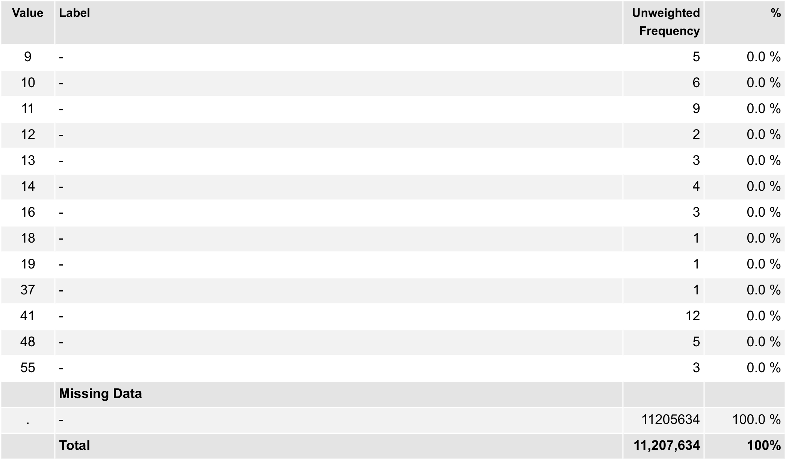

Based upon 2,000 valid cases out of 11,207,634 total cases.

- Mean: 6.54
- Median: 6.00
- Mode: 6.00
- Minimum: 6.00
- Maximum: 55.00
- Standard Deviation: 4.04

Location: 954-955 (width: 2; decimal: 0)  
Variable Type: numeric  
(Range of) Missing Values: -9, -8, -7, -6, -5, .

### V40413: OFFENDER NUMBER 6 - 3

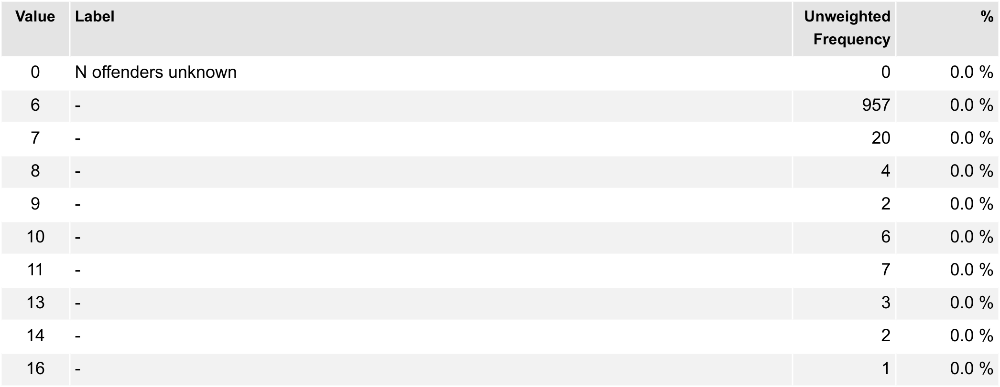


|          | Unweighted Frequency | %     |
|----------|-----------------------|-------|
| 19       | 1                     | 0.0 % |
| 37       | 1                     | 0.0 % |
| 41       | 3                     | 0.0 % |
| 48       | 1                     | 0.0 % |
| Missing Data |                      |       |
| .        | 11206626              | 100.0 %|
| Total    | 11,207,634            | 100 % |

Based upon 1,008 valid cases out of 11,207,634 total cases.

- Mean: 6.33
- Median: 6.00
- Mode: 6.00
- Minimum: 6.00
- Maximum: 48.00
- Standard Deviation: 2.67

Location: 956-957 (width: 2; decimal: 0)  
Variable Type: numeric  
(Range of) Missing Values: -9, -8, -7, -6, -5, .

---

### V40421: RELATIONSHIP VIC TO OFF 6 - 1

|          | Unweighted Frequency | %     |
|----------|-----------------------|-------|
| 0        | N offenders unknown   | 0     | 0.0 % |
| 1        | Victim was Spouse     | 0     | 0.0 % |
| 2        | Victim was Common-Law Spouse | 0     | 0.0 % |
| 3        | Victim was Parent     | 6     | 0.0 % |
| 4        | Victim was Sibling    | 18    | 0.0 % |
| 5        | Victim was Child      | 9     | 0.0 % |
| 6        | Victim was Grandparent| 1     | 0.0 % |
| 7        | Victim was Grandchild | 1     | 0.0 % |
| 8        | Victim was In-Law     | 3     | 0.0 % |
| 9        | Victim was Stepparent | 0     | 0.0 % |
| 10       | Victim was Stepchild  | 0     | 0.0 % |
| 11       | Victim was Stepsibling| 0     | 0.0 % |
| 12       | Victim was Other Family Member | 36 | 0.0 % |
| 13       | Victim was Offender   | 32    | 0.0 % |
| 14       | Victim was Acquaintance| 692  | 0.0 % |
| 15       | Victim was Friend     | 55    | 0.0 % |
| 16       | Victim was Neighbor   | 41    | 0.0 % |
| 17       | Victim was Babysittee (the baby) | 1 | 0.0 % |
| 18       | Victim was Boyfriend/Girlfriend | 7 | 0.0 % |


## 298_0.png

|   |   |
|---|---|
| 19 | Victim was Child of Boyfriend/Girlfriend | 0 | 0.0% |
| 20 | Homosexual Relationship | 0 | 0.0% |
| 21 | Victim was Ex-Spouse | 2 | 0.0% |
| 22 | Victim was Employee | 3 | 0.0% |
| 23 | Victim was Employer | 5 | 0.0% |
| 24 | Victim was Otherwise Known | 418 | 0.0% |
| 25 | Victim was Stranger | 1242 | 0.0% |
| 26 | Victim was Ex-relationship (Ex-boyfriend/ex-girlfriend) | 3 | 0.0% |
|   | Missing Data |   |   |
|   | . |   |   |
|   | - | 11205059 | 100.0% |
|   | Total | 11,207,634 | 100% |

Based upon 2,575 valid cases out of 11,207,634 total cases.

- Minimum: 3.00
- Maximum: 26.00

Location: 958-959 (width: 2; decimal: 0)  
Variable Type: numeric  
(Range of) Missing Values: -9, -8, -7, -6, -5, .  

## 298_1.png

|   |   |
|---|---|
| 0 | N offenders unknown | 0 | 0.0% |
| 1 | Victim was Spouse | 3 | 0.0% |
| 2 | Victim was Common-Law Spouse | 0 | 0.0% |
| 3 | Victim was Parent | 5 | 0.0% |
| 4 | Victim was Sibling | 9 | 0.0% |
| 5 | Victim was Child | 3 | 0.0% |
| 6 | Victim was Grandparent | 0 | 0.0% |
| 7 | Victim was Grandchild | 0 | 0.0% |
| 8 | Victim was In-Law | 1 | 0.0% |
| 9 | Victim was Stepparent | 0 | 0.0% |
| 10 | Victim was Stepchild | 1 | 0.0% |
| 11 | Victim was Stepsibling | 0 | 0.0% |
| 12 | Victim was Other Family Member | 17 | 0.0% |
| 13 | Victim was Offender | 33 | 0.0% |
| 14 | Victim was Acquaintance | 323 | 0.0% |
| 15 | Victim was Friend | 24 | 0.0% |
| 16 | Victim was Neighbor | 24 | 0.0% |
| 17 | Victim was Babysittee (the baby) | 0 | 0.0% |

V40422: RELATIONSHIP VIC TO OFF 6 - 2


### 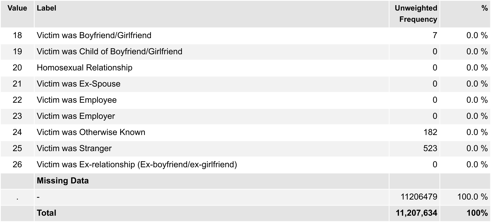

|      |                                         | Unweighted Frequency | %     |
|------|-----------------------------------------|-----------------------|-------|
| 18   | Victim was Boyfriend/Girlfriend          | 7                     | 0.0 % |
| 19   | Victim was Child of Boyfriend/Girlfriend | 0                     | 0.0 % |
| 20   | Homosexual Relationship                  | 0                     | 0.0 % |
| 21   | Victim was Ex-Spouse                     | 0                     | 0.0 % |
| 22   | Victim was Employee                      | 0                     | 0.0 % |
| 23   | Victim was Employer                      | 0                     | 0.0 % |
| 24   | Victim was Otherwise Known               | 182                   | 0.0 % |
| 25   | Victim was Stranger                      | 523                   | 0.0 % |
| 26   | Victim was Ex-relationship (Ex-boyfriend/ex-girlfriend) | 0       | 0.0 % |

|            |            |              |         |
|------------|------------|--------------|---------|
| Missing Data |          |              |         |
| .          |            |              |         |
| Total      |            | 11206479     | 100.0%  |

Based upon 1,155 valid cases out of 11,207,634 total cases.

- Minimum: 1.00
- Maximum: 25.00

Location: 960-961 (width: 2; decimal: 0)
Variable Type: numeric
(Range of) Missing Values: -9, -8, -7, -6, -5, .

### V40423: RELATIONSHIP VIC TO OFF 6 - 3


|      |                               | Unweighted Frequency | %     |
|------|-------------------------------|-----------------------|-------|
| 0    | N offenders unknown            | 0                     | 0.0 % |
| 1    | Victim was Spouse              | 1                     | 0.0 % |
| 2    | Victim was Common-Law Spouse   | 0                     | 0.0 % |
| 3    | Victim was Parent              | 6                     | 0.0 % |
| 4    | Victim was Sibling             | 7                     | 0.0 % |
| 5    | Victim was Child               | 3                     | 0.0 % |
| 6    | Victim was Grandparent         | 0                     | 0.0 % |
| 7    | Victim was Grandchild          | 0                     | 0.0 % |
| 8    | Victim was In-Law              | 0                     | 0.0 % |
| 9    | Victim was Stepparent          | 0                     | 0.0 % |
| 10   | Victim was Stepchild           | 0                     | 0.0 % |
| 11   | Victim was Stepsibling         | 0                     | 0.0 % |
| 12   | Victim was Other Family Member | 17                    | 0.0 % |
| 13   | Victim was Offender            | 21                    | 0.0 % |
| 14   | Victim was Acquaintance        | 207                   | 0.0 % |
| 15   | Victim was Friend              | 19                    | 0.0 % |
| 16   | Victim was Neighbor            | 19                    | 0.0 % |

- 297 -


### 300_0.png

|     | Unweighted Frequency | %    |
|-----|-----------------------|------|
| 17  | Victim was Babysittee (the baby)         | 0     | 0.0% |
| 18  | Victim was Boyfriend/Girlfriend          | 4     | 0.0% |
| 19  | Victim was Child of Boyfriend/Girlfriend | 0     | 0.0% |
| 20  | Homosexual Relationship                  | 0     | 0.0% |
| 21  | Victim was Ex-Spouse                     | 0     | 0.0% |
| 22  | Victim was Employee                      | 0     | 0.0% |
| 23  | Victim was Employer                      | 0     | 0.0% |
| 24  | Victim was Otherwise Known               | 103   | 0.0% |
| 25  | Victim was Stranger                      | 222   | 0.0% |
| 26  | Victim was Ex-relationship (Ex-boyfriend/ex-girlfriend) | 0  | 0.0% |

#### Missing Data

|           |               |
|-----------|---------------|
| .         | 11207005  | 100.0% |

#### Total

|           |               |
|-----------|---------------|
|           | 11207634      |  100% |


Based upon 629 valid cases out of 11,207,634 total cases.

- Minimum: 1.00
- Maximum: 25.00

Location: 962-963 (width: 2; decimal: 0)
Variable Type: numeric
(Range of) Missing Values: -9, -8, -7, -6, -5, .

---

### V40431: OFFENDER NUMBER 7 - 1

### 300_1.png

|     | Unweighted Frequency | %    |
|-----|-----------------------|------|
| 0   | N offenders unknown   | 0     | 0.0% |
| 7   | -                     | 2011  | 0.0% |
| 8   | -                     | 49    | 0.0% |
| 9   | -                     | 12    | 0.0% |
| 10  | -                     | 6     | 0.0% |
| 11  | -                     | 8     | 0.0% |
| 12  | -                     | 7     | 0.0% |
| 13  | -                     | 7     | 0.0% |
| 14  | -                     | 3     | 0.0% |
| 15  | -                     | 5     | 0.0% |
| 16  | -                     | 2     | 0.0% |
| 18  | -                     | 1     | 0.0% |
| 19  | -                     | 1     | 0.0% |
| 55  | -                     | 10    | 0.0% |
| 57  | -                     | 1     | 0.0% |
| 63  | -                     | 5     | 0.0% |


75 -

Missing Data

- -

Total

|                    | Unweighted Frequency | %         |
|--------------------|----------------------|-----------|
| Based upon 2,129 valid cases out of 11,207,634 total cases. |                      |           |
| Mean: 7.55         |                      |           |
| Median: 7.00       |                      |           |
| Mode: 7.00         |                      |           |
| Minimum: 7.00      |                      |           |
| Maximum: 75.00     |                      |           |
| Standard Deviation: 4.69 |                  |           |

Location: 964-965 (width: 2; decimal: 0)

Variable Type: numeric
(Range of) Missing Values: -9, -8, -7, -6, -5, .

---

V40432: OFFENDER NUMBER 7 - 2

|                | Unweighted Frequency | %         |
|----------------|----------------------|-----------|
| 0 N offenders unknown | 0                    | 0.0 %     |
| 7              | 846                  | 0.0 %     |
| 8              | 23                   | 0.0 %     |
| 9              | 3                    | 0.0 %     |
| 10             | 2                    | 0.0 %     |
| 11             | 3                    | 0.0 %     |
| 12             | 6                    | 0.0 %     |
| 13             | 4                    | 0.0 %     |
| 14             | 1                    | 0.0 %     |
| 15             | 2                    | 0.0 %     |
| 16             | 2                    | 0.0 %     |
| 19             | 1                    | 0.0 %     |
| 55             | 5                    | 0.0 %     |
| 56             | 1                    | 0.0 %     |
| 63             | 2                    | 0.0 %     |

Missing Data

- -

Total

|                | Unweighted Frequency | %         |
|----------------|----------------------|-----------|
| Based upon 901 valid cases out of 11,207,634 total cases. |                    |           |
| Mean: 7.62     |                      |           |
| Median: 7.00   |                      |           |


• Mode: 7.00
• Minimum: 7.00
• Maximum: 63.00
• Standard Deviation: 4.80

Location: 966-967 (width: 2; decimal: 0)
Variable Type: numeric
(Range of) Missing Values: -9, -8, -7, -6, -5, .

---

### V40433: OFFENDER NUMBER 7 - 3

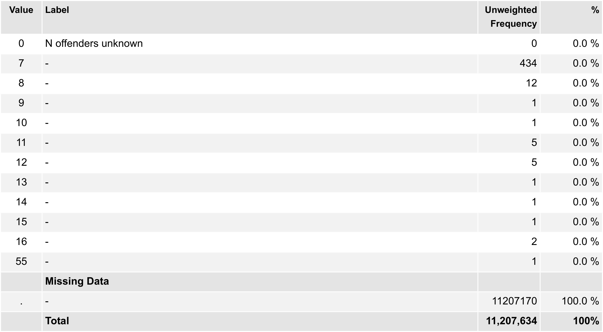

Based upon 464 valid cases out of 11,207,634 total cases.

• Mean: 7.32
• Median: 7.00
• Mode: 7.00
• Minimum: 7.00
• Maximum: 55.00
• Standard Deviation: 2.46

Location: 968-969 (width: 2; decimal: 0)
Variable Type: numeric
(Range of) Missing Values: -9, -8, -7, -6, -5, .

---

### V40441: RELATIONSHIP VIC TO OFF 7 - 1

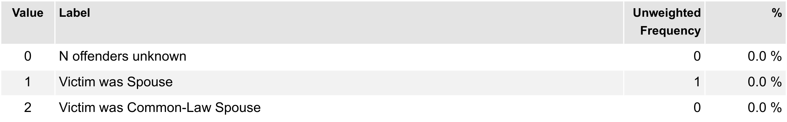


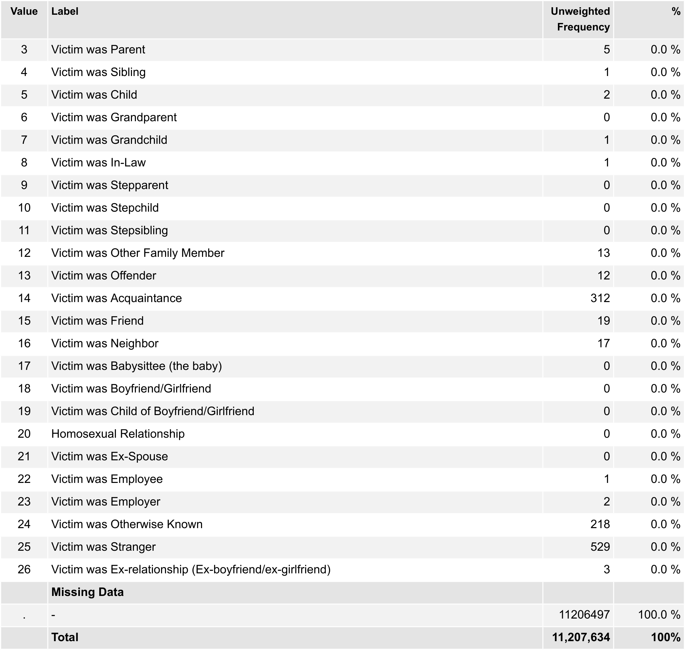

|                                                  | Unweighted Frequency | %    |
|--------------------------------------------------|----------------------|------|
| 3   | Victim was Parent                            | 5                    | 0.0% |
| 4   | Victim was Sibling                           | 1                    | 0.0% |
| 5   | Victim was Child                             | 2                    | 0.0% |
| 6   | Victim was Grandparent                       | 0                    | 0.0% |
| 7   | Victim was Grandchild                        | 1                    | 0.0% |
| 8   | Victim was In-Law                            | 1                    | 0.0% |
| 9   | Victim was Stepparent                        | 0                    | 0.0% |
| 10  | Victim was Stepchild                         | 0                    | 0.0% |
| 11  | Victim was Stepsibling                       | 0                    | 0.0% |
| 12  | Victim was Other Family Member               | 13                   | 0.0% |
| 13  | Victim was Offender                          | 12                   | 0.0% |
| 14  | Victim was Acquaintance                      | 312                  | 0.0% |
| 15  | Victim was Friend                            | 19                   | 0.0% |
| 16  | Victim was Neighbor                          | 17                   | 0.0% |
| 17  | Victim was Babysittee (the baby)             | 0                    | 0.0% |
| 18  | Victim was Boyfriend/Girlfriend              | 0                    | 0.0% |
| 19  | Victim was Child of Boyfriend/Girlfriend     | 0                    | 0.0% |
| 20  | Homosexual Relationship                      | 0                    | 0.0% |
| 21  | Victim was Ex-Spouse                         | 0                    | 0.0% |
| 22  | Victim was Employee                          | 1                    | 0.0% |
| 23  | Victim was Employer                          | 2                    | 0.0% |
| 24  | Victim was Otherwise Known                   | 218                  | 0.0% |
| 25  | Victim was Stranger                          | 529                  | 0.0% |
| 26  | Victim was Ex-relationship (Ex-boyfriend/ex-girlfriend) | 3  | 0.0% |

|            |          |
|------------|----------|
| **Total**  | 11,207,634 | **100%** |

Based upon 1,137 valid cases out of 11,207,634 total cases.

- Minimum: 1.00
- Maximum: 26.00

Location: 970-971 (width: 2; decimal: 0)

Variable Type: numeric

(Range of) Missing Values: -9, -8, -7, -6, -5.

V40442: RELATIONSHIP VIC TO OFF 7 - 2

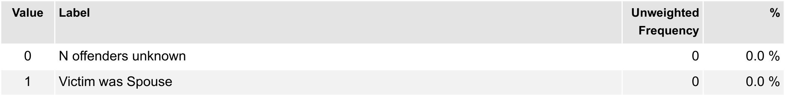

|               | Unweighted Frequency | %    |
|---------------|----------------------|------|
| 0 | N offenders unknown | 0 | 0.0% |
| 1 | Victim was Spouse | 0 | 0.0% |


## 304_0.png

|                                                 | Unweighted Frequency | %      |
|-------------------------------------------------|----------------------|--------|
| Victim was Common-Law Spouse                    | 0                    | 0.0 %  |
| Victim was Parent                               | 1                    | 0.0 %  |
| Victim was Sibling                              | 2                    | 0.0 %  |
| Victim was Child                                | 2                    | 0.0 %  |
| Victim was Grandparent                          | 1                    | 0.0 %  |
| Victim was Grandchild                           | 0                    | 0.0 %  |
| Victim was In-Law                               | 0                    | 0.0 %  |
| Victim was Stepparent                           | 0                    | 0.0 %  |
| Victim was Stepchild                            | 0                    | 0.0 %  |
| Victim was Stepsibling                          | 0                    | 0.0 %  |
| Victim was Other Family Member                  | 8                    | 0.0 %  |
| Victim was Offender                             | 14                   | 0.0 %  |
| Victim was Acquaintance                         | 150                  | 0.0 %  |
| Victim was Friend                               | 9                    | 0.0 %  |
| Victim was Neighbor                             | 10                   | 0.0 %  |
| Victim was Babysittee (the baby)                | 0                    | 0.0 %  |
| Victim was Boyfriend/Girlfriend                 | 0                    | 0.0 %  |
| Victim was Child of Boyfriend/Girlfriend        | 0                    | 0.0 %  |
| Homosexual Relationship                         | 0                    | 0.0 %  |
| Victim was Ex-Spouse                            | 1                    | 0.0 %  |
| Victim was Employee                             | 0                    | 0.0 %  |
| Victim was Employer                             | 0                    | 0.0 %  |
| Victim was Otherwise Known                      | 101                  | 0.0 %  |
| Victim was Stranger                             | 235                  | 0.0 %  |
| Victim was Ex-relationship (Ex-boyfriend/ex-girlfriend) | 1           | 0.0 %  |
| Missing Data                                    | 11207099             | 100.0% |
| Total                                           | 11,207,634           | 100%   |

**Based upon 535 valid cases out of 11,207,634 total cases.**
* Minimum: 3.00
* Maximum: 26.00

Location: 972-973 (width: 2; decimal: 0)
Variable Type: numeric
(Range of) Missing Values: -9, -8, -7, -6, -5, .

## V40443: RELATIONSHIP VIC TO OFF 7 - 3

## 304_1.png

|                         | Unweighted Frequency | %    |
|-------------------------|----------------------|------|
| N offenders unknown     | 0                    | 0.0% |


|                                  | Unweighted Frequency | %      |
|----------------------------------|----------------------|--------|
| 1  Victim was Spouse             | 0                    | 0.0 %  |
| 2  Victim was Common-Law Spouse  | 0                    | 0.0 %  |
| 3  Victim was Parent             | 2                    | 0.0 %  |
| 4  Victim was Sibling            | 1                    | 0.0 %  |
| 5  Victim was Child              | 0                    | 0.0 %  |
| 6  Victim was Grandparent        | 0                    | 0.0 %  |
| 7  Victim was Grandchild         | 0                    | 0.0 %  |
| 8  Victim was In-Law             | 0                    | 0.0 %  |
| 9  Victim was Stepparent         | 0                    | 0.0 %  |
| 10 Victim was Stepchild          | 0                    | 0.0 %  |
| 11 Victim was Stepsibling        | 0                    | 0.0 %  |
| 12 Victim was Other Family Member| 8                    | 0.0 %  |
| 13 Victim was Offender           | 10                   | 0.0 %  |
| 14 Victim was Acquaintance       | 100                  | 0.0 %  |
| 15 Victim was Friend             | 7                    | 0.0 %  |
| 16 Victim was Neighbor           | 7                    | 0.0 %  |
| 17 Victim was Babysittee (the baby)| 0                  | 0.0 %  |
| 18 Victim was Boyfriend/Girlfriend| 0                    | 0.0 %  |
| 19 Victim was Child of Boyfriend/Girlfriend | 0        | 0.0 %  |
| 20 Homosexual Relationship       | 0                    | 0.0 %  |
| 21 Victim was Ex-Spouse          | 0                    | 0.0 %  |
| 22 Victim was Employee           | 0                    | 0.0 %  |
| 23 Victim was Employer           | 0                    | 0.0 %  |
| 24 Victim was Otherwise Known    | 63                   | 0.0 %  |
| 25 Victim was Stranger           | 101                  | 0.0 %  |
| 26 Victim was Ex-relationship (Ex-boyfriend/ex-girlfriend) | 0 |  0.0 %  |

|                                    |            |          |
|------------------------------------|------------|----------|
| Missing Data                       | 11207335   | 100.0 %  |
| .                                  |            |          |
| Total                              | 11,207,634 | 100%     |

Based upon 299 valid cases out of 11,207,634 total cases.

- Minimum: 3.00
- Maximum: 25.00

Location: 974-975 (width: 2; decimal: 0)
Variable Type: numeric
(Range of) Missing Values: -9, -8, -7, -6, -5, . 

**V40451: OFFENDER NUMBER 8 - 1**


### 306_0.png

| Unweighted Frequency | %     |
|----------------------|-------|
| 0                    | 0     |
| 8                    | 1027  | 0.0 % |
|                      | 34    | 0.0 % |
| 10                   | -     |
| 11                   | 13    | 0.0 % |
| 12                   | 6     | 0.0 % |
| 13                   | 6     | 0.0 % |
| 14                   | 3     | 0.0 % |
| 15                   | 4     | 0.0 % |
| 16                   | 3     | 0.0 % |
| 17                   | 2     | 0.0 % |
| 19                   | 1     | 0.0 % |
| 20                   | 1     | 0.0 % |
| 71                   | 5     | 0.0 % |
| 84                   | 1     | 0.0 % |


##### Missing Data

|                      |        |
|----------------------|--------|
|                      | 11206522  | 100.0 % |

**Total**
|                      | 11,207,634 | 100% |


Based upon 1,112 valid cases out of 11,207,634 total cases.

- Mean: 8.57
- Median: 8.00
- Mode: 8.00
- Minimum: 0
- Maximum: 84.00
- Standard Deviation: 4.89

Location: 976-977 (width: 2; decimal: 0)
Variable Type: numeric
(Range of) Missing Values: -9, -8, -7, -6, -5, .


### V40452: OFFENDER NUMBER 8 - 2

### 306_1.png

|                      | Unweighted Frequency | %     |
|----------------------|----------------------|-------|
| 0                    | 0                    | 0.0 % |
| 8                    | 435                  | 0.0 % |
| 9                    | 19                   | 0.0 % |
| 10                   | 2                    | 0.0 % |
| 11                   | 3                    | 0.0 % |
| 12                   | 2                    | 0.0 % |
| 13                   | 4                    | 0.0 % |
| 14                   | 2                    | 0.0 % |


### 307_0.png

|                 | Unweighted Frequency | %     |
|-----------------|----------------------|-------|
| 15              | 2                    | 0.0 % |
| 17              | 2                    | 0.0 % |
| 20              | 1                    | 0.0 % |
| 57              | 1                    | 0.0 % |
| 71              | 2                    | 0.0 % |
| Missing Data    |                      |       |
| .               | 11207159             | 100.0 % |
| Total           | 11,207,634           | 100%  |

Based upon 475 valid cases out of 11,207,634 total cases.

- Mean: 8.61
- Median: 8.00
- Mode: 8.00
- Minimum: 8.00
- Maximum: 71.00
- Standard Deviation: 4.78

*Location: 978-979 (width: 2; decimal: 0)*
*Variable Type: numeric*
*(Range of) Missing Values: -9, -8, -7, -6, -5, .*

### V40453: OFFENDER NUMBER 8 - 3

### 307_1.png

|                 | Unweighted Frequency | %     |
|-----------------|----------------------|-------|
| 0  N offenders unknown  | 0                    | 0.0 % |
| 8               | 217                  | 0.0 % |
| 9               | 8                    | 0.0 % |
| 10              | 2                    | 0.0 % |
| 11              | 1                    | 0.0 % |
| 12              | 3                    | 0.0 % |
| 13              | 4                    | 0.0 % |
| 14              | 1                    | 0.0 % |
| 15              | 1                    | 0.0 % |
| 17              | 1                    | 0.0 % |
| Missing Data    |                      |       |
| .               | 11207396             | 100.0 % |
| Total           | 11,207,634           | 100%  |

Based upon 238 valid cases out of 11,207,634 total cases.

- Mean: 8.29
- Median: 8.00
- Mode: 8.00
- Minimum: 8.00


* Maximum: 17.00
* Standard Deviation: 1.16

Location: 980-981 (width: 2; decimal: 0)

Variable Type: numeric

(Range of) Missing Values: -9, -8, -7, -6, -5, .

---

## V40461: RELATIONSHIP VIC TO OFF 8 - 1

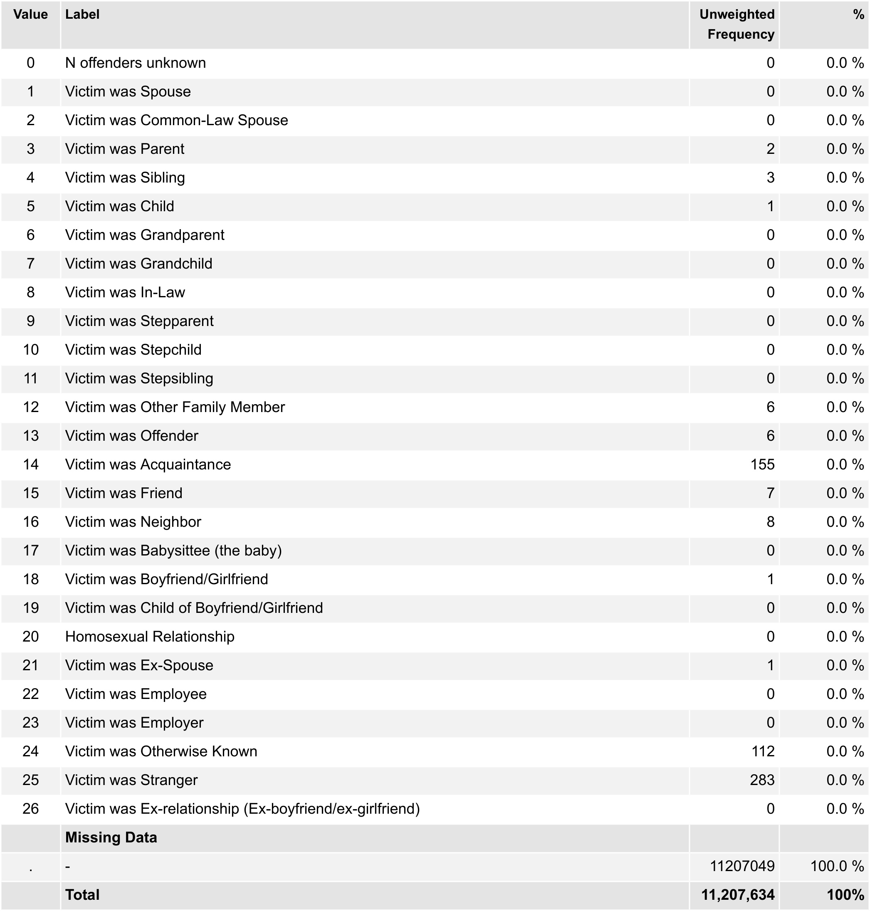

|                                        | Unweighted Frequency | %    |
|----------------------------------------|----------------------|------|
| 0 N offenders unknown                  | 0                    | 0.0% |
| 1 Victim was Spouse                    | 0                    | 0.0% |
| 2 Victim was Common-Law Spouse         | 0                    | 0.0% |
| 3 Victim was Parent                    | 2                    | 0.0% |
| 4 Victim was Sibling                   | 3                    | 0.0% |
| 5 Victim was Child                     | 1                    | 0.0% |
| 6 Victim was Grandparent               | 0                    | 0.0% |
| 7 Victim was Grandchild                | 0                    | 0.0% |
| 8 Victim was In-Law                    | 0                    | 0.0% |
| 9 Victim was Stepparent                | 0                    | 0.0% |
| 10 Victim was Stepchild                | 0                    | 0.0% |
| 11 Victim was Stepsibling              | 0                    | 0.0% |
| 12 Victim was Other Family Member      | 6                    | 0.0% |
| 13 Victim was Offender                 | 6                    | 0.0% |
| 14 Victim was Acquaintance             | 155                  | 0.0% |
| 15 Victim was Friend                   | 7                    | 0.0% |
| 16 Victim was Neighbor                 | 8                    | 0.0% |
| 17 Victim was Babysittee (the baby)    | 0                    | 0.0% |
| 18 Victim was Boyfriend/Girlfriend     | 1                    | 0.0% |
| 19 Victim was Child of Boyfriend/Girlfriend | 0                | 0.0% |
| 20 Homosexual Relationship             | 0                    | 0.0% |
| 21 Victim was Ex-Spouse                | 1                    | 0.0% |
| 22 Victim was Employee                 | 0                    | 0.0% |
| 23 Victim was Employer                 | 0                    | 0.0% |
| 24 Victim was Otherwise Known          | 112                  | 0.0% |
| 25 Victim was Stranger                 | 283                  | 0.0% |
| 26 Victim was Ex-relationship (Ex-boyfriend/ex-girlfriend) | 0    | 0.0% |
| Missing Data                           | 11207049             | 100.0% |
| Total                                  | 11,207,634           | 100% |

Based upon 585 valid cases out of 11,207,634 total cases.


V40462: RELATIONSHIP VIC TO OFF 8 - 2

|                               |  Unweighted Frequency  |  %   |
|-------------------------------|------------------------|------|
| 0  N offenders unknown        | 0                      | 0.0% |
| 1  Victim was Spouse          | 0                      | 0.0% |
| 2  Victim was Common-Law Spouse | 0                     | 0.0% |
| 3  Victim was Parent          | 0                      | 0.0% |
| 4  Victim was Sibling         | 0                      | 0.0% |
| 5  Victim was Child           | 1                      | 0.0% |
| 6  Victim was Grandparent     | 0                      | 0.0% |
| 7  Victim was Grandchild      | 0                      | 0.0% |
| 8  Victim was In-Law          | 0                      | 0.0% |
| 9  Victim was Stepparent      | 0                      | 0.0% |
| 10  Victim was Stepchild       | 0                      | 0.0% |
| 11  Victim was Stepsibling     | 1                      | 0.0% |
| 12  Victim was Other Family Member | 4                | 0.0% |
| 13  Victim was Offender        | 3                      | 0.0% |
| 14  Victim was Acquaintance    | 82                     | 0.0% |
| 15  Victim was Friend          | 5                      | 0.0% |
| 16  Victim was Neighbor        | 6                      | 0.0% |
| 17  Victim was Babysittee (the baby) | 0                | 0.0% |
| 18  Victim was Boyfriend/Girlfriend | 0                 | 0.0% |
| 19  Victim was Child of Boyfriend/Girlfriend | 0        | 0.0% |
| 20  Homosexual Relationship    | 0                      | 0.0% |
| 21  Victim was Ex-Spouse       | 0                      | 0.0% |
| 22  Victim was Employee        | 0                      | 0.0% |
| 23  Victim was Employer        | 0                      | 0.0% |
| 24  Victim was Otherwise Known | 56                     | 0.0% |
| 25  Victim was Stranger        | 130                    | 0.0% |
| 26  Victim was Ex-relationship (Ex-boyfriend/ex-girlfriend) | 0 | 0.0% |

**Missing Data**

| . | 11207346 | 100.0% |

**Total**

| . | 11207346 | 100% |

Based upon 288 valid cases out of 11,207,634 total cases.


• Minimum: 5.00  
• Maximum: 25.00

Location: 984-985 (width: 2; decimal: 0)  
Variable Type: numeric  
(Range of) Missing Values: -9 , -8 , -7 , -6 , -5 , .  

### V40463: RELATIONSHIP VIC TO OFF 8 - 3

|                                    | Unweighted Frequency | %     |
|------------------------------------|----------------------|-------|
| 0  N offenders unknown             | 0                    | 0.0 % |
| 1  Victim was Spouse               | 0                    | 0.0 % |
| 2  Victim was Common-Law Spouse    | 0                    | 0.0 % |
| 3  Victim was Parent               | 1                    | 0.0 % |
| 4  Victim was Sibling              | 1                    | 0.0 % |
| 5  Victim was Child                | 0                    | 0.0 % |
| 6  Victim was Grandparent          | 0                    | 0.0 % |
| 7  Victim was Grandchild           | 0                    | 0.0 % |
| 8  Victim was In-Law               | 0                    | 0.0 % |
| 9  Victim was Stepparent           | 0                    | 0.0 % |
| 10 Victim was Stepchild            | 0                    | 0.0 % |
| 11 Victim was Stepsibling          | 0                    | 0.0 % |
| 12 Victim was Other Family Member  | 2                    | 0.0 % |
| 13 Victim was Offender             | 7                    | 0.0 % |
| 14 Victim was Acquaintance         | 53                   | 0.0 % |
| 15 Victim was Friend               | 3                    | 0.0 % |
| 16 Victim was Neighbor             | 4                    | 0.0 % |
| 17 Victim was Babysittee (the baby)| 0                    | 0.0 % |
| 18 Victim was Boyfriend/Girlfriend | 2                    | 0.0 % |
| 19 Victim was Child of Boyfriend/Girlfriend | 0         | 0.0 % |
| 20 Homosexual Relationship         | 0                    | 0.0 % |
| 21 Victim was Ex-Spouse            | 0                    | 0.0 % |
| 22 Victim was Employee             | 0                    | 0.0 % |
| 23 Victim was Employer             | 0                    | 0.0 % |
| 24 Victim was Otherwise Known      | 33                   | 0.0 % |
| 25 Victim was Stranger             | 57                   | 0.0 % |
| 26 Victim was Ex-relationship (Ex-boyfriend/ex-girlfriend) | 0  | 0.0 % |

| Missing Data       |         |         |
|--------------------|---------|---------|
| .                  | -       |         |
|                    | 11207471| 100.0 % |
| Total              | 11,207,634 | 100% |

Based upon 163 valid cases out of 11,207,634 total cases.


#### V40471: OFFENDER NUMBER 9 - 1

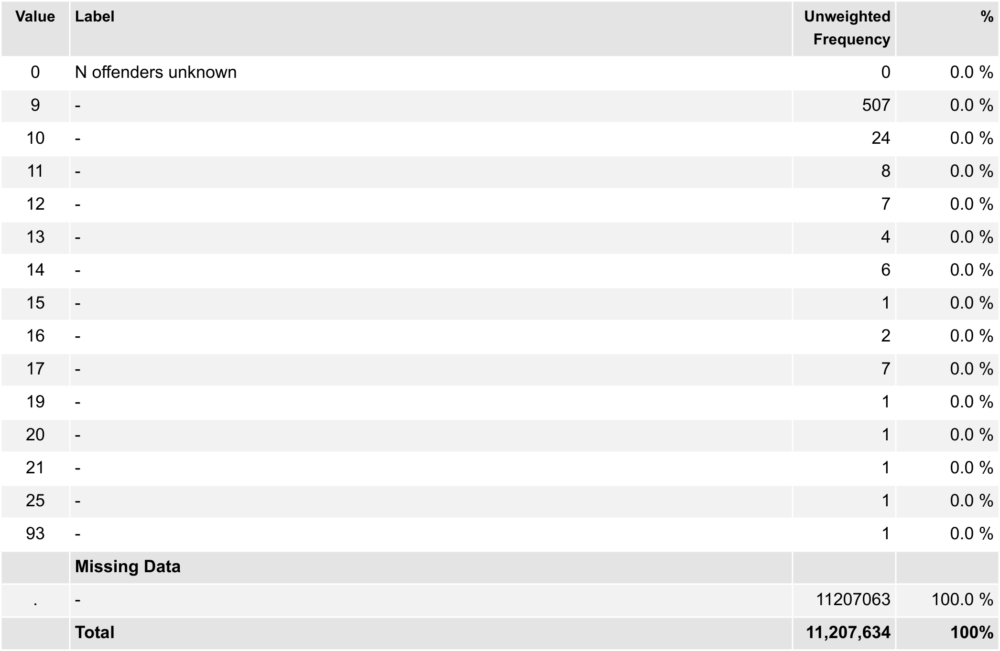

Based upon 571 valid cases out of 11,207,634 total cases.

- Mean: 9.55
- Median: 9.00
- Mode: 9.00
- Minimum: 9.00
- Maximum: 93.00
- Standard Deviation: 3.84

Location: 988-989 (width: 2; decimal: 0)  
Variable Type: numeric  
(Range of) Missing Values: -9, -8, -7, -6, -5, .

#### V40472: OFFENDER NUMBER 9 - 2

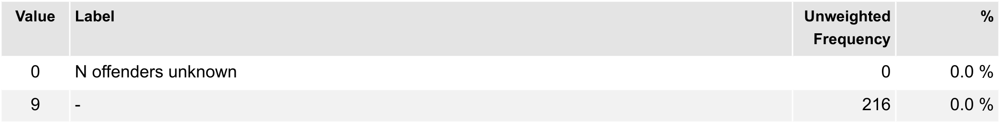


### 312_0.png

|      | Unweighted Frequency | %    |
|------|-----------------------|------|
| 10   | 14                    | 0.0% |
| 11   | 1                     | 0.0% |
| 12   | 2                     | 0.0% |
| 13   | 2                     | 0.0% |
| 14   | 2                     | 0.0% |
| 15   | 1                     | 0.0% |
| 16   | 1                     | 0.0% |
| 17   | 3                     | 0.0% |
| 19   | 1                     | 0.0% |
| 21   | 1                     | 0.0% |
| 25   | 1                     | 0.0% |
| 58   | 1                     | 0.0% |
| .    | -                     | -    |
| Total| 11207388              | 100.0%  |
|      | 11,207,634            | 100% |

Based upon 246 valid cases out of 11,207,634 total cases.

- Mean: 9.67
- Median: 9.00
- Mode: 9.00
- Minimum: 9.00
- Maximum: 58.00
- Standard Deviation: 3.61

Location: 990-991 (width: 2; decimal: 0)  
Variable Type: numeric  
(Range of) Missing Values: -9, -8, -7, -6, -5, .

### V40473: OFFENDER NUMBER 9 - 3

### 312_1.png

|    | Unweighted Frequency | %    |
|----|-----------------------|------|
| 0  | N offenders unknown   | 0    | 0.0% |
| 9  |                       | 114  | 0.0% |
| 10 |                       | 5    | 0.0% |
| 11 |                       | 2    | 0.0% |
| 12 |                       | 1    | 0.0% |
| 13 |                       | 1    | 0.0% |
| 14 |                       | 3    | 0.0% |
| 15 |                       | 1    | 0.0% |
| 16 |                       | 1    | 0.0% |
| 17 |                       | 1    | 0.0% |
| 25 |                       | 1    | 0.0% |


### 313_0.png

|                  | Unweighted Frequency | %      |
|------------------|----------------------|--------|
| **Missing Data** |                      |        |
| .                | 11207504             | 100.0% |
| **Total**        | **11207504**         | **100%** |

Based upon 130 valid cases out of 11,207,634 total cases.

- Mean: 9.52
- Median: 9.00
- Mode: 9.00
- Minimum: 9.00
- Maximum: 25.00
- Standard Deviation: 1.93

Location: 992-993 (width: 2; decimal: 0)  
Variable Type: numeric  
(Range of Missing Values: -9, -8, -7, -6, -5, .)

### V40481: RELATIONSHIP VIC TO OFF 9 - 1
### 313_1.png

|                                             | Unweighted Frequency | %     |
|---------------------------------------------|----------------------|-------|
| 0 N offenders unknown                       | 0                    | 0.0%  |
| 1 Victim was Spouse                         | 1                    | 0.0%  |
| 2 Victim was Common-Law Spouse              | 0                    | 0.0%  |
| 3 Victim was Parent                         | 0                    | 0.0%  |
| 4 Victim was Sibling                        | 1                    | 0.0%  |
| 5 Victim was Child                          | 0                    | 0.0%  |
| 6 Victim was Grandparent                    | 0                    | 0.0%  |
| 7 Victim was Grandchild                     | 0                    | 0.0%  |
| 8 Victim was In-Law                         | 0                    | 0.0%  |
| 9 Victim was Stepparent                     | 0                    | 0.0%  |
| 10 Victim was Stepchild                     | 0                    | 0.0%  |
| 11 Victim was Stepsibling                   | 0                    | 0.0%  |
| 12 Victim was Other Family Member           | 4                    | 0.0%  |
| 13 Victim was Offender                      | 2                    | 0.0%  |
| 14 Victim was Acquaintance                  | 88                   | 0.0%  |
| 15 Victim was Friend                        | 4                    | 0.0%  |
| 16 Victim was Neighbor                      | 5                    | 0.0%  |
| 17 Victim was Babysittee (the baby)         | 0                    | 0.0%  |
| 18 Victim was Boyfriend/Girlfriend          | 1                    | 0.0%  |
| 19 Victim was Child of Boyfriend/Girlfriend | 0                    | 0.0%  |
| 20 Homosexual Relationship                  | 0                    | 0.0%  |
| 21 Victim was Ex-Spouse                     | 0                    | 0.0%  |
| 22 Victim was Employee                      | 0                    | 0.0%  |


### 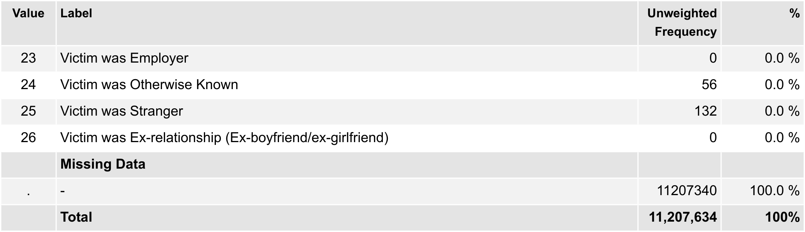

|                                    | Unweighted Frequency | %     |
|------------------------------------|----------------------|-------|
| Victim was Employer                | 0                    | 0.0 % |
| Victim was Otherwise Known         | 56                   | 0.0 % |
| Victim was Stranger                | 132                  | 0.0 % |
| Victim was Ex-relationship         | 0                    | 0.0 % |
| (Ex-boyfriend/ex-girlfriend)       |                      |       |
| Missing Data                       | 11207340             | 100.0 % |
| Total                              | 11,207,634           | 100%  |

Based upon 294 valid cases out of 11,207,634 total cases.

- Minimum: 1.00
- Maximum: 25.00

Location: 994-995 (width: 2; decimal: 0)  
Variable Type: numeric  
(Range of) Missing Values: -9, -8, -7, -6, -5, .  

### V40482: RELATIONSHIP VIC TO OFF 9 - 2

### 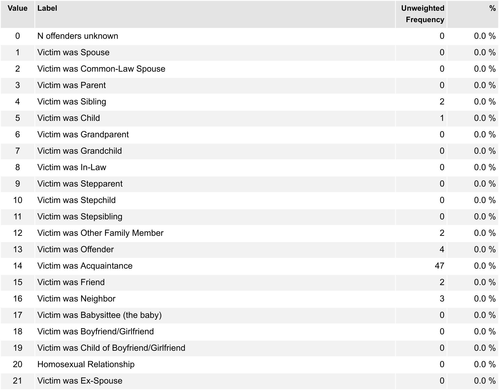

|                                    | Unweighted Frequency | %     |
|------------------------------------|----------------------|-------|
| N offenders unknown                | 0                    | 0.0 % |
| Victim was Spouse                  | 0                    | 0.0 % |
| Victim was Common-Law Spouse       | 0                    | 0.0 % |
| Victim was Parent                  | 0                    | 0.0 % |
| Victim was Sibling                 | 2                    | 0.0 % |
| Victim was Child                   | 1                    | 0.0 % |
| Victim was Grandparent             | 0                    | 0.0 % |
| Victim was Grandchild              | 0                    | 0.0 % |
| Victim was In-Law                  | 0                    | 0.0 % |
| Victim was Stepparent              | 0                    | 0.0 % |
| Victim was Stepchild               | 0                    | 0.0 % |
| Victim was Stepsibling             | 0                    | 0.0 % |
| Victim was Other Family Member     | 2                    | 0.0 % |
| Victim was Offender                | 4                    | 0.0 % |
| Victim was Acquaintance            | 47                   | 0.0 % |
| Victim was Friend                  | 2                    | 0.0 % |
| Victim was Neighbor                | 3                    | 0.0 % |
| Victim was Babysittee (the baby)   | 0                    | 0.0 % |
| Victim was Boyfriend/Girlfriend    | 0                    | 0.0 % |
| Victim was Child of Boyfriend/Girlfriend | 0              | 0.0 % |
| Homosexual Relationship            | 0                    | 0.0 % |
| Victim was Ex-Spouse               | 0                    | 0.0 % |


### 315_0.png

|                    | Unweighted Frequency | %     |
|--------------------|----------------------|-------|
| 22 Victim was Employee | 0                    | 0.0 % |
| 23 Victim was Employer | 0                    | 0.0 % |
| 24 Victim was Otherwise Known | 32                   | 0.0 % |
| 25 Victim was Stranger | 60                   | 0.0 % |
| 26 Victim was Ex-relationship (Ex-boyfriend/ex-girlfriend) | 0                    | 0.0 % |
| Missing Data        |                      |       |
| .                   | 11207481             | 100.0 % |
| Total               | 11,207,634           | 100%  |

Based upon 153 valid cases out of 11,207,634 total cases.

- Minimum: 4.00
- Maximum: 25.00

Location: 996-997 (width: 2; decimal: 0)  
Variable Type: numeric  
(Range of) Missing Values: -9, -8, -7, -6, -5, .

### V40483: RELATIONSHIP VIC TO OFF 9 - 3

### 315_1.png

|                           | Unweighted Frequency | %     |
|---------------------------|----------------------|-------|
| 0 N offenders unknown     | 0                    | 0.0 % |
| 1 Victim was Spouse       | 0                    | 0.0 % |
| 2 Victim was Common-Law Spouse | 0                    | 0.0 % |
| 3 Victim was Parent       | 2                    | 0.0 % |
| 4 Victim was Sibling      | 1                    | 0.0 % |
| 5 Victim was Child        | 0                    | 0.0 % |
| 6 Victim was Grandparent  | 0                    | 0.0 % |
| 7 Victim was Grandchild   | 0                    | 0.0 % |
| 8 Victim was In-Law       | 0                    | 0.0 % |
| 9 Victim was Stepparent   | 0                    | 0.0 % |
| 10 Victim was Stepchild   | 0                    | 0.0 % |
| 11 Victim was Stepsibling | 0                    | 0.0 % |
| 12 Victim was Other Family Member | 2                    | 0.0 % |
| 13 Victim was Offender    | 2                    | 0.0 % |
| 14 Victim was Acquaintance | 37                   | 0.0 % |
| 15 Victim was Friend      | 2                    | 0.0 % |
| 16 Victim was Neighbor    | 1                    | 0.0 % |
| 17 Victim was Babysittee (the baby) | 0                    | 0.0 % |
| 18 Victim was Boyfriend/Girlfriend | 0                    | 0.0 % |
| 19 Victim was Child of Boyfriend/Girlfriend | 0                    | 0.0 % |
| 20 Homosexual Relationship | 0                    | 0.0 % |


### 316_0.png

|                           | Unweighted Frequency | %        |
|---------------------------|----------------------|----------|
| 21 Victim was Ex-Spouse           | 0                    | 0.0 %     |
| 22 Victim was Employee            | 0                    | 0.0 %     |
| 23 Victim was Employer            | 0                    | 0.0 %     |
| 24 Victim was Otherwise Known     | 17                   | 0.0 %     |
| 25 Victim was Stranger            | 24                   | 0.0 %     |
| 26 Victim was Ex-relationship (Ex-boyfriend/ex-girlfriend) | 0         | 0.0 %     |
| Missing Data                      | 11207546             | 100.0 %   |
| Total                             | 11,207,634           | 100%      |

Based upon 88 valid cases out of 11,207,634 total cases.

* Minimum: 3.00
* Maximum: 25.00

Location: 998-999 (width: 2; decimal: 0)  
Variable Type: numeric  
(Range of) Missing Values: -9, -8, -7, -6, -5, .

---

### 316_1.png

|                           | Unweighted Frequency | %        |
|---------------------------|----------------------|----------|
| 0  N offenders unknown            | 0                    | 0.0 %    |
| 10 -                              | 303                  | 0.0 %    |
| 11 -                              | 18                   | 0.0 %    |
| 12 -                              | 7                    | 0.0 %    |
| 13 -                              | 7                    | 0.0 %    |
| 14 -                              | 7                    | 0.0 %    |
| 15 -                              | 6                    | 0.0 %    |
| 17 -                              | 3                    | 0.0 %    |
| 18 -                              | 5                    | 0.0 %    |
| 21 -                              | 2                    | 0.0 %    |
| 22 -                              | 1                    | 0.0 %    |
| 23 -                              | 1                    | 0.0 %    |
| 26 -                              | 1                    | 0.0 %    |
| Missing Data                      | 11207273             | 100.0 %  |
| Total                             | 11,207,634           | 100%     |

Based upon 361 valid cases out of 11,207,634 total cases.

* Mean: 10.65
* Median: 10.00


• Mode: 10.00
• Minimum: 10.00
• Maximum: 26.00
• Standard Deviation: 2.04

*Location*: 1000-1001 (width: 2; decimal: 0)  
*Variable Type*: numeric  
*(Range of) Missing Values*: -9, -8, -7, -6, -5, .

## V40492: OFFENDER NUMBER 10 - 2

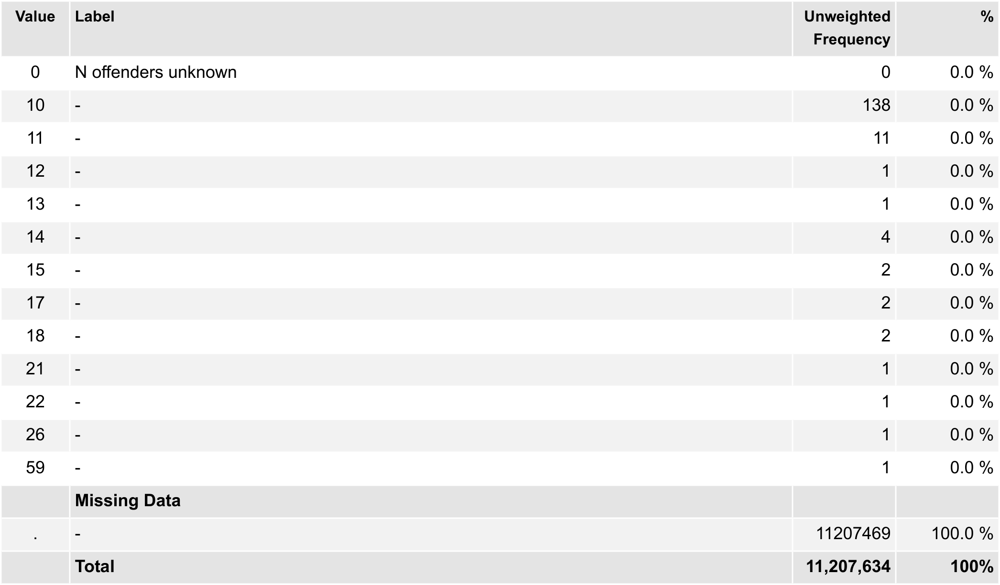

Based upon 165 valid cases out of 11,207,634 total cases.

• Mean: 10.97
• Median: 10.00
• Mode: 10.00
• Minimum: 10.00
• Maximum: 59.00
• Standard Deviation: 4.37

*Location*: 1002-1003 (width: 2; decimal: 0)  
*Variable Type*: numeric  
*(Range of) Missing Values*: -9, -8, -7, -6, -5, .

## V40493: OFFENDER NUMBER 10 - 3


## 318_0.png

|           | Unweighted Frequency | %     |
|-----------|-----------------------|-------|
| 11        | 3                     | 0.0 % |
| 12        | 2                     | 0.0 % |
| 14        | 3                     | 0.0 % |
| 15        | 3                     | 0.0 % |
| 17        | 2                     | 0.0 % |
| 18        | 1                     | 0.0 % |
| 26        | 1                     | 0.0 % |
| Missing Data | -                   | -     |
| Total      | 11207544              | 100.0%|
|          | 11,207,634             | 100%  |

Based upon 90 valid cases out of 11,207,634 total cases.

- Mean: 10.80
- Median: 10.00
- Mode: 10.00
- Minimum: 10.00
- Maximum: 26.00
- Standard Deviation: 2.36

Location: 1004-1005 (width: 2; decimal: 0)

Variable Type: numeric

(Range of) Missing Values: -9, -8, -7, -6, -5, .

## V40501: RELATIONSHIP VIC TO OFF 10 - 1

## 318_1.png

|                                 | Unweighted Frequency | %     |
|---------------------------------|-----------------------|-------|
| 0  N offenders unknown          | 0                     | 0.0 % |
| 1  Victim was Spouse            | 0                     | 0.0 % |
| 2  Victim was Common-Law Spouse | 0                     | 0.0 % |
| 3  Victim was Parent            | 0                     | 0.0 % |
| 4  Victim was Sibling           | 1                     | 0.0 % |
| 5  Victim was Child             | 1                     | 0.0 % |
| 6  Victim was Grandparent       | 0                     | 0.0 % |
| 7  Victim was Grandchild        | 0                     | 0.0 % |
| 8  Victim was In-Law            | 0                     | 0.0 % |
| 9  Victim was Stepparent        | 0                     | 0.0 % |
| 10 Victim was Stepchild         | 0                     | 0.0 % |
| 11 Victim was Stepsibling       | 0                     | 0.0 % |
| 12 Victim was Other Family Member| 4                     | 0.0 % |
| 13 Victim was Offender          | 3                     | 0.0 % |
| 14 Victim was Acquaintance      | 58                    | 0.0 % |
| 15 Victim was Friend            | 4                     | 0.0 % |


## 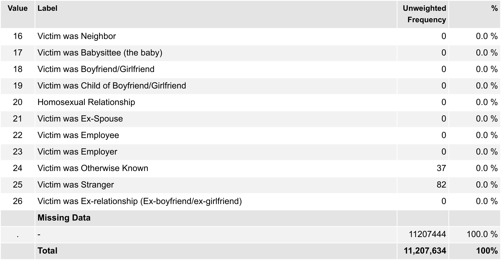

|                                | Unweighted Frequency | %     |
|--------------------------------|----------------------|-------|
| 16 Victim was Neighbor         | 0                    | 0.0 % |
| 17 Victim was Babysittee (the baby) | 0                    | 0.0 % |
| 18 Victim was Boyfriend/Girlfriend | 0                    | 0.0 % |
| 19 Victim was Child of Boyfriend/Girlfriend | 0                    | 0.0 % |
| 20 Homosexual Relationship     | 0                    | 0.0 % |
| 21 Victim was Ex-Spouse        | 0                    | 0.0 % |
| 22 Victim was Employee         | 0                    | 0.0 % |
| 23 Victim was Employer         | 0                    | 0.0 % |
| 24 Victim was Otherwise Known  | 37                   | 0.0 % |
| 25 Victim was Stranger         | 82                   | 0.0 % |
| 26 Victim was Ex-relationship (Ex-boyfriend/ex-girlfriend) | 0                    | 0.0 % |
| Missing Data                   |                      |       |
| .                              | 11207444             | 100.0 % |
| Total                          | 11,207,634           | 100%  |

Based upon 190 valid cases out of 11,207,634 total cases.

- Minimum: 4.00
- Maximum: 25.00

Location: 1006-1007 (width: 2; decimal: 0)  
Variable Type: numeric  
(Range of) Missing Values: -9, -8, -7, -6, -5, .

## V40502: RELATIONSHIP VIC TO OFF 10 - 2

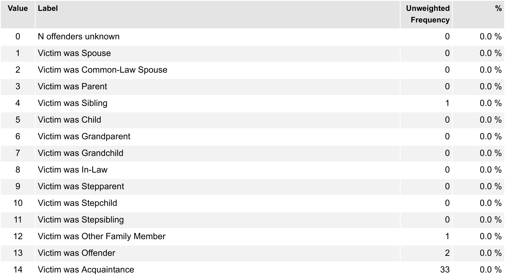

|                                | Unweighted Frequency | %     |
|--------------------------------|----------------------|-------|
| 0 N offenders unknown          | 0                    | 0.0 % |
| 1 Victim was Spouse            | 0                    | 0.0 % |
| 2 Victim was Common-Law Spouse | 0                    | 0.0 % |
| 3 Victim was Parent            | 0                    | 0.0 % |
| 4 Victim was Sibling           | 1                    | 0.0 % |
| 5 Victim was Child             | 0                    | 0.0 % |
| 6 Victim was Grandparent       | 0                    | 0.0 % |
| 7 Victim was Grandchild        | 0                    | 0.0 % |
| 8 Victim was In-Law            | 0                    | 0.0 % |
| 9 Victim was Stepparent        | 0                    | 0.0 % |
| 10 Victim was Stepchild        | 0                    | 0.0 % |
| 11 Victim was Stepsibling      | 0                    | 0.0 % |
| 12 Victim was Other Family Member | 1                | 0.0 % |
| 13 Victim was Offender         | 2                    | 0.0 % |
| 14 Victim was Acquaintance     | 33                   | 0.0 % |


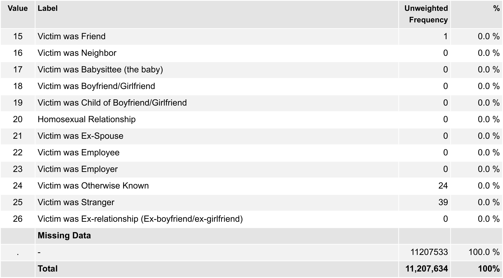

|                                      | Unweighted Frequency | %      |
|--------------------------------------|----------------------|--------|
| 15  Victim was Friend                | 1                    | 0.0 %  |
| 16  Victim was Neighbor              | 0                    | 0.0 %  |
| 17  Victim was Babysittee (the baby) | 0                    | 0.0 %  |
| 18  Victim was Boyfriend/Girlfriend  | 0                    | 0.0 %  |
| 19  Victim was Child of Boyfriend/Girlfriend | 0           | 0.0 %  |
| 20  Homosexual Relationship          | 0                    | 0.0 %  |
| 21  Victim was Ex-Spouse             | 0                    | 0.0 %  |
| 22  Victim was Employee              | 0                    | 0.0 %  |
| 23  Victim was Employer              | 0                    | 0.0 %  |
| 24  Victim was Otherwise Known       | 24                   | 0.0 %  |
| 25  Victim was Stranger              | 39                   | 0.0 %  |
| 26  Victim was Ex-relationship (Ex-boyfriend/ex-girlfriend) | 0    | 0.0 %  |
| Missing Data                         | 11207533             | 100.0 %|
| Total                                | 11,207,634           | 100%   |

Based upon 101 valid cases out of 11,207,634 total cases.

- Minimum: 4.00
- Maximum: 25.00

Location: 1008-1009 (width: 2; decimal: 0)  
Variable Type: numeric  
(Range of) Missing Values: -9, -8, -7, -6, -5, .  

---

### V40503: RELATIONSHIP VIC TO OFF 10 - 3

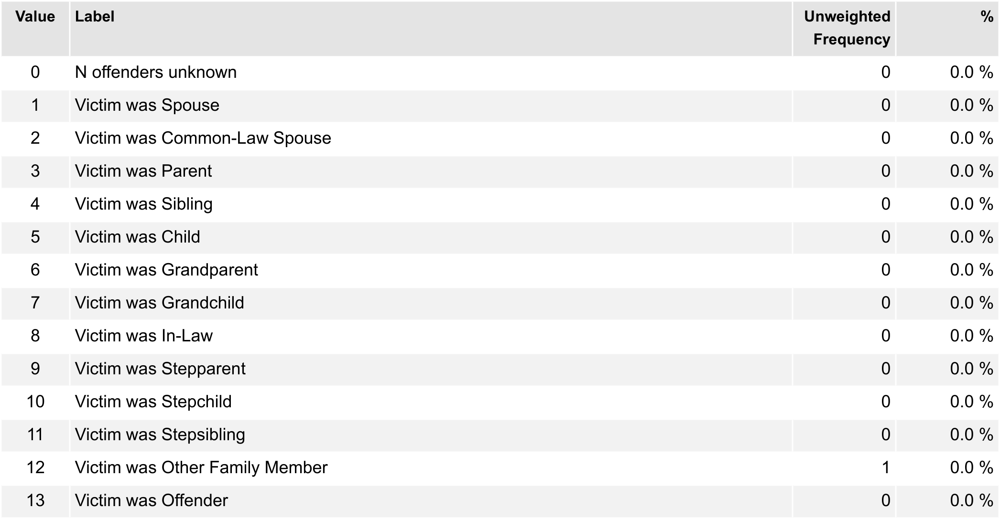

|                                      | Unweighted Frequency | %      |
|--------------------------------------|----------------------|--------|
| 0   N offenders unknown              | 0                    | 0.0 %  |
| 1   Victim was Spouse                | 0                    | 0.0 %  |
| 2   Victim was Common-Law Spouse     | 0                    | 0.0 %  |
| 3   Victim was Parent                | 0                    | 0.0 %  |
| 4   Victim was Sibling               | 0                    | 0.0 %  |
| 5   Victim was Child                 | 0                    | 0.0 %  |
| 6   Victim was Grandparent           | 0                    | 0.0 %  |
| 7   Victim was Grandchild            | 0                    | 0.0 %  |
| 8   Victim was In-Law                | 0                    | 0.0 %  |
| 9   Victim was Stepparent            | 0                    | 0.0 %  |
| 10  Victim was Stepchild             | 0                    | 0.0 %  |
| 11  Victim was Stepsibling           | 0                    | 0.0 %  |
| 12  Victim was Other Family Member   | 1                    | 0.0 %  |
| 13  Victim was Offender              | 0                    | 0.0 %  |


### 321_0.png

|                                          | Unweighted Frequency | %      |
|------------------------------------------|----------------------|--------|
| 14  Victim was Acquaintance              | 26                   | 0.0 %  |
| 15  Victim was Friend                    | 2                    | 0.0 %  |
| 16  Victim was Neighbor                  | 0                    | 0.0 %  |
| 17  Victim was Babysittee (the baby)     | 0                    | 0.0 %  |
| 18  Victim was Boyfriend/Girlfriend      | 0                    | 0.0 %  |
| 19  Victim was Child of Boyfriend/Girlfriend | 0                 | 0.0 %  |
| 20  Homosexual Relationship              | 0                    | 0.0 %  |
| 21  Victim was Ex-Spouse                 | 0                    | 0.0 %  |
| 22  Victim was Employee                  | 0                    | 0.0 %  |
| 23  Victim was Employer                  | 0                    | 0.0 %  |
| 24  Victim was Otherwise Known           | 14                   | 0.0 %  |
| 25  Victim was Stranger                  | 16                   | 0.0 %  |
| 26  Victim was Ex-relationship (Ex-boyfriend/ex-girlfriend) | 0     | 0.0 %  |

| Missing Data          |   |              |
|-----------------------|---|--------------|
| .                     |   |              |
| -                     |   |              |
| **Total**             | **11207575** | **100.0 %** |
|                       | **11,207,634** | **100%**    |

Based upon 59 valid cases out of 11,207,634 total cases.

- Minimum: 12.00
- Maximum: 25.00

Location: 1010-1011 (width: 2; decimal: 0)  
Variable Type: numeric  
(Range of) Missing Values: -9, -8, -7, -6, -5, .


### V50061: OFFENDER SEQUENCE NUMBER - 1

#### 321_1.png

|     | Unweighted Frequency | %      |
|-----|----------------------|--------|
| 0   | N offenders unknown  | 4108610 | 36.7 % |
| 1   |                      | 7005324 | 62.5 % |
| 2   |                      | 65325   | 0.6 %  |
| 3   |                      | 19750   | 0.2 %  |
| 4   |                      | 3408    | 0.0 %  |
| 5   |                      | 3048    | 0.0 %  |
| 6   |                      | 561     | 0.0 %  |
| 7   |                      | 838     | 0.0 %  |
| 8   |                      | 157     | 0.0 %  |
| 9   |                      | 264     | 0.0 %  |
| 10  |                      | 61      | 0.0 %  |
| 11  |                      | 124     | 0.0 %  |
| 12  |                      | 22      | 0.0 %  |


|       | Unweighted Frequency | %     |
|-------|-----------------------|-------|
| 13    | 43                    | 0.0 % |
| 14    | 9                     | 0.0 % |
| 15    | 16                    | 0.0 % |
| 16    | 8                     | 0.0 % |
| 17    | 11                    | 0.0 % |
| 18    | 1                     | 0.0 % |
| 19    | 5                     | 0.0 % |
| 20    | 3                     | 0.0 % |
| 21    | 3                     | 0.0 % |
| 22    | 1                     | 0.0 % |
| 23    | 3                     | 0.0 % |
| 24    | 1                     | 0.0 % |
| 26    | 1                     | 0.0 % |
| 27    | 1                     | 0.0 % |
| 28    | 1                     | 0.0 % |
| 29    | 1                     | 0.0 % |
| 31    | 11                    | 0.0 % |
| 32    | 6                     | 0.0 % |
| 33    | 1                     | 0.0 % |
| 34    | 1                     | 0.0 % |
| 37    | 1                     | 0.0 % |
| 38    | 2                     | 0.0 % |
| 40    | 1                     | 0.0 % |
| 50    | 1                     | 0.0 % |
| 54    | 1                     | 0.0 % |
| 59    | 1                     | 0.0 % |
| 88    | 3                     | 0.0 % |
| 99    | 4                     | 0.0 % |

|       |                       |       |
|-------|-----------------------|-------|
|       | Missing Data          |       |
| .     | 1                     | 0.0 % |
|       | Total                 | 11,207,634 | 100% |

Based upon 11,207,633 valid cases out of 11,207,634 total cases.

- Mean: 0.65
- Median: 1.00
- Mode: 1.00
- Minimum: 0.00
- Maximum: 99.00
- Standard Deviation: 0.53

*Location: 1012-1013 (width: 2; decimal: 0)*
*Variable Type: numeric*


(Range of) Missing Values: -9, -8, -7, -6, -5, .

V50062: OFFENDER SEQUENCE NUMBER - 2

|    | Unweighted Frequency | %     |
|----|----------------------|-------|
| 0  | N offenders unknown  |       |
| 2  | 926176               | 8.3 % |
| 3  | 9715                 | 0.1 % |
| 4  | 4699                 | 0.0 % |
| 5  | 9129                 | 0.1 % |
| 6  | 632                  | 0.0 % |
| 7  | 271                  | 0.0 % |
| 8  | 1873                 | 0.0 % |
| 9  | 99                   | 0.0 % |
| 10 | 46                   | 0.0 % |
| 11 | 590                  | 0.0 % |
| 12 | 29                   | 0.0 % |
| 13 | 15                   | 0.0 % |
| 14 | 174                  | 0.0 % |
| 15 | 8                    | 0.0 % |
| 16 | 7                    | 0.0 % |
| 17 | 81                   | 0.0 % |
| 18 | 9                    | 0.0 % |
| 19 | 3                    | 0.0 % |
| 20 | 19                   | 0.0 % |
| 21 | 1                    | 0.0 % |
| 22 | 4                    | 0.0 % |
| 23 | 9                    | 0.0 % |
| 24 | 1                    | 0.0 % |
| 25 | 1                    | 0.0 % |
| 26 | 4                    | 0.0 % |
| 28 | 1                    | 0.0 % |
| 29 | 1                    | 0.0 % |
| 30 | 3                    | 0.0 % |
| 31 | 13                   | 0.0 % |
| 32 | 7                    | 0.0 % |
| 33 | 12                   | 0.0 % |
| 36 | 2                    | 0.0 % |
| 37 | 1                    | 0.0 % |
| 41 | 1                    | 0.0 % |
| 60 | 1                    | 0.0 % |


|                  | Unweighted Frequency | %     |
|------------------|----------------------|-------|
| Missing Data     |                      |       |
| .                | 10253997             | 91.5% |
| Total            | 11,207,634           | 100%  |

Based upon 953,637 valid cases out of 11,207,634 total cases.

- Mean: 2.08
- Median: 2.00
- Mode: 2.00
- Minimum: 2.00
- Maximum: 60.00
- Standard Deviation: 0.61

Location: 1014-1015 (width: 2; decimal: 0)

Variable Type: numeric

(Range of) Missing Values: -9, -8, -7, -6, -5, .

# V50063: OFFENDER SEQUENCE NUMBER - 3

|   | Unweighted Frequency | %     |
|---|----------------------|-------|
| 0 | N offenders unknown  | 0.0%  |
| 3 |                      | 202554| 1.8% |
| 4 |                      | 1948  | 0.0% |
| 5 |                      | 1111  | 0.0% |
| 6 |                      | 554   | 0.0% |
| 7 |                      | 311   | 0.0% |
| 8 |                      | 87    | 0.0% |
| 9 |                      | 72    | 0.0% |
| 10|                      | 32    | 0.0% |
| 11|                      | 1763  | 0.0% |
| 12|                      | 48    | 0.0% |
| 13|                      | 20    | 0.0% |
| 14|                      | 17    | 0.0% |
| 15|                      | 550   | 0.0% |
| 16|                      | 10    | 0.0% |
| 17|                      | 8     | 0.0% |
| 18|                      | 7     | 0.0% |
| 19|                      | 169   | 0.0% |
| 20|                      | 5     | 0.0% |
| 21|                      | 1     | 0.0% |
| 22|                      | 1     | 0.0% |
| 23|                      | 75    | 0.0% |
| 24|                      | 1     | 0.0% |


|                  | Unweighted Frequency | %      |
|------------------|----------------------|--------|
| 27               | 18                   | 0.0 %  |
| 29               | 2                    | 0.0 %  |
| 31               | 10                   | 0.0 %  |
| 33               | 5                    | 0.0 %  |
| 34               | 2                    | 0.0 %  |
| 35               | 4                    | 0.0 %  |
| 36               | 1                    | 0.0 %  |
| 39               | 1                    | 0.0 %  |
| 42               | 1                    | 0.0 %  |
| 60               | 1                    | 0.0 %  |
| 67               | 1                    | 0.0 %  |
| Missing Data     | 10998244             | 98.1 % |
| Total            | 11,207,634           | 100 %  |

Based upon 209,390 valid cases out of 11,207,634 total cases.

- Mean: 3.17
- Median: 3.00
- Mode: 3.00
- Minimum: 3.00
- Maximum: 67.00
- Standard Deviation: 1.27

Location: 1016-1017 (width: 2; decimal: 0)  
Variable Type: numeric  
(Range of) Missing Values: -9, -8, -7, -6, -5, .

V50071: AGE OF OFFENDER - 1

|     | Unweighted Frequency | %      |
|-----|----------------------|--------|
| 0   | 5231482              | 46.7 % |
| 1   | 2984                 | 0.0 %  |
| 2   | 79                   | 0.0 %  |
| 3   | 437                  | 0.0 %  |
| 4   | 251                  | 0.0 %  |
| 5   | 700                  | 0.0 %  |
| 6   | 1241                 | 0.0 %  |
| 7   | 2032                 | 0.0 %  |
| 8   | 2964                 | 0.0 %  |
| 9   | 4916                 | 0.0 %  |
| 10  | 9625                 | 0.1 %  |
| 11  | 19343                | 0.2 %  |


|                 | Unweighted Frequency | %    |
|-----------------|-----------------------|------|
| 12              | 39016                 | 0.3% |
| 13              | 63066                 | 0.6% |
| 14              | 84554                 | 0.8% |
| 15              | 100102                | 0.9% |
| 16              | 109565                | 1.0% |
| 17              | 111568                | 1.0% |
| 18              | 140747                | 1.3% |
| 19              | 131780                | 1.2% |
| 20              | 144666                | 1.3% |
| 21              | 145537                | 1.3% |
| 22              | 168309                | 1.5% |
| 23              | 144993                | 1.3% |
| 24              | 153218                | 1.4% |
| 25              | 196957                | 1.8% |
| 26              | 153165                | 1.4% |
| 27              | 175674                | 1.6% |
| 28              | 165046                | 1.5% |
| 29              | 173430                | 1.5% |
| 30              | 222764                | 2.0% |
| 31              | 177510                | 1.6% |
| 32              | 191641                | 1.7% |
| 33              | 168235                | 1.5% |
| 34              | 167322                | 1.5% |
| 35              | 191107                | 1.7% |
| 36              | 151520                | 1.4% |
| 37              | 153913                | 1.4% |
| 38              | 137144                | 1.2% |
| 39              | 144567                | 1.3% |
| 40              | 149626                | 1.3% |
| 41              | 122927                | 1.1% |
| 42              | 122258                | 1.1% |
| 43              | 103058                | 0.9% |
| 44              | 95765                 | 0.9% |
| 45              | 98945                 | 0.9% |
| 46              | 75094                 | 0.7% |
| 47              | 73979                 | 0.7% |
| 48              | 65142                 | 0.6% |
| 49              | 65839                 | 0.6% |
| **Total**       | **11,207,634**        | **100%** |


Please note that only the first 50 response categories are displayed in the PDF codebook. To view all response categories, please analyze the data file in the statistical package of your choice (SAS, SPSS, Stata, R).

Based upon 11,207,634 valid cases out of 11,207,634 total cases.

- Mean: 18.12
- Median: 16.00
- Mode: 0.00
- Minimum: 0.00
- Maximum: 99.00
- Standard Deviation: 19.60

Location: 1018-1019 (width: 2; decimal: 0)
Variable Type: numeric
(Range of) Missing Values: -9, -8, -7, -6, -5

V50072: AGE OF OFFENDER - 2

|   | Unweighted Frequency | %   |
|---|-----------------------|-----|
| 0 | 156963                | 1.4%|
| 1 | 228                   | 0.0%|
| 2 | 16                    | 0.0%|
| 3 | 60                    | 0.0%|
| 4 | 43                    | 0.0%|
| 5 | 127                   | 0.0%|
| 6 | 198                   | 0.0%|
| 7 | 380                   | 0.0%|
| 8 | 618                   | 0.0%|
| 9 | 990                   | 0.0%|
| 10| 1868                  | 0.0%|
| 11| 3817                  | 0.0%|
| 12| 8361                  | 0.1%|
| 13| 14337                 | 0.1%|
| 14| 20578                 | 0.2%|
| 15| 25669                 | 0.2%|
| 16| 28552                 | 0.3%|
| 17| 27458                 | 0.2%|
| 18| 28797                 | 0.3%|
| 19| 27030                 | 0.2%|
| 20| 27130                 | 0.2%|
| 21| 24606                 | 0.2%|
| 22| 25338                 | 0.2%|
| 23| 20483                 | 0.2%|
| 24| 21580                 | 0.2%|
| 25| 31671                 | 0.3%|


|     | Unweighted Frequency | %     |
|-----|----------------------|-------|
| 26  | 18887                | 0.2 % |
| 27  | 23137                | 0.2 % |
| 28  | 19331                | 0.2 % |
| 29  | 20451                | 0.2 % |
| 30  | 29303                | 0.3 % |
| 31  | 19592                | 0.2 % |
| 32  | 22244                | 0.2 % |
| 33  | 18443                | 0.2 % |
| 34  | 18616                | 0.2 % |
| 35  | 22931                | 0.2 % |
| 36  | 16214                | 0.1 % |
| 37  | 16865                | 0.2 % |
| 38  | 14231                | 0.1 % |
| 39  | 15588                | 0.1 % |
| 40  | 16684                | 0.1 % |
| 41  | 12574                | 0.1 % |
| 42  | 12719                | 0.1 % |
| 43  | 10463                | 0.1 % |
| 44  | 9850                 | 0.1 % |
| 45  | 10794                | 0.1 % |
| 46  | 7434                 | 0.1 % |
| 47  | 7539                 | 0.1 % |
| 48  | 6396                 | 0.1 % |
| 49  | 6472                 | 0.1 % |

| Missing Data  | 10253996 | 91.5 % |
|---------------|----------|--------|
| Total         | 11,207,634 | 100%  |

Please note that only the first 50 response categories are displayed in the PDF codebook. To view all response categories, please analyze the data file in the statistical package of your choice (SAS, SPSS, Stata, R).

Based upon 953,638 valid cases out of 11,207,634 total cases.

- Mean: 25.41
- Median: 25.00
- Mode: 0.00
- Minimum: 0.00
- Maximum: 99.00
- Standard Deviation: 16.45

Location: 1020-1021 (width: 2; decimal: 0)
Variable Type: numeric
(Range of) Missing Values: -9, -8 , -7 , -6 , -5 , .


# V50073: AGE OF OFFENDER - 3

|     | Unweighted Frequency | %    |
|-----|-----------------------|------|
| 0   | 45252                 | 0.4% |
| 1   | 57                    | 0.0% |
| 2   | 2                     | 0.0% |
| 3   | 16                    | 0.0% |
| 4   | 15                    | 0.0% |
| 5   | 51                    | 0.0% |
| 6   | 74                    | 0.0% |
| 7   | 113                   | 0.0% |
| 8   | 216                   | 0.0% |
| 9   | 380                   | 0.0% |
| 10  | 625                   | 0.0% |
| 11  | 1215                  | 0.0% |
| 12  | 2764                  | 0.0% |
| 13  | 4726                  | 0.0% |
| 14  | 7413                  | 0.1% |
| 15  | 9396                  | 0.1% |
| 16  | 10398                 | 0.1% |
| 17  | 9431                  | 0.1% |
| 18  | 8687                  | 0.1% |
| 19  | 7110                  | 0.1% |
| 20  | 6747                  | 0.1% |
| 21  | 5669                  | 0.1% |
| 22  | 5412                  | 0.0% |
| 23  | 3876                  | 0.0% |
| 24  | 3975                  | 0.0% |
| 25  | 6495                  | 0.1% |
| 26  | 3088                  | 0.0% |
| 27  | 3940                  | 0.0% |
| 28  | 3064                  | 0.0% |
| 29  | 3250                  | 0.0% |
| 30  | 4934                  | 0.0% |
| 31  | 2902                  | 0.0% |
| 32  | 3465                  | 0.0% |
| 33  | 2716                  | 0.0% |
| 34  | 2776                  | 0.0% |
| 35  | 3578                  | 0.0% |
| 36  | 2325                  | 0.0% |


### 330_0.png

|      | Unweighted Frequency | %    |
|------|-----------------------|------|
| 37   | 2395                  | 0.0% |
| 38   | 2009                  | 0.0% |
| 39   | 2244                  | 0.0% |
| 40   | 2493                  | 0.0% |
| 41   | 1856                  | 0.0% |
| 42   | 1749                  | 0.0% |
| 43   | 1499                  | 0.0% |
| 44   | 1405                  | 0.0% |
| 45   | 1588                  | 0.0% |
| 46   | 1051                  | 0.0% |
| 47   | 1038                  | 0.0% |
| 48   | 873                   | 0.0% |
| 49   | 919                   | 0.0% |
|      |                       |      |
| Missing Data | 10998243      | 98.1%|
| Total        | 11,207,634    | 100% |

Please note that only the first 50 response categories are displayed in the PDF codebook. To view all response categories, please analyze the data file in the statistical package of your choice (SAS, SPSS, Stata, R).

Based upon 209,391 valid cases out of 11,207,634 total cases.

- Mean: 20.95
- Median: 19.00
- Mode: 0.00
- Minimum: 0.00
- Maximum: 99.00
- Standard Deviation: 15.74

*Location: 1022-1023 (width: 2; decimal: 0)*
*Variable Type: numeric*
*(Range of) Missing Values: -9, -8, -7, -6, -5, .*


### V50081: SEX OF OFFENDER - 1

### 330_1.png

|      | Unweighted Frequency | %    |
|------|-----------------------|------|
| 0    | Female                | 1700229 | 15.2% |
| 1    | Male                  | 4559181 | 40.7% |
|      |                       |        |
| Missing Data |                | 4948224 | 44.2% |
| Total        |                | 11,207,634 | 100% |

Based upon 6,259,410 valid cases out of 11,207,634 total cases.

- Minimum: 0.00


V50082: SEX OF OFFENDER - 2


Based upon 895,780 valid cases out of 11,207,634 total cases.

- Minimum: 0.00
- Maximum: 1.00

Location: 1026-1027 (width: 2; decimal: 0)  
Variable Type: numeric  
(Range of) Missing Values: -9, -8, -7, -6, -5, .

V50083: SEX OF OFFENDER - 3

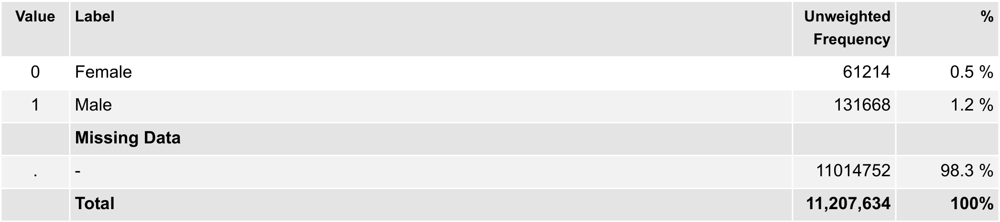

Based upon 192,882 valid cases out of 11,207,634 total cases.

- Minimum: 0.00
- Maximum: 1.00

Location: 1028-1029 (width: 2; decimal: 0)  
Variable Type: numeric  
(Range of) Missing Values: -9, -8, -7, -6, -5, .

V50091: RACE OF OFFENDER - 1

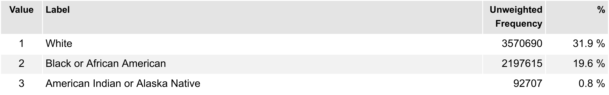


### 332_0.png

|                              | Unweighted Frequency |       %       |
|------------------------------|----------------------|---------------|
| 4  Asian                     | 70743                | 0.6 %         |
| 5  Native Hawaiian or Other Pacific Islander | 22670 | 0.2 % |
| **Missing Data**             |                      |               |
| -7  Unknown/missing/DNR      | 1144598              | 10.2 %        |
| .  -                         | 4108611              | 36.7 %        |
| **Total**                    | 11,207,634           | 100%          |

Based upon 5,954,425 valid cases out of 11,207,634 total cases.

- Minimum: 1.00
- Maximum: 5.00

Location: 1030-1031 (width: 2; decimal: 0)  
Variable Type: numeric  
(Range of) Missing Values: -9, -8, -7, -6, -5, .  

---

### V50092: RACE OF OFFENDER - 2


|                              | Unweighted Frequency |       %       |
|------------------------------|----------------------|---------------|
| 1  White                     | 479633               | 4.3 %         |
| 2  Black or African American | 334897               | 3.0 %         |
| 3  American Indian or Alaska Native | 12206       | 0.1 %         |
| 4  Asian                     | 8532                 | 0.1 %         |
| 5  Native Hawaiian or Other Pacific Islander | 3142 | 0.0 %         |
| **Missing Data**             |                      |               |
| -7  Unknown/missing/DNR      | 115228               | 1.0 %         |
| .  -                         | 10253996             | 91.5 %        |
| **Total**                    | 11,207,634           | 100%          |

Based upon 838,410 valid cases out of 11,207,634 total cases.

- Minimum: 1.00
- Maximum: 5.00

Location: 1032-1033 (width: 2; decimal: 0)  
Variable Type: numeric  
(Range of) Missing Values: -9, -8, -7, -6, -5, .  

---

### V50093: RACE OF OFFENDER - 3

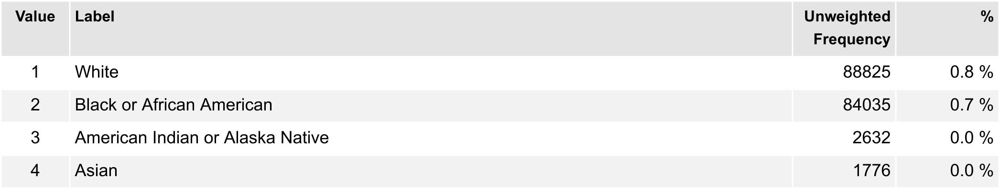

|                              | Unweighted Frequency |       %       |
|------------------------------|----------------------|---------------|
| 1  White                     | 88825                | 0.8 %         |
| 2  Black or African American | 84035                | 0.7 %         |
| 3  American Indian or Alaska Native | 2632         | 0.0 %         |
| 4  Asian                     | 1776                 | 0.0 %         |


## 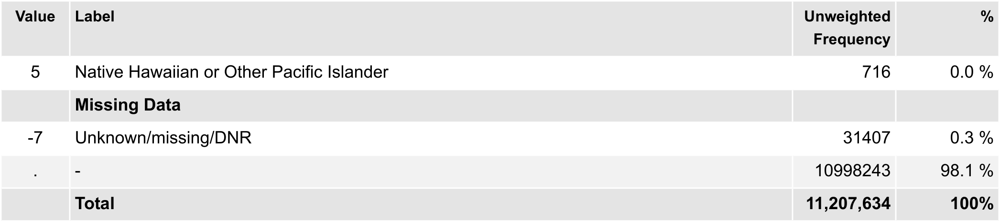

|   |  | Unweighted Frequency | %  |
|---|---|---|---|
| 5 | Native Hawaiian or Other Pacific Islander | 716 | 0.0 % |
|   | **Missing Data** |  |  |
| -7 | Unknown/missing/DNR | 31407 | 0.3 % |
| . | - | 10998243 | 98.1 % |
|   | **Total** |  |  |
|   |  | 11207634 | 100% |

Based upon 177,984 valid cases out of 11,207,634 total cases.

- Minimum: 1.00
- Maximum: 5.00

Location: 1034-1035 (width: 2; decimal: 0)  
Variable Type: numeric  
(Range of) Missing Values: -9, -8, -7, -6, -5, .

## V50111: ETHNICITY OF OFFENDER - 1

## 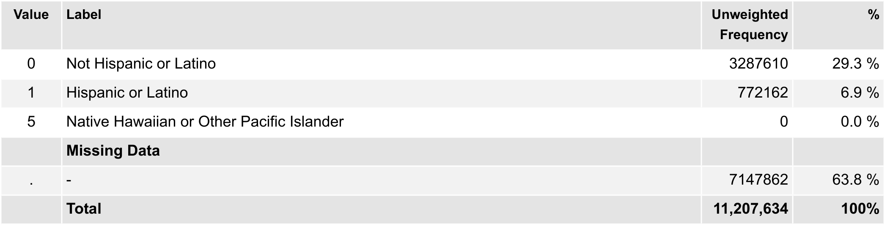

|  |  | Unweighted Frequency | % |
|---|---|---|---|
| 0 | Not Hispanic or Latino | 3287610 | 29.3 % |
| 1 | Hispanic or Latino | 772162 | 6.9 % |
| 5 | Native Hawaiian or Other Pacific Islander | 0 | 0.0 % |
|  | **Missing Data** |  |  |
| . | - | 7147862 | 63.8 % |
|  | **Total** |  |  |
|  |  | 11207634 | 100% |

Based upon 4,059,772 valid cases out of 11,207,634 total cases.

- Minimum: 0.00
- Maximum: 1.00

Location: 1036-1037 (width: 2; decimal: 0)  
Variable Type: numeric  
(Range of) Missing Values: -9, -8, -7, -6, -5, .

## V50112: ETHNICITY OF OFFENDER - 2

## 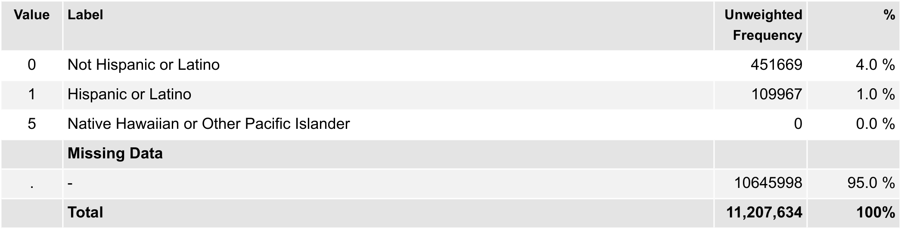

|  |  | Unweighted Frequency | %  |
|---|---|---|---|
| 0 | Not Hispanic or Latino | 451669 | 4.0 % |
| 1 | Hispanic or Latino | 109967 | 1.0 % |
| 5 | Native Hawaiian or Other Pacific Islander | 0 | 0.0 % |
|   | **Missing Data** |  |  |
| . | - | 10645998 | 95.0 % |
|   | **Total** |  |  |
|   |  | 11207634 | 100% |

Based upon 561,636 valid cases out of 11,207,634 total cases.


## V50113: ETHNICITY OF OFFENDER - 3


### Based upon 117,986 valid cases out of 11,207,634 total cases. 

- Minimum: 0.00
- Maximum: 1.00

  **Location:** 1038-1039 (width: 2; decimal: 0)  
  **Variable Type:** numeric  
  **(Range of) Missing Values:** -9, -8, -7, -6, -5, .

## V60061: ARRESTEE SEQUENCE NUMBER - 1

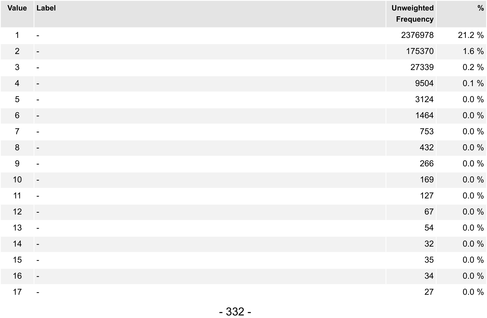

- 332 -


|                          | Unweighted Frequency | %      |
|--------------------------|----------------------|--------|
| 18                       | 18                   | 0.0 %  |
| 19                       | 16                   | 0.0 %  |
| 20                       | 15                   | 0.0 %  |
| 21                       | 7                    | 0.0 %  |
| 22                       | 8                    | 0.0 %  |
| 23                       | 3                    | 0.0 %  |
| 24                       | 7                    | 0.0 %  |
| 25                       | 10                   | 0.0 %  |
| 26                       | 5                    | 0.0 %  |
| 27                       | 2                    | 0.0 %  |
| 28                       | 2                    | 0.0 %  |
| 29                       | 6                    | 0.0 %  |
| 30                       | 2                    | 0.0 %  |
| 31                       | 13                   | 0.0 %  |
| 32                       | 5                    | 0.0 %  |
| 33                       | 6                    | 0.0 %  |
| 34                       | 2                    | 0.0 %  |
| 36                       | 4                    | 0.0 %  |
| 37                       | 2                    | 0.0 %  |
| 38                       | 2                    | 0.0 %  |
| 39                       | 1                    | 0.0 %  |
| 41                       | 1                    | 0.0 %  |
| 44                       | 1                    | 0.0 %  |
| 45                       | 1                    | 0.0 %  |
| 47                       | 1                    | 0.0 %  |
| 49                       | 1                    | 0.0 %  |
| 51                       | 1                    | 0.0 %  |
| 52                       | 1                    | 0.0 %  |
| 55                       | 1                    | 0.0 %  |
| 57                       | 2                    | 0.0 %  |
| 60                       | 1                    | 0.0 %  |
| 95                       | 1                    | 0.0 %  |
| 99                       | 155                  | 0.0 %  |
| **Missing Data**         |                      |        |
| .                        | 8,611,556            | 76.8 % |
| **Total**                | **11,207,634**       | **100%**|

Please note that only the first 50 response categories are displayed in the PDF codebook. To view all response categories, please analyze the data file in the statistical package of your choice (SAS, SPSS, Stata, R).


Based upon 2,596,078 valid cases out of 11,207,634 total cases.

- Mean: 1.12
- Median: 1.00
- Mode: 1.00
- Minimum: 1.00
- Maximum: 99.00
- Standard Deviation: 0.91

Location: 1042-1043 (width: 2; decimal: 0)
Variable Type: numeric
(Range of) Missing Values: -9, -8, -7, -6, -5, .

### V60062: ARRESTEE SEQUENCE NUMBER - 2
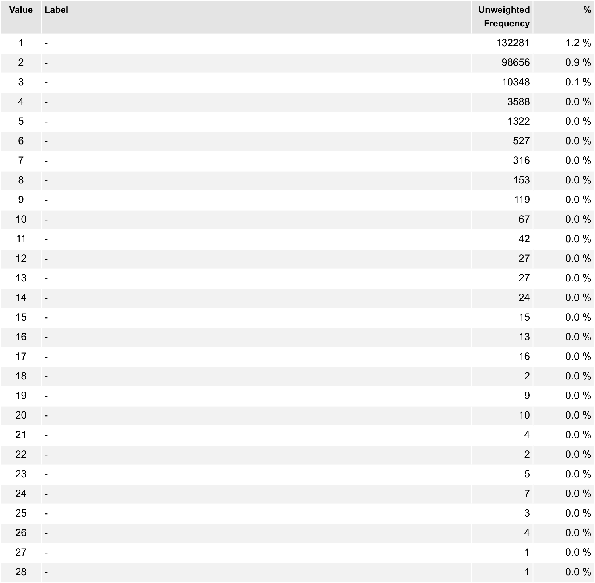


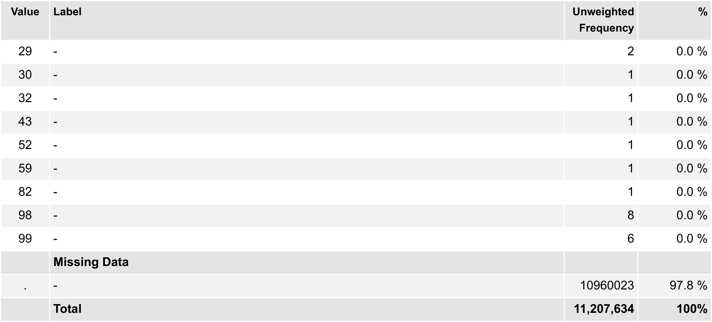

Based upon 247,611 valid cases out of 11,207,634 total cases.

- Mean: 1.59
- Median: 1.00
- Mode: 1.00
- Minimum: 1.00
- Maximum: 99.00
- Standard Deviation: 1.19

Location: 1044-1045 (width: 2; decimal: 0)

Variable Type: numeric

(Range of) Missing Values: -9, -8, -7, -6, -5, .

V60063: ARRESTEE SEQUENCE NUMBER - 3

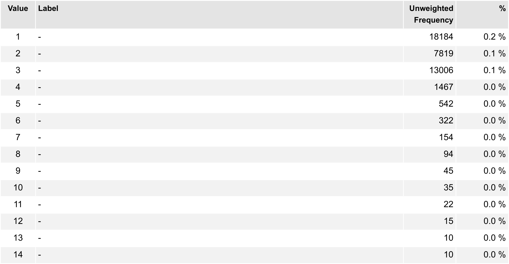


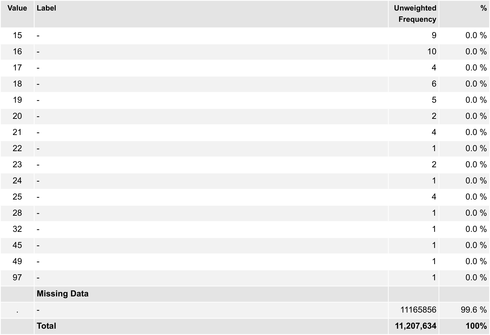

Based upon 41,778 valid cases out of 11,207,634 total cases.

- Mean: 2.10
- Median: 2.00
- Mode: 1.00
- Minimum: 1.00
- Maximum: 97.00
- Standard Deviation: 1.49

Location: 1046-1047 (width: 2; decimal: 0)  
Variable Type: numeric  
(Range of) Missing Values: -9, -8, -7, -6, -5, .

---

V60071: ARREST TRANSACTION NUMBER - 1


Based upon 2,595,791 valid cases out of 11,207,634 total cases.

Location: 1048-1059 (width: 12; decimal: 0)  
Variable Type: character  
(Range of) Missing Values: -8


### V60072: ARREST TRANSACTION NUMBER - 2


|               | Unweighted Frequency | %     |
|---------------|----------------------|-------|
| -8 NA LT 3 records | -                    |       |
| **Total**     | **11,207,634**           | **100%** |


Based upon 247,575 valid cases out of 11,207,634 total cases.

*Location:* 1060-1071 (width: 12; decimal: 0)  
*Variable Type:* character  
*(Range of) Missing Values: -8*  


### V60073: ARREST TRANSACTION NUMBER - 3

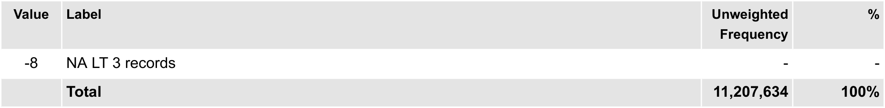
|               | Unweighted Frequency | %     |
|---------------|----------------------|-------|
| -8 NA LT 3 records | -                    |       |
| **Total**     | **11,207,634**           | **100%** |


Based upon 41,769 valid cases out of 11,207,634 total cases.

*Location:* 1072-1083 (width: 12; decimal: 0)  
*Variable Type:* character  
*(Range of) Missing Values: -8*  


### V60081: ARREST DATE - 1


| Label        | Unweighted Frequency | %     |
|--------------|----------------------|-------|
| 01-APR-2022  | 7596                 | 0.1 % |
| 01-APR-2023  | 28                   | 0.0 % |
| 01-AUG-2022  | 7087                 | 0.1 % |
| 01-DEC-2022  | 7209                 | 0.1 % |
| 01-FEB-2022  | 6465                 | 0.1 % |
| 01-FEB-2023  | 614                  | 0.0 % |
| 01-JAN-2022  | 5813                 | 0.1 % |
| 01-JAN-2023  | 833                  | 0.0 % |
| 01-JUL-2022  | 7494                 | 0.1 % |
| 01-JUN-2022  | 7392                 | 0.1 % |
| 01-MAR-2023  | 7005                 | 0.1 % |
| 01-MAR-2023  | 316                  | 0.0 % |
| 01-MAY-2022  | 6542                 | 0.1 % |
| 01-NOV-2022  | 7473                 | 0.1 % |
| 01-OCT-2022  | 6915                 | 0.1 % |
| 01-SEP-2022  | 7953                 | 0.1 % |
| 02-APR-2022  | 6768                 | 0.1 % |
| 02-APR-2023  | 21                   | 0.0 % |


| Label        | Unweighted Frequency | %      |
|--------------|----------------------|--------|
| 02-AUG-2022  | -                    | 7144   | 0.1 %  |
| 02-DEC-2022  | -                    | 7379   | 0.1 %  |
| 02-FEB-2022  | -                    | 5974   | 0.1 %  |
| 02-FEB-2023  | -                    | 573    | 0.0 %  |
| 02-JAN-2022  | -                    | 4500   | 0.0 %  |
| 02-JAN-2023  | -                    | 668    | 0.0 %  |
| 02-JUL-2022  | -                    | 7418   | 0.1 %  |
| 02-JUN-2022  | -                    | 7855   | 0.1 %  |
| 02-MAR-2022  | -                    | 7208   | 0.1 %  |
| 02-MAR-2023  | -                    | 390    | 0.0 %  |
| 02-MAY-2022  | -                    | 7155   | 0.1 %  |
| 02-NOV-2022  | -                    | 7701   | 0.1 %  |
| 02-OCT-2022  | -                    | 6490   | 0.1 %  |
| 02-SEP-2022  | -                    | 8048   | 0.1 %  |
| 03-APR-2022  | -                    | 6811   | 0.1 %  |
| 03-APR-2023  | -                    | 57     | 0.0 %  |
| 03-AUG-2022  | -                    | 7555   | 0.1 %  |
| 03-DEC-2022  | -                    | 6343   | 0.1 %  |
| 03-FEB-2022  | -                    | 5614   | 0.1 %  |
| 03-FEB-2023  | -                    | 479    | 0.0 %  |
| 03-JAN-2022  | -                    | 4453   | 0.0 %  |
| 03-JAN-2023  | -                    | 1292   | 0.0 %  |
| 03-JUL-2022  | -                    | 6883   | 0.1 %  |
| 03-JUN-2022  | -                    | 7677   | 0.1 %  |
| 03-MAR-2022  | -                    | 7576   | 0.1 %  |
| 03-MAR-2023  | -                    | 275    | 0.0 %  |
| 03-MAY-2022  | -                    | 7651   | 0.1 %  |
| 03-NOV-2022  | -                    | 7823   | 0.1 %  |
| 03-OCT-2022  | -                    | 7050   | 0.1 %  |
| 03-SEP-2022  | -                    | 7446   | 0.1 %  |
| 04-APR-2022  | -                    | 6963   | 0.1 %  |
| 04-APR-2023  | -                    | 63     | 0.0 %  |

|              |         |            |
|--------------|---------|------------|
| Missing Data | 8611556 | 76.8 %     |
|              |         |            |
| Total        | 11,207,634 | 100%    |

Please note that only the first 50 response categories are displayed in the PDF codebook. To view all response categories, please analyze the data file in the statistical package of your choice (SAS, SPSS, Stata, R).

Based upon 2,596,078 valid cases out of 11,207,634 total cases.


## V60082: ARREST DATE - 2

Location: 1084-1094 (width: 11; decimal: 0)  
Variable Type: character  
(Range of) Missing Values:

| 341_0.png      | Label | Unweighted Frequency | %    |
|----------------|-------|----------------------|------|
| 01-APR-2022    | -     | 798                  | 0.0% |
| 01-APR-2023    | -     | 1                    | 0.0% |
| 01-AUG-2022    | -     | 652                  | 0.0% |
| 01-DEC-2022    | -     | 682                  | 0.0% |
| 01-FEB-2022    | -     | 697                  | 0.0% |
| 01-FEB-2023    | -     | 52                   | 0.0% |
| 01-JAN-2022    | -     | 435                  | 0.0% |
| 01-JAN-2023    | -     | 74                   | 0.0% |
| 01-JUL-2022    | -     | 697                  | 0.0% |
| 01-JUN-2022    | -     | 738                  | 0.0% |
| 01-MAR-2022    | -     | 662                  | 0.0% |
| 01-MAR-2023    | -     | 19                   | 0.0% |
| 01-MAY-2022    | -     | 570                  | 0.0% |
| 01-NOV-2022    | -     | 695                  | 0.0% |
| 01-OCT-2022    | -     | 628                  | 0.0% |
| 01-SEP-2022    | -     | 729                  | 0.0% |
| 02-APR-2022    | -     | 602                  | 0.0% |
| 02-AUG-2022    | -     | 715                  | 0.0% |
| 02-DEC-2022    | -     | 701                  | 0.0% |
| 02-FEB-2022    | -     | 660                  | 0.0% |
| 02-FEB-2023    | -     | 42                   | 0.0% |
| 02-JAN-2022    | -     | 409                  | 0.0% |
| 02-JAN-2023    | -     | 50                   | 0.0% |
| 02-JUL-2022    | -     | 644                  | 0.0% |
| 02-JUN-2022    | -     | 865                  | 0.0% |
| 02-MAR-2023    | -     | 34                   | 0.0% |
| 02-MAY-2022    | -     | 647                  | 0.0% |
| 02-NOV-2022    | -     | 752                  | 0.0% |
| 02-OCT-2022    | -     | 567                  | 0.0% |
| 02-SEP-2022    | -     | 760                  | 0.0% |
| 03-APR-2022    | -     | 627                  | 0.0% |
| 03-APR-2023    | -     | 4                    | 0.0% |
| 03-AUG-2022    | -     | 747                  | 0.0% |
| 03-DEC-2022    | -     | 612                  | 0.0% |


```
342_0.png

| Label      | Unweighted Frequency | %    |
|------------|----------------------|------|
| 03-FEB-2022| 611                  | 0.0 %|
| 03-FEB-2023| 39                   | 0.0 %|
| 03-JAN-2022| 387                  | 0.0 %|
| 03-JAN-2023| 92                   | 0.0 %|
| 03-JUL-2022| 652                  | 0.0 %|
| 03-JUN-2022| 772                  | 0.0 %|
| 03-MAR-2022| 799                  | 0.0 %|
| 03-MAR-2023| 18                   | 0.0 %|
| 03-MAY-2022| 782                  | 0.0 %|
| 03-NOV-2022| 771                  | 0.0 %|
| 03-OCT-2022| 681                  | 0.0 %|
| 03-SEP-2022| 637                  | 0.0 %|
| 04-APR-2022| 664                  | 0.0 %|
| 04-APR-2023| 5                    | 0.0 %|
| 04-AUG-2022| 754                  | 0.0 %|

| Missing Data                       | 10960023             | 97.8 %|
| Total                              | 11,207,634           | 100% |

Please note that only the first 50 response categories are displayed in the PDF codebook. To view all response categories, please analyze the data file in the statistical package of your choice (SAS, SPSS, Stata, R).

Based upon 247,611 valid cases out of 11,207,634 total cases.

Location: 1095-1105 (width: 11, decimal: 0)
Variable Type: character
(Range of) Missing Values:


342_1.png

| Label      | Unweighted Frequency | %    |
|------------|----------------------|------|
| 01-APR-2022| 142                  | 0.0 %|
| 01-AUG-2022| 133                  | 0.0 %|
| 01-DEC-2022| 129                  | 0.0 %|
| 01-FEB-2022| 138                  | 0.0 %|
| 01-FEB-2023| 7                    | 0.0 %|
| 01-JAN-2022| 62                   | 0.0 %|
| 01-JAN-2023| 7                    | 0.0 %|
| 01-JUL-2022| 113                  | 0.0 %|
| 01-JUN-2022| 139                  | 0.0 %|
| 01-MAR-2022| 113                  | 0.0 %|
| 01-MAR-2023| 3                    | 0.0 %|
```


| Label        | Unweighted Frequency | %    |
|--------------|----------------------|------|
| 01-MAY-2022  | -                    | 76   | 0.0 % |
| 01-NOV-2022  | -                    | 126  | 0.0 % |
| 01-OCT-2022  | -                    | 105  | 0.0 % |
| 01-SEP-2022  | -                    | 135  | 0.0 % |
| 02-APR-2022  | -                    | 100  | 0.0 % |
| 02-AUG-2022  | -                    | 128  | 0.0 % |
| 02-DEC-2022  | -                    | 128  | 0.0 % |
| 02-FEB-2022  | -                    | 126  | 0.0 % |
| 02-FEB-2023  | -                    | 2    | 0.0 % |
| 02-JAN-2022  | -                    | 53   | 0.0 % |
| 02-JAN-2023  | -                    | 8    | 0.0 % |
| 02-JUL-2022  | -                    | 94   | 0.0 % |
| 02-JUN-2022  | -                    | 174  | 0.0 % |
| 02-MAR-2022  | -                    | 120  | 0.0 % |
| 02-MAR-2023  | -                    | 14   | 0.0 % |
| 02-MAY-2022  | -                    | 96   | 0.0 % |
| 02-NOV-2022  | -                    | 143  | 0.0 % |
| 02-OCT-2022  | -                    | 99   | 0.0 % |
| 02-SEP-2022  | -                    | 140  | 0.0 % |
| 03-APR-2022  | -                    | 95   | 0.0 % |
| 03-APR-2023  | -                    | 1    | 0.0 % |
| 03-AUG-2022  | -                    | 148  | 0.0 % |
| 03-DEC-2022  | -                    | 87   | 0.0 % |
| 03-FEB-2022  | -                    | 113  | 0.0 % |
| 03-FEB-2023  | -                    | 4    | 0.0 % |
| 03-JAN-2022  | -                    | 54   | 0.0 % |
| 03-JAN-2023  | -                    | 20   | 0.0 % |
| 03-JUL-2022  | -                    | 102  | 0.0 % |
| 03-JUN-2022  | -                    | 136  | 0.0 % |
| 03-MAR-2022  | -                    | 112  | 0.0 % |
| 03-MAR-2023  | -                    | 4    | 0.0 % |
| 03-MAY-2022  | -                    | 145  | 0.0 % |
| 03-NOV-2022  | -                    | 126  | 0.0 % |
| 03-OCT-2022  | -                    | 115  | 0.0 % |
| 03-SEP-2022  | -                    | 100  | 0.0 % |
| 04-APR-2022  | -                    | 112  | 0.0 % |
| 04-AUG-2022  | -                    | 134  | 0.0 % |
| 04-DEC-2022  | -                    | 93   | 0.0 % |
| 04-FEB-2022  | -                    | 106  | 0.0 % |


---

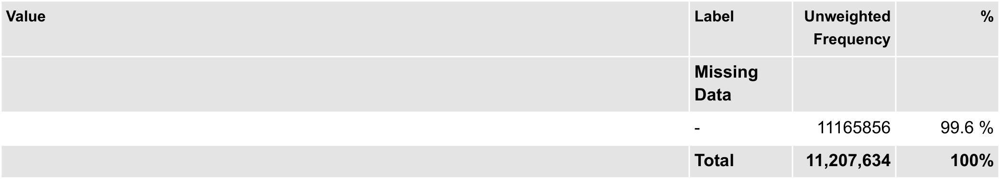

| Label | Unweighted Frequency | %  |
|-------|----------------------|----|
| Missing Data | - | 11165856 | 99.6% |
| Total  | 11,207,634          | 100%|

Please note that only the first 50 response categories are displayed in the PDF codebook. To view all response categories, please analyze the data file in the statistical package of your choice (SAS, SPSS, Stata, R).

Based upon 41,778 valid cases out of 11,207,634 total cases.

Location: 1106-1116 (width: 11; decimal: 0)  
Variable Type: character  
(Range of) Missing Values:

---

### V60091: TYPE OF ARREST - 1

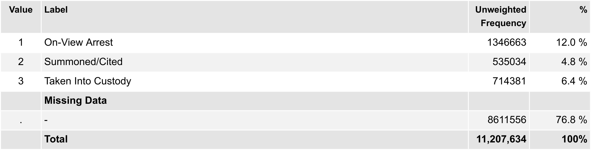

|  | Unweighted Frequency | % |
|--|----------------------|---|
| 1 | On-View Arrest       | 1346663 | 12.0% |
| 2 | Summoned/Cited       | 535034  | 4.8%  |
| 3 | Taken Into Custody   | 714381  | 6.4%  |
| Missing Data | -         | 8611556 | 76.8% |
| Total | 11,207,634 | 100% |

Based upon 2,596,078 valid cases out of 11,207,634 total cases.

- Minimum: 1.00  
- Maximum: 3.00

Location: 1117-1118 (width: 2; decimal: 0)  
Variable Type: numeric  
(Range of) Missing Values: -9, -8, -7, -6, -5.

---

### V60092: TYPE OF ARREST - 2

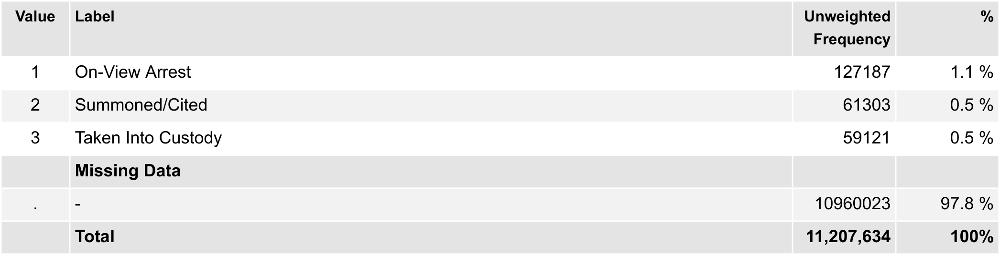

|  | Unweighted Frequency | %  |
|--|----------------------|----|
| 1 | On-View Arrest       | 127187  | 1.1%  |
| 2 | Summoned/Cited       | 61303   | 0.5%  |
| 3 | Taken Into Custody   | 59121   | 0.5%  |
| Missing Data | -         | 10960023 | 97.8% |
| Total | 11,207,634 | 100% |

Based upon 247,611 valid cases out of 11,207,634 total cases.

- Minimum: 1.00  
- Maximum: 3.00

---


*Location: 1119-1120 (width: 2; decimal: 0)*
*Variable Type: numeric*
*(Range of) Missing Values: -9, -8, -7, -6, -5, .*

## V60093: TYPE OF ARREST - 3

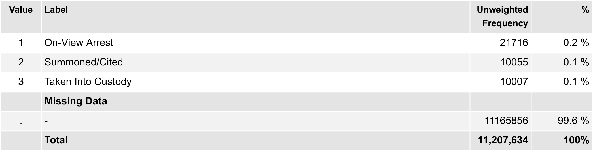

- Based upon 41,778 valid cases out of 11,207,634 total cases.
- Minimum: 1.00
- Maximum: 3.00

*Location: 1121-1122 (width: 2; decimal: 0)*
*Variable Type: numeric*
*(Range of) Missing Values: -9, -8, -7, -6, -5, .*

## V60101: MULTIPLE ARRESTEE SEGMENTS INDICATOR - 1

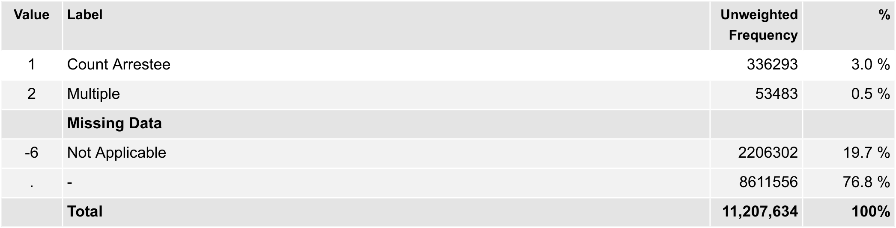

- Based upon 389,776 valid cases out of 11,207,634 total cases.
- Minimum: 1.00
- Maximum: 2.00

*Location: 1123-1124 (width: 2; decimal: 0)*
*Variable Type: numeric*
*(Range of) Missing Values: -9, -8, -7, -6, -5, .*

## V60102: MULTIPLE ARRESTEE SEGMENTS INDICATOR - 2

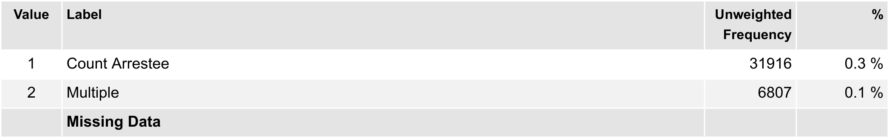


#### 346_0.png

|                      | Unweighted Frequency | %     |
|----------------------|----------------------|-------|
| -6 Not Applicable    | 208888               | 1.9 % |
|                      | 10960023             | 97.8 %|
| Total                | 11,207,634           | 100 % |

Based upon 38,723 valid cases out of 11,207,634 total cases.

- Minimum: 1.00
- Maximum: 2.00

Location: 1125-1126 (width: 2; decimal: 0)  
Variable Type: numeric  
(Range of) Missing Values: -9, -8, -7, -6, -5, .

---

### V60103: MULTIPLE ARRESTEE SEGMENTS INDICATOR - 3

#### 346_1.png

|                      | Unweighted Frequency | %     |
|----------------------|----------------------|-------|
| 1 Count Arrestee     | 5361                 | 0.0 % |
| 2 Multiple           | 1374                 | 0.0 % |
| Missing Data         |                      |       |
| -6 Not Applicable    | 35043                | 0.3 % |
|                      | 11165856             | 99.6 %|
| Total                | 11,207,634           | 100 % |

Based upon 6,735 valid cases out of 11,207,634 total cases.

- Minimum: 1.00
- Maximum: 2.00

Location: 1127-1128 (width: 2; decimal: 0)  
Variable Type: numeric  
(Range of) Missing Values: -9, -8, -7, -6, -5, .

---

### V60111: UCR ARREST OFFENSE CODE - 1

#### 346_2.png

|                                             | Unweighted Frequency | %     |
|---------------------------------------------|----------------------|-------|
| 91  Murder/Nonnegligent Manslaughter        | 6730                 | 0.1 % |
| 92  Negligent Manslaughter                  | 796                  | 0.0 % |
| 93  Justifiable Homicide                    | 0                    | 0.0 % |
| 100 Kidnaping/Abduction                     | 12158                | 0.1 % |
| 111 Rape                                    | 8741                 | 0.1 % |
| 112 Sodomy                                  | 2024                 | 0.0 % |
| 113 Sexual Assault With An Object           | 881                  | 0.0 % |
| 114 Fondling (Indecent Liberties/Child Molesting)| 10142           | 0.1 % |
| 120 Robbery                                 | 30062                | 0.3 % |
| 131 Aggravated Assault                      | 204714               | 1.8 % |


|                                     | Unweighted Frequency | %    |
|-------------------------------------|----------------------|------|
| 132 Simple Assault                  | 585260               | 5.2% |
| 133 Intimidation                    | 82340                | 0.7% |
| 200 Arson                           | 5895                 | 0.1% |
| 210 Extortion/Blackmail             | 410                  | 0.0% |
| 220 Burglary/Breaking and Entering  | 69390                | 0.6% |
| 231 Pocket-picking                  | 2932                 | 0.0% |
| 232 Purse-snatching                 | 862                  | 0.0% |
| 233 Shoplifting                     | 231145               | 2.1% |
| 234 Theft From Building             | 16409                | 0.1% |
| 235 Theft From Coin-Operated Machine or Device | 407        | 0.0% |
| 236 Theft From Motor Vehicle        | 19264                | 0.2% |
| 237 Theft of Motor Vehicle Parts/Accessories | 4303        | 0.0% |
| 238 All Other Larceny               | 108180               | 1.0% |
| 240 Motor Vehicle Theft             | 46009                | 0.4% |
| 250 Counterfeiting/Forgery          | 18150                | 0.2% |
| 261 False Pretenses/Swindle/Confidence Game | 29244        | 0.3% |
| 262 Credit Card/Automatic Teller Machine Fraud | 6577      | 0.1% |
| 263 Impersonation                   | 10207                | 0.1% |
| 264 Welfare Fraud                   | 100                  | 0.0% |
| 265 Wire Fraud                      | 326                  | 0.0% |
| 266 Identity Theft                  | 5652                 | 0.1% |
| 267 Hacking/Computer Invasion       | 111                  | 0.0% |
| 270 Embezzlement                    | 6380                 | 0.1% |
| 280 Stolen Property Offenses        | 48506                | 0.4% |
| 290 Destruction/Damage/Vandalism of Property | 104628      | 0.9% |
| 351 Drug/Narcotic Violations        | 566712               | 5.1% |
| 352 Drug Equipment Violations       | 126113               | 1.1% |
| 361 Incest                          | 190                  | 0.0% |
| 362 Statutory Rape                  | 1389                 | 0.0% |
| 370 Pornography/Obscene Material    | 4752                 | 0.0% |
| 391 Betting/Wagering                | 253                  | 0.0% |
| 392 Operating/Promoting/Assisting Gambling | 181          | 0.0% |
| 393 Gambling Equipment Violations   | 66                   | 0.0% |
| 394 Sports Tampering                | 2                    | 0.0% |
| 401 Prostitution                    | 5302                 | 0.0% |
| 402 Assisting or Promoting Prostitution | 1401            | 0.0% |
| 403 Purchasing Prostitution         | 1208                 | 0.0% |
| 510 Bribery                         | 189                  | 0.0% |
| 520 Weapon Law Violations           | 108811               | 1.0% |


|                                | Unweighted Frequency | %       |
|--------------------------------|----------------------|---------|
| 641 Human Trafficking- Commercial Sex Acts | 336                  | 0.0 %   |
| Missing Data                   | 8611710              | 76.8 %  |
| .                              |                      |         |
| Total                          | 11,207,634           | 100%    |

Please note that only the first 50 response categories are displayed in the PDF codebook. To view all response categories, please analyze the data file in the statistical package of your choice (SAS, SPSS, Stata, R).

Based upon 2,595,924 valid cases out of 11,207,634 total cases.

- Minimum: 91.00
- Maximum: 990.00

*Location*: 1129-1131 (width: 3; decimal: 0)  
*Variable Type*: numeric  
*(Range of) Missing Values*: -9, -8, -7, -6, -5, .

# V60112: UCR ARREST OFFENSE CODE - 2

|                                | Unweighted Frequency | %       |
|--------------------------------|----------------------|---------|
| 91  Murder/Nonnegligent Manslaughter | 1045                 | 0.0 %   |
| 92  Negligent Manslaughter     | 57                   | 0.0 %   |
| 93  Justifiable Homicide       | 0                    | 0.0 %   |
| 100 Kidnaping/Abduction        | 512                  | 0.0 %   |
| 111 Rape                       | 180                  | 0.0 %   |
| 112 Sodomy                     | 45                   | 0.0 %   |
| 113 Sexual Assault With An Object | 24                   | 0.0 %   |
| 114 Fondling (Indecent Liberties/Child Molesting) | 126                  | 0.0 %   |
| 120 Robbery                    | 5622                 | 0.1 %   |
| 131 Aggravated Assault         | 10082                | 0.1 %   |
| 132 Simple Assault             | 33833                | 0.3 %   |
| 133 Intimidation               | 2388                 | 0.0 %   |
| 200 Arson                      | 309                  | 0.0 %   |
| 210 Extortion/Blackmail        | 36                   | 0.0 %   |
| 220 Burglary/Breaking and Entering | 10037                | 0.1 %   |
| 231 Pocket-picking             | 332                  | 0.0 %   |
| 232 Purse-snatching            | 82                   | 0.0 %   |
| 233 Shoplifting                | 27077                | 0.2 %   |
| 234 Theft From Building        | 1359                 | 0.0 %   |
| 235 Theft From Coin-Operated Machine or Device | 76                   | 0.0 %   |
| 236 Theft From Motor Vehicle   | 3210                 | 0.0 %   |
| 237 Theft of Motor Vehicle Parts/Accessories | 974                  | 0.0 %   |
| 238 All Other Larceny          | 11238                | 0.1 %   |


|                                      | Unweighted Frequency  |     %    |
|--------------------------------------|-----------------------|----------|
| 240  Motor Vehicle Theft             | 5447                  | 0.0 %    |
| 250  Counterfeiting/Forgery          | 1581                  | 0.0 %    |
| 261  False Pretenses/Swindle/Confidence Game  | 2306      | 0.0 %    |
| 262  Credit Card/Automatic Teller Machine Fraud | 583     | 0.0 %    |
| 263  Impersonation                   | 863                   | 0.0 %    |
| 264  Welfare Fraud                   | 11                    | 0.0 %    |
| 265  Wire Fraud                      | 31                    | 0.0 %    |
| 266  Identity Theft                  | 630                   | 0.0 %    |
| 267  Hacking/Computer Invasion       | 10                    | 0.0 %    |
| 270  Embezzlement                    | 245                   | 0.0 %    |
| 280  Stolen Property Offenses        | 7285                  | 0.1 %    |
| 290  Destruction/Damage/Vandalism of Property | 6083        | 0.1 %    |
| 351  Drug/Narcotic Violations        | 69216                 | 0.6 %    |
| 352  Drug Equipment Violations       | 14179                 | 0.1 %    |
| 361  Incest                          | 14                    | 0.0 %    |
| 362  Statutory Rape                  | 76                    | 0.0 %    |
| 370  Pornography/Obscene Material    | 299                   | 0.0 %    |
| 391  Betting/Wagering                | 50                    | 0.0 %    |
| 392  Operating/Promoting/Assisting Gambling    | 46         | 0.0 %    |
| 393  Gambling Equipment Violations    | 15                   | 0.0 %    |
| 394  Sports Tampering                | 1                     | 0.0 %    |
| 401  Prostitution                    | 389                   | 0.0 %    |
| 402  Assisting or Promoting Prostitution | 123              | 0.0 %    |
| 403  Purchasing Prostitution         | 44                    | 0.0 %    |
| 510  Bribery                         | 10                    | 0.0 %    |
| 520  Weapon Law Violations           | 11264                 | 0.1 %    |
| 641  Human Trafficking- Commercial Sex Acts  | 30           | 0.0 %    |

| Missing Data                         | 10960033              | 97.8 %   |
| **Total**                            | **11,207,634**        | **100%** |

Please note that only the first 50 response categories are displayed in the PDF codebook. To view all response categories, please analyze the data file in the statistical package of your choice (SAS, SPSS, Stata, R).

Based upon 247,601 valid cases out of 11,207,634 total cases.

- Minimum: 91.00
- Maximum: 990.00

Location: 1132-1134 (width: 3; decimal: 0)  
Variable Type: numeric  
(Range of) Missing Values: -9, -8, -7, -6, -5, .


# V60113: UCR ARREST OFFENSE CODE - 3

|                             | Unweighted Frequency | %    |
|-----------------------------|----------------------|------|
| 91  Murder/Nonnegligent Manslaughter   | 317                  | 0.0% |
| 92  Negligent Manslaughter              | 5                    | 0.0% |
| 93  Justifiable Homicide                | 0                    | 0.0% |
| 100 Kidnaping/Abduction                 | 130                  | 0.0% |
| 111 Rape                                | 26                   | 0.0% |
| 112 Sodomy                              | 11                   | 0.0% |
| 113 Sexual Assault With An Object       | 3                    | 0.0% |
| 114 Fondling (Indecent Liberties/Child Molesting) | 19       | 0.0% |
| 120 Robbery                             | 1647                 | 0.0% |
| 131 Aggravated Assault                  | 1822                 | 0.0% |
| 132 Simple Assault                      | 4347                 | 0.0% |
| 133 Intimidation                        | 269                  | 0.0% |
| 200 Arson                               | 95                   | 0.0% |
| 210 Extortion/Blackmail                 | 5                    | 0.0% |
| 220 Burglary/Breaking and Entering      | 2371                 | 0.0% |
| 231 Pocket-picking                      | 47                   | 0.0% |
| 232 Purse-snatching                     | 12                   | 0.0% |
| 233 Shoplifting                         | 3235                 | 0.0% |
| 234 Theft From Building                 | 189                  | 0.0% |
| 235 Theft From Coin-Operated Machine or Device | 11        | 0.0% |
| 236 Theft From Motor Vehicle            | 783                  | 0.0% |
| 237 Theft of Motor Vehicle Parts/Accessories | 256            | 0.0% |
| 238 All Other Larceny                   | 1725                 | 0.0% |
| 240 Motor Vehicle Theft                 | 1047                 | 0.0% |
| 250 Counterfeiting/Forgery              | 244                  | 0.0% |
| 261 False Pretenses/Swindle/Confidence Game | 259           | 0.0% |
| 262 Credit Card/Automatic Teller Machine Fraud | 91            | 0.0% |
| 263 Impersonation                       | 120                  | 0.0% |
| 264 Welfare Fraud                       | 0                    | 0.0% |
| 265 Wire Fraud                          | 3                    | 0.0% |
| 266 Identity Theft                      | 101                  | 0.0% |
| 267 Hacking/Computer Invasion           | 2                    | 0.0% |
| 270 Embezzlement                        | 35                   | 0.0% |
| 280 Stolen Property Offenses            | 1523                 | 0.0% |
| 290 Destruction/Damage/Vandalism of Property | 1509         | 0.0% |
| 351 Drug/Narcotic Violations            | 11169                | 0.1% |
| 352 Drug Equipment Violations           | 1898                 | 0.0% |


351_0.png

|                                          | Unweighted Frequency | %       |
|------------------------------------------|----------------------|---------|
| 361  Incest                              | 3                    | 0.0 %   |
| 362  Statutory Rape                      | 4                    | 0.0 %   |
| 370  Pornography/Obscene Material        | 81                   | 0.0 %   |
| 391  Betting/Wagering                    | 23                   | 0.0 %   |
| 392  Operating/Promoting/Assisting Gambling | 21                | 0.0 %   |
| 393  Gambling Equipment Violations       | 8                    | 0.0 %   |
| 394  Sports Tampering                    | 0                    | 0.0 %   |
| 401  Prostitution                        | 59                   | 0.0 %   |
| 402  Assisting or Promoting Prostitution | 24                   | 0.0 %   |
| 403  Purchasing Prostitution             | 6                    | 0.0 %   |
| 510  Bribery                             | 1                    | 0.0 %   |
| 520  Weapon Law Violations               | 2214                 | 0.0 %   |
| 641  Human Trafficking- Commercial Sex Acts | 5                 | 0.0 %   |
| Missing Data                             | 11165859             | 99.6 %  |
|                                          |                      |         |
| Total                                    | 11,207,634           | 100%    |

Please note that only the first 50 response categories are displayed in the PDF codebook. To view all response categories, please analyze the data file in the statistical package of your choice (SAS, SPSS, Stata, R).

Based upon 41,775 valid cases out of 11,207,634 total cases.

- Minimum: 91.00
- Maximum: 900.00

**Location**: 1135-1137 (width: 3; decimal: 0)
**Variable Type**: numeric
**(Range of) Missing Values**: -9, -8, -7, -6, -5, .

V60121: ARRESTEE ARMED WITH 1 - 1

351_1.png

|                                 | Unweighted Frequency | %     |
|---------------------------------|----------------------|-------|
| 1   Unarmed                     | 2387322              | 21.3 %|
| 110 Firearm                     | 19848                | 0.2 % |
| 111 Firearm, automatic          | 1073                 | 0.0 % |
| 120 Handgun                     | 100917               | 0.9 % |
| 121 Handgun, automatic          | 4594                 | 0.0 % |
| 130 Rifle                       | 4590                 | 0.0 % |
| 131 Rifle, automatic            | 291                  | 0.0 % |
| 140 Shotgun                     | 3155                 | 0.0 % |
| 141 Shotgun, automatic          | 78                   | 0.0 % |
| 150 Other Firearm               | 8596                 | 0.1 % |
| 151 Other Firearm, automatic    | 174                  | 0.0 % |


## 352_0.png

|                                  | Unweighted Frequency | %      |
|----------------------------------|----------------------|--------|
| 200 Lethal Cutting Instrument    | 52741                | 0.5 %  |
| 300 Club/Blackjack/Brass Knuckles| 12699                | 0.1 %  |
| Missing Data                     | 861556               | 76.8 % |
| Total                            | 11,207,634           | 100%   |

Based upon 2,596,078 valid cases out of 11,207,634 total cases.

- Minimum: 1.00
- Maximum: 300.00

_Location: 1138-1140 (width: 3; decimal: 0)_

_Variable Type: numeric_

_(Range of) Missing Values: -9, -8, -7, -6, -5, ._

## V60122: ARRESTEE ARMED WITH 1 - 2

## 352_1.png

|                                  | Unweighted Frequency | %       |
|----------------------------------|----------------------|---------|
| 1   Unarmed                      | 227219               | 2.0 %   |
| 110 Firearm                      | 2458                 | 0.0 %   |
| 111 Firearm, automatic           | 128                  | 0.0 %   |
| 120 Handgun                      | 12120                | 0.1 %   |
| 121 Handgun, automatic           | 517                  | 0.0 %   |
| 130 Rifle                        | 587                  | 0.0 %   |
| 131 Rifle, automatic             | 31                   | 0.0 %   |
| 140 Shotgun                      | 302                  | 0.0 %   |
| 141 Shotgun, automatic           | 4                    | 0.0 %   |
| 150 Other Firearm                | 852                  | 0.0 %   |
| 151 Other Firearm, automatic     | 23                   | 0.0 %   |
| 200 Lethal Cutting Instrument    | 2632                 | 0.0 %   |
| 300 Club/Blackjack/Brass Knuckles| 738                  | 0.0 %   |
| Missing Data                     | 10960023             | 97.8 %  |
| Total                            | 11,207,634           | 100%    |

Based upon 247,611 valid cases out of 11,207,634 total cases.

- Minimum: 1.00
- Maximum: 300.00

_Location: 1141-1143 (width: 3; decimal: 0)_

_Variable Type: numeric_

_(Range of) Missing Values: -9, -8, -7, -6, -5, ._

## V60123: ARRESTEE ARMED WITH 1 - 3


### 353_0.png

|          | Unweighted Frequency | %     |
|----------|-----------------------|-------|
| 1        | Unarmed               | 37759 | 0.3 % |
| 110      | Firearm               | 554   | 0.0 % |
| 111      | Firearm, automatic    | 33    | 0.0 % |
| 120      | Handgun               | 2488  | 0.0 % |
| 121      | Handgun, automatic    | 117   | 0.0 % |
| 130      | Rifle                 | 129   | 0.0 % |
| 131      | Rifle, automatic      | 10    | 0.0 % |
| 140      | Shotgun               | 58    | 0.0 % |
| 141      | Shotgun, automatic    | 2     | 0.0 % |
| 150      | Other Firearm         | 155   | 0.0 % |
| 151      | Other Firearm, automatic | 6  | 0.0 % |
| 200      | Lethal Cutting Instrument | 344 | 0.0 % |
| 300      | Club/Blackjack/Brass Knuckles | 123 | 0.0 % |
| Missing Data | - | 11165856 | 99.6 % |
| Total    |                       | 11,207,634 | 100%  |

Based upon 41,778 valid cases out of 11,207,634 total cases.

- Minimum: 1.00
- Maximum: 300.00

Location: 1144-1146 (width: 3; decimal: 0)
Variable Type: numeric
(Range of) Missing Values: -9, -8, -7, -6, -5, .

### V60131: ARRESTEE ARMED WITH 2 - 1

### 353_1.png

|          | Unweighted Frequency | %     |
|----------|-----------------------|-------|
| 1        | Unarmed               | 0     | 0.0 % |
| 110      | Firearm               | 0     | 0.0 % |
| 111      | Firearm, automatic    | 26    | 0.0 % |
| 120      | Handgun               | 528   | 0.0 % |
| 121      | Handgun, automatic    | 218   | 0.0 % |
| 130      | Rifle                 | 1094  | 0.0 % |
| 131      | Rifle, automatic      | 83    | 0.0 % |
| 140      | Shotgun               | 480   | 0.0 % |
| 141      | Shotgun, automatic    | 12    | 0.0 % |
| 150      | Other Firearm         | 181   | 0.0 % |
| 151      | Other Firearm, automatic | 19 | 0.0 % |
| 200      | Lethal Cutting Instrument | 856 | 0.0 % |
| 300      | Club/Blackjack/Brass Knuckles | 705 | 0.0 % |


### 

|                       | Unweighted Frequency | %       |
|-----------------------|----------------------|---------|
| Missing Data          |                      |         |
| .                     | 1,120,343.2          | 100.0 % |
| **Total**             | 11,207,634           | **100%**|

Based upon 4,202 valid cases out of 11,207,634 total cases.

- Minimum: 111.00
- Maximum: 300.00

*Location:* 1147-1149 (width: 3; decimal: 0)  
*Variable Type:* numeric  
*(Range of) Missing Values:* -9, -8, -7, -6, -5, .

### V60132: ARRESTEE ARMED WITH 2 - 2

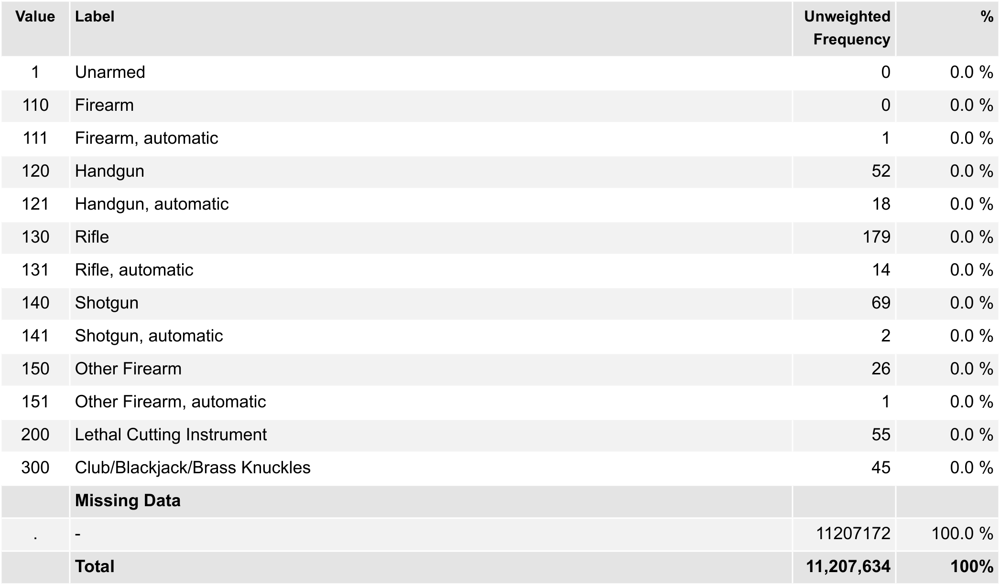

|                  | Unweighted Frequency | %     |
|------------------|----------------------|-------|
| Unarmed          | 0                    | 0.0 % |
| Firearm          | 0                    | 0.0 % |
| Firearm, automatic | 1                    | 0.0 % |
| Handgun          | 52                   | 0.0 % |
| Handgun, automatic | 18                   | 0.0 % |
| Rifle            | 179                  | 0.0 % |
| Rifle, automatic | 14                   | 0.0 % |
| Shotgun          | 69                   | 0.0 % |
| Shotgun, automatic | 2                    | 0.0 % |
| Other Firearm    | 26                   | 0.0 % |
| Other Firearm, automatic | 1                    | 0.0 % |
| Lethal Cutting Instrument | 55                   | 0.0 % |
| Club/Blackjack/Brass Knuckles | 45                   | 0.0 % |
| Missing Data     | 1,120,717.2          | 100.0 % |
| **Total**          | 11,207,634           | **100%**|

Based upon 462 valid cases out of 11,207,634 total cases.

- Minimum: 111.00
- Maximum: 300.00

*Location:* 1150-1152 (width: 3; decimal: 0)  
*Variable Type:* numeric  
*(Range of) Missing Values:* -9, -8, -7, -6, -5, .

### V60133: ARRESTEE ARMED WITH 2 - 3


## 355_0.png

|                   | Unweighted Frequency | %     |
|-------------------|----------------------|-------|
| 1  Unarmed        | 0                    | 0.0 % |
| 110  Firearm      | 0                    | 0.0 % |
| 111  Firearm, automatic | 3         | 0.0 % |
| 120  Handgun      | 11                   | 0.0 % |
| 121  Handgun, automatic | 4           | 0.0 % |
| 130  Rifle        | 53                   | 0.0 % |
| 131  Rifle, automatic | 6              | 0.0 % |
| 140  Shotgun      | 14                   | 0.0 % |
| 141  Shotgun, automatic | 0            | 0.0 % |
| 150  Other Firearm | 6                   | 0.0 % |
| 151  Other Firearm, automatic | 0       | 0.0 % |
| 200  Lethal Cutting Instrument | 6     | 0.0 % |
| 300  Club/Blackjack/Brass Knuckles | 7 | 0.0 % |
| Missing Data | | |
| . -             | 11207524             | 100.0 % |
| Total           | 11,207,634            | 100%  |

Based upon 110 valid cases out of 11,207,634 total cases.

- Minimum: 111.00
- Maximum: 300.00

Location: 1153-1155 (width: 3; decimal: 0)  
Variable Type: numeric  
(Range of) Missing Values: -9, -8, -7, -6, -5, .

## V60141: AGE OF ARRESTEE - 1

### 355_1.png

|    | Unweighted Frequency | %     |
|----|----------------------|-------|
| 0  | 829                  | 0.0 % |
| 1  | 9                    | 0.0 % |
| 2  | 1                    | 0.0 % |
| 3  | 5                    | 0.0 % |
| 4  | 2                    | 0.0 % |
| 5  | 8                    | 0.0 % |
| 6  | 17                   | 0.0 % |
| 7  | 60                   | 0.0 % |
| 8  | 171                  | 0.0 % |
| 9  | 408                  | 0.0 % |
| 10 | 1382                 | 0.0 % |
| 11 | 4351                 | 0.0 % |
| 12 | 11556                | 0.1 % |


|        | Unweighted Frequency | %        |
|--------|-----------------------|----------|
| 13     | 22049                 | 0.2 %    |
| 14     | 32876                 | 0.3 %    |
| 15     | 40782                 | 0.4 %    |
| 16     | 45187                 | 0.4 %    |
| 17     | 47415                 | 0.4 %    |
| 18     | 60457                 | 0.5 %    |
| 19     | 63476                 | 0.6 %    |
| 20     | 64173                 | 0.6 %    |
| 21     | 67368                 | 0.6 %    |
| 22     | 68913                 | 0.6 %    |
| 23     | 69679                 | 0.6 %    |
| 24     | 70780                 | 0.6 %    |
| 25     | 71870                 | 0.6 %    |
| 26     | 74373                 | 0.7 %    |
| 27     | 78617                 | 0.7 %    |
| 28     | 80503                 | 0.7 %    |
| 29     | 83619                 | 0.7 %    |
| 30     | 86787                 | 0.8 %    |
| 31     | 86329                 | 0.8 %    |
| 32     | 86445                 | 0.8 %    |
| 33     | 82356                 | 0.7 %    |
| 34     | 78490                 | 0.7 %    |
| 35     | 75731                 | 0.7 %    |
| 36     | 73708                 | 0.7 %    |
| 37     | 71092                 | 0.6 %    |
| 38     | 66392                 | 0.6 %    |
| 39     | 64471                 | 0.6 %    |
| 40     | 62828                 | 0.6 %    |
| 41     | 58911                 | 0.5 %    |
| 42     | 55653                 | 0.5 %    |
| 43     | 50374                 | 0.4 %    |
| 44     | 45108                 | 0.4 %    |
| 45     | 40112                 | 0.4 %    |
| 46     | 35981                 | 0.3 %    |
| 47     | 33379                 | 0.3 %    |
| 48     | 30447                 | 0.3 %    |
| 49     | 29269                 | 0.3 %    |
| Missing Data | 8611556               | 76.8 %   |


|                   | Unweighted Frequency | %     |
|-------------------|-----------------------|-------|
| **Total**         | 11,207,634            | 100%  |

Please note that only the first 50 response categories are displayed in the PDF codebook. To view all response categories, please analyze the data file in the statistical package of your choice (SAS, SPSS, Stata, R).

Based upon 2,596,078 valid cases out of 11,207,634 total cases.

- Mean: 33.73
- Median: 32.00
- Mode: 30.00
- Minimum: 0.00
- Maximum: 99.00
- Standard Deviation: 12.59

Location: 1156-1157 (width: 2; decimal: 0)

Variable Type: numeric

(Range of) Missing Values: -9, -8, -7, -6, -5, .

---

### V60142: AGE OF ARRESTEE - 2

|     | Unweighted Frequency | %     |
|-----|-----------------------|-------|
| 0   | 76                    | 0.0 % |
| 5   | 2                     | 0.0 % |
| 6   | 2                     | 0.0 % |
| 7   | 13                    | 0.0 % |
| 8   | 29                    | 0.0 % |
| 9   | 56                    | 0.0 % |
| 10  | 195                   | 0.0 % |
| 11  | 672                   | 0.0 % |
| 12  | 2000                  | 0.0 % |
| 13  | 4012                  | 0.0 % |
| 14  | 6395                  | 0.1 % |
| 15  | 8138                  | 0.1 % |
| 16  | 8801                  | 0.1 % |
| 17  | 8787                  | 0.1 % |
| 18  | 10414                 | 0.1 % |
| 19  | 9777                  | 0.1 % |
| 20  | 8476                  | 0.1 % |
| 21  | 7903                  | 0.1 % |
| 22  | 7536                  | 0.1 % |
| 23  | 7058                  | 0.1 % |
| 24  | 7035                  | 0.1 % |
| 25  | 6729                  | 0.1 % |
| 26  | 6584                  | 0.1 % |


|                    | Unweighted Frequency | %       |
|--------------------|----------------------|---------|
| 27                 | 6765                 | 0.1 %   |
| 28                 | 6814                 | 0.1 %   |
| 29                 | 7080                 | 0.1 %   |
| 30                 | 7217                 | 0.1 %   |
| 31                 | 7231                 | 0.1 %   |
| 32                 | 7119                 | 0.1 %   |
| 33                 | 6570                 | 0.1 %   |
| 34                 | 6272                 | 0.1 %   |
| 35                 | 6057                 | 0.1 %   |
| 36                 | 5824                 | 0.1 %   |
| 37                 | 5583                 | 0.0 %   |
| 38                 | 5143                 | 0.0 %   |
| 39                 | 5154                 | 0.0 %   |
| 40                 | 4755                 | 0.0 %   |
| 41                 | 4570                 | 0.0 %   |
| 42                 | 4312                 | 0.0 %   |
| 43                 | 3840                 | 0.0 %   |
| 44                 | 3446                 | 0.0 %   |
| 45                 | 3142                 | 0.0 %   |
| 46                 | 2674                 | 0.0 %   |
| 47                 | 2446                 | 0.0 %   |
| 48                 | 2158                 | 0.0 %   |
| 49                 | 2047                 | 0.0 %   |
| 50                 | 2139                 | 0.0 %   |
| 51                 | 2042                 | 0.0 %   |
| 52                 | 1896                 | 0.0 %   |
| 53                 | 1726                 | 0.0 %   |
| Missing Data       | 10960023             | 97.8 %  |
| Total              | 11,207,634           | 100 %   |

Please note that only the first 50 response categories are displayed in the PDF codebook. To view all response categories, please analyze the data file in the statistical package of your choice (SAS, SPSS, Stata, R).

Based upon 247,611 valid cases out of 11,207,634 total cases.

- **Mean**: 30.14
- **Median**: 28.00
- **Mode**: 18.00
- **Minimum**: 0.00
- **Maximum**: 99.00
- **Standard Deviation**: 12.36


Location: 1158-1159 (width: 2; decimal: 0)
Variable Type: numeric
(Range of Missing Values: -9, -8, -7, -6, -5.)

V60143: AGE OF ARRESTEE - 3

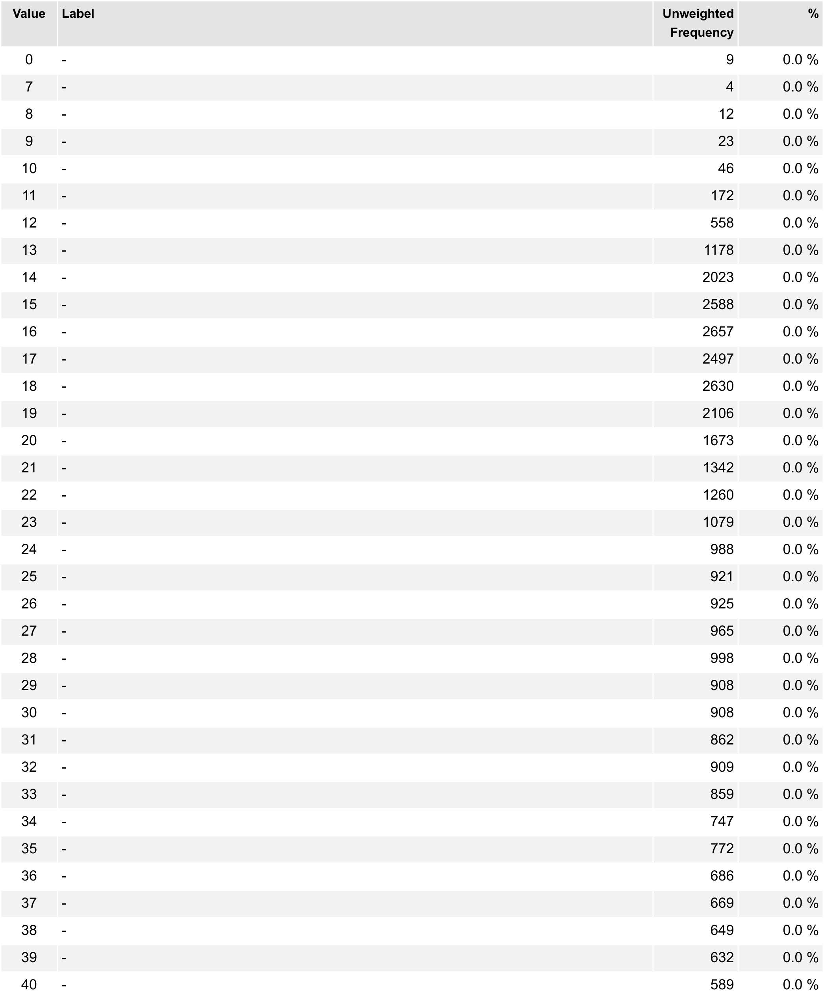

| | Unweighted Frequency | % |
| - | - | - |
| 0 | 9 | 0.0 % |
| 7 | 4 | 0.0 % |
| 8 | 12 | 0.0 % |
| 9 | 23 | 0.0 % |
| 10 | 46 | 0.0 % |
| 11 | 172 | 0.0 % |
| 12 | 558 | 0.0 % |
| 13 | 1178 | 0.0 % |
| 14 | 2023 | 0.0 % |
| 15 | 2588 | 0.0 % |
| 16 | 2657 | 0.0 % |
| 17 | 2497 | 0.0 % |
| 18 | 2630 | 0.0 % |
| 19 | 2106 | 0.0 % |
| 20 | 1673 | 0.0 % |
| 21 | 1342 | 0.0 % |
| 22 | 1260 | 0.0 % |
| 23 | 1079 | 0.0 % |
| 24 | 988 | 0.0 % |
| 25 | 921 | 0.0 % |
| 26 | 925 | 0.0 % |
| 27 | 965 | 0.0 % |
| 28 | 998 | 0.0 % |
| 29 | 908 | 0.0 % |
| 30 | 908 | 0.0 % |
| 31 | 862 | 0.0 % |
| 32 | 909 | 0.0 % |
| 33 | 859 | 0.0 % |
| 34 | 747 | 0.0 % |
| 35 | 772 | 0.0 % |
| 36 | 686 | 0.0 % |
| 37 | 669 | 0.0 % |
| 38 | 649 | 0.0 % |
| 39 | 632 | 0.0 % |
| 40 | 589 | 0.0 % |


```
Unweighted Frequency    %
41                         529                     0.0  %
42                         503                     0.0  %
43                         467                     0.0  %
44                         400                     0.0  %
45                         404                     0.0  %
46                         298                     0.0  %
47                         297                     0.0  %
48                         278                     0.0  %
49                         253                     0.0  %
50                         249                     0.0  %
51                         277                     0.0  %
52                         212                     0.0  %
53                         197                     0.0  %
54                         187                     0.0  %
55                         175                     0.0  %

Missing Data        11165856     99.6  %

Total          11,207,634     100%

Please note that only the first 50 response categories are displayed in the PDF codebook. To view all response categories, please analyze the data file in the statistical package of your choice (SAS, SPSS, Stata, R).

Based upon 41,778 valid cases out of 11,207,634 total cases.

  • Mean: 26.55
  • Median: 23.00
  • Mode: 16.00
  • Minimum: 0.00
  • Maximum: 89.00
  • Standard Deviation: 12.11

Location: 1160-1161 (width: 2; decimal: 0)
Variable Type: numeric
(Range of) Missing Values: -9, -8, -7, -6, -5, .

V60151: SEX OF ARRESTEE - 1
```

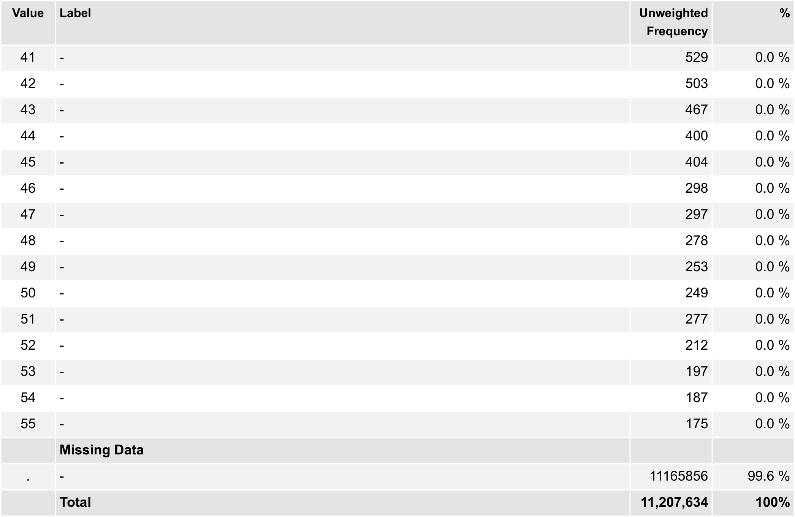

```
Unweighted Frequency    %
0        Female            702816        6.3  %
1        Male             1893262        16.9  %

Missing Data        8611556       76.8  %

Total         11,207,634      100%
```


Based upon 2,596,078 valid cases out of 11,207,634 total cases.

- Minimum: 0.00
- Maximum: 1.00

*Location:* 1162-1163 (width: 2; decimal: 0)  
*Variable Type:* numeric  
*(Range of) Missing Values:* -9, -8, -7, -6, -5, .

---

### V60152: SEX OF ARRESTEE - 2

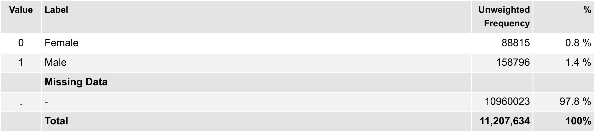

Based upon 247,611 valid cases out of 11,207,634 total cases.

- Minimum: 0.00
- Maximum: 1.00

*Location:* 1164-1165 (width: 2; decimal: 0)  
*Variable Type:* numeric  
*(Range of) Missing Values:* -9, -8, -7, -6, -5, .

---

### V60153: SEX OF ARRESTEE - 3

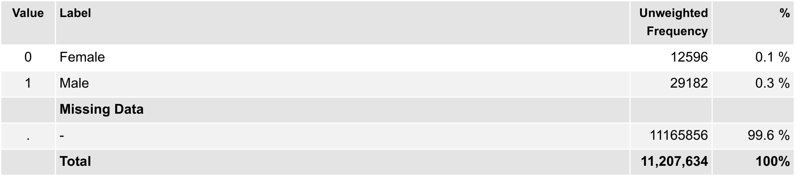

Based upon 41,778 valid cases out of 11,207,634 total cases.

- Minimum: 0.00
- Maximum: 1.00

*Location:* 1166-1167 (width: 2; decimal: 0)  
*Variable Type:* numeric  
*(Range of) Missing Values:* -9, -8, -7, -6, -5, .

---

### V60161: RACE OF ARRESTEE - 1

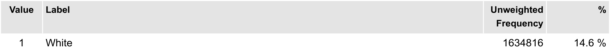


## 362_0.png

|                                       | Unweighted Frequency | %        |
|---------------------------------------|----------------------|----------|
| 2 Black or African American           | 814891               | 7.3 %    |
| 3 American Indian or Alaska Native    | 51713                | 0.5 %    |
| 4 Asian                               | 31340                | 0.3 %    |
| 5 Native Hawaiian or Other Pacific Islander | 10585         | 0.1 %    |
| **Missing Data**                      |                      |          |
| \-7 Unknown/missing/DNR                | 52732                | 0.5 %    |
| .                                     | 8611557              | 76.8 %   |
| **Total**                             | **11,207,634**       | **100%** |

Based upon 2,543,345 valid cases out of 11,207,634 total cases.

- Minimum: 1.00
- Maximum: 5.00

  Location: 1168-1169 (width: 2; decimal: 0)

  Variable Type: numeric

  (Range of) Missing Values: -9, -8, -7, -6, -5, . 

## V60162: RACE OF ARRESTEE - 2

## 362_1.png

|                                       | Unweighted Frequency     | %       |
|---------------------------------------|--------------------------|---------|
| 1 White                               | 152364                   | 1.4 %   |
| 2 Black or African American           | 81634                    | 0.7 %   |
| 3 American Indian or Alaska Native    | 5152                     | 0.0 %   |
| 4 Asian                               | 2556                     | 0.0 %   |
| 5 Native Hawaiian or Other Pacific Islander | 782                 | 0.0 %   |
| **Missing Data**                      |                          |         |
| \-7 Unknown/missing/DNR                | 5123                     | 0.0 %   |
| .                                     | 10960023                 | 97.8 %  |
| **Total**                             | **11,207,634**           | **100%** |

Based upon 242,488 valid cases out of 11,207,634 total cases.

- Minimum: 1.00
- Maximum: 5.00      

  Location: 1170-1171 (width: 2; decimal: 0)

  Variable Type: numeric

  (Range of) Missing Values: -9, -8, -7, -6, -5, .

## V60163: RACE OF ARRESTEE - 3

## 362_2.png

|                                       | Unweighted Frequency      | %     |
|---------------------------------------|---------------------------|-------|
| 1 White                               | 22779                     | 0.2 % |
| 2 Black or African American           | 16451                     | 0.1 % |


#### 363_0.png

|                            | Unweighted Frequency | %      |
|----------------------------|----------------------|--------|
| 3 American Indian or Alaska Native | 1048       | 0.0%   |
| 4 Asian                     | 443                   | 0.0%   |
| 5 Native Hawaiian or Other Pacific Islander | 153       | 0.0%   |
| Missing Data                |                      |        |
| -7 Unknown/missing/DNR      | 904                  | 0.0%   |
| .                           |                      |        |
| Total                       | 11,165,856             | 99.6%  |
|                             | 11,207,634             | 100%   |

Based upon 40,874 valid cases out of 11,207,634 total cases.

- Minimum: 1.00
- Maximum: 5.00

Location: 1172-1173 (width: 2; decimal: 0)
Variable Type: numeric
(Range of) Missing Values: -9, -8 , -7 , -6 , -5 , .

#### V60171: ETHNICITY OF ARRESTEE - 1

#### 363_1.png

|                            | Unweighted Frequency | %      |
|----------------------------|----------------------|--------|
| 0 Not Hispanic or Latino   | 1,762,292            | 15.7%  |
| 1 Hispanic or Latino       | 387,598              | 3.5%   |
| Missing Data               |                      |        |
| -7 Unknown/missing/DNR     | 236,632              | 2.1%   |
| .                          |                      |        |
| Total                      | 8,821,112            | 78.7%  |
|                            | 11,207,634           | 100%   |

Based upon 2,149,890 valid cases out of 11,207,634 total cases.

- Minimum: 0.00
- Maximum: 1.00

Location: 1174-1175 (width: 2; decimal: 0)
Variable Type: numeric
(Range of) Missing Values: -9, -8 , -7 , -6 , -5 , .

#### V60172: ETHNICITY OF ARRESTEE - 2

#### 363_2.png

|                            | Unweighted Frequency | %      |
|----------------------------|----------------------|--------|
| 0 Not Hispanic or Latino   | 170,054              | 1.5%   |
| 1 Hispanic or Latino       | 37,163               | 0.3%   |
| Missing Data               |                      |        |
| -7 Unknown/missing/DNR     | 20,070              | 0.2%   |
| .                          |                      |        |
| Total                      | 10,980,347            | 98.0%  |
|                            | 11,207,634            | 100%   |


Based upon 207,217 valid cases out of 11,207,634 total cases.

- Minimum: 0.00
- Maximum: 1.00

*Location*: 1176-1177 (width: 2; decimal: 0)  
*Variable Type*: numeric  
*Range of Missing Values*: -9, -8, -7, -6, -5, .

---

### V60173: ETHNICITY OF ARRESTEE - 3

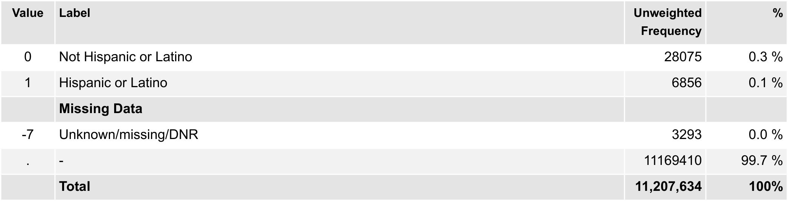

Based upon 34,931 valid cases out of 11,207,634 total cases.

- Minimum: 0.00
- Maximum: 1.00

*Location*: 1178-1179 (width: 2; decimal: 0)  
*Variable Type*: numeric  
*Range of Missing Values*: -9, -8, -7, -6, -5, .

---

### V60181: RESIDENT STATUS OF ARRESTEE - 1

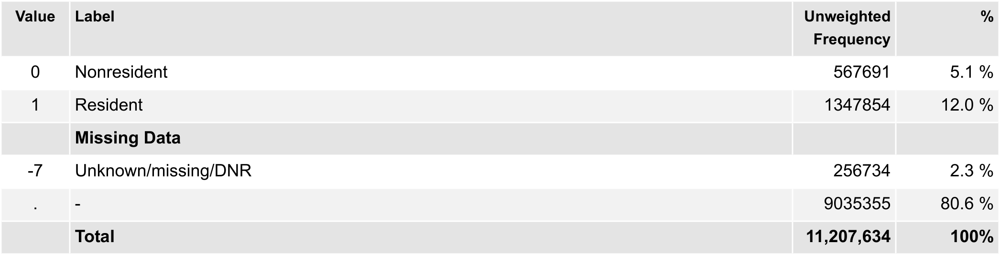

Based upon 1,915,545 valid cases out of 11,207,634 total cases.

- Minimum: 0.00
- Maximum: 1.00

*Location*: 1180-1181 (width: 2; decimal: 0)  
*Variable Type*: numeric  
*Range of Missing Values*: -9, -8, -7, -6, -5, .

---

### V60182: RESIDENT STATUS OF ARRESTEE - 2


## 365_0.png

|                            | Unweighted Frequency | %       |
|----------------------------|----------------------|---------|
| 0 Nonresident              | 65367                | 0.6 %   |
| 1 Resident                 | 119578               | 1.1 %   |
| **Missing Data**           |                      |         |
| -7 Unknown/missing/DNR     | 22393                | 0.2 %   |
| -                          | 11000296             | 98.2 %  |
| **Total**                  | **11,207,634**       | **100%**|

Based upon 184,945 valid cases out of 11,207,634 total cases.

- Minimum: 0.00
- Maximum: 1.00

*Location*: 1182-1183 (width: 2; decimal: 0)  
*Variable Type*: numeric  
*(Range of) Missing Values*: -9, -8, -7, -6, -5, .

## 365_1.png

|                            | Unweighted Frequency | %       |
|----------------------------|----------------------|---------|
| 0 Nonresident              | 10811                | 0.1 %   |
| 1 Resident                 | 20376                | 0.2 %   |
| **Missing Data**           |                      |         |
| -7 Unknown/missing/DNR     | 3622                 | 0.0 %   |
| -                          | 11172825             | 99.7 %  |
| **Total**                  | **11,207,634**       | **100%**|

Based upon 31,187 valid cases out of 11,207,634 total cases.

- Minimum: 0.00
- Maximum: 1.00

*Location*: 1184-1185 (width: 2; decimal: 0)  
*Variable Type*: numeric  
*(Range of) Missing Values*: -9, -8, -7, -6, -5, .

## 365_2.png

|                    | Unweighted Frequency | %       |
|--------------------|----------------------|---------|
| 0 Referred         | 145656               | 1.3 %   |
| 1 Handled          | 60718                | 0.5 %   |
| **Missing Data**   |                      |         |
| -                  | 11001260             | 98.2 %  |
| **Total**          | **11,207,634**       | **100%**|

Based upon 206,374 valid cases out of 11,207,634 total cases.


• Minimum: 0.00
• Maximum: 1.00

*Location*: 1186-1187 (width: 2; decimal: 0)
*Variable Type*: numeric
*(Range of) Missing Values*: -9, -8, -7, -6, -5, .

---

## V60192: DISPOSITION OF ARRESTEE UNDER 18 - 2

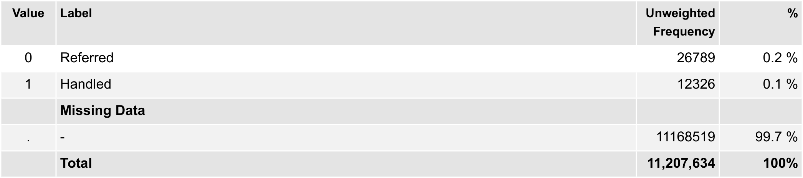

Based upon 39,115 valid cases out of 11,207,634 total cases.

• Minimum: 0.00
• Maximum: 1.00

*Location*: 1188-1189 (width: 2; decimal: 0)
*Variable Type*: numeric
*(Range of) Missing Values*: -9, -8, -7, -6, -5, .

---

## V60193: DISPOSITION OF ARRESTEE UNDER 18 - 3

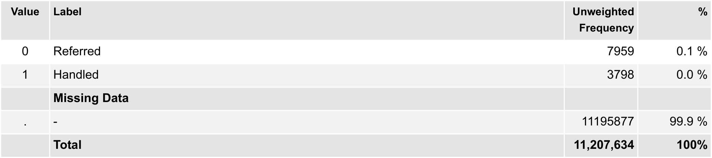

Based upon 11,757 valid cases out of 11,207,634 total cases.

• Minimum: 0.00
• Maximum: 1.00

*Location*: 1190-1191 (width: 2; decimal: 0)
*Variable Type*: numeric
*(Range of) Missing Values*: -9, -8, -7, -6, -5, .

---

## ALLOFNS: ALL OFFENSE CODES FOR THE INCIDENT

Based upon 11,207,634 valid cases out of 11,207,634 total cases.

*Location*: 1192-1226 (width: 35; decimal: 0)
*Variable Type*: character
